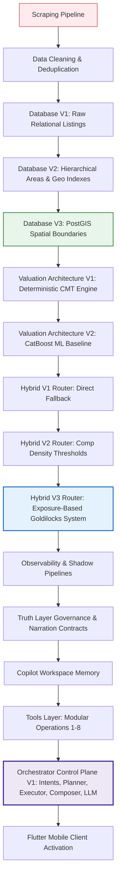

# 01. Project Evolution Timeline & Historical Reconstruction

This document reconstructs the real engineering history of the ValorAI project. Through a forensic audit of the codebase, commit remnants, legacy structures, database migrations, and validation reports, we map the trajectory of the platform's architectural evolution.



---

## 1. Original Architecture (Phase 1: Raw Data Ingestion)
The project began as an investigatory scraping utility to capture real estate supply and listing dynamics in Egypt. It was not originally designed as an interactive agentic system or a co-pilot; it was a batch-oriented ETL pipeline designed to scrape properties and construct market matrices.

### The Scraping Pipeline
* **Source Code:** [egy_scraper.py](file:///c:/Users/mh978/Downloads/mobile%20computing%20project/pf_scraper/pf_scraper/egy_scraper.py) & [parser.py](file:///c:/Users/mh978/Downloads/mobile%20computing%20project/pf_scraper/pf_scraper/parser.py)
* **Design Goal:** Pull listing JSON blocks from the `__NEXT_DATA__` script tag embedded in server-side rendered HTML from PropertyFinder Egypt.
* **Extraction Strategy:** Utilizes a session-based HTTP crawler that walks search pages (`set_page` query parameter manipulation) and parses nested JSON fields to construct `ParsedProperty` and `ParsedProject` structures.
* **Legacy Constraints:** Raw scraped outputs were written to JSONL files (e.g. `data_v1.jsonl`, `rent_3pages.jsonl`). 

### The Cleaning Pipeline
* **Source Code:** [01_clean_all.py](file:///c:/Users/mh978/Downloads/mobile%20computing%20project/pf_scraper/01_clean_all.py)
* **Validation Evidence:** Cleaned output prints: `✅ rent: 20490 -> 16730 rows`.
* **Heuristic Rules:**
  1. Mandatory price: Drops listings without prices or with placeholder values ($P_{EGP} \le 100$ EGP).
  2. Geographic bounds: Enforces latitude $[22.0, 32.5]$ and longitude $[24.0, 36.0]$ to restrict listings to Egypt.
  3. Size sanity: Bounded between $5$ sqm and $10,000$ sqm.
  4. Deduplication: Enforces ID uniqueness while parsing `__NEXT_DATA__` list items.
  5. Studio classification: Title checks for "studio" or "ستوديو" reset bedroom counts to `0`.

---

## 2. Database Evolution Stages
The database model evolved across three distinct versions to handle complex geographic queries, coordinate resolution, and co-pilot workspace persistence.

### Database V1 (Legacy Relational)
* **Evidence:** [areas.sql](file:///c:/Users/mh978/Downloads/mobile%20computing%20project/pf_scraper/fair-price-eg/backend/app/db/sql/areas.sql) & [init.sql](file:///c:/Users/mh978/Downloads/mobile%20computing%20project/pf_scraper/fair-price-eg/backend/app/db/sql/init.sql)
* **Architecture:** Flat listings records linked to flat location identifiers. Search was based on raw text compound names or matching string names.
* **Limitations:** Spatial containment could not be validated; calculations of distance were computed offline in Python, which caused high latency.

### Database V2 (Hierarchical Areas)
* **Evidence:** `areas` table with recursive `parent_area_id` matching in [init.sql](file:///c:/Users/mh978/Downloads/mobile%20computing%20project/pf_scraper/fair-price-eg/backend/app/db/sql/init.sql#L12)
* **Architecture:** Introduced the parent-child adjacency hierarchy (`Governorate (Level 1) -> City (Level 2) -> District (Level 3) -> Neighborhood/Compound (Level 4)`).
* **Business Benefit:** Standardized location entries. Allowed geofence expansions (e.g. searching adjacent district centers if leaf-level listings were scarce).

### Database V3 (PostGIS Integration)
* **Evidence:** `CREATE EXTENSION IF NOT EXISTS postgis;` in [init.sql](file:///c:/Users/mh978/Downloads/mobile%20computing%20project/pf_scraper/fair-price-eg/backend/app/db/sql/init.sql#L1) and indices `ix_listings_geom_gist`, `ix_areas_geom_gist` in [init.sql](file:///c:/Users/mh978/Downloads/mobile%20computing%20project/pf_scraper/fair-price-eg/backend/app/db/sql/init.sql#L133-L136).
* **Architecture:** Geometries are stored as native geometries (MultiPolygon for `areas`, Point for `listings` in SRID 4326).
* **Business Benefit:** Allows exact polygon containment queries (`ST_Covers`) and distance bounding queries (`ST_DWithin`, `ST_Distance`). This eliminated coordinate-to-neighborhood errors (e.g., comparing New Cairo listings to Maadi due to simple radius overlaps).

---

## 3. Valuation Architecture Evolution
Before merging into the final hybrid model, both deterministic and statistical modeling paths were separately implemented and tested.

### Valuation V1 (Comparable Market Technique - CMT)
* **Source Files:** [valuation_service.py](file:///c:/Users/mh978/Downloads/mobile%20computing%20project/pf_scraper/fair-price-eg/backend/app/services/valuation_service.py) & [selector.py](file:///c:/Users/mh978/Downloads/mobile%20computing%20project/pf_scraper/fair-price-eg/backend/app/comps/selector.py)
* **Calculations:** Bounded search queries sweep Tiers 1-5 inside a PostGIS database. Outliers are pruned using Median Absolute Deviation (MAD). Similarity scores apply decay weight products (distance, age, size, bedrooms, bathrooms). Prices are resolved via a weighted median.
* **Limitations:** If zero comps were found in Tier 5 (15km radius), the engine failed and returned `INSUFFICIENT_DATA`.

### Valuation V2 (Machine Learning Regression)
* **Source Files:** [ml_service.py](file:///c:/Users/mh978/Downloads/mobile%20computing%20project/pf_scraper/fair-price-eg/backend/app/services/ml_service.py) & [residential_rent.cbm](file:///c:/Users/mh978/Downloads/mobile%20computing%20project/pf_scraper/fair-price-eg/backend/app/models/residential_rent.cbm)
* **Calculations:** A CatBoost regressor uses categorical and spatial features (coordinates, H3 index cells, size, room counts). Target prices are log-transformed ($y = \ln(price + 1)$) to stabilize variance. SHAP values are extracted during inference to identify positive and negative drivers.
* **Limitations:** The model could output arbitrary values in cold-start regions or hallucinate prices for unique luxury properties without spatial constraints.

---

## 4. Hybrid System & Router Evolution
The development of the hybrid router represents the most critical pivot in the system's history, designed to merge the local accuracy of CMT with the interpolation strength of ML.

### Hybrid V1 (Direct Fallback)
* **Failed Design:** The router ran CMT first. If CMT failed (returned 0 comps), it triggered ML.
* **Failure Mode:** If CMT returned 1 to 5 highly stale listings, it valued the property based on insufficient data, resulting in highly distorted values instead of falling back to ML.

### Hybrid V2 (Density Thresholds)
* **Failed Design:** The router evaluated CMT and ML based purely on a raw threshold ($N \ge 10$ comps). If $N \ge 10$, use CMT; otherwise, use ML.
* **Failure Mode:** In high-density districts (e.g. Madinaty with 700+ comps), evaluating CMT took up to 300ms of CPU time sorting, scoring, and filtering, causing API response times to spike.

### Hybrid V3 (Geographic Exposure & Goldilocks Routing)
* **Final Approved Design:** [router_service.py:21-34](file:///c:/Users/mh978/Downloads/mobile%20computing%20project/pf_scraper/fair-price-eg/backend/app/services/router_service.py#L21-L34)
* **Architecture:**
  1. Checks H3 index and compound name against a pre-compiled `exposure_registry.json`.
  2. Resolves exposure as "seen" or "unseen".
  3. Evaluates rules:
     - **Goldilocks Zone:** If $11 \le comps \le 50$, route directly to CMT. CMT is highly accurate and fast at this density.
     - **Unseen with Sufficient Comps:** If a compound/hex cell is unseen but has $\ge 10$ comps, route to CMT.
     - **Default to ML:** If density is extremely high ($>50$) or extremely low ($<11$ and seen), route to CatBoost ML. ML interpolates and scales efficiently.
* **Observation & Shadow Pipelines:** Implements background shadow execution (`execute_shadow_pipeline` in [monitoring_service.py](file:///c:/Users/mh978/Downloads/mobile%20computing%20project/pf_scraper/fair-price-eg/backend/app/services/monitoring_service.py#L31)). If CMT is selected, ML runs in the background and vice versa. Telemetry is persisted to `shadow_logs` to audit model drift.

---

## 5. Agentic Orchestrator Activation (Phase 5.5)
The introduction of the conversational co-pilot required a fully governed orchestrator layer to manage session states and enforce safety rules.

```
Conversational Request
      │
      ▼
1. Intent Engine (app/copilot/orchestrator/intents/engine.py)
      │ Classifies user message to predefined taxonomy
      ▼
2. Tool Planner (app/copilot/orchestrator/planner/planner.py)
      │ Maps intent to execution sequence (Tools 1-8)
      ▼
3. Tool Executor (app/copilot/orchestrator/executor/executor.py)
      │ Securely executes Tools in parallel or sequence
      ▼
4. Response Composer (app/copilot/orchestrator/composer/composer.py)
      │ Normalizes payloads, executes delta arithmetic, compresses Top-N
      ▼
5. LLM Narrator (app/copilot/orchestrator/llm/)
      │ Streams natural language response using grounded context
      ▼
Grounded Output (Citations & Traces)
```

### Key Components of the Orchestrator
1. **RuleBasedIntentEngine:** Matches user messages to a strict taxonomy (`VALUATION`, `EXPLAINABILITY`, `FAIRNESS`, `WHAT_IF`, etc.) to prevent prompt injection.
2. **DeterministicToolPlanner:** Constructs the tool execution graph based on resolved intents.
3. **DeterministicToolExecutor:** Executes tool calls in parallel using thread executors to minimize latency.
4. **DeterministicResponseComposer:** Implements output normalization, delta calculations (e.g. comparing Property A to Property B natively in Python), and arrays compression (Top-N truncation).
5. **DeterministicMemoryIntegration:** Manages conversation history (`chats`, `messages`) and scenario tracking under a secure multi-tenancy model (`workspace_id`).
6. **CopilotOrchestratorLLM:** Interacts with language models to narrate the composed context under strict prompt instructions (e.g., forbidding the LLM from executing arithmetic).

### Summary of System Replaced
* **Legacy System:** An ungrounded chatbot prototype that called Gemini/OpenAI APIs directly with raw data inputs, which was prone to hallucinations.
* **Final System:** A governed orchestrator backed by the `TruthLayer` (Tools 1-8). If the LLM generates claims that violate the composed context or lack citations, the system defaults to a deterministic JSON fallback (`DETERMINISTIC_FALLBACK`).
