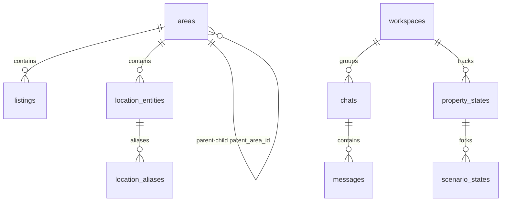

# 03. Database Forensics & Schema Map

This document presents a comprehensive audit of the database layer. The platform relies on a dual-schema architecture: a Core Valuation layer utilizing PostGIS spatial features and a Copilot Workspace Memory layer mapped via SQLAlchemy ORM.

---

## 1. Schema DDL Analysis
The database is built on PostgreSQL 15 with the PostGIS spatial extension. Below is the structure and analysis of the active tables, indexes, and constraints.

### Core Valuation Schema
Defined in [init.sql](file:///c:/Users/mh978/Downloads/mobile%20computing%20project/pf_scraper/fair-price-eg/backend/app/db/sql/init.sql).



#### 1. Table Name: `areas`
* **Purpose:** Represents the hierarchical administrative boundaries of Egypt.
* **Columns:**
  - `area_id`: `BIGSERIAL` (Primary Key).
  - `name`: `TEXT` (Not Null).
  - `level`: `SMALLINT` (Not Null, Checked between 1 and 4: 1=governorate, 2=city, 3=district, 4=compound/neighborhood).
  - `parent_area_id`: `BIGINT` (Nullable Foreign Key referencing `areas(area_id)`).
  - `geom`: `geometry(MultiPolygon, 4326)` (Nullable spatial shape).
  - `center_geom`: `geometry(Point, 4326)` (Not Null spatial centroid).
  - `fallback_radius_m`: `INTEGER` (Nullable fallback radius).
* **Constraints:**
  - `ck_areas_level`: `CHECK (level BETWEEN 1 AND 4)`
  - `ck_areas_parent_not_self`: `CHECK (parent_area_id IS NULL OR parent_area_id <> area_id)`
  - `fk_areas_parent`: `FOREIGN KEY (parent_area_id) REFERENCES areas(area_id) ON UPDATE CASCADE ON DELETE RESTRICT`
* **Indexes:**
  - `ux_areas_parent_level_name`: `UNIQUE INDEX ON areas (COALESCE(parent_area_id, 0), level, lower(name))` (Prevents duplicate labels within the same branch).
  - `ix_areas_parent`: `INDEX ON areas(parent_area_id)` (Speeds up recursive CTE parent walks).
  - `ix_areas_center_gist`: `INDEX ON areas USING gist(center_geom)` (Spatial indexing on point centroids).
  - `ix_areas_center_geog_gist`: `INDEX ON areas USING gist((center_geom::geography))` (Geographical distance indexing).
  - `ix_areas_geom_gist`: `INDEX ON areas USING gist(geom) WHERE geom IS NOT NULL` (Spatial index on MultiPolygon shapes).

#### 2. Table Name: `listings`
* **Purpose:** Stores comparable property listings imported from scraper pipelines.
* **Columns:**
  - `listing_id`: `TEXT` (Primary Key).
  - `category`: `TEXT` (Not Null, e.g. `'rent'`, `'buy'`).
  - `period`: `TEXT` (Not Null, e.g. `'monthly'`, `'sale'`).
  - `price_egp`: `INTEGER` (Not Null, Checked $>0$).
  - `property_type`: `TEXT` (Not Null).
  - `bedrooms`: `SMALLINT` (Nullable).
  - `bathrooms`: `SMALLINT` (Nullable).
  - `size_sqm`: `NUMERIC(8,2)` (Nullable).
  - `location_text`: `TEXT` (Nullable).
  - `lat`: `DOUBLE PRECISION` (Not Null).
  - `lng`: `DOUBLE PRECISION` (Not Null).
  - `geom`: `geometry(Point, 4326)` (Not Null spatial coordinates).
  - `area_id`: `BIGINT` (Not Null, Foreign Key).
  - `scraped_at_utc`: `TIMESTAMPTZ` (Not Null).
  - `images_count`: `SMALLINT` (Default 0).
  - `amenities`: `JSONB` (Default `[]`).
  - `normalized_amenities`: `JSONB` (Default `[]`).
  - `unknown_amenity_codes`: `JSONB` (Default `[]`).
  - `furnishing_status`: `TEXT` (Nullable).
  - `floor_number`: `SMALLINT` (Nullable).
  - `compound_name`: `TEXT` (Nullable).
  - `view_type`: `TEXT` (Nullable).
  - `building_quality`: `TEXT` (Nullable).
  - `feature_raw`: `JSONB` (Default `{}`).
* **Constraints:**
  - `fk_listings_area_id`: `FOREIGN KEY (area_id) REFERENCES areas(area_id) ON UPDATE CASCADE ON DELETE RESTRICT` (Prevents orphan listings).
* **Indexes:**
  - `ix_listings_geom_gist`: `INDEX ON listings USING gist(geom)` (Spatial indexing for distance queries).
  - `ix_listings_geom_geog_gist`: `INDEX ON listings USING gist((geom::geography))` (Geographical radius calculations).
  - `ix_listings_category_period_area`: `INDEX ON listings(category, period, area_id)` (Speeds up basic category filters).
  - `ix_listings_area_type_bedrooms`: `INDEX ON listings(area_id, property_type, bedrooms)` (Optimizes exact matching constraints).
  - `ix_listings_match_area_recency`: `INDEX ON listings(category, period, property_type, bedrooms, area_id, scraped_at_utc DESC)` (Optimizes the spatial search sorting).
  - `ix_listings_scraped_at_utc`: `INDEX ON listings(scraped_at_utc)` (Optimizes time-based queries).
  - `ix_listings_amenities_gin`: `INDEX ON listings USING gin(amenities)` (GIN index for array-based tags).
  - `ix_listings_normalized_amenities_gin`: `INDEX ON listings USING gin(normalized_amenities)` (GIN index for standardized codes).

#### 3. Table Name: `address_resolution_cache`
* **Purpose:** Caches address input coordinates to prevent redundant geocoding API requests.
* **Primary Key:** `id` (`BIGSERIAL`).
* **Indexes:**
  - `ix_address_resolution_cache_input`: `INDEX ON address_resolution_cache(lower(raw_input))` (Case-insensitive typeahead lookup).
  - `ux_address_resolution_cache_normalized_version`: `UNIQUE INDEX ON address_resolution_cache(normalized_input, resolver_version)` (Prevents duplicate normalization cache entries).

#### 4. Table Name: `location_entities`
* **Purpose:** Stores authoritative geography centroids (compounds, landmarks, cities, districts).
* **Primary Key:** `entity_id` (`TEXT`).
* **Foreign Key:** `canonical_area_id` references `areas(area_id)`.

#### 5. Table Name: `location_aliases`
* **Purpose:** Maps common typos and synonyms to canonical location entities.
* **Foreign Key:** `entity_id` references `location_entities(entity_id)`.

---

## 2. Copilot Schema Migration Analysis
The Copilot Workspace tables are defined in the Alembic upgrade script:
* **Migration Revision:** `c66d987da7fa`
* **Source File:** [c66d987da7fa_add_copilot_tables.py](file:///c:/Users/mh978/Downloads/mobile%20computing%20project/pf_scraper/fair-price-eg/backend/alembic/versions/c66d987da7fa_add_copilot_tables.py)

```sql
-- Upgrades executed in order:
CREATE TABLE workspaces (
    id SERIAL PRIMARY KEY,
    name VARCHAR(255) NOT NULL,
    created_at TIMESTAMP WITH TIME ZONE DEFAULT NOW() NOT NULL
);

CREATE TABLE chats (
    id SERIAL PRIMARY KEY,
    workspace_id INTEGER NOT NULL REFERENCES workspaces(id),
    title VARCHAR(255) NOT NULL,
    created_at TIMESTAMP WITH TIME ZONE DEFAULT NOW() NOT NULL
);

CREATE TABLE property_states (
    id SERIAL PRIMARY KEY,
    workspace_id INTEGER NOT NULL REFERENCES workspaces(id),
    location VARCHAR(255) NOT NULL,
    area DOUBLE PRECISION NOT NULL,
    bedrooms INTEGER NOT NULL,
    bathrooms INTEGER NOT NULL,
    amenities JSON NOT NULL,
    created_at TIMESTAMP WITH TIME ZONE DEFAULT NOW() NOT NULL
);

CREATE TABLE messages (
    id SERIAL PRIMARY KEY,
    chat_id INTEGER NOT NULL REFERENCES chats(id),
    role VARCHAR(50) NOT NULL,
    content TEXT NOT NULL,
    created_at TIMESTAMP WITH TIME ZONE DEFAULT NOW() NOT NULL
);

CREATE TABLE scenario_states (
    id SERIAL PRIMARY KEY,
    property_state_id INTEGER NOT NULL REFERENCES property_states(id),
    name VARCHAR(255) NOT NULL,
    modifications JSON NOT NULL,
    delta_value DOUBLE PRECISION,
    created_at TIMESTAMP WITH TIME ZONE DEFAULT NOW() NOT NULL
);
```

### Table Relations and Logic
1. `workspaces`: Enforces tenant segregation. Users can create multiple workspaces to group their real estate portfolios.
2. `chats`: Holds user threads. Every chat is bounded by a `workspace_id`.
3. `messages`: Stores historical transcript strings (roles: `'user'`, `'assistant'`).
4. `property_states`: Standardizes subject property configurations (location, area size, bed/bath count, and amenities).
5. `scenario_states`: Manages what-if overlays (e.g. adding covered parking or resizing a floor layout). Links to a `property_state_id` to compute valuation deltas.

---

## 3. Telemetry and Logging Schemas
To monitor pricing reliability and log model predictions, the backend implements two operational logging tables.

#### 1. Table Name: `prediction_logs`
* **Purpose:** Logs every valuation request and its routing/pricing output.
* **Columns:**
  - `id`: `BIGSERIAL` (Primary Key).
  - `request_id`: `VARCHAR(120)` (Unique trace ID).
  - `price`: `NUMERIC(18,2)` (Valuation output).
  - `engine`: `VARCHAR(120)` (`'CMT'` or `'ML'`).
  - `routing_decision`: `VARCHAR(255)` (Details the selected routing rule, e.g. `'GoldilocksZone'`).
  - `lat`, `lng`: `DOUBLE PRECISION` (Coordinates resolved).
  - `property_type`: `VARCHAR(120)`.
  - `size_sqm`: `DOUBLE PRECISION`.
  - `compound`: `VARCHAR(255)`.
  - `h3_res9`: `VARCHAR(32)` (H3 index code).
  - `created_at`: `TIMESTAMPTZ` (Timestamp).

#### 2. Table Name: `shadow_logs`
* **Purpose:** Telemetry logger comparing active and shadow predictions.
* **Columns:**
  - `id`: `BIGSERIAL` (Primary Key).
  - `request_id`: `VARCHAR(120)`.
  - `actual_response`: `NUMERIC(18,2)` (Active returned price).
  - `router_prediction`: `NUMERIC(18,2)` (Target valuation price).
  - `ml_prediction`: `NUMERIC(18,2)` (ML estimated price).
  - `cmt_prediction`: `NUMERIC(18,2)` (CMT estimated price).
  - `engine_used`: `VARCHAR(120)` (Active engine).
  - `routing_reason`: `VARCHAR(255)` (Routing rule applied).
  - `comparable_count`: `INTEGER` (Number of comparables found).
  - `confidence_score`: `DOUBLE PRECISION`.
  - `compound_name`: `VARCHAR(255)`.
  - `h3_res9`: `VARCHAR(32)`.
  - `created_at`: `TIMESTAMPTZ`.

---

## 4. Performance & Query Optimization Analysis
* **Recursive Areas Walk:** The CTE search walks parent references (`parent_area_id`). The unique index `ux_areas_parent_level_name` and the foreign key index `ix_areas_parent` prevent table scans, executing parent lookups in under 1ms.
* **Geographical Search Limits:** The primary comparable lookup query resolves coordinates to points and bounds listings using `ST_DWithin` on GIST index shapes. In high-density cells, querying is optimized by limiting the search to the nearest leaf area index matching the property type and bedroom constraints.
* **Unindexed Foreign Key Risk:** The foreign key `listings(area_id)` references `areas(area_id)`. While there is an index `ix_listings_category_period_area` covering `area_id` as the third key, a standalone B-tree index on `listings(area_id)` would improve join performance during recursive parent updates.
* **GIN Indexing on Amenities:** `ix_listings_normalized_amenities_gin` allows fast checks for matching amenity codes:
  ```sql
  WHERE normalized_amenities @> '["CP"]'::jsonb
  ```
  This speeds up amenity containment filters on large datasets, preventing sequential scans.
