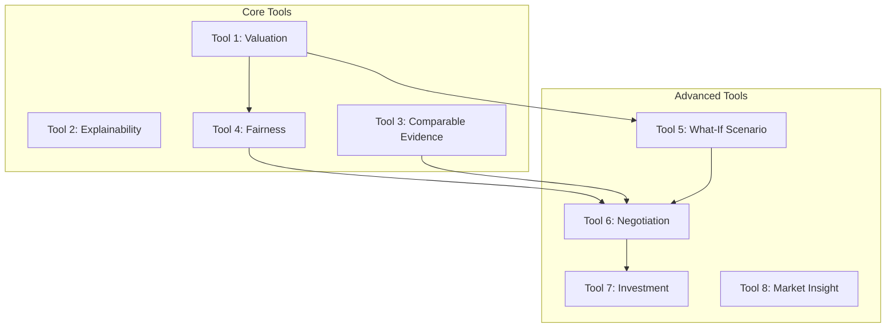

# 10. Tools Layer (Functional Specifications)

This document provides functional specifications for Tools 1-8 of the platform. The Tools Layer acts as the core interface of the platform, encapsulating business logic, geospatial retrievals, and math functions into modular tools.

---

## Tool 1: Valuation Tool (`execute_valuation`)
* **Purpose:** Computes the fair price estimate and price range bounds for a property, resolving the valuation engine routing (CMT vs ML).
* **Inputs:**
  - `workspace_id` (Integer).
  - `property_id` (Integer).
  - `scenario_id` (Integer, Optional).
  - `target_price_egp` (Integer, Optional).
  - `sandbox_modifications` (Dict, Optional).
* **Outputs:**
  - `valuation_id`: Unique trace ID.
  - `fair_price`: P50 estimated price in EGP.
  - `price_range`: `{"low": P20, "high": P80}`.
  - `confidence_level`: `'High'`, `'Medium'`, or `'Low'`.
  - `engine_used`: `'CMT'` or `'ML'`.
  - `routing_reason`: Specific rule applied.
  - `timestamp`.
* **Dependencies:** `price_listing_router` (`router_service.py`), which calls either CMT (`valuation_service.py`) or ML (`ml_service.py`).
* **Business Value:** Serves as the core pricing engine, resolving the fair market price of a property within a workspace context.

---

## Tool 2: Explainability Tool (`execute_explainability`)
* **Purpose:** Generates a structured narrative explanation of a property's valuation.
* **Inputs:**
  - `workspace_id` (Integer).
  - `valuation_id` (String).
* **Outputs:**
  - `valuation_id`.
  - `summary`: Structural description.
  - `why_this_price`: Core narrative rationale.
  - `strongest_factors`: Features driving the price.
  - `confidence_reason`.
  - `fairness_status`.
  - `feature_drivers` (SHAP list).
  - `comparable_evidence` (Comps list).
  - `timestamp`.
* **Dependencies:** `ValuationSnapshot` table (retrieves the cached explainability payload).
* **Business Value:** Provides transparency for valuation estimates, helping users understand why a property was valued at a specific price.

---

## Tool 3: Comparable Tool (`execute_comparable`)
* **Purpose:** Retrieves the verified comparable listings that influenced a property's valuation.
* **Inputs:**
  - `workspace_id` (Integer).
  - `property_id` (Integer).
  - `scenario_id` (Integer, Optional).
  - `valuation_id` (String, Optional).
* **Outputs:**
  - `valuation_id`.
  - `comparable_count` (Integer).
  - `comparables`: List of properties including size, bedrooms, bathrooms, distance, price, and similarity reasons.
  - `timestamp`.
* **Dependencies:** `ValuationSnapshot` table or triggers `execute_valuation` to generate a new snapshot.
* **Business Value:** Provides concrete market proof to back up valuations, building trust with buyers and sellers.

---

## Tool 4: Fairness Tool (`execute_fairness`)
* **Purpose:** Evaluates whether a target asking price is fair relative to the estimated price range.
* **Inputs:**
  - `workspace_id` (Integer).
  - `property_id` (Integer).
  - `scenario_id` (Integer, Optional).
  - `target_price_egp` (Integer).
  - `valuation_id` (String, Optional).
* **Outputs:**
  - `valuation_id`.
  - `fair_price`: P50 estimated price in EGP.
  - `target_price`: Price checked.
  - `fairness_status`: `'Below Fair Value'`, `'Within Fair Value'`, or `'Above Fair Value'`.
  - `confidence_level`, `confidence_reason`, `timestamp`.
* **Dependencies:** `ValuationSnapshot` table or triggers `execute_valuation` with `target_price_egp`.
* **Business Value:** Helps buyers and investors identify underpriced opportunities and overpriced listings.

---

## Tool 5: What-If Tool (`execute_what_if`)
* **Purpose:** Simulates how changes to a property's physical characteristics or amenities would affect its valuation.
* **Inputs:**
  - `workspace_id` (Integer).
  - `property_id` (Integer).
  - `scenario_id` (Integer, Optional).
  - `modifications` (Dict, containing changes to size, bedrooms, bathrooms, amenities, views, quality).
* **Outputs:**
  - `base_valuation`, `scenario_valuation` (EGP).
  - `base_valuation_id`, `scenario_valuation_id`.
  - `delta_value` (Absolute difference).
  - `delta_percentage` (Percentage difference).
  - `fairness_status`.
  - `assumptions_used` (List of unchanged features flagged as unknown assumptions).
  - `feature_changes` (Details of added, removed, or modified features).
  - `explainability`, `comparables`, `timestamp`.
* **Dependencies:** Triggers `execute_valuation` twice: first to establish the baseline price, and second with the sandbox modifications applied.
* **Business Value:** Helps property owners evaluate renovation ROI (e.g. "What is the value impact of adding an extra bathroom?").

---

## Tool 6: Negotiation Tool (`execute_negotiation`)
* **Purpose:** Recommends target counter-offers and generates negotiation talking points for agents.
* **Inputs:**
  - `workspace_id` (Integer).
  - `property_id` (Integer).
  - `scenario_id` (Integer, Optional).
  - `asking_price_egp` (Integer).
  - `what_if_modifications` (Dict, Optional).
* **Outputs:**
  - `valuation_id`, `asking_price`, `fair_price`.
  - `price_gap` (Absolute difference), `price_gap_percentage`.
  - `negotiation_position`: `'Strong Buy Opportunity'`, `'Overpriced'`, `'Fair Market Position'`, `'Premium Justified'`, or `'Negotiation Recommended'`.
  - `recommended_offer_band`: Bounded counter-offer range.
    - If asking price is *Below* or *Within* fair value: Low and high endpoints default to the authoritative `fair_price`.
    - If asking price is *Above* fair value: Low endpoint is set to the highest comparable price at or below the fair price; high endpoint is set to the fair price.
  - `broker_talking_points`: List of claims linked to citations.
  - `risk_notes`: System limitations and warnings.
  - `timestamp`.
* **Dependencies:** Integrates output from Tool 1 (Valuation), Tool 2 (Explainability), Tool 3 (Comparables), Tool 4 (Fairness), and Tool 5 (What-If).
* **Business Value:** Provides real estate agents with structured, data-backed counter-offers and talking points.

---

## Tool 7: Investment Tool (`execute_investment`)
* **Purpose:** Synthesizes negotiation, pricing, and risk data to evaluate the feasibility of an investment.
* **Inputs:**
  - `workspace_id` (Integer).
  - `property_id` (Integer).
  - `scenario_id` (Integer, Optional).
  - `asking_price_egp` (Integer).
  - `what_if_modifications` (Dict, Optional).
* **Outputs:**
  - `valuation_id`, `asking_price`, `fair_price`.
  - `investment_position`: `'Strong Opportunity'`, `'Moderate Opportunity'`, `'High Risk'`, `'Fairly Priced'`, or `'Caution'`.
  - `investment_summary`.
  - `strengths`: Positives driving the investment (e.g., high confidence, discount to fair price).
  - `risks`: Potential issues (e.g., sparse data, premium asking price).
  - `negotiation_summary`, `what_if_summary`, `timestamp`.
* **Dependencies:** Wraps Tool 6 (Negotiation), executing the entire upstream tool chain.
* **Business Value:** Provides investors with structured risk and feasibility analysis for a property.

---

## Tool 8: Market Insight Tool (`execute_market_insight`)
* **Purpose:** Computes aggregate analytics across all valuation snapshots saved in a workspace.
* **Inputs:**
  - `workspace_id` (Integer).
  - `time_window` (String, Optional, e.g. `'30d'`, `'all'`).
  - `compound_name` (String, Optional).
  - `h3_res9` (String, Optional).
  - `property_type` (String, Optional).
* **Outputs:**
  - `market_summary`.
  - `valuation_volume`: Total count of snapshots matched.
  - `confidence_distribution`: Counts of valuations by confidence level.
  - `fair_value_distribution`: Minimum, median, and maximum fair prices.
  - `comparable_density`: Comparable counts and source tracking.
  - `active_compounds`, `active_areas`: List of segments with valuation volumes and median prices.
  - `evidence_summary`: Traceability details linking to snapshots.
  - `data_sources_used`, `timestamp`.
* **Dependencies:** Queries the `valuation_snapshots`, `prediction_logs`, and `shadow_logs` tables filtered by the workspace context.
* **Business Value:** Provides portfolio managers with aggregate market trends and valuation statistics across their workspace properties.
