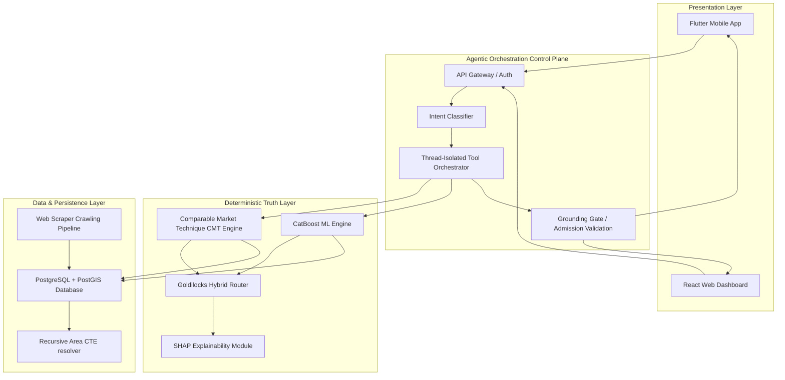

# ValoryAI: Governed Agentic Real Estate Valuation Platform

ValoryAI is a production-grade, governed agentic intelligence platform designed for spatial analysis, valuation modeling, and conversational reasoning in emerging real estate markets. Built specifically for complex and unstructured property markets (such as Egypt), ValoryAI addresses the key risk of conversational AI in transactions: the direct coupling of Large Language Models (LLMs) to mathematical computations and database queries.

---

## 1. System Architecture

ValoryAI enforces a strict separation of concerns between reasoning and computation. Language models do not calculate valuations or perform database searches. Instead, they act as a controlled presentation layer, narrating verified facts calculated by deterministic backend services written in Python and PostgreSQL/PostGIS.



---

## 2. Core Features

- **Goldilocks Hybrid Router**: A density-aware routing service mapping coordinates to H3 spatial grid cells and dynamically selecting between a statistical CMT model and a CatBoost ML model based on geographic data exposure.
- **Comparable Market Technique (CMT) Engine**: Replicates professional real estate appraisals. Sequentially queries spatial tiers (Compound $\rightarrow$ District $\rightarrow$ City) until a target sample size ($N \ge 40$) is met, filtering outliers using Median Absolute Deviation (MAD).
- **SHAP Explainability Framework**: Translates CatBoost ML log-space predictions back to EGP price adjustments, identifying feature drivers (rooms, area size, compound value) for transparency.
- **Hierarchical PostGIS Resolvers**: Resolves coordinate containment within parent-child administrative boundaries in under 10ms using recursive geospatial CTEs.
- **Orchestration Control Plane**: Coordinates natural language intent mapping, thread-isolated database sessions, and runs output grounding validation gates to prevent hallucinations.

---

## 3. Tech Stack

- **Mobile Client**: Flutter SDK (Dart), Go Router, Dio, Geolocator, Google Maps Flutter.
- **Web Dashboard**: React 19, Vite, TypeScript, Tailwind CSS v4, React Router v7, Zustand.
- **Backend & Models**: FastAPI, Uvicorn, SQLAlchemy, Alembic, CatBoost, Uber H3 Hex Index, Pandas, Numpy.
- **Database**: PostgreSQL 15, PostGIS extension.
- **Deployment**: Docker, Docker Compose, Nginx.

---

## 4. Repository Structure

```
/
├── backend/                   # FastAPI application, Alembic migrations, and crawler
├── frontend/                  # Web dashboard (React) and Mobile client (Flutter)
├── data/                      # Dataset packages and scraped listings
├── docs/                      # Technical specifications, notebooks, and design files
├── scripts/                   # Automations for dataset builds, audits, and releases
├── infra/                     # Dockerfiles and deploy orchestrations
└── tests/                     # Validation scripts and CMT engine evaluators
```

For more details, see [Repository Structure](file:///docs/repository_structure.md).

---

## 5. Installation and Setup

### Prerequisites
- Python 3.10+
- Node.js 18+ & npm 9+
- Flutter SDK 3.11+ (for mobile app compilation)
- PostgreSQL 15+ with PostGIS extension (or Docker)

### Backend Setup
1. Navigate to the backend directory:
   ```bash
   cd backend
   ```
2. Create and activate a Python virtual environment:
   ```bash
   python -m venv venv
   source venv/bin/activate  # On Windows: venv\Scripts\activate
   ```
3. Install dependencies:
   ```bash
   pip install -r requirements.txt
   ```
4. Copy the environment template and configure settings:
   ```bash
   cp .env.example .env
   ```
5. Apply database migrations:
   ```bash
   alembic upgrade head
   ```
6. Start the API development server:
   ```bash
   uvicorn app.main:app --reload --port 8000
   ```

### Web Frontend Setup
1. Navigate to the web frontend directory:
   ```bash
   cd frontend/web
   ```
2. Install dependencies:
   ```bash
   npm install
   ```
3. Configure environment variables:
   ```bash
   cp .env.example .env
   ```
4. Run the development server:
   ```bash
   npm run dev
   ```

### Mobile Frontend Setup
1. Navigate to the mobile app directory:
   ```bash
   cd frontend/mobile
   ```
2. Retrieve dependencies:
   ```bash
   flutter pub get
   ```
3. Run on an emulator or connected device:
   ```bash
   flutter run
   ```

---

## 6. Docker Setup

To deploy the entire stack using Docker Compose:
1. Navigate to the infra directory:
   ```bash
   cd infra
   ```
2. Build and run the containers:
   ```bash
   docker-compose up --build -d
   ```
This starts:
- The PostgreSQL/PostGIS database on port `5432`
- The FastAPI backend API on port `18000`
- The React frontend application dashboard on port `13000`

---

## 7. Running Tests

To run the CMT evaluation suite:
1. Navigate to the tests directory:
   ```bash
   cd tests
   ```
2. Run the valuation model evaluator:
   ```bash
   python run_evaluation.py
   ```
3. Generate evaluation charts and reports:
   ```bash
   python analyze_results.py
   ```

---

## 8. Troubleshooting

- **Database Connection Failures**: Verify your `DATABASE_URL` in `backend/.env` is correct. If running via Docker, make sure the `db` service is healthy before launching the backend.
- **CatBoost Model Loading Errors**: Ensure the `.cbm` model binaries are located in the `/backend/app/models` directory.
- **Flutter Build Issues**: Verify that the Android SDK or Xcode versions meet Flutter requirements and run `flutter doctor` to diagnose environment conflicts.
