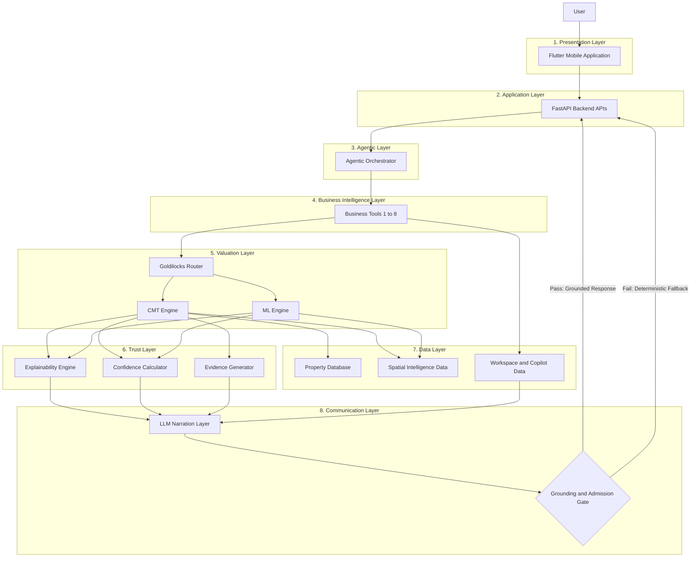
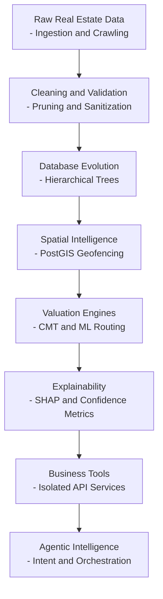
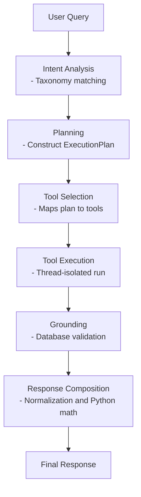
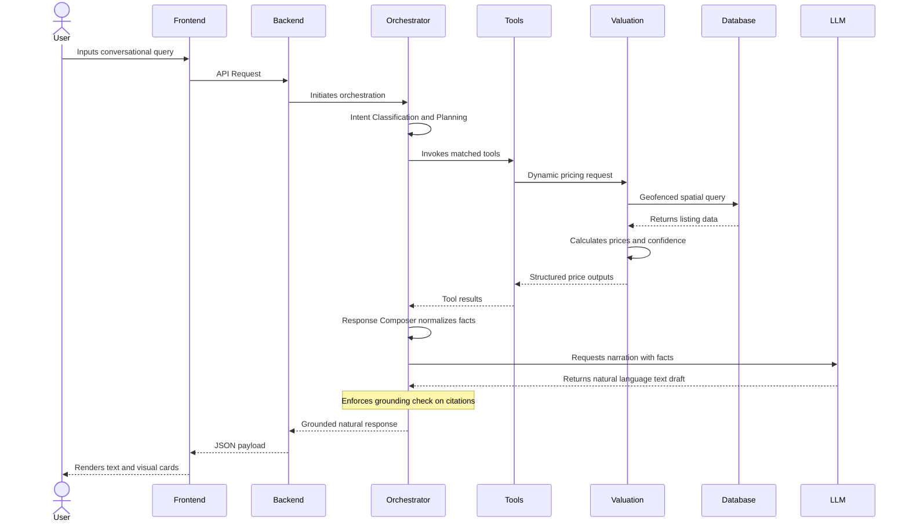

# Diagram 1: Full System Architecture

### Purpose
To explain the entire ValorAI platform in a single, visual diagram, illustrating how the system separates presentation, application routing, core mathematical engines, spatial persistence layers, and the restricted LLM communication gate.

### Short Explanation
ValorAI is structured across eight distinct conceptual layers. The core execution is driven by the backend databases, valuation models, explainability engines, and agentic orchestration plane. The Large Language Model (LLM) is not the core reasoning system; instead, it is isolated to the communication layer, generating natural language narration for pre-calculated facts under the strict governance of a grounding admission gate.

---

# Diagram 2: Data to Intelligence Journey

### Purpose
To show the complete systems engineering evolution of ValorAI, tracing the progression from raw unstructured listings to clean, geofenced, and agent-orchestrated real estate intelligence.

### Short Explanation
The systems engineering journey follows a linear logical sequence. Raw scraped listing points are sanitized in memory, structured into recursive parent-child tree geometries in PostGIS, processed by tiered geofencing engines, enriched via mathematical explainability, modularized into business services, and exposed through a secure agentic control plane.

---

# Diagram 3: Agentic Orchestration Architecture

### Purpose
To explain the agentic control plane and the sequence of steps that transform unstructured user messages into grounded conversational actions.

### Short Explanation
The orchestrator converts conversational inputs into intent profiles, schedules tools to execute securely inside isolated database sessions, resolves pricing queries through the Goldilocks Router, executes comparison math in Python, and validates citations to deliver mathematically verified responses.

---

# Diagram 4: End-to-End System Sequence Diagram

### Purpose
To map the request and response sequence of a real real estate query across the user interface, backend services, mathematical engines, databases, and LLM providers.

### Short Explanation
When a query is received, the orchestrator classifies intents and calls tools in parallel. The tools request spatial valuations from the CMT or ML models, which pull data from the PostGIS database. The outputs are composed and formatted by the LLM narration provider. The response is validated by the orchestrator and returned as natural language text accompanied by interactive cards.

---

# Diagram 5: Why ValorAI Is Not an LLM Wrapper

### Purpose
To demonstrate the fundamental architectural difference between a traditional, unchecked LLM wrapper and ValorAI's database-grounded system.

```mermaid
flowchart TD
    subgraph Traditional["Traditional Student AI Project"]
        T_User[User] --> T_LLM["Unchecked LLM"]
        T_LLM -->|Hallucinates Math and Facts| T_Answer[Answer]
    end
    
    subgraph ValorAI["ValorAI Platform"]
        V_User[User] --> V_Orch["Agentic Orchestrator\n- Intent and Plan"]
        V_Orch --> V_Tools["Business Tools\n- Isolated APIs"]
        V_Tools --> V_Engines["Valuation Engines\n- CMT and ML Models"]
        V_Engines --> V_Truth["Truth Layer\n- Spatial PostGIS Database"]
        V_Truth -->|Deterministic Facts| V_LLM["LLM Narration\n- Restricted to presentation"]
        V_LLM --> V_Resp[Grounded Response]
    end
```

### Short Explanation
A typical wrapper application delegates database logic, mathematics, and context processing directly to the language model, leading to logical and numerical hallucinations. ValorAI offloads all reasoning, spatial geofencing, mathematical modeling, and state tracking to deterministic backend engines, restricting the LLM to drafting natural language narration of these verified facts.
