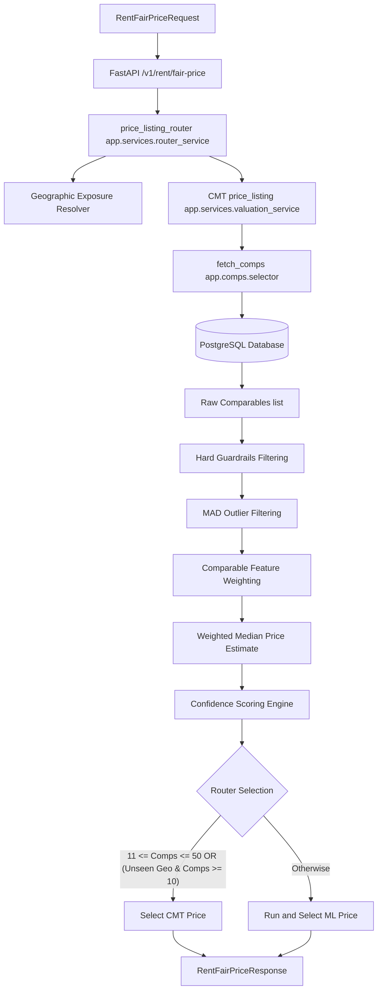

# CMT Execution Map & Call Trace

This report documents the callable entrypoints, routing rules, and execution flow of the CMT (Comparable Market Trend) valuation engine.

## Execution Trace: Request to Price Output



### 1. API Route Entrypoint
- **Route**: `POST /v1/rent/fair-price` (and alias `POST /v1/valuation/fair-price`)
- **File**: [pricing.py](file:///c:/Users/mh978/Downloads/mobile%20computing%20project/pf_scraper/fair-price-eg/backend/app/api/routes/pricing.py#L87)
- **Function**: `rent_fair_price(req: RentFairPriceRequest, db: Session)`

### 2. Valuation Router (Master Orchestrator)
- **File**: [router_service.py](file:///c:/Users/mh978/Downloads/mobile%20computing%20project/pf_scraper/fair-price-eg/backend/app/services/router_service.py#L142)
- **Function**: `price_listing_router(...)`
- **Execution Flow**:
  1. Resolves spatial location to H3 Index (resolution 9) from coordinates.
  2. Queries the geographical exposure metrics (exposure score, unseen compound, unseen H3) via `exposure_registry.get_exposure_metrics()`.
  3. Executes the CMT valuation pipeline to determine the count of available comps.
  4. Evaluates routing rules to decide whether to use CMT or fall back to ML.
  5. Routing logic rules (`evaluate_routing_rules`):
     - **CMT**: If comparable count is in the range `[11, 50]`.
     - **CMT**: If the location is unseen (both unseen compound and unseen H3) and comparable count is `>= 10`.
     - **ML**: Otherwise.
  6. Compiles explainability traces and responses.

### 3. CMT Valuation Engine
- **File**: [valuation_service.py](file:///c:/Users/mh978/Downloads/mobile%20computing%20project/pf_scraper/fair-price-eg/backend/app/services/valuation_service.py#L202)
- **Function**: `price_listing(req: RentFairPriceRequest, db: Session, ctx: dict)`
- **Key Pipelines**:
  1. **Location Grounding & Area Resolution**: Converts input coords or addresses to canonical database areas (governorates, districts, compounds) via [area_resolver.py](file:///c:/Users/mh978/Downloads/mobile%20computing%20project/pf_scraper/fair-price-eg/backend/app/geo/area_resolver.py).
  2. **Comparable Selection (Multi-Tier Retrieval)**: Calls `fetch_comps` to pull listings from the database. It queries tiers sequentially (T1: compound, T2: district, T3: nearby districts, T4: city, T5: governorate) using [tier_comps.sql](file:///c:/Users/mh978/Downloads/mobile%20computing%20project/pf_scraper/fair-price-eg/backend/app/db/sql/tier_comps.sql) until the category-specific `match_threshold` (e.g., 40 comps for `residential_rent`) is met.
  3. **Hard Guardrails Filter**: Filters out outliers that fail basic price and size bounds defined by the `CategoryGuardrails` contract (e.g., size <= 1000 sqm for rent).
  4. **Median Absolute Deviation (MAD) Filter**: Eliminates remaining statistically extreme price anomalies using modified Z-scores.
  5. **Comparable Weighting**: Computes similarity scores and weights for each remaining comp based on geographic distance, size similarity, age/recency, and room count similarity.
  6. **Price Computation**: Computes the final fair rent as the weighted median of the filtered comps' prices. Bands are calculated using the 20th and 80th weighted percentiles.
  7. **Confidence Scoring**: Combines database evidence metrics (number of comps, retrieval tier, dispersion ratio, similarity) and location resolution confidence to calculate a final confidence score in the range `[0, 1]`.

---

## Programmatic Entrypoint for Benchmarking

To test the **CMT valuation engine** itself (and bypass the ML router override), we must call `price_listing` directly:

```python
from app.services.valuation_service import price_listing

# Call signature:
# response = price_listing(req: RentFairPriceRequest, db: Session)
```
