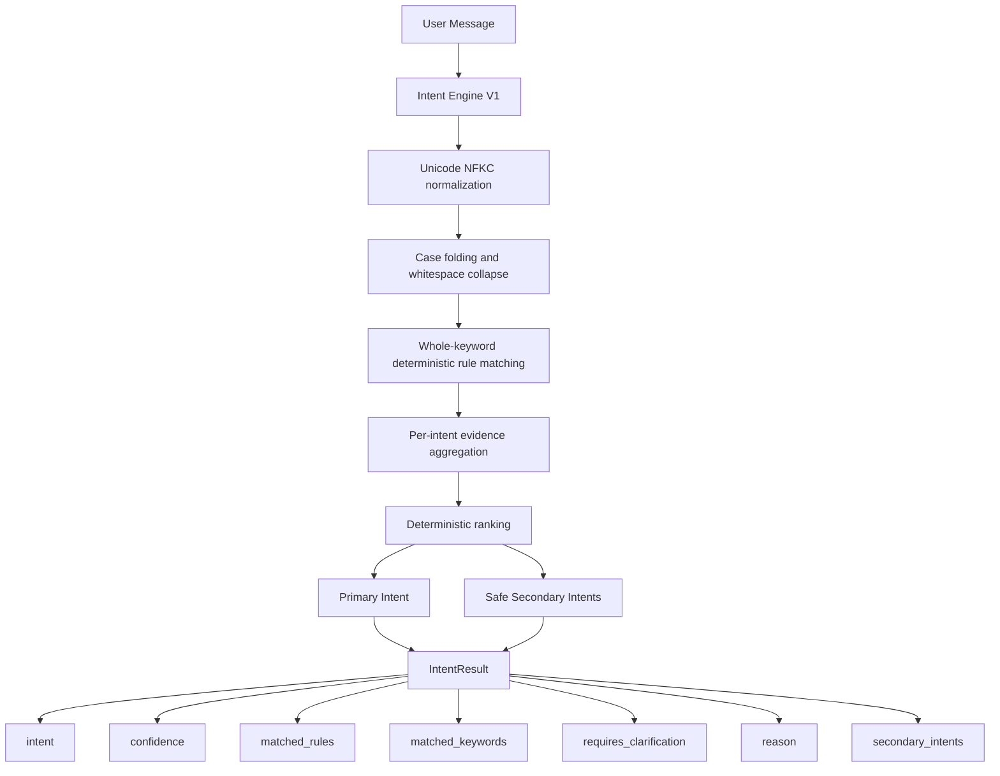
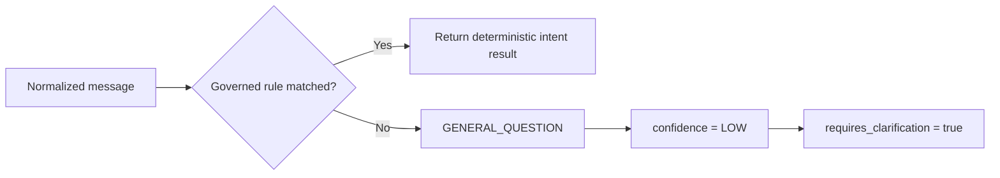

# ValorAI Intent Engine V1 Architecture Diagram

Report date: 2026-06-01  
Scope: Phase 5.5C.1 only

## Runtime Diagram



## Clarification Branch



## Scope Boundary

```mermaid
flowchart LR
    A["User Message"] --> B["Phase 5.5C.1 Intent Engine"]
    B --> C["IntentResult"]
    C -. "Future Phase 5.5C.2" .-> D["Tool Planner"]
    D -. "Future Phase 5.5C.3" .-> E["Tool Executor"]
    E -. "Future Phase 5.5C.4" .-> F["Response Composer"]
    F -. "Future Phase 5.5C.5" .-> G["Memory Integration"]
    G -. "Future Phase 5.5C.6" .-> H["LLM Integration"]
```



Only the solid-line path is implemented in Phase 5.5C.1.

## Governance Boundary

The Intent Engine has no dependency on:

```text
Network
Database
Router
CMT
ML
Embeddings
Vector database
Tool Layer
LLM providers
```
