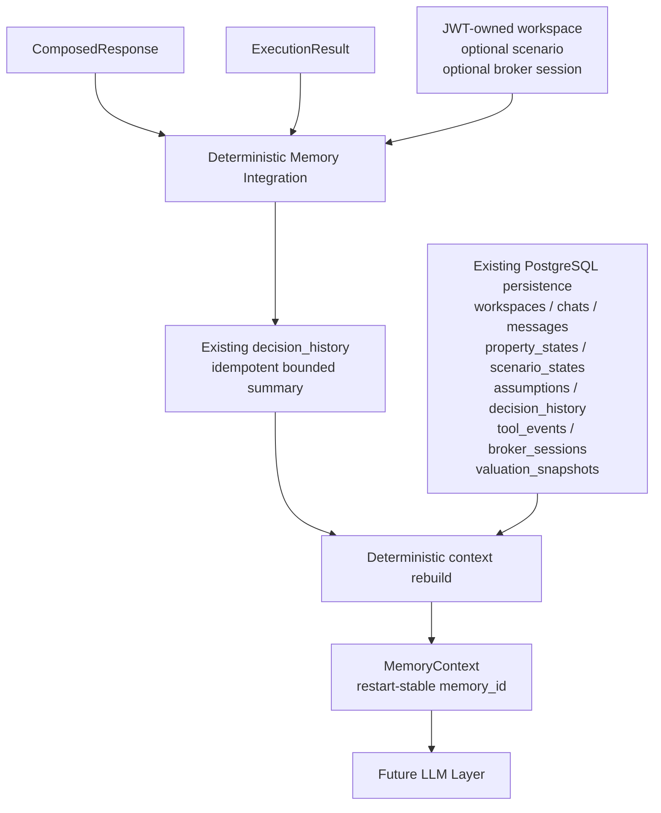
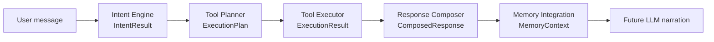
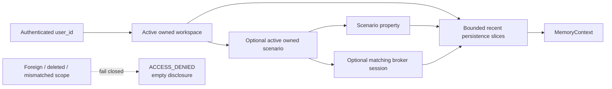

# Memory Architecture Diagram

Phase: 5.5C.5 Memory Integration  
Status: Implemented

## Runtime Flow



## Orchestrator Placement



The direction is forward-only. Memory Integration does not classify intent,
plan work, execute Tools, or compute response arithmetic.

## Scoped Retrieval



## Boundary

```text
Planner decides.
Executor executes.
Composer computes.
Memory remembers.
Future LLM narrates.
```

Memory does not call Tools, Router, CMT, ML, model providers, vector stores,
prompt builders, narration, streaming, or frontend transport.
