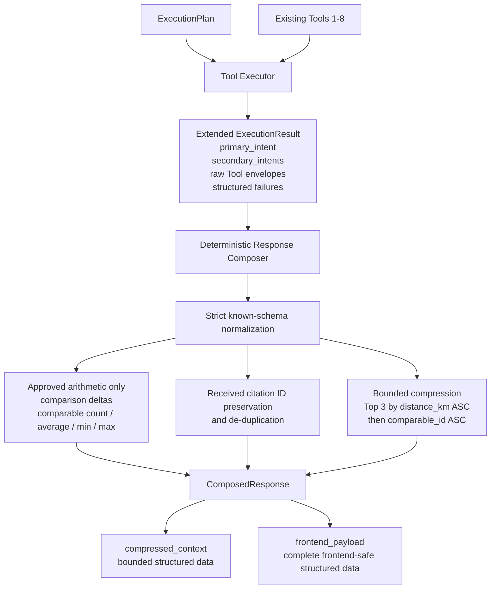
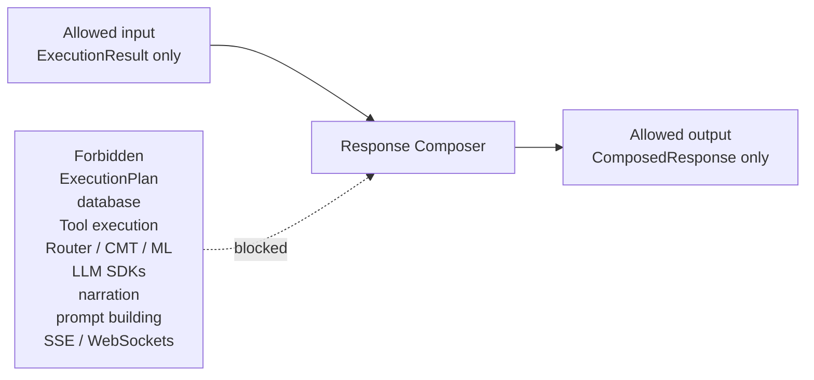

# Response Composer Architecture Diagram

Phase: 5.5C.4B Response Composer  
Status: Implemented

## Runtime Flow



## Boundary



## Governed Responsibilities

| Layer | Responsibility |
| --- | --- |
| Intent Engine | Classifies approved intent vocabulary. |
| Tool Planner | Selects approved Tool slots and execution strategy. |
| Tool Executor | Executes approved Tools and returns raw envelopes. |
| Response Composer | Normalizes, computes approved math, preserves citations, compresses, and emits structured channels. |
| Future Phase 5.5C.6 | May narrate precomputed structured evidence. |

## Locked Rule

```text
Planner decides.
Executor executes.
Composer computes.
Future LLM narrates.
```
