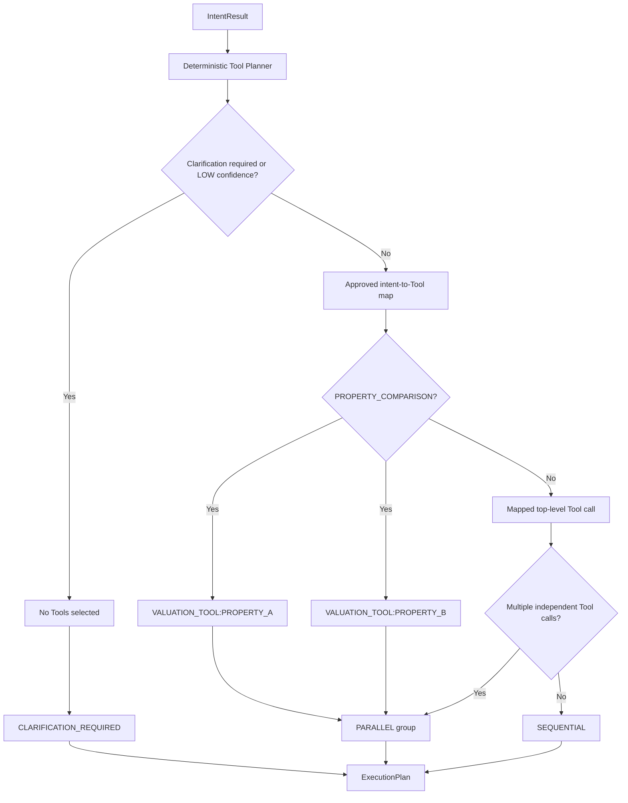
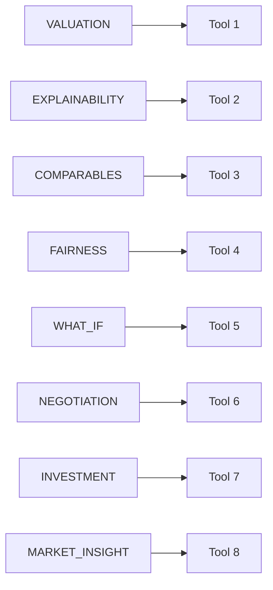
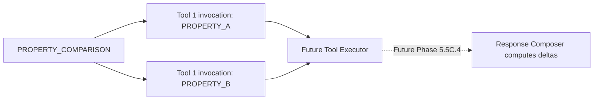

# ValorAI Tool Planner Architecture Diagram

Report date: 2026-06-01  
Scope: Phase 5.5C.2 only

## Runtime Diagram



## Approved Tool Map



## Property Comparison Boundary



There is no Tool 9. The Tool Planner does not compute deltas.

## Phase Boundary

```mermaid
flowchart LR
    A["Phase 5.5C.1 Intent Engine"] --> B["IntentResult"]
    B --> C["Phase 5.5C.2 Tool Planner"]
    C --> D["ExecutionPlan"]
    D -. "Future Phase 5.5C.3" .-> E["Tool Executor"]
    E -. "Future Phase 5.5C.4" .-> F["Response Composer"]
    F -. "Future Phase 5.5C.5" .-> G["Memory Integration"]
    G -. "Future Phase 5.5C.6" .-> H["LLM Integration"]
```



Only the solid-line path through `ExecutionPlan` is implemented in Phase
5.5C.2.

## Governance Boundary

The Tool Planner has no dependency on:

```text
Network
Database
PostGIS
Tool Layer execution
Router
CMT
ML
HTTP clients
LLM providers
```
