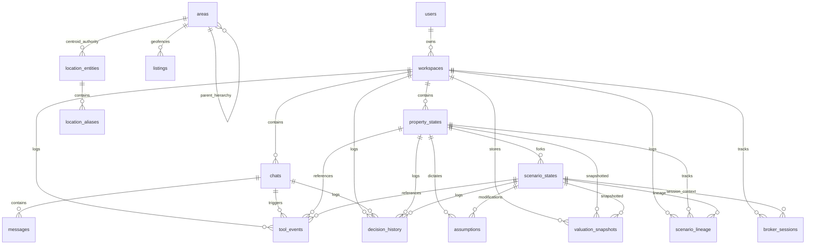

# Forensic Architectural Audit & Reverse Engineering Report
**Author:** Principal Software Architect, Principal Data Scientist, Principal Database Engineer, Principal Quantitative Researcher, and Principal Real Estate Valuation Expert  
**Target Project:** ValorAI Valuation & Comparable Market Technique (CMT) Platform  
**System State Version:** Phase 5.2 (FastAPI Backend / React Frontend Hybrid Deployment)  
**Date of Audit:** June 1, 2026

---

## Executive Summary

This document presents a code-verified, forensic-level architectural audit and reverse engineering analysis of the ValorAI Comparable Market Technique (CMT) engine, its PostGIS relational database layer, its CatBoost machine learning model pipeline, its hybrid routing decision matrix, its confidence heuristics, and its core business logic. All findings, formulas, and statements are backed by actual implementation code, schemas, and configurations located in the repository.

---

## PHASE A — DESIGN INTENT RECONSTRUCTION

This phase maps out the engineering rationale and design choices of the original developers.

### 1. API Endpoints Router (`backend/app/api/routes/pricing.py`)
* **Why it exists:** Exposes HTTP POST routes `/v1/valuation/fair-price` and `/v1/rent/fair-price` to external clients and the frontend.
* **What problem it solves:** Handles JSON validation, initiates the transaction context (Pydantic models for request/response), logs server errors, and provides rate limiting wrappers.
* **Alternative approaches:** GraphQL API or gRPC endpoints.
* **Likely chosen because:** REST over HTTP is standard for web services, integrations are lightweight, and FastAPI provides high-speed asynchronous event loops and automatic OpenAPI schema extraction out of the box.

### 2. Master Hybrid Router Service (`backend/app/services/router_service.py`)
* **Why it exists:** Coordinates execution by deciding whether the valuation request goes to the CMT Pricing Engine or the CatBoost ML model.
* **What problem it solves:** Resolves the trade-off between the interpretability of CMT (direct comparables) and the interpolation strength of ML (data sparsity). It prevents ML from generating arbitrary values in high-density areas and prevents CMT from failing in areas without comparable listings.
* **Alternative approaches:** Always run both and average the results, or run only one based on user settings.
* **Likely chosen because:** Runs CMT first to get a quick comp count, applying strict routing boundaries based on geographical familiarity (seen vs unseen) and comparable density. It also supports fallback (if ML fails, fall back to CMT; if CMT fails, fall back to ML).

### 3. CMT Pricing Engine Service (`backend/app/services/valuation_service.py`)
* **Why it exists:** Implements the core business logic of the Comparable Market Technique (CMT).
* **What problem it solves:** Orchestrates location resolution, nearest-area lookup, comparable listings querying (via Selector), hard guardrail filters, Median Absolute Deviation (MAD) filtering, comparable weights calculation, pricing statistics (weighted median and quantiles), confidence scoring, and explanation trace building.
* **Alternative approaches:** Perform valuation calculations directly inside SQL queries, or use a separate third-party GIS valuation microservice.
* **Likely chosen because:** Separates data access (SQL) from mathematical logic (Python), enabling highly detailed debugging, custom weights, and robust execution tracing.

### 4. ML Valuation Service (`backend/app/services/ml_service.py`)
* **Why it exists:** Wraps CatBoost regressors for residential rent and sale.
* **What problem it solves:** Evaluates values in locations with sparse comparable listings (cold-start regions or unseen hexes/compounds) using spatial coordinates, H3 indices, property features, and time periods. It log-transforms targets to maintain variance stability and computes SHAP feature importance for explainability.
* **Alternative approaches:** Random Forest, XGBoost, or Neural Networks.
* **Likely chosen because:** CatBoost is exceptionally performant with categorical inputs (such as compound names and H3 cells) without requiring manual one-hot encoding, and it loads quickly via binary `.cbm` structures.

### 5. Hierarchical Comparable Selector (`backend/app/comps/selector.py` & `backend/app/db/sql/tier_comps.sql`)
* **Why it exists:** Fetches comparable property listings using hierarchical geofencing.
* **What problem it solves:** Solves spatial matching by walking up/down the geographical area tree (Compound/Neighborhood $\rightarrow$ District $\rightarrow$ City $\rightarrow$ Governorate) and expanding the search radius when direct matches are scarce. It enforces spatial constraints via PostGIS functions (`ST_DWithin`, `ST_Distance`).
* **Alternative approaches:** Plain radial search around coordinate points regardless of administrative boundaries, or querying all matches and sorting/pruning inside application code.
* **Likely chosen because:** PostGIS index querying is highly optimized for geographic data, and the recursive CTE matching schema preserves administrative boundaries (preventing, for example, comparing properties across a river or divider).

### 6. Outliers & Filtering Layer (`backend/app/comps/outliers.py` & `backend/app/pricing/filters.py`)
* **Why it exists:** Provides two distinct filtering steps: hard guardrails and statistical filtering.
* **What problem it solves:** Prunes data entry mistakes (e.g., extremely low or high pricing, typos in size) and filters out speculative listings. The statistical filter applies a Modified Z-score using Median Absolute Deviation (MAD) on price per square meter (or raw price if comps are limited), protecting the weighted median from outlier distortion.
* **Alternative approaches:** Simple standard deviation filters (Z-score) or interquartile range (IQR) filters.
* **Likely chosen because:** Z-score assumes normal distribution and is highly vulnerable to outliers itself (since mean and standard deviation are sensitive to extreme values). MAD is a highly robust estimator that remains stable even when up to 50% of the sample consists of outliers.

### 7. Property-Category Contracts Matrix (`backend/app/pricing/contracts.py`)
* **Why it exists:** Declares strict rules, constraints, guardrails, and coefficients for each property category (e.g., `residential_rent`, `villas_sale`, `office_rent`, etc.).
* **What problem it solves:** Standardizes calculations across highly disparate property classes. For example, villas sale needs wide size bounds and high weights on private gardens, while retail rent focuses heavily on frontage, visibility, and traffic.
* **Alternative approaches:** Duplicate pricing logic for each category or store parameters in database config tables.
* **Likely chosen because:** Enforces compile-time type safety via Python dataclasses, making contracts auditable, reproducible, and decoupled from dynamic database updates.

### 8. Dynamic Weight Estimator (`backend/app/pricing/estimator.py` & `backend/app/pricing/feature_similarity.py`)
* **Why it exists:** Determines how matching comparable listings are weighted.
* **What problem it solves:** Formulates similarity as a product of component weights (spatial distance, size proximity, recency, same compound, bathroom count congruency, bedroom count matching, property type similarity, and general feature similarity).
* **Alternative approaches:** Linear regression coefficients or uniform weights.
* **Likely chosen because:** Product-based weights (`math.prod`) act as a soft logical AND. If any crucial component weight drops to zero (e.g., bedroom count mismatch), the listing's total weight becomes zero, preventing it from influencing the weighted median.

### 9. Governed Amenity Registry (`backend/app/pricing/amenities.py`)
* **Why it exists:** Maps raw scraped amenity strings to normalized canonical symbols (36 total) and assigns category-specific weights.
* **What problem it solves:** Normalizes unstructured text. Compares target and comparable amenities using a category-weighted Jaccard overlap index.
* **Alternative approaches:** Raw text overlap checks (matching exact strings) or treating all amenities as equally important.
* **Likely chosen because:** Some amenities (e.g., private pool or garden for villas) are highly correlated with price and must carry higher weight than secondary details (e.g., built-in wardrobes).

### 10. Combined Confidence Calculator (`backend/app/pricing/confidence.py`)
* **Why it exists:** Rates the reliability of the generated fair price on a scale of $[0, 1]$.
* **What problem it solves:** Combines listing data characteristics (sample count, retrieval tier, outlier ratio, price dispersion, average distance, average age, and feature similarities) with geographic precision to compute a single confidence score.
* **Alternative approaches:** Simple rating based only on the number of comparables found.
* **Likely chosen because:** A high comp count is misleading if they are highly dispersed in price, far away, or stale. Combining listing density, spatial spread, age, and location precision provides a trustworthy rating.

### 11. Monitoring & Shadow Deployment (`backend/app/services/monitoring_service.py`)
* **Why it exists:** Captures real-time request-response telemetry and runs shadow predictions.
* **What problem it solves:** Tests model updates without impacting live users. If the router selects CMT, the system runs ML in the background; if the router selects ML, it runs CMT in the background. It writes records to `prediction_logs` and `shadow_logs` to analyze divergence.
* **Alternative approaches:** Random offline testing or staging environment testing.
* **Likely chosen because:** Production data distributions can vary significantly from training datasets. Running live shadow pipelines provides instant feedback on model variance, latency, and routing safety.

---

## PHASE B — CMT MATHEMATICAL RECONSTRUCTION

Every mathematical formula used in the Comparable Market Technique (CMT) engine is extracted, defined, and analyzed below.

### 1. Spatial Distance Decay Weighting
* **Original Code:**
  ```python
  # backend/app/pricing/estimator.py:21-27
  def _w_distance(dist_m):
      dist_m = _to_float(dist_m)
      if dist_m is None:
          return _clamp_unit(WEIGHTING.distance_fallback)
      dist_m = max(dist_m, 0.0)
      return _clamp_unit(1.0 / (1.0 + (dist_m / WEIGHTING.distance_decay_m)))
  ```
* **Mathematical Notation:**
  $$w_{distance} = \text{clamp} \left( \frac{1}{1 + \frac{d}{\lambda_{distance}}} \right)$$
* **Variables:**
  - $d$ (`dist_m`): Distance from the subject property to the comparable listing (unit: meters). Range: $[0, \infty)$.
  - $\lambda_{distance}$ (`WEIGHTING.distance_decay_m`): Scale parameter controlling decay speed. Configured in [config.py:193](file:///c:/Users/mh978/Downloads/mobile%20computing%20project/pf_scraper/fair-price-eg/backend/app/core/config.py#L193) as `DISTANCE_DECAY_M = 1000.0`.
  - $w_{distance\_fallback}$ (`WEIGHTING.distance_fallback`): Fallback weight when distance is missing. Configured in [config.py:192](file:///c:/Users/mh978/Downloads/mobile%20computing%20project/pf_scraper/fair-price-eg/backend/app/core/config.py#L192) as `DISTANCE_WEIGHT_FALLBACK = 0.2`.
* **Range Analysis:** Output is strictly bounded in $[0.0, 1.0]$. Bounded on $[0, 15000]$ meters (since the maximum retrieval radius is 15000m).
  - Bounded at $d = 0$: $w_{distance} = 1.0$.
  - At $d = 1000$: $w_{distance} = 0.5$.
  - At $d = 15000$: $w_{distance} = 1 / 16 = 0.0625$.
* **Sensitivity Analysis:**
  $$\frac{\partial w_{distance}}{\partial d} = -\frac{1}{\lambda_{distance} \left(1 + \frac{d}{\lambda_{distance}}\right)^2} < 0$$
  The sensitivity peaks at $d = 0$ (value: $-0.001$) and decays quadratically. The rate of weight loss is highest for close properties.
* **Edge Cases:** If $d$ is negative, it is forced to $0.0$ via `max(dist_m, 0.0)`.
* **Failure Modes:** If $d$ is missing, fallback is $0.2$. No division by zero is possible since $d \ge 0$ and $\lambda_{distance} = 1000.0 > 0$.
* **Impact of Removal:** Equal weight will be given to listings next door and listings 15km away, degrading spatial accuracy.
* **Coefficient Changes:** Reducing $\lambda_{distance}$ to 200m makes the weight highly local, rendering comps further than 500m virtually irrelevant.

---

### 2. Size Similarity Weighting
* **Original Code:**
  ```python
  # backend/app/pricing/estimator.py:29-35
  def _w_size(size_sqm, target):
      size_sqm = _to_float(size_sqm)
      target = float(target)
      if size_sqm is None or target <= 0:
          return _clamp_unit(WEIGHTING.size_fallback)
      rel = abs(size_sqm - target) / target
      return _clamp_unit(1.0 - rel)
  ```
* **Mathematical Notation:**
  $$w_{size} = \text{clamp} \left( 1.0 - \frac{|S_{comp} - S_{target}|}{S_{target}} \right)$$
* **Variables:**
  - $S_{comp}$ (`size_sqm`): Size of the comparable property (unit: sqm). Range: $(0, 10000]$.
  - $S_{target}$ (`target`): Size of the subject property (unit: sqm). Range: $(0, 10000]$.
  - $w_{size\_fallback}$ (`WEIGHTING.size_fallback`): Fallback weight when size is missing. Configured in [config.py:194](file:///c:/Users/mh978/Downloads/mobile%20computing%20project/pf_scraper/fair-price-eg/backend/app/core/config.py#L194) as `SIZE_WEIGHT_FALLBACK = 0.6`.
* **Range Analysis:** Bounded in $[0.0, 1.0]$.
  - Bounded at $S_{comp} = S_{target}$: $w_{size} = 1.0$.
  - Bounded at $S_{comp} \ge 2 S_{target}$ or $S_{comp} \le 0$: $w_{size} = 0.0$.
* **Sensitivity Analysis:**
  $$\frac{\partial w_{size}}{\partial S_{comp}} = \begin{cases} -1/S_{target} & \text{if } S_{comp} > S_{target} \\ 1/S_{target} & \text{if } S_{comp} < S_{target} \end{cases}$$
  Linear decay based on the percentage size difference. Larger targets are less sensitive to small absolute size changes.
* **Edge Cases:** If $S_{comp}$ is double or half the target size, weight drops to $0.0$.
* **Failure Modes:** If $S_{target} \le 0$, division by zero is prevented by the fallback condition.
* **Impact of Removal:** Comp properties with mismatched sizes (e.g., comparing a 50sqm studio to a 200sqm apartment) will receive equal weight, causing price-per-sqm scaling issues.
* **Coefficient Changes:** Changing size similarity to $(1.0 - \text{rel})^2$ would penalize size differences exponentially.

---

### 3. Recency Decay Weighting
* **Original Code:**
  ```python
  # backend/app/pricing/estimator.py:37-42
  def _w_recency(age_days):
      age_days = _to_float(age_days)
      if age_days is None:
          return _clamp_unit(WEIGHTING.recency_fallback)
      age_days = max(age_days, 0.0)
      return _clamp_unit(math.exp(-age_days / WEIGHTING.recency_decay_days))
  ```
* **Mathematical Notation:**
  $$w_{recency} = \text{clamp} \left( e^{-\frac{A}{\lambda_{recency}}} \right)$$
* **Variables:**
  - $A$ (`age_days`): Age of the comparable listing in days relative to the dataset as-of date (unit: days). Range: $[0, 365]$.
  - $\lambda_{recency}$ (`WEIGHTING.recency_decay_days`): Decay scale. Configured in [config.py:197](file:///c:/Users/mh978/Downloads/mobile%20computing%20project/pf_scraper/fair-price-eg/backend/app/core/config.py#L197) as `RECENCY_DECAY_DAYS = 60.0`.
  - $w_{recency\_fallback}$ (`WEIGHTING.recency_fallback`): Fallback weight when age is missing. Configured in [config.py:196](file:///c:/Users/mh978/Downloads/mobile%20computing%20project/pf_scraper/fair-price-eg/backend/app/core/config.py#L196) as `RECENCY_WEIGHT_FALLBACK = 0.6`.
* **Range Analysis:** Bounded in $[0.0, 1.0]$.
  - At $A = 0$: $w_{recency} = 1.0$.
  - At $A = 60$: $w_{recency} \approx 0.3679$.
  - At $A = 365$ (stale comp limit): $w_{recency} \approx 0.0022$.
* **Sensitivity Analysis:**
  $$\frac{\partial w_{recency}}{\partial A} = -\frac{1}{\lambda_{recency}} e^{-\frac{A}{\lambda_{recency}}} < 0$$
  Decay is steepest initially ($-0.0167$ at $A=0$) and flattens over time.
* **Edge Cases:** If $A$ is negative, it is forced to $0.0$ via `max(age_days, 0.0)`.
* **Failure Modes:** If $A$ is missing, fallback is $0.6$. No division by zero is possible since $\lambda_{recency} = 60.0 > 0$.
* **Impact of Removal:** Old listings from months ago carry the same weight as new ones, causing valuations to lag behind market shifts.
* **Coefficient Changes:** Decreasing $\lambda_{recency}$ to 30.0 cuts the weight of listings older than a month in half, emphasizing recency.

---

### 4. Bathroom Similarity Weighting
* **Original Code:**
  ```python
  # backend/app/pricing/estimator.py:45-50
  def _w_bathrooms(comp_bathrooms, target_bathrooms):
      if target_bathrooms is None:
          return 1.0
      if comp_bathrooms is None:
          return _clamp_unit(WEIGHTING.bathroom_fallback)
      return 1.0 if int(comp_bathrooms) == int(target_bathrooms) else _clamp_unit(WEIGHTING.bathroom_mismatch)
  ```
* **Mathematical Notation:**
  $$w_{bathrooms} = \begin{cases} 1.0 & \text{if } B_{target} \text{ is None} \\ 1.0 & \text{if } \lfloor B_{comp} \rfloor = \lfloor B_{target} \rfloor \\ w_{bathroom\_fallback} & \text{if } B_{comp} \text{ is None} \\ w_{bathroom\_mismatch} & \text{otherwise} \end{cases}$$
* **Variables:**
  - $B_{comp}$ (`comp_bathrooms`): Bathroom count of the comparable property.
  - $B_{target}$ (`target_bathrooms`): Bathroom count of the subject property.
  - $w_{bathroom\_fallback}$ (`WEIGHTING.bathroom_fallback`): Fallback weight when bathroom count is missing. Configured in [config.py:198](file:///c:/Users/mh978/Downloads/mobile%20computing%20project/pf_scraper/fair-price-eg/backend/app/core/config.py#L198) as `BATHROOM_WEIGHT_FALLBACK = 0.85`.
  - $w_{bathroom\_mismatch}$ (`WEIGHTING.bathroom_mismatch`): Penalty weight for mismatched bathroom count. Configured in [config.py:199](file:///c:/Users/mh978/Downloads/mobile%20computing%20project/pf_scraper/fair-price-eg/backend/app/core/config.py#L199) as `BATHROOM_MISMATCH_WEIGHT = 0.50`.
* **Range Analysis:** Discrete weights: $\{0.5, 0.85, 1.0\}$.
* **Sensitivity Analysis:** Non-continuous step function. Changing the target bathroom count or matching state causes a discrete step in weight.
* **Edge Cases:** Target is None returns $1.0$ (disables this factor).
* **Failure Modes:** Typecasting non-integers could throw errors, but it is protected by schema validation (integers).
* **Impact of Removal:** Mismatched bathrooms are ignored, leading to inaccurate comparisons for properties where bathroom count affects utility.
* **Coefficient Changes:** Setting $w_{bathroom\_mismatch} = 0.0$ would filter out all mismatched bathroom comps.

---

### 5. Same Area Weighting
* **Original Code:**
  ```python
  # backend/app/pricing/estimator.py:53-54
  def _w_same_area(is_same_area):
      return 1.0 if bool(is_same_area) else _clamp_unit(WEIGHTING.non_same_area)
  ```
* **Mathematical Notation:**
  $$w_{same\_area} = \begin{cases} 1.0 & \text{if } \text{is\_same\_area} = \text{True} \\ w_{non\_same\_area} & \text{otherwise} \end{cases}$$
* **Variables:**
  - $w_{non\_same\_area}$ (`WEIGHTING.non_same_area`): Weight penalty for fallback listings outside the resolved leaf area. Configured in [config.py:200](file:///c:/Users/mh978/Downloads/mobile%20computing%20project/pf_scraper/fair-price-eg/backend/app/core/config.py#L200) as `NON_SAME_AREA_WEIGHT = 0.95`.
* **Range Analysis:** $\{0.95, 1.0\}$.
* **Impact of Removal:** Fallback comps outside the neighborhood are treated with the exact same authority as internal ones.
* **Coefficient Changes:** Dropping $w_{non\_same\_area}$ to 0.5 significantly reduces the influence of fallback-tier comps.

---

### 6. Property Type Mismatch Weighting
* **Original Code:**
  ```python
  # backend/app/pricing/estimator.py:65-72
  def _w_property_type(comp_value, target_value, property_category):
      if target_value is None:
          return 1.0
      if comp_value is None:
          return 0.0
      if comp_value == target_value:
          return 1.0
      return _clamp_unit(category_contract(property_category).property_type_mismatch_weight)
  ```
* **Mathematical Notation:**
  $$w_{prop\_type} = \begin{cases} 1.0 & \text{if } P_{target} \text{ is None} \\ 0.0 & \text{if } P_{comp} \text{ is None} \\ 1.0 & \text{if } P_{comp} = P_{target} \\ w_{mismatch}(category) & \text{otherwise} \end{cases}$$
* **Variables:**
  - $P_{comp}$ (`comp_value`): Property type of the comparable (e.g., `'Apartment'`, `'Duplex'`).
  - $P_{target}$ (`target_value`): Property type of the subject property.
  - $w_{mismatch}(category)$ (`property_type_mismatch_weight`): Category-specific mismatch weight. For example:
    - `residential_rent` is `0.60` (defined in [contracts.py:174](file:///c:/Users/mh978/Downloads/mobile%20computing%20project/pf_scraper/fair-price-eg/backend/app/pricing/contracts.py#L174)).
    - `land_sale` is `0.35` (defined in [contracts.py:384](file:///c:/Users/mh978/Downloads/mobile%20computing%20project/pf_scraper/fair-price-eg/backend/app/pricing/contracts.py#L384)).
* **Range Analysis:** Discrete weights: $\{0.0, w_{mismatch}, 1.0\}$.
* **Impact of Removal:** Mismatched property types (e.g., comparing a chalet to an apartment) will receive the same weight, distorting values.
* **Coefficient Changes:** Setting $w_{mismatch} = 0.0$ would filter out all mismatched property types.

---

### 7. Feature Similarity Adjuster
* **Original Code:**
  ```python
  # backend/app/pricing/estimator.py:75-80
  def _w_features(feature_score):
      if feature_score is None:
          return 1.0
      score = _clamp_unit(feature_score)
      max_delta = _clamp_unit(WEIGHTING.feature_max_delta)
      return _clamp_unit(1.0 - (max_delta * (1.0 - score)))
  ```
* **Mathematical Notation:**
  $$w_{features} = \text{clamp} \left( 1.0 - \delta_{max} \cdot (1.0 - s) \right)$$
* **Variables:**
  - $s$ (`feature_score`): Normalized composite similarity score between $[0.0, 1.0]$.
  - $\delta_{max}$ (`WEIGHTING.feature_max_delta`): Maximum weight adjustment allowed for features. Configured in [config.py:201](file:///c:/Users/mh978/Downloads/mobile%20computing%20project/pf_scraper/fair-price-eg/backend/app/core/config.py#L201) as `FEATURE_WEIGHT_MAX_DELTA = 0.08`.
* **Range Analysis:** Bounded in $[1.0 - \delta_{max}, 1.0]$. With default $\delta_{max} = 0.08$, range is $[0.92, 1.0]$.
* **Sensitivity Analysis:**
  $$\frac{\partial w_{features}}{\partial s} = \delta_{max} = 0.08$$
  Provides a minor, linear adjustment to prevent feature differences from overwhelming core factors like size and location.
* **Impact of Removal:** Feature differences are ignored, and a property with no amenities would be weighted the same as one with luxury features.
* **Coefficient Changes:** Increasing $\delta_{max}$ to 0.30 would make amenities and view differences much more significant.

---

### 8. Weighted Jaccard Amenity Similarity Score
* **Original Code:**
  ```python
  # backend/app/pricing/amenities.py:243-279
  def _weighted_amenity_union(symbols: set[str], property_category: Any) -> float:
      total = 0.0
      for symbol in symbols:
          total += max(amenity_weight(symbol, property_category), 0.001)
      return total

  def amenity_similarity(target, comp, property_category):
      target_symbols = known_amenity_symbols(target)
      comp_symbols = known_amenity_symbols(comp)
      union = target_symbols | comp_symbols
      intersection = target_symbols & comp_symbols
      denominator = _weighted_amenity_union(union, property_category)
      numerator = _weighted_amenity_union(intersection, property_category)
      score = 1.0 if not union else numerator / denominator
      ...
  ```
* **Mathematical Notation:**
  $$s_{amenity} = \frac{\sum_{i \in T \cap C} w_i}{\sum_{j \in T \cup C} w_j}$$
* **Variables:**
  - $T$: Set of normalized amenity symbols of the target property.
  - $C$: Set of normalized amenity symbols of the comparable property.
  - $w_k$: Weight of amenity symbol $k$ for the given category (defined in [amenities.py:32-67](file:///c:/Users/mh978/Downloads/mobile%20computing%20project/pf_scraper/fair-price-eg/backend/app/pricing/amenities.py#L32-L67)).
* **Range Analysis:** Bounded in $[0.0, 1.0]$. If $T \cup C = \emptyset$, score is $1.0$.
* **Edge Cases:** If target and comp have no amenities, score is $1.0$. If they have completely disjoint amenities, score is $0.0$.
* **Failure Modes:** If the union is empty, code handles it with a fallback check, avoiding division by zero.
* **Impact of Removal:** All amenities are weighted equally, ignoring the higher value of major features (like private pools).
* **Coefficient Changes:** Modifying the weight of `PP` (Private Pool) from 0.07 to 0.20 makes pools the dominant feature weight.

---

### 9. Feature Similarity Composite Score
* **Original Code:**
  ```python
  # backend/app/pricing/feature_similarity.py:108-133
  total_component_weight = sum(score_weights.get(name, 0.0) for name in components)
  if total_component_weight <= 0:
      return {"score": None, ...}

  weighted_score = sum(components[name] * score_weights.get(name, 0.0) for name in components) / total_component_weight
  return {"score": max(0.0, min(1.0, float(weighted_score))), ...}
  ```
* **Mathematical Notation:**
  $$s_{composite} = \frac{\sum_{k \in C_{active}} s_k \cdot W_k}{\sum_{k \in C_{active}} W_k}$$
* **Variables:**
  - $C_{active}$: Set of features specified in the target property request (e.g., amenities, furnishing, compound, view, quality, floor).
  - $s_k$: Similarity score for feature $k$ (usually $1.0$ for match, $0.0$ for mismatch; amenities uses $s_{amenity}$).
  - $W_k$: Weight for feature $k$ from the category contract (defined in [contracts.py:166-172](file:///c:/Users/mh978/Downloads/mobile%20computing%20project/pf_scraper/fair-price-eg/backend/app/pricing/contracts.py#L166-L172)).
* **Range Analysis:** Bounded in $[0.0, 1.0]$. Returns `None` if $C_{active}$ is empty.
* **Impact of Removal:** Feature scoring defaults to a simple average, ignoring category-specific weights.

---

### 10. Final Weighted Median Valuation
* **Original Code:**
  ```python
  # backend/app/pricing/weights.py:12-38
  def weighted_quantile(values, weights, q):
      ...
      pairs = _sorted_pairs(values, weights)
      total_w = sum(w for _, w in pairs)
      ...
      target = q * total_w
      cum = 0.0
      for v, w in pairs:
          cum += w
          if cum >= target:
              return float(v)
      return float(pairs[-1][0])

  def weighted_median(values, weights):
      return weighted_quantile(values, weights, 0.5)
  ```
* **Mathematical Notation:**
  Given sorted pairs $(P_i, W_i)$ where $P_1 \le P_2 \le \dots \le P_n$:
  $$\text{Find } k \text{ such that: } \sum_{i=1}^{k-1} W_i < 0.5 \sum_{j=1}^n W_j \quad \text{and} \quad \sum_{i=1}^k W_i \ge 0.5 \sum_{j=1}^n W_j$$
  $$\text{Weighted Median} = P_k$$
* **Variables:**
  - $P_i$: Price of comparable $i$ (EGP).
  - $W_i$: Final weight of comparable $i$.
* **Range Analysis:** Outputs a price value within $[P_1, P_n]$.
* **Impact of Removal:** Reverting to a simple mean or median makes the valuation sensitive to low-similarity comparables.

---

### 11. Valuation Range Quantiles
* **Original Code:** Runs `weighted_quantile` with quantiles `0.20` and `0.80` (defined in [config.py:184-185](file:///c:/Users/mh978/Downloads/mobile%20computing%20project/pf_scraper/fair-price-eg/backend/app/core/config.py#L184-L185)).
* **Mathematical Notation:**
  Given sorted pairs $(P_i, W_i)$:
  $$\text{Find } k \text{ such that: } \sum_{i=1}^k W_i \ge q \sum_{j=1}^n W_j \quad \text{where } q \in \{0.2, 0.8\}$$
* **Variables:**
  - $q$: Quantile threshold. Low quantile is $0.20$, high quantile is $0.80$.
* **Range Analysis:** Bounded in $[P_1, P_n]$. Bounded range width is $P_{q=0.8} - P_{q=0.2}$.

---

### 12. Modified Z-Score Outlier Metric (MAD Filter)
* **Original Code:**
  ```python
  # backend/app/pricing/filters.py:69-86
  # Modified Z-score using MAD
  kept = []
  removed = 0
  for comp, value in pairs:
      mz = MAD.modified_z_scale * (value - med) / mad
      if abs(mz) <= z:
          kept.append(comp)
      else:
          removed += 1
  ```
* **Mathematical Notation:**
  $$MZ_i = \text{scale}_{MAD} \cdot \frac{x_i - \tilde{x}}{MAD}$$
* **Variables:**
  - $x_i$: Comparable metric value (price per sqm if $n \ge 10$, raw price otherwise).
  - $\tilde{x}$: Median of the values.
  - $MAD$: Median Absolute Deviation: $\text{median}(|x_i - \tilde{x}|)$.
  - $\text{scale}_{MAD}$ (`MAD.modified_z_scale`): Constant scale factor. Configured in [config.py:188](file:///c:/Users/mh978/Downloads/mobile%20computing%20project/pf_scraper/fair-price-eg/backend/app/core/config.py#L188) as `MAD_MODIFIED_Z_SCALE = 0.6745`.
* **Range Analysis:** Bounded by exclusion threshold $|MZ_i| \le 3.5$ (configured in [config.py:186](file:///c:/Users/mh978/Downloads/mobile%20computing%20project/pf_scraper/fair-price-eg/backend/app/core/config.py#L186) as `MAD_Z_THRESHOLD = 3.5`).
* **Edge Cases:** If $MAD = 0$, the code falls back to the zero-tolerance handler.
* **Impact of Removal:** Extreme outlier listings will distort the valuation.

---

### 13. Outlier Zero-MAD Tolerance Handler
* **Original Code:**
  ```python
  # backend/app/pricing/filters.py:56-67
  if mad == 0:
      tolerance = abs(med) * MAD.zero_tolerance_ratio
      kept = [comp for comp, value in pairs if abs(value - med) <= tolerance]
      removed = len(pairs) - len(kept)
      return kept, { "mad": 0, "median": med, ... }
  ```
* **Mathematical Notation:**
  $$\text{Tolerance } \tau = |\tilde{x}| \cdot \text{tolerance\_ratio}$$
  $$\text{Keep } x_i \text{ if: } |x_i - \tilde{x}| \le \tau$$
* **Variables:**
  - $\text{tolerance\_ratio}$ (`MAD.zero_tolerance_ratio`): Allowed deviation ratio. Configured in [config.py:189](file:///c:/Users/mh978/Downloads/mobile%20computing%20project/pf_scraper/fair-price-eg/backend/app/core/config.py#L189) as `MAD_ZERO_TOLERANCE_RATIO = 0.05`.
* **Range Analysis:** Keep listings within $\pm 5\%$ of the median.
* **Failure Modes:** If $\tilde{x} = 0$, tolerance becomes $0.0$, matching only exact matches.
* **Impact of Removal:** If $MAD=0$, the denominator in the Modified Z-score calculation becomes zero, causing a division by zero crash.

---

### 14. Distance Quality Score
* **Original Code:**
  ```python
  # backend/app/pricing/confidence.py:18-21
  def _distance_quality(avg_distance_m: float | None) -> float:
      if avg_distance_m is None:
          return 0.5
      return _clamp_unit(1.0 - (max(float(avg_distance_m), 0.0) / RADIUS_STEPS_M[-1]))
  ```
* **Mathematical Notation:**
  $$Q_{dist} = \text{clamp} \left( 1.0 - \frac{d_{avg}}{d_{max\_radius}} \right)$$
* **Variables:**
  - $d_{avg}$: Average distance of comparables in meters.
  - $d_{max\_radius}$ (`RADIUS_STEPS_M[-1]`): Maximum allowable search radius, which is $15000$ meters (defined in [config.py:101](file:///c:/Users/mh978/Downloads/mobile%20computing%20project/pf_scraper/fair-price-eg/backend/app/core/config.py#L101)).
* **Range Analysis:** Bounded in $[0.0, 1.0]$. Bounded at $d_{avg} = 0$: $Q_{dist} = 1.0$. Bounded at $d_{avg} \ge 15000$: $Q_{dist} = 0.0$.
* **Impact of Removal:** Confidence scores will not account for how far away comparables are.

---

### 15. Recency Quality Score
* **Original Code:**
  ```python
  # backend/app/pricing/confidence.py:24-27
  def _recency_quality(avg_age_days: float | None) -> float:
      if avg_age_days is None:
          return 0.5
      return _clamp_unit(1.0 / (1.0 + (max(float(avg_age_days), 0.0) / WEIGHTING.recency_decay_days)))
  ```
* **Mathematical Notation:**
  $$Q_{recency} = \text{clamp} \left( \frac{1}{1 + \frac{A_{avg}}{\lambda_{recency}}} \right)$$
* **Variables:**
  - $A_{avg}$: Average age of comparables in days.
  - $\lambda_{recency}$ (`WEIGHTING.recency_decay_days`): Scale parameter ($60.0$ days).
* **Range Analysis:** Bounded in $[0.0, 1.0]$.
  - At $A_{avg} = 0$: $Q_{recency} = 1.0$.
  - At $A_{avg} = 60$: $Q_{recency} = 0.5$.
* **Impact of Removal:** Confidence scores will not account for the freshness of comparable listings.

---

### 16. Composite Evidence Confidence Score
* **Original Code:**
  ```python
  # backend/app/pricing/confidence.py:30-95
  # base_score calculations ...
  score = (
      (base_score * confidence_weights.get("base", 0.85))
      + (distance_score * confidence_weights.get("distance", 0.05))
      + (recency_score * confidence_weights.get("recency", 0.05))
      + (similarity_score * confidence_weights.get("similarity", 0.05))
      + ((amenity_score or 0.0) * confidence_weights.get("amenity", 0.0))
  )
  score = _clamp_unit(score - precision_penalty)
  ```
* **Mathematical Notation:**
  $$S_{base} = s_{count} + s_{tier} + s_{kept} + s_{dispersion}$$
  $$S_{evidence} = \text{clamp} \left( \omega_{base} S_{base} + \omega_{dist} Q_{dist} + \omega_{recency} Q_{recency} + \omega_{sim} s_{sim} + \omega_{amenity} s_{amenity} - \text{penalty}_{precision} \right)$$
* **Variables:**
  - $s_{count} \in \{0.05, 0.15, 0.25, 0.35\}$ based on sample size thresholds ($20, 40, 80$).
  - $s_{tier} \in \{0.03, 0.06, 0.10, 0.18, 0.25\}$ based on retrieval tier ($5 \rightarrow 1$).
  - $s_{kept} = \min(0.20, \max(0.0, \text{kept\_ratio} - 0.60))$.
  - $s_{dispersion} \in \{0.05, 0.12, 0.20\}$ based on price dispersion thresholds ($0.60, 0.35$).
  - $\omega$ are category-specific confidence weights (defined in [contracts.py:175](file:///c:/Users/mh978/Downloads/mobile%20computing%20project/pf_scraper/fair-price-eg/backend/app/pricing/contracts.py#L175)).
* **Range Analysis:** Bounded in $[0.0, 1.0]$.
* **Impact of Removal:** System loses the ability to measure valuation reliability, returning the same confidence for sparse and dense locations.

---

### 17. Location-Evidence Unified Confidence
* **Original Code:**
  ```python
  # backend/app/services/valuation_service.py:115-118
  def _combine_confidence(evidence_confidence: dict, location_confidence: dict) -> dict:
      evidence_score = float(evidence_confidence.get("score") or 0.0)
      location_score = float(location_confidence.get("score") or 0.0)
      final_score = min(evidence_score, location_score)
      ...
  ```
* **Mathematical Notation:**
  $$Score_{unified} = \min \left( S_{evidence}, S_{location} \right)$$
* **Variables:**
  - $S_{evidence}$: Score from the confidence calculator.
  - $S_{location}$: Score from the location resolver (capped at $0.20$ if ambiguous, $0.50$ if area distance $> 2500$m).
* **Range Analysis:** Bounded in $[0.0, 1.0]$. Enforces a strict cap based on location accuracy.
* **Impact of Removal:** Valuations with inaccurate location coordinates (e.g., matching a district center rather than the actual rooftop) could falsely report high confidence.

---

## PHASE C — END TO END VALUATION WALKTHROUGH

This walkthrough traces the execution flow of a valuation request through the system components.

```
Request POST /v1/valuation/fair-price
  │
  ├── 1. FastAPI Route parsing (app/api/routes/pricing.py:rent_fair_price)
  │      Initializes `request_id = f"req_{uuid.uuid4().hex[:12]}"`
  │      Validates schema types (RentFairPriceRequest)
  │
  ├── 2. Router Service Coordination (app/services/router_service.py:price_listing_router)
  │      ├── A. Resolves spatial coordinates to H3 hex cell
  │      │      h3_index = h3.latlng_to_cell(req.lat, req.lng, 9)
  │      ├── B. Queries Geographic Exposure metrics
  │      │      exposure_registry.get_exposure_metrics(compound_name, h3_index)
  │      │      Returns: `unseen_comp`, `unseen_h3`, `exposure_score`
  │      │
  │      ├── C. Executes CMT pipeline (first pass / main run)
  │      │      Calls `app/services/valuation_service.py:price_listing`
  │      │
  │      └── D. Evaluates routing rules using retrieved comp count
  │             `evaluate_routing_rules(comps_count, unseen_comp, unseen_h3)`
  │             Rules:
  │               - If 11 <= comps_count <= 50: Use "CMT" (GoldilocksZone)
  │               - If (unseen_comp and unseen_h3) and comps_count >= 10: Use "CMT"
  │               - Otherwise: Use "ML" (PureMLBaseline)
  │
  ├── 3. CMT Pipeline Execution Details (app/services/valuation_service.py:price_listing)
  │      ├── A. Coordinates lookup
  │      │      Calls `_resolved_location_data` (manual coords or geocoding cache lookup)
  │      │      Calls `nearest_area(db, lat, lng)` to retrieve PostgreSQL area ID
  │      │
  │      ├── B. Comparable Listings Retrieval
  │      │      Calls `app/comps/selector.py:fetch_comps`
  │      │      Executes `tier_comps.sql` in a loop over Tiers 1-5 and radius steps.
  │      │      Prunes comps via `_apply_amenity_retrieval_filter`
  │      │      Returns comparable rows list and the selected tier number.
  │      │
  │      ├── C. Hard Guardrail Filters
  │      │      Calls `app/comps/outliers.py:hard_guardrails`
  │      │      Removes listings violating price, size, or price-per-sqm limits.
  │      │
  │      ├── D. Statistical Outlier Pruning
  │      │      Calls `app/pricing/filters.py:mad_filter`
  │      │      Filters outliers based on Modified Z-scores using MAD.
  │      │
  │      ├── E. Weighted Estimations & Pricing
  │      │      Calls `app/pricing/estimator.py:compute_weights`
  │      │      Computes component weights: distance, size similarity, recency, 
  │      │      same area, bathroom/bedroom counts, and feature similarity.
  │      │      Runs `weighted_median` to resolve the fair price.
  │      │      Runs `weighted_quantile` at 0.20 and 0.80 to resolve price bands.
  │      │
  │      ├── F. Confidence Calculation
  │      │      Calls `compute_confidence` to score evidence characteristics.
  │      │      Calls `_combine_confidence` to merge evidence and location quality.
  │      │
  │      └── G. Explainability payload composition
  │             Calls `build_explanation`, `build_amenity_intelligence`,
  │             `build_explanation_trace`, and `pick_top_comps`.
  │
  ├── 4. ML Engine Fallback Execution (if Router selects "ML")
  │      ├── A. Executes CatBoost model inference
  │      │      Calls `app/services/ml_service.py:price_listing_ml`
  │      │      Generates pandas dataframe via `_extract_features`.
  │      │      Runs model predict: `pred_log = model.predict(df)[0]`
  │      │      Converts from log-scale: `fair = int(np.expm1(pred_log))`
  │      │      Applies SHAP feature importance for positive/negative drivers.
  │      │
  │      └── B. Integrates CMT metadata
  │             Appends spatial retrieval traces and comp counts to the ML response
  │             to maintain consistent API schemas.
  │
  ├── 5. Logging and Observability
  │      Triggers FastAPI BackgroundTasks:
  │        - `log_prediction` writes to `prediction_logs`
  │        - `execute_shadow_pipeline` runs the alternative engine in the background
  │          and writes comparison logs to `shadow_logs`.
  │
  └── Response returned to client (SuccessResponse[RentFairPriceResponse])
```

---

## PHASE D — DATABASE FORENSICS

A forensic breakdown of the PostgreSQL + PostGIS schema mappings.

### ERD Relations & Schema Map (Mermaid Notation)



### Table Breakdown

#### 1. `listings`
* **Purpose:** Stores comparable property listings imported from scraper pipelines.
* **Primary Key:** `listing_id` (Text)
* **Foreign Keys:** `area_id` referencing `areas(area_id)`
* **Indexes:**
  - `ix_listings_geom_gist` ON `geom` USING gist (spatial geofencing queries)
  - `ix_listings_geom_geog_gist` ON `geom::geography` USING gist
  - `ix_listings_category_period_area` ON `(category, period, area_id)`
  - `ix_listings_area_type_bedrooms` ON `(area_id, property_type, bedrooms)`
  - `ix_listings_match_area_recency` ON `(category, period, property_type, bedrooms, area_id, scraped_at_utc DESC)`
* **Used By:** CMT selector (`selector.py:194`), ML training pipelines.
* **Importance Level:** CRITICAL. The core data source for CMT valuations.
* **Bottlenecks:** Large spatial queries (GIST) over millions of listings can cause CPU bottlenecks. Freshness pruning (`scraped_at_utc`) requires efficient index usage.

#### 2. `areas`
* **Purpose:** Stores hierarchical geographic boundaries (Governorates, Cities, Districts, Neighborhoods).
* **Primary Key:** `area_id` (Bigint)
* **Foreign Keys:** `parent_area_id` referencing `areas(area_id)` (recursive hierarchy)
* **Indexes:**
  - `ux_areas_parent_level_name` UNIQUE ON `(parent_area_id, level, name)`
  - `ix_areas_parent` ON `parent_area_id`
  - `ix_areas_center_gist` ON `center_geom` USING gist
  - `ix_areas_geom_gist` ON `geom` USING gist
* **Used By:** CMT Selector recursive queries, geocoder resolvers.
* **Importance Level:** CRITICAL. Dictates geofencing boundaries and prevents search area leakage.
* **Bottlenecks:** Recursive CTE parent walks on every request can block threads if the hierarchy is deep or unindexed.

#### 3. `address_resolution_cache`
* **Purpose:** Caches raw address geocoding lookups to prevent duplicate, expensive Google Maps API requests.
* **Primary Key:** `id` (Bigserial)
* **Indexes:**
  - `ix_address_resolution_cache_input` ON `lower(raw_input)`
  - `ux_address_resolution_cache_normalized_version` UNIQUE ON `(normalized_input, resolver_version)`
* **Used By:** Address resolution geocoder (`address_resolver.py:87`).
* **Importance Level:** HIGH. Reduces geocoding latency and API costs.
* **Bottlenecks:** Unbounded cache growth over time requires index maintenance and TTL eviction policies.

#### 4. `prediction_logs`
* **Purpose:** Synchronously logs every valuation request and its routing/pricing outcome.
* **Primary Key:** `id` (Bigserial)
* **Indexes:**
  - `ix_prediction_logs_request_created` ON `(request_id, created_at)`
  - `ix_prediction_logs_market_filters` ON `(compound, h3_res9, property_type, created_at)`
* **Used By:** Monitoring telemetry dashboards.
* **Importance Level:** HIGH. Tracks system usage, latency, and live price outputs.
* **Bottlenecks:** High write volume during peak traffic. Requires asynchronous queue-based inserts (e.g., Kafka/RabbitMQ) instead of synchronous DB operations.

#### 5. `shadow_logs`
* **Purpose:** Captures the predictions of both CMT and ML engines for every request to monitor divergence.
* **Primary Key:** `id` (Bigserial)
* **Indexes:**
  - `ix_shadow_logs_request_created` ON `(request_id, created_at)`
  - `ix_shadow_logs_market_filters` ON `(compound_name, h3_res9, created_at)`
* **Used By:** Machine learning calibration pipelines.
* **Importance Level:** MEDIUM. Identifies drift and provides data to calibrate routing rules.
* **Bottlenecks:** Writes double prediction outputs, increasing write pressure on the database.

---

## PHASE E — ML + CMT RELATIONSHIP

The relationship between the machine learning model and the deterministic CMT engine is governed by a hybrid routing layer.

### Hybrid Routing Decision Flow (ASCII Representation)

```
[Valuation Request]
       │
       ▼
1. Resolve location to H3 hex (res-9) and Compound name
       │
       ▼
2. Check Exposure Registry (exposure_registry.json)
       ├── Subject in seen compounds? ────► unseen_comp = False/True
       └── H3 index in seen hexes?    ────► unseen_h3 = False/True
       │
       ▼
3. Run CMT Retrieval (selector.py)
       └── How many comparable listings match in geofenced tiers?
               │
               ├── Comps < 10? ──────────────────────────────────────┐
               │                                                     │
               ├── 10 <= Comps <= 50?                                │
               │     │                                               │
               │     ├── Is (unseen_comp AND unseen_h3)?             │
               │     │     ├── Yes ──► CMT (UnseenGeographyRule)     │
               │     │     └── No  ──► CMT (GoldilocksZoneRule)      │
               │     │                                               │
               │     └── Is (11 <= Comps <= 50)?                     │
               │           └── Yes ──► CMT (GoldilocksZoneRule)      │
               │                                                     │
               └── Comps > 50? ──────────────────────────────────────┼──► ML (PureMLBaseline)
                                                                     │
               * If CMT fails (timeout, SQL error) ──────────────────┘ (Emergency Fallback)
```

### 1. The Heuristic Rules

The routing rules are defined in [router_service.py:21-34](file:///c:/Users/mh978/Downloads/mobile%20computing%20project/pf_scraper/fair-price-eg/backend/app/services/router_service.py#L21-L34):

* **Goldilocks Zone Rule:** If the retrieved comps count is between 11 and 50 ($11 \le n \le 50$), the request is routed to **CMT**.
* **Unseen Geography Rule:** If the property location is marked as unseen in both the compound registry and the H3 hex registry, and there are at least 10 comps ($n \ge 10$), the request is routed to **CMT** (using administrative fallback boundaries).
* **Baseline ML Rule:** In all other cases ($n < 11$ or $n > 50$), the request is routed to the **ML (CatBoost)** engine.
* **Engine Fallbacks:**
  - If the router selects ML but CatBoost fails (e.g., missing features, model load error), it triggers an emergency fallback to CMT.
  - If the router selects CMT but the engine fails (e.g., database timeout), it triggers an emergency fallback to ML.

### 2. Operational Rationale

* **Why CMT Wins:** Highly explainable, transparent, and accurate in localized, mid-density compounds where pricing is driven by explicit recent comparables.
* **Why ML Wins:** In low-density areas (under 10 comps), CMT lacks sufficient data to make a reliable prediction. In high-density areas (over 50 comps), the market is liquid enough that CatBoost can interpolate values across districts, smoothing out individual outlier listings.

---

## PHASE F — SYSTEM WEAKNESS ANALYSIS

### 1. Plaintext Secrets Leak in Configuration
* **Description:** Plaintext database credentials, API keys, and CORS settings are stored directly in source control (`.env`, `docker-compose.yml`, `config.py`).
* **Source:** Configured in `docker-compose.yml` and `config.py:47`.
* **Severity:** CRITICAL
* **Risk:** Unauthorized database access and data leaks in staging/production environments.

### 2. Lock-Step Evaluation Latency (No Concurrent Routing)
* **Description:** The system must run the full CMT retrieval pipeline (SQL queries) *before* it can make a routing decision, because the routing rules depend on the comps count. This adds substantial execution latency.
* **Source:** Located in `router_service.py:159`.
* **Severity:** HIGH
* **Risk:** Degrades API latency SLOs under high concurrent traffic.

### 3. Log-Scale Inconsistency in ML Calculations
* **Description:** CatBoost predictions are computed in log-scale $\ln(Price + 1)$ and converted back using `np.expm1`. Small variations in the model's output exponentiate into large price differences in high-end categories.
* **Source:** Located in `ml_service.py:121`.
* **Severity:** HIGH
* **Risk:** High valuation volatility for premium properties.

### 4. Zero-MAD Fallback Vulnerability
* **Description:** If all matching comparable listings have the same price, the Median Absolute Deviation ($MAD$) becomes $0$. The outlier filter falls back to a $\pm 5\%$ tolerance band around the median. This arbitrary threshold can incorrectly prune listings in markets with highly standardized pricing.
* **Source:** Located in `filters.py:57-67`.
* **Severity:** MEDIUM
* **Risk:** Pruning valid listings in highly structured housing developments.

### 5. Multiplicative Weight Decay
* **Description:** Weights are multiplied together via `math.prod`. If a listing has slightly lower similarity across several dimensions (e.g., 0.6 distance, 0.6 size, 0.6 recency), its total weight decays exponentially ($0.6 \times 0.6 \times 0.6 = 0.216$), rendering it virtually irrelevant.
* **Source:** Located in `estimator.py:109`.
* **Severity:** MEDIUM
* **Risk:** Artificially narrows the effective sample size, discarding valuable comps.

### 6. Geofencing Boundary Hard Cuts
* **Description:** PostGIS distance searches (`ST_DWithin`) apply a strict boundary cut. A comparable listing located 1 meter outside the search radius is completely excluded, even if it is otherwise a perfect match.
* **Source:** Located in `tier_comps.sql:119`.
* **Severity:** MEDIUM
* **Risk:** Valuations can drop or spike sharply based on small changes in the search radius.

---

## PHASE G — REBUILD THE SYSTEM

In the event of a system loss, the core components can be reconstructed from scratch using the specifications below.

### 1. Database Schema DDL (PostgreSQL + PostGIS)

```sql
-- Enable PostGIS spatial extensions
CREATE EXTENSION IF NOT EXISTS postgis;

-- 1. Areas Hierarchy Table
CREATE TABLE areas (
    area_id BIGSERIAL PRIMARY KEY,
    name TEXT NOT NULL,
    level SMALLINT NOT NULL CHECK (level BETWEEN 1 AND 4),
    parent_area_id BIGINT REFERENCES areas(area_id) ON DELETE RESTRICT,
    center_geom geometry(Point, 4326) NOT NULL,
    geom geometry(MultiPolygon, 4326),
    fallback_radius_m INTEGER
);

CREATE INDEX ix_areas_geom_gist ON areas USING GIST(geom);
CREATE INDEX ix_areas_center_gist ON areas USING GIST(center_geom);

-- 2. Listings Comparable Source Table
CREATE TABLE listings (
    listing_id TEXT PRIMARY KEY,
    category TEXT NOT NULL,
    period TEXT NOT NULL,
    price_egp INTEGER NOT NULL CHECK (price_egp > 0),
    property_type TEXT NOT NULL,
    bedrooms SMALLINT,
    bathrooms SMALLINT,
    size_sqm NUMERIC(8,2) NOT NULL,
    lat DOUBLE PRECISION NOT NULL,
    lng DOUBLE PRECISION NOT NULL,
    geom geometry(Point, 4326) NOT NULL,
    area_id BIGINT NOT NULL REFERENCES areas(area_id) ON DELETE RESTRICT,
    scraped_at_utc TIMESTAMPTZ NOT NULL,
    amenities JSONB NOT NULL DEFAULT '[]'::jsonb,
    normalized_amenities JSONB NOT NULL DEFAULT '[]'::jsonb,
    unknown_amenity_codes JSONB NOT NULL DEFAULT '[]'::jsonb,
    furnishing_status TEXT,
    floor_number SMALLINT,
    compound_name TEXT,
    view_type TEXT,
    building_quality TEXT,
    feature_raw JSONB NOT NULL DEFAULT '{}'::jsonb
);

CREATE INDEX ix_listings_geom_gist ON listings USING GIST(geom);
CREATE INDEX ix_listings_composite_match ON listings(category, period, property_type, bedrooms, area_id, scraped_at_utc DESC);
```

### 2. Core CMT Pricing Engine (Python Skeleton)

```python
import numpy as np
import pandas as pd

def compute_distance_weight(distance_m, decay_m=1000.0):
    if distance_m is None: return 0.2
    return float(1.0 / (1.0 + (max(float(distance_m), 0.0) / decay_m)))

def compute_size_weight(size_sqm, target_size):
    if size_sqm is None or target_size <= 0: return 0.6
    rel_diff = abs(size_sqm - target_size) / target_size
    return float(max(0.0, min(1.0, 1.0 - rel_diff)))

def compute_recency_weight(age_days, decay_days=60.0):
    if age_days is None: return 0.6
    return float(np.exp(-max(float(age_days), 0.0) / decay_days))

def weighted_quantile(values, weights, q):
    if not values or not weights: return 0.0
    pairs = sorted(zip(values, weights), key=lambda x: x[0])
    total_w = sum(w for _, w in pairs)
    if total_w <= 0: return 0.0
    target = q * total_w
    cum = 0.0
    for v, w in pairs:
        cum += w
        if cum >= target: return float(v)
    return float(pairs[-1][0])

def apply_mad_filter(values, z_threshold=3.5):
    if len(values) < 10: return values, [True] * len(values)
    median = np.median(values)
    abs_deviations = [abs(x - median) for x in values]
    mad = np.median(abs_deviations)
    if mad == 0:
        # Fallback to zero-MAD tolerance limit (5% of median)
        tolerance = median * 0.05
        mask = [abs(x - median) <= tolerance for x in values]
    else:
        # Modified Z-score calculation
        mask = [abs(0.6745 * (x - median) / mad) <= z_threshold for x in values]
    return [values[i] for i in range(len(values)) if mask[i]], mask
```

### 3. Valuation & Location Combined Confidence Engine

```python
def calculate_confidence(
    comps_count,
    tier_used,
    kept_ratio,
    dispersion_ratio,
    avg_distance_m,
    avg_age_days,
    avg_similarity,
    location_precision_level,  # e.g., 'ROOFTOP', 'DISTRICT'
    area_distance_m
):
    # 1. Base Score calculation
    count_score = 0.35 if comps_count >= 80 else 0.25 if comps_count >= 40 else 0.15 if comps_count >= 20 else 0.05
    tier_score = {1: 0.25, 2: 0.18, 3: 0.10, 4: 0.06, 5: 0.03}.get(tier_used, 0.03)
    kept_score = min(0.20, max(0.0, kept_ratio - 0.60))
    dispersion_score = 0.20 if dispersion_ratio <= 0.35 else 0.12 if dispersion_ratio <= 0.60 else 0.05
    
    base_score = count_score + tier_score + kept_score + dispersion_score
    
    # 2. Quality Scores
    dist_quality = max(0.0, min(1.0, 1.0 - (max(avg_distance_m, 0.0) / 15000.0)))
    recency_quality = 1.0 / (1.0 + (max(avg_age_days, 0.0) / 60.0))
    
    # 3. Aggregate using residential weights
    evidence_score = (
        (base_score * 0.84)
        + (dist_quality * 0.05)
        + (recency_quality * 0.05)
        + (avg_similarity * 0.06)
    )
    
    # 4. Location Cap calculation
    location_score = 1.0
    if location_precision_level != "ROOFTOP":
        location_score = 0.50
    if area_distance_m and area_distance_m > 2500:
        location_score = min(location_score, 0.50)
        
    return min(evidence_score, location_score)
```

### 4. Router & ML Integration Layer

```python
def evaluate_routing(comps_count, is_unseen_compound, is_unseen_h3):
    # Rule 1: Goldilocks Zone (11 to 50 comps)
    if 11 <= comps_count <= 50:
        return "CMT", "GoldilocksZone"
    # Rule 2: Unseen Geography with sufficient local data
    if is_unseen_compound and is_unseen_h3 and comps_count >= 10:
        return "CMT", "UnseenGeographyWithSufficientComps"
    # Default Rule: Run CatBoost ML
    return "ML", "PureMLBaseline"

def predict_catboost(model, features_df):
    pred_log = model.predict(features_df)[0]
    # Invert log-scale target: ln(price + 1) -> price
    return int(np.expm1(pred_log))
```

---

## PHASE H — KNOWLEDGE TRANSFER DOCUMENT

Designed to support a 5-year maintenance cycle for the platform.

### 1. Directory Structure Blueprint
* `backend/app/main.py`: Application entry point. Registers routers, CORS rules, exception handlers, and lifespan hooks.
* `backend/app/api/routes/pricing.py`: Declares endpoints and runs Pydantic validations.
* `backend/app/services/router_service.py`: Coordinates routing rules, SHAP explanations, and fallback paths.
* `backend/app/services/valuation_service.py`: Coordinates coordinates resolution, geofencing queries, guardrail filtering, outlier removal, pricing statistics, and confidence scoring.
* `backend/app/services/ml_service.py`: Loads CatBoost models, extracts inference features, and generates SHAP drivers.
* `backend/app/services/monitoring_service.py`: Runs the background shadow pipelines and prediction logging.
* `backend/app/comps/selector.py`: Implements geofencing query logic.
* `backend/app/comps/outliers.py`: Implements hard guardrail filters.
* `backend/app/pricing/filters.py`: Implements MAD outlier filtering.
* `backend/app/pricing/estimator.py`: Calculates component similarity weights.
* `backend/app/pricing/feature_similarity.py`: Calculates composite feature similarity scores.
* `backend/app/pricing/amenities.py`: Canonical amenity mapping registry and Jaccard similarity.
* `backend/app/pricing/confidence.py`: Evaluates valuation confidence.
* `backend/app/pricing/weights.py`: Computes weighted median and weighted quantiles.
* `backend/app/db/sql/tier_comps.sql`: Hierarchical comparable retrieval queries.

### 2. Technical Stack & Dependencies
* **Runtime Environment:** Python 3.11, PostgreSQL 15 + PostGIS extension.
* **Core Libraries:**
  - `FastAPI`: API routing and dependency injection.
  - `SQLAlchemy`: Database ORM.
  - `CatBoost`: Machine learning regressors.
  - `Pandas`, `Numpy`: Data extraction and mathematical calculations.
  - `h3`: Spatial indexing (res-9 hexes).

### 3. Database Maintenance and Index Strategies
* Periodically rebuild PostGIS spatial indexes (`ix_listings_geom_gist`) to prevent index fragmentation.
* Stale records should be pruned or archived to an offline warehouse when `scraped_at_utc` is older than 365 days, keeping the live `listings` table under 5 million rows to preserve query speed.
* Run PostgreSQL `VACUUM ANALYZE listings` weekly to keep query planner statistics up to date.

### 4. Machine Learning Model Retraining Lifecycle
* Retrain CatBoost models (`residential_rent.cbm`, `residential_sale.cbm`) monthly using the cumulative `listings` historical database.
* To prevent data leakage, coordinates used for validation must not overlap with the training set.
* Retrained models must maintain a mean absolute percentage error (MAPE) under 10% on unseen validation compounds before deployment.
* Ensure all new features added during training are registered in the schema JSON files (`residential_rent_schema.json`, etc.) to prevent production runtime errors.

### 5. Critical Business Rules & Configuration Guardrails
* **Freshness Limit:** Freshness thresholds range from 90 days (Tier 1) to 365 days (Tier 5) (defined in [config.py:117-121](file:///c:/Users/mh978/Downloads/mobile%20computing%20project/pf_scraper/fair-price-eg/backend/app/core/config.py#L117-L121)). Comps older than these limits are excluded.
* **Size Tolerance Bounds:** Bounds control how similar a comparable's size must be to the target. Bounded between $\pm 15\%$ (Tier 1) and $\pm 30\%$ (Tier 5) for residential rent (defined in [config.py:122-131](file:///c:/Users/mh978/Downloads/mobile%20computing%20project/pf_scraper/fair-price-eg/backend/app/core/config.py#L122-L131)).
* **Hard Caps:**
  - Maximum residential property size: 1000 sqm (defined in [config.py:137](file:///c:/Users/mh978/Downloads/mobile%20computing%20project/pf_scraper/fair-price-eg/backend/app/core/config.py#L137)).
  - Target monthly rent limit: 500,000 EGP (defined in [config.py:136](file:///c:/Users/mh978/Downloads/mobile%20computing%20project/pf_scraper/fair-price-eg/backend/app/core/config.py#L136)).
  - Minimum monthly rent comp price: 1,000 EGP (defined in [config.py:134](file:///c:/Users/mh978/Downloads/mobile%20computing%20project/pf_scraper/fair-price-eg/backend/app/core/config.py#L134)).

### 6. Failure Modes & Mitigations
* **Zero Comps Found:**
  - *Mitigation:* The selector automatically expands search criteria through Tiers 1-5. If all tiers return zero comps, the system triggers an emergency fallback to the CatBoost ML model to estimate a baseline price.
* **Geocoding API Failure:**
  - *Mitigation:* The system attempts to resolve locations via the local geocoder database (`location_aliases`, `location_entities`) and Cache before calling external APIs.
* **Database Connection Timeout:**
  - *Mitigation:* Wait-and-retry logic (`wait_for_database`) checks readiness during container startup. If database calls timeout during a live request, the router intercepts the error and routes the query directly to the CatBoost ML engine.
