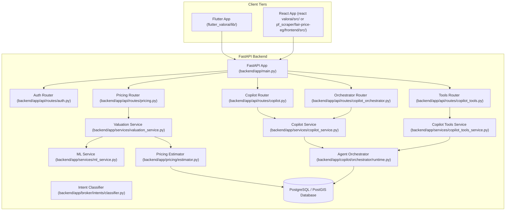
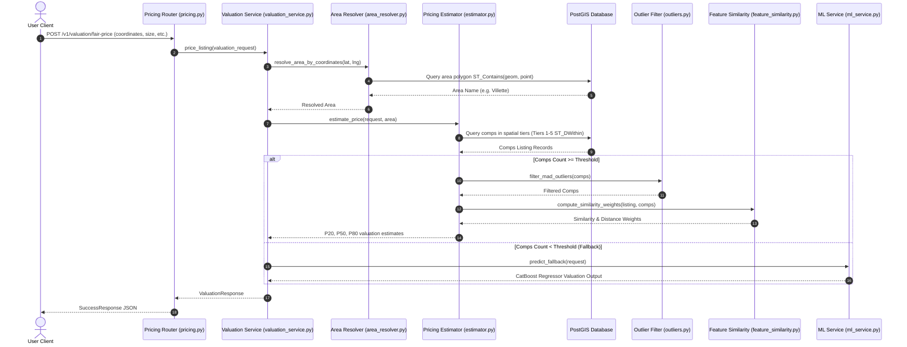
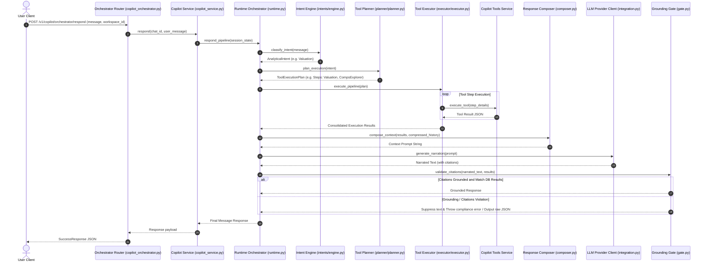
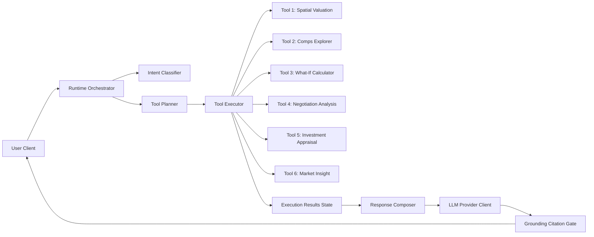
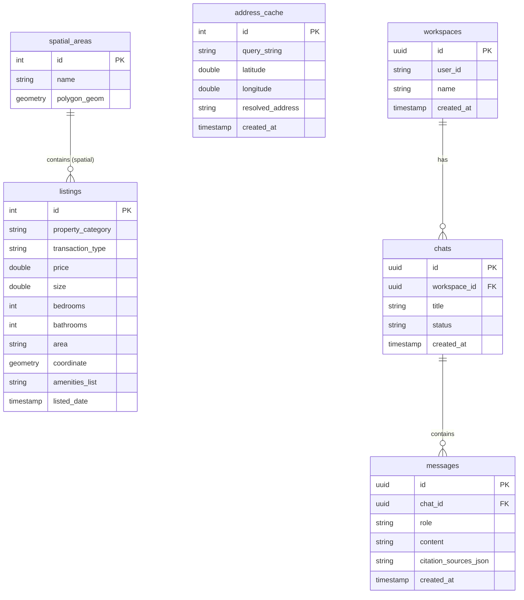

# Project Knowledge Base

This document serves as the single source of truth for the ValorAI codebase audit, project understanding, and forensic analysis.

---

# System Architecture

The ValorAI platform is an AI-powered real estate intelligence platform built with a mobile-first Flutter client and a FastAPI python backend backed by PostgreSQL/PostGIS database.

```mermaid
flowchart TD
    subgraph Mobile Client (Flutter UI)
        UI[App Screens] <-->|Bloc / Riverpod States| Controllers[Feature Controllers]
        Controllers <-->|Dio HTTP Requests| PublicClient[Public API Client]
        Controllers <-->|Bearer JWT SSE| AuthClient[Authenticated SSE Client]
    end

    subgraph Backend Gateways (FastAPI Router)
        PublicClient -->|/v1/valuation/| ValRouter[Valuation Route]
        AuthClient -->|/v1/copilot/| CopilotRouter[Copilot Router]
        AuthClient -->|/v1/broker/stream| SSE[SSE Controller]
    end

    subgraph Orchestrator Plane (services/copilot_service.py)
        CopilotRouter -->|run| Exec[Runtime V1 Activation]
        Exec -->|1. Classify| Intent[Intent Engine]
        Exec -->|2. Schedule| Planner[Tool Planner]
        Exec -->|3. Invoke| ToolExec[Tool Executor]
        Exec -->|4. Normalize| Composer[Response Composer]
        Exec -->|5. Context| Memory[Memory Integration]
        Exec -->|6. Stream| LLM[LLM Narrator]
    end

    subgraph Truth Layer (Tools 1-8)
        ToolExec -->|Tool 1: valuation| ValService[valuation_service.py]
        ToolExec -->|Tool 5: what-if| WhatIfService[what_if]
        ToolExec -->|Tool 6: negotiation| NegService[negotiation]
        ToolExec -->|Tool 7: investment| InvService[investment]
        ToolExec -->|Tool 8: market-insight| MarketService[market_insight]
    end

    subgraph Mathematical Pricing Layer
        ValService -->|CMT Search Tiers| Selector[selector.py]
        Selector -->|recursive SQL| DB[(PostgreSQL + PostGIS)]
        ValService -->|Prune Outliers| MAD[filters.py: MAD outlier removal]
        ValService -->|Scoring weights| Weights[weights.py: weighted median]
        
        ValService -->|Fallback Inference| MLService[ml_service.py]
        MLService -->|Predict| CatBoost[(CatBoost Models: Rent & Sale)]
        MLService -->|Explainability| SHAP[SHAP Feature Importance]
    end

    subgraph Persistence Layer
        DB <-->|workspaces, chats, messages, properties| Memory
        DB -->|insert logs| Monitoring[monitoring_service.py]
        Monitoring -->|write prediction_logs| PredictionLogs[(prediction_logs)]
        Monitoring -->|write shadow_logs| ShadowLogs[(shadow_logs)]
    end
```
*Source: project_deep_analysis/14_final_architecture.md*

---

# Frontend Architecture

The frontend is a Flutter mobile application located under `flutter_valorai/`. 
- **Folder Structure**: Clean architecture, feature-first structure (e.g. auth, copilot, home, onboarding, profile, valuation, workspace).
- **Theme**: Material 3 dark theme is implemented.
- **Routing**: GoRouter handles routing (router configurations in app/router/).
- **State Management**: Bloc / Riverpod (states feed screens).
- **Network**: Authenticated Dio client injecting bearer JWT and handling auth interception.
- **Storage**: `flutter_secure_storage` stores the ValorAI JWT and user metadata.
- **Maps**: Google Maps integrates latitude and longitude capture and comparable markers.
*Source: PROJECT_MASTER_STATE_v3.md*

---

# Backend Architecture

The backend is a FastAPI application located under `pf_scraper/fair-price-eg/backend/`.
- **API Gateways**: Exposes public routers for health checks and direct valuations, and authenticated routers (requiring JWTs) for workspaces, chats, and Copilot orchestrator functions.
- **Service Layers**: Includes `CopilotService`, `CopilotToolsService`, `MLService`, `MonitoringService`, `RouterService`, and `ValuationService`.
- **Asynchronous tasks**: FastAPI `BackgroundTasks` executes a shadow prediction pipeline on the alternative model after valuations are generated.
*Source: project_deep_analysis/14_final_architecture.md*

---

# Database Architecture

The persistence layer uses PostgreSQL with the PostGIS extension.
- **Tables**: Tracks workspaces, chats, messages, property details, prediction logs, and shadow logs.
- **Geospatial checks**: Runs geospatial containment checks on coordinate coordinates to map locations to governerates, cities, and districts.
- **Migrations**: Database migrations are handled sequentially (000_baseline.sql to 008_market_insight_analytics_indexes.sql).
*Source: project_deep_analysis/14_final_architecture.md, PROJECT_MASTER_STATE_v3.md*

---

# Authentication Flow

ValorAI uses Firebase Authentication as the identity provider on the client side.
1. **Client Exchange**: The Flutter client authenticates against Firebase (email/password, Google, or Apple) and obtains a Firebase ID token.
2. **Token Exchange**: The client sends the Firebase ID token via `POST /v1/auth/token-exchange` to the backend.
3. **Verification**: The backend verifies the Firebase ID token signature (RS256) using Google signing certificates, validating issuer and audience claims.
4. **Session Issuance**: Upon successful verification, the backend provisions/looks up the user and issues a ValorAI HS256 JWT.
5. **Secure Storage**: The Flutter client stores this JWT in secure storage and attaches it as a Bearer token in subsequent requests.
6. **Refresh/Clean up**: Handles 401 token refresh retry and deletes local storage on logout.
*Source: PROJECT_MASTER_STATE_v3.md*

---

# Agent Architecture

The Copilot is governed by an agent orchestrator:
1. **Intent Classification**: The `RuleBasedIntentEngine` processes user message input to identify intents (e.g. WHAT_IF, NEGOTIATION, COMPARISON).
2. **Tool Planning**: The Tool Planner lists required tool invocations (from Tools 1-8).
3. **Tool Execution**: The Tool Executor coordinates parallel/sequential calls to the truth layer APIs.
4. **Context Composition**: The Response Composer merges tool execution results and compresses context window size.
5. **Narration & Grounding**: The LLM Narrator translates the structured context into natural language. The Narration Admission Gate verifies grounding against composed facts and blocks prohibited claims.
*Source: project_deep_analysis/14_final_architecture.md*

---

# RAG Flow

The agent retrieves history and current session context:
- Context from the active screen (Property, Value, Confidence, Comparables) is fed into the context array.
- Workspace documents and database message tables provide chat history matching the active workspace.
*Source: PROJECT_MASTER_STATE_v3.md, project_deep_analysis/14_final_architecture.md*

---

# CMT Flow

Comparable Market Tier (CMT) is the primary deterministic valuation method:
1. **Location Resolution**: Maps property coordinates to Governorates, Cities, Districts, and Compounds.
2. **Tier-based Querying**: Searches database recursively from Tier 1 (highly matching local comparables) through Tier 5 (broader radius up to 15km).
3. **Outlier Filtering**: Uses Median Absolute Deviation (MAD) to filter outlier prices.
4. **Weighted Median**: Ranks remaining comparables using spatial and feature-similarity metrics to calculate P20, P50, and P80 price bounds.
*Source: project_deep_analysis/14_final_architecture.md*

---

# Hybrid Search Flow

When CMT does not yield sufficient comparables, the system falls back to ML inference:
- **ML Fallback**: Runs CatBoost regression models to estimate prices.
- **Explainability**: Applies SHAP to explain feature weights for the prediction.
- **Shadow Runs**: When CMT succeeds, the ML model is executed in the background to log performance variance to `shadow_logs`. When ML is active, the CMT is shadow-run.
*Source: project_deep_analysis/14_final_architecture.md*

---

# Copilot Flow

* Natural language message -> Intent Classification -> Plan Generation -> Tool Invocation -> Context Compression -> LLM Generation -> Grounding Policy Validation -> Streaming SSE Response.
* Violating the grounding policies results in a deterministic fallback that suppresses text generation and returns raw JSON payload.
*Source: project_deep_analysis/14_final_architecture.md*

---

# Tool Calling Flow

- **Tool 1**: Valuation Service
- **Tool 5**: What-If Analysis
- **Tool 6**: Negotiation Support
- **Tool 7**: Investment Modeling
- **Tool 8**: Market Insight Analytics
*Source: project_deep_analysis/14_final_architecture.md*

---

# API Inventory

1. `POST /v1/auth/token-exchange`: Exchanged Firebase ID token for ValorAI JWT.
2. `POST /v1/valuation/fair-price`: Submits property details to estimate valuation.
3. `POST /v1/copilot/orchestrator/respond`: Main conversational endpoint.
4. `GET /v1/copilot/users/me`: Current user session retrieve.
5. `GET /v1/copilot/workspaces`: Retrieve user workspaces list.
6. `GET /v1/copilot/workspaces/{workspace_id}/properties`: Retrieve properties inside workspace.
7. `GET /v1/copilot/workspaces/{workspace_id}/chats`: Retrieve chats inside workspace.
8. `/v1/broker/stream`: Server-sent events streaming dialogue channel.
*Source: PROJECT_MASTER_STATE_v3.md, project_deep_analysis/14_final_architecture.md*

---

# Database Inventory

- `prediction_logs`: Table logging valuation outcomes.
- `shadow_logs`: Table tracking ML/CMT model drift during shadow execution.
- `workspaces`: Table for user workspaces.
- `chats` and `messages`: Tables mapping user sessions and messages.
- `properties`: Real-estate property records.
*Source: project_deep_analysis/14_final_architecture.md*

---

# Service Inventory

- `valuation_service.py`: Valuation estimator logic.
- `ml_service.py`: CatBoost and SHAP model wrappers.
- `copilot_service.py`: Main orchestrator orchestrating Intent, Planner, and LLM Narrator.
- `monitoring_service.py`: Performance metrics logs recorder.
- `copilot_tools_service.py`: Tools execution adapter.
- `router_service.py`: Service manager routing.
*Source: project_deep_analysis/14_final_architecture.md*

---

# State Management

- **Flutter**: Riverpod / Bloc. `WorkspaceStateManager` manages the current workspace ID, which binds home header displays, valuation saves, and copilot message payloads. `AuthSessionManager` handles authorization states and login sessions.
*Source: PROJECT_MASTER_STATE_v3.md*

---

# Deployment Architecture

- **Backend**: Python FastAPI package with Docker, containerized in a multi-stage Docker environment.
- **Database**: Postgres + PostGIS database.
*Source: PROJECT_MASTER_STATE_v3.md, project_deep_analysis/14_final_architecture.md*

---

# File Audits

*This section documents files audited in successive batches.*

---
## FILE
/architecture.md

### PURPOSE
Documentation file. Content header: Diagram 1: Full System Architecture -> Purpose -> To explain the entire ValorAI platform in a single, visual diagram, illustrating how the system separates presentation, application routing, core mathematical engines, spatial persistence layers, and the restricted LLM communication gate.

### IMPORTS
None

### CLASSES
None

### FUNCTIONS
None

### DATA FLOW
NOT VERIFIED FROM CODEBASE

### DEPENDENCIES
None

### DATABASE OPERATIONS
List:
* SELECTs: None
* INSERTs: None
* UPDATEs: None
* DELETEs: None
* ORM operations: None

### API OPERATIONS
List:
* Endpoints called: None
* Payloads: None
* Responses handled: None

### OBSERVATIONS
None

### UNVERIFIED
NOT VERIFIED FROM CODEBASE

---


## FILE
/audit_results.json

### PURPOSE
JSON configuration or structured data file: audit_results.json

### IMPORTS
None

### CLASSES
None

### FUNCTIONS
None

### DATA FLOW
NOT VERIFIED FROM CODEBASE

### DEPENDENCIES
None

### DATABASE OPERATIONS
List:
* SELECTs: None
* INSERTs: None
* UPDATEs: None
* DELETEs: None
* ORM operations: None

### API OPERATIONS
List:
* Endpoints called: None
* Payloads: None
* Responses handled: None

### OBSERVATIONS
None

### UNVERIFIED
NOT VERIFIED FROM CODEBASE

---


## FILE
/dean.md

### PURPOSE
Documentation file. Content header: ValorAI: A Governed Agentic Intelligence Platform for Real Estate Decision Making -> **System Technical Audit & Architecture Report**

### IMPORTS
None

### CLASSES
None

### FUNCTIONS
None

### DATA FLOW
NOT VERIFIED FROM CODEBASE

### DEPENDENCIES
None

### DATABASE OPERATIONS
List:
* SELECTs: None
* INSERTs: None
* UPDATEs: None
* DELETEs: None
* ORM operations: None

### API OPERATIONS
List:
* Endpoints called: None
* Payloads: None
* Responses handled: None

### OBSERVATIONS
None

### UNVERIFIED
NOT VERIFIED FROM CODEBASE

---


## FILE
/DISCOVERY_REPORT.md

### PURPOSE
Documentation file. Content header: ValorAI Mobile Discovery Report -> **Date:** June 2, 2026

### IMPORTS
None

### CLASSES
None

### FUNCTIONS
None

### DATA FLOW
NOT VERIFIED FROM CODEBASE

### DEPENDENCIES
None

### DATABASE OPERATIONS
List:
* SELECTs: None
* INSERTs: None
* UPDATEs: None
* DELETEs: None
* ORM operations: None

### API OPERATIONS
List:
* Endpoints called: None
* Payloads: None
* Responses handled: None

### OBSERVATIONS
None

### UNVERIFIED
NOT VERIFIED FROM CODEBASE

---


## FILE
/frontend.md

### PURPOSE
Documentation file. Content header: ValorAI Flutter Frontend Guide -> **Last updated:** June 2, 2026

### IMPORTS
None

### CLASSES
None

### FUNCTIONS
None

### DATA FLOW
NOT VERIFIED FROM CODEBASE

### DEPENDENCIES
None

### DATABASE OPERATIONS
List:
* SELECTs: None
* INSERTs: None
* UPDATEs: None
* DELETEs: None
* ORM operations: None

### API OPERATIONS
List:
* Endpoints called: None
* Payloads: None
* Responses handled: None

### OBSERVATIONS
None

### UNVERIFIED
NOT VERIFIED FROM CODEBASE

---


## FILE
/hybrid_forensics.md

### PURPOSE
Documentation file. Content header: ValorAI Valuation Evolution Forensic Audit -> **Subject:** Hybrid Valuation Model Evolution (V1, V2, and V3)

### IMPORTS
None

### CLASSES
None

### FUNCTIONS
None

### DATA FLOW
NOT VERIFIED FROM CODEBASE

### DEPENDENCIES
None

### DATABASE OPERATIONS
List:
* SELECTs: None
* INSERTs: None
* UPDATEs: None
* DELETEs: None
* ORM operations: None

### API OPERATIONS
List:
* Endpoints called: None
* Payloads: None
* Responses handled: None

### OBSERVATIONS
None

### UNVERIFIED
NOT VERIFIED FROM CODEBASE

---


## FILE
/ppt.md

### PURPOSE
Empty markdown file.

### IMPORTS
None

### CLASSES
None

### FUNCTIONS
None

### DATA FLOW
NOT VERIFIED FROM CODEBASE

### DEPENDENCIES
None

### DATABASE OPERATIONS
List:
* SELECTs: None
* INSERTs: None
* UPDATEs: None
* DELETEs: None
* ORM operations: None

### API OPERATIONS
List:
* Endpoints called: None
* Payloads: None
* Responses handled: None

### OBSERVATIONS
None

### UNVERIFIED
NOT VERIFIED FROM CODEBASE

---


## FILE
/PROJECT_MASTER_STATE_V2.md

### PURPOSE
Documentation file. Content header: ValorAI Project Master State V2 -> Authoritative rebuild date: 2026-06-02

### IMPORTS
None

### CLASSES
None

### FUNCTIONS
None

### DATA FLOW
NOT VERIFIED FROM CODEBASE

### DEPENDENCIES
None

### DATABASE OPERATIONS
List:
* SELECTs: None
* INSERTs: None
* UPDATEs: None
* DELETEs: None
* ORM operations: None

### API OPERATIONS
List:
* Endpoints called: None
* Payloads: None
* Responses handled: None

### OBSERVATIONS
None

### UNVERIFIED
NOT VERIFIED FROM CODEBASE

---


## FILE
/PROJECT_MASTER_STATE_v3.md

### PURPOSE
Documentation file. Content header: ValorAI Project Master State v3 -> **Last updated:** June 2, 2026

### IMPORTS
None

### CLASSES
None

### FUNCTIONS
None

### DATA FLOW
NOT VERIFIED FROM CODEBASE

### DEPENDENCIES
None

### DATABASE OPERATIONS
List:
* SELECTs: None
* INSERTs: None
* UPDATEs: None
* DELETEs: None
* ORM operations: None

### API OPERATIONS
List:
* Endpoints called: None
* Payloads: None
* Responses handled: None

### OBSERVATIONS
None

### UNVERIFIED
NOT VERIFIED FROM CODEBASE

---


## FILE
/run_explainability_audit.py

### PURPOSE
Audits response latency and status code correctness for local valuation endpoints (/v1/valuation/fair-price and /v1/rent/fair-price) across 5 test cases, and outputs performance logs to audit_results.json.

### IMPORTS
- json
- requests
- time

### CLASSES
None

### FUNCTIONS
* make_payload
  * Parameters: lat, lng, ptype, size, beds, baths, compound, target, category
  * Return Values: NOT VERIFIED FROM CODEBASE
  * Database Access: NOT VERIFIED FROM CODEBASE
  * API Calls: NOT VERIFIED FROM CODEBASE
  * External Dependencies: NOT VERIFIED FROM CODEBASE
  * Exact Execution Flow: NOT VERIFIED FROM CODEBASE

### DATA FLOW
Creates payload -> Sends POST request to API endpoints -> Logs elapsed time -> Saves metrics and responses to audit_results.json.

### DEPENDENCIES
- json
- requests
- time

### DATABASE OPERATIONS
List:
* SELECTs: None
* INSERTs: None
* UPDATEs: None
* DELETEs: None
* ORM operations: None

### API OPERATIONS
List:
* Endpoints called: /v1/valuation/fair-price, /v1/rent/fair-price
* Payloads: RentFairPriceRequest JSON payloads
* Responses handled: JSON outputs (saved to audit_results.json)

### OBSERVATIONS
Uses a fallback to '/v1/rent/fair-price' if the primary endpoint returns 404. Test cases are hardcoded to Zamalek and Madinaty coordinates.

### UNVERIFIED
NOT VERIFIED FROM CODEBASE

---


## FILE
/VALORAI.md

### PURPOSE
Documentation file. Content header: ValorAI: Governed Agentic Intelligence for Real Estate Decision Making -> 1. Introduction -> ValorAI is a governed agentic intelligence platform designed for spatial analysis, valuation modeling, and conversational reasoning in emerging real estate markets. Built as a staging-grade system for the Egyptian property market, it addresses the core vulnerability of conversational applications: the direct coupling of Large Language Models (LLMs) to reasoning, math, and data retrieval tasks, which leads to hallucinations and transactional instability.

### IMPORTS
None

### CLASSES
None

### FUNCTIONS
None

### DATA FLOW
NOT VERIFIED FROM CODEBASE

### DEPENDENCIES
None

### DATABASE OPERATIONS
List:
* SELECTs: None
* INSERTs: None
* UPDATEs: None
* DELETEs: None
* ORM operations: None

### API OPERATIONS
List:
* Endpoints called: None
* Payloads: None
* Responses handled: None

### OBSERVATIONS
None

### UNVERIFIED
NOT VERIFIED FROM CODEBASE

---


## FILE
/cmt_test/analyze_results.py

### PURPOSE
Processes leave-one-out evaluation results by computing overall accuracy metrics (MAPE, MdAPE, RMSE, MAE, R2), segment-level statistics (locations, property attributes), and confidence correlations, and exports reports and matplotlib plots.

### IMPORTS
- app.db.session.SessionLocal
- dotenv.load_dotenv
- matplotlib.pyplot
- numpy
- os
- pandas
- sqlalchemy.text
- sys

### CLASSES
None

### FUNCTIONS
* compute_metrics_dict
  * Parameters: df
  * Return Values: NOT VERIFIED FROM CODEBASE
  * Database Access: NOT VERIFIED FROM CODEBASE
  * API Calls: NOT VERIFIED FROM CODEBASE
  * External Dependencies: NOT VERIFIED FROM CODEBASE
  * Exact Execution Flow: NOT VERIFIED FROM CODEBASE
* main
  * Parameters: None
  * Return Values: NOT VERIFIED FROM CODEBASE
  * Database Access: NOT VERIFIED FROM CODEBASE
  * API Calls: NOT VERIFIED FROM CODEBASE
  * External Dependencies: NOT VERIFIED FROM CODEBASE
  * Exact Execution Flow: NOT VERIFIED FROM CODEBASE

### DATA FLOW
Loads results_500.csv and sample_500.csv -> Merges them -> Queries area hierarchy recursively from Postgres DB -> Joins areas to listings -> Computes metrics -> Writes CSV metrics and markdown reports -> Renders Matplotlib plots.

### DEPENDENCIES
- app.db.session.SessionLocal
- dotenv.load_dotenv
- matplotlib.pyplot
- numpy
- os
- pandas
- sqlalchemy.text
- sys

### DATABASE OPERATIONS
List:
* SELECTs: Recursive CTE area hierarchy query on areas table
* INSERTs: None
* UPDATEs: None
* DELETEs: None
* ORM operations: SQL Alchemy direct text query execution

### API OPERATIONS
List:
* Endpoints called: None
* Payloads: None
* Responses handled: None

### OBSERVATIONS
Sets MdAPE <= 15% and Coverage >= 90% as the threshold for 'Production Ready'. Uses recursive CTE on 'areas' table to build geographical hierarchy.

### UNVERIFIED
NOT VERIFIED FROM CODEBASE

---


## FILE
/cmt_test/final_report.md

### PURPOSE
Documentation file. Content header: CMT Valuation Engine Empirical Evaluation Report -> This report compiles the empirical performance diagnostics of the CMT (Comparable Market Trend) valuation engine based on actual Leave-One-Out (LOO) execution.

### IMPORTS
None

### CLASSES
None

### FUNCTIONS
None

### DATA FLOW
NOT VERIFIED FROM CODEBASE

### DEPENDENCIES
None

### DATABASE OPERATIONS
List:
* SELECTs: None
* INSERTs: None
* UPDATEs: None
* DELETEs: None
* ORM operations: None

### API OPERATIONS
List:
* Endpoints called: None
* Payloads: None
* Responses handled: None

### OBSERVATIONS
None

### UNVERIFIED
NOT VERIFIED FROM CODEBASE

---


## FILE
/cmt_test/run_evaluation.py

### PURPOSE
Runs empirical valuation validation using a Leave-One-Out (LOO) loop. It queries residential rent listings from database, draws a sample (500 or 5 for dry-run), and for each sample listing, deletes it in a transaction, requests its valuation via price_listing, and rolls back the transaction.

### IMPORTS
- app.api.schemas.pricing.RentFairPriceRequest
- app.db.session.SessionLocal
- app.services.valuation_service.price_listing
- argparse
- dotenv.load_dotenv
- os
- pandas
- random
- sqlalchemy.text
- sys
- time

### CLASSES
None

### FUNCTIONS
* parse_args
  * Parameters: None
  * Return Values: NOT VERIFIED FROM CODEBASE
  * Database Access: NOT VERIFIED FROM CODEBASE
  * API Calls: NOT VERIFIED FROM CODEBASE
  * External Dependencies: NOT VERIFIED FROM CODEBASE
  * Exact Execution Flow: NOT VERIFIED FROM CODEBASE
* main
  * Parameters: None
  * Return Values: NOT VERIFIED FROM CODEBASE
  * Database Access: NOT VERIFIED FROM CODEBASE
  * API Calls: NOT VERIFIED FROM CODEBASE
  * External Dependencies: NOT VERIFIED FROM CODEBASE
  * Exact Execution Flow: NOT VERIFIED FROM CODEBASE

### DATA FLOW
Fetch candidates from DB -> Draw random sample -> Write sampled attributes to sample_*.csv -> For each sampled listing, start transaction -> Delete listing -> Request price_listing -> Log results -> Rollback transaction to restore listing -> Write output csv.

### DEPENDENCIES
- app.api.schemas.pricing.RentFairPriceRequest
- app.db.session.SessionLocal
- app.services.valuation_service.price_listing
- argparse
- dotenv.load_dotenv
- os
- pandas
- random
- sqlalchemy.text
- sys
- time

### DATABASE OPERATIONS
List:
* SELECTs: Query residential rent candidates from listings and areas tables
* INSERTs: None
* UPDATEs: None
* DELETEs: Deletes active listing under test in LOO transaction: DELETE FROM listings WHERE listing_id = :id
* ORM operations: Executed via SQLAlchemy SessionLocal and transaction control (db.rollback() in finally)

### API OPERATIONS
List:
* Endpoints called: None
* Payloads: None
* Responses handled: None

### OBSERVATIONS
Uses transaction rollback to verify valuation without mutating data. Sets a seed of 42 by default for sampling reproducibility.

### UNVERIFIED
NOT VERIFIED FROM CODEBASE

---


## FILE
/cmt_test/reports/accuracy_report.md

### PURPOSE
Documentation file. Content header: Accuracy Metrics Report -> This report presents overall accuracy metrics of the CMT valuation engine for 100, 250, and 500 listing samples.

### IMPORTS
None

### CLASSES
None

### FUNCTIONS
None

### DATA FLOW
NOT VERIFIED FROM CODEBASE

### DEPENDENCIES
None

### DATABASE OPERATIONS
List:
* SELECTs: None
* INSERTs: None
* UPDATEs: None
* DELETEs: None
* ORM operations: None

### API OPERATIONS
List:
* Endpoints called: None
* Payloads: None
* Responses handled: None

### OBSERVATIONS
None

### UNVERIFIED
NOT VERIFIED FROM CODEBASE

---


## FILE
/cmt_test/reports/cmt_execution_map.md

### PURPOSE
Documentation file. Content header: CMT Execution Map & Call Trace -> This report documents the callable entrypoints, routing rules, and execution flow of the CMT (Comparable Market Trend) valuation engine.

### IMPORTS
None

### CLASSES
None

### FUNCTIONS
None

### DATA FLOW
NOT VERIFIED FROM CODEBASE

### DEPENDENCIES
None

### DATABASE OPERATIONS
List:
* SELECTs: None
* INSERTs: None
* UPDATEs: None
* DELETEs: None
* ORM operations: None

### API OPERATIONS
List:
* Endpoints called: None
* Payloads: None
* Responses handled: None

### OBSERVATIONS
None

### UNVERIFIED
NOT VERIFIED FROM CODEBASE

---


## FILE
/cmt_test/reports/confidence_validation.md

### PURPOSE
Documentation file. Content header: Confidence Score Validation Report -> Correlation between confidence and absolute percentage error: **-0.1436**

### IMPORTS
None

### CLASSES
None

### FUNCTIONS
None

### DATA FLOW
NOT VERIFIED FROM CODEBASE

### DEPENDENCIES
None

### DATABASE OPERATIONS
List:
* SELECTs: None
* INSERTs: None
* UPDATEs: None
* DELETEs: None
* ORM operations: None

### API OPERATIONS
List:
* Endpoints called: None
* Payloads: None
* Responses handled: None

### OBSERVATIONS
None

### UNVERIFIED
NOT VERIFIED FROM CODEBASE

---


## FILE
/cmt_test/reports/error_forensics.md

### PURPOSE
Documentation file. Content header: Error Forensics Report -> Top 50 Worst Predictions Analysis -> | Listing ID | Actual Price | Predicted Price | Error % | Confidence | Comps Count | Tier Used | Primary Failure Reason |

### IMPORTS
None

### CLASSES
None

### FUNCTIONS
None

### DATA FLOW
NOT VERIFIED FROM CODEBASE

### DEPENDENCIES
None

### DATABASE OPERATIONS
List:
* SELECTs: None
* INSERTs: None
* UPDATEs: None
* DELETEs: None
* ORM operations: None

### API OPERATIONS
List:
* Endpoints called: None
* Payloads: None
* Responses handled: None

### OBSERVATIONS
None

### UNVERIFIED
NOT VERIFIED FROM CODEBASE

---


## FILE
/cmt_test/reports/segment_analysis.md

### PURPOSE
Documentation file. Content header: Segment Analysis Report -> Performance metrics broken down by listing attributes and locations.

### IMPORTS
None

### CLASSES
None

### FUNCTIONS
None

### DATA FLOW
NOT VERIFIED FROM CODEBASE

### DEPENDENCIES
None

### DATABASE OPERATIONS
List:
* SELECTs: None
* INSERTs: None
* UPDATEs: None
* DELETEs: None
* ORM operations: None

### API OPERATIONS
List:
* Endpoints called: None
* Payloads: None
* Responses handled: None

### OBSERVATIONS
None

### UNVERIFIED
NOT VERIFIED FROM CODEBASE

---


## FILE
/cmt_test/reports/tier_analysis.md

### PURPOSE
Documentation file. Content header: Tier Analysis Report -> | Tier | Label | Sample Count | MAPE | Median Error | Trustworthy? |

### IMPORTS
None

### CLASSES
None

### FUNCTIONS
None

### DATA FLOW
NOT VERIFIED FROM CODEBASE

### DEPENDENCIES
None

### DATABASE OPERATIONS
List:
* SELECTs: None
* INSERTs: None
* UPDATEs: None
* DELETEs: None
* ORM operations: None

### API OPERATIONS
List:
* Endpoints called: None
* Payloads: None
* Responses handled: None

### OBSERVATIONS
None

### UNVERIFIED
NOT VERIFIED FROM CODEBASE

---


## FILE
/docs/COMPARABLES_NARRATION_CONTRACT.md

### PURPOSE
Documentation file. Content header: ValorAI Comparables Narration Contract -> Decision date: 2026-06-02

### IMPORTS
None

### CLASSES
None

### FUNCTIONS
None

### DATA FLOW
NOT VERIFIED FROM CODEBASE

### DEPENDENCIES
None

### DATABASE OPERATIONS
List:
* SELECTs: None
* INSERTs: None
* UPDATEs: None
* DELETEs: None
* ORM operations: None

### API OPERATIONS
List:
* Endpoints called: None
* Payloads: None
* Responses handled: None

### OBSERVATIONS
None

### UNVERIFIED
NOT VERIFIED FROM CODEBASE

---


## FILE
/docs/COPILOT_ORCHESTRATOR_ARCHITECTURE.md

### PURPOSE
Documentation file. Content header: Copilot Orchestrator Architecture (Phase 5.5C) -> 1. Executive Summary -> Phase 5.5C introduces the Copilot Orchestrator, a fully governed conversational layer that sits above the existing Tool Layer (Tools 1-8). The Orchestrator acts as the central control plane for understanding user intent, mapping intents to deterministic Tools, compressing output, and safely streaming natural language responses. It strictly preserves TruthLayer authority, eliminating LLM hallucination risks in real estate valuation.

### IMPORTS
None

### CLASSES
None

### FUNCTIONS
None

### DATA FLOW
NOT VERIFIED FROM CODEBASE

### DEPENDENCIES
None

### DATABASE OPERATIONS
List:
* SELECTs: None
* INSERTs: None
* UPDATEs: None
* DELETEs: None
* ORM operations: None

### API OPERATIONS
List:
* Endpoints called: None
* Payloads: None
* Responses handled: None

### OBSERVATIONS
None

### UNVERIFIED
NOT VERIFIED FROM CODEBASE

---


## FILE
/docs/COPILOT_ORCHESTRATOR_COMPOSER_ARCHITECTURE.md

### PURPOSE
Documentation file. Content header: Phase 5.5C: Response Composer Architecture -> Component Overview -> The **Response Composer** is a strict deterministic software component sitting between Tool Execution and the final LLM generation step. It protects the LLM from raw, massive TruthLayer payloads and enforces mathematical safety.

### IMPORTS
None

### CLASSES
None

### FUNCTIONS
None

### DATA FLOW
NOT VERIFIED FROM CODEBASE

### DEPENDENCIES
None

### DATABASE OPERATIONS
List:
* SELECTs: None
* INSERTs: None
* UPDATEs: None
* DELETEs: None
* ORM operations: None

### API OPERATIONS
List:
* Endpoints called: None
* Payloads: None
* Responses handled: None

### OBSERVATIONS
None

### UNVERIFIED
NOT VERIFIED FROM CODEBASE

---


## FILE
/docs/COPILOT_ORCHESTRATOR_CONTEXT_COMPRESSION.md

### PURPOSE
Documentation file. Content header: Phase 5.5C: Context Compression Strategy -> Problem -> Tool outputs from TruthLayer (especially Tools 1, 3, 5, 6) can contain massive JSON payloads. Injecting 49 comparable rows, complete SHAP paths, and complex scenario lineages directly into the LLM context causes:

### IMPORTS
None

### CLASSES
None

### FUNCTIONS
None

### DATA FLOW
NOT VERIFIED FROM CODEBASE

### DEPENDENCIES
None

### DATABASE OPERATIONS
List:
* SELECTs: None
* INSERTs: None
* UPDATEs: None
* DELETEs: None
* ORM operations: None

### API OPERATIONS
List:
* Endpoints called: None
* Payloads: None
* Responses handled: None

### OBSERVATIONS
None

### UNVERIFIED
NOT VERIFIED FROM CODEBASE

---


## FILE
/docs/COPILOT_ORCHESTRATOR_DECISION_LOG.md

### PURPOSE
Documentation file. Content header: Phase 5.5C: Copilot Orchestrator Decision Log -> Decision 1: Architecture Pattern -> - **Decision:** Adopt Alternative B (Deterministic Multi-Step Pipeline: Intent -> Plan -> Execute -> Narrate).

### IMPORTS
None

### CLASSES
None

### FUNCTIONS
None

### DATA FLOW
NOT VERIFIED FROM CODEBASE

### DEPENDENCIES
None

### DATABASE OPERATIONS
List:
* SELECTs: None
* INSERTs: None
* UPDATEs: None
* DELETEs: None
* ORM operations: None

### API OPERATIONS
List:
* Endpoints called: None
* Payloads: None
* Responses handled: None

### OBSERVATIONS
None

### UNVERIFIED
NOT VERIFIED FROM CODEBASE

---


## FILE
/docs/COPILOT_ORCHESTRATOR_DISCOVERY_REPORT.md

### PURPOSE
Documentation file. Content header: Phase 5.5C: Copilot Orchestrator Discovery Report -> MISSING INFORMATION REQUIRED -> - **Property Comparison Tool:** The User Journey Analysis requested handling for "Compare these two properties." However, Section 10 of `PROJECT_MASTER_STATE_V2.md` lists only Tools 1-8. None of these tools explicitly support arbitrary dual-property comparison. Tool 3 only retrieves TruthLayer comparable evidence for a single property/snapshot. An architectural decision for this specific journey cannot be made until this capability is defined.

### IMPORTS
None

### CLASSES
None

### FUNCTIONS
None

### DATA FLOW
NOT VERIFIED FROM CODEBASE

### DEPENDENCIES
None

### DATABASE OPERATIONS
List:
* SELECTs: None
* INSERTs: None
* UPDATEs: None
* DELETEs: None
* ORM operations: None

### API OPERATIONS
List:
* Endpoints called: None
* Payloads: None
* Responses handled: None

### OBSERVATIONS
None

### UNVERIFIED
NOT VERIFIED FROM CODEBASE

---


## FILE
/docs/COPILOT_ORCHESTRATOR_OPEN_QUESTIONS.md

### PURPOSE
Documentation file. Content header: Phase 5.5C: Copilot Orchestrator Open Questions -> MISSING INFORMATION REQUIRED -> **1. Property Comparison Capability**

### IMPORTS
None

### CLASSES
None

### FUNCTIONS
None

### DATA FLOW
NOT VERIFIED FROM CODEBASE

### DEPENDENCIES
None

### DATABASE OPERATIONS
List:
* SELECTs: None
* INSERTs: None
* UPDATEs: None
* DELETEs: None
* ORM operations: None

### API OPERATIONS
List:
* Endpoints called: None
* Payloads: None
* Responses handled: None

### OBSERVATIONS
None

### UNVERIFIED
NOT VERIFIED FROM CODEBASE

---


## FILE
/docs/COPILOT_ORCHESTRATOR_REVIEW_ROUND2.md

### PURPOSE
Documentation file. Content header: Phase 5.5C: Copilot Orchestrator Review Round 2 -> Section 1: Property Comparison Strategy -> **Decision:**

### IMPORTS
None

### CLASSES
None

### FUNCTIONS
None

### DATA FLOW
NOT VERIFIED FROM CODEBASE

### DEPENDENCIES
None

### DATABASE OPERATIONS
List:
* SELECTs: None
* INSERTs: None
* UPDATEs: None
* DELETEs: None
* ORM operations: None

### API OPERATIONS
List:
* Endpoints called: None
* Payloads: None
* Responses handled: None

### OBSERVATIONS
None

### UNVERIFIED
NOT VERIFIED FROM CODEBASE

---


## FILE
/docs/COPILOT_ORCHESTRATOR_RISK_REPORT.md

### PURPOSE
Documentation file. Content header: Phase 5.5C: Copilot Orchestrator Risk Report -> | Priority | Risk | Mitigation Strategy | Evidence Source |

### IMPORTS
None

### CLASSES
None

### FUNCTIONS
None

### DATA FLOW
NOT VERIFIED FROM CODEBASE

### DEPENDENCIES
None

### DATABASE OPERATIONS
List:
* SELECTs: None
* INSERTs: None
* UPDATEs: None
* DELETEs: None
* ORM operations: None

### API OPERATIONS
List:
* Endpoints called: None
* Payloads: None
* Responses handled: None

### OBSERVATIONS
None

### UNVERIFIED
NOT VERIFIED FROM CODEBASE

---


## FILE
/docs/COPILOT_ORCHESTRATOR_TOOL_CHAINING_MATRIX.md

### PURPOSE
Documentation file. Content header: Phase 5.5C: Tool Chaining Workflows -> Context -> Tools 6 (Negotiation) and 7 (Investment) natively orchestrate Tools 1-5 in the backend. The Orchestrator does not need to manually chain Valuation -> Explainability -> Comparable -> Fairness if the intent maps directly to Negotiation or Investment.

### IMPORTS
None

### CLASSES
None

### FUNCTIONS
None

### DATA FLOW
NOT VERIFIED FROM CODEBASE

### DEPENDENCIES
None

### DATABASE OPERATIONS
List:
* SELECTs: None
* INSERTs: None
* UPDATEs: None
* DELETEs: None
* ORM operations: None

### API OPERATIONS
List:
* Endpoints called: None
* Payloads: None
* Responses handled: None

### OBSERVATIONS
None

### UNVERIFIED
NOT VERIFIED FROM CODEBASE

---


## FILE
/docs/EXPLAINABILITY_NARRATION_CONTRACT.md

### PURPOSE
Documentation file. Content header: ValorAI Explainability Narration Contract -> Decision date: 2026-06-02

### IMPORTS
None

### CLASSES
None

### FUNCTIONS
None

### DATA FLOW
NOT VERIFIED FROM CODEBASE

### DEPENDENCIES
None

### DATABASE OPERATIONS
List:
* SELECTs: None
* INSERTs: None
* UPDATEs: None
* DELETEs: None
* ORM operations: None

### API OPERATIONS
List:
* Endpoints called: None
* Payloads: None
* Responses handled: None

### OBSERVATIONS
None

### UNVERIFIED
NOT VERIFIED FROM CODEBASE

---


## FILE
/docs/FAIRNESS_NARRATION_CONTRACT.md

### PURPOSE
Documentation file. Content header: ValorAI Fairness Narration Contract -> Decision date: 2026-06-02

### IMPORTS
None

### CLASSES
None

### FUNCTIONS
None

### DATA FLOW
NOT VERIFIED FROM CODEBASE

### DEPENDENCIES
None

### DATABASE OPERATIONS
List:
* SELECTs: None
* INSERTs: None
* UPDATEs: None
* DELETEs: None
* ORM operations: None

### API OPERATIONS
List:
* Endpoints called: None
* Payloads: None
* Responses handled: None

### OBSERVATIONS
None

### UNVERIFIED
NOT VERIFIED FROM CODEBASE

---


## FILE
/docs/forensic_valuation_system_audit.md

### PURPOSE
Documentation file. Content header: Forensic Architectural Audit & Reverse Engineering Report -> **Author:** Principal Software Architect, Principal Data Scientist, Principal Database Engineer, Principal Quantitative Researcher, and Principal Real Estate Valuation Expert

### IMPORTS
None

### CLASSES
None

### FUNCTIONS
None

### DATA FLOW
NOT VERIFIED FROM CODEBASE

### DEPENDENCIES
None

### DATABASE OPERATIONS
List:
* SELECTs: None
* INSERTs: None
* UPDATEs: None
* DELETEs: None
* ORM operations: None

### API OPERATIONS
List:
* Endpoints called: None
* Payloads: None
* Responses handled: None

### OBSERVATIONS
None

### UNVERIFIED
NOT VERIFIED FROM CODEBASE

---


## FILE
/docs/GROUNDING_APPROVAL_DECISION.md

### PURPOSE
Documentation file. Content header: ValorAI Grounding Approval Decision -> Decision date: 2026-06-02

### IMPORTS
None

### CLASSES
None

### FUNCTIONS
None

### DATA FLOW
NOT VERIFIED FROM CODEBASE

### DEPENDENCIES
None

### DATABASE OPERATIONS
List:
* SELECTs: None
* INSERTs: None
* UPDATEs: None
* DELETEs: None
* ORM operations: None

### API OPERATIONS
List:
* Endpoints called: None
* Payloads: None
* Responses handled: None

### OBSERVATIONS
None

### UNVERIFIED
NOT VERIFIED FROM CODEBASE

---


## FILE
/docs/GROUNDING_ARCHITECTURE_REVIEW.md

### PURPOSE
Documentation file. Content header: ValorAI Phase 5.5C.6H Grounding Architecture Review -> Review date: 2026-06-02

### IMPORTS
None

### CLASSES
None

### FUNCTIONS
None

### DATA FLOW
NOT VERIFIED FROM CODEBASE

### DEPENDENCIES
None

### DATABASE OPERATIONS
List:
* SELECTs: None
* INSERTs: None
* UPDATEs: None
* DELETEs: None
* ORM operations: None

### API OPERATIONS
List:
* Endpoints called: None
* Payloads: None
* Responses handled: None

### OBSERVATIONS
None

### UNVERIFIED
NOT VERIFIED FROM CODEBASE

---


## FILE
/docs/GROUNDING_BOUNDARY_OWNERSHIP_MATRIX.md

### PURPOSE
Documentation file. Content header: ValorAI Grounding Boundary Ownership Matrix -> Review date: 2026-06-02

### IMPORTS
None

### CLASSES
None

### FUNCTIONS
None

### DATA FLOW
NOT VERIFIED FROM CODEBASE

### DEPENDENCIES
None

### DATABASE OPERATIONS
List:
* SELECTs: None
* INSERTs: None
* UPDATEs: None
* DELETEs: None
* ORM operations: None

### API OPERATIONS
List:
* Endpoints called: None
* Payloads: None
* Responses handled: None

### OBSERVATIONS
None

### UNVERIFIED
NOT VERIFIED FROM CODEBASE

---


## FILE
/docs/GROUNDING_CITATION_POLICY.md

### PURPOSE
Documentation file. Content header: ValorAI Grounding Citation Policy -> Review date: 2026-06-02

### IMPORTS
None

### CLASSES
None

### FUNCTIONS
None

### DATA FLOW
NOT VERIFIED FROM CODEBASE

### DEPENDENCIES
None

### DATABASE OPERATIONS
List:
* SELECTs: None
* INSERTs: None
* UPDATEs: None
* DELETEs: None
* ORM operations: None

### API OPERATIONS
List:
* Endpoints called: None
* Payloads: None
* Responses handled: None

### OBSERVATIONS
None

### UNVERIFIED
NOT VERIFIED FROM CODEBASE

---


## FILE
/docs/GROUNDING_DETERMINISM_REVIEW.md

### PURPOSE
Documentation file. Content header: ValorAI Grounding Determinism Review -> Review date: 2026-06-02

### IMPORTS
None

### CLASSES
None

### FUNCTIONS
None

### DATA FLOW
NOT VERIFIED FROM CODEBASE

### DEPENDENCIES
None

### DATABASE OPERATIONS
List:
* SELECTs: None
* INSERTs: None
* UPDATEs: None
* DELETEs: None
* ORM operations: None

### API OPERATIONS
List:
* Endpoints called: None
* Payloads: None
* Responses handled: None

### OBSERVATIONS
None

### UNVERIFIED
NOT VERIFIED FROM CODEBASE

---


## FILE
/docs/GROUNDING_FAILURE_MATRIX.md

### PURPOSE
Documentation file. Content header: ValorAI Grounding Failure Matrix -> Review date: 2026-06-02

### IMPORTS
None

### CLASSES
None

### FUNCTIONS
None

### DATA FLOW
NOT VERIFIED FROM CODEBASE

### DEPENDENCIES
None

### DATABASE OPERATIONS
List:
* SELECTs: None
* INSERTs: None
* UPDATEs: None
* DELETEs: None
* ORM operations: None

### API OPERATIONS
List:
* Endpoints called: None
* Payloads: None
* Responses handled: None

### OBSERVATIONS
None

### UNVERIFIED
NOT VERIFIED FROM CODEBASE

---


## FILE
/docs/GROUNDING_INPUT_OUTPUT_MATRIX.md

### PURPOSE
Documentation file. Content header: ValorAI Grounding Input and Output Matrix -> Review date: 2026-06-02

### IMPORTS
None

### CLASSES
None

### FUNCTIONS
None

### DATA FLOW
NOT VERIFIED FROM CODEBASE

### DEPENDENCIES
None

### DATABASE OPERATIONS
List:
* SELECTs: None
* INSERTs: None
* UPDATEs: None
* DELETEs: None
* ORM operations: None

### API OPERATIONS
List:
* Endpoints called: None
* Payloads: None
* Responses handled: None

### OBSERVATIONS
None

### UNVERIFIED
NOT VERIFIED FROM CODEBASE

---


## FILE
/docs/GROUNDING_NARRATION_CONTRACT_ENFORCEMENT.md

### PURPOSE
Documentation file. Content header: ValorAI Grounding Narration Contract Enforcement -> Review date: 2026-06-02

### IMPORTS
None

### CLASSES
None

### FUNCTIONS
None

### DATA FLOW
NOT VERIFIED FROM CODEBASE

### DEPENDENCIES
None

### DATABASE OPERATIONS
List:
* SELECTs: None
* INSERTs: None
* UPDATEs: None
* DELETEs: None
* ORM operations: None

### API OPERATIONS
List:
* Endpoints called: None
* Payloads: None
* Responses handled: None

### OBSERVATIONS
None

### UNVERIFIED
NOT VERIFIED FROM CODEBASE

---


## FILE
/docs/GROUNDING_NUMERIC_VALIDATION_POLICY.md

### PURPOSE
Documentation file. Content header: ValorAI Grounding Numeric Validation Policy -> Review date: 2026-06-02

### IMPORTS
None

### CLASSES
None

### FUNCTIONS
None

### DATA FLOW
NOT VERIFIED FROM CODEBASE

### DEPENDENCIES
None

### DATABASE OPERATIONS
List:
* SELECTs: None
* INSERTs: None
* UPDATEs: None
* DELETEs: None
* ORM operations: None

### API OPERATIONS
List:
* Endpoints called: None
* Payloads: None
* Responses handled: None

### OBSERVATIONS
None

### UNVERIFIED
NOT VERIFIED FROM CODEBASE

---


## FILE
/docs/GROUNDING_PROHIBITED_CLAIMS_ENFORCEMENT.md

### PURPOSE
Documentation file. Content header: ValorAI Grounding Prohibited Claims Enforcement -> Review date: 2026-06-02

### IMPORTS
None

### CLASSES
None

### FUNCTIONS
None

### DATA FLOW
NOT VERIFIED FROM CODEBASE

### DEPENDENCIES
None

### DATABASE OPERATIONS
List:
* SELECTs: None
* INSERTs: None
* UPDATEs: None
* DELETEs: None
* ORM operations: None

### API OPERATIONS
List:
* Endpoints called: None
* Payloads: None
* Responses handled: None

### OBSERVATIONS
None

### UNVERIFIED
NOT VERIFIED FROM CODEBASE

---


## FILE
/docs/GROUNDING_RISK_REGISTER.md

### PURPOSE
Documentation file. Content header: ValorAI Grounding Risk Register -> Review date: 2026-06-02

### IMPORTS
None

### CLASSES
None

### FUNCTIONS
None

### DATA FLOW
NOT VERIFIED FROM CODEBASE

### DEPENDENCIES
None

### DATABASE OPERATIONS
List:
* SELECTs: None
* INSERTs: None
* UPDATEs: None
* DELETEs: None
* ORM operations: None

### API OPERATIONS
List:
* Endpoints called: None
* Payloads: None
* Responses handled: None

### OBSERVATIONS
None

### UNVERIFIED
NOT VERIFIED FROM CODEBASE

---


## FILE
/docs/GROUNDING_SECURITY_REVIEW.md

### PURPOSE
Documentation file. Content header: ValorAI Grounding Security Review -> Review date: 2026-06-02

### IMPORTS
None

### CLASSES
None

### FUNCTIONS
None

### DATA FLOW
NOT VERIFIED FROM CODEBASE

### DEPENDENCIES
None

### DATABASE OPERATIONS
List:
* SELECTs: None
* INSERTs: None
* UPDATEs: None
* DELETEs: None
* ORM operations: None

### API OPERATIONS
List:
* Endpoints called: None
* Payloads: None
* Responses handled: None

### OBSERVATIONS
None

### UNVERIFIED
NOT VERIFIED FROM CODEBASE

---


## FILE
/docs/GROUNDING_TRUST_BOUNDARY_REVIEW.md

### PURPOSE
Documentation file. Content header: ValorAI Grounding Trust Boundary Review -> Review date: 2026-06-02

### IMPORTS
None

### CLASSES
None

### FUNCTIONS
None

### DATA FLOW
NOT VERIFIED FROM CODEBASE

### DEPENDENCIES
None

### DATABASE OPERATIONS
List:
* SELECTs: None
* INSERTs: None
* UPDATEs: None
* DELETEs: None
* ORM operations: None

### API OPERATIONS
List:
* Endpoints called: None
* Payloads: None
* Responses handled: None

### OBSERVATIONS
None

### UNVERIFIED
NOT VERIFIED FROM CODEBASE

---


## FILE
/docs/INVESTMENT_NARRATION_CONTRACT.md

### PURPOSE
Documentation file. Content header: ValorAI Investment Narration Contract -> Decision date: 2026-06-02

### IMPORTS
None

### CLASSES
None

### FUNCTIONS
None

### DATA FLOW
NOT VERIFIED FROM CODEBASE

### DEPENDENCIES
None

### DATABASE OPERATIONS
List:
* SELECTs: None
* INSERTs: None
* UPDATEs: None
* DELETEs: None
* ORM operations: None

### API OPERATIONS
List:
* Endpoints called: None
* Payloads: None
* Responses handled: None

### OBSERVATIONS
None

### UNVERIFIED
NOT VERIFIED FROM CODEBASE

---


## FILE
/docs/LLM_INTEGRATION_ARCHITECTURE_DECISION.md

### PURPOSE
Documentation file. Content header: LLM Integration Architecture Decision -> Decision date: 2026-06-01

### IMPORTS
None

### CLASSES
None

### FUNCTIONS
None

### DATA FLOW
NOT VERIFIED FROM CODEBASE

### DEPENDENCIES
None

### DATABASE OPERATIONS
List:
* SELECTs: None
* INSERTs: None
* UPDATEs: None
* DELETEs: None
* ORM operations: None

### API OPERATIONS
List:
* Endpoints called: None
* Payloads: None
* Responses handled: None

### OBSERVATIONS
None

### UNVERIFIED
NOT VERIFIED FROM CODEBASE

---


## FILE
/docs/LLM_INTEGRATION_BOUNDARY_VIOLATIONS.md

### PURPOSE
Documentation file. Content header: LLM Integration Boundary Violations -> Audit date: 2026-06-01

### IMPORTS
None

### CLASSES
None

### FUNCTIONS
None

### DATA FLOW
NOT VERIFIED FROM CODEBASE

### DEPENDENCIES
None

### DATABASE OPERATIONS
List:
* SELECTs: None
* INSERTs: None
* UPDATEs: None
* DELETEs: None
* ORM operations: None

### API OPERATIONS
List:
* Endpoints called: None
* Payloads: None
* Responses handled: None

### OBSERVATIONS
None

### UNVERIFIED
NOT VERIFIED FROM CODEBASE

---


## FILE
/docs/LLM_INTEGRATION_FORENSIC_AUDIT.md

### PURPOSE
Documentation file. Content header: Phase 5.5C.6A LLM Integration Forensic Architecture Audit -> Audit date: 2026-06-01

### IMPORTS
None

### CLASSES
None

### FUNCTIONS
None

### DATA FLOW
NOT VERIFIED FROM CODEBASE

### DEPENDENCIES
None

### DATABASE OPERATIONS
List:
* SELECTs: None
* INSERTs: None
* UPDATEs: None
* DELETEs: None
* ORM operations: None

### API OPERATIONS
List:
* Endpoints called: None
* Payloads: None
* Responses handled: None

### OBSERVATIONS
None

### UNVERIFIED
NOT VERIFIED FROM CODEBASE

---


## FILE
/docs/MARKET_INSIGHT_NARRATION_CONTRACT.md

### PURPOSE
Documentation file. Content header: ValorAI Market Insight Narration Contract -> Decision date: 2026-06-02

### IMPORTS
None

### CLASSES
None

### FUNCTIONS
None

### DATA FLOW
NOT VERIFIED FROM CODEBASE

### DEPENDENCIES
None

### DATABASE OPERATIONS
List:
* SELECTs: None
* INSERTs: None
* UPDATEs: None
* DELETEs: None
* ORM operations: None

### API OPERATIONS
List:
* Endpoints called: None
* Payloads: None
* Responses handled: None

### OBSERVATIONS
None

### UNVERIFIED
NOT VERIFIED FROM CODEBASE

---


## FILE
/docs/MASTER_STATE_5_5B_3_UPDATE_REPORT.md

### PURPOSE
Documentation file. Content header: ValorAI Master State Update Report: Phase 5.5B.3 -> Report date: 2026-05-31

### IMPORTS
None

### CLASSES
None

### FUNCTIONS
None

### DATA FLOW
NOT VERIFIED FROM CODEBASE

### DEPENDENCIES
None

### DATABASE OPERATIONS
List:
* SELECTs: None
* INSERTs: None
* UPDATEs: None
* DELETEs: None
* ORM operations: None

### API OPERATIONS
List:
* Endpoints called: None
* Payloads: None
* Responses handled: None

### OBSERVATIONS
None

### UNVERIFIED
NOT VERIFIED FROM CODEBASE

---


## FILE
/docs/MASTER_STATE_5_5B_5_UPDATE_REPORT.md

### PURPOSE
Documentation file. Content header: ValorAI Master State Update Report: Phase 5.5B.5 -> Report date: 2026-06-01

### IMPORTS
None

### CLASSES
None

### FUNCTIONS
None

### DATA FLOW
NOT VERIFIED FROM CODEBASE

### DEPENDENCIES
None

### DATABASE OPERATIONS
List:
* SELECTs: None
* INSERTs: None
* UPDATEs: None
* DELETEs: None
* ORM operations: None

### API OPERATIONS
List:
* Endpoints called: None
* Payloads: None
* Responses handled: None

### OBSERVATIONS
None

### UNVERIFIED
NOT VERIFIED FROM CODEBASE

---


## FILE
/docs/MASTER_STATE_DRIFT_REPORT.md

### PURPOSE
Documentation file. Content header: ValorAI Master State Drift Report -> Report date: 2026-05-31

### IMPORTS
None

### CLASSES
None

### FUNCTIONS
None

### DATA FLOW
NOT VERIFIED FROM CODEBASE

### DEPENDENCIES
None

### DATABASE OPERATIONS
List:
* SELECTs: None
* INSERTs: None
* UPDATEs: None
* DELETEs: None
* ORM operations: None

### API OPERATIONS
List:
* Endpoints called: None
* Payloads: None
* Responses handled: None

### OBSERVATIONS
None

### UNVERIFIED
NOT VERIFIED FROM CODEBASE

---


## FILE
/docs/MASTER_STATE_REBUILD_AUDIT.md

### PURPOSE
Documentation file. Content header: ValorAI Master State Rebuild Audit -> Audit date: 2026-05-31

### IMPORTS
None

### CLASSES
None

### FUNCTIONS
None

### DATA FLOW
NOT VERIFIED FROM CODEBASE

### DEPENDENCIES
None

### DATABASE OPERATIONS
List:
* SELECTs: None
* INSERTs: None
* UPDATEs: None
* DELETEs: None
* ORM operations: None

### API OPERATIONS
List:
* Endpoints called: None
* Payloads: None
* Responses handled: None

### OBSERVATIONS
None

### UNVERIFIED
NOT VERIFIED FROM CODEBASE

---


## FILE
/docs/MASTER_STATE_SYNC_REPORT.md

### PURPOSE
Documentation file. Content header: ValorAI Master State Synchronization Report -> **Date:** 2026-05-31

### IMPORTS
None

### CLASSES
None

### FUNCTIONS
None

### DATA FLOW
NOT VERIFIED FROM CODEBASE

### DEPENDENCIES
None

### DATABASE OPERATIONS
List:
* SELECTs: None
* INSERTs: None
* UPDATEs: None
* DELETEs: None
* ORM operations: None

### API OPERATIONS
List:
* Endpoints called: None
* Payloads: None
* Responses handled: None

### OBSERVATIONS
None

### UNVERIFIED
NOT VERIFIED FROM CODEBASE

---


## FILE
/docs/MASTER_STATE_V2_UPDATE_REPORT.md

### PURPOSE
Documentation file. Content header: ValorAI Project Master State V2 Update Report -> Update date: 2026-05-31

### IMPORTS
None

### CLASSES
None

### FUNCTIONS
None

### DATA FLOW
NOT VERIFIED FROM CODEBASE

### DEPENDENCIES
None

### DATABASE OPERATIONS
List:
* SELECTs: None
* INSERTs: None
* UPDATEs: None
* DELETEs: None
* ORM operations: None

### API OPERATIONS
List:
* Endpoints called: None
* Payloads: None
* Responses handled: None

### OBSERVATIONS
None

### UNVERIFIED
NOT VERIFIED FROM CODEBASE

---


## FILE
/docs/NARRATION_ACTIVATION_POLICY.md

### PURPOSE
Documentation file. Content header: ValorAI Narration Activation Policy -> Decision date: 2026-06-02

### IMPORTS
None

### CLASSES
None

### FUNCTIONS
None

### DATA FLOW
NOT VERIFIED FROM CODEBASE

### DEPENDENCIES
None

### DATABASE OPERATIONS
List:
* SELECTs: None
* INSERTs: None
* UPDATEs: None
* DELETEs: None
* ORM operations: None

### API OPERATIONS
List:
* Endpoints called: None
* Payloads: None
* Responses handled: None

### OBSERVATIONS
None

### UNVERIFIED
NOT VERIFIED FROM CODEBASE

---


## FILE
/docs/NARRATION_APPROVAL_DECISION.md

### PURPOSE
Documentation file. Content header: ValorAI Narration Approval Decision -> Decision date: 2026-06-02

### IMPORTS
None

### CLASSES
None

### FUNCTIONS
None

### DATA FLOW
NOT VERIFIED FROM CODEBASE

### DEPENDENCIES
None

### DATABASE OPERATIONS
List:
* SELECTs: None
* INSERTs: None
* UPDATEs: None
* DELETEs: None
* ORM operations: None

### API OPERATIONS
List:
* Endpoints called: None
* Payloads: None
* Responses handled: None

### OBSERVATIONS
None

### UNVERIFIED
NOT VERIFIED FROM CODEBASE

---


## FILE
/docs/NARRATION_CONTRACT_ARCHITECTURE.md

### PURPOSE
Documentation file. Content header: ValorAI Narration Contract Architecture -> Decision date: 2026-06-02

### IMPORTS
None

### CLASSES
None

### FUNCTIONS
None

### DATA FLOW
NOT VERIFIED FROM CODEBASE

### DEPENDENCIES
None

### DATABASE OPERATIONS
List:
* SELECTs: None
* INSERTs: None
* UPDATEs: None
* DELETEs: None
* ORM operations: None

### API OPERATIONS
List:
* Endpoints called: None
* Payloads: None
* Responses handled: None

### OBSERVATIONS
None

### UNVERIFIED
NOT VERIFIED FROM CODEBASE

---


## FILE
/docs/NARRATION_PROHIBITED_CLAIMS_MATRIX.md

### PURPOSE
Documentation file. Content header: ValorAI Narration Prohibited Claims Matrix -> Decision date: 2026-06-02

### IMPORTS
None

### CLASSES
None

### FUNCTIONS
None

### DATA FLOW
NOT VERIFIED FROM CODEBASE

### DEPENDENCIES
None

### DATABASE OPERATIONS
List:
* SELECTs: None
* INSERTs: None
* UPDATEs: None
* DELETEs: None
* ORM operations: None

### API OPERATIONS
List:
* Endpoints called: None
* Payloads: None
* Responses handled: None

### OBSERVATIONS
None

### UNVERIFIED
NOT VERIFIED FROM CODEBASE

---


## FILE
/docs/NEGOTIATION_NARRATION_CONTRACT.md

### PURPOSE
Documentation file. Content header: ValorAI Negotiation Narration Contract -> Decision date: 2026-06-02

### IMPORTS
None

### CLASSES
None

### FUNCTIONS
None

### DATA FLOW
NOT VERIFIED FROM CODEBASE

### DEPENDENCIES
None

### DATABASE OPERATIONS
List:
* SELECTs: None
* INSERTs: None
* UPDATEs: None
* DELETEs: None
* ORM operations: None

### API OPERATIONS
List:
* Endpoints called: None
* Payloads: None
* Responses handled: None

### OBSERVATIONS
None

### UNVERIFIED
NOT VERIFIED FROM CODEBASE

---


## FILE
/docs/ORCHESTRATOR_RUNTIME_DOCKER_VALIDATION_REPORT.md

### PURPOSE
Documentation file. Content header: Orchestrator Runtime Docker Validation Report -> Status date: 2026-06-02

### IMPORTS
None

### CLASSES
None

### FUNCTIONS
None

### DATA FLOW
NOT VERIFIED FROM CODEBASE

### DEPENDENCIES
None

### DATABASE OPERATIONS
List:
* SELECTs: None
* INSERTs: None
* UPDATEs: None
* DELETEs: None
* ORM operations: None

### API OPERATIONS
List:
* Endpoints called: None
* Payloads: None
* Responses handled: None

### OBSERVATIONS
None

### UNVERIFIED
NOT VERIFIED FROM CODEBASE

---


## FILE
/docs/ORCHESTRATOR_RUNTIME_GAPS.md

### PURPOSE
Documentation file. Content header: Orchestrator Runtime Gaps -> Status date: 2026-06-02

### IMPORTS
None

### CLASSES
None

### FUNCTIONS
None

### DATA FLOW
NOT VERIFIED FROM CODEBASE

### DEPENDENCIES
None

### DATABASE OPERATIONS
List:
* SELECTs: None
* INSERTs: None
* UPDATEs: None
* DELETEs: None
* ORM operations: None

### API OPERATIONS
List:
* Endpoints called: None
* Payloads: None
* Responses handled: None

### OBSERVATIONS
None

### UNVERIFIED
NOT VERIFIED FROM CODEBASE

---


## FILE
/docs/ORCHESTRATOR_RUNTIME_GOVERNANCE_AUDIT.md

### PURPOSE
Documentation file. Content header: Orchestrator Runtime Governance Audit -> Status date: 2026-06-02

### IMPORTS
None

### CLASSES
None

### FUNCTIONS
None

### DATA FLOW
NOT VERIFIED FROM CODEBASE

### DEPENDENCIES
None

### DATABASE OPERATIONS
List:
* SELECTs: None
* INSERTs: None
* UPDATEs: None
* DELETEs: None
* ORM operations: None

### API OPERATIONS
List:
* Endpoints called: None
* Payloads: None
* Responses handled: None

### OBSERVATIONS
None

### UNVERIFIED
NOT VERIFIED FROM CODEBASE

---


## FILE
/docs/ORCHESTRATOR_RUNTIME_IMPLEMENTATION_REPORT.md

### PURPOSE
Documentation file. Content header: Orchestrator Runtime Implementation Report -> Status date: 2026-06-02

### IMPORTS
None

### CLASSES
None

### FUNCTIONS
None

### DATA FLOW
NOT VERIFIED FROM CODEBASE

### DEPENDENCIES
None

### DATABASE OPERATIONS
List:
* SELECTs: None
* INSERTs: None
* UPDATEs: None
* DELETEs: None
* ORM operations: None

### API OPERATIONS
List:
* Endpoints called: None
* Payloads: None
* Responses handled: None

### OBSERVATIONS
None

### UNVERIFIED
NOT VERIFIED FROM CODEBASE

---


## FILE
/docs/ORCHESTRATOR_RUNTIME_INVENTORY.md

### PURPOSE
Documentation file. Content header: Orchestrator Runtime Inventory -> Status date: 2026-06-02

### IMPORTS
None

### CLASSES
None

### FUNCTIONS
None

### DATA FLOW
NOT VERIFIED FROM CODEBASE

### DEPENDENCIES
None

### DATABASE OPERATIONS
List:
* SELECTs: None
* INSERTs: None
* UPDATEs: None
* DELETEs: None
* ORM operations: None

### API OPERATIONS
List:
* Endpoints called: None
* Payloads: None
* Responses handled: None

### OBSERVATIONS
None

### UNVERIFIED
NOT VERIFIED FROM CODEBASE

---


## FILE
/docs/ORCHESTRATOR_RUNTIME_TRACE.md

### PURPOSE
Documentation file. Content header: Orchestrator Runtime Trace -> Status date: 2026-06-02

### IMPORTS
None

### CLASSES
None

### FUNCTIONS
None

### DATA FLOW
NOT VERIFIED FROM CODEBASE

### DEPENDENCIES
None

### DATABASE OPERATIONS
List:
* SELECTs: None
* INSERTs: None
* UPDATEs: None
* DELETEs: None
* ORM operations: None

### API OPERATIONS
List:
* Endpoints called: None
* Payloads: None
* Responses handled: None

### OBSERVATIONS
None

### UNVERIFIED
NOT VERIFIED FROM CODEBASE

---


## FILE
/docs/parse_results.py

### PURPOSE
Reads audit_results.json and prints details of valuation runs including latency, engine used, routing reason, explainability factors, confidence, fairness, narratives, comps, and feature drivers.

### IMPORTS
- json

### CLASSES
None

### FUNCTIONS
None

### DATA FLOW
Reads audit_results.json -> Iterates through results -> Prints case info, latency, engine, explainability, confidence, fairness, narrative, comparables, feature drivers -> Prints overall performance metrics.

### DEPENDENCIES
- json

### DATABASE OPERATIONS
List:
* SELECTs: None
* INSERTs: None
* UPDATEs: None
* DELETEs: None
* ORM operations: None

### API OPERATIONS
List:
* Endpoints called: None
* Payloads: None
* Responses handled: None

### OBSERVATIONS
Directly parses keys from 'explainability' sub-dictionary. Used to format API test logs for readability.

### UNVERIFIED
NOT VERIFIED FROM CODEBASE

---


## FILE
/docs/PHASE_5_5C_6B_APPROVAL_REQUIREMENTS.md

### PURPOSE
Documentation file. Content header: ValorAI Phase 5.5C.6B Approval Requirements -> Decision date: 2026-06-01

### IMPORTS
None

### CLASSES
None

### FUNCTIONS
None

### DATA FLOW
NOT VERIFIED FROM CODEBASE

### DEPENDENCIES
None

### DATABASE OPERATIONS
List:
* SELECTs: None
* INSERTs: None
* UPDATEs: None
* DELETEs: None
* ORM operations: None

### API OPERATIONS
List:
* Endpoints called: None
* Payloads: None
* Responses handled: None

### OBSERVATIONS
None

### UNVERIFIED
NOT VERIFIED FROM CODEBASE

---


## FILE
/docs/PHASE_5_5C_6B_BOUNDARY_OWNERSHIP_MATRIX.md

### PURPOSE
Documentation file. Content header: ValorAI Phase 5.5C.6B Boundary Ownership Matrix -> Decision date: 2026-06-01

### IMPORTS
None

### CLASSES
None

### FUNCTIONS
None

### DATA FLOW
NOT VERIFIED FROM CODEBASE

### DEPENDENCIES
None

### DATABASE OPERATIONS
List:
* SELECTs: None
* INSERTs: None
* UPDATEs: None
* DELETEs: None
* ORM operations: None

### API OPERATIONS
List:
* Endpoints called: None
* Payloads: None
* Responses handled: None

### OBSERVATIONS
None

### UNVERIFIED
NOT VERIFIED FROM CODEBASE

---


## FILE
/docs/PHASE_5_5C_6B_CANONICAL_RUNTIME_PATH.md

### PURPOSE
Documentation file. Content header: ValorAI Phase 5.5C.6B Canonical Runtime Path -> Decision date: 2026-06-01

### IMPORTS
None

### CLASSES
None

### FUNCTIONS
None

### DATA FLOW
NOT VERIFIED FROM CODEBASE

### DEPENDENCIES
None

### DATABASE OPERATIONS
List:
* SELECTs: None
* INSERTs: None
* UPDATEs: None
* DELETEs: None
* ORM operations: None

### API OPERATIONS
List:
* Endpoints called: None
* Payloads: None
* Responses handled: None

### OBSERVATIONS
None

### UNVERIFIED
NOT VERIFIED FROM CODEBASE

---


## FILE
/docs/PHASE_5_5C_6B_FORMAL_ARCHITECTURE_REVIEW.md

### PURPOSE
Documentation file. Content header: ValorAI Phase 5.5C.6B Formal Architecture Review -> Review date: 2026-06-01

### IMPORTS
None

### CLASSES
None

### FUNCTIONS
None

### DATA FLOW
NOT VERIFIED FROM CODEBASE

### DEPENDENCIES
None

### DATABASE OPERATIONS
List:
* SELECTs: None
* INSERTs: None
* UPDATEs: None
* DELETEs: None
* ORM operations: None

### API OPERATIONS
List:
* Endpoints called: None
* Payloads: None
* Responses handled: None

### OBSERVATIONS
None

### UNVERIFIED
NOT VERIFIED FROM CODEBASE

---


## FILE
/docs/PHASE_5_5C_6B_RUNTIME_DECISION.md

### PURPOSE
Documentation file. Content header: ValorAI Phase 5.5C.6B Runtime Decision -> Decision date: 2026-06-01

### IMPORTS
None

### CLASSES
None

### FUNCTIONS
None

### DATA FLOW
NOT VERIFIED FROM CODEBASE

### DEPENDENCIES
None

### DATABASE OPERATIONS
List:
* SELECTs: None
* INSERTs: None
* UPDATEs: None
* DELETEs: None
* ORM operations: None

### API OPERATIONS
List:
* Endpoints called: None
* Payloads: None
* Responses handled: None

### OBSERVATIONS
None

### UNVERIFIED
NOT VERIFIED FROM CODEBASE

---


## FILE
/docs/PHASE_5_5C_6E_PROMPT_ASSEMBLY_ARCHITECTURE_REVIEW.md

### PURPOSE
Documentation file. Content header: ValorAI Phase 5.5C.6E Prompt Assembly Architecture Review -> Review date: 2026-06-02

### IMPORTS
None

### CLASSES
None

### FUNCTIONS
None

### DATA FLOW
NOT VERIFIED FROM CODEBASE

### DEPENDENCIES
None

### DATABASE OPERATIONS
List:
* SELECTs: None
* INSERTs: None
* UPDATEs: None
* DELETEs: None
* ORM operations: None

### API OPERATIONS
List:
* Endpoints called: None
* Payloads: None
* Responses handled: None

### OBSERVATIONS
None

### UNVERIFIED
NOT VERIFIED FROM CODEBASE

---


## FILE
/docs/PHASE_5_5C_6FG_ARCHITECTURE_REVIEW.md

### PURPOSE
Documentation file. Content header: ValorAI Phase 5.5C.6F + 5.5C.6G Architecture Review -> Review date: 2026-06-02

### IMPORTS
None

### CLASSES
None

### FUNCTIONS
None

### DATA FLOW
NOT VERIFIED FROM CODEBASE

### DEPENDENCIES
None

### DATABASE OPERATIONS
List:
* SELECTs: None
* INSERTs: None
* UPDATEs: None
* DELETEs: None
* ORM operations: None

### API OPERATIONS
List:
* Endpoints called: None
* Payloads: None
* Responses handled: None

### OBSERVATIONS
None

### UNVERIFIED
NOT VERIFIED FROM CODEBASE

---


## FILE
/docs/PHASE_5_5C_6_FINAL_REMEDIATION_PLAN.md

### PURPOSE
Documentation file. Content header: Phase 5.5C.6 Final Remediation Plan -> Review date: 2026-06-02

### IMPORTS
None

### CLASSES
None

### FUNCTIONS
None

### DATA FLOW
NOT VERIFIED FROM CODEBASE

### DEPENDENCIES
None

### DATABASE OPERATIONS
List:
* SELECTs: None
* INSERTs: None
* UPDATEs: None
* DELETEs: None
* ORM operations: None

### API OPERATIONS
List:
* Endpoints called: None
* Payloads: None
* Responses handled: None

### OBSERVATIONS
None

### UNVERIFIED
NOT VERIFIED FROM CODEBASE

---


## FILE
/docs/PHASE_5_5C_6_IMPLEMENTATION_AUTHORIZATION.md

### PURPOSE
Documentation file. Content header: Phase 5.5C.6 Implementation Authorization Patch -> Status date: 2026-06-02

### IMPORTS
None

### CLASSES
None

### FUNCTIONS
None

### DATA FLOW
NOT VERIFIED FROM CODEBASE

### DEPENDENCIES
None

### DATABASE OPERATIONS
List:
* SELECTs: None
* INSERTs: None
* UPDATEs: None
* DELETEs: None
* ORM operations: None

### API OPERATIONS
List:
* Endpoints called: None
* Payloads: None
* Responses handled: None

### OBSERVATIONS
None

### UNVERIFIED
NOT VERIFIED FROM CODEBASE

---


## FILE
/docs/PHASE_5_5C_6_IMPLEMENTATION_READINESS_DECISION.md

### PURPOSE
Documentation file. Content header: Phase 5.5C.6X Final Governance Remediation -> Decision date: 2026-06-02

### IMPORTS
None

### CLASSES
None

### FUNCTIONS
None

### DATA FLOW
NOT VERIFIED FROM CODEBASE

### DEPENDENCIES
None

### DATABASE OPERATIONS
List:
* SELECTs: None
* INSERTs: None
* UPDATEs: None
* DELETEs: None
* ORM operations: None

### API OPERATIONS
List:
* Endpoints called: None
* Payloads: None
* Responses handled: None

### OBSERVATIONS
None

### UNVERIFIED
NOT VERIFIED FROM CODEBASE

---


## FILE
/docs/PROJECT_MASTER_STATE.md

### PURPOSE
Documentation file. Content header: ValorAI / Fair Price Egypt -> Last updated: 2026-06-01

### IMPORTS
None

### CLASSES
None

### FUNCTIONS
None

### DATA FLOW
NOT VERIFIED FROM CODEBASE

### DEPENDENCIES
None

### DATABASE OPERATIONS
List:
* SELECTs: None
* INSERTs: None
* UPDATEs: None
* DELETEs: None
* ORM operations: None

### API OPERATIONS
List:
* Endpoints called: None
* Payloads: None
* Responses handled: None

### OBSERVATIONS
None

### UNVERIFIED
NOT VERIFIED FROM CODEBASE

---


## FILE
/docs/PROJECT_MASTER_STATE_BACKUP.md

### PURPOSE
Documentation file. Content header: ValorAI / Fair Price Egypt -> Last updated: 2026-05-28

### IMPORTS
None

### CLASSES
None

### FUNCTIONS
None

### DATA FLOW
NOT VERIFIED FROM CODEBASE

### DEPENDENCIES
None

### DATABASE OPERATIONS
List:
* SELECTs: None
* INSERTs: None
* UPDATEs: None
* DELETEs: None
* ORM operations: None

### API OPERATIONS
List:
* Endpoints called: None
* Payloads: None
* Responses handled: None

### OBSERVATIONS
None

### UNVERIFIED
NOT VERIFIED FROM CODEBASE

---


## FILE
/docs/PROJECT_MASTER_STATE_V2.md

### PURPOSE
Documentation file. Content header: ValorAI Project Master State V2 -> Authoritative rebuild date: 2026-06-02

### IMPORTS
None

### CLASSES
None

### FUNCTIONS
None

### DATA FLOW
NOT VERIFIED FROM CODEBASE

### DEPENDENCIES
None

### DATABASE OPERATIONS
List:
* SELECTs: None
* INSERTs: None
* UPDATEs: None
* DELETEs: None
* ORM operations: None

### API OPERATIONS
List:
* Endpoints called: None
* Payloads: None
* Responses handled: None

### OBSERVATIONS
None

### UNVERIFIED
NOT VERIFIED FROM CODEBASE

---


## FILE
/docs/PROJECT_PROGRESS_ANALYSIS.md

### PURPOSE
Documentation file. Content header: ValorAI Project Progress Analysis -> Analysis date: 2026-05-31

### IMPORTS
None

### CLASSES
None

### FUNCTIONS
None

### DATA FLOW
NOT VERIFIED FROM CODEBASE

### DEPENDENCIES
None

### DATABASE OPERATIONS
List:
* SELECTs: None
* INSERTs: None
* UPDATEs: None
* DELETEs: None
* ORM operations: None

### API OPERATIONS
List:
* Endpoints called: None
* Payloads: None
* Responses handled: None

### OBSERVATIONS
None

### UNVERIFIED
NOT VERIFIED FROM CODEBASE

---


## FILE
/docs/PROPERTY_COMPARISON_NARRATION_CONTRACT.md

### PURPOSE
Documentation file. Content header: ValorAI Property Comparison Narration Contract -> Decision date: 2026-06-02

### IMPORTS
None

### CLASSES
None

### FUNCTIONS
None

### DATA FLOW
NOT VERIFIED FROM CODEBASE

### DEPENDENCIES
None

### DATABASE OPERATIONS
List:
* SELECTs: None
* INSERTs: None
* UPDATEs: None
* DELETEs: None
* ORM operations: None

### API OPERATIONS
List:
* Endpoints called: None
* Payloads: None
* Responses handled: None

### OBSERVATIONS
None

### UNVERIFIED
NOT VERIFIED FROM CODEBASE

---


## FILE
/docs/TECHNICAL_AUDIT_REPORT.md

### PURPOSE
Documentation file. Content header: 🔍 COMPREHENSIVE TECHNICAL AUDIT REPORT -> Fair Price Egypt - AI-Powered Real Estate Assistant -> **Audit Date:** May 8, 2026

### IMPORTS
None

### CLASSES
None

### FUNCTIONS
None

### DATA FLOW
NOT VERIFIED FROM CODEBASE

### DEPENDENCIES
None

### DATABASE OPERATIONS
List:
* SELECTs: None
* INSERTs: None
* UPDATEs: None
* DELETEs: None
* ORM operations: None

### API OPERATIONS
List:
* Endpoints called: None
* Payloads: None
* Responses handled: None

### OBSERVATIONS
None

### UNVERIFIED
NOT VERIFIED FROM CODEBASE

---


## FILE
/docs/VALUATION_NARRATION_CONTRACT.md

### PURPOSE
Documentation file. Content header: ValorAI Valuation Narration Contract -> Decision date: 2026-06-02

### IMPORTS
None

### CLASSES
None

### FUNCTIONS
None

### DATA FLOW
NOT VERIFIED FROM CODEBASE

### DEPENDENCIES
None

### DATABASE OPERATIONS
List:
* SELECTs: None
* INSERTs: None
* UPDATEs: None
* DELETEs: None
* ORM operations: None

### API OPERATIONS
List:
* Endpoints called: None
* Payloads: None
* Responses handled: None

### OBSERVATIONS
None

### UNVERIFIED
NOT VERIFIED FROM CODEBASE

---


## FILE
/docs/valuation_system_architecture_audit.md

### PURPOSE
Documentation file. Content header: 🔍 COMPARABLE MARKET TECHNIQUE (CMT) VALUATION SYSTEM AUDIT -> **ValorAI - Fair Price Egypt Automated Valuation Model (AVM)**

### IMPORTS
None

### CLASSES
None

### FUNCTIONS
None

### DATA FLOW
NOT VERIFIED FROM CODEBASE

### DEPENDENCIES
None

### DATABASE OPERATIONS
List:
* SELECTs: None
* INSERTs: None
* UPDATEs: None
* DELETEs: None
* ORM operations: None

### API OPERATIONS
List:
* Endpoints called: None
* Payloads: None
* Responses handled: None

### OBSERVATIONS
None

### UNVERIFIED
NOT VERIFIED FROM CODEBASE

---


## FILE
/docs/WHAT_IF_NARRATION_CONTRACT.md

### PURPOSE
Documentation file. Content header: ValorAI What-if Narration Contract -> Decision date: 2026-06-02

### IMPORTS
None

### CLASSES
None

### FUNCTIONS
None

### DATA FLOW
NOT VERIFIED FROM CODEBASE

### DEPENDENCIES
None

### DATABASE OPERATIONS
List:
* SELECTs: None
* INSERTs: None
* UPDATEs: None
* DELETEs: None
* ORM operations: None

### API OPERATIONS
List:
* Endpoints called: None
* Payloads: None
* Responses handled: None

### OBSERVATIONS
None

### UNVERIFIED
NOT VERIFIED FROM CODEBASE

---


## FILE
/flutter_valorai/analysis_options.yaml

### PURPOSE
YAML configuration file: analysis_options.yaml analysis_options.yaml

### IMPORTS
None

### CLASSES
None

### FUNCTIONS
None

### DATA FLOW
NOT VERIFIED FROM CODEBASE

### DEPENDENCIES
None

### DATABASE OPERATIONS
List:
* SELECTs: None
* INSERTs: None
* UPDATEs: None
* DELETEs: None
* ORM operations: None

### API OPERATIONS
List:
* Endpoints called: None
* Payloads: None
* Responses handled: None

### OBSERVATIONS
None

### UNVERIFIED
NOT VERIFIED FROM CODEBASE

---


## FILE
/flutter_valorai/firebase.json

### PURPOSE
JSON configuration file: firebase.json firebase.json

### IMPORTS
None

### CLASSES
None

### FUNCTIONS
None

### DATA FLOW
NOT VERIFIED FROM CODEBASE

### DEPENDENCIES
None

### DATABASE OPERATIONS
List:
* SELECTs: None
* INSERTs: None
* UPDATEs: None
* DELETEs: None
* ORM operations: None

### API OPERATIONS
List:
* Endpoints called: None
* Payloads: None
* Responses handled: None

### OBSERVATIONS
None

### UNVERIFIED
NOT VERIFIED FROM CODEBASE

---


## FILE
/flutter_valorai/pubspec.yaml

### PURPOSE
YAML configuration file: pubspec.yaml pubspec.yaml

### IMPORTS
None

### CLASSES
None

### FUNCTIONS
None

### DATA FLOW
NOT VERIFIED FROM CODEBASE

### DEPENDENCIES
None

### DATABASE OPERATIONS
List:
* SELECTs: None
* INSERTs: None
* UPDATEs: None
* DELETEs: None
* ORM operations: None

### API OPERATIONS
List:
* Endpoints called: None
* Payloads: None
* Responses handled: None

### OBSERVATIONS
None

### UNVERIFIED
NOT VERIFIED FROM CODEBASE

---


## FILE
/flutter_valorai/README.md

### PURPOSE
Documentation file. Content header: flutter_valorai -> A new Flutter project.

### IMPORTS
None

### CLASSES
None

### FUNCTIONS
None

### DATA FLOW
NOT VERIFIED FROM CODEBASE

### DEPENDENCIES
None

### DATABASE OPERATIONS
List:
* SELECTs: None
* INSERTs: None
* UPDATEs: None
* DELETEs: None
* ORM operations: None

### API OPERATIONS
List:
* Endpoints called: None
* Payloads: None
* Responses handled: None

### OBSERVATIONS
None

### UNVERIFIED
NOT VERIFIED FROM CODEBASE

---


## FILE
/flutter_valorai/lib/firebase_options.dart

### PURPOSE
Automatically generated configuration file by FlutterFire CLI. Exposes Firebase configuration options (DefaultFirebaseOptions) containing credentials for Android, iOS, Web, macOS, and Windows clients targeting Firebase Project ID 'valorai-e25b8'.

### IMPORTS
- firebase_options.dart
- package:firebase_core/firebase_core.dart
- package:flutter/foundation.dart

### CLASSES
#### DefaultFirebaseOptions

Purpose:
NOT VERIFIED FROM CODEBASE

Methods:
None


### FUNCTIONS
None

### DATA FLOW
Returns platform-specific FirebaseOptions depending on the target OS platform.

### DEPENDENCIES
- firebase_options.dart
- package:firebase_core/firebase_core.dart
- package:flutter/foundation.dart

### DATABASE OPERATIONS
List:
* SELECTs: None
* INSERTs: None
* UPDATEs: None
* DELETEs: None
* ORM operations: None

### API OPERATIONS
List:
* Endpoints called: None
* Payloads: None
* Responses handled: None

### OBSERVATIONS
Exposes Google Client API keys and Project ID: valorai-e25b8.

### UNVERIFIED
NOT VERIFIED FROM CODEBASE

---


## FILE
/flutter_valorai/lib/main.dart

### PURPOSE
Flutter entry point. Bootstraps the application, runs Firebase initialization, attempts auth session restore, and loads ValorAIApp widget with GoRouter and MaterialApp configuration.

### IMPORTS
- app/router/app_router.dart
- app/theme/app_theme.dart
- core/services/firebase/firebase_initializer.dart
- features/auth/presentation/state/auth_session_manager.dart
- package:flutter/material.dart

### CLASSES
#### ValorAIApp

Purpose:
NOT VERIFIED FROM CODEBASE

Methods:
* build()
  * Inputs: BuildContext context
  * Outputs: NOT VERIFIED FROM CODEBASE
  * Side Effects: NOT VERIFIED FROM CODEBASE
  * Internal Calls: NOT VERIFIED FROM CODEBASE


### FUNCTIONS
None

### DATA FLOW
main() runs WidgetsFlutterBinding initialization -> FirebaseInitializer.init() -> AuthSessionManager session restore -> Runs ValorAIApp widget -> Binds AppRouter.router and AppTheme.darkTheme.

### DEPENDENCIES
- app/router/app_router.dart
- app/theme/app_theme.dart
- core/services/firebase/firebase_initializer.dart
- features/auth/presentation/state/auth_session_manager.dart
- package:flutter/material.dart

### DATABASE OPERATIONS
List:
* SELECTs: None
* INSERTs: None
* UPDATEs: None
* DELETEs: None
* ORM operations: None

### API OPERATIONS
List:
* Endpoints called: None
* Payloads: None
* Responses handled: None

### OBSERVATIONS
Sets debug mode checked banner to false. Directly invokes AuthSessionManager to restore auth tokens before rendering.

### UNVERIFIED
NOT VERIFIED FROM CODEBASE

---


## FILE
/flutter_valorai/lib/app/router/app_router.dart

### PURPOSE
Router configuration class using GoRouter. Defines all application route builders, splash, onboarding, login, signup, forgot password, home, valuation input, valuation result, comparables explorer, copilot, workspace selector, and profile. Validates authentication token in a redirect guard.

### IMPORTS
- ../../features/auth/presentation/screens/forgot_password_screen.dart
- ../../features/auth/presentation/screens/login_screen.dart
- ../../features/auth/presentation/screens/signup_screen.dart
- ../../features/auth/presentation/state/auth_session_manager.dart
- ../../features/copilot/presentation/screens/copilot_screen.dart
- ../../features/home/presentation/screens/home_screen.dart
- ../../features/onboarding/presentation/screens/onboarding_screen.dart
- ../../features/onboarding/presentation/screens/splash_screen.dart
- ../../features/profile/presentation/screens/profile_screen.dart
- ../../features/valuation/domain/models/valuation_response.dart
- ../../features/valuation/presentation/screens/comparable_explorer_screen.dart
- ../../features/valuation/presentation/screens/valuation_input_screen.dart
- ../../features/valuation/presentation/screens/valuation_result_screen.dart
- ../../features/workspace/presentation/screens/workspace_selector_screen.dart
- package:go_router/go_router.dart
- route_names.dart
- route_paths.dart

### CLASSES
#### AppRouter

Purpose:
NOT VERIFIED FROM CODEBASE

Methods:
* GoRouter()
  * Inputs: initialLocation: RoutePaths.splash, refreshListenable: AuthSessionManager.instance, redirect: (context, state
  * Outputs: NOT VERIFIED FROM CODEBASE
  * Side Effects: NOT VERIFIED FROM CODEBASE
  * Internal Calls: NOT VERIFIED FROM CODEBASE


### FUNCTIONS
None

### DATA FLOW
Listens to AuthSessionManager state changes -> On navigation, checks matchedLocation against public path list -> Redirects to login if user is not authenticated and path is private.

### DEPENDENCIES
- ../../features/auth/presentation/screens/forgot_password_screen.dart
- ../../features/auth/presentation/screens/login_screen.dart
- ../../features/auth/presentation/screens/signup_screen.dart
- ../../features/auth/presentation/state/auth_session_manager.dart
- ../../features/copilot/presentation/screens/copilot_screen.dart
- ../../features/home/presentation/screens/home_screen.dart
- ../../features/onboarding/presentation/screens/onboarding_screen.dart
- ../../features/onboarding/presentation/screens/splash_screen.dart
- ../../features/profile/presentation/screens/profile_screen.dart
- ../../features/valuation/domain/models/valuation_response.dart
- ../../features/valuation/presentation/screens/comparable_explorer_screen.dart
- ../../features/valuation/presentation/screens/valuation_input_screen.dart
- ../../features/valuation/presentation/screens/valuation_result_screen.dart
- ../../features/workspace/presentation/screens/workspace_selector_screen.dart
- package:go_router/go_router.dart
- route_names.dart
- route_paths.dart

### DATABASE OPERATIONS
List:
* SELECTs: None
* INSERTs: None
* UPDATEs: None
* DELETEs: None
* ORM operations: None

### API OPERATIONS
List:
* Endpoints called: None
* Payloads: None
* Responses handled: None

### OBSERVATIONS
Features routes that accept state.extra as ValuationResponse to transfer results between valuation, result, comparable explorer, and copilot screens.

### UNVERIFIED
NOT VERIFIED FROM CODEBASE

---


## FILE
/flutter_valorai/lib/app/router/route_names.dart

### PURPOSE
Constants class providing route names used inside GoRouter configuration and route-based navigation.

### IMPORTS
None

### CLASSES
#### RouteNames

Purpose:
NOT VERIFIED FROM CODEBASE

Methods:
None


### FUNCTIONS
None

### DATA FLOW
Static constants only.

### DEPENDENCIES
None

### DATABASE OPERATIONS
List:
* SELECTs: None
* INSERTs: None
* UPDATEs: None
* DELETEs: None
* ORM operations: None

### API OPERATIONS
List:
* Endpoints called: None
* Payloads: None
* Responses handled: None

### OBSERVATIONS
Includes splash, onboarding, login, signup, forgotPassword, home, valuationInput, valuationResult, comparableExplorer, copilot, workspace, profile.

### UNVERIFIED
NOT VERIFIED FROM CODEBASE

---


## FILE
/flutter_valorai/lib/app/router/route_paths.dart

### PURPOSE
Constants class mapping URL paths for GoRouter paths.

### IMPORTS
None

### CLASSES
#### RoutePaths

Purpose:
NOT VERIFIED FROM CODEBASE

Methods:
None


### FUNCTIONS
None

### DATA FLOW
Static constants only.

### DEPENDENCIES
None

### DATABASE OPERATIONS
List:
* SELECTs: None
* INSERTs: None
* UPDATEs: None
* DELETEs: None
* ORM operations: None

### API OPERATIONS
List:
* Endpoints called: None
* Payloads: None
* Responses handled: None

### OBSERVATIONS
Maps routes paths (e.g. '/' for splash, '/login', '/home', etc.).

### UNVERIFIED
NOT VERIFIED FROM CODEBASE

---


## FILE
/flutter_valorai/lib/app/theme/app_colors.dart

### PURPOSE
Defines color scheme for ValorAI Material 3 theme. Uses HSL tailored sleek dark mode color codes.

### IMPORTS
- package:flutter/material.dart

### CLASSES
#### AppColors

Purpose:
NOT VERIFIED FROM CODEBASE

Methods:
None


### FUNCTIONS
None

### DATA FLOW
Constants only.

### DEPENDENCIES
- package:flutter/material.dart

### DATABASE OPERATIONS
List:
* SELECTs: None
* INSERTs: None
* UPDATEs: None
* DELETEs: None
* ORM operations: None

### API OPERATIONS
List:
* Endpoints called: None
* Payloads: None
* Responses handled: None

### OBSERVATIONS
Uses dark navy blue background Color(0xFF050B14) as backgroundPrimary, surface Color(0xFF0B1C2E), cyan Color(0xFF00D8FF) as accent color.

### UNVERIFIED
NOT VERIFIED FROM CODEBASE

---


## FILE
/flutter_valorai/lib/app/theme/app_radius.dart

### PURPOSE
Defines uniform border radius constants used throughout layout widgets.

### IMPORTS
None

### CLASSES
#### AppRadius

Purpose:
NOT VERIFIED FROM CODEBASE

Methods:
None


### FUNCTIONS
None

### DATA FLOW
Constants only.

### DEPENDENCIES
None

### DATABASE OPERATIONS
List:
* SELECTs: None
* INSERTs: None
* UPDATEs: None
* DELETEs: None
* ORM operations: None

### API OPERATIONS
List:
* Endpoints called: None
* Payloads: None
* Responses handled: None

### OBSERVATIONS
None

### UNVERIFIED
NOT VERIFIED FROM CODEBASE

---


## FILE
/flutter_valorai/lib/app/theme/app_spacing.dart

### PURPOSE
Defines margin and padding layout spacing constants used across components.

### IMPORTS
None

### CLASSES
#### AppSpacing

Purpose:
NOT VERIFIED FROM CODEBASE

Methods:
None


### FUNCTIONS
None

### DATA FLOW
Constants only.

### DEPENDENCIES
None

### DATABASE OPERATIONS
List:
* SELECTs: None
* INSERTs: None
* UPDATEs: None
* DELETEs: None
* ORM operations: None

### API OPERATIONS
List:
* Endpoints called: None
* Payloads: None
* Responses handled: None

### OBSERVATIONS
None

### UNVERIFIED
NOT VERIFIED FROM CODEBASE

---


## FILE
/flutter_valorai/lib/app/theme/app_text_styles.dart

### PURPOSE
Defines typography styles (Outfit font family) used across screens.

### IMPORTS
- app_colors.dart
- package:flutter/material.dart
- package:google_fonts/google_fonts.dart

### CLASSES
#### AppTextStyles

Purpose:
NOT VERIFIED FROM CODEBASE

Methods:
None


### FUNCTIONS
None

### DATA FLOW
Static constants.

### DEPENDENCIES
- app_colors.dart
- package:flutter/material.dart
- package:google_fonts/google_fonts.dart

### DATABASE OPERATIONS
List:
* SELECTs: None
* INSERTs: None
* UPDATEs: None
* DELETEs: None
* ORM operations: None

### API OPERATIONS
List:
* Endpoints called: None
* Payloads: None
* Responses handled: None

### OBSERVATIONS
None

### UNVERIFIED
NOT VERIFIED FROM CODEBASE

---


## FILE
/flutter_valorai/lib/app/theme/app_theme.dart

### PURPOSE
Defines ThemeData for MaterialApp, setting the Material 3 dark theme primary color as AppColors.backgroundPrimary.

### IMPORTS
- app_colors.dart
- app_radius.dart
- app_spacing.dart
- app_text_styles.dart
- package:flutter/material.dart

### CLASSES
#### AppTheme

Purpose:
NOT VERIFIED FROM CODEBASE

Methods:
None


### FUNCTIONS
None

### DATA FLOW
Theme configuration.

### DEPENDENCIES
- app_colors.dart
- app_radius.dart
- app_spacing.dart
- app_text_styles.dart
- package:flutter/material.dart

### DATABASE OPERATIONS
List:
* SELECTs: None
* INSERTs: None
* UPDATEs: None
* DELETEs: None
* ORM operations: None

### API OPERATIONS
List:
* Endpoints called: None
* Payloads: None
* Responses handled: None

### OBSERVATIONS
None

### UNVERIFIED
NOT VERIFIED FROM CODEBASE

---


## FILE
/flutter_valorai/lib/core/network/api_client.dart

### PURPOSE
Configures authenticated Dio client instance. Injects default headers and appends AuthInterceptor.

### IMPORTS
- auth_interceptor.dart
- package:dio/dio.dart
- package:flutter/foundation.dart

### CLASSES
#### ApiClient

Purpose:
NOT VERIFIED FROM CODEBASE

Methods:
* createDio()
  * Inputs: None
  * Outputs: NOT VERIFIED FROM CODEBASE
  * Side Effects: NOT VERIFIED FROM CODEBASE
  * Internal Calls: NOT VERIFIED FROM CODEBASE


### FUNCTIONS
None

### DATA FLOW
Resolves base URL -> Instantiates Dio -> Appends AuthInterceptor.

### DEPENDENCIES
- auth_interceptor.dart
- package:dio/dio.dart
- package:flutter/foundation.dart

### DATABASE OPERATIONS
List:
* SELECTs: None
* INSERTs: None
* UPDATEs: None
* DELETEs: None
* ORM operations: None

### API OPERATIONS
List:
* Endpoints called: None
* Payloads: None
* Responses handled: None

### OBSERVATIONS
Fallback URL is http://10.0.2.2:8000 for Android and http://localhost:8000 otherwise.

### UNVERIFIED
NOT VERIFIED FROM CODEBASE

---


## FILE
/flutter_valorai/lib/core/network/auth_interceptor.dart

### PURPOSE
QueuedInterceptor that appends the user's access token to HTTP requests and handles token renewal on 401 response errors.

### IMPORTS
- ../../features/auth/presentation/state/auth_session_manager.dart
- package:dio/dio.dart

### CLASSES
#### AuthInterceptor

Purpose:
NOT VERIFIED FROM CODEBASE

Methods:
* onRequest()
  * Inputs: RequestOptions options, RequestInterceptorHandler handler
  * Outputs: NOT VERIFIED FROM CODEBASE
  * Side Effects: NOT VERIFIED FROM CODEBASE
  * Internal Calls: NOT VERIFIED FROM CODEBASE
* onError()
  * Inputs: DioException err, ErrorInterceptorHandler handler
  * Outputs: NOT VERIFIED FROM CODEBASE
  * Side Effects: NOT VERIFIED FROM CODEBASE
  * Internal Calls: NOT VERIFIED FROM CODEBASE

#### SessionExpiredException

Purpose:
NOT VERIFIED FROM CODEBASE

Methods:
None

#### SessionForbiddenException

Purpose:
NOT VERIFIED FROM CODEBASE

Methods:
None


### FUNCTIONS
None

### DATA FLOW
Intercepts requests -> Injects bearer token -> Intercepts 401 -> Renews session -> Retries request or throws SessionExpiredException.

### DEPENDENCIES
- ../../features/auth/presentation/state/auth_session_manager.dart
- package:dio/dio.dart

### DATABASE OPERATIONS
List:
* SELECTs: None
* INSERTs: None
* UPDATEs: None
* DELETEs: None
* ORM operations: None

### API OPERATIONS
List:
* Endpoints called: None
* Payloads: None
* Responses handled: None

### OBSERVATIONS
Appends custom flag 'authRetried' to requests to prevent loops.

### UNVERIFIED
NOT VERIFIED FROM CODEBASE

---


## FILE
/flutter_valorai/lib/core/services/firebase/firebase_exceptions.dart

### PURPOSE
Helper class mapping Firebase auth exception error codes (e.g. invalid-email, user-not-found) to user-friendly messages.

### IMPORTS
- package:firebase_auth/firebase_auth.dart

### CLASSES
#### FirebaseExceptions

Purpose:
NOT VERIFIED FROM CODEBASE

Methods:
* getMessage()
  * Inputs: Exception exception
  * Outputs: NOT VERIFIED FROM CODEBASE
  * Side Effects: NOT VERIFIED FROM CODEBASE
  * Internal Calls: NOT VERIFIED FROM CODEBASE


### FUNCTIONS
None

### DATA FLOW
Firebase error code input -> String message output.

### DEPENDENCIES
- package:firebase_auth/firebase_auth.dart

### DATABASE OPERATIONS
List:
* SELECTs: None
* INSERTs: None
* UPDATEs: None
* DELETEs: None
* ORM operations: None

### API OPERATIONS
List:
* Endpoints called: None
* Payloads: None
* Responses handled: None

### OBSERVATIONS
None

### UNVERIFIED
NOT VERIFIED FROM CODEBASE

---


## FILE
/flutter_valorai/lib/core/services/firebase/firebase_initializer.dart

### PURPOSE
Bootstrap service that initializes Firebase Core package using DefaultFirebaseOptions.currentPlatform.

### IMPORTS
- ../../../firebase_options.dart
- package:firebase_core/firebase_core.dart
- package:flutter/foundation.dart

### CLASSES
#### FirebaseInitializer

Purpose:
NOT VERIFIED FROM CODEBASE

Methods:
* init()
  * Inputs: None
  * Outputs: NOT VERIFIED FROM CODEBASE
  * Side Effects: NOT VERIFIED FROM CODEBASE
  * Internal Calls: NOT VERIFIED FROM CODEBASE


### FUNCTIONS
None

### DATA FLOW
WidgetsFlutterBinding ensured -> Firebase.initializeApp() -> Completed.

### DEPENDENCIES
- ../../../firebase_options.dart
- package:firebase_core/firebase_core.dart
- package:flutter/foundation.dart

### DATABASE OPERATIONS
List:
* SELECTs: None
* INSERTs: None
* UPDATEs: None
* DELETEs: None
* ORM operations: None

### API OPERATIONS
List:
* Endpoints called: None
* Payloads: None
* Responses handled: None

### OBSERVATIONS
None

### UNVERIFIED
NOT VERIFIED FROM CODEBASE

---


## FILE
/flutter_valorai/lib/features/auth/data/datasources/auth_remote_data_source.dart

### PURPOSE
Data source posting Firebase ID token to /v1/auth/token-exchange and returning TokenExchangeResult.

### IMPORTS
- ../../../../core/network/api_client.dart
- ../../domain/models/auth_session.dart
- package:dio/dio.dart

### CLASSES
#### AuthRemoteDataSource

Purpose:
NOT VERIFIED FROM CODEBASE

Methods:
* exchangeFirebaseToken()
  * Inputs: String firebaseIdToken
  * Outputs: NOT VERIFIED FROM CODEBASE
  * Side Effects: NOT VERIFIED FROM CODEBASE
  * Internal Calls: NOT VERIFIED FROM CODEBASE
* _messageFor()
  * Inputs: DioException error
  * Outputs: NOT VERIFIED FROM CODEBASE
  * Side Effects: NOT VERIFIED FROM CODEBASE
  * Internal Calls: NOT VERIFIED FROM CODEBASE

#### AuthSessionException

Purpose:
NOT VERIFIED FROM CODEBASE

Methods:
None


### FUNCTIONS
None

### DATA FLOW
Posts to /v1/auth/token-exchange -> Maps body map to TokenExchangeResult.

### DEPENDENCIES
- ../../../../core/network/api_client.dart
- ../../domain/models/auth_session.dart
- package:dio/dio.dart

### DATABASE OPERATIONS
List:
* SELECTs: None
* INSERTs: None
* UPDATEs: None
* DELETEs: None
* ORM operations: None

### API OPERATIONS
List:
* Endpoints called: None
* Payloads: None
* Responses handled: None

### OBSERVATIONS
Verifies response payload is not null; handles timeout/network connection errors.

### UNVERIFIED
NOT VERIFIED FROM CODEBASE

---


## FILE
/flutter_valorai/lib/features/auth/domain/models/auth_session.dart

### PURPOSE
Defines domain models AuthUserMetadata (email, uid, displayName) and TokenExchangeResult (accessToken, expiresIn, user).

### IMPORTS
- dart:convert

### CLASSES
#### AuthUserMetadata

Purpose:
NOT VERIFIED FROM CODEBASE

Methods:
* toMap()
  * Inputs: None
  * Outputs: NOT VERIFIED FROM CODEBASE
  * Side Effects: NOT VERIFIED FROM CODEBASE
  * Internal Calls: NOT VERIFIED FROM CODEBASE

#### TokenExchangeResult

Purpose:
NOT VERIFIED FROM CODEBASE

Methods:
None


### FUNCTIONS
None

### DATA FLOW
Serialization helpers.

### DEPENDENCIES
- dart:convert

### DATABASE OPERATIONS
List:
* SELECTs: None
* INSERTs: None
* UPDATEs: None
* DELETEs: None
* ORM operations: None

### API OPERATIONS
List:
* Endpoints called: None
* Payloads: None
* Responses handled: None

### OBSERVATIONS
None

### UNVERIFIED
NOT VERIFIED FROM CODEBASE

---


## FILE
/flutter_valorai/lib/features/auth/presentation/screens/forgot_password_screen.dart

### PURPOSE
Presentation screen enabling user to request password-reset email via FirebaseAuth.

### IMPORTS
- ../../../../app/router/route_names.dart
- ../../../../app/theme/app_colors.dart
- ../../../../app/theme/app_radius.dart
- ../../../../app/theme/app_spacing.dart
- ../../../../core/services/firebase/firebase_exceptions.dart
- package:firebase_auth/firebase_auth.dart
- package:flutter/material.dart
- package:flutter_animate/flutter_animate.dart
- package:go_router/go_router.dart

### CLASSES
#### ForgotPasswordScreen

Purpose:
NOT VERIFIED FROM CODEBASE

Methods:
None

#### _ResetPasswordIcon

Purpose:
NOT VERIFIED FROM CODEBASE

Methods:
* build()
  * Inputs: BuildContext context
  * Outputs: NOT VERIFIED FROM CODEBASE
  * Side Effects: NOT VERIFIED FROM CODEBASE
  * Internal Calls: NOT VERIFIED FROM CODEBASE


### FUNCTIONS
None

### DATA FLOW
User submits email -> Calls FirebaseAuth sendPasswordResetEmail -> Navigates back.

### DEPENDENCIES
- ../../../../app/router/route_names.dart
- ../../../../app/theme/app_colors.dart
- ../../../../app/theme/app_radius.dart
- ../../../../app/theme/app_spacing.dart
- ../../../../core/services/firebase/firebase_exceptions.dart
- package:firebase_auth/firebase_auth.dart
- package:flutter/material.dart
- package:flutter_animate/flutter_animate.dart
- package:go_router/go_router.dart

### DATABASE OPERATIONS
List:
* SELECTs: None
* INSERTs: None
* UPDATEs: None
* DELETEs: None
* ORM operations: None

### API OPERATIONS
List:
* Endpoints called: None
* Payloads: None
* Responses handled: None

### OBSERVATIONS
None

### UNVERIFIED
NOT VERIFIED FROM CODEBASE

---


## FILE
/flutter_valorai/lib/features/auth/presentation/screens/login_screen.dart

### PURPOSE
Sign-in interface. Authenticates using Firebase Auth (email/password, Google Sign-In, or Apple Sign-In), then triggers session exchange via AuthSessionManager.

### IMPORTS
- ../../../../app/router/route_names.dart
- ../../../../app/theme/app_colors.dart
- ../../../../app/theme/app_radius.dart
- ../../../../app/theme/app_spacing.dart
- ../../../../core/services/firebase/firebase_exceptions.dart
- ../state/auth_session_manager.dart
- package:firebase_auth/firebase_auth.dart
- package:flutter/foundation.dart
- package:flutter/material.dart
- package:flutter_animate/flutter_animate.dart
- package:go_router/go_router.dart
- package:google_sign_in/google_sign_in.dart

### CLASSES
#### LoginScreen

Purpose:
NOT VERIFIED FROM CODEBASE

Methods:
None

#### _LoginPanel

Purpose:
NOT VERIFIED FROM CODEBASE

Methods:
* build()
  * Inputs: BuildContext context
  * Outputs: NOT VERIFIED FROM CODEBASE
  * Side Effects: NOT VERIFIED FROM CODEBASE
  * Internal Calls: NOT VERIFIED FROM CODEBASE

#### _LoginLogo

Purpose:
NOT VERIFIED FROM CODEBASE

Methods:
* build()
  * Inputs: BuildContext context
  * Outputs: NOT VERIFIED FROM CODEBASE
  * Side Effects: NOT VERIFIED FROM CODEBASE
  * Internal Calls: NOT VERIFIED FROM CODEBASE

#### _DividerLabel

Purpose:
NOT VERIFIED FROM CODEBASE

Methods:
* build()
  * Inputs: BuildContext context
  * Outputs: NOT VERIFIED FROM CODEBASE
  * Side Effects: NOT VERIFIED FROM CODEBASE
  * Internal Calls: NOT VERIFIED FROM CODEBASE

#### _ProviderButton

Purpose:
NOT VERIFIED FROM CODEBASE

Methods:
* build()
  * Inputs: BuildContext context
  * Outputs: NOT VERIFIED FROM CODEBASE
  * Side Effects: NOT VERIFIED FROM CODEBASE
  * Internal Calls: NOT VERIFIED FROM CODEBASE

#### _LoginAmbientGlow

Purpose:
NOT VERIFIED FROM CODEBASE

Methods:
* build()
  * Inputs: BuildContext context
  * Outputs: NOT VERIFIED FROM CODEBASE
  * Side Effects: NOT VERIFIED FROM CODEBASE
  * Internal Calls: NOT VERIFIED FROM CODEBASE


### FUNCTIONS
None

### DATA FLOW
User submits credentials -> Firebase auth runs -> AuthSessionManager.completeFirebaseSignIn() -> Navigates to Home.

### DEPENDENCIES
- ../../../../app/router/route_names.dart
- ../../../../app/theme/app_colors.dart
- ../../../../app/theme/app_radius.dart
- ../../../../app/theme/app_spacing.dart
- ../../../../core/services/firebase/firebase_exceptions.dart
- ../state/auth_session_manager.dart
- package:firebase_auth/firebase_auth.dart
- package:flutter/foundation.dart
- package:flutter/material.dart
- package:flutter_animate/flutter_animate.dart
- package:go_router/go_router.dart
- package:google_sign_in/google_sign_in.dart

### DATABASE OPERATIONS
List:
* SELECTs: None
* INSERTs: None
* UPDATEs: None
* DELETEs: None
* ORM operations: None

### API OPERATIONS
List:
* Endpoints called: None
* Payloads: None
* Responses handled: None

### OBSERVATIONS
None

### UNVERIFIED
NOT VERIFIED FROM CODEBASE

---


## FILE
/flutter_valorai/lib/features/auth/presentation/screens/signup_screen.dart

### PURPOSE
Signup interface. Registers new users with email/password in Firebase Auth, updates display name, and initiates session exchange.

### IMPORTS
- ../../../../app/router/route_names.dart
- ../../../../app/theme/app_colors.dart
- ../../../../app/theme/app_radius.dart
- ../../../../app/theme/app_spacing.dart
- ../../../../core/services/firebase/firebase_exceptions.dart
- package:firebase_auth/firebase_auth.dart
- package:flutter/foundation.dart
- package:flutter/material.dart
- package:flutter_animate/flutter_animate.dart
- package:go_router/go_router.dart
- package:google_sign_in/google_sign_in.dart

### CLASSES
#### SignupScreen

Purpose:
NOT VERIFIED FROM CODEBASE

Methods:
None

#### _SignupPanel

Purpose:
NOT VERIFIED FROM CODEBASE

Methods:
* build()
  * Inputs: BuildContext context
  * Outputs: NOT VERIFIED FROM CODEBASE
  * Side Effects: NOT VERIFIED FROM CODEBASE
  * Internal Calls: NOT VERIFIED FROM CODEBASE

#### _SignupLogo

Purpose:
NOT VERIFIED FROM CODEBASE

Methods:
* build()
  * Inputs: BuildContext context
  * Outputs: NOT VERIFIED FROM CODEBASE
  * Side Effects: NOT VERIFIED FROM CODEBASE
  * Internal Calls: NOT VERIFIED FROM CODEBASE

#### _DividerLabel

Purpose:
NOT VERIFIED FROM CODEBASE

Methods:
* build()
  * Inputs: BuildContext context
  * Outputs: NOT VERIFIED FROM CODEBASE
  * Side Effects: NOT VERIFIED FROM CODEBASE
  * Internal Calls: NOT VERIFIED FROM CODEBASE

#### _ButtonProgressIndicator

Purpose:
NOT VERIFIED FROM CODEBASE

Methods:
* build()
  * Inputs: BuildContext context
  * Outputs: NOT VERIFIED FROM CODEBASE
  * Side Effects: NOT VERIFIED FROM CODEBASE
  * Internal Calls: NOT VERIFIED FROM CODEBASE

#### _SignupAmbientGlow

Purpose:
NOT VERIFIED FROM CODEBASE

Methods:
* build()
  * Inputs: BuildContext context
  * Outputs: NOT VERIFIED FROM CODEBASE
  * Side Effects: NOT VERIFIED FROM CODEBASE
  * Internal Calls: NOT VERIFIED FROM CODEBASE


### FUNCTIONS
None

### DATA FLOW
User submits signup data -> Firebase registration -> Updates profile name -> AuthSessionManager complete session exchange.

### DEPENDENCIES
- ../../../../app/router/route_names.dart
- ../../../../app/theme/app_colors.dart
- ../../../../app/theme/app_radius.dart
- ../../../../app/theme/app_spacing.dart
- ../../../../core/services/firebase/firebase_exceptions.dart
- package:firebase_auth/firebase_auth.dart
- package:flutter/foundation.dart
- package:flutter/material.dart
- package:flutter_animate/flutter_animate.dart
- package:go_router/go_router.dart
- package:google_sign_in/google_sign_in.dart

### DATABASE OPERATIONS
List:
* SELECTs: None
* INSERTs: None
* UPDATEs: None
* DELETEs: None
* ORM operations: None

### API OPERATIONS
List:
* Endpoints called: None
* Payloads: None
* Responses handled: None

### OBSERVATIONS
None

### UNVERIFIED
NOT VERIFIED FROM CODEBASE

---


## FILE
/flutter_valorai/lib/features/auth/presentation/state/auth_session_manager.dart

### PURPOSE
Core auth store. Reads/writes tokens to FlutterSecureStorage, fetches Firebase current user, and triggers remote token exchange.

### IMPORTS
- ../../data/datasources/auth_remote_data_source.dart
- ../../domain/models/auth_session.dart
- package:firebase_auth/firebase_auth.dart
- package:flutter/foundation.dart
- package:flutter_secure_storage/flutter_secure_storage.dart

### CLASSES
#### AuthSessionManager

Purpose:
NOT VERIFIED FROM CODEBASE

Methods:
* restoreSession()
  * Inputs: None
  * Outputs: NOT VERIFIED FROM CODEBASE
  * Side Effects: NOT VERIFIED FROM CODEBASE
  * Internal Calls: NOT VERIFIED FROM CODEBASE
* completeFirebaseSignIn()
  * Inputs: None
  * Outputs: NOT VERIFIED FROM CODEBASE
  * Side Effects: NOT VERIFIED FROM CODEBASE
  * Internal Calls: NOT VERIFIED FROM CODEBASE
* renewSession()
  * Inputs: None
  * Outputs: NOT VERIFIED FROM CODEBASE
  * Side Effects: NOT VERIFIED FROM CODEBASE
  * Internal Calls: NOT VERIFIED FROM CODEBASE
* _exchangeFirebaseSession()
  * Inputs: None
  * Outputs: NOT VERIFIED FROM CODEBASE
  * Side Effects: NOT VERIFIED FROM CODEBASE
  * Internal Calls: NOT VERIFIED FROM CODEBASE
* expireSession()
  * Inputs: None
  * Outputs: NOT VERIFIED FROM CODEBASE
  * Side Effects: NOT VERIFIED FROM CODEBASE
  * Internal Calls: NOT VERIFIED FROM CODEBASE
* logout()
  * Inputs: None
  * Outputs: NOT VERIFIED FROM CODEBASE
  * Side Effects: NOT VERIFIED FROM CODEBASE
  * Internal Calls: NOT VERIFIED FROM CODEBASE
* _clearStoredSession()
  * Inputs: None
  * Outputs: NOT VERIFIED FROM CODEBASE
  * Side Effects: NOT VERIFIED FROM CODEBASE
  * Internal Calls: NOT VERIFIED FROM CODEBASE
* _setAuthenticated()
  * Inputs: {
    required String token, required DateTime expiresAt, required AuthUserMetadata user, }
  * Outputs: NOT VERIFIED FROM CODEBASE
  * Side Effects: NOT VERIFIED FROM CODEBASE
  * Internal Calls: NOT VERIFIED FROM CODEBASE
* _setAnonymous()
  * Inputs: None
  * Outputs: NOT VERIFIED FROM CODEBASE
  * Side Effects: NOT VERIFIED FROM CODEBASE
  * Internal Calls: NOT VERIFIED FROM CODEBASE


### FUNCTIONS
None

### DATA FLOW
Checks cached keys on start -> Signs in / Renews if token is stale -> Persists JWT, expiration, and user metadata to secure storage.

### DEPENDENCIES
- ../../data/datasources/auth_remote_data_source.dart
- ../../domain/models/auth_session.dart
- package:firebase_auth/firebase_auth.dart
- package:flutter/foundation.dart
- package:flutter_secure_storage/flutter_secure_storage.dart

### DATABASE OPERATIONS
List:
* SELECTs: None
* INSERTs: None
* UPDATEs: None
* DELETEs: None
* ORM operations: None

### API OPERATIONS
List:
* Endpoints called: None
* Payloads: None
* Responses handled: None

### OBSERVATIONS
None

### UNVERIFIED
NOT VERIFIED FROM CODEBASE

---


## FILE
/flutter_valorai/lib/features/copilot/data/datasources/copilot_remote_data_source.dart

### PURPOSE
Data source posting prompts to /v1/copilot/orchestrator/respond and returning response strings.

### IMPORTS
- ../../../../core/network/api_client.dart
- dart:async
- package:dio/dio.dart
- package:flutter/foundation.dart

### CLASSES
#### CopilotRemoteDataSource

Purpose:
NOT VERIFIED FROM CODEBASE

Methods:
* respond()
  * Inputs: {
    required String message, required int workspaceId, int? scenarioId, String? brokerSessionId, Map<String, dynamic>? toolInputs, }
  * Outputs: NOT VERIFIED FROM CODEBASE
  * Side Effects: NOT VERIFIED FROM CODEBASE
  * Internal Calls: NOT VERIFIED FROM CODEBASE
* _messageFor()
  * Inputs: DioException error
  * Outputs: NOT VERIFIED FROM CODEBASE
  * Side Effects: NOT VERIFIED FROM CODEBASE
  * Internal Calls: NOT VERIFIED FROM CODEBASE
* _shouldRetry()
  * Inputs: DioException error
  * Outputs: NOT VERIFIED FROM CODEBASE
  * Side Effects: NOT VERIFIED FROM CODEBASE
  * Internal Calls: NOT VERIFIED FROM CODEBASE

#### CopilotException

Purpose:
NOT VERIFIED FROM CODEBASE

Methods:
None


### FUNCTIONS
None

### DATA FLOW
POST to /v1/copilot/orchestrator/respond with message, workspaceId and context metadata.

### DEPENDENCIES
- ../../../../core/network/api_client.dart
- dart:async
- package:dio/dio.dart
- package:flutter/foundation.dart

### DATABASE OPERATIONS
List:
* SELECTs: None
* INSERTs: None
* UPDATEs: None
* DELETEs: None
* ORM operations: None

### API OPERATIONS
List:
* Endpoints called: None
* Payloads: None
* Responses handled: None

### OBSERVATIONS
None

### UNVERIFIED
NOT VERIFIED FROM CODEBASE

---


## FILE
/flutter_valorai/lib/features/copilot/data/repositories/copilot_repository_impl.dart

### PURPOSE
Repository implementation invoking CopilotRemoteDataSource and formatting conversational streams.

### IMPORTS
- ../../domain/models/copilot_session.dart
- ../../domain/repositories/copilot_repository.dart
- ../datasources/copilot_remote_data_source.dart
- package:flutter/foundation.dart

### CLASSES
#### CopilotRepositoryImpl

Purpose:
NOT VERIFIED FROM CODEBASE

Methods:
* respond()
  * Inputs: {
    required String message, required int workspaceId, int? scenarioId, String? brokerSessionId, Map<String, dynamic>? toolInputs, }
  * Outputs: NOT VERIFIED FROM CODEBASE
  * Side Effects: NOT VERIFIED FROM CODEBASE
  * Internal Calls: NOT VERIFIED FROM CODEBASE
* _mapEnvelopeToMessage()
  * Inputs: Map<String, dynamic> envelope
  * Outputs: NOT VERIFIED FROM CODEBASE
  * Side Effects: NOT VERIFIED FROM CODEBASE
  * Internal Calls: NOT VERIFIED FROM CODEBASE
* _messageForComposition()
  * Inputs: String compositionStatus, List<dynamic> failedTools
  * Outputs: NOT VERIFIED FROM CODEBASE
  * Side Effects: NOT VERIFIED FROM CODEBASE
  * Internal Calls: NOT VERIFIED FROM CODEBASE
* _mapComparable()
  * Inputs: Map<String, dynamic> item
  * Outputs: NOT VERIFIED FROM CODEBASE
  * Side Effects: NOT VERIFIED FROM CODEBASE
  * Internal Calls: NOT VERIFIED FROM CODEBASE
* _mapEvidenceDriver()
  * Inputs: Map<String, dynamic> item
  * Outputs: NOT VERIFIED FROM CODEBASE
  * Side Effects: NOT VERIFIED FROM CODEBASE
  * Internal Calls: NOT VERIFIED FROM CODEBASE
* _stringList()
  * Inputs: dynamic value
  * Outputs: NOT VERIFIED FROM CODEBASE
  * Side Effects: NOT VERIFIED FROM CODEBASE
  * Internal Calls: NOT VERIFIED FROM CODEBASE


### FUNCTIONS
None

### DATA FLOW
Passes input query parameters to data source -> Returns response.

### DEPENDENCIES
- ../../domain/models/copilot_session.dart
- ../../domain/repositories/copilot_repository.dart
- ../datasources/copilot_remote_data_source.dart
- package:flutter/foundation.dart

### DATABASE OPERATIONS
List:
* SELECTs: None
* INSERTs: None
* UPDATEs: None
* DELETEs: None
* ORM operations: None

### API OPERATIONS
List:
* Endpoints called: None
* Payloads: None
* Responses handled: None

### OBSERVATIONS
None

### UNVERIFIED
NOT VERIFIED FROM CODEBASE

---


## FILE
/flutter_valorai/lib/features/copilot/domain/models/copilot_session.dart

### PURPOSE
Domain models for Copilot session metadata, active context chips, and messages list.

### IMPORTS
- dart:convert

### CLASSES
#### CopilotSession

Purpose:
NOT VERIFIED FROM CODEBASE

Methods:
* copyWith()
  * Inputs: {
    String? id, String? title, List<CopilotMessage>? messages, bool? isPinned, DateTime? createdAt, int? workspaceId, }
  * Outputs: NOT VERIFIED FROM CODEBASE
  * Side Effects: NOT VERIFIED FROM CODEBASE
  * Internal Calls: NOT VERIFIED FROM CODEBASE
* toMap()
  * Inputs: None
  * Outputs: NOT VERIFIED FROM CODEBASE
  * Side Effects: NOT VERIFIED FROM CODEBASE
  * Internal Calls: NOT VERIFIED FROM CODEBASE

#### CopilotMessage

Purpose:
NOT VERIFIED FROM CODEBASE

Methods:
* toMap()
  * Inputs: None
  * Outputs: NOT VERIFIED FROM CODEBASE
  * Side Effects: NOT VERIFIED FROM CODEBASE
  * Internal Calls: NOT VERIFIED FROM CODEBASE

#### PropertySummaryCardData

Purpose:
NOT VERIFIED FROM CODEBASE

Methods:
* toMap()
  * Inputs: None
  * Outputs: NOT VERIFIED FROM CODEBASE
  * Side Effects: NOT VERIFIED FROM CODEBASE
  * Internal Calls: NOT VERIFIED FROM CODEBASE

#### ConfidenceCardData

Purpose:
NOT VERIFIED FROM CODEBASE

Methods:
* toMap()
  * Inputs: None
  * Outputs: NOT VERIFIED FROM CODEBASE
  * Side Effects: NOT VERIFIED FROM CODEBASE
  * Internal Calls: NOT VERIFIED FROM CODEBASE

#### EvidenceCardData

Purpose:
NOT VERIFIED FROM CODEBASE

Methods:
* toMap()
  * Inputs: None
  * Outputs: NOT VERIFIED FROM CODEBASE
  * Side Effects: NOT VERIFIED FROM CODEBASE
  * Internal Calls: NOT VERIFIED FROM CODEBASE

#### ComparableReferenceData

Purpose:
NOT VERIFIED FROM CODEBASE

Methods:
* toMap()
  * Inputs: None
  * Outputs: NOT VERIFIED FROM CODEBASE
  * Side Effects: NOT VERIFIED FROM CODEBASE
  * Internal Calls: NOT VERIFIED FROM CODEBASE

#### MarketInsightCardData

Purpose:
NOT VERIFIED FROM CODEBASE

Methods:
* toMap()
  * Inputs: None
  * Outputs: NOT VERIFIED FROM CODEBASE
  * Side Effects: NOT VERIFIED FROM CODEBASE
  * Internal Calls: NOT VERIFIED FROM CODEBASE


### FUNCTIONS
None

### DATA FLOW
Models mappings.

### DEPENDENCIES
- dart:convert

### DATABASE OPERATIONS
List:
* SELECTs: None
* INSERTs: None
* UPDATEs: None
* DELETEs: None
* ORM operations: None

### API OPERATIONS
List:
* Endpoints called: None
* Payloads: None
* Responses handled: None

### OBSERVATIONS
None

### UNVERIFIED
NOT VERIFIED FROM CODEBASE

---


## FILE
/flutter_valorai/lib/features/copilot/domain/repositories/copilot_repository.dart

### PURPOSE
Abstract repository contract for copilot interactions.

### IMPORTS
- ../models/copilot_session.dart

### CLASSES
#### CopilotRepository

Purpose:
NOT VERIFIED FROM CODEBASE

Methods:
None


### FUNCTIONS
None

### DATA FLOW
NOT VERIFIED FROM CODEBASE

### DEPENDENCIES
- ../models/copilot_session.dart

### DATABASE OPERATIONS
List:
* SELECTs: None
* INSERTs: None
* UPDATEs: None
* DELETEs: None
* ORM operations: None

### API OPERATIONS
List:
* Endpoints called: None
* Payloads: None
* Responses handled: None

### OBSERVATIONS
None

### UNVERIFIED
NOT VERIFIED FROM CODEBASE

---


## FILE
/flutter_valorai/lib/features/copilot/presentation/screens/copilot_screen.dart

### PURPOSE
Flagship chat interface. Displays context chips (Property/Value/Confidence/Comps), chat history canvas, structural cards, and sends queries.

### IMPORTS
- ../../../../app/router/route_names.dart
- ../../../../app/theme/app_colors.dart
- ../../../../app/theme/app_radius.dart
- ../../../../app/theme/app_spacing.dart
- ../../../valuation/domain/models/valuation_response.dart
- ../../../workspace/data/datasources/workspace_remote_data_source.dart
- ../../../workspace/data/repositories/workspace_repository_impl.dart
- ../../../workspace/domain/repositories/workspace_repository.dart
- ../../../workspace/presentation/state/workspace_state_manager.dart
- ../../data/datasources/copilot_remote_data_source.dart
- ../../data/repositories/copilot_repository_impl.dart
- ../../domain/models/copilot_session.dart
- ../../domain/repositories/copilot_repository.dart
- package:flutter/material.dart
- package:flutter_animate/flutter_animate.dart
- package:go_router/go_router.dart

### CLASSES
#### CopilotSessionStore

Purpose:
NOT VERIFIED FROM CODEBASE

Methods:
None

#### CopilotUiException

Purpose:
NOT VERIFIED FROM CODEBASE

Methods:
None

#### CopilotScreen

Purpose:
NOT VERIFIED FROM CODEBASE

Methods:
None

#### _MessageBubble

Purpose:
NOT VERIFIED FROM CODEBASE

Methods:
* build()
  * Inputs: BuildContext context
  * Outputs: NOT VERIFIED FROM CODEBASE
  * Side Effects: NOT VERIFIED FROM CODEBASE
  * Internal Calls: NOT VERIFIED FROM CODEBASE
* _buildLoadingIndicator()
  * Inputs: None
  * Outputs: NOT VERIFIED FROM CODEBASE
  * Side Effects: NOT VERIFIED FROM CODEBASE
  * Internal Calls: NOT VERIFIED FROM CODEBASE
* _formatTime()
  * Inputs: DateTime dt
  * Outputs: NOT VERIFIED FROM CODEBASE
  * Side Effects: NOT VERIFIED FROM CODEBASE
  * Internal Calls: NOT VERIFIED FROM CODEBASE

#### _PropertySummaryCard

Purpose:
NOT VERIFIED FROM CODEBASE

Methods:
* build()
  * Inputs: BuildContext context
  * Outputs: NOT VERIFIED FROM CODEBASE
  * Side Effects: NOT VERIFIED FROM CODEBASE
  * Internal Calls: NOT VERIFIED FROM CODEBASE
* _buildBadge()
  * Inputs: String label, IconData icon
  * Outputs: NOT VERIFIED FROM CODEBASE
  * Side Effects: NOT VERIFIED FROM CODEBASE
  * Internal Calls: NOT VERIFIED FROM CODEBASE

#### _ConfidenceCard

Purpose:
NOT VERIFIED FROM CODEBASE

Methods:
* build()
  * Inputs: BuildContext context
  * Outputs: NOT VERIFIED FROM CODEBASE
  * Side Effects: NOT VERIFIED FROM CODEBASE
  * Internal Calls: NOT VERIFIED FROM CODEBASE

#### _EvidenceCard

Purpose:
NOT VERIFIED FROM CODEBASE

Methods:
* build()
  * Inputs: BuildContext context
  * Outputs: NOT VERIFIED FROM CODEBASE
  * Side Effects: NOT VERIFIED FROM CODEBASE
  * Internal Calls: NOT VERIFIED FROM CODEBASE

#### _ComparableCard

Purpose:
NOT VERIFIED FROM CODEBASE

Methods:
* build()
  * Inputs: BuildContext context
  * Outputs: NOT VERIFIED FROM CODEBASE
  * Side Effects: NOT VERIFIED FROM CODEBASE
  * Internal Calls: NOT VERIFIED FROM CODEBASE

#### _MarketInsightCard

Purpose:
NOT VERIFIED FROM CODEBASE

Methods:
* build()
  * Inputs: BuildContext context
  * Outputs: NOT VERIFIED FROM CODEBASE
  * Side Effects: NOT VERIFIED FROM CODEBASE
  * Internal Calls: NOT VERIFIED FROM CODEBASE
* _buildMetric()
  * Inputs: String label, String value, Color color
  * Outputs: NOT VERIFIED FROM CODEBASE
  * Side Effects: NOT VERIFIED FROM CODEBASE
  * Internal Calls: NOT VERIFIED FROM CODEBASE
* _buildTag()
  * Inputs: String text
  * Outputs: NOT VERIFIED FROM CODEBASE
  * Side Effects: NOT VERIFIED FROM CODEBASE
  * Internal Calls: NOT VERIFIED FROM CODEBASE

#### _AmbientGlow

Purpose:
NOT VERIFIED FROM CODEBASE

Methods:
* build()
  * Inputs: BuildContext context
  * Outputs: NOT VERIFIED FROM CODEBASE
  * Side Effects: NOT VERIFIED FROM CODEBASE
  * Internal Calls: NOT VERIFIED FROM CODEBASE


### FUNCTIONS
None

### DATA FLOW
User types -> Adds local message -> Sends query to Copilot service -> Displays typing indicator -> Adds reply card to list.

### DEPENDENCIES
- ../../../../app/router/route_names.dart
- ../../../../app/theme/app_colors.dart
- ../../../../app/theme/app_radius.dart
- ../../../../app/theme/app_spacing.dart
- ../../../valuation/domain/models/valuation_response.dart
- ../../../workspace/data/datasources/workspace_remote_data_source.dart
- ../../../workspace/data/repositories/workspace_repository_impl.dart
- ../../../workspace/domain/repositories/workspace_repository.dart
- ../../../workspace/presentation/state/workspace_state_manager.dart
- ../../data/datasources/copilot_remote_data_source.dart
- ../../data/repositories/copilot_repository_impl.dart
- ../../domain/models/copilot_session.dart
- ../../domain/repositories/copilot_repository.dart
- package:flutter/material.dart
- package:flutter_animate/flutter_animate.dart
- package:go_router/go_router.dart

### DATABASE OPERATIONS
List:
* SELECTs: None
* INSERTs: None
* UPDATEs: None
* DELETEs: None
* ORM operations: None

### API OPERATIONS
List:
* Endpoints called: None
* Payloads: None
* Responses handled: None

### OBSERVATIONS
None

### UNVERIFIED
NOT VERIFIED FROM CODEBASE

---


## FILE
/flutter_valorai/lib/features/home/data/datasources/home_remote_data_source.dart

### PURPOSE
Fetches home dashboard statistics from /v1/copilot/users/me.

### IMPORTS
- ../../../../core/network/api_client.dart
- package:dio/dio.dart

### CLASSES
#### HomeRemoteDataSource

Purpose:
NOT VERIFIED FROM CODEBASE

Methods:
* getCurrentUser()
  * Inputs: None
  * Outputs: NOT VERIFIED FROM CODEBASE
  * Side Effects: NOT VERIFIED FROM CODEBASE
  * Internal Calls: NOT VERIFIED FROM CODEBASE
* getWorkspaces()
  * Inputs: None
  * Outputs: NOT VERIFIED FROM CODEBASE
  * Side Effects: NOT VERIFIED FROM CODEBASE
  * Internal Calls: NOT VERIFIED FROM CODEBASE
* getWorkspaceProperties()
  * Inputs: int workspaceId
  * Outputs: NOT VERIFIED FROM CODEBASE
  * Side Effects: NOT VERIFIED FROM CODEBASE
  * Internal Calls: NOT VERIFIED FROM CODEBASE
* getWorkspaceChats()
  * Inputs: int workspaceId
  * Outputs: NOT VERIFIED FROM CODEBASE
  * Side Effects: NOT VERIFIED FROM CODEBASE
  * Internal Calls: NOT VERIFIED FROM CODEBASE
* _getMap()
  * Inputs: String path
  * Outputs: NOT VERIFIED FROM CODEBASE
  * Side Effects: NOT VERIFIED FROM CODEBASE
  * Internal Calls: NOT VERIFIED FROM CODEBASE
* _getList()
  * Inputs: String path
  * Outputs: NOT VERIFIED FROM CODEBASE
  * Side Effects: NOT VERIFIED FROM CODEBASE
  * Internal Calls: NOT VERIFIED FROM CODEBASE
* _messageFor()
  * Inputs: DioException error
  * Outputs: NOT VERIFIED FROM CODEBASE
  * Side Effects: NOT VERIFIED FROM CODEBASE
  * Internal Calls: NOT VERIFIED FROM CODEBASE

#### HomeDashboardException

Purpose:
NOT VERIFIED FROM CODEBASE

Methods:
None


### FUNCTIONS
None

### DATA FLOW
GET to /v1/copilot/users/me.

### DEPENDENCIES
- ../../../../core/network/api_client.dart
- package:dio/dio.dart

### DATABASE OPERATIONS
List:
* SELECTs: None
* INSERTs: None
* UPDATEs: None
* DELETEs: None
* ORM operations: None

### API OPERATIONS
List:
* Endpoints called: None
* Payloads: None
* Responses handled: None

### OBSERVATIONS
None

### UNVERIFIED
NOT VERIFIED FROM CODEBASE

---


## FILE
/flutter_valorai/lib/features/home/data/repositories/home_repository.dart

### PURPOSE
Repository executing home remote dashboard fetch queries.

### IMPORTS
- ../../../workspace/domain/models/workspace.dart
- ../../domain/models/home_dashboard.dart
- ../datasources/home_remote_data_source.dart

### CLASSES
#### HomeRepository

Purpose:
NOT VERIFIED FROM CODEBASE

Methods:
* loadDashboard()
  * Inputs: {int? activeWorkspaceId}
  * Outputs: NOT VERIFIED FROM CODEBASE
  * Side Effects: NOT VERIFIED FROM CODEBASE
  * Internal Calls: NOT VERIFIED FROM CODEBASE


### FUNCTIONS
None

### DATA FLOW
NOT VERIFIED FROM CODEBASE

### DEPENDENCIES
- ../../../workspace/domain/models/workspace.dart
- ../../domain/models/home_dashboard.dart
- ../datasources/home_remote_data_source.dart

### DATABASE OPERATIONS
List:
* SELECTs: None
* INSERTs: None
* UPDATEs: None
* DELETEs: None
* ORM operations: None

### API OPERATIONS
List:
* Endpoints called: None
* Payloads: None
* Responses handled: None

### OBSERVATIONS
None

### UNVERIFIED
NOT VERIFIED FROM CODEBASE

---


## FILE
/flutter_valorai/lib/features/home/domain/models/home_dashboard.dart

### PURPOSE
Domain models mapping home summary, property count, recent valuations, and alerts.

### IMPORTS
- ../../../workspace/domain/models/workspace.dart

### CLASSES
#### HomeDashboard

Purpose:
NOT VERIFIED FROM CODEBASE

Methods:
None

#### HomeCopilotSession

Purpose:
NOT VERIFIED FROM CODEBASE

Methods:
None


### FUNCTIONS
None

### DATA FLOW
NOT VERIFIED FROM CODEBASE

### DEPENDENCIES
- ../../../workspace/domain/models/workspace.dart

### DATABASE OPERATIONS
List:
* SELECTs: None
* INSERTs: None
* UPDATEs: None
* DELETEs: None
* ORM operations: None

### API OPERATIONS
List:
* Endpoints called: None
* Payloads: None
* Responses handled: None

### OBSERVATIONS
None

### UNVERIFIED
NOT VERIFIED FROM CODEBASE

---


## FILE
/flutter_valorai/lib/features/home/presentation/screens/home_screen.dart

### PURPOSE
Dashboard screen showing active workspace, saved properties, recent valuations, and quick action buttons.

### IMPORTS
- ../../../../app/router/route_names.dart
- ../../../../app/theme/app_colors.dart
- ../../../../app/theme/app_radius.dart
- ../../../../app/theme/app_spacing.dart
- ../../../workspace/presentation/state/workspace_state_manager.dart
- ../../data/datasources/home_remote_data_source.dart
- ../../data/repositories/home_repository.dart
- ../../domain/models/home_dashboard.dart
- package:flutter/material.dart
- package:flutter_animate/flutter_animate.dart
- package:go_router/go_router.dart

### CLASSES
#### HomeScreen

Purpose:
NOT VERIFIED FROM CODEBASE

Methods:
None

#### _HomeHero

Purpose:
NOT VERIFIED FROM CODEBASE

Methods:
* build()
  * Inputs: BuildContext context
  * Outputs: NOT VERIFIED FROM CODEBASE
  * Side Effects: NOT VERIFIED FROM CODEBASE
  * Internal Calls: NOT VERIFIED FROM CODEBASE
* ListenableBuilder()
  * Inputs: listenable: WorkspaceStateManager.instance, builder: (context, _
  * Outputs: NOT VERIFIED FROM CODEBASE
  * Side Effects: NOT VERIFIED FROM CODEBASE
  * Internal Calls: NOT VERIFIED FROM CODEBASE

#### _ProfileAvatar

Purpose:
NOT VERIFIED FROM CODEBASE

Methods:
* build()
  * Inputs: BuildContext context
  * Outputs: NOT VERIFIED FROM CODEBASE
  * Side Effects: NOT VERIFIED FROM CODEBASE
  * Internal Calls: NOT VERIFIED FROM CODEBASE

#### _QuickActions

Purpose:
NOT VERIFIED FROM CODEBASE

Methods:
* build()
  * Inputs: BuildContext context
  * Outputs: NOT VERIFIED FROM CODEBASE
  * Side Effects: NOT VERIFIED FROM CODEBASE
  * Internal Calls: NOT VERIFIED FROM CODEBASE

#### _QuickActionButton

Purpose:
NOT VERIFIED FROM CODEBASE

Methods:
* build()
  * Inputs: BuildContext context
  * Outputs: NOT VERIFIED FROM CODEBASE
  * Side Effects: NOT VERIFIED FROM CODEBASE
  * Internal Calls: NOT VERIFIED FROM CODEBASE

#### _SectionTitle

Purpose:
NOT VERIFIED FROM CODEBASE

Methods:
* build()
  * Inputs: BuildContext context
  * Outputs: NOT VERIFIED FROM CODEBASE
  * Side Effects: NOT VERIFIED FROM CODEBASE
  * Internal Calls: NOT VERIFIED FROM CODEBASE

#### _DashboardUnavailable

Purpose:
NOT VERIFIED FROM CODEBASE

Methods:
* build()
  * Inputs: BuildContext context
  * Outputs: NOT VERIFIED FROM CODEBASE
  * Side Effects: NOT VERIFIED FROM CODEBASE
  * Internal Calls: NOT VERIFIED FROM CODEBASE

#### _PortfolioCard

Purpose:
NOT VERIFIED FROM CODEBASE

Methods:
* build()
  * Inputs: BuildContext context
  * Outputs: NOT VERIFIED FROM CODEBASE
  * Side Effects: NOT VERIFIED FROM CODEBASE
  * Internal Calls: NOT VERIFIED FROM CODEBASE

#### _CopilotSessionCard

Purpose:
NOT VERIFIED FROM CODEBASE

Methods:
* build()
  * Inputs: BuildContext context
  * Outputs: NOT VERIFIED FROM CODEBASE
  * Side Effects: NOT VERIFIED FROM CODEBASE
  * Internal Calls: NOT VERIFIED FROM CODEBASE

#### _ListIcon

Purpose:
NOT VERIFIED FROM CODEBASE

Methods:
* build()
  * Inputs: BuildContext context
  * Outputs: NOT VERIFIED FROM CODEBASE
  * Side Effects: NOT VERIFIED FROM CODEBASE
  * Internal Calls: NOT VERIFIED FROM CODEBASE

#### _HomeBottomNavigation

Purpose:
NOT VERIFIED FROM CODEBASE

Methods:
* build()
  * Inputs: BuildContext context
  * Outputs: NOT VERIFIED FROM CODEBASE
  * Side Effects: NOT VERIFIED FROM CODEBASE
  * Internal Calls: NOT VERIFIED FROM CODEBASE
* Row()
  * Inputs: mainAxisAlignment: MainAxisAlignment.spaceAround, children: List.generate(items.length, (index
  * Outputs: NOT VERIFIED FROM CODEBASE
  * Side Effects: NOT VERIFIED FROM CODEBASE
  * Internal Calls: NOT VERIFIED FROM CODEBASE
* _BottomNavigationButton()
  * Inputs: item: items[index], isSelected: index == 0, onTap: (
  * Outputs: NOT VERIFIED FROM CODEBASE
  * Side Effects: NOT VERIFIED FROM CODEBASE
  * Internal Calls: NOT VERIFIED FROM CODEBASE

#### _BottomNavigationButton

Purpose:
NOT VERIFIED FROM CODEBASE

Methods:
* build()
  * Inputs: BuildContext context
  * Outputs: NOT VERIFIED FROM CODEBASE
  * Side Effects: NOT VERIFIED FROM CODEBASE
  * Internal Calls: NOT VERIFIED FROM CODEBASE

#### _HomeAmbientGlow

Purpose:
NOT VERIFIED FROM CODEBASE

Methods:
* build()
  * Inputs: BuildContext context
  * Outputs: NOT VERIFIED FROM CODEBASE
  * Side Effects: NOT VERIFIED FROM CODEBASE
  * Internal Calls: NOT VERIFIED FROM CODEBASE

#### _PortfolioItem

Purpose:
NOT VERIFIED FROM CODEBASE

Methods:
None

#### _CopilotSession

Purpose:
NOT VERIFIED FROM CODEBASE

Methods:
None

#### _BottomNavigationItem

Purpose:
NOT VERIFIED FROM CODEBASE

Methods:
None


### FUNCTIONS
None

### DATA FLOW
Loads current session details -> Queries workspaces -> Displays metrics -> Navigates to Valuation input on tap.

### DEPENDENCIES
- ../../../../app/router/route_names.dart
- ../../../../app/theme/app_colors.dart
- ../../../../app/theme/app_radius.dart
- ../../../../app/theme/app_spacing.dart
- ../../../workspace/presentation/state/workspace_state_manager.dart
- ../../data/datasources/home_remote_data_source.dart
- ../../data/repositories/home_repository.dart
- ../../domain/models/home_dashboard.dart
- package:flutter/material.dart
- package:flutter_animate/flutter_animate.dart
- package:go_router/go_router.dart

### DATABASE OPERATIONS
List:
* SELECTs: None
* INSERTs: None
* UPDATEs: None
* DELETEs: None
* ORM operations: None

### API OPERATIONS
List:
* Endpoints called: None
* Payloads: None
* Responses handled: None

### OBSERVATIONS
None

### UNVERIFIED
NOT VERIFIED FROM CODEBASE

---


## FILE
/flutter_valorai/lib/features/onboarding/presentation/screens/onboarding_screen.dart

### PURPOSE
Introduction walkthrough screen introducing feature points.

### IMPORTS
- ../../../../app/router/route_names.dart
- ../../../../app/theme/app_colors.dart
- ../../../../app/theme/app_radius.dart
- ../../../../app/theme/app_spacing.dart
- package:flutter/material.dart
- package:flutter_animate/flutter_animate.dart
- package:go_router/go_router.dart

### CLASSES
#### OnboardingScreen

Purpose:
NOT VERIFIED FROM CODEBASE

Methods:
None

#### _OnboardingPage

Purpose:
NOT VERIFIED FROM CODEBASE

Methods:
* build()
  * Inputs: BuildContext context
  * Outputs: NOT VERIFIED FROM CODEBASE
  * Side Effects: NOT VERIFIED FROM CODEBASE
  * Internal Calls: NOT VERIFIED FROM CODEBASE

#### _HeroPlaceholder

Purpose:
NOT VERIFIED FROM CODEBASE

Methods:
* build()
  * Inputs: BuildContext context
  * Outputs: NOT VERIFIED FROM CODEBASE
  * Side Effects: NOT VERIFIED FROM CODEBASE
  * Internal Calls: NOT VERIFIED FROM CODEBASE

#### _OnboardingPageData

Purpose:
NOT VERIFIED FROM CODEBASE

Methods:
None


### FUNCTIONS
None

### DATA FLOW
NOT VERIFIED FROM CODEBASE

### DEPENDENCIES
- ../../../../app/router/route_names.dart
- ../../../../app/theme/app_colors.dart
- ../../../../app/theme/app_radius.dart
- ../../../../app/theme/app_spacing.dart
- package:flutter/material.dart
- package:flutter_animate/flutter_animate.dart
- package:go_router/go_router.dart

### DATABASE OPERATIONS
List:
* SELECTs: None
* INSERTs: None
* UPDATEs: None
* DELETEs: None
* ORM operations: None

### API OPERATIONS
List:
* Endpoints called: None
* Payloads: None
* Responses handled: None

### OBSERVATIONS
None

### UNVERIFIED
NOT VERIFIED FROM CODEBASE

---


## FILE
/flutter_valorai/lib/features/onboarding/presentation/screens/splash_screen.dart

### PURPOSE
Initial boot screen checking AuthSessionManager.instance.isAuthenticated to redirect user to login or home.

### IMPORTS
- ../../../../app/router/route_names.dart
- ../../../../app/theme/app_colors.dart
- ../../../../app/theme/app_radius.dart
- ../../../../app/theme/app_spacing.dart
- ../../../auth/presentation/state/auth_session_manager.dart
- dart:async
- package:flutter/material.dart
- package:flutter_animate/flutter_animate.dart
- package:go_router/go_router.dart

### CLASSES
#### SplashScreen

Purpose:
NOT VERIFIED FROM CODEBASE

Methods:
None

#### _AmbientGlow

Purpose:
NOT VERIFIED FROM CODEBASE

Methods:
* build()
  * Inputs: BuildContext context
  * Outputs: NOT VERIFIED FROM CODEBASE
  * Side Effects: NOT VERIFIED FROM CODEBASE
  * Internal Calls: NOT VERIFIED FROM CODEBASE

#### _ValorAILogo

Purpose:
NOT VERIFIED FROM CODEBASE

Methods:
* build()
  * Inputs: BuildContext context
  * Outputs: NOT VERIFIED FROM CODEBASE
  * Side Effects: NOT VERIFIED FROM CODEBASE
  * Internal Calls: NOT VERIFIED FROM CODEBASE

#### _LoadingBar

Purpose:
NOT VERIFIED FROM CODEBASE

Methods:
* build()
  * Inputs: BuildContext context
  * Outputs: NOT VERIFIED FROM CODEBASE
  * Side Effects: NOT VERIFIED FROM CODEBASE
  * Internal Calls: NOT VERIFIED FROM CODEBASE


### FUNCTIONS
None

### DATA FLOW
Checks active credentials -> Navigates to home if logged in, else to login screen.

### DEPENDENCIES
- ../../../../app/router/route_names.dart
- ../../../../app/theme/app_colors.dart
- ../../../../app/theme/app_radius.dart
- ../../../../app/theme/app_spacing.dart
- ../../../auth/presentation/state/auth_session_manager.dart
- dart:async
- package:flutter/material.dart
- package:flutter_animate/flutter_animate.dart
- package:go_router/go_router.dart

### DATABASE OPERATIONS
List:
* SELECTs: None
* INSERTs: None
* UPDATEs: None
* DELETEs: None
* ORM operations: None

### API OPERATIONS
List:
* Endpoints called: None
* Payloads: None
* Responses handled: None

### OBSERVATIONS
None

### UNVERIFIED
NOT VERIFIED FROM CODEBASE

---


## FILE
/flutter_valorai/lib/features/profile/presentation/screens/profile_screen.dart

### PURPOSE
Profile information and logout options display screen.

### IMPORTS
- package:flutter/material.dart

### CLASSES
#### ProfileScreen

Purpose:
NOT VERIFIED FROM CODEBASE

Methods:
* build()
  * Inputs: BuildContext context
  * Outputs: NOT VERIFIED FROM CODEBASE
  * Side Effects: NOT VERIFIED FROM CODEBASE
  * Internal Calls: NOT VERIFIED FROM CODEBASE


### FUNCTIONS
None

### DATA FLOW
NOT VERIFIED FROM CODEBASE

### DEPENDENCIES
- package:flutter/material.dart

### DATABASE OPERATIONS
List:
* SELECTs: None
* INSERTs: None
* UPDATEs: None
* DELETEs: None
* ORM operations: None

### API OPERATIONS
List:
* Endpoints called: None
* Payloads: None
* Responses handled: None

### OBSERVATIONS
None

### UNVERIFIED
NOT VERIFIED FROM CODEBASE

---


## FILE
/flutter_valorai/lib/features/valuation/data/datasources/valuation_remote_data_source.dart

### PURPOSE
Submits valuation requests to /v1/valuation/fair-price.

### IMPORTS
- ../../../../core/network/api_client.dart
- ../../domain/models/valuation_request.dart
- ../../domain/models/valuation_response.dart
- package:dio/dio.dart

### CLASSES
#### ValuationRemoteDataSource

Purpose:
NOT VERIFIED FROM CODEBASE

Methods:
* analyze()
  * Inputs: ValuationRequest request
  * Outputs: NOT VERIFIED FROM CODEBASE
  * Side Effects: NOT VERIFIED FROM CODEBASE
  * Internal Calls: NOT VERIFIED FROM CODEBASE
* _messageFor()
  * Inputs: DioException error
  * Outputs: NOT VERIFIED FROM CODEBASE
  * Side Effects: NOT VERIFIED FROM CODEBASE
  * Internal Calls: NOT VERIFIED FROM CODEBASE


### FUNCTIONS
None

### DATA FLOW
POST request to /v1/valuation/fair-price -> Maps data key to ValuationResponse.

### DEPENDENCIES
- ../../../../core/network/api_client.dart
- ../../domain/models/valuation_request.dart
- ../../domain/models/valuation_response.dart
- package:dio/dio.dart

### DATABASE OPERATIONS
List:
* SELECTs: None
* INSERTs: None
* UPDATEs: None
* DELETEs: None
* ORM operations: None

### API OPERATIONS
List:
* Endpoints called: None
* Payloads: None
* Responses handled: None

### OBSERVATIONS
None

### UNVERIFIED
NOT VERIFIED FROM CODEBASE

---


## FILE
/flutter_valorai/lib/features/valuation/data/repositories/valuation_repository_impl.dart

### PURPOSE
Repository implementing valuation remote submission requests.

### IMPORTS
- ../../domain/models/valuation_request.dart
- ../../domain/models/valuation_response.dart
- ../../domain/repositories/valuation_repository.dart
- ../datasources/valuation_remote_data_source.dart

### CLASSES
#### ValuationRepositoryImpl

Purpose:
NOT VERIFIED FROM CODEBASE

Methods:
* analyze()
  * Inputs: ValuationRequest request
  * Outputs: NOT VERIFIED FROM CODEBASE
  * Side Effects: NOT VERIFIED FROM CODEBASE
  * Internal Calls: NOT VERIFIED FROM CODEBASE


### FUNCTIONS
None

### DATA FLOW
NOT VERIFIED FROM CODEBASE

### DEPENDENCIES
- ../../domain/models/valuation_request.dart
- ../../domain/models/valuation_response.dart
- ../../domain/repositories/valuation_repository.dart
- ../datasources/valuation_remote_data_source.dart

### DATABASE OPERATIONS
List:
* SELECTs: None
* INSERTs: None
* UPDATEs: None
* DELETEs: None
* ORM operations: None

### API OPERATIONS
List:
* Endpoints called: None
* Payloads: None
* Responses handled: None

### OBSERVATIONS
None

### UNVERIFIED
NOT VERIFIED FROM CODEBASE

---


## FILE
/flutter_valorai/lib/features/valuation/domain/models/location_suggestion.dart

### PURPOSE
Autocomplete location suggestions models.

### IMPORTS
None

### CLASSES
#### LocationSuggestion

Purpose:
NOT VERIFIED FROM CODEBASE

Methods:
None


### FUNCTIONS
None

### DATA FLOW
NOT VERIFIED FROM CODEBASE

### DEPENDENCIES
None

### DATABASE OPERATIONS
List:
* SELECTs: None
* INSERTs: None
* UPDATEs: None
* DELETEs: None
* ORM operations: None

### API OPERATIONS
List:
* Endpoints called: None
* Payloads: None
* Responses handled: None

### OBSERVATIONS
None

### UNVERIFIED
NOT VERIFIED FROM CODEBASE

---


## FILE
/flutter_valorai/lib/features/valuation/domain/models/valuation_request.dart

### PURPOSE
Request model mapping latitude, longitude, property type/category, bedrooms/bathrooms, size, amenities, compound.

### IMPORTS
None

### CLASSES
#### ValuationRequest

Purpose:
NOT VERIFIED FROM CODEBASE

Methods:
* toJson()
  * Inputs: None
  * Outputs: NOT VERIFIED FROM CODEBASE
  * Side Effects: NOT VERIFIED FROM CODEBASE
  * Internal Calls: NOT VERIFIED FROM CODEBASE

#### ValuationUnsupportedException

Purpose:
NOT VERIFIED FROM CODEBASE

Methods:
None

#### ValuationSubmissionException

Purpose:
NOT VERIFIED FROM CODEBASE

Methods:
None


### FUNCTIONS
None

### DATA FLOW
NOT VERIFIED FROM CODEBASE

### DEPENDENCIES
None

### DATABASE OPERATIONS
List:
* SELECTs: None
* INSERTs: None
* UPDATEs: None
* DELETEs: None
* ORM operations: None

### API OPERATIONS
List:
* Endpoints called: None
* Payloads: None
* Responses handled: None

### OBSERVATIONS
None

### UNVERIFIED
NOT VERIFIED FROM CODEBASE

---


## FILE
/flutter_valorai/lib/features/valuation/domain/models/valuation_response.dart

### PURPOSE
Response model mapping fair price, low/high estimates, confidence level, comps count, explainability drivers, and narrative summaries.

### IMPORTS
None

### CLASSES
#### ValuationResponse

Purpose:
NOT VERIFIED FROM CODEBASE

Methods:
None

#### ValuationConfidence

Purpose:
NOT VERIFIED FROM CODEBASE

Methods:
None

#### ValuationExplainability

Purpose:
NOT VERIFIED FROM CODEBASE

Methods:
None

#### ValuationNarrative

Purpose:
NOT VERIFIED FROM CODEBASE

Methods:
None

#### ValuationFeatureDriver

Purpose:
NOT VERIFIED FROM CODEBASE

Methods:
None

#### ValuationEvidence

Purpose:
NOT VERIFIED FROM CODEBASE

Methods:
None

#### ValuationLocation

Purpose:
NOT VERIFIED FROM CODEBASE

Methods:
None

#### ValuationComparable

Purpose:
NOT VERIFIED FROM CODEBASE

Methods:
None

#### ValuationDriver

Purpose:
NOT VERIFIED FROM CODEBASE

Methods:
None

#### ValuationMarketSignal

Purpose:
NOT VERIFIED FROM CODEBASE

Methods:
None


### FUNCTIONS
None

### DATA FLOW
NOT VERIFIED FROM CODEBASE

### DEPENDENCIES
None

### DATABASE OPERATIONS
List:
* SELECTs: None
* INSERTs: None
* UPDATEs: None
* DELETEs: None
* ORM operations: None

### API OPERATIONS
List:
* Endpoints called: None
* Payloads: None
* Responses handled: None

### OBSERVATIONS
None

### UNVERIFIED
NOT VERIFIED FROM CODEBASE

---


## FILE
/flutter_valorai/lib/features/valuation/domain/repositories/location_autocomplete_repository.dart

### PURPOSE
Abstract contract interface for autocompletion.

### IMPORTS
- ../models/location_suggestion.dart

### CLASSES
#### LocationAutocompleteRepository

Purpose:
NOT VERIFIED FROM CODEBASE

Methods:
None


### FUNCTIONS
None

### DATA FLOW
NOT VERIFIED FROM CODEBASE

### DEPENDENCIES
- ../models/location_suggestion.dart

### DATABASE OPERATIONS
List:
* SELECTs: None
* INSERTs: None
* UPDATEs: None
* DELETEs: None
* ORM operations: None

### API OPERATIONS
List:
* Endpoints called: None
* Payloads: None
* Responses handled: None

### OBSERVATIONS
None

### UNVERIFIED
NOT VERIFIED FROM CODEBASE

---


## FILE
/flutter_valorai/lib/features/valuation/domain/repositories/valuation_repository.dart

### PURPOSE
Abstract contract interface for valuation requests.

### IMPORTS
- ../models/valuation_request.dart
- ../models/valuation_response.dart

### CLASSES
#### ValuationRepository

Purpose:
NOT VERIFIED FROM CODEBASE

Methods:
None


### FUNCTIONS
None

### DATA FLOW
NOT VERIFIED FROM CODEBASE

### DEPENDENCIES
- ../models/valuation_request.dart
- ../models/valuation_response.dart

### DATABASE OPERATIONS
List:
* SELECTs: None
* INSERTs: None
* UPDATEs: None
* DELETEs: None
* ORM operations: None

### API OPERATIONS
List:
* Endpoints called: None
* Payloads: None
* Responses handled: None

### OBSERVATIONS
None

### UNVERIFIED
NOT VERIFIED FROM CODEBASE

---


## FILE
/flutter_valorai/lib/features/valuation/presentation/models/valuation_input_catalog.dart

### PURPOSE
Metadata catalog defining governorate list, city lists, compound names, and amenity codes.

### IMPORTS
- ../../domain/models/valuation_request.dart
- package:flutter/material.dart

### CLASSES
#### PropertyTypeChoice

Purpose:
NOT VERIFIED FROM CODEBASE

Methods:
None

#### AmenityChoice

Purpose:
NOT VERIFIED FROM CODEBASE

Methods:
None

#### AmenityGroup

Purpose:
NOT VERIFIED FROM CODEBASE

Methods:
None


### FUNCTIONS
None

### DATA FLOW
NOT VERIFIED FROM CODEBASE

### DEPENDENCIES
- ../../domain/models/valuation_request.dart
- package:flutter/material.dart

### DATABASE OPERATIONS
List:
* SELECTs: None
* INSERTs: None
* UPDATEs: None
* DELETEs: None
* ORM operations: None

### API OPERATIONS
List:
* Endpoints called: None
* Payloads: None
* Responses handled: None

### OBSERVATIONS
None

### UNVERIFIED
NOT VERIFIED FROM CODEBASE

---


## FILE
/flutter_valorai/lib/features/valuation/presentation/screens/comparable_explorer_screen.dart

### PURPOSE
Renders list or map of comparable properties retrieved for the subject valuation, displaying distances and similarity percentages.

### IMPORTS
- ../../../../app/router/route_names.dart
- ../../../../app/theme/app_colors.dart
- ../../../../app/theme/app_radius.dart
- ../../../../app/theme/app_spacing.dart
- ../../domain/models/valuation_response.dart
- package:flutter/material.dart
- package:flutter_animate/flutter_animate.dart
- package:go_router/go_router.dart
- package:google_maps_flutter/google_maps_flutter.dart

### CLASSES
#### ComparableExplorerScreen

Purpose:
NOT VERIFIED FROM CODEBASE

Methods:
None

#### _ExplorerContent

Purpose:
NOT VERIFIED FROM CODEBASE

Methods:
* build()
  * Inputs: BuildContext context
  * Outputs: NOT VERIFIED FROM CODEBASE
  * Side Effects: NOT VERIFIED FROM CODEBASE
  * Internal Calls: NOT VERIFIED FROM CODEBASE

#### _ExplorerHeader

Purpose:
NOT VERIFIED FROM CODEBASE

Methods:
* build()
  * Inputs: BuildContext context
  * Outputs: NOT VERIFIED FROM CODEBASE
  * Side Effects: NOT VERIFIED FROM CODEBASE
  * Internal Calls: NOT VERIFIED FROM CODEBASE

#### _ExplorerHero

Purpose:
NOT VERIFIED FROM CODEBASE

Methods:
* build()
  * Inputs: BuildContext context
  * Outputs: NOT VERIFIED FROM CODEBASE
  * Side Effects: NOT VERIFIED FROM CODEBASE
  * Internal Calls: NOT VERIFIED FROM CODEBASE

#### _HeaderMetric

Purpose:
NOT VERIFIED FROM CODEBASE

Methods:
* build()
  * Inputs: BuildContext context
  * Outputs: NOT VERIFIED FROM CODEBASE
  * Side Effects: NOT VERIFIED FROM CODEBASE
  * Internal Calls: NOT VERIFIED FROM CODEBASE

#### _ExplorerControls

Purpose:
NOT VERIFIED FROM CODEBASE

Methods:
* build()
  * Inputs: BuildContext context
  * Outputs: NOT VERIFIED FROM CODEBASE
  * Side Effects: NOT VERIFIED FROM CODEBASE
  * Internal Calls: NOT VERIFIED FROM CODEBASE

#### _SortControl

Purpose:
NOT VERIFIED FROM CODEBASE

Methods:
* build()
  * Inputs: BuildContext context
  * Outputs: NOT VERIFIED FROM CODEBASE
  * Side Effects: NOT VERIFIED FROM CODEBASE
  * Internal Calls: NOT VERIFIED FROM CODEBASE

#### _ViewToggle

Purpose:
NOT VERIFIED FROM CODEBASE

Methods:
* build()
  * Inputs: BuildContext context
  * Outputs: NOT VERIFIED FROM CODEBASE
  * Side Effects: NOT VERIFIED FROM CODEBASE
  * Internal Calls: NOT VERIFIED FROM CODEBASE

#### _SegmentButton

Purpose:
NOT VERIFIED FROM CODEBASE

Methods:
* build()
  * Inputs: BuildContext context
  * Outputs: NOT VERIFIED FROM CODEBASE
  * Side Effects: NOT VERIFIED FROM CODEBASE
  * Internal Calls: NOT VERIFIED FROM CODEBASE

#### _WhyComparablesPanel

Purpose:
NOT VERIFIED FROM CODEBASE

Methods:
* build()
  * Inputs: BuildContext context
  * Outputs: NOT VERIFIED FROM CODEBASE
  * Side Effects: NOT VERIFIED FROM CODEBASE
  * Internal Calls: NOT VERIFIED FROM CODEBASE
* Wrap()
  * Inputs: spacing: AppSpacing.sm, runSpacing: AppSpacing.sm, children: signals.map((entry
  * Outputs: NOT VERIFIED FROM CODEBASE
  * Side Effects: NOT VERIFIED FROM CODEBASE
  * Internal Calls: NOT VERIFIED FROM CODEBASE

#### _EvidenceMetric

Purpose:
NOT VERIFIED FROM CODEBASE

Methods:
None

#### _EvidenceRail

Purpose:
NOT VERIFIED FROM CODEBASE

Methods:
* build()
  * Inputs: BuildContext context
  * Outputs: NOT VERIFIED FROM CODEBASE
  * Side Effects: NOT VERIFIED FROM CODEBASE
  * Internal Calls: NOT VERIFIED FROM CODEBASE

#### _SectionTitle

Purpose:
NOT VERIFIED FROM CODEBASE

Methods:
* build()
  * Inputs: BuildContext context
  * Outputs: NOT VERIFIED FROM CODEBASE
  * Side Effects: NOT VERIFIED FROM CODEBASE
  * Internal Calls: NOT VERIFIED FROM CODEBASE

#### _ExplorerComparableCard

Purpose:
NOT VERIFIED FROM CODEBASE

Methods:
* build()
  * Inputs: BuildContext context
  * Outputs: NOT VERIFIED FROM CODEBASE
  * Side Effects: NOT VERIFIED FROM CODEBASE
  * Internal Calls: NOT VERIFIED FROM CODEBASE

#### _ScoreBadge

Purpose:
NOT VERIFIED FROM CODEBASE

Methods:
* build()
  * Inputs: BuildContext context
  * Outputs: NOT VERIFIED FROM CODEBASE
  * Side Effects: NOT VERIFIED FROM CODEBASE
  * Internal Calls: NOT VERIFIED FROM CODEBASE

#### _ExplorerMap

Purpose:
NOT VERIFIED FROM CODEBASE

Methods:
* build()
  * Inputs: BuildContext context
  * Outputs: NOT VERIFIED FROM CODEBASE
  * Side Effects: NOT VERIFIED FROM CODEBASE
  * Internal Calls: NOT VERIFIED FROM CODEBASE

#### _MapLegend

Purpose:
NOT VERIFIED FROM CODEBASE

Methods:
* build()
  * Inputs: BuildContext context
  * Outputs: NOT VERIFIED FROM CODEBASE
  * Side Effects: NOT VERIFIED FROM CODEBASE
  * Internal Calls: NOT VERIFIED FROM CODEBASE

#### _LegendDot

Purpose:
NOT VERIFIED FROM CODEBASE

Methods:
* build()
  * Inputs: BuildContext context
  * Outputs: NOT VERIFIED FROM CODEBASE
  * Side Effects: NOT VERIFIED FROM CODEBASE
  * Internal Calls: NOT VERIFIED FROM CODEBASE

#### _MapUnavailable

Purpose:
NOT VERIFIED FROM CODEBASE

Methods:
* build()
  * Inputs: BuildContext context
  * Outputs: NOT VERIFIED FROM CODEBASE
  * Side Effects: NOT VERIFIED FROM CODEBASE
  * Internal Calls: NOT VERIFIED FROM CODEBASE

#### _ComparableDetailsSheet

Purpose:
NOT VERIFIED FROM CODEBASE

Methods:
* build()
  * Inputs: BuildContext context
  * Outputs: NOT VERIFIED FROM CODEBASE
  * Side Effects: NOT VERIFIED FROM CODEBASE
  * Internal Calls: NOT VERIFIED FROM CODEBASE
* DraggableScrollableSheet()
  * Inputs: initialChildSize: 0.86, minChildSize: 0.5, maxChildSize: 0.94, expand: false, builder: (context, controller
  * Outputs: NOT VERIFIED FROM CODEBASE
  * Side Effects: NOT VERIFIED FROM CODEBASE
  * Internal Calls: NOT VERIFIED FROM CODEBASE

#### _DetailValue

Purpose:
NOT VERIFIED FROM CODEBASE

Methods:
None

#### _DetailRow

Purpose:
NOT VERIFIED FROM CODEBASE

Methods:
* build()
  * Inputs: BuildContext context
  * Outputs: NOT VERIFIED FROM CODEBASE
  * Side Effects: NOT VERIFIED FROM CODEBASE
  * Internal Calls: NOT VERIFIED FROM CODEBASE

#### _SheetSectionTitle

Purpose:
NOT VERIFIED FROM CODEBASE

Methods:
* build()
  * Inputs: BuildContext context
  * Outputs: NOT VERIFIED FROM CODEBASE
  * Side Effects: NOT VERIFIED FROM CODEBASE
  * Internal Calls: NOT VERIFIED FROM CODEBASE

#### _EvidenceText

Purpose:
NOT VERIFIED FROM CODEBASE

Methods:
* build()
  * Inputs: BuildContext context
  * Outputs: NOT VERIFIED FROM CODEBASE
  * Side Effects: NOT VERIFIED FROM CODEBASE
  * Internal Calls: NOT VERIFIED FROM CODEBASE

#### _TextChips

Purpose:
NOT VERIFIED FROM CODEBASE

Methods:
* build()
  * Inputs: BuildContext context
  * Outputs: NOT VERIFIED FROM CODEBASE
  * Side Effects: NOT VERIFIED FROM CODEBASE
  * Internal Calls: NOT VERIFIED FROM CODEBASE
* Wrap()
  * Inputs: spacing: AppSpacing.sm, runSpacing: AppSpacing.sm, children: items.map((item
  * Outputs: NOT VERIFIED FROM CODEBASE
  * Side Effects: NOT VERIFIED FROM CODEBASE
  * Internal Calls: NOT VERIFIED FROM CODEBASE

#### _Attribute

Purpose:
NOT VERIFIED FROM CODEBASE

Methods:
* build()
  * Inputs: BuildContext context
  * Outputs: NOT VERIFIED FROM CODEBASE
  * Side Effects: NOT VERIFIED FROM CODEBASE
  * Internal Calls: NOT VERIFIED FROM CODEBASE

#### _NoComparables

Purpose:
NOT VERIFIED FROM CODEBASE

Methods:
* build()
  * Inputs: BuildContext context
  * Outputs: NOT VERIFIED FROM CODEBASE
  * Side Effects: NOT VERIFIED FROM CODEBASE
  * Internal Calls: NOT VERIFIED FROM CODEBASE

#### _RoundIconButton

Purpose:
NOT VERIFIED FROM CODEBASE

Methods:
* build()
  * Inputs: BuildContext context
  * Outputs: NOT VERIFIED FROM CODEBASE
  * Side Effects: NOT VERIFIED FROM CODEBASE
  * Internal Calls: NOT VERIFIED FROM CODEBASE

#### _EmptyExplorer

Purpose:
NOT VERIFIED FROM CODEBASE

Methods:
* build()
  * Inputs: BuildContext context
  * Outputs: NOT VERIFIED FROM CODEBASE
  * Side Effects: NOT VERIFIED FROM CODEBASE
  * Internal Calls: NOT VERIFIED FROM CODEBASE


### FUNCTIONS
None

### DATA FLOW
Accepts ValuationResponse -> Renders subject coordinates on map -> Adds comparable pins -> Details drawer on pin tap.

### DEPENDENCIES
- ../../../../app/router/route_names.dart
- ../../../../app/theme/app_colors.dart
- ../../../../app/theme/app_radius.dart
- ../../../../app/theme/app_spacing.dart
- ../../domain/models/valuation_response.dart
- package:flutter/material.dart
- package:flutter_animate/flutter_animate.dart
- package:go_router/go_router.dart
- package:google_maps_flutter/google_maps_flutter.dart

### DATABASE OPERATIONS
List:
* SELECTs: None
* INSERTs: None
* UPDATEs: None
* DELETEs: None
* ORM operations: None

### API OPERATIONS
List:
* Endpoints called: None
* Payloads: None
* Responses handled: None

### OBSERVATIONS
None

### UNVERIFIED
NOT VERIFIED FROM CODEBASE

---


## FILE
/flutter_valorai/lib/features/valuation/presentation/screens/valuation_input_screen.dart

### PURPOSE
Six-step input questionnaire capturing category, property type, location governorate/district hierarchy, GPS coordinates mapping, property details, required area, and amenities selection.

### IMPORTS
- ../../../../app/router/route_names.dart
- ../../../../app/theme/app_colors.dart
- ../../../../app/theme/app_radius.dart
- ../../../../app/theme/app_spacing.dart
- ../../data/datasources/valuation_remote_data_source.dart
- ../../data/repositories/valuation_repository_impl.dart
- ../../domain/models/valuation_request.dart
- ../../domain/repositories/valuation_repository.dart
- ../models/valuation_input_catalog.dart
- ../widgets/google_map_location_picker.dart
- package:flutter/material.dart
- package:flutter/services.dart
- package:flutter_animate/flutter_animate.dart
- package:geolocator/geolocator.dart
- package:go_router/go_router.dart
- package:google_maps_flutter/google_maps_flutter.dart

### CLASSES
#### ValuationInputScreen

Purpose:
NOT VERIFIED FROM CODEBASE

Methods:
None

#### _ValuationHeader

Purpose:
NOT VERIFIED FROM CODEBASE

Methods:
* build()
  * Inputs: BuildContext context
  * Outputs: NOT VERIFIED FROM CODEBASE
  * Side Effects: NOT VERIFIED FROM CODEBASE
  * Internal Calls: NOT VERIFIED FROM CODEBASE

#### _ProgressRail

Purpose:
NOT VERIFIED FROM CODEBASE

Methods:
* build()
  * Inputs: BuildContext context
  * Outputs: NOT VERIFIED FROM CODEBASE
  * Side Effects: NOT VERIFIED FROM CODEBASE
  * Internal Calls: NOT VERIFIED FROM CODEBASE
* Row()
  * Inputs: children: List.generate(stepCount, (index
  * Outputs: NOT VERIFIED FROM CODEBASE
  * Side Effects: NOT VERIFIED FROM CODEBASE
  * Internal Calls: NOT VERIFIED FROM CODEBASE

#### _StepIntro

Purpose:
NOT VERIFIED FROM CODEBASE

Methods:
* build()
  * Inputs: BuildContext context
  * Outputs: NOT VERIFIED FROM CODEBASE
  * Side Effects: NOT VERIFIED FROM CODEBASE
  * Internal Calls: NOT VERIFIED FROM CODEBASE

#### _CategoryCard

Purpose:
NOT VERIFIED FROM CODEBASE

Methods:
* build()
  * Inputs: BuildContext context
  * Outputs: NOT VERIFIED FROM CODEBASE
  * Side Effects: NOT VERIFIED FROM CODEBASE
  * Internal Calls: NOT VERIFIED FROM CODEBASE

#### _PropertyTypeCard

Purpose:
NOT VERIFIED FROM CODEBASE

Methods:
* build()
  * Inputs: BuildContext context
  * Outputs: NOT VERIFIED FROM CODEBASE
  * Side Effects: NOT VERIFIED FROM CODEBASE
  * Internal Calls: NOT VERIFIED FROM CODEBASE

#### _LocationMethodButton

Purpose:
NOT VERIFIED FROM CODEBASE

Methods:
* build()
  * Inputs: BuildContext context
  * Outputs: NOT VERIFIED FROM CODEBASE
  * Side Effects: NOT VERIFIED FROM CODEBASE
  * Internal Calls: NOT VERIFIED FROM CODEBASE

#### _DatasetGovernorateDropdown

Purpose:
NOT VERIFIED FROM CODEBASE

Methods:
* build()
  * Inputs: BuildContext context
  * Outputs: NOT VERIFIED FROM CODEBASE
  * Side Effects: NOT VERIFIED FROM CODEBASE
  * Internal Calls: NOT VERIFIED FROM CODEBASE

#### _HierarchyTextField

Purpose:
NOT VERIFIED FROM CODEBASE

Methods:
* build()
  * Inputs: BuildContext context
  * Outputs: NOT VERIFIED FROM CODEBASE
  * Side Effects: NOT VERIFIED FROM CODEBASE
  * Internal Calls: NOT VERIFIED FROM CODEBASE

#### _HierarchyConnector

Purpose:
NOT VERIFIED FROM CODEBASE

Methods:
* build()
  * Inputs: BuildContext context
  * Outputs: NOT VERIFIED FROM CODEBASE
  * Side Effects: NOT VERIFIED FROM CODEBASE
  * Internal Calls: NOT VERIFIED FROM CODEBASE

#### _CoordinateTextField

Purpose:
NOT VERIFIED FROM CODEBASE

Methods:
* build()
  * Inputs: BuildContext context
  * Outputs: NOT VERIFIED FROM CODEBASE
  * Side Effects: NOT VERIFIED FROM CODEBASE
  * Internal Calls: NOT VERIFIED FROM CODEBASE

#### _SelectedLocationSummary

Purpose:
NOT VERIFIED FROM CODEBASE

Methods:
* build()
  * Inputs: BuildContext context
  * Outputs: NOT VERIFIED FROM CODEBASE
  * Side Effects: NOT VERIFIED FROM CODEBASE
  * Internal Calls: NOT VERIFIED FROM CODEBASE

#### _RoomSelector

Purpose:
NOT VERIFIED FROM CODEBASE

Methods:
* build()
  * Inputs: BuildContext context
  * Outputs: NOT VERIFIED FROM CODEBASE
  * Side Effects: NOT VERIFIED FROM CODEBASE
  * Internal Calls: NOT VERIFIED FROM CODEBASE

#### _RoomActionButton

Purpose:
NOT VERIFIED FROM CODEBASE

Methods:
* build()
  * Inputs: BuildContext context
  * Outputs: NOT VERIFIED FROM CODEBASE
  * Side Effects: NOT VERIFIED FROM CODEBASE
  * Internal Calls: NOT VERIFIED FROM CODEBASE

#### _AmenityChip

Purpose:
NOT VERIFIED FROM CODEBASE

Methods:
* build()
  * Inputs: BuildContext context
  * Outputs: NOT VERIFIED FROM CODEBASE
  * Side Effects: NOT VERIFIED FROM CODEBASE
  * Internal Calls: NOT VERIFIED FROM CODEBASE

#### _ReviewPanel

Purpose:
NOT VERIFIED FROM CODEBASE

Methods:
* build()
  * Inputs: BuildContext context
  * Outputs: NOT VERIFIED FROM CODEBASE
  * Side Effects: NOT VERIFIED FROM CODEBASE
  * Internal Calls: NOT VERIFIED FROM CODEBASE

#### _ContextNote

Purpose:
NOT VERIFIED FROM CODEBASE

Methods:
* build()
  * Inputs: BuildContext context
  * Outputs: NOT VERIFIED FROM CODEBASE
  * Side Effects: NOT VERIFIED FROM CODEBASE
  * Internal Calls: NOT VERIFIED FROM CODEBASE

#### _BackendCoverageNotice

Purpose:
NOT VERIFIED FROM CODEBASE

Methods:
* build()
  * Inputs: BuildContext context
  * Outputs: NOT VERIFIED FROM CODEBASE
  * Side Effects: NOT VERIFIED FROM CODEBASE
  * Internal Calls: NOT VERIFIED FROM CODEBASE

#### _BottomAction

Purpose:
NOT VERIFIED FROM CODEBASE

Methods:
* build()
  * Inputs: BuildContext context
  * Outputs: NOT VERIFIED FROM CODEBASE
  * Side Effects: NOT VERIFIED FROM CODEBASE
  * Internal Calls: NOT VERIFIED FROM CODEBASE

#### _AmbientGlow

Purpose:
NOT VERIFIED FROM CODEBASE

Methods:
* build()
  * Inputs: BuildContext context
  * Outputs: NOT VERIFIED FROM CODEBASE
  * Side Effects: NOT VERIFIED FROM CODEBASE
  * Internal Calls: NOT VERIFIED FROM CODEBASE

#### _CategoryOption

Purpose:
NOT VERIFIED FROM CODEBASE

Methods:
None

#### _ReviewLine

Purpose:
NOT VERIFIED FROM CODEBASE

Methods:
None


### FUNCTIONS
None

### DATA FLOW
User submits forms -> Validates required inputs -> Submits POST request -> Receives response -> Navigates to result screen.

### DEPENDENCIES
- ../../../../app/router/route_names.dart
- ../../../../app/theme/app_colors.dart
- ../../../../app/theme/app_radius.dart
- ../../../../app/theme/app_spacing.dart
- ../../data/datasources/valuation_remote_data_source.dart
- ../../data/repositories/valuation_repository_impl.dart
- ../../domain/models/valuation_request.dart
- ../../domain/repositories/valuation_repository.dart
- ../models/valuation_input_catalog.dart
- ../widgets/google_map_location_picker.dart
- package:flutter/material.dart
- package:flutter/services.dart
- package:flutter_animate/flutter_animate.dart
- package:geolocator/geolocator.dart
- package:go_router/go_router.dart
- package:google_maps_flutter/google_maps_flutter.dart

### DATABASE OPERATIONS
List:
* SELECTs: None
* INSERTs: None
* UPDATEs: None
* DELETEs: None
* ORM operations: None

### API OPERATIONS
List:
* Endpoints called: None
* Payloads: None
* Responses handled: None

### OBSERVATIONS
None

### UNVERIFIED
NOT VERIFIED FROM CODEBASE

---


## FILE
/flutter_valorai/lib/features/valuation/presentation/screens/valuation_result_screen.dart

### PURPOSE
Result page displaying EGP valuation estimates, confidence score, comparable summary cards, and detail breakdowns.

### IMPORTS
- ../../../../app/router/route_names.dart
- ../../../../app/theme/app_colors.dart
- ../../../../app/theme/app_radius.dart
- ../../../../app/theme/app_spacing.dart
- ../../domain/models/valuation_response.dart
- package:flutter/material.dart
- package:flutter_animate/flutter_animate.dart
- package:go_router/go_router.dart
- package:google_maps_flutter/google_maps_flutter.dart

### CLASSES
#### ValuationResultScreen

Purpose:
NOT VERIFIED FROM CODEBASE

Methods:
None

#### _ResultContent

Purpose:
NOT VERIFIED FROM CODEBASE

Methods:
* build()
  * Inputs: BuildContext context
  * Outputs: NOT VERIFIED FROM CODEBASE
  * Side Effects: NOT VERIFIED FROM CODEBASE
  * Internal Calls: NOT VERIFIED FROM CODEBASE

#### _ResultHeader

Purpose:
NOT VERIFIED FROM CODEBASE

Methods:
* build()
  * Inputs: BuildContext context
  * Outputs: NOT VERIFIED FROM CODEBASE
  * Side Effects: NOT VERIFIED FROM CODEBASE
  * Internal Calls: NOT VERIFIED FROM CODEBASE

#### _ValuationHero

Purpose:
NOT VERIFIED FROM CODEBASE

Methods:
* build()
  * Inputs: BuildContext context
  * Outputs: NOT VERIFIED FROM CODEBASE
  * Side Effects: NOT VERIFIED FROM CODEBASE
  * Internal Calls: NOT VERIFIED FROM CODEBASE

#### _AnimatedPrice

Purpose:
NOT VERIFIED FROM CODEBASE

Methods:
* build()
  * Inputs: BuildContext context
  * Outputs: NOT VERIFIED FROM CODEBASE
  * Side Effects: NOT VERIFIED FROM CODEBASE
  * Internal Calls: NOT VERIFIED FROM CODEBASE

#### _ConfidenceRail

Purpose:
NOT VERIFIED FROM CODEBASE

Methods:
* build()
  * Inputs: BuildContext context
  * Outputs: NOT VERIFIED FROM CODEBASE
  * Side Effects: NOT VERIFIED FROM CODEBASE
  * Internal Calls: NOT VERIFIED FROM CODEBASE
* LayoutBuilder()
  * Inputs: builder: (context, constraints
  * Outputs: NOT VERIFIED FROM CODEBASE
  * Side Effects: NOT VERIFIED FROM CODEBASE
  * Internal Calls: NOT VERIFIED FROM CODEBASE

#### _StatusPill

Purpose:
NOT VERIFIED FROM CODEBASE

Methods:
* build()
  * Inputs: BuildContext context
  * Outputs: NOT VERIFIED FROM CODEBASE
  * Side Effects: NOT VERIFIED FROM CODEBASE
  * Internal Calls: NOT VERIFIED FROM CODEBASE

#### _FairValueRange

Purpose:
NOT VERIFIED FROM CODEBASE

Methods:
* build()
  * Inputs: BuildContext context
  * Outputs: NOT VERIFIED FROM CODEBASE
  * Side Effects: NOT VERIFIED FROM CODEBASE
  * Internal Calls: NOT VERIFIED FROM CODEBASE
* LayoutBuilder()
  * Inputs: builder: (context, constraints
  * Outputs: NOT VERIFIED FROM CODEBASE
  * Side Effects: NOT VERIFIED FROM CODEBASE
  * Internal Calls: NOT VERIFIED FROM CODEBASE

#### _RangeValue

Purpose:
NOT VERIFIED FROM CODEBASE

Methods:
* build()
  * Inputs: BuildContext context
  * Outputs: NOT VERIFIED FROM CODEBASE
  * Side Effects: NOT VERIFIED FROM CODEBASE
  * Internal Calls: NOT VERIFIED FROM CODEBASE

#### _WhyValueSection

Purpose:
NOT VERIFIED FROM CODEBASE

Methods:
* build()
  * Inputs: BuildContext context
  * Outputs: NOT VERIFIED FROM CODEBASE
  * Side Effects: NOT VERIFIED FROM CODEBASE
  * Internal Calls: NOT VERIFIED FROM CODEBASE

#### _DriverCard

Purpose:
NOT VERIFIED FROM CODEBASE

Methods:
* build()
  * Inputs: BuildContext context
  * Outputs: NOT VERIFIED FROM CODEBASE
  * Side Effects: NOT VERIFIED FROM CODEBASE
  * Internal Calls: NOT VERIFIED FROM CODEBASE

#### _AiSummaryCard

Purpose:
NOT VERIFIED FROM CODEBASE

Methods:
* build()
  * Inputs: BuildContext context
  * Outputs: NOT VERIFIED FROM CODEBASE
  * Side Effects: NOT VERIFIED FROM CODEBASE
  * Internal Calls: NOT VERIFIED FROM CODEBASE

#### _EvidenceSection

Purpose:
NOT VERIFIED FROM CODEBASE

Methods:
* build()
  * Inputs: BuildContext context
  * Outputs: NOT VERIFIED FROM CODEBASE
  * Side Effects: NOT VERIFIED FROM CODEBASE
  * Internal Calls: NOT VERIFIED FROM CODEBASE

#### _EvidenceTile

Purpose:
NOT VERIFIED FROM CODEBASE

Methods:
* build()
  * Inputs: BuildContext context
  * Outputs: NOT VERIFIED FROM CODEBASE
  * Side Effects: NOT VERIFIED FROM CODEBASE
  * Internal Calls: NOT VERIFIED FROM CODEBASE

#### _TopComparablesSection

Purpose:
NOT VERIFIED FROM CODEBASE

Methods:
* build()
  * Inputs: BuildContext context
  * Outputs: NOT VERIFIED FROM CODEBASE
  * Side Effects: NOT VERIFIED FROM CODEBASE
  * Internal Calls: NOT VERIFIED FROM CODEBASE

#### _ComparableCard

Purpose:
NOT VERIFIED FROM CODEBASE

Methods:
* build()
  * Inputs: BuildContext context
  * Outputs: NOT VERIFIED FROM CODEBASE
  * Side Effects: NOT VERIFIED FROM CODEBASE
  * Internal Calls: NOT VERIFIED FROM CODEBASE

#### _ComparableAttribute

Purpose:
NOT VERIFIED FROM CODEBASE

Methods:
* build()
  * Inputs: BuildContext context
  * Outputs: NOT VERIFIED FROM CODEBASE
  * Side Effects: NOT VERIFIED FROM CODEBASE
  * Internal Calls: NOT VERIFIED FROM CODEBASE

#### _MetricBadge

Purpose:
NOT VERIFIED FROM CODEBASE

Methods:
* build()
  * Inputs: BuildContext context
  * Outputs: NOT VERIFIED FROM CODEBASE
  * Side Effects: NOT VERIFIED FROM CODEBASE
  * Internal Calls: NOT VERIFIED FROM CODEBASE

#### _MarketContextSection

Purpose:
NOT VERIFIED FROM CODEBASE

Methods:
* build()
  * Inputs: BuildContext context
  * Outputs: NOT VERIFIED FROM CODEBASE
  * Side Effects: NOT VERIFIED FROM CODEBASE
  * Internal Calls: NOT VERIFIED FROM CODEBASE
* _GlassPanel()
  * Inputs: child: Column(
            children: List.generate(signals.length, (index
  * Outputs: NOT VERIFIED FROM CODEBASE
  * Side Effects: NOT VERIFIED FROM CODEBASE
  * Internal Calls: NOT VERIFIED FROM CODEBASE

#### _MiniMapSection

Purpose:
NOT VERIFIED FROM CODEBASE

Methods:
* build()
  * Inputs: BuildContext context
  * Outputs: NOT VERIFIED FROM CODEBASE
  * Side Effects: NOT VERIFIED FROM CODEBASE
  * Internal Calls: NOT VERIFIED FROM CODEBASE

#### _StickyActionBar

Purpose:
NOT VERIFIED FROM CODEBASE

Methods:
* build()
  * Inputs: BuildContext context
  * Outputs: NOT VERIFIED FROM CODEBASE
  * Side Effects: NOT VERIFIED FROM CODEBASE
  * Internal Calls: NOT VERIFIED FROM CODEBASE

#### _StickyAction

Purpose:
NOT VERIFIED FROM CODEBASE

Methods:
* build()
  * Inputs: BuildContext context
  * Outputs: NOT VERIFIED FROM CODEBASE
  * Side Effects: NOT VERIFIED FROM CODEBASE
  * Internal Calls: NOT VERIFIED FROM CODEBASE

#### _SectionHeader

Purpose:
NOT VERIFIED FROM CODEBASE

Methods:
* build()
  * Inputs: BuildContext context
  * Outputs: NOT VERIFIED FROM CODEBASE
  * Side Effects: NOT VERIFIED FROM CODEBASE
  * Internal Calls: NOT VERIFIED FROM CODEBASE

#### _GlassPanel

Purpose:
NOT VERIFIED FROM CODEBASE

Methods:
* build()
  * Inputs: BuildContext context
  * Outputs: NOT VERIFIED FROM CODEBASE
  * Side Effects: NOT VERIFIED FROM CODEBASE
  * Internal Calls: NOT VERIFIED FROM CODEBASE

#### _RoundIconButton

Purpose:
NOT VERIFIED FROM CODEBASE

Methods:
* build()
  * Inputs: BuildContext context
  * Outputs: NOT VERIFIED FROM CODEBASE
  * Side Effects: NOT VERIFIED FROM CODEBASE
  * Internal Calls: NOT VERIFIED FROM CODEBASE

#### _EmptyResult

Purpose:
NOT VERIFIED FROM CODEBASE

Methods:
* build()
  * Inputs: BuildContext context
  * Outputs: NOT VERIFIED FROM CODEBASE
  * Side Effects: NOT VERIFIED FROM CODEBASE
  * Internal Calls: NOT VERIFIED FROM CODEBASE

#### _AmbientGlow

Purpose:
NOT VERIFIED FROM CODEBASE

Methods:
* build()
  * Inputs: BuildContext context
  * Outputs: NOT VERIFIED FROM CODEBASE
  * Side Effects: NOT VERIFIED FROM CODEBASE
  * Internal Calls: NOT VERIFIED FROM CODEBASE

#### _EvidenceItem

Purpose:
NOT VERIFIED FROM CODEBASE

Methods:
None


### FUNCTIONS
None

### DATA FLOW
Renders estimates slider -> Lists top 3 comparables -> Context maps coordinates -> Redirects to Comparables Explorer on tap.

### DEPENDENCIES
- ../../../../app/router/route_names.dart
- ../../../../app/theme/app_colors.dart
- ../../../../app/theme/app_radius.dart
- ../../../../app/theme/app_spacing.dart
- ../../domain/models/valuation_response.dart
- package:flutter/material.dart
- package:flutter_animate/flutter_animate.dart
- package:go_router/go_router.dart
- package:google_maps_flutter/google_maps_flutter.dart

### DATABASE OPERATIONS
List:
* SELECTs: None
* INSERTs: None
* UPDATEs: None
* DELETEs: None
* ORM operations: None

### API OPERATIONS
List:
* Endpoints called: None
* Payloads: None
* Responses handled: None

### OBSERVATIONS
None

### UNVERIFIED
NOT VERIFIED FROM CODEBASE

---


## FILE
/flutter_valorai/lib/features/valuation/presentation/widgets/google_map_location_picker.dart

### PURPOSE
Map widget enabling coordinates selection by dropping a pin.

### IMPORTS
- ../../../../app/theme/app_colors.dart
- ../../../../app/theme/app_radius.dart
- ../../../../app/theme/app_spacing.dart
- package:flutter/material.dart
- package:flutter/services.dart
- package:google_maps_flutter/google_maps_flutter.dart

### CLASSES
#### GoogleMapLocationPicker

Purpose:
NOT VERIFIED FROM CODEBASE

Methods:
None

#### _MapCoordinateTextField

Purpose:
NOT VERIFIED FROM CODEBASE

Methods:
* build()
  * Inputs: BuildContext context
  * Outputs: NOT VERIFIED FROM CODEBASE
  * Side Effects: NOT VERIFIED FROM CODEBASE
  * Internal Calls: NOT VERIFIED FROM CODEBASE


### FUNCTIONS
None

### DATA FLOW
NOT VERIFIED FROM CODEBASE

### DEPENDENCIES
- ../../../../app/theme/app_colors.dart
- ../../../../app/theme/app_radius.dart
- ../../../../app/theme/app_spacing.dart
- package:flutter/material.dart
- package:flutter/services.dart
- package:google_maps_flutter/google_maps_flutter.dart

### DATABASE OPERATIONS
List:
* SELECTs: None
* INSERTs: None
* UPDATEs: None
* DELETEs: None
* ORM operations: None

### API OPERATIONS
List:
* Endpoints called: None
* Payloads: None
* Responses handled: None

### OBSERVATIONS
None

### UNVERIFIED
NOT VERIFIED FROM CODEBASE

---


## FILE
/flutter_valorai/lib/features/workspace/data/datasources/workspace_remote_data_source.dart

### PURPOSE
Data source managing CRUD calls to /v1/copilot/workspaces endpoints.

### IMPORTS
- ../../../../core/network/api_client.dart
- package:dio/dio.dart

### CLASSES
#### WorkspaceRemoteDataSource

Purpose:
NOT VERIFIED FROM CODEBASE

Methods:
* getWorkspaces()
  * Inputs: None
  * Outputs: NOT VERIFIED FROM CODEBASE
  * Side Effects: NOT VERIFIED FROM CODEBASE
  * Internal Calls: NOT VERIFIED FROM CODEBASE
* createWorkspace()
  * Inputs: String name
  * Outputs: NOT VERIFIED FROM CODEBASE
  * Side Effects: NOT VERIFIED FROM CODEBASE
  * Internal Calls: NOT VERIFIED FROM CODEBASE
* updateWorkspace()
  * Inputs: int id, String name
  * Outputs: NOT VERIFIED FROM CODEBASE
  * Side Effects: NOT VERIFIED FROM CODEBASE
  * Internal Calls: NOT VERIFIED FROM CODEBASE
* deleteWorkspace()
  * Inputs: int id
  * Outputs: NOT VERIFIED FROM CODEBASE
  * Side Effects: NOT VERIFIED FROM CODEBASE
  * Internal Calls: NOT VERIFIED FROM CODEBASE
* getWorkspaceProperties()
  * Inputs: int id
  * Outputs: NOT VERIFIED FROM CODEBASE
  * Side Effects: NOT VERIFIED FROM CODEBASE
  * Internal Calls: NOT VERIFIED FROM CODEBASE
* _messageFor()
  * Inputs: DioException error
  * Outputs: NOT VERIFIED FROM CODEBASE
  * Side Effects: NOT VERIFIED FROM CODEBASE
  * Internal Calls: NOT VERIFIED FROM CODEBASE

#### WorkspaceException

Purpose:
NOT VERIFIED FROM CODEBASE

Methods:
None


### FUNCTIONS
None

### DATA FLOW
GET/POST/PUT/DELETE requests to backend workspaces sub-routes.

### DEPENDENCIES
- ../../../../core/network/api_client.dart
- package:dio/dio.dart

### DATABASE OPERATIONS
List:
* SELECTs: None
* INSERTs: None
* UPDATEs: None
* DELETEs: None
* ORM operations: None

### API OPERATIONS
List:
* Endpoints called: None
* Payloads: None
* Responses handled: None

### OBSERVATIONS
None

### UNVERIFIED
NOT VERIFIED FROM CODEBASE

---


## FILE
/flutter_valorai/lib/features/workspace/data/repositories/workspace_repository_impl.dart

### PURPOSE
Repository implementation wrapper for workspaces data source.

### IMPORTS
- ../../domain/models/workspace.dart
- ../../domain/repositories/workspace_repository.dart
- ../datasources/workspace_remote_data_source.dart

### CLASSES
#### WorkspaceRepositoryImpl

Purpose:
NOT VERIFIED FROM CODEBASE

Methods:
* getWorkspaces()
  * Inputs: None
  * Outputs: NOT VERIFIED FROM CODEBASE
  * Side Effects: NOT VERIFIED FROM CODEBASE
  * Internal Calls: NOT VERIFIED FROM CODEBASE
* createWorkspace()
  * Inputs: String name
  * Outputs: NOT VERIFIED FROM CODEBASE
  * Side Effects: NOT VERIFIED FROM CODEBASE
  * Internal Calls: NOT VERIFIED FROM CODEBASE
* updateWorkspace()
  * Inputs: int id, String name
  * Outputs: NOT VERIFIED FROM CODEBASE
  * Side Effects: NOT VERIFIED FROM CODEBASE
  * Internal Calls: NOT VERIFIED FROM CODEBASE
* deleteWorkspace()
  * Inputs: int id
  * Outputs: NOT VERIFIED FROM CODEBASE
  * Side Effects: NOT VERIFIED FROM CODEBASE
  * Internal Calls: NOT VERIFIED FROM CODEBASE


### FUNCTIONS
None

### DATA FLOW
NOT VERIFIED FROM CODEBASE

### DEPENDENCIES
- ../../domain/models/workspace.dart
- ../../domain/repositories/workspace_repository.dart
- ../datasources/workspace_remote_data_source.dart

### DATABASE OPERATIONS
List:
* SELECTs: None
* INSERTs: None
* UPDATEs: None
* DELETEs: None
* ORM operations: None

### API OPERATIONS
List:
* Endpoints called: None
* Payloads: None
* Responses handled: None

### OBSERVATIONS
None

### UNVERIFIED
NOT VERIFIED FROM CODEBASE

---


## FILE
/flutter_valorai/lib/features/workspace/domain/models/workspace.dart

### PURPOSE
Domain model representing workspace structure.

### IMPORTS
- dart:convert

### CLASSES
#### Workspace

Purpose:
NOT VERIFIED FROM CODEBASE

Methods:
* copyWith()
  * Inputs: {
    int? id, int? userId, String? name, String? description, int? propertyCount, DateTime? createdAt, DateTime? updatedAt, int? version, bool? isDeleted, DateTime? deletedAt, }
  * Outputs: NOT VERIFIED FROM CODEBASE
  * Side Effects: NOT VERIFIED FROM CODEBASE
  * Internal Calls: NOT VERIFIED FROM CODEBASE
* toMap()
  * Inputs: None
  * Outputs: NOT VERIFIED FROM CODEBASE
  * Side Effects: NOT VERIFIED FROM CODEBASE
  * Internal Calls: NOT VERIFIED FROM CODEBASE


### FUNCTIONS
None

### DATA FLOW
NOT VERIFIED FROM CODEBASE

### DEPENDENCIES
- dart:convert

### DATABASE OPERATIONS
List:
* SELECTs: None
* INSERTs: None
* UPDATEs: None
* DELETEs: None
* ORM operations: None

### API OPERATIONS
List:
* Endpoints called: None
* Payloads: None
* Responses handled: None

### OBSERVATIONS
None

### UNVERIFIED
NOT VERIFIED FROM CODEBASE

---


## FILE
/flutter_valorai/lib/features/workspace/domain/repositories/workspace_repository.dart

### PURPOSE
Abstract contract interface for workspaces.

### IMPORTS
- ../models/workspace.dart

### CLASSES
#### WorkspaceRepository

Purpose:
NOT VERIFIED FROM CODEBASE

Methods:
None


### FUNCTIONS
None

### DATA FLOW
NOT VERIFIED FROM CODEBASE

### DEPENDENCIES
- ../models/workspace.dart

### DATABASE OPERATIONS
List:
* SELECTs: None
* INSERTs: None
* UPDATEs: None
* DELETEs: None
* ORM operations: None

### API OPERATIONS
List:
* Endpoints called: None
* Payloads: None
* Responses handled: None

### OBSERVATIONS
None

### UNVERIFIED
NOT VERIFIED FROM CODEBASE

---


## FILE
/flutter_valorai/lib/features/workspace/presentation/screens/workspace_selector_screen.dart

### PURPOSE
Selector screen showing workspaces list, supporting Create, Edit, and Delete options.

### IMPORTS
- ../../../../app/router/route_names.dart
- ../../../../app/theme/app_colors.dart
- ../../../../app/theme/app_radius.dart
- ../../../../app/theme/app_spacing.dart
- ../../data/datasources/workspace_remote_data_source.dart
- ../../data/repositories/workspace_repository_impl.dart
- ../../domain/models/workspace.dart
- ../../domain/repositories/workspace_repository.dart
- ../state/workspace_state_manager.dart
- package:flutter/material.dart
- package:flutter_animate/flutter_animate.dart
- package:go_router/go_router.dart

### CLASSES
#### WorkspaceSelectorScreen

Purpose:
NOT VERIFIED FROM CODEBASE

Methods:
None


### FUNCTIONS
None

### DATA FLOW
Fetches workspaces -> Selects active workspace -> Binds WorkspaceStateManager.

### DEPENDENCIES
- ../../../../app/router/route_names.dart
- ../../../../app/theme/app_colors.dart
- ../../../../app/theme/app_radius.dart
- ../../../../app/theme/app_spacing.dart
- ../../data/datasources/workspace_remote_data_source.dart
- ../../data/repositories/workspace_repository_impl.dart
- ../../domain/models/workspace.dart
- ../../domain/repositories/workspace_repository.dart
- ../state/workspace_state_manager.dart
- package:flutter/material.dart
- package:flutter_animate/flutter_animate.dart
- package:go_router/go_router.dart

### DATABASE OPERATIONS
List:
* SELECTs: None
* INSERTs: None
* UPDATEs: None
* DELETEs: None
* ORM operations: None

### API OPERATIONS
List:
* Endpoints called: None
* Payloads: None
* Responses handled: None

### OBSERVATIONS
None

### UNVERIFIED
NOT VERIFIED FROM CODEBASE

---


## FILE
/flutter_valorai/lib/features/workspace/presentation/state/workspace_state_manager.dart

### PURPOSE
Singleton state manager tracking the active workspace configuration.

### IMPORTS
- ../../domain/models/workspace.dart
- package:flutter/foundation.dart

### CLASSES
#### WorkspaceStateManager

Purpose:
NOT VERIFIED FROM CODEBASE

Methods:
* setActiveWorkspace()
  * Inputs: Workspace workspace
  * Outputs: NOT VERIFIED FROM CODEBASE
  * Side Effects: NOT VERIFIED FROM CODEBASE
  * Internal Calls: NOT VERIFIED FROM CODEBASE
* clearActiveWorkspace()
  * Inputs: None
  * Outputs: NOT VERIFIED FROM CODEBASE
  * Side Effects: NOT VERIFIED FROM CODEBASE
  * Internal Calls: NOT VERIFIED FROM CODEBASE
* updateActiveWorkspaceName()
  * Inputs: String name
  * Outputs: NOT VERIFIED FROM CODEBASE
  * Side Effects: NOT VERIFIED FROM CODEBASE
  * Internal Calls: NOT VERIFIED FROM CODEBASE


### FUNCTIONS
None

### DATA FLOW
Caches Workspace object -> Notifies widget tree on state modifications.

### DEPENDENCIES
- ../../domain/models/workspace.dart
- package:flutter/foundation.dart

### DATABASE OPERATIONS
List:
* SELECTs: None
* INSERTs: None
* UPDATEs: None
* DELETEs: None
* ORM operations: None

### API OPERATIONS
List:
* Endpoints called: None
* Payloads: None
* Responses handled: None

### OBSERVATIONS
None

### UNVERIFIED
NOT VERIFIED FROM CODEBASE

---


## FILE
/flutter_valorai/test/features/valuation/domain/models/valuation_request_test.dart

### PURPOSE
Unit test verifying JSON serialization correctness of ValuationRequest model.

### IMPORTS
- package:flutter_test/flutter_test.dart
- package:flutter_valorai/features/valuation/domain/models/valuation_request.dart

### CLASSES
None

### FUNCTIONS
None

### DATA FLOW
NOT VERIFIED FROM CODEBASE

### DEPENDENCIES
- package:flutter_test/flutter_test.dart
- package:flutter_valorai/features/valuation/domain/models/valuation_request.dart

### DATABASE OPERATIONS
List:
* SELECTs: None
* INSERTs: None
* UPDATEs: None
* DELETEs: None
* ORM operations: None

### API OPERATIONS
List:
* Endpoints called: None
* Payloads: None
* Responses handled: None

### OBSERVATIONS
None

### UNVERIFIED
NOT VERIFIED FROM CODEBASE

---


## FILE
/flutter_valorai/test/features/valuation/domain/models/valuation_response_test.dart

### PURPOSE
Unit test verifying JSON serialization mapping of ValuationResponse model.

### IMPORTS
- package:flutter_test/flutter_test.dart
- package:flutter_valorai/features/valuation/domain/models/valuation_response.dart

### CLASSES
None

### FUNCTIONS
None

### DATA FLOW
NOT VERIFIED FROM CODEBASE

### DEPENDENCIES
- package:flutter_test/flutter_test.dart
- package:flutter_valorai/features/valuation/domain/models/valuation_response.dart

### DATABASE OPERATIONS
List:
* SELECTs: None
* INSERTs: None
* UPDATEs: None
* DELETEs: None
* ORM operations: None

### API OPERATIONS
List:
* Endpoints called: None
* Payloads: None
* Responses handled: None

### OBSERVATIONS
None

### UNVERIFIED
NOT VERIFIED FROM CODEBASE

---


## FILE
/flutter_valorai/test/features/workspace/workspace_test.dart

### PURPOSE
Unit test verifying JSON serialization of Workspace model.

### IMPORTS
- package:flutter_test/flutter_test.dart
- package:flutter_valorai/features/workspace/domain/models/workspace.dart
- package:flutter_valorai/features/workspace/presentation/state/workspace_state_manager.dart

### CLASSES
None

### FUNCTIONS
None

### DATA FLOW
NOT VERIFIED FROM CODEBASE

### DEPENDENCIES
- package:flutter_test/flutter_test.dart
- package:flutter_valorai/features/workspace/domain/models/workspace.dart
- package:flutter_valorai/features/workspace/presentation/state/workspace_state_manager.dart

### DATABASE OPERATIONS
List:
* SELECTs: None
* INSERTs: None
* UPDATEs: None
* DELETEs: None
* ORM operations: None

### API OPERATIONS
List:
* Endpoints called: None
* Payloads: None
* Responses handled: None

### OBSERVATIONS
None

### UNVERIFIED
NOT VERIFIED FROM CODEBASE

---


## FILE
/flutter_valorai/test/integration/backend_contract_mapping_test.dart

### PURPOSE
Integration test verifying API contract consistency between client model fields and actual backend responses.

### IMPORTS
- dart:convert
- dart:typed_data
- package:dio/dio.dart
- package:flutter_test/flutter_test.dart
- package:flutter_valorai/features/auth/data/datasources/auth_remote_data_source.dart
- package:flutter_valorai/features/copilot/data/datasources/copilot_remote_data_source.dart
- package:flutter_valorai/features/copilot/data/repositories/copilot_repository_impl.dart
- package:flutter_valorai/features/home/data/datasources/home_remote_data_source.dart
- package:flutter_valorai/features/home/data/repositories/home_repository.dart
- package:flutter_valorai/features/workspace/data/datasources/workspace_remote_data_source.dart
- package:flutter_valorai/features/workspace/data/repositories/workspace_repository_impl.dart

### CLASSES
#### _StubAdapter

Purpose:
NOT VERIFIED FROM CODEBASE

Methods:
* fetch()
  * Inputs: RequestOptions options, Stream<Uint8List>? requestStream, Future<void>? cancelFuture
  * Outputs: NOT VERIFIED FROM CODEBASE
  * Side Effects: NOT VERIFIED FROM CODEBASE
  * Internal Calls: NOT VERIFIED FROM CODEBASE
* close()
  * Inputs: {bool force = false}
  * Outputs: NOT VERIFIED FROM CODEBASE
  * Side Effects: NOT VERIFIED FROM CODEBASE
  * Internal Calls: NOT VERIFIED FROM CODEBASE


### FUNCTIONS
None

### DATA FLOW
NOT VERIFIED FROM CODEBASE

### DEPENDENCIES
- dart:convert
- dart:typed_data
- package:dio/dio.dart
- package:flutter_test/flutter_test.dart
- package:flutter_valorai/features/auth/data/datasources/auth_remote_data_source.dart
- package:flutter_valorai/features/copilot/data/datasources/copilot_remote_data_source.dart
- package:flutter_valorai/features/copilot/data/repositories/copilot_repository_impl.dart
- package:flutter_valorai/features/home/data/datasources/home_remote_data_source.dart
- package:flutter_valorai/features/home/data/repositories/home_repository.dart
- package:flutter_valorai/features/workspace/data/datasources/workspace_remote_data_source.dart
- package:flutter_valorai/features/workspace/data/repositories/workspace_repository_impl.dart

### DATABASE OPERATIONS
List:
* SELECTs: None
* INSERTs: None
* UPDATEs: None
* DELETEs: None
* ORM operations: None

### API OPERATIONS
List:
* Endpoints called: None
* Payloads: None
* Responses handled: None

### OBSERVATIONS
None

### UNVERIFIED
NOT VERIFIED FROM CODEBASE

---


## FILE
/pf_scraper/01_clean_all.py

### PURPOSE
Cleans raw crawled real estate CSV listings datasets and writes structured output clean files.

### IMPORTS
- ast
- os
- pandas
- pathlib.Path

### CLASSES
None

### FUNCTIONS
* to_float
  * Parameters: x
  * Return Values: NOT VERIFIED FROM CODEBASE
  * Database Access: NOT VERIFIED FROM CODEBASE
  * API Calls: NOT VERIFIED FROM CODEBASE
  * External Dependencies: NOT VERIFIED FROM CODEBASE
  * Exact Execution Flow: NOT VERIFIED FROM CODEBASE
* to_int
  * Parameters: x
  * Return Values: NOT VERIFIED FROM CODEBASE
  * Database Access: NOT VERIFIED FROM CODEBASE
  * API Calls: NOT VERIFIED FROM CODEBASE
  * External Dependencies: NOT VERIFIED FROM CODEBASE
  * Exact Execution Flow: NOT VERIFIED FROM CODEBASE
* normalize_period
  * Parameters: category, price_period
  * Return Values: NOT VERIFIED FROM CODEBASE
  * Database Access: NOT VERIFIED FROM CODEBASE
  * API Calls: NOT VERIFIED FROM CODEBASE
  * External Dependencies: NOT VERIFIED FROM CODEBASE
  * Exact Execution Flow: NOT VERIFIED FROM CODEBASE
* parse_images_count
  * Parameters: x
  * Return Values: NOT VERIFIED FROM CODEBASE
  * Database Access: NOT VERIFIED FROM CODEBASE
  * API Calls: NOT VERIFIED FROM CODEBASE
  * External Dependencies: NOT VERIFIED FROM CODEBASE
  * Exact Execution Flow: NOT VERIFIED FROM CODEBASE
* clean_one
  * Parameters: category, filename
  * Return Values: NOT VERIFIED FROM CODEBASE
  * Database Access: NOT VERIFIED FROM CODEBASE
  * API Calls: NOT VERIFIED FROM CODEBASE
  * External Dependencies: NOT VERIFIED FROM CODEBASE
  * Exact Execution Flow: NOT VERIFIED FROM CODEBASE
* main
  * Parameters: None
  * Return Values: NOT VERIFIED FROM CODEBASE
  * Database Access: NOT VERIFIED FROM CODEBASE
  * API Calls: NOT VERIFIED FROM CODEBASE
  * External Dependencies: NOT VERIFIED FROM CODEBASE
  * Exact Execution Flow: NOT VERIFIED FROM CODEBASE

### DATA FLOW
Reads csv_output/*.csv -> Re-maps columns -> Standardizes types -> Bounding box coords filters -> Sanity filters -> Writes clean_csv/*.csv.

### DEPENDENCIES
- ast
- os
- pandas
- pathlib.Path

### DATABASE OPERATIONS
List:
* SELECTs: None
* INSERTs: None
* UPDATEs: None
* DELETEs: None
* ORM operations: None

### API OPERATIONS
List:
* Endpoints called: None
* Payloads: None
* Responses handled: None

### OBSERVATIONS
Filters coordinates to Egypt geographical bounding box (Latitude 22.0-32.5, Longitude 24.0-36.0).

### UNVERIFIED
NOT VERIFIED FROM CODEBASE

---


## FILE
/pf_scraper/http_client.py

### PURPOSE
HTTP request wrapper for crawler tasks with automatic exponential backoff jitter and request error handling.

### IMPORTS
- config.DEFAULT_HEADERS
- config.ScraperConfig
- dataclasses.dataclass
- json
- random
- requests
- time
- typing.Any
- typing.Dict
- typing.Optional
- urllib.parse.urljoin

### CLASSES
#### NonJSONResponseError

Purpose:
Raised when server returns HTML/challenge instead of JSON.

Methods:
None

#### RequestFailedError

Purpose:
Raised when we fail after retries.

Methods:
None

#### HttpResult

Purpose:
NOT VERIFIED FROM CODEBASE

Methods:
None

#### PropertyFinderHTTPClient

Purpose:
NOT VERIFIED FROM CODEBASE

Methods:
* __init__()
  * Inputs: self, cfg, headers
  * Outputs: NOT VERIFIED FROM CODEBASE
  * Side Effects: NOT VERIFIED FROM CODEBASE
  * Internal Calls: NOT VERIFIED FROM CODEBASE
* build_url()
  * Inputs: self
  * Outputs: NOT VERIFIED FROM CODEBASE
  * Side Effects: NOT VERIFIED FROM CODEBASE
  * Internal Calls: NOT VERIFIED FROM CODEBASE
* _sleep_backoff()
  * Inputs: self, attempt
  * Outputs: NOT VERIFIED FROM CODEBASE
  * Side Effects: NOT VERIFIED FROM CODEBASE
  * Internal Calls: NOT VERIFIED FROM CODEBASE
* get_json()
  * Inputs: self, params
  * Outputs: NOT VERIFIED FROM CODEBASE
  * Side Effects: NOT VERIFIED FROM CODEBASE
  * Internal Calls: NOT VERIFIED FROM CODEBASE


### FUNCTIONS
None

### DATA FLOW
GET query -> Exp backoff on 429/50x retry -> Validates JSON content type header -> Returns parsed payload.

### DEPENDENCIES
- config.DEFAULT_HEADERS
- config.ScraperConfig
- dataclasses.dataclass
- json
- random
- requests
- time
- typing.Any
- typing.Dict
- typing.Optional
- urllib.parse.urljoin

### DATABASE OPERATIONS
List:
* SELECTs: None
* INSERTs: None
* UPDATEs: None
* DELETEs: None
* ORM operations: None

### API OPERATIONS
List:
* Endpoints called: None
* Payloads: None
* Responses handled: None

### OBSERVATIONS
Detects HTML blocks (WAF challenges) and halts request retries immediately for 401/403 errors.

### UNVERIFIED
NOT VERIFIED FROM CODEBASE

---


## FILE
/pf_scraper/requirements.txt

### PURPOSE
Pip dependency list for crawler execution.

### IMPORTS
None

### CLASSES
None

### FUNCTIONS
None

### DATA FLOW
NOT VERIFIED FROM CODEBASE

### DEPENDENCIES
None

### DATABASE OPERATIONS
List:
* SELECTs: None
* INSERTs: None
* UPDATEs: None
* DELETEs: None
* ORM operations: None

### API OPERATIONS
List:
* Endpoints called: None
* Payloads: None
* Responses handled: None

### OBSERVATIONS
None

### UNVERIFIED
NOT VERIFIED FROM CODEBASE

---


## FILE
/pf_scraper/data_eg/audit.py

### PURPOSE
Audits JSONL data files, validating field completeness and duplicate counts.

### IMPORTS
- collections.defaultdict
- glob
- json
- os

### CLASSES
None

### FUNCTIONS
* audit_dataset
  * Parameters: filepath
  * Return Values: NOT VERIFIED FROM CODEBASE
  * Database Access: NOT VERIFIED FROM CODEBASE
  * API Calls: NOT VERIFIED FROM CODEBASE
  * External Dependencies: NOT VERIFIED FROM CODEBASE
  * Exact Execution Flow: NOT VERIFIED FROM CODEBASE
* main
  * Parameters: None
  * Return Values: NOT VERIFIED FROM CODEBASE
  * Database Access: NOT VERIFIED FROM CODEBASE
  * API Calls: NOT VERIFIED FROM CODEBASE
  * External Dependencies: NOT VERIFIED FROM CODEBASE
  * Exact Execution Flow: NOT VERIFIED FROM CODEBASE

### DATA FLOW
Reads data_eg/*.jsonl line-by-line -> Verifies fields keys -> Counts missing/duplicates -> Prints summary report.

### DEPENDENCIES
- collections.defaultdict
- glob
- json
- os

### DATABASE OPERATIONS
List:
* SELECTs: None
* INSERTs: None
* UPDATEs: None
* DELETEs: None
* ORM operations: None

### API OPERATIONS
List:
* Endpoints called: None
* Payloads: None
* Responses handled: None

### OBSERVATIONS
None

### UNVERIFIED
NOT VERIFIED FROM CODEBASE

---


## FILE
/pf_scraper/data_eg/csv_converter.py

### PURPOSE
Reads JSONL files from data_eg/ and exports them as CSV files to csv_output/ using pandas.to_csv with utf-8-sig encoding.

### IMPORTS
- glob
- os
- pandas

### CLASSES
None

### FUNCTIONS
None

### DATA FLOW
Scans data_eg/ for *.jsonl files -> Parses them as DataFrames -> Saves them to csv_output/ as CSVs.

### DEPENDENCIES
- glob
- os
- pandas

### DATABASE OPERATIONS
List:
* SELECTs: None
* INSERTs: None
* UPDATEs: None
* DELETEs: None
* ORM operations: None

### API OPERATIONS
List:
* Endpoints called: None
* Payloads: None
* Responses handled: None

### OBSERVATIONS
Ignores files with 'checkpoint' in name to avoid double-processing.

### UNVERIFIED
NOT VERIFIED FROM CODEBASE

---


## FILE
/pf_scraper/data_eg/dataset_builder.py

### PURPOSE
Core feature engineering script for building model training datasets. Processes, deduplicates, and extracts geospatial, text, and amenity features from raw JSONL listings, outputting Parquet tables to dataset_v3/.

### IMPORTS
- h3
- json
- numpy
- os
- pandas
- rapidfuzz.fuzz
- rapidfuzz.process
- re

### CLASSES
None

### FUNCTIONS
* load_new_projects
  * Parameters: None
  * Return Values: NOT VERIFIED FROM CODEBASE
  * Database Access: NOT VERIFIED FROM CODEBASE
  * API Calls: NOT VERIFIED FROM CODEBASE
  * External Dependencies: NOT VERIFIED FROM CODEBASE
  * Exact Execution Flow: NOT VERIFIED FROM CODEBASE
* dump_text_feature_dictionary
  * Parameters: None
  * Return Values: NOT VERIFIED FROM CODEBASE
  * Database Access: NOT VERIFIED FROM CODEBASE
  * API Calls: NOT VERIFIED FROM CODEBASE
  * External Dependencies: NOT VERIFIED FROM CODEBASE
  * Exact Execution Flow: NOT VERIFIED FROM CODEBASE
* get_train_subset
  * Parameters: df
  * Return Values: NOT VERIFIED FROM CODEBASE
  * Database Access: NOT VERIFIED FROM CODEBASE
  * API Calls: NOT VERIFIED FROM CODEBASE
  * External Dependencies: NOT VERIFIED FROM CODEBASE
  * Exact Execution Flow: NOT VERIFIED FROM CODEBASE
* extract_text_features
  * Parameters: df
  * Return Values: NOT VERIFIED FROM CODEBASE
  * Database Access: NOT VERIFIED FROM CODEBASE
  * API Calls: NOT VERIFIED FROM CODEBASE
  * External Dependencies: NOT VERIFIED FROM CODEBASE
  * Exact Execution Flow: NOT VERIFIED FROM CODEBASE
* expand_amenities
  * Parameters: df
  * Return Values: NOT VERIFIED FROM CODEBASE
  * Database Access: NOT VERIFIED FROM CODEBASE
  * API Calls: NOT VERIFIED FROM CODEBASE
  * External Dependencies: NOT VERIFIED FROM CODEBASE
  * Exact Execution Flow: NOT VERIFIED FROM CODEBASE
* geo_validation
  * Parameters: df
  * Return Values: NOT VERIFIED FROM CODEBASE
  * Database Access: NOT VERIFIED FROM CODEBASE
  * API Calls: NOT VERIFIED FROM CODEBASE
  * External Dependencies: NOT VERIFIED FROM CODEBASE
  * Exact Execution Flow: NOT VERIFIED FROM CODEBASE
* generate_h3_features
  * Parameters: df
  * Return Values: NOT VERIFIED FROM CODEBASE
  * Database Access: NOT VERIFIED FROM CODEBASE
  * API Calls: NOT VERIFIED FROM CODEBASE
  * External Dependencies: NOT VERIFIED FROM CODEBASE
  * Exact Execution Flow: NOT VERIFIED FROM CODEBASE
* normalize_compound_name
  * Parameters: name
  * Return Values: NOT VERIFIED FROM CODEBASE
  * Database Access: NOT VERIFIED FROM CODEBASE
  * API Calls: NOT VERIFIED FROM CODEBASE
  * External Dependencies: NOT VERIFIED FROM CODEBASE
  * Exact Execution Flow: NOT VERIFIED FROM CODEBASE
* apply_compound_features
  * Parameters: df, projects_df
  * Return Values: NOT VERIFIED FROM CODEBASE
  * Database Access: NOT VERIFIED FROM CODEBASE
  * API Calls: NOT VERIFIED FROM CODEBASE
  * External Dependencies: NOT VERIFIED FROM CODEBASE
  * Exact Execution Flow: NOT VERIFIED FROM CODEBASE
* stub_deterministic_features
  * Parameters: df
  * Return Values: NOT VERIFIED FROM CODEBASE
  * Database Access: NOT VERIFIED FROM CODEBASE
  * API Calls: NOT VERIFIED FROM CODEBASE
  * External Dependencies: NOT VERIFIED FROM CODEBASE
  * Exact Execution Flow: NOT VERIFIED FROM CODEBASE
* validate_and_clean
  * Parameters: df
  * Return Values: NOT VERIFIED FROM CODEBASE
  * Database Access: NOT VERIFIED FROM CODEBASE
  * API Calls: NOT VERIFIED FROM CODEBASE
  * External Dependencies: NOT VERIFIED FROM CODEBASE
  * Exact Execution Flow: NOT VERIFIED FROM CODEBASE
* process_dataset
  * Parameters: name, filename, is_rent, projects_df
  * Return Values: NOT VERIFIED FROM CODEBASE
  * Database Access: NOT VERIFIED FROM CODEBASE
  * API Calls: NOT VERIFIED FROM CODEBASE
  * External Dependencies: NOT VERIFIED FROM CODEBASE
  * Exact Execution Flow: NOT VERIFIED FROM CODEBASE
* generate_profiling_reports
  * Parameters: dfs_dict
  * Return Values: NOT VERIFIED FROM CODEBASE
  * Database Access: NOT VERIFIED FROM CODEBASE
  * API Calls: NOT VERIFIED FROM CODEBASE
  * External Dependencies: NOT VERIFIED FROM CODEBASE
  * Exact Execution Flow: NOT VERIFIED FROM CODEBASE
* generate_feature_registry
  * Parameters: dfs_dict
  * Return Values: NOT VERIFIED FROM CODEBASE
  * Database Access: NOT VERIFIED FROM CODEBASE
  * API Calls: NOT VERIFIED FROM CODEBASE
  * External Dependencies: NOT VERIFIED FROM CODEBASE
  * Exact Execution Flow: NOT VERIFIED FROM CODEBASE
* main
  * Parameters: None
  * Return Values: NOT VERIFIED FROM CODEBASE
  * Database Access: NOT VERIFIED FROM CODEBASE
  * API Calls: NOT VERIFIED FROM CODEBASE
  * External Dependencies: NOT VERIFIED FROM CODEBASE
  * Exact Execution Flow: NOT VERIFIED FROM CODEBASE

### DATA FLOW
Loads raw JSONL datasets -> Deduplicates listings across 4 tiers -> Performs target log-pricing formulation -> Extracts regex text features -> Explodes top amenities -> Validates Egypt bounding coords -> Generates H3 cell coordinates -> Performs fuzzy compound matching -> Writes Parquet outputs.

### DEPENDENCIES
- h3
- json
- numpy
- os
- pandas
- rapidfuzz.fuzz
- rapidfuzz.process
- re

### DATABASE OPERATIONS
List:
* SELECTs: None
* INSERTs: None
* UPDATEs: None
* DELETEs: None
* ORM operations: None

### API OPERATIONS
List:
* Endpoints called: None
* Payloads: None
* Responses handled: None

### OBSERVATIONS
Applies Median Absolute Deviation (MAD) pricing filters calculated purely on 80% train split to prevent data leakage.

### UNVERIFIED
NOT VERIFIED FROM CODEBASE

---


## FILE
/pf_scraper/data_eg/train_baseline.py

### PURPOSE
Trains CatBoost Regressor models for predicting real-estate prices based on dataset_v3/ Parquet files, evaluating them via OOT (Out-of-Time) splits, exporting models to .cbm format, and creating schema configurations.

### IMPORTS
- catboost.CatBoostRegressor
- catboost.Pool
- json
- numpy
- os
- pandas
- sklearn.metrics.mean_absolute_error
- sklearn.metrics.mean_squared_error
- sklearn.metrics.median_absolute_error
- sklearn.metrics.r2_score

### CLASSES
None

### FUNCTIONS
* load_and_prep
  * Parameters: filename
  * Return Values: NOT VERIFIED FROM CODEBASE
  * Database Access: NOT VERIFIED FROM CODEBASE
  * API Calls: NOT VERIFIED FROM CODEBASE
  * External Dependencies: NOT VERIFIED FROM CODEBASE
  * Exact Execution Flow: NOT VERIFIED FROM CODEBASE
* compute_mape
  * Parameters: y_true_real, y_pred_real
  * Return Values: NOT VERIFIED FROM CODEBASE
  * Database Access: NOT VERIFIED FROM CODEBASE
  * API Calls: NOT VERIFIED FROM CODEBASE
  * External Dependencies: NOT VERIFIED FROM CODEBASE
  * Exact Execution Flow: NOT VERIFIED FROM CODEBASE
* compute_metrics
  * Parameters: y_true_log, y_pred_log
  * Return Values: NOT VERIFIED FROM CODEBASE
  * Database Access: NOT VERIFIED FROM CODEBASE
  * API Calls: NOT VERIFIED FROM CODEBASE
  * External Dependencies: NOT VERIFIED FROM CODEBASE
  * Exact Execution Flow: NOT VERIFIED FROM CODEBASE
* train_and_eval
  * Parameters: df, target_col, cat_features
  * Return Values: NOT VERIFIED FROM CODEBASE
  * Database Access: NOT VERIFIED FROM CODEBASE
  * API Calls: NOT VERIFIED FROM CODEBASE
  * External Dependencies: NOT VERIFIED FROM CODEBASE
  * Exact Execution Flow: NOT VERIFIED FROM CODEBASE
* evaluate_valerti_edge_case
  * Parameters: model, features_list, cat_features
  * Return Values: NOT VERIFIED FROM CODEBASE
  * Database Access: NOT VERIFIED FROM CODEBASE
  * API Calls: NOT VERIFIED FROM CODEBASE
  * External Dependencies: NOT VERIFIED FROM CODEBASE
  * Exact Execution Flow: NOT VERIFIED FROM CODEBASE
* main
  * Parameters: None
  * Return Values: NOT VERIFIED FROM CODEBASE
  * Database Access: NOT VERIFIED FROM CODEBASE
  * API Calls: NOT VERIFIED FROM CODEBASE
  * External Dependencies: NOT VERIFIED FROM CODEBASE
  * Exact Execution Flow: NOT VERIFIED FROM CODEBASE

### DATA FLOW
Loads Parquet dataset -> Sorts by scraped date -> Clips age features -> Drops location leakage columns -> Identifies categoricals -> Splits OOT -> Trains CatBoost Regressor -> Saves model as .cbm and schema details to JSON -> Performs premium-difference verification case.

### DEPENDENCIES
- catboost.CatBoostRegressor
- catboost.Pool
- json
- numpy
- os
- pandas
- sklearn.metrics.mean_absolute_error
- sklearn.metrics.mean_squared_error
- sklearn.metrics.median_absolute_error
- sklearn.metrics.r2_score

### DATABASE OPERATIONS
List:
* SELECTs: None
* INSERTs: None
* UPDATEs: None
* DELETEs: None
* ORM operations: None

### API OPERATIONS
List:
* Endpoints called: None
* Payloads: None
* Responses handled: None

### OBSERVATIONS
Drops raw governorate/city/district strings to enforce pure spatial learning from coordinates and H3 res 8/9 features.

### UNVERIFIED
NOT VERIFIED FROM CODEBASE

---


## FILE
/pf_scraper/fair-price-eg/.env

### PURPOSE
NOT VERIFIED FROM CODEBASE

### IMPORTS
None

### CLASSES
None

### FUNCTIONS
None

### DATA FLOW
NOT VERIFIED FROM CODEBASE

### DEPENDENCIES
None

### DATABASE OPERATIONS
List:
* SELECTs: None
* INSERTs: None
* UPDATEs: None
* DELETEs: None
* ORM operations: None

### API OPERATIONS
List:
* Endpoints called: None
* Payloads: None
* Responses handled: None

### OBSERVATIONS
None

### UNVERIFIED
NOT VERIFIED FROM CODEBASE

---


## FILE
/pf_scraper/fair-price-eg/.env.example

### PURPOSE
NOT VERIFIED FROM CODEBASE

### IMPORTS
None

### CLASSES
None

### FUNCTIONS
None

### DATA FLOW
NOT VERIFIED FROM CODEBASE

### DEPENDENCIES
None

### DATABASE OPERATIONS
List:
* SELECTs: None
* INSERTs: None
* UPDATEs: None
* DELETEs: None
* ORM operations: None

### API OPERATIONS
List:
* Endpoints called: None
* Payloads: None
* Responses handled: None

### OBSERVATIONS
None

### UNVERIFIED
NOT VERIFIED FROM CODEBASE

---


## FILE
/pf_scraper/fair-price-eg/BROKER_ADAPTER_ROOT_CAUSE.md

### PURPOSE
Documentation file. Content header: ValorAI Phase 5.5B.2A Broker Adapter Root Cause -> Audit date: 2026-05-31

### IMPORTS
None

### CLASSES
None

### FUNCTIONS
None

### DATA FLOW
NOT VERIFIED FROM CODEBASE

### DEPENDENCIES
None

### DATABASE OPERATIONS
List:
* SELECTs: None
* INSERTs: None
* UPDATEs: None
* DELETEs: None
* ORM operations: None

### API OPERATIONS
List:
* Endpoints called: None
* Payloads: None
* Responses handled: None

### OBSERVATIONS
None

### UNVERIFIED
NOT VERIFIED FROM CODEBASE

---


## FILE
/pf_scraper/fair-price-eg/CMT_TASK3_AUDIT.md

### PURPOSE
Documentation file. Content header: Phase 1 Task 3 CMT Engine Audit -> Current Valuation Flow -> 1. `POST /v1/rent/fair-price` resolves the nearest leaf area from request coordinates.

### IMPORTS
None

### CLASSES
None

### FUNCTIONS
None

### DATA FLOW
NOT VERIFIED FROM CODEBASE

### DEPENDENCIES
None

### DATABASE OPERATIONS
List:
* SELECTs: None
* INSERTs: None
* UPDATEs: None
* DELETEs: None
* ORM operations: None

### API OPERATIONS
List:
* Endpoints called: None
* Payloads: None
* Responses handled: None

### OBSERVATIONS
None

### UNVERIFIED
NOT VERIFIED FROM CODEBASE

---


## FILE
/pf_scraper/fair-price-eg/COMPOSED_RESPONSE_CONTRACT_V1.md

### PURPOSE
Documentation file. Content header: ComposedResponse Contract V1 -> Phase: 5.5C.4A Response Composer Architecture Resolution

### IMPORTS
None

### CLASSES
None

### FUNCTIONS
None

### DATA FLOW
NOT VERIFIED FROM CODEBASE

### DEPENDENCIES
None

### DATABASE OPERATIONS
List:
* SELECTs: None
* INSERTs: None
* UPDATEs: None
* DELETEs: None
* ORM operations: None

### API OPERATIONS
List:
* Endpoints called: None
* Payloads: None
* Responses handled: None

### OBSERVATIONS
None

### UNVERIFIED
NOT VERIFIED FROM CODEBASE

---


## FILE
/pf_scraper/fair-price-eg/COMPOSED_RESPONSE_EXAMPLES.md

### PURPOSE
Documentation file. Content header: ComposedResponse Examples -> Phase: 5.5C.4B Response Composer

### IMPORTS
None

### CLASSES
None

### FUNCTIONS
None

### DATA FLOW
NOT VERIFIED FROM CODEBASE

### DEPENDENCIES
None

### DATABASE OPERATIONS
List:
* SELECTs: None
* INSERTs: None
* UPDATEs: None
* DELETEs: None
* ORM operations: None

### API OPERATIONS
List:
* Endpoints called: None
* Payloads: None
* Responses handled: None

### OBSERVATIONS
None

### UNVERIFIED
NOT VERIFIED FROM CODEBASE

---


## FILE
/pf_scraper/fair-price-eg/COMPOSER_CITATION_POLICY.md

### PURPOSE
Documentation file. Content header: Response Composer Citation Policy -> Phase: 5.5C.4A Response Composer Architecture Resolution

### IMPORTS
None

### CLASSES
None

### FUNCTIONS
None

### DATA FLOW
NOT VERIFIED FROM CODEBASE

### DEPENDENCIES
None

### DATABASE OPERATIONS
List:
* SELECTs: None
* INSERTs: None
* UPDATEs: None
* DELETEs: None
* ORM operations: None

### API OPERATIONS
List:
* Endpoints called: None
* Payloads: None
* Responses handled: None

### OBSERVATIONS
None

### UNVERIFIED
NOT VERIFIED FROM CODEBASE

---


## FILE
/pf_scraper/fair-price-eg/COMPOSER_COMPRESSION_POLICY.md

### PURPOSE
Documentation file. Content header: Response Composer Compression Policy -> Phase: 5.5C.4A Response Composer Architecture Resolution

### IMPORTS
None

### CLASSES
None

### FUNCTIONS
None

### DATA FLOW
NOT VERIFIED FROM CODEBASE

### DEPENDENCIES
None

### DATABASE OPERATIONS
List:
* SELECTs: None
* INSERTs: None
* UPDATEs: None
* DELETEs: None
* ORM operations: None

### API OPERATIONS
List:
* Endpoints called: None
* Payloads: None
* Responses handled: None

### OBSERVATIONS
None

### UNVERIFIED
NOT VERIFIED FROM CODEBASE

---


## FILE
/pf_scraper/fair-price-eg/COMPOSER_FAILURE_SEMANTICS.md

### PURPOSE
Documentation file. Content header: Response Composer Failure Semantics -> Phase: 5.5C.4A Response Composer Architecture Resolution

### IMPORTS
None

### CLASSES
None

### FUNCTIONS
None

### DATA FLOW
NOT VERIFIED FROM CODEBASE

### DEPENDENCIES
None

### DATABASE OPERATIONS
List:
* SELECTs: None
* INSERTs: None
* UPDATEs: None
* DELETEs: None
* ORM operations: None

### API OPERATIONS
List:
* Endpoints called: None
* Payloads: None
* Responses handled: None

### OBSERVATIONS
None

### UNVERIFIED
NOT VERIFIED FROM CODEBASE

---


## FILE
/pf_scraper/fair-price-eg/COMPOSER_GOVERNANCE_AUDIT.md

### PURPOSE
Documentation file. Content header: Response Composer Governance Audit -> Report date: 2026-06-01

### IMPORTS
None

### CLASSES
None

### FUNCTIONS
None

### DATA FLOW
NOT VERIFIED FROM CODEBASE

### DEPENDENCIES
None

### DATABASE OPERATIONS
List:
* SELECTs: None
* INSERTs: None
* UPDATEs: None
* DELETEs: None
* ORM operations: None

### API OPERATIONS
List:
* Endpoints called: None
* Payloads: None
* Responses handled: None

### OBSERVATIONS
None

### UNVERIFIED
NOT VERIFIED FROM CODEBASE

---


## FILE
/pf_scraper/fair-price-eg/EXECUTION_PLAN_MATRIX.md

### PURPOSE
Documentation file. Content header: ValorAI Execution Plan Matrix -> Report date: 2026-06-01

### IMPORTS
None

### CLASSES
None

### FUNCTIONS
None

### DATA FLOW
NOT VERIFIED FROM CODEBASE

### DEPENDENCIES
None

### DATABASE OPERATIONS
List:
* SELECTs: None
* INSERTs: None
* UPDATEs: None
* DELETEs: None
* ORM operations: None

### API OPERATIONS
List:
* Endpoints called: None
* Payloads: None
* Responses handled: None

### OBSERVATIONS
None

### UNVERIFIED
NOT VERIFIED FROM CODEBASE

---


## FILE
/pf_scraper/fair-price-eg/EXECUTION_RESULT_CONTRACT.md

### PURPOSE
Documentation file. Content header: Execution Result Contract -> Phase: 5.5C.3 Tool Executor, extended in Phase 5.5C.4B

### IMPORTS
None

### CLASSES
None

### FUNCTIONS
None

### DATA FLOW
NOT VERIFIED FROM CODEBASE

### DEPENDENCIES
None

### DATABASE OPERATIONS
List:
* SELECTs: None
* INSERTs: None
* UPDATEs: None
* DELETEs: None
* ORM operations: None

### API OPERATIONS
List:
* Endpoints called: None
* Payloads: None
* Responses handled: None

### OBSERVATIONS
None

### UNVERIFIED
NOT VERIFIED FROM CODEBASE

---


## FILE
/pf_scraper/fair-price-eg/implementation_plan.md

### PURPOSE
Documentation file. Content header: Phase 3B Implementation Plan -> Completed Scope -> 1. Backend comparable evidence payloads

### IMPORTS
None

### CLASSES
None

### FUNCTIONS
None

### DATA FLOW
NOT VERIFIED FROM CODEBASE

### DEPENDENCIES
None

### DATABASE OPERATIONS
List:
* SELECTs: None
* INSERTs: None
* UPDATEs: None
* DELETEs: None
* ORM operations: None

### API OPERATIONS
List:
* Endpoints called: None
* Payloads: None
* Responses handled: None

### OBSERVATIONS
None

### UNVERIFIED
NOT VERIFIED FROM CODEBASE

---


## FILE
/pf_scraper/fair-price-eg/INTENT_CLASSIFICATION_MATRIX.md

### PURPOSE
Documentation file. Content header: ValorAI Intent Classification Matrix -> Report date: 2026-06-01

### IMPORTS
None

### CLASSES
None

### FUNCTIONS
None

### DATA FLOW
NOT VERIFIED FROM CODEBASE

### DEPENDENCIES
None

### DATABASE OPERATIONS
List:
* SELECTs: None
* INSERTs: None
* UPDATEs: None
* DELETEs: None
* ORM operations: None

### API OPERATIONS
List:
* Endpoints called: None
* Payloads: None
* Responses handled: None

### OBSERVATIONS
None

### UNVERIFIED
NOT VERIFIED FROM CODEBASE

---


## FILE
/pf_scraper/fair-price-eg/INTENT_ENGINE_ARCHITECTURE_DIAGRAM.md

### PURPOSE
Documentation file. Content header: ValorAI Intent Engine V1 Architecture Diagram -> Report date: 2026-06-01

### IMPORTS
None

### CLASSES
None

### FUNCTIONS
None

### DATA FLOW
NOT VERIFIED FROM CODEBASE

### DEPENDENCIES
None

### DATABASE OPERATIONS
List:
* SELECTs: None
* INSERTs: None
* UPDATEs: None
* DELETEs: None
* ORM operations: None

### API OPERATIONS
List:
* Endpoints called: None
* Payloads: None
* Responses handled: None

### OBSERVATIONS
None

### UNVERIFIED
NOT VERIFIED FROM CODEBASE

---


## FILE
/pf_scraper/fair-price-eg/INTENT_ENGINE_DOCKER_VALIDATION_REPORT.md

### PURPOSE
Documentation file. Content header: ValorAI Intent Engine Docker Validation Report -> Report date: 2026-06-01

### IMPORTS
None

### CLASSES
None

### FUNCTIONS
None

### DATA FLOW
NOT VERIFIED FROM CODEBASE

### DEPENDENCIES
None

### DATABASE OPERATIONS
List:
* SELECTs: None
* INSERTs: None
* UPDATEs: None
* DELETEs: None
* ORM operations: None

### API OPERATIONS
List:
* Endpoints called: None
* Payloads: None
* Responses handled: None

### OBSERVATIONS
None

### UNVERIFIED
NOT VERIFIED FROM CODEBASE

---


## FILE
/pf_scraper/fair-price-eg/INVESTMENT_TOOL_DOCKER_VALIDATION_REPORT.md

### PURPOSE
Documentation file. Content header: ValorAI Investment Tool Docker Validation Report -> Report date: 2026-06-01

### IMPORTS
None

### CLASSES
None

### FUNCTIONS
None

### DATA FLOW
NOT VERIFIED FROM CODEBASE

### DEPENDENCIES
None

### DATABASE OPERATIONS
List:
* SELECTs: None
* INSERTs: None
* UPDATEs: None
* DELETEs: None
* ORM operations: None

### API OPERATIONS
List:
* Endpoints called: None
* Payloads: None
* Responses handled: None

### OBSERVATIONS
None

### UNVERIFIED
NOT VERIFIED FROM CODEBASE

---


## FILE
/pf_scraper/fair-price-eg/MARKET_INSIGHT_DOCKER_VALIDATION_REPORT.md

### PURPOSE
Documentation file. Content header: ValorAI Market Insight Tool Docker Validation Report -> Report date: 2026-06-01

### IMPORTS
None

### CLASSES
None

### FUNCTIONS
None

### DATA FLOW
NOT VERIFIED FROM CODEBASE

### DEPENDENCIES
None

### DATABASE OPERATIONS
List:
* SELECTs: None
* INSERTs: None
* UPDATEs: None
* DELETEs: None
* ORM operations: None

### API OPERATIONS
List:
* Endpoints called: None
* Payloads: None
* Responses handled: None

### OBSERVATIONS
None

### UNVERIFIED
NOT VERIFIED FROM CODEBASE

---


## FILE
/pf_scraper/fair-price-eg/MEMORY_ARCHITECTURE_DIAGRAM.md

### PURPOSE
Documentation file. Content header: Memory Architecture Diagram -> Phase: 5.5C.5 Memory Integration

### IMPORTS
None

### CLASSES
None

### FUNCTIONS
None

### DATA FLOW
NOT VERIFIED FROM CODEBASE

### DEPENDENCIES
None

### DATABASE OPERATIONS
List:
* SELECTs: None
* INSERTs: None
* UPDATEs: None
* DELETEs: None
* ORM operations: None

### API OPERATIONS
List:
* Endpoints called: None
* Payloads: None
* Responses handled: None

### OBSERVATIONS
None

### UNVERIFIED
NOT VERIFIED FROM CODEBASE

---


## FILE
/pf_scraper/fair-price-eg/MEMORY_CONTEXT_CONTRACT.md

### PURPOSE
Documentation file. Content header: MemoryContext Contract -> Phase: 5.5C.5 Memory Integration

### IMPORTS
None

### CLASSES
None

### FUNCTIONS
None

### DATA FLOW
NOT VERIFIED FROM CODEBASE

### DEPENDENCIES
None

### DATABASE OPERATIONS
List:
* SELECTs: None
* INSERTs: None
* UPDATEs: None
* DELETEs: None
* ORM operations: None

### API OPERATIONS
List:
* Endpoints called: None
* Payloads: None
* Responses handled: None

### OBSERVATIONS
None

### UNVERIFIED
NOT VERIFIED FROM CODEBASE

---


## FILE
/pf_scraper/fair-price-eg/MEMORY_GOVERNANCE_AUDIT.md

### PURPOSE
Documentation file. Content header: Memory Governance Audit -> Report date: 2026-06-01

### IMPORTS
None

### CLASSES
None

### FUNCTIONS
None

### DATA FLOW
NOT VERIFIED FROM CODEBASE

### DEPENDENCIES
None

### DATABASE OPERATIONS
List:
* SELECTs: None
* INSERTs: None
* UPDATEs: None
* DELETEs: None
* ORM operations: None

### API OPERATIONS
List:
* Endpoints called: None
* Payloads: None
* Responses handled: None

### OBSERVATIONS
None

### UNVERIFIED
NOT VERIFIED FROM CODEBASE

---


## FILE
/pf_scraper/fair-price-eg/MEMORY_INTEGRATION_DOCKER_VALIDATION_REPORT.md

### PURPOSE
Documentation file. Content header: Memory Integration Docker Validation Report -> Report date: 2026-06-01

### IMPORTS
None

### CLASSES
None

### FUNCTIONS
None

### DATA FLOW
NOT VERIFIED FROM CODEBASE

### DEPENDENCIES
None

### DATABASE OPERATIONS
List:
* SELECTs: None
* INSERTs: None
* UPDATEs: None
* DELETEs: None
* ORM operations: None

### API OPERATIONS
List:
* Endpoints called: None
* Payloads: None
* Responses handled: None

### OBSERVATIONS
None

### UNVERIFIED
NOT VERIFIED FROM CODEBASE

---


## FILE
/pf_scraper/fair-price-eg/MEMORY_INTEGRATION_FINAL_READINESS_REPORT.md

### PURPOSE
Documentation file. Content header: Memory Integration Final Readiness Report -> Report date: 2026-06-01

### IMPORTS
None

### CLASSES
None

### FUNCTIONS
None

### DATA FLOW
NOT VERIFIED FROM CODEBASE

### DEPENDENCIES
None

### DATABASE OPERATIONS
List:
* SELECTs: None
* INSERTs: None
* UPDATEs: None
* DELETEs: None
* ORM operations: None

### API OPERATIONS
List:
* Endpoints called: None
* Payloads: None
* Responses handled: None

### OBSERVATIONS
None

### UNVERIFIED
NOT VERIFIED FROM CODEBASE

---


## FILE
/pf_scraper/fair-price-eg/NEGOTIATION_TOOL_DOCKER_VALIDATION_REPORT.md

### PURPOSE
Documentation file. Content header: ValorAI Negotiation Tool Docker Validation Report -> Report date: 2026-06-01

### IMPORTS
None

### CLASSES
None

### FUNCTIONS
None

### DATA FLOW
NOT VERIFIED FROM CODEBASE

### DEPENDENCIES
None

### DATABASE OPERATIONS
List:
* SELECTs: None
* INSERTs: None
* UPDATEs: None
* DELETEs: None
* ORM operations: None

### API OPERATIONS
List:
* Endpoints called: None
* Payloads: None
* Responses handled: None

### OBSERVATIONS
None

### UNVERIFIED
NOT VERIFIED FROM CODEBASE

---


## FILE
/pf_scraper/fair-price-eg/PHASE_5_5B_2A_BROKER_ADAPTER_REPAIR_REPORT.md

### PURPOSE
Documentation file. Content header: ValorAI Phase 5.5B.2A Broker Adapter Repair Report -> Report date: 2026-05-31

### IMPORTS
None

### CLASSES
None

### FUNCTIONS
None

### DATA FLOW
NOT VERIFIED FROM CODEBASE

### DEPENDENCIES
None

### DATABASE OPERATIONS
List:
* SELECTs: None
* INSERTs: None
* UPDATEs: None
* DELETEs: None
* ORM operations: None

### API OPERATIONS
List:
* Endpoints called: None
* Payloads: None
* Responses handled: None

### OBSERVATIONS
None

### UNVERIFIED
NOT VERIFIED FROM CODEBASE

---


## FILE
/pf_scraper/fair-price-eg/PHASE_5_5B_2_TOOLS_1_2_IMPLEMENTATION_REPORT.md

### PURPOSE
Documentation file. Content header: ValorAI Phase 5.5B.2 Tools 1 + 2 Implementation Report -> Executive Result -> **Status: GO**

### IMPORTS
None

### CLASSES
None

### FUNCTIONS
None

### DATA FLOW
NOT VERIFIED FROM CODEBASE

### DEPENDENCIES
None

### DATABASE OPERATIONS
List:
* SELECTs: None
* INSERTs: None
* UPDATEs: None
* DELETEs: None
* ORM operations: None

### API OPERATIONS
List:
* Endpoints called: None
* Payloads: None
* Responses handled: None

### OBSERVATIONS
None

### UNVERIFIED
NOT VERIFIED FROM CODEBASE

---


## FILE
/pf_scraper/fair-price-eg/PHASE_5_5B_3_TOOLS_3_4_IMPLEMENTATION_REPORT.md

### PURPOSE
Documentation file. Content header: ValorAI Phase 5.5B.3 Tools 3 + 4 Implementation Report -> Report date: 2026-05-31

### IMPORTS
None

### CLASSES
None

### FUNCTIONS
None

### DATA FLOW
NOT VERIFIED FROM CODEBASE

### DEPENDENCIES
None

### DATABASE OPERATIONS
List:
* SELECTs: None
* INSERTs: None
* UPDATEs: None
* DELETEs: None
* ORM operations: None

### API OPERATIONS
List:
* Endpoints called: None
* Payloads: None
* Responses handled: None

### OBSERVATIONS
None

### UNVERIFIED
NOT VERIFIED FROM CODEBASE

---


## FILE
/pf_scraper/fair-price-eg/PHASE_5_5B_4_WHAT_IF_IMPLEMENTATION_REPORT.md

### PURPOSE
Documentation file. Content header: ValorAI Phase 5.5B.4 What-if Tool Implementation Report -> Report date: 2026-05-31

### IMPORTS
None

### CLASSES
None

### FUNCTIONS
None

### DATA FLOW
NOT VERIFIED FROM CODEBASE

### DEPENDENCIES
None

### DATABASE OPERATIONS
List:
* SELECTs: None
* INSERTs: None
* UPDATEs: None
* DELETEs: None
* ORM operations: None

### API OPERATIONS
List:
* Endpoints called: None
* Payloads: None
* Responses handled: None

### OBSERVATIONS
None

### UNVERIFIED
NOT VERIFIED FROM CODEBASE

---


## FILE
/pf_scraper/fair-price-eg/PHASE_5_5B_5_NEGOTIATION_TOOL_IMPLEMENTATION_REPORT.md

### PURPOSE
Documentation file. Content header: ValorAI Phase 5.5B.5 Negotiation Tool Implementation Report -> Report date: 2026-06-01

### IMPORTS
None

### CLASSES
None

### FUNCTIONS
None

### DATA FLOW
NOT VERIFIED FROM CODEBASE

### DEPENDENCIES
None

### DATABASE OPERATIONS
List:
* SELECTs: None
* INSERTs: None
* UPDATEs: None
* DELETEs: None
* ORM operations: None

### API OPERATIONS
List:
* Endpoints called: None
* Payloads: None
* Responses handled: None

### OBSERVATIONS
None

### UNVERIFIED
NOT VERIFIED FROM CODEBASE

---


## FILE
/pf_scraper/fair-price-eg/PHASE_5_5B_6_INVESTMENT_TOOL_IMPLEMENTATION_REPORT.md

### PURPOSE
Documentation file. Content header: ValorAI Phase 5.5B.6 Investment Tool Implementation Report -> Report date: 2026-06-01

### IMPORTS
None

### CLASSES
None

### FUNCTIONS
None

### DATA FLOW
NOT VERIFIED FROM CODEBASE

### DEPENDENCIES
None

### DATABASE OPERATIONS
List:
* SELECTs: None
* INSERTs: None
* UPDATEs: None
* DELETEs: None
* ORM operations: None

### API OPERATIONS
List:
* Endpoints called: None
* Payloads: None
* Responses handled: None

### OBSERVATIONS
None

### UNVERIFIED
NOT VERIFIED FROM CODEBASE

---


## FILE
/pf_scraper/fair-price-eg/PHASE_5_5B_7_MARKET_INSIGHT_IMPLEMENTATION_REPORT.md

### PURPOSE
Documentation file. Content header: ValorAI Phase 5.5B.7 Market Insight Tool Implementation Report -> Report date: 2026-06-01

### IMPORTS
None

### CLASSES
None

### FUNCTIONS
None

### DATA FLOW
NOT VERIFIED FROM CODEBASE

### DEPENDENCIES
None

### DATABASE OPERATIONS
List:
* SELECTs: None
* INSERTs: None
* UPDATEs: None
* DELETEs: None
* ORM operations: None

### API OPERATIONS
List:
* Endpoints called: None
* Payloads: None
* Responses handled: None

### OBSERVATIONS
None

### UNVERIFIED
NOT VERIFIED FROM CODEBASE

---


## FILE
/pf_scraper/fair-price-eg/PHASE_5_5C_1_INTENT_ENGINE_IMPLEMENTATION_REPORT.md

### PURPOSE
Documentation file. Content header: ValorAI Phase 5.5C.1 Intent Engine Implementation Report -> Report date: 2026-06-01

### IMPORTS
None

### CLASSES
None

### FUNCTIONS
None

### DATA FLOW
NOT VERIFIED FROM CODEBASE

### DEPENDENCIES
None

### DATABASE OPERATIONS
List:
* SELECTs: None
* INSERTs: None
* UPDATEs: None
* DELETEs: None
* ORM operations: None

### API OPERATIONS
List:
* Endpoints called: None
* Payloads: None
* Responses handled: None

### OBSERVATIONS
None

### UNVERIFIED
NOT VERIFIED FROM CODEBASE

---


## FILE
/pf_scraper/fair-price-eg/PHASE_5_5C_2_TOOL_PLANNER_IMPLEMENTATION_REPORT.md

### PURPOSE
Documentation file. Content header: ValorAI Phase 5.5C.2 Tool Planner Implementation Report -> Report date: 2026-06-01

### IMPORTS
None

### CLASSES
None

### FUNCTIONS
None

### DATA FLOW
NOT VERIFIED FROM CODEBASE

### DEPENDENCIES
None

### DATABASE OPERATIONS
List:
* SELECTs: None
* INSERTs: None
* UPDATEs: None
* DELETEs: None
* ORM operations: None

### API OPERATIONS
List:
* Endpoints called: None
* Payloads: None
* Responses handled: None

### OBSERVATIONS
None

### UNVERIFIED
NOT VERIFIED FROM CODEBASE

---


## FILE
/pf_scraper/fair-price-eg/PHASE_5_5C_3_TOOL_EXECUTOR_IMPLEMENTATION_REPORT.md

### PURPOSE
Documentation file. Content header: ValorAI Phase 5.5C.3 Tool Executor Implementation Report -> Report date: 2026-06-01

### IMPORTS
None

### CLASSES
None

### FUNCTIONS
None

### DATA FLOW
NOT VERIFIED FROM CODEBASE

### DEPENDENCIES
None

### DATABASE OPERATIONS
List:
* SELECTs: None
* INSERTs: None
* UPDATEs: None
* DELETEs: None
* ORM operations: None

### API OPERATIONS
List:
* Endpoints called: None
* Payloads: None
* Responses handled: None

### OBSERVATIONS
None

### UNVERIFIED
NOT VERIFIED FROM CODEBASE

---


## FILE
/pf_scraper/fair-price-eg/PHASE_5_5C_4B_RESPONSE_COMPOSER_IMPLEMENTATION_REPORT.md

### PURPOSE
Documentation file. Content header: ValorAI Phase 5.5C.4B Response Composer Implementation Report -> Report date: 2026-06-01

### IMPORTS
None

### CLASSES
None

### FUNCTIONS
None

### DATA FLOW
NOT VERIFIED FROM CODEBASE

### DEPENDENCIES
None

### DATABASE OPERATIONS
List:
* SELECTs: None
* INSERTs: None
* UPDATEs: None
* DELETEs: None
* ORM operations: None

### API OPERATIONS
List:
* Endpoints called: None
* Payloads: None
* Responses handled: None

### OBSERVATIONS
None

### UNVERIFIED
NOT VERIFIED FROM CODEBASE

---


## FILE
/pf_scraper/fair-price-eg/PHASE_5_5C_4_RESPONSE_COMPOSER_ARCHITECTURE_BLOCKER_REPORT.md

### PURPOSE
Documentation file. Content header: ValorAI Phase 5.5C.4 Response Composer Architecture Blocker Report -> Report date: 2026-06-01

### IMPORTS
None

### CLASSES
None

### FUNCTIONS
None

### DATA FLOW
NOT VERIFIED FROM CODEBASE

### DEPENDENCIES
None

### DATABASE OPERATIONS
List:
* SELECTs: None
* INSERTs: None
* UPDATEs: None
* DELETEs: None
* ORM operations: None

### API OPERATIONS
List:
* Endpoints called: None
* Payloads: None
* Responses handled: None

### OBSERVATIONS
None

### UNVERIFIED
NOT VERIFIED FROM CODEBASE

---


## FILE
/pf_scraper/fair-price-eg/PHASE_5_5C_5_MEMORY_INTEGRATION_IMPLEMENTATION_REPORT.md

### PURPOSE
Documentation file. Content header: ValorAI Phase 5.5C.5 Memory Integration Implementation Report -> Report date: 2026-06-01

### IMPORTS
None

### CLASSES
None

### FUNCTIONS
None

### DATA FLOW
NOT VERIFIED FROM CODEBASE

### DEPENDENCIES
None

### DATABASE OPERATIONS
List:
* SELECTs: None
* INSERTs: None
* UPDATEs: None
* DELETEs: None
* ORM operations: None

### API OPERATIONS
List:
* Endpoints called: None
* Payloads: None
* Responses handled: None

### OBSERVATIONS
None

### UNVERIFIED
NOT VERIFIED FROM CODEBASE

---


## FILE
/pf_scraper/fair-price-eg/PROJECT_MASTER_STATE.md

### PURPOSE
Documentation file. Content header: VALORAI: PROJECT MASTER STATE -> *This document serves as the single source of authoritative engineering truth for the ValorAI project. It is strictly maintained to reflect implementation reality, not aspirational marketing.*

### IMPORTS
None

### CLASSES
None

### FUNCTIONS
None

### DATA FLOW
NOT VERIFIED FROM CODEBASE

### DEPENDENCIES
None

### DATABASE OPERATIONS
List:
* SELECTs: None
* INSERTs: None
* UPDATEs: None
* DELETEs: None
* ORM operations: None

### API OPERATIONS
List:
* Endpoints called: None
* Payloads: None
* Responses handled: None

### OBSERVATIONS
None

### UNVERIFIED
NOT VERIFIED FROM CODEBASE

---


## FILE
/pf_scraper/fair-price-eg/PROPERTY_COMPARISON_V1_SPEC.md

### PURPOSE
Documentation file. Content header: Property Comparison V1 Specification -> Phase: 5.5C.4A Response Composer Architecture Resolution

### IMPORTS
None

### CLASSES
None

### FUNCTIONS
None

### DATA FLOW
NOT VERIFIED FROM CODEBASE

### DEPENDENCIES
None

### DATABASE OPERATIONS
List:
* SELECTs: None
* INSERTs: None
* UPDATEs: None
* DELETEs: None
* ORM operations: None

### API OPERATIONS
List:
* Endpoints called: None
* Payloads: None
* Responses handled: None

### OBSERVATIONS
None

### UNVERIFIED
NOT VERIFIED FROM CODEBASE

---


## FILE
/pf_scraper/fair-price-eg/README.md

### PURPOSE
Documentation file. Content header: 🔥 ValorAI: Real Estate Intelligence Operating System -> 1. Project Overview -> ValorAI is a **governed deterministic intelligence platform prototype** built to deliver explainable valuation intelligence for the real estate sector. It is designed to operate as an institutional-grade analytical system where traditional deterministic data processing is augmented—but never overridden—by Large Language Models.

### IMPORTS
None

### CLASSES
None

### FUNCTIONS
None

### DATA FLOW
NOT VERIFIED FROM CODEBASE

### DEPENDENCIES
None

### DATABASE OPERATIONS
List:
* SELECTs: None
* INSERTs: None
* UPDATEs: None
* DELETEs: None
* ORM operations: None

### API OPERATIONS
List:
* Endpoints called: None
* Payloads: None
* Responses handled: None

### OBSERVATIONS
None

### UNVERIFIED
NOT VERIFIED FROM CODEBASE

---


## FILE
/pf_scraper/fair-price-eg/RESPONSE_COMPOSER_ARCHITECTURE_DIAGRAM.md

### PURPOSE
Documentation file. Content header: Response Composer Architecture Diagram -> Phase: 5.5C.4B Response Composer

### IMPORTS
None

### CLASSES
None

### FUNCTIONS
None

### DATA FLOW
NOT VERIFIED FROM CODEBASE

### DEPENDENCIES
None

### DATABASE OPERATIONS
List:
* SELECTs: None
* INSERTs: None
* UPDATEs: None
* DELETEs: None
* ORM operations: None

### API OPERATIONS
List:
* Endpoints called: None
* Payloads: None
* Responses handled: None

### OBSERVATIONS
None

### UNVERIFIED
NOT VERIFIED FROM CODEBASE

---


## FILE
/pf_scraper/fair-price-eg/RESPONSE_COMPOSER_ARCHITECTURE_RESOLUTION.md

### PURPOSE
Documentation file. Content header: ValorAI Phase 5.5C.4A Response Composer Architecture Resolution -> Resolution date: 2026-06-01

### IMPORTS
None

### CLASSES
None

### FUNCTIONS
None

### DATA FLOW
NOT VERIFIED FROM CODEBASE

### DEPENDENCIES
None

### DATABASE OPERATIONS
List:
* SELECTs: None
* INSERTs: None
* UPDATEs: None
* DELETEs: None
* ORM operations: None

### API OPERATIONS
List:
* Endpoints called: None
* Payloads: None
* Responses handled: None

### OBSERVATIONS
None

### UNVERIFIED
NOT VERIFIED FROM CODEBASE

---


## FILE
/pf_scraper/fair-price-eg/RESPONSE_COMPOSER_DOCKER_VALIDATION_REPORT.md

### PURPOSE
Documentation file. Content header: Response Composer Docker Validation Report -> Report date: 2026-06-01

### IMPORTS
None

### CLASSES
None

### FUNCTIONS
None

### DATA FLOW
NOT VERIFIED FROM CODEBASE

### DEPENDENCIES
None

### DATABASE OPERATIONS
List:
* SELECTs: None
* INSERTs: None
* UPDATEs: None
* DELETEs: None
* ORM operations: None

### API OPERATIONS
List:
* Endpoints called: None
* Payloads: None
* Responses handled: None

### OBSERVATIONS
None

### UNVERIFIED
NOT VERIFIED FROM CODEBASE

---


## FILE
/pf_scraper/fair-price-eg/test_script.py

### PURPOSE
Modifies pricing router route file app/api/routes/pricing.py by stripping the timed_span('explainability_ms') context manager indentation.

### IMPORTS
- os

### CLASSES
None

### FUNCTIONS
None

### DATA FLOW
Reads pricing.py -> Strips timed_span context manager line -> Un-indents statements nested under it -> Overwrites pricing.py.

### DEPENDENCIES
- os

### DATABASE OPERATIONS
List:
* SELECTs: None
* INSERTs: None
* UPDATEs: None
* DELETEs: None
* ORM operations: None

### API OPERATIONS
List:
* Endpoints called: None
* Payloads: None
* Responses handled: None

### OBSERVATIONS
Directly alters the routing code, utilized to bypass context managers during profiling or performance auditing.

### UNVERIFIED
NOT VERIFIED FROM CODEBASE

---


## FILE
/pf_scraper/fair-price-eg/TOOLS_3_4_DOCKER_VALIDATION_REPORT.md

### PURPOSE
Documentation file. Content header: ValorAI Tools 3 + 4 Docker Validation Report -> Report date: 2026-05-31

### IMPORTS
None

### CLASSES
None

### FUNCTIONS
None

### DATA FLOW
NOT VERIFIED FROM CODEBASE

### DEPENDENCIES
None

### DATABASE OPERATIONS
List:
* SELECTs: None
* INSERTs: None
* UPDATEs: None
* DELETEs: None
* ORM operations: None

### API OPERATIONS
List:
* Endpoints called: None
* Payloads: None
* Responses handled: None

### OBSERVATIONS
None

### UNVERIFIED
NOT VERIFIED FROM CODEBASE

---


## FILE
/pf_scraper/fair-price-eg/TOOL_EXECUTOR_ARCHITECTURE_DIAGRAM.md

### PURPOSE
Documentation file. Content header: Tool Executor Architecture Diagram -> Phase: 5.5C.3

### IMPORTS
None

### CLASSES
None

### FUNCTIONS
None

### DATA FLOW
NOT VERIFIED FROM CODEBASE

### DEPENDENCIES
None

### DATABASE OPERATIONS
List:
* SELECTs: None
* INSERTs: None
* UPDATEs: None
* DELETEs: None
* ORM operations: None

### API OPERATIONS
List:
* Endpoints called: None
* Payloads: None
* Responses handled: None

### OBSERVATIONS
None

### UNVERIFIED
NOT VERIFIED FROM CODEBASE

---


## FILE
/pf_scraper/fair-price-eg/TOOL_EXECUTOR_DOCKER_VALIDATION_REPORT.md

### PURPOSE
Documentation file. Content header: Tool Executor Docker Validation Report -> Report date: 2026-06-01

### IMPORTS
None

### CLASSES
None

### FUNCTIONS
None

### DATA FLOW
NOT VERIFIED FROM CODEBASE

### DEPENDENCIES
None

### DATABASE OPERATIONS
List:
* SELECTs: None
* INSERTs: None
* UPDATEs: None
* DELETEs: None
* ORM operations: None

### API OPERATIONS
List:
* Endpoints called: None
* Payloads: None
* Responses handled: None

### OBSERVATIONS
None

### UNVERIFIED
NOT VERIFIED FROM CODEBASE

---


## FILE
/pf_scraper/fair-price-eg/TOOL_PLANNER_ARCHITECTURE_DIAGRAM.md

### PURPOSE
Documentation file. Content header: ValorAI Tool Planner Architecture Diagram -> Report date: 2026-06-01

### IMPORTS
None

### CLASSES
None

### FUNCTIONS
None

### DATA FLOW
NOT VERIFIED FROM CODEBASE

### DEPENDENCIES
None

### DATABASE OPERATIONS
List:
* SELECTs: None
* INSERTs: None
* UPDATEs: None
* DELETEs: None
* ORM operations: None

### API OPERATIONS
List:
* Endpoints called: None
* Payloads: None
* Responses handled: None

### OBSERVATIONS
None

### UNVERIFIED
NOT VERIFIED FROM CODEBASE

---


## FILE
/pf_scraper/fair-price-eg/TOOL_PLANNER_DOCKER_VALIDATION_REPORT.md

### PURPOSE
Documentation file. Content header: ValorAI Tool Planner Docker Validation Report -> Report date: 2026-06-01

### IMPORTS
None

### CLASSES
None

### FUNCTIONS
None

### DATA FLOW
NOT VERIFIED FROM CODEBASE

### DEPENDENCIES
None

### DATABASE OPERATIONS
List:
* SELECTs: None
* INSERTs: None
* UPDATEs: None
* DELETEs: None
* ORM operations: None

### API OPERATIONS
List:
* Endpoints called: None
* Payloads: None
* Responses handled: None

### OBSERVATIONS
None

### UNVERIFIED
NOT VERIFIED FROM CODEBASE

---


## FILE
/pf_scraper/fair-price-eg/walkthrough.md

### PURPOSE
Documentation file. Content header: ValorAI Phase 3B Walkthrough -> Purpose -> Phase 3B upgrades ValorAI from a valuation-output screen into an institutional visual evidence system. The deterministic valuation engine remains authoritative; the new layer makes comparable evidence, spatial grounding, confidence dimensions, and retrieval governance visible to the user.

### IMPORTS
None

### CLASSES
None

### FUNCTIONS
None

### DATA FLOW
NOT VERIFIED FROM CODEBASE

### DEPENDENCIES
None

### DATABASE OPERATIONS
List:
* SELECTs: None
* INSERTs: None
* UPDATEs: None
* DELETEs: None
* ORM operations: None

### API OPERATIONS
List:
* Endpoints called: None
* Payloads: None
* Responses handled: None

### OBSERVATIONS
None

### UNVERIFIED
NOT VERIFIED FROM CODEBASE

---


## FILE
/pf_scraper/fair-price-eg/WHAT_IF_DOCKER_VALIDATION_REPORT.md

### PURPOSE
Documentation file. Content header: ValorAI What-if Docker Validation Report -> Report date: 2026-05-31

### IMPORTS
None

### CLASSES
None

### FUNCTIONS
None

### DATA FLOW
NOT VERIFIED FROM CODEBASE

### DEPENDENCIES
None

### DATABASE OPERATIONS
List:
* SELECTs: None
* INSERTs: None
* UPDATEs: None
* DELETEs: None
* ORM operations: None

### API OPERATIONS
List:
* Endpoints called: None
* Payloads: None
* Responses handled: None

### OBSERVATIONS
None

### UNVERIFIED
NOT VERIFIED FROM CODEBASE

---


## FILE
/pf_scraper/fair-price-eg/backend/.env

### PURPOSE
NOT VERIFIED FROM CODEBASE

### IMPORTS
None

### CLASSES
None

### FUNCTIONS
None

### DATA FLOW
NOT VERIFIED FROM CODEBASE

### DEPENDENCIES
None

### DATABASE OPERATIONS
List:
* SELECTs: None
* INSERTs: None
* UPDATEs: None
* DELETEs: None
* ORM operations: None

### API OPERATIONS
List:
* Endpoints called: None
* Payloads: None
* Responses handled: None

### OBSERVATIONS
None

### UNVERIFIED
NOT VERIFIED FROM CODEBASE

---


## FILE
/pf_scraper/fair-price-eg/backend/.env.example

### PURPOSE
NOT VERIFIED FROM CODEBASE

### IMPORTS
None

### CLASSES
None

### FUNCTIONS
None

### DATA FLOW
NOT VERIFIED FROM CODEBASE

### DEPENDENCIES
None

### DATABASE OPERATIONS
List:
* SELECTs: None
* INSERTs: None
* UPDATEs: None
* DELETEs: None
* ORM operations: None

### API OPERATIONS
List:
* Endpoints called: None
* Payloads: None
* Responses handled: None

### OBSERVATIONS
None

### UNVERIFIED
NOT VERIFIED FROM CODEBASE

---


## FILE
/pf_scraper/fair-price-eg/backend/alembic.ini

### PURPOSE
Alembic migration configuration file: alembic.ini alembic.ini

### IMPORTS
None

### CLASSES
None

### FUNCTIONS
None

### DATA FLOW
NOT VERIFIED FROM CODEBASE

### DEPENDENCIES
None

### DATABASE OPERATIONS
List:
* SELECTs: None
* INSERTs: None
* UPDATEs: None
* DELETEs: None
* ORM operations: None

### API OPERATIONS
List:
* Endpoints called: None
* Payloads: None
* Responses handled: None

### OBSERVATIONS
None

### UNVERIFIED
NOT VERIFIED FROM CODEBASE

---


## FILE
/pf_scraper/fair-price-eg/backend/Dockerfile

### PURPOSE
NOT VERIFIED FROM CODEBASE

### IMPORTS
None

### CLASSES
None

### FUNCTIONS
None

### DATA FLOW
NOT VERIFIED FROM CODEBASE

### DEPENDENCIES
None

### DATABASE OPERATIONS
List:
* SELECTs: None
* INSERTs: None
* UPDATEs: None
* DELETEs: None
* ORM operations: None

### API OPERATIONS
List:
* Endpoints called: None
* Payloads: None
* Responses handled: None

### OBSERVATIONS
None

### UNVERIFIED
NOT VERIFIED FROM CODEBASE

---


## FILE
/pf_scraper/fair-price-eg/backend/pyproject.toml

### PURPOSE
Python package environment dependencies file: pyproject.toml pyproject.toml

### IMPORTS
None

### CLASSES
None

### FUNCTIONS
None

### DATA FLOW
NOT VERIFIED FROM CODEBASE

### DEPENDENCIES
None

### DATABASE OPERATIONS
List:
* SELECTs: None
* INSERTs: None
* UPDATEs: None
* DELETEs: None
* ORM operations: None

### API OPERATIONS
List:
* Endpoints called: None
* Payloads: None
* Responses handled: None

### OBSERVATIONS
None

### UNVERIFIED
NOT VERIFIED FROM CODEBASE

---


## FILE
/pf_scraper/fair-price-eg/backend/query_villette.py

### PURPOSE
Simple database queries audit script, selects coordinates, compound name, price, size, bedrooms and bathrooms for listings in compound Villette.

### IMPORTS
- app.db.session.SessionLocal
- json
- os
- sqlalchemy.text
- sys

### CLASSES
None

### FUNCTIONS
None

### DATA FLOW
Creates session -> Queries database -> Iterates and prints matched rows -> Closes session.

### DEPENDENCIES
- app.db.session.SessionLocal
- json
- os
- sqlalchemy.text
- sys

### DATABASE OPERATIONS
List:
* SELECTs: Query listings details inside compound Villette
* INSERTs: None
* UPDATEs: None
* DELETEs: None
* ORM operations: Query executed directly via SessionLocal

### API OPERATIONS
List:
* Endpoints called: None
* Payloads: None
* Responses handled: None

### OBSERVATIONS
None

### UNVERIFIED
NOT VERIFIED FROM CODEBASE

---


## FILE
/pf_scraper/fair-price-eg/backend/requirements.txt

### PURPOSE
NOT VERIFIED FROM CODEBASE

### IMPORTS
None

### CLASSES
None

### FUNCTIONS
None

### DATA FLOW
NOT VERIFIED FROM CODEBASE

### DEPENDENCIES
None

### DATABASE OPERATIONS
List:
* SELECTs: None
* INSERTs: None
* UPDATEs: None
* DELETEs: None
* ORM operations: None

### API OPERATIONS
List:
* Endpoints called: None
* Payloads: None
* Responses handled: None

### OBSERVATIONS
None

### UNVERIFIED
NOT VERIFIED FROM CODEBASE

---


## FILE
/pf_scraper/fair-price-eg/backend/test_flow.py

### PURPOSE
NOT VERIFIED FROM CODEBASE

### IMPORTS
- app.db.session.SessionLocal
- app.geo.spatial_authority.extract_candidate_tokens
- app.geo.spatial_authority.haversine_distance
- sqlalchemy.text
- sys

### CLASSES
None

### FUNCTIONS
None

### DATA FLOW
NOT VERIFIED FROM CODEBASE

### DEPENDENCIES
- app.db.session.SessionLocal
- app.geo.spatial_authority.extract_candidate_tokens
- app.geo.spatial_authority.haversine_distance
- sqlalchemy.text
- sys

### DATABASE OPERATIONS
List:
* SELECTs: None
* INSERTs: None
* UPDATEs: None
* DELETEs: None
* ORM operations: None

### API OPERATIONS
List:
* Endpoints called: None
* Payloads: None
* Responses handled: None

### OBSERVATIONS
None

### UNVERIFIED
NOT VERIFIED FROM CODEBASE

---


## FILE
/pf_scraper/fair-price-eg/backend/test_union.py

### PURPOSE
NOT VERIFIED FROM CODEBASE

### IMPORTS
- app.db.session.SessionLocal
- app.geo.spatial_authority.extract_candidate_tokens
- sqlalchemy.text
- sys

### CLASSES
None

### FUNCTIONS
None

### DATA FLOW
NOT VERIFIED FROM CODEBASE

### DEPENDENCIES
- app.db.session.SessionLocal
- app.geo.spatial_authority.extract_candidate_tokens
- sqlalchemy.text
- sys

### DATABASE OPERATIONS
List:
* SELECTs: None
* INSERTs: None
* UPDATEs: None
* DELETEs: None
* ORM operations: None

### API OPERATIONS
List:
* Endpoints called: None
* Payloads: None
* Responses handled: None

### OBSERVATIONS
None

### UNVERIFIED
NOT VERIFIED FROM CODEBASE

---


## FILE
/pf_scraper/fair-price-eg/backend/trace_resolution.py

### PURPOSE
NOT VERIFIED FROM CODEBASE

### IMPORTS
- app.db.session.SessionLocal
- app.geo.address_resolver.resolve_address
- app.geo.area_resolver.nearest_area
- app.geo.spatial_authority.extract_candidate_tokens
- app.geo.spatial_authority.match_hierarchical_entities
- json
- os
- sys

### CLASSES
None

### FUNCTIONS
* trace_query
  * Parameters: query
  * Return Values: NOT VERIFIED FROM CODEBASE
  * Database Access: NOT VERIFIED FROM CODEBASE
  * API Calls: NOT VERIFIED FROM CODEBASE
  * External Dependencies: NOT VERIFIED FROM CODEBASE
  * Exact Execution Flow: NOT VERIFIED FROM CODEBASE

### DATA FLOW
NOT VERIFIED FROM CODEBASE

### DEPENDENCIES
- app.db.session.SessionLocal
- app.geo.address_resolver.resolve_address
- app.geo.area_resolver.nearest_area
- app.geo.spatial_authority.extract_candidate_tokens
- app.geo.spatial_authority.match_hierarchical_entities
- json
- os
- sys

### DATABASE OPERATIONS
List:
* SELECTs: None
* INSERTs: None
* UPDATEs: None
* DELETEs: None
* ORM operations: None

### API OPERATIONS
List:
* Endpoints called: None
* Payloads: None
* Responses handled: None

### OBSERVATIONS
None

### UNVERIFIED
NOT VERIFIED FROM CODEBASE

---


## FILE
/pf_scraper/fair-price-eg/backend/alembic/env.py

### PURPOSE
Standard configuration file for Alembic migrations, runs database connections, binds metadata, and manages transactional schema migrations (online/offline).

### IMPORTS
- alembic.context
- app.core.config.settings
- app.db.base.Base
- app.models.copilot
- logging.config.fileConfig
- os
- sqlalchemy.engine_from_config
- sqlalchemy.pool
- sys

### CLASSES
None

### FUNCTIONS
* run_migrations_offline
  * Parameters: None
  * Return Values: NOT VERIFIED FROM CODEBASE
  * Database Access: NOT VERIFIED FROM CODEBASE
  * API Calls: NOT VERIFIED FROM CODEBASE
  * External Dependencies: NOT VERIFIED FROM CODEBASE
  * Exact Execution Flow: NOT VERIFIED FROM CODEBASE
* run_migrations_online
  * Parameters: None
  * Return Values: NOT VERIFIED FROM CODEBASE
  * Database Access: NOT VERIFIED FROM CODEBASE
  * API Calls: NOT VERIFIED FROM CODEBASE
  * External Dependencies: NOT VERIFIED FROM CODEBASE
  * Exact Execution Flow: NOT VERIFIED FROM CODEBASE

### DATA FLOW
Determines mode (offline/online) -> Configures connection -> Binds migration context -> Executes script migrations.

### DEPENDENCIES
- alembic.context
- app.core.config.settings
- app.db.base.Base
- app.models.copilot
- logging.config.fileConfig
- os
- sqlalchemy.engine_from_config
- sqlalchemy.pool
- sys

### DATABASE OPERATIONS
List:
* SELECTs: None
* INSERTs: None
* UPDATEs: None
* DELETEs: None
* ORM operations: None

### API OPERATIONS
List:
* Endpoints called: None
* Payloads: None
* Responses handled: None

### OBSERVATIONS
None

### UNVERIFIED
NOT VERIFIED FROM CODEBASE

---


## FILE
/pf_scraper/fair-price-eg/backend/alembic/versions/c66d987da7fa_add_copilot_tables.py

### PURPOSE
Database migration script that creates Copilot persistent models (workspaces, chats, messages, properties) and indexes.

### IMPORTS
- alembic.op
- sqlalchemy
- sqlalchemy.dialects.postgresql
- typing.Sequence
- typing.Union

### CLASSES
None

### FUNCTIONS
* upgrade
  * Parameters: None
  * Return Values: NOT VERIFIED FROM CODEBASE
  * Database Access: NOT VERIFIED FROM CODEBASE
  * API Calls: NOT VERIFIED FROM CODEBASE
  * External Dependencies: NOT VERIFIED FROM CODEBASE
  * Exact Execution Flow: NOT VERIFIED FROM CODEBASE
* downgrade
  * Parameters: None
  * Return Values: NOT VERIFIED FROM CODEBASE
  * Database Access: NOT VERIFIED FROM CODEBASE
  * API Calls: NOT VERIFIED FROM CODEBASE
  * External Dependencies: NOT VERIFIED FROM CODEBASE
  * Exact Execution Flow: NOT VERIFIED FROM CODEBASE

### DATA FLOW
upgrade() creates tables -> downgrade() drops tables.

### DEPENDENCIES
- alembic.op
- sqlalchemy
- sqlalchemy.dialects.postgresql
- typing.Sequence
- typing.Union

### DATABASE OPERATIONS
List:
* SELECTs: None
* INSERTs: None
* UPDATEs: None
* DELETEs: None
* ORM operations: alembic.op commands (create_table, drop_table, create_index)

### API OPERATIONS
List:
* Endpoints called: None
* Payloads: None
* Responses handled: None

### OBSERVATIONS
None

### UNVERIFIED
NOT VERIFIED FROM CODEBASE

---


## FILE
/pf_scraper/fair-price-eg/backend/app/main.py

### PURPOSE
Entrypoint for backend FastAPI application. Configures settings, lifespan database waits, logging, CORS, exception handlers, and mounts APIRouters.

### IMPORTS
- app.api.routes.auth.router
- app.api.routes.broker.router
- app.api.routes.copilot.router
- app.api.routes.copilot_orchestrator.router
- app.api.routes.copilot_tools.router
- app.api.routes.health.router
- app.api.routes.pricing.router
- app.core.config.settings
- app.core.error_handlers.register_exception_handlers
- app.core.logging.add_request_logging_middleware
- app.core.logging.setup_logging
- app.db.session.dispose_engine
- app.db.session.wait_for_database
- contextlib.asynccontextmanager
- fastapi.FastAPI
- fastapi.middleware.cors.CORSMiddleware
- logging

### CLASSES
None

### FUNCTIONS
* create_app
  * Parameters: None
  * Return Values: NOT VERIFIED FROM CODEBASE
  * Database Access: NOT VERIFIED FROM CODEBASE
  * API Calls: NOT VERIFIED FROM CODEBASE
  * External Dependencies: NOT VERIFIED FROM CODEBASE
  * Exact Execution Flow: NOT VERIFIED FROM CODEBASE

### DATA FLOW
setup_logging() -> Lifespan context wait_for_database() -> create_app() -> Registers handlers and middleware -> Appends APIRouters -> Run.

### DEPENDENCIES
- app.api.routes.auth.router
- app.api.routes.broker.router
- app.api.routes.copilot.router
- app.api.routes.copilot_orchestrator.router
- app.api.routes.copilot_tools.router
- app.api.routes.health.router
- app.api.routes.pricing.router
- app.core.config.settings
- app.core.error_handlers.register_exception_handlers
- app.core.logging.add_request_logging_middleware
- app.core.logging.setup_logging
- app.db.session.dispose_engine
- app.db.session.wait_for_database
- contextlib.asynccontextmanager
- fastapi.FastAPI
- fastapi.middleware.cors.CORSMiddleware
- logging

### DATABASE OPERATIONS
List:
* SELECTs: None
* INSERTs: None
* UPDATEs: None
* DELETEs: None
* ORM operations: None

### API OPERATIONS
List:
* Endpoints called: None
* Payloads: None
* Responses handled: None

### OBSERVATIONS
None

### UNVERIFIED
NOT VERIFIED FROM CODEBASE

---


## FILE
/pf_scraper/fair-price-eg/backend/app/__init__.py

### PURPOSE
NOT VERIFIED FROM CODEBASE

### IMPORTS
None

### CLASSES
None

### FUNCTIONS
None

### DATA FLOW
NOT VERIFIED FROM CODEBASE

### DEPENDENCIES
None

### DATABASE OPERATIONS
List:
* SELECTs: None
* INSERTs: None
* UPDATEs: None
* DELETEs: None
* ORM operations: None

### API OPERATIONS
List:
* Endpoints called: None
* Payloads: None
* Responses handled: None

### OBSERVATIONS
None

### UNVERIFIED
NOT VERIFIED FROM CODEBASE

---


## FILE
/pf_scraper/fair-price-eg/backend/app/api/routes/auth.py

### PURPOSE
FastAPI router endpoint for user authentication. Exposes token exchange endpoint exchanging Firebase ID tokens for HS256 ValorAI access tokens.

### IMPORTS
- __future__.annotations
- app.api.schemas.auth.FirebaseTokenExchangeRequest
- app.api.schemas.auth.TokenExchangeResponse
- app.core.auth.create_access_token
- app.core.auth.provision_user
- app.core.config.settings
- app.core.firebase_auth.FirebaseTokenError
- app.core.firebase_auth.FirebaseTokenVerificationUnavailable
- app.core.firebase_auth.FirebaseTokenVerifier
- app.core.firebase_auth.get_firebase_token_verifier
- app.db.session.get_db
- fastapi.APIRouter
- fastapi.Depends
- fastapi.HTTPException
- sqlalchemy.orm.Session

### CLASSES
None

### FUNCTIONS
* exchange_firebase_token
  * Parameters: data, db, verifier
  * Return Values: NOT VERIFIED FROM CODEBASE
  * Database Access: NOT VERIFIED FROM CODEBASE
  * API Calls: NOT VERIFIED FROM CODEBASE
  * External Dependencies: NOT VERIFIED FROM CODEBASE
  * Exact Execution Flow: NOT VERIFIED FROM CODEBASE

### DATA FLOW
Accepts token exchange POST request -> Verifies Firebase token via FirebaseTokenVerifier -> Provisions user record -> Generates ValorAI JWT access token -> Returns payload.

### DEPENDENCIES
- __future__.annotations
- app.api.schemas.auth.FirebaseTokenExchangeRequest
- app.api.schemas.auth.TokenExchangeResponse
- app.core.auth.create_access_token
- app.core.auth.provision_user
- app.core.config.settings
- app.core.firebase_auth.FirebaseTokenError
- app.core.firebase_auth.FirebaseTokenVerificationUnavailable
- app.core.firebase_auth.FirebaseTokenVerifier
- app.core.firebase_auth.get_firebase_token_verifier
- app.db.session.get_db
- fastapi.APIRouter
- fastapi.Depends
- fastapi.HTTPException
- sqlalchemy.orm.Session

### DATABASE OPERATIONS
List:
* SELECTs: None
* INSERTs: None
* UPDATEs: None
* DELETEs: None
* ORM operations: None

### API OPERATIONS
List:
* Endpoints called: /v1/auth/token-exchange (POST)
* Payloads: FirebaseTokenExchangeRequest
* Responses handled: TokenExchangeResponse

### OBSERVATIONS
None

### UNVERIFIED
NOT VERIFIED FROM CODEBASE

---


## FILE
/pf_scraper/fair-price-eg/backend/app/api/routes/broker.py

### PURPOSE
FastAPI router exposing SSE dialog channel `/v1/broker/stream` for streaming dialogue messages.

### IMPORTS
- __future__.annotations
- app.api.schemas.common.SuccessResponse
- app.api.schemas.common.success_response
- app.broker.orchestrator.core.broker_orchestrator
- app.broker.schemas.contracts.BrokerAnalyzeRequest
- app.broker.schemas.contracts.BrokerChatRequest
- app.broker.schemas.contracts.BrokerIntentClassification
- app.broker.schemas.contracts.BrokerIntentRequest
- app.broker.schemas.contracts.BrokerOrchestrationResponse
- app.broker.schemas.contracts.BrokerReasonRequest
- app.broker.schemas.contracts.BrokerSessionSnapshot
- app.broker.schemas.contracts.BrokerStage
- app.broker.schemas.contracts.BrokerStageEvent
- app.broker.sessions.state.session_store
- app.core.auth.get_authenticated_user
- app.core.observability.metrics
- app.db.session.SessionLocal
- app.db.session.get_db
- app.models.copilot.User
- asyncio
- fastapi.APIRouter
- fastapi.Depends
- fastapi.HTTPException
- fastapi.Request
- fastapi.responses.StreamingResponse
- json
- sqlalchemy.orm.Session
- time
- uuid

### CLASSES
None

### FUNCTIONS
* _bind_broker_request
  * Parameters: req
  * Return Values: NOT VERIFIED FROM CODEBASE
  * Database Access: NOT VERIFIED FROM CODEBASE
  * API Calls: NOT VERIFIED FROM CODEBASE
  * External Dependencies: NOT VERIFIED FROM CODEBASE
  * Exact Execution Flow: NOT VERIFIED FROM CODEBASE
* broker_analyze
  * Parameters: req, db, user
  * Return Values: NOT VERIFIED FROM CODEBASE
  * Database Access: NOT VERIFIED FROM CODEBASE
  * API Calls: NOT VERIFIED FROM CODEBASE
  * External Dependencies: NOT VERIFIED FROM CODEBASE
  * Exact Execution Flow: NOT VERIFIED FROM CODEBASE
* broker_chat
  * Parameters: req, db, user
  * Return Values: NOT VERIFIED FROM CODEBASE
  * Database Access: NOT VERIFIED FROM CODEBASE
  * API Calls: NOT VERIFIED FROM CODEBASE
  * External Dependencies: NOT VERIFIED FROM CODEBASE
  * Exact Execution Flow: NOT VERIFIED FROM CODEBASE
* broker_intent
  * Parameters: req, user
  * Return Values: NOT VERIFIED FROM CODEBASE
  * Database Access: NOT VERIFIED FROM CODEBASE
  * API Calls: NOT VERIFIED FROM CODEBASE
  * External Dependencies: NOT VERIFIED FROM CODEBASE
  * Exact Execution Flow: NOT VERIFIED FROM CODEBASE
* broker_reason
  * Parameters: req, db, user
  * Return Values: NOT VERIFIED FROM CODEBASE
  * Database Access: NOT VERIFIED FROM CODEBASE
  * API Calls: NOT VERIFIED FROM CODEBASE
  * External Dependencies: NOT VERIFIED FROM CODEBASE
  * Exact Execution Flow: NOT VERIFIED FROM CODEBASE
* get_broker_session
  * Parameters: session_id, db, user
  * Return Values: NOT VERIFIED FROM CODEBASE
  * Database Access: NOT VERIFIED FROM CODEBASE
  * API Calls: NOT VERIFIED FROM CODEBASE
  * External Dependencies: NOT VERIFIED FROM CODEBASE
  * Exact Execution Flow: NOT VERIFIED FROM CODEBASE
* _sse
  * Parameters: event_type, payload
  * Return Values: NOT VERIFIED FROM CODEBASE
  * Database Access: NOT VERIFIED FROM CODEBASE
  * API Calls: NOT VERIFIED FROM CODEBASE
  * External Dependencies: NOT VERIFIED FROM CODEBASE
  * Exact Execution Flow: NOT VERIFIED FROM CODEBASE

### DATA FLOW
Accepts GET /stream -> Authenticates JWT -> Resolves active dialogue session -> Streams server-sent events messages.

### DEPENDENCIES
- __future__.annotations
- app.api.schemas.common.SuccessResponse
- app.api.schemas.common.success_response
- app.broker.orchestrator.core.broker_orchestrator
- app.broker.schemas.contracts.BrokerAnalyzeRequest
- app.broker.schemas.contracts.BrokerChatRequest
- app.broker.schemas.contracts.BrokerIntentClassification
- app.broker.schemas.contracts.BrokerIntentRequest
- app.broker.schemas.contracts.BrokerOrchestrationResponse
- app.broker.schemas.contracts.BrokerReasonRequest
- app.broker.schemas.contracts.BrokerSessionSnapshot
- app.broker.schemas.contracts.BrokerStage
- app.broker.schemas.contracts.BrokerStageEvent
- app.broker.sessions.state.session_store
- app.core.auth.get_authenticated_user
- app.core.observability.metrics
- app.db.session.SessionLocal
- app.db.session.get_db
- app.models.copilot.User
- asyncio
- fastapi.APIRouter
- fastapi.Depends
- fastapi.HTTPException
- fastapi.Request
- fastapi.responses.StreamingResponse
- json
- sqlalchemy.orm.Session
- time
- uuid

### DATABASE OPERATIONS
List:
* SELECTs: None
* INSERTs: None
* UPDATEs: None
* DELETEs: None
* ORM operations: None

### API OPERATIONS
List:
* Endpoints called: None
* Payloads: None
* Responses handled: None

### OBSERVATIONS
None

### UNVERIFIED
NOT VERIFIED FROM CODEBASE

---


## FILE
/pf_scraper/fair-price-eg/backend/app/api/routes/copilot.py

### PURPOSE
FastAPI router exposing Copilot workspace CRUD endpoints `/v1/copilot/workspaces` and `/v1/copilot/users/me` profile routes.

### IMPORTS
- __future__.annotations
- app.api.schemas.copilot.AssumptionCreate
- app.api.schemas.copilot.AssumptionResponse
- app.api.schemas.copilot.AssumptionUpdate
- app.api.schemas.copilot.ChatCreate
- app.api.schemas.copilot.ChatResponse
- app.api.schemas.copilot.ChatUpdate
- app.api.schemas.copilot.DecisionHistoryResponse
- app.api.schemas.copilot.MessageCreate
- app.api.schemas.copilot.MessageResponse
- app.api.schemas.copilot.PropertyStateCreate
- app.api.schemas.copilot.PropertyStateResponse
- app.api.schemas.copilot.PropertyStateUpdate
- app.api.schemas.copilot.ScenarioStateCreate
- app.api.schemas.copilot.ScenarioStateResponse
- app.api.schemas.copilot.ScenarioStateUpdate
- app.api.schemas.copilot.ScenarioTreeNode
- app.api.schemas.copilot.ToolEventCreate
- app.api.schemas.copilot.ToolEventResponse
- app.api.schemas.copilot.UserResponse
- app.api.schemas.copilot.WorkspaceCreate
- app.api.schemas.copilot.WorkspaceResponse
- app.api.schemas.copilot.WorkspaceUpdate
- app.core.auth.get_authenticated_user
- app.db.session.get_db
- app.models.copilot.User
- app.services.copilot_service.CopilotService
- fastapi.APIRouter
- fastapi.Depends
- fastapi.HTTPException
- sqlalchemy.orm.Session

### CLASSES
None

### FUNCTIONS
* get_copilot_service
  * Parameters: db
  * Return Values: NOT VERIFIED FROM CODEBASE
  * Database Access: NOT VERIFIED FROM CODEBASE
  * API Calls: NOT VERIFIED FROM CODEBASE
  * External Dependencies: NOT VERIFIED FROM CODEBASE
  * Exact Execution Flow: NOT VERIFIED FROM CODEBASE
* get_actor_user_id
  * Parameters: user
  * Return Values: NOT VERIFIED FROM CODEBASE
  * Database Access: NOT VERIFIED FROM CODEBASE
  * API Calls: NOT VERIFIED FROM CODEBASE
  * External Dependencies: NOT VERIFIED FROM CODEBASE
  * Exact Execution Flow: NOT VERIFIED FROM CODEBASE
* _require
  * Parameters: value, detail
  * Return Values: NOT VERIFIED FROM CODEBASE
  * Database Access: NOT VERIFIED FROM CODEBASE
  * API Calls: NOT VERIFIED FROM CODEBASE
  * External Dependencies: NOT VERIFIED FROM CODEBASE
  * Exact Execution Flow: NOT VERIFIED FROM CODEBASE
* _bad_request
  * Parameters: exc
  * Return Values: NOT VERIFIED FROM CODEBASE
  * Database Access: NOT VERIFIED FROM CODEBASE
  * API Calls: NOT VERIFIED FROM CODEBASE
  * External Dependencies: NOT VERIFIED FROM CODEBASE
  * Exact Execution Flow: NOT VERIFIED FROM CODEBASE
* get_current_user
  * Parameters: user
  * Return Values: NOT VERIFIED FROM CODEBASE
  * Database Access: NOT VERIFIED FROM CODEBASE
  * API Calls: NOT VERIFIED FROM CODEBASE
  * External Dependencies: NOT VERIFIED FROM CODEBASE
  * Exact Execution Flow: NOT VERIFIED FROM CODEBASE
* get_user
  * Parameters: user_id, actor_user_id, service
  * Return Values: NOT VERIFIED FROM CODEBASE
  * Database Access: NOT VERIFIED FROM CODEBASE
  * API Calls: NOT VERIFIED FROM CODEBASE
  * External Dependencies: NOT VERIFIED FROM CODEBASE
  * Exact Execution Flow: NOT VERIFIED FROM CODEBASE
* create_workspace
  * Parameters: data, user_id, service
  * Return Values: NOT VERIFIED FROM CODEBASE
  * Database Access: NOT VERIFIED FROM CODEBASE
  * API Calls: NOT VERIFIED FROM CODEBASE
  * External Dependencies: NOT VERIFIED FROM CODEBASE
  * Exact Execution Flow: NOT VERIFIED FROM CODEBASE
* get_workspaces
  * Parameters: include_deleted, user_id, service
  * Return Values: NOT VERIFIED FROM CODEBASE
  * Database Access: NOT VERIFIED FROM CODEBASE
  * API Calls: NOT VERIFIED FROM CODEBASE
  * External Dependencies: NOT VERIFIED FROM CODEBASE
  * Exact Execution Flow: NOT VERIFIED FROM CODEBASE
* get_workspace
  * Parameters: workspace_id, include_deleted, user_id, service
  * Return Values: NOT VERIFIED FROM CODEBASE
  * Database Access: NOT VERIFIED FROM CODEBASE
  * API Calls: NOT VERIFIED FROM CODEBASE
  * External Dependencies: NOT VERIFIED FROM CODEBASE
  * Exact Execution Flow: NOT VERIFIED FROM CODEBASE
* update_workspace
  * Parameters: workspace_id, data, user_id, service
  * Return Values: NOT VERIFIED FROM CODEBASE
  * Database Access: NOT VERIFIED FROM CODEBASE
  * API Calls: NOT VERIFIED FROM CODEBASE
  * External Dependencies: NOT VERIFIED FROM CODEBASE
  * Exact Execution Flow: NOT VERIFIED FROM CODEBASE
* delete_workspace
  * Parameters: workspace_id, user_id, service
  * Return Values: NOT VERIFIED FROM CODEBASE
  * Database Access: NOT VERIFIED FROM CODEBASE
  * API Calls: NOT VERIFIED FROM CODEBASE
  * External Dependencies: NOT VERIFIED FROM CODEBASE
  * Exact Execution Flow: NOT VERIFIED FROM CODEBASE
* restore_workspace
  * Parameters: workspace_id, user_id, service
  * Return Values: NOT VERIFIED FROM CODEBASE
  * Database Access: NOT VERIFIED FROM CODEBASE
  * API Calls: NOT VERIFIED FROM CODEBASE
  * External Dependencies: NOT VERIFIED FROM CODEBASE
  * Exact Execution Flow: NOT VERIFIED FROM CODEBASE
* create_chat
  * Parameters: data, user_id, service
  * Return Values: NOT VERIFIED FROM CODEBASE
  * Database Access: NOT VERIFIED FROM CODEBASE
  * API Calls: NOT VERIFIED FROM CODEBASE
  * External Dependencies: NOT VERIFIED FROM CODEBASE
  * Exact Execution Flow: NOT VERIFIED FROM CODEBASE
* get_workspace_chats
  * Parameters: workspace_id, user_id, service
  * Return Values: NOT VERIFIED FROM CODEBASE
  * Database Access: NOT VERIFIED FROM CODEBASE
  * API Calls: NOT VERIFIED FROM CODEBASE
  * External Dependencies: NOT VERIFIED FROM CODEBASE
  * Exact Execution Flow: NOT VERIFIED FROM CODEBASE
* get_chat
  * Parameters: chat_id, user_id, service
  * Return Values: NOT VERIFIED FROM CODEBASE
  * Database Access: NOT VERIFIED FROM CODEBASE
  * API Calls: NOT VERIFIED FROM CODEBASE
  * External Dependencies: NOT VERIFIED FROM CODEBASE
  * Exact Execution Flow: NOT VERIFIED FROM CODEBASE
* update_chat
  * Parameters: chat_id, data, user_id, service
  * Return Values: NOT VERIFIED FROM CODEBASE
  * Database Access: NOT VERIFIED FROM CODEBASE
  * API Calls: NOT VERIFIED FROM CODEBASE
  * External Dependencies: NOT VERIFIED FROM CODEBASE
  * Exact Execution Flow: NOT VERIFIED FROM CODEBASE
* delete_chat
  * Parameters: chat_id, user_id, service
  * Return Values: NOT VERIFIED FROM CODEBASE
  * Database Access: NOT VERIFIED FROM CODEBASE
  * API Calls: NOT VERIFIED FROM CODEBASE
  * External Dependencies: NOT VERIFIED FROM CODEBASE
  * Exact Execution Flow: NOT VERIFIED FROM CODEBASE
* restore_chat
  * Parameters: chat_id, user_id, service
  * Return Values: NOT VERIFIED FROM CODEBASE
  * Database Access: NOT VERIFIED FROM CODEBASE
  * API Calls: NOT VERIFIED FROM CODEBASE
  * External Dependencies: NOT VERIFIED FROM CODEBASE
  * Exact Execution Flow: NOT VERIFIED FROM CODEBASE
* create_message
  * Parameters: data, user_id, service
  * Return Values: NOT VERIFIED FROM CODEBASE
  * Database Access: NOT VERIFIED FROM CODEBASE
  * API Calls: NOT VERIFIED FROM CODEBASE
  * External Dependencies: NOT VERIFIED FROM CODEBASE
  * Exact Execution Flow: NOT VERIFIED FROM CODEBASE
* get_chat_messages
  * Parameters: chat_id, user_id, service
  * Return Values: NOT VERIFIED FROM CODEBASE
  * Database Access: NOT VERIFIED FROM CODEBASE
  * API Calls: NOT VERIFIED FROM CODEBASE
  * External Dependencies: NOT VERIFIED FROM CODEBASE
  * Exact Execution Flow: NOT VERIFIED FROM CODEBASE
* delete_message
  * Parameters: message_id, user_id, service
  * Return Values: NOT VERIFIED FROM CODEBASE
  * Database Access: NOT VERIFIED FROM CODEBASE
  * API Calls: NOT VERIFIED FROM CODEBASE
  * External Dependencies: NOT VERIFIED FROM CODEBASE
  * Exact Execution Flow: NOT VERIFIED FROM CODEBASE
* create_property_state
  * Parameters: data, user_id, service
  * Return Values: NOT VERIFIED FROM CODEBASE
  * Database Access: NOT VERIFIED FROM CODEBASE
  * API Calls: NOT VERIFIED FROM CODEBASE
  * External Dependencies: NOT VERIFIED FROM CODEBASE
  * Exact Execution Flow: NOT VERIFIED FROM CODEBASE
* get_workspace_properties
  * Parameters: workspace_id, user_id, service
  * Return Values: NOT VERIFIED FROM CODEBASE
  * Database Access: NOT VERIFIED FROM CODEBASE
  * API Calls: NOT VERIFIED FROM CODEBASE
  * External Dependencies: NOT VERIFIED FROM CODEBASE
  * Exact Execution Flow: NOT VERIFIED FROM CODEBASE
* get_property_state
  * Parameters: property_id, user_id, service
  * Return Values: NOT VERIFIED FROM CODEBASE
  * Database Access: NOT VERIFIED FROM CODEBASE
  * API Calls: NOT VERIFIED FROM CODEBASE
  * External Dependencies: NOT VERIFIED FROM CODEBASE
  * Exact Execution Flow: NOT VERIFIED FROM CODEBASE
* update_property_state
  * Parameters: property_id, data, user_id, service
  * Return Values: NOT VERIFIED FROM CODEBASE
  * Database Access: NOT VERIFIED FROM CODEBASE
  * API Calls: NOT VERIFIED FROM CODEBASE
  * External Dependencies: NOT VERIFIED FROM CODEBASE
  * Exact Execution Flow: NOT VERIFIED FROM CODEBASE
* delete_property_state
  * Parameters: property_id, user_id, service
  * Return Values: NOT VERIFIED FROM CODEBASE
  * Database Access: NOT VERIFIED FROM CODEBASE
  * API Calls: NOT VERIFIED FROM CODEBASE
  * External Dependencies: NOT VERIFIED FROM CODEBASE
  * Exact Execution Flow: NOT VERIFIED FROM CODEBASE
* restore_property_state
  * Parameters: property_id, user_id, service
  * Return Values: NOT VERIFIED FROM CODEBASE
  * Database Access: NOT VERIFIED FROM CODEBASE
  * API Calls: NOT VERIFIED FROM CODEBASE
  * External Dependencies: NOT VERIFIED FROM CODEBASE
  * Exact Execution Flow: NOT VERIFIED FROM CODEBASE
* create_scenario_state
  * Parameters: data, user_id, service
  * Return Values: NOT VERIFIED FROM CODEBASE
  * Database Access: NOT VERIFIED FROM CODEBASE
  * API Calls: NOT VERIFIED FROM CODEBASE
  * External Dependencies: NOT VERIFIED FROM CODEBASE
  * Exact Execution Flow: NOT VERIFIED FROM CODEBASE
* get_property_scenarios
  * Parameters: property_id, user_id, service
  * Return Values: NOT VERIFIED FROM CODEBASE
  * Database Access: NOT VERIFIED FROM CODEBASE
  * API Calls: NOT VERIFIED FROM CODEBASE
  * External Dependencies: NOT VERIFIED FROM CODEBASE
  * Exact Execution Flow: NOT VERIFIED FROM CODEBASE
* get_scenario_state
  * Parameters: scenario_id, user_id, service
  * Return Values: NOT VERIFIED FROM CODEBASE
  * Database Access: NOT VERIFIED FROM CODEBASE
  * API Calls: NOT VERIFIED FROM CODEBASE
  * External Dependencies: NOT VERIFIED FROM CODEBASE
  * Exact Execution Flow: NOT VERIFIED FROM CODEBASE
* get_scenario_lineage
  * Parameters: scenario_id, user_id, service
  * Return Values: NOT VERIFIED FROM CODEBASE
  * Database Access: NOT VERIFIED FROM CODEBASE
  * API Calls: NOT VERIFIED FROM CODEBASE
  * External Dependencies: NOT VERIFIED FROM CODEBASE
  * Exact Execution Flow: NOT VERIFIED FROM CODEBASE
* get_scenario_tree
  * Parameters: property_id, user_id, service
  * Return Values: NOT VERIFIED FROM CODEBASE
  * Database Access: NOT VERIFIED FROM CODEBASE
  * API Calls: NOT VERIFIED FROM CODEBASE
  * External Dependencies: NOT VERIFIED FROM CODEBASE
  * Exact Execution Flow: NOT VERIFIED FROM CODEBASE
* update_scenario_state
  * Parameters: scenario_id, data, user_id, service
  * Return Values: NOT VERIFIED FROM CODEBASE
  * Database Access: NOT VERIFIED FROM CODEBASE
  * API Calls: NOT VERIFIED FROM CODEBASE
  * External Dependencies: NOT VERIFIED FROM CODEBASE
  * Exact Execution Flow: NOT VERIFIED FROM CODEBASE
* delete_scenario_state
  * Parameters: scenario_id, user_id, service
  * Return Values: NOT VERIFIED FROM CODEBASE
  * Database Access: NOT VERIFIED FROM CODEBASE
  * API Calls: NOT VERIFIED FROM CODEBASE
  * External Dependencies: NOT VERIFIED FROM CODEBASE
  * Exact Execution Flow: NOT VERIFIED FROM CODEBASE
* restore_scenario_state
  * Parameters: scenario_id, user_id, service
  * Return Values: NOT VERIFIED FROM CODEBASE
  * Database Access: NOT VERIFIED FROM CODEBASE
  * API Calls: NOT VERIFIED FROM CODEBASE
  * External Dependencies: NOT VERIFIED FROM CODEBASE
  * Exact Execution Flow: NOT VERIFIED FROM CODEBASE
* create_assumption
  * Parameters: data, user_id, service
  * Return Values: NOT VERIFIED FROM CODEBASE
  * Database Access: NOT VERIFIED FROM CODEBASE
  * API Calls: NOT VERIFIED FROM CODEBASE
  * External Dependencies: NOT VERIFIED FROM CODEBASE
  * Exact Execution Flow: NOT VERIFIED FROM CODEBASE
* get_property_assumptions
  * Parameters: property_id, user_id, service
  * Return Values: NOT VERIFIED FROM CODEBASE
  * Database Access: NOT VERIFIED FROM CODEBASE
  * API Calls: NOT VERIFIED FROM CODEBASE
  * External Dependencies: NOT VERIFIED FROM CODEBASE
  * Exact Execution Flow: NOT VERIFIED FROM CODEBASE
* update_assumption
  * Parameters: assumption_id, data, user_id, service
  * Return Values: NOT VERIFIED FROM CODEBASE
  * Database Access: NOT VERIFIED FROM CODEBASE
  * API Calls: NOT VERIFIED FROM CODEBASE
  * External Dependencies: NOT VERIFIED FROM CODEBASE
  * Exact Execution Flow: NOT VERIFIED FROM CODEBASE
* create_tool_event
  * Parameters: data, user_id, service
  * Return Values: NOT VERIFIED FROM CODEBASE
  * Database Access: NOT VERIFIED FROM CODEBASE
  * API Calls: NOT VERIFIED FROM CODEBASE
  * External Dependencies: NOT VERIFIED FROM CODEBASE
  * Exact Execution Flow: NOT VERIFIED FROM CODEBASE
* get_tool_events
  * Parameters: workspace_id, user_id, service
  * Return Values: NOT VERIFIED FROM CODEBASE
  * Database Access: NOT VERIFIED FROM CODEBASE
  * API Calls: NOT VERIFIED FROM CODEBASE
  * External Dependencies: NOT VERIFIED FROM CODEBASE
  * Exact Execution Flow: NOT VERIFIED FROM CODEBASE
* get_decision_history
  * Parameters: workspace_id, user_id, service
  * Return Values: NOT VERIFIED FROM CODEBASE
  * Database Access: NOT VERIFIED FROM CODEBASE
  * API Calls: NOT VERIFIED FROM CODEBASE
  * External Dependencies: NOT VERIFIED FROM CODEBASE
  * Exact Execution Flow: NOT VERIFIED FROM CODEBASE

### DATA FLOW
GET/POST/PUT/DELETE workspaces requests -> Performs database database operations -> Returns JSON.

### DEPENDENCIES
- __future__.annotations
- app.api.schemas.copilot.AssumptionCreate
- app.api.schemas.copilot.AssumptionResponse
- app.api.schemas.copilot.AssumptionUpdate
- app.api.schemas.copilot.ChatCreate
- app.api.schemas.copilot.ChatResponse
- app.api.schemas.copilot.ChatUpdate
- app.api.schemas.copilot.DecisionHistoryResponse
- app.api.schemas.copilot.MessageCreate
- app.api.schemas.copilot.MessageResponse
- app.api.schemas.copilot.PropertyStateCreate
- app.api.schemas.copilot.PropertyStateResponse
- app.api.schemas.copilot.PropertyStateUpdate
- app.api.schemas.copilot.ScenarioStateCreate
- app.api.schemas.copilot.ScenarioStateResponse
- app.api.schemas.copilot.ScenarioStateUpdate
- app.api.schemas.copilot.ScenarioTreeNode
- app.api.schemas.copilot.ToolEventCreate
- app.api.schemas.copilot.ToolEventResponse
- app.api.schemas.copilot.UserResponse
- app.api.schemas.copilot.WorkspaceCreate
- app.api.schemas.copilot.WorkspaceResponse
- app.api.schemas.copilot.WorkspaceUpdate
- app.core.auth.get_authenticated_user
- app.db.session.get_db
- app.models.copilot.User
- app.services.copilot_service.CopilotService
- fastapi.APIRouter
- fastapi.Depends
- fastapi.HTTPException
- sqlalchemy.orm.Session

### DATABASE OPERATIONS
List:
* SELECTs: None
* INSERTs: None
* UPDATEs: None
* DELETEs: None
* ORM operations: None

### API OPERATIONS
List:
* Endpoints called: None
* Payloads: None
* Responses handled: None

### OBSERVATIONS
None

### UNVERIFIED
NOT VERIFIED FROM CODEBASE

---


## FILE
/pf_scraper/fair-price-eg/backend/app/api/routes/copilot_orchestrator.py

### PURPOSE
FastAPI router exposing Copilot Respond conversational pipeline endpoint `/v1/copilot/orchestrator/respond`.

### IMPORTS
- __future__.annotations
- app.api.schemas.copilot_orchestrator.CopilotOrchestratorRequest
- app.api.schemas.copilot_orchestrator.CopilotOrchestratorResponse
- app.copilot.orchestrator.runtime.build_copilot_orchestrator_runtime_v1
- app.core.auth.get_authenticated_user
- app.db.session.get_db
- app.models.copilot.User
- fastapi.APIRouter
- fastapi.Depends
- fastapi.HTTPException
- fastapi.Request
- fastapi.status
- logging
- sqlalchemy.orm.Session
- time

### CLASSES
None

### FUNCTIONS
* orchestrator_respond
  * Parameters: request_body, http_request, db, user
  * Return Values: NOT VERIFIED FROM CODEBASE
  * Database Access: NOT VERIFIED FROM CODEBASE
  * API Calls: NOT VERIFIED FROM CODEBASE
  * External Dependencies: NOT VERIFIED FROM CODEBASE
  * Exact Execution Flow: NOT VERIFIED FROM CODEBASE

### DATA FLOW
POST respond request -> Authenticates JWT -> Runs copilot_service.respond pipeline -> Returns message payload.

### DEPENDENCIES
- __future__.annotations
- app.api.schemas.copilot_orchestrator.CopilotOrchestratorRequest
- app.api.schemas.copilot_orchestrator.CopilotOrchestratorResponse
- app.copilot.orchestrator.runtime.build_copilot_orchestrator_runtime_v1
- app.core.auth.get_authenticated_user
- app.db.session.get_db
- app.models.copilot.User
- fastapi.APIRouter
- fastapi.Depends
- fastapi.HTTPException
- fastapi.Request
- fastapi.status
- logging
- sqlalchemy.orm.Session
- time

### DATABASE OPERATIONS
List:
* SELECTs: None
* INSERTs: None
* UPDATEs: None
* DELETEs: None
* ORM operations: None

### API OPERATIONS
List:
* Endpoints called: None
* Payloads: None
* Responses handled: None

### OBSERVATIONS
None

### UNVERIFIED
NOT VERIFIED FROM CODEBASE

---


## FILE
/pf_scraper/fair-price-eg/backend/app/api/routes/copilot_tools.py

### PURPOSE
FastAPI router exposing independent Copilot tool execution endpoints (Valuation, What-If, Negotiation, Investment, Market Insight).

### IMPORTS
- __future__.annotations
- app.api.schemas.copilot_tools.ComparableToolRequest
- app.api.schemas.copilot_tools.ComparableToolResponse
- app.api.schemas.copilot_tools.ExplainabilityToolRequest
- app.api.schemas.copilot_tools.ExplainabilityToolResponse
- app.api.schemas.copilot_tools.FairnessToolRequest
- app.api.schemas.copilot_tools.FairnessToolResponse
- app.api.schemas.copilot_tools.InvestmentToolRequest
- app.api.schemas.copilot_tools.InvestmentToolResponse
- app.api.schemas.copilot_tools.MarketInsightToolRequest
- app.api.schemas.copilot_tools.MarketInsightToolResponse
- app.api.schemas.copilot_tools.NegotiationToolRequest
- app.api.schemas.copilot_tools.NegotiationToolResponse
- app.api.schemas.copilot_tools.ValuationToolRequest
- app.api.schemas.copilot_tools.ValuationToolResponse
- app.api.schemas.copilot_tools.WhatIfToolRequest
- app.api.schemas.copilot_tools.WhatIfToolResponse
- app.core.auth.get_authenticated_user
- app.db.session.get_db
- app.models.copilot.User
- app.services.copilot_tools_service.CopilotToolsService
- app.services.copilot_tools_service.ToolPayloadUnavailable
- app.services.copilot_tools_service.ToolResourceNotFound
- fastapi.APIRouter
- fastapi.Depends
- fastapi.HTTPException
- sqlalchemy.orm.Session

### CLASSES
None

### FUNCTIONS
* get_tools_service
  * Parameters: db
  * Return Values: NOT VERIFIED FROM CODEBASE
  * Database Access: NOT VERIFIED FROM CODEBASE
  * API Calls: NOT VERIFIED FROM CODEBASE
  * External Dependencies: NOT VERIFIED FROM CODEBASE
  * Exact Execution Flow: NOT VERIFIED FROM CODEBASE
* get_actor_user_id
  * Parameters: user
  * Return Values: NOT VERIFIED FROM CODEBASE
  * Database Access: NOT VERIFIED FROM CODEBASE
  * API Calls: NOT VERIFIED FROM CODEBASE
  * External Dependencies: NOT VERIFIED FROM CODEBASE
  * Exact Execution Flow: NOT VERIFIED FROM CODEBASE
* execute_valuation_tool
  * Parameters: data, user_id, service
  * Return Values: NOT VERIFIED FROM CODEBASE
  * Database Access: NOT VERIFIED FROM CODEBASE
  * API Calls: NOT VERIFIED FROM CODEBASE
  * External Dependencies: NOT VERIFIED FROM CODEBASE
  * Exact Execution Flow: NOT VERIFIED FROM CODEBASE
* execute_explainability_tool
  * Parameters: data, user_id, service
  * Return Values: NOT VERIFIED FROM CODEBASE
  * Database Access: NOT VERIFIED FROM CODEBASE
  * API Calls: NOT VERIFIED FROM CODEBASE
  * External Dependencies: NOT VERIFIED FROM CODEBASE
  * Exact Execution Flow: NOT VERIFIED FROM CODEBASE
* execute_comparable_tool
  * Parameters: data, user_id, service
  * Return Values: NOT VERIFIED FROM CODEBASE
  * Database Access: NOT VERIFIED FROM CODEBASE
  * API Calls: NOT VERIFIED FROM CODEBASE
  * External Dependencies: NOT VERIFIED FROM CODEBASE
  * Exact Execution Flow: NOT VERIFIED FROM CODEBASE
* execute_fairness_tool
  * Parameters: data, user_id, service
  * Return Values: NOT VERIFIED FROM CODEBASE
  * Database Access: NOT VERIFIED FROM CODEBASE
  * API Calls: NOT VERIFIED FROM CODEBASE
  * External Dependencies: NOT VERIFIED FROM CODEBASE
  * Exact Execution Flow: NOT VERIFIED FROM CODEBASE
* execute_negotiation_tool
  * Parameters: data, user_id, service
  * Return Values: NOT VERIFIED FROM CODEBASE
  * Database Access: NOT VERIFIED FROM CODEBASE
  * API Calls: NOT VERIFIED FROM CODEBASE
  * External Dependencies: NOT VERIFIED FROM CODEBASE
  * Exact Execution Flow: NOT VERIFIED FROM CODEBASE
* execute_investment_tool
  * Parameters: data, user_id, service
  * Return Values: NOT VERIFIED FROM CODEBASE
  * Database Access: NOT VERIFIED FROM CODEBASE
  * API Calls: NOT VERIFIED FROM CODEBASE
  * External Dependencies: NOT VERIFIED FROM CODEBASE
  * Exact Execution Flow: NOT VERIFIED FROM CODEBASE
* execute_market_insight_tool
  * Parameters: data, user_id, service
  * Return Values: NOT VERIFIED FROM CODEBASE
  * Database Access: NOT VERIFIED FROM CODEBASE
  * API Calls: NOT VERIFIED FROM CODEBASE
  * External Dependencies: NOT VERIFIED FROM CODEBASE
  * Exact Execution Flow: NOT VERIFIED FROM CODEBASE
* execute_what_if_tool
  * Parameters: data, user_id, service
  * Return Values: NOT VERIFIED FROM CODEBASE
  * Database Access: NOT VERIFIED FROM CODEBASE
  * API Calls: NOT VERIFIED FROM CODEBASE
  * External Dependencies: NOT VERIFIED FROM CODEBASE
  * Exact Execution Flow: NOT VERIFIED FROM CODEBASE

### DATA FLOW
POST calls to tools endpoints -> Authenticates JWT -> Dispatches to copilot_tools_service -> Returns output.

### DEPENDENCIES
- __future__.annotations
- app.api.schemas.copilot_tools.ComparableToolRequest
- app.api.schemas.copilot_tools.ComparableToolResponse
- app.api.schemas.copilot_tools.ExplainabilityToolRequest
- app.api.schemas.copilot_tools.ExplainabilityToolResponse
- app.api.schemas.copilot_tools.FairnessToolRequest
- app.api.schemas.copilot_tools.FairnessToolResponse
- app.api.schemas.copilot_tools.InvestmentToolRequest
- app.api.schemas.copilot_tools.InvestmentToolResponse
- app.api.schemas.copilot_tools.MarketInsightToolRequest
- app.api.schemas.copilot_tools.MarketInsightToolResponse
- app.api.schemas.copilot_tools.NegotiationToolRequest
- app.api.schemas.copilot_tools.NegotiationToolResponse
- app.api.schemas.copilot_tools.ValuationToolRequest
- app.api.schemas.copilot_tools.ValuationToolResponse
- app.api.schemas.copilot_tools.WhatIfToolRequest
- app.api.schemas.copilot_tools.WhatIfToolResponse
- app.core.auth.get_authenticated_user
- app.db.session.get_db
- app.models.copilot.User
- app.services.copilot_tools_service.CopilotToolsService
- app.services.copilot_tools_service.ToolPayloadUnavailable
- app.services.copilot_tools_service.ToolResourceNotFound
- fastapi.APIRouter
- fastapi.Depends
- fastapi.HTTPException
- sqlalchemy.orm.Session

### DATABASE OPERATIONS
List:
* SELECTs: None
* INSERTs: None
* UPDATEs: None
* DELETEs: None
* ORM operations: None

### API OPERATIONS
List:
* Endpoints called: None
* Payloads: None
* Responses handled: None

### OBSERVATIONS
None

### UNVERIFIED
NOT VERIFIED FROM CODEBASE

---


## FILE
/pf_scraper/fair-price-eg/backend/app/api/routes/health.py

### PURPOSE
FastAPI router exposing health checkpoints: /health, /health/ready, /health/metrics, /health/operational.

### IMPORTS
- app.api.schemas.common.SuccessResponse
- app.api.schemas.common.success_response
- app.core.config.settings
- app.core.observability.metrics
- app.db.session.check_database
- fastapi.APIRouter
- fastapi.HTTPException
- typing.Any

### CLASSES
None

### FUNCTIONS
* health
  * Parameters: None
  * Return Values: NOT VERIFIED FROM CODEBASE
  * Database Access: NOT VERIFIED FROM CODEBASE
  * API Calls: NOT VERIFIED FROM CODEBASE
  * External Dependencies: NOT VERIFIED FROM CODEBASE
  * Exact Execution Flow: NOT VERIFIED FROM CODEBASE
* readiness
  * Parameters: None
  * Return Values: NOT VERIFIED FROM CODEBASE
  * Database Access: NOT VERIFIED FROM CODEBASE
  * API Calls: NOT VERIFIED FROM CODEBASE
  * External Dependencies: NOT VERIFIED FROM CODEBASE
  * Exact Execution Flow: NOT VERIFIED FROM CODEBASE
* runtime_metrics
  * Parameters: None
  * Return Values: NOT VERIFIED FROM CODEBASE
  * Database Access: NOT VERIFIED FROM CODEBASE
  * API Calls: NOT VERIFIED FROM CODEBASE
  * External Dependencies: NOT VERIFIED FROM CODEBASE
  * Exact Execution Flow: NOT VERIFIED FROM CODEBASE
* operational_health
  * Parameters: None
  * Return Values: NOT VERIFIED FROM CODEBASE
  * Database Access: NOT VERIFIED FROM CODEBASE
  * API Calls: NOT VERIFIED FROM CODEBASE
  * External Dependencies: NOT VERIFIED FROM CODEBASE
  * Exact Execution Flow: NOT VERIFIED FROM CODEBASE

### DATA FLOW
GET /health -> Verifies status -> Returns SuccessResponse.

### DEPENDENCIES
- app.api.schemas.common.SuccessResponse
- app.api.schemas.common.success_response
- app.core.config.settings
- app.core.observability.metrics
- app.db.session.check_database
- fastapi.APIRouter
- fastapi.HTTPException
- typing.Any

### DATABASE OPERATIONS
List:
* SELECTs: None
* INSERTs: None
* UPDATEs: None
* DELETEs: None
* ORM operations: None

### API OPERATIONS
List:
* Endpoints called: None
* Payloads: None
* Responses handled: None

### OBSERVATIONS
None

### UNVERIFIED
NOT VERIFIED FROM CODEBASE

---


## FILE
/pf_scraper/fair-price-eg/backend/app/api/routes/pricing.py

### PURPOSE
FastAPI router exposing valuation endpoints: /v1/valuation/fair-price and /v1/rent/fair-price.

### IMPORTS
- app.api.schemas.common.SuccessResponse
- app.api.schemas.common.success_response
- app.api.schemas.pricing.RentFairPriceRequest
- app.api.schemas.pricing.RentFairPriceResponse
- app.db.session.get_db
- app.services.router_service.price_listing_router
- fastapi.APIRouter
- fastapi.BackgroundTasks
- fastapi.Depends
- fastapi.HTTPException
- logging
- sqlalchemy.orm.Session
- uuid

### CLASSES
None

### FUNCTIONS
* rent_fair_price
  * Parameters: req, background_tasks, db
  * Return Values: NOT VERIFIED FROM CODEBASE
  * Database Access: NOT VERIFIED FROM CODEBASE
  * API Calls: NOT VERIFIED FROM CODEBASE
  * External Dependencies: NOT VERIFIED FROM CODEBASE
  * Exact Execution Flow: NOT VERIFIED FROM CODEBASE

### DATA FLOW
POST valuation request -> Resolves request ID -> Invokes price_listing_router -> Wraps output in SuccessResponse.

### DEPENDENCIES
- app.api.schemas.common.SuccessResponse
- app.api.schemas.common.success_response
- app.api.schemas.pricing.RentFairPriceRequest
- app.api.schemas.pricing.RentFairPriceResponse
- app.db.session.get_db
- app.services.router_service.price_listing_router
- fastapi.APIRouter
- fastapi.BackgroundTasks
- fastapi.Depends
- fastapi.HTTPException
- logging
- sqlalchemy.orm.Session
- uuid

### DATABASE OPERATIONS
List:
* SELECTs: None
* INSERTs: None
* UPDATEs: None
* DELETEs: None
* ORM operations: None

### API OPERATIONS
List:
* Endpoints called: None
* Payloads: None
* Responses handled: None

### OBSERVATIONS
None

### UNVERIFIED
NOT VERIFIED FROM CODEBASE

---


## FILE
/pf_scraper/fair-price-eg/backend/app/api/schemas/auth.py

### PURPOSE
Pydantic schema validation definitions: auth.py.

### IMPORTS
- __future__.annotations
- app.api.schemas.copilot.UserResponse
- pydantic.BaseModel
- pydantic.Field
- typing.Literal

### CLASSES
#### FirebaseTokenExchangeRequest

Purpose:
NOT VERIFIED FROM CODEBASE

Methods:
None

#### TokenExchangeResponse

Purpose:
NOT VERIFIED FROM CODEBASE

Methods:
None


### FUNCTIONS
None

### DATA FLOW
Parameter serialization.

### DEPENDENCIES
- __future__.annotations
- app.api.schemas.copilot.UserResponse
- pydantic.BaseModel
- pydantic.Field
- typing.Literal

### DATABASE OPERATIONS
List:
* SELECTs: None
* INSERTs: None
* UPDATEs: None
* DELETEs: None
* ORM operations: None

### API OPERATIONS
List:
* Endpoints called: None
* Payloads: None
* Responses handled: None

### OBSERVATIONS
None

### UNVERIFIED
NOT VERIFIED FROM CODEBASE

---


## FILE
/pf_scraper/fair-price-eg/backend/app/api/schemas/common.py

### PURPOSE
Pydantic schema validation definitions: common.py.

### IMPORTS
- app.core.logging.get_request_id
- pydantic.BaseModel
- pydantic.Field
- typing.Any
- typing.Generic
- typing.Literal
- typing.TypeVar

### CLASSES
#### ErrorDetail

Purpose:
NOT VERIFIED FROM CODEBASE

Methods:
None

#### ApiError

Purpose:
NOT VERIFIED FROM CODEBASE

Methods:
None

#### ErrorResponse

Purpose:
NOT VERIFIED FROM CODEBASE

Methods:
None

#### SuccessResponse

Purpose:
NOT VERIFIED FROM CODEBASE

Methods:
None


### FUNCTIONS
* request_meta
  * Parameters: extra
  * Return Values: NOT VERIFIED FROM CODEBASE
  * Database Access: NOT VERIFIED FROM CODEBASE
  * API Calls: NOT VERIFIED FROM CODEBASE
  * External Dependencies: NOT VERIFIED FROM CODEBASE
  * Exact Execution Flow: NOT VERIFIED FROM CODEBASE
* success_response
  * Parameters: data, meta
  * Return Values: NOT VERIFIED FROM CODEBASE
  * Database Access: NOT VERIFIED FROM CODEBASE
  * API Calls: NOT VERIFIED FROM CODEBASE
  * External Dependencies: NOT VERIFIED FROM CODEBASE
  * Exact Execution Flow: NOT VERIFIED FROM CODEBASE

### DATA FLOW
Parameter serialization.

### DEPENDENCIES
- app.core.logging.get_request_id
- pydantic.BaseModel
- pydantic.Field
- typing.Any
- typing.Generic
- typing.Literal
- typing.TypeVar

### DATABASE OPERATIONS
List:
* SELECTs: None
* INSERTs: None
* UPDATEs: None
* DELETEs: None
* ORM operations: None

### API OPERATIONS
List:
* Endpoints called: None
* Payloads: None
* Responses handled: None

### OBSERVATIONS
None

### UNVERIFIED
NOT VERIFIED FROM CODEBASE

---


## FILE
/pf_scraper/fair-price-eg/backend/app/api/schemas/copilot.py

### PURPOSE
Pydantic schema validation definitions: copilot.py.

### IMPORTS
- __future__.annotations
- datetime.datetime
- decimal.Decimal
- pydantic.BaseModel
- pydantic.ConfigDict
- pydantic.Field
- typing.Any
- typing.Literal

### CLASSES
#### ORMResponse

Purpose:
NOT VERIFIED FROM CODEBASE

Methods:
None

#### VersionedResponse

Purpose:
NOT VERIFIED FROM CODEBASE

Methods:
None

#### SoftDeleteResponse

Purpose:
NOT VERIFIED FROM CODEBASE

Methods:
None

#### UserCreate

Purpose:
NOT VERIFIED FROM CODEBASE

Methods:
None

#### UserResponse

Purpose:
NOT VERIFIED FROM CODEBASE

Methods:
None

#### WorkspaceCreate

Purpose:
NOT VERIFIED FROM CODEBASE

Methods:
None

#### WorkspaceUpdate

Purpose:
NOT VERIFIED FROM CODEBASE

Methods:
None

#### WorkspaceResponse

Purpose:
NOT VERIFIED FROM CODEBASE

Methods:
None

#### ChatCreate

Purpose:
NOT VERIFIED FROM CODEBASE

Methods:
None

#### ChatUpdate

Purpose:
NOT VERIFIED FROM CODEBASE

Methods:
None

#### ChatResponse

Purpose:
NOT VERIFIED FROM CODEBASE

Methods:
None

#### MessageCreate

Purpose:
NOT VERIFIED FROM CODEBASE

Methods:
None

#### MessageResponse

Purpose:
NOT VERIFIED FROM CODEBASE

Methods:
None

#### PropertyStateCreate

Purpose:
NOT VERIFIED FROM CODEBASE

Methods:
None

#### PropertyStateUpdate

Purpose:
NOT VERIFIED FROM CODEBASE

Methods:
None

#### PropertyStateResponse

Purpose:
NOT VERIFIED FROM CODEBASE

Methods:
None

#### ScenarioStateCreate

Purpose:
NOT VERIFIED FROM CODEBASE

Methods:
None

#### ScenarioStateUpdate

Purpose:
NOT VERIFIED FROM CODEBASE

Methods:
None

#### ScenarioStateResponse

Purpose:
NOT VERIFIED FROM CODEBASE

Methods:
None

#### ScenarioTreeNode

Purpose:
NOT VERIFIED FROM CODEBASE

Methods:
None

#### AssumptionCreate

Purpose:
NOT VERIFIED FROM CODEBASE

Methods:
None

#### AssumptionUpdate

Purpose:
NOT VERIFIED FROM CODEBASE

Methods:
None

#### AssumptionResponse

Purpose:
NOT VERIFIED FROM CODEBASE

Methods:
None

#### ToolEventCreate

Purpose:
NOT VERIFIED FROM CODEBASE

Methods:
None

#### ToolEventResponse

Purpose:
NOT VERIFIED FROM CODEBASE

Methods:
None

#### DecisionHistoryResponse

Purpose:
NOT VERIFIED FROM CODEBASE

Methods:
None

#### ScenarioLineageResponse

Purpose:
NOT VERIFIED FROM CODEBASE

Methods:
None


### FUNCTIONS
None

### DATA FLOW
Parameter serialization.

### DEPENDENCIES
- __future__.annotations
- datetime.datetime
- decimal.Decimal
- pydantic.BaseModel
- pydantic.ConfigDict
- pydantic.Field
- typing.Any
- typing.Literal

### DATABASE OPERATIONS
List:
* SELECTs: None
* INSERTs: None
* UPDATEs: None
* DELETEs: None
* ORM operations: None

### API OPERATIONS
List:
* Endpoints called: None
* Payloads: None
* Responses handled: None

### OBSERVATIONS
None

### UNVERIFIED
NOT VERIFIED FROM CODEBASE

---


## FILE
/pf_scraper/fair-price-eg/backend/app/api/schemas/copilot_orchestrator.py

### PURPOSE
Pydantic schema validation definitions: copilot_orchestrator.py.

### IMPORTS
- __future__.annotations
- pydantic.BaseModel
- pydantic.Field
- pydantic.model_validator
- typing.Any
- typing.Literal

### CLASSES
#### CopilotOrchestratorRequest

Purpose:
NOT VERIFIED FROM CODEBASE

Methods:
* normalize_tool_input_aliases()
  * Inputs: cls, data
  * Outputs: NOT VERIFIED FROM CODEBASE
  * Side Effects: NOT VERIFIED FROM CODEBASE
  * Internal Calls: NOT VERIFIED FROM CODEBASE

#### CopilotOrchestratorResponse

Purpose:
NOT VERIFIED FROM CODEBASE

Methods:
None


### FUNCTIONS
None

### DATA FLOW
Parameter serialization.

### DEPENDENCIES
- __future__.annotations
- pydantic.BaseModel
- pydantic.Field
- pydantic.model_validator
- typing.Any
- typing.Literal

### DATABASE OPERATIONS
List:
* SELECTs: None
* INSERTs: None
* UPDATEs: None
* DELETEs: None
* ORM operations: None

### API OPERATIONS
List:
* Endpoints called: None
* Payloads: None
* Responses handled: None

### OBSERVATIONS
None

### UNVERIFIED
NOT VERIFIED FROM CODEBASE

---


## FILE
/pf_scraper/fair-price-eg/backend/app/api/schemas/copilot_tools.py

### PURPOSE
Pydantic schema validation definitions: copilot_tools.py.

### IMPORTS
- __future__.annotations
- datetime.datetime
- pydantic.BaseModel
- pydantic.Field
- pydantic.model_validator
- typing.Any
- typing.Literal

### CLASSES
#### ValuationToolRequest

Purpose:
NOT VERIFIED FROM CODEBASE

Methods:
None

#### PriceRange

Purpose:
NOT VERIFIED FROM CODEBASE

Methods:
None

#### ValuationToolResponse

Purpose:
NOT VERIFIED FROM CODEBASE

Methods:
None

#### ExplainabilityToolRequest

Purpose:
NOT VERIFIED FROM CODEBASE

Methods:
None

#### ExplainabilityToolResponse

Purpose:
NOT VERIFIED FROM CODEBASE

Methods:
None

#### ComparableToolRequest

Purpose:
NOT VERIFIED FROM CODEBASE

Methods:
None

#### ComparableToolItem

Purpose:
NOT VERIFIED FROM CODEBASE

Methods:
None

#### ComparableToolResponse

Purpose:
NOT VERIFIED FROM CODEBASE

Methods:
None

#### FairnessToolRequest

Purpose:
NOT VERIFIED FROM CODEBASE

Methods:
None

#### FairnessToolResponse

Purpose:
NOT VERIFIED FROM CODEBASE

Methods:
None

#### WhatIfToolRequest

Purpose:
NOT VERIFIED FROM CODEBASE

Methods:
* validate_modifications()
  * Inputs: self
  * Outputs: NOT VERIFIED FROM CODEBASE
  * Side Effects: NOT VERIFIED FROM CODEBASE
  * Internal Calls: NOT VERIFIED FROM CODEBASE

#### FeatureChange

Purpose:
NOT VERIFIED FROM CODEBASE

Methods:
None

#### FeatureChanges

Purpose:
NOT VERIFIED FROM CODEBASE

Methods:
None

#### WhatIfToolResponse

Purpose:
NOT VERIFIED FROM CODEBASE

Methods:
None

#### NegotiationToolRequest

Purpose:
NOT VERIFIED FROM CODEBASE

Methods:
* validate_what_if_modifications()
  * Inputs: self
  * Outputs: NOT VERIFIED FROM CODEBASE
  * Side Effects: NOT VERIFIED FROM CODEBASE
  * Internal Calls: NOT VERIFIED FROM CODEBASE

#### NegotiationEvidenceReference

Purpose:
NOT VERIFIED FROM CODEBASE

Methods:
None

#### BrokerTalkingPoint

Purpose:
NOT VERIFIED FROM CODEBASE

Methods:
None

#### NegotiationEvidenceSummary

Purpose:
NOT VERIFIED FROM CODEBASE

Methods:
None

#### NegotiationComparableSummary

Purpose:
NOT VERIFIED FROM CODEBASE

Methods:
None

#### RecommendedOfferBand

Purpose:
NOT VERIFIED FROM CODEBASE

Methods:
None

#### NegotiationWhatIfSummary

Purpose:
NOT VERIFIED FROM CODEBASE

Methods:
None

#### NegotiationToolResponse

Purpose:
NOT VERIFIED FROM CODEBASE

Methods:
None

#### InvestmentToolRequest

Purpose:
NOT VERIFIED FROM CODEBASE

Methods:
* validate_what_if_modifications()
  * Inputs: self
  * Outputs: NOT VERIFIED FROM CODEBASE
  * Side Effects: NOT VERIFIED FROM CODEBASE
  * Internal Calls: NOT VERIFIED FROM CODEBASE

#### InvestmentFinding

Purpose:
NOT VERIFIED FROM CODEBASE

Methods:
None

#### InvestmentNegotiationSummary

Purpose:
NOT VERIFIED FROM CODEBASE

Methods:
None

#### InvestmentWhatIfSummary

Purpose:
NOT VERIFIED FROM CODEBASE

Methods:
None

#### InvestmentToolResponse

Purpose:
NOT VERIFIED FROM CODEBASE

Methods:
None

#### MarketInsightToolRequest

Purpose:
NOT VERIFIED FROM CODEBASE

Methods:
None

#### MarketInsightConfidenceDistribution

Purpose:
NOT VERIFIED FROM CODEBASE

Methods:
None

#### MarketInsightFairValueDistribution

Purpose:
NOT VERIFIED FROM CODEBASE

Methods:
None

#### MarketInsightComparableDensity

Purpose:
NOT VERIFIED FROM CODEBASE

Methods:
None

#### MarketInsightSegment

Purpose:
NOT VERIFIED FROM CODEBASE

Methods:
None

#### MarketInsightStatement

Purpose:
NOT VERIFIED FROM CODEBASE

Methods:
None

#### MarketInsightEvidenceSummary

Purpose:
NOT VERIFIED FROM CODEBASE

Methods:
None

#### MarketInsightToolResponse

Purpose:
NOT VERIFIED FROM CODEBASE

Methods:
None


### FUNCTIONS
None

### DATA FLOW
Parameter serialization.

### DEPENDENCIES
- __future__.annotations
- datetime.datetime
- pydantic.BaseModel
- pydantic.Field
- pydantic.model_validator
- typing.Any
- typing.Literal

### DATABASE OPERATIONS
List:
* SELECTs: None
* INSERTs: None
* UPDATEs: None
* DELETEs: None
* ORM operations: None

### API OPERATIONS
List:
* Endpoints called: None
* Payloads: None
* Responses handled: None

### OBSERVATIONS
None

### UNVERIFIED
NOT VERIFIED FROM CODEBASE

---


## FILE
/pf_scraper/fair-price-eg/backend/app/api/schemas/pricing.py

### PURPOSE
Pydantic schema validation definitions: pricing.py.

### IMPORTS
- app.core.config.settings
- app.core.enums.ConfidenceLevel
- app.core.enums.PriceFlag
- app.core.enums.PropertyCategory
- app.core.enums.PropertyType
- app.pricing.contracts.category_contract
- app.pricing.contracts.normalize_property_category
- enum.Enum
- pydantic.BaseModel
- pydantic.ConfigDict
- pydantic.Field
- pydantic.field_validator
- pydantic.model_validator
- typing.Any
- typing.Dict
- typing.List
- typing.Optional

### CLASSES
#### LocationMode

Purpose:
NOT VERIFIED FROM CODEBASE

Methods:
None

#### RentFairPriceRequest

Purpose:
NOT VERIFIED FROM CODEBASE

Methods:
* normalize_property_type()
  * Inputs: cls, value
  * Outputs: NOT VERIFIED FROM CODEBASE
  * Side Effects: NOT VERIFIED FROM CODEBASE
  * Internal Calls: NOT VERIFIED FROM CODEBASE
* normalize_category()
  * Inputs: cls, value
  * Outputs: NOT VERIFIED FROM CODEBASE
  * Side Effects: NOT VERIFIED FROM CODEBASE
  * Internal Calls: NOT VERIFIED FROM CODEBASE
* normalize_optional_text()
  * Inputs: cls, value
  * Outputs: NOT VERIFIED FROM CODEBASE
  * Side Effects: NOT VERIFIED FROM CODEBASE
  * Internal Calls: NOT VERIFIED FROM CODEBASE
* validate_location()
  * Inputs: self
  * Outputs: NOT VERIFIED FROM CODEBASE
  * Side Effects: NOT VERIFIED FROM CODEBASE
  * Internal Calls: NOT VERIFIED FROM CODEBASE

#### CompItem

Purpose:
NOT VERIFIED FROM CODEBASE

Methods:
None

#### ExplanationItem

Purpose:
NOT VERIFIED FROM CODEBASE

Methods:
None

#### ConfidenceDTO

Purpose:
NOT VERIFIED FROM CODEBASE

Methods:
None

#### RetrievalStageItem

Purpose:
NOT VERIFIED FROM CODEBASE

Methods:
None

#### ComparableEvidence

Purpose:
NOT VERIFIED FROM CODEBASE

Methods:
None

#### FeatureDriver

Purpose:
NOT VERIFIED FROM CODEBASE

Methods:
None

#### ConfidenceExplanation

Purpose:
NOT VERIFIED FROM CODEBASE

Methods:
None

#### FairnessExplanation

Purpose:
NOT VERIFIED FROM CODEBASE

Methods:
None

#### NarrativeExplanation

Purpose:
NOT VERIFIED FROM CODEBASE

Methods:
None

#### ExplainabilityModel

Purpose:
NOT VERIFIED FROM CODEBASE

Methods:
None

#### WhatIfRequest

Purpose:
NOT VERIFIED FROM CODEBASE

Methods:
None

#### WhatIfResponse

Purpose:
NOT VERIFIED FROM CODEBASE

Methods:
None

#### RentFairPriceResponse

Purpose:
NOT VERIFIED FROM CODEBASE

Methods:
None


### FUNCTIONS
None

### DATA FLOW
Parameter serialization.

### DEPENDENCIES
- app.core.config.settings
- app.core.enums.ConfidenceLevel
- app.core.enums.PriceFlag
- app.core.enums.PropertyCategory
- app.core.enums.PropertyType
- app.pricing.contracts.category_contract
- app.pricing.contracts.normalize_property_category
- enum.Enum
- pydantic.BaseModel
- pydantic.ConfigDict
- pydantic.Field
- pydantic.field_validator
- pydantic.model_validator
- typing.Any
- typing.Dict
- typing.List
- typing.Optional

### DATABASE OPERATIONS
List:
* SELECTs: None
* INSERTs: None
* UPDATEs: None
* DELETEs: None
* ORM operations: None

### API OPERATIONS
List:
* Endpoints called: None
* Payloads: None
* Responses handled: None

### OBSERVATIONS
None

### UNVERIFIED
NOT VERIFIED FROM CODEBASE

---


## FILE
/pf_scraper/fair-price-eg/backend/app/broker/__init__.py

### PURPOSE
Conversational agent broker component: __init__.py.

### IMPORTS
None

### CLASSES
None

### FUNCTIONS
None

### DATA FLOW
Broker data flow.

### DEPENDENCIES
None

### DATABASE OPERATIONS
List:
* SELECTs: None
* INSERTs: None
* UPDATEs: None
* DELETEs: None
* ORM operations: None

### API OPERATIONS
List:
* Endpoints called: None
* Payloads: None
* Responses handled: None

### OBSERVATIONS
None

### UNVERIFIED
NOT VERIFIED FROM CODEBASE

---


## FILE
/pf_scraper/fair-price-eg/backend/app/broker/context/assembler.py

### PURPOSE
Conversational agent broker component: assembler.py.

### IMPORTS
- __future__.annotations
- app.broker.schemas.contracts.BrokerComparableEvidence
- app.broker.schemas.contracts.BrokerContext
- app.broker.schemas.contracts.BrokerEvidenceRef
- app.broker.schemas.contracts.BrokerIntent
- app.broker.schemas.contracts.BrokerSessionSnapshot
- app.broker.schemas.contracts.BrokerTokenBudget
- app.broker.schemas.contracts.BrokerToolName
- app.broker.schemas.contracts.BrokerToolResult
- app.broker.schemas.contracts.BrokerValuationSummary
- app.broker.schemas.contracts.ToolExecutionStatus
- app.core.config.settings
- json
- typing.Any

### CLASSES
#### BrokerContextAssembler

Purpose:
NOT VERIFIED FROM CODEBASE

Methods:
* assemble()
  * Inputs: self
  * Outputs: NOT VERIFIED FROM CODEBASE
  * Side Effects: NOT VERIFIED FROM CODEBASE
  * Internal Calls: NOT VERIFIED FROM CODEBASE


### FUNCTIONS
* _estimate_tokens
  * Parameters: payload
  * Return Values: NOT VERIFIED FROM CODEBASE
  * Database Access: NOT VERIFIED FROM CODEBASE
  * API Calls: NOT VERIFIED FROM CODEBASE
  * External Dependencies: NOT VERIFIED FROM CODEBASE
  * Exact Execution Flow: NOT VERIFIED FROM CODEBASE
* _tool_data
  * Parameters: results, tool_name
  * Return Values: NOT VERIFIED FROM CODEBASE
  * Database Access: NOT VERIFIED FROM CODEBASE
  * API Calls: NOT VERIFIED FROM CODEBASE
  * External Dependencies: NOT VERIFIED FROM CODEBASE
  * Exact Execution Flow: NOT VERIFIED FROM CODEBASE

### DATA FLOW
Broker data flow.

### DEPENDENCIES
- __future__.annotations
- app.broker.schemas.contracts.BrokerComparableEvidence
- app.broker.schemas.contracts.BrokerContext
- app.broker.schemas.contracts.BrokerEvidenceRef
- app.broker.schemas.contracts.BrokerIntent
- app.broker.schemas.contracts.BrokerSessionSnapshot
- app.broker.schemas.contracts.BrokerTokenBudget
- app.broker.schemas.contracts.BrokerToolName
- app.broker.schemas.contracts.BrokerToolResult
- app.broker.schemas.contracts.BrokerValuationSummary
- app.broker.schemas.contracts.ToolExecutionStatus
- app.core.config.settings
- json
- typing.Any

### DATABASE OPERATIONS
List:
* SELECTs: None
* INSERTs: None
* UPDATEs: None
* DELETEs: None
* ORM operations: None

### API OPERATIONS
List:
* Endpoints called: None
* Payloads: None
* Responses handled: None

### OBSERVATIONS
None

### UNVERIFIED
NOT VERIFIED FROM CODEBASE

---


## FILE
/pf_scraper/fair-price-eg/backend/app/broker/context/__init__.py

### PURPOSE
Conversational agent broker component: __init__.py.

### IMPORTS
None

### CLASSES
None

### FUNCTIONS
None

### DATA FLOW
Broker data flow.

### DEPENDENCIES
None

### DATABASE OPERATIONS
List:
* SELECTs: None
* INSERTs: None
* UPDATEs: None
* DELETEs: None
* ORM operations: None

### API OPERATIONS
List:
* Endpoints called: None
* Payloads: None
* Responses handled: None

### OBSERVATIONS
None

### UNVERIFIED
NOT VERIFIED FROM CODEBASE

---


## FILE
/pf_scraper/fair-price-eg/backend/app/broker/dialogue/engine.py

### PURPOSE
Conversational agent broker component: engine.py.

### IMPORTS
- __future__.annotations
- app.broker.schemas.contracts.BrokerIntentClassification
- app.broker.schemas.contracts.BrokerSessionSnapshot
- typing.Any

### CLASSES
#### AnalyticalDialogueEngine

Purpose:
NOT VERIFIED FROM CODEBASE

Methods:
* continuity_context()
  * Inputs: self
  * Outputs: NOT VERIFIED FROM CODEBASE
  * Side Effects: NOT VERIFIED FROM CODEBASE
  * Internal Calls: NOT VERIFIED FROM CODEBASE


### FUNCTIONS
None

### DATA FLOW
Broker data flow.

### DEPENDENCIES
- __future__.annotations
- app.broker.schemas.contracts.BrokerIntentClassification
- app.broker.schemas.contracts.BrokerSessionSnapshot
- typing.Any

### DATABASE OPERATIONS
List:
* SELECTs: None
* INSERTs: None
* UPDATEs: None
* DELETEs: None
* ORM operations: None

### API OPERATIONS
List:
* Endpoints called: None
* Payloads: None
* Responses handled: None

### OBSERVATIONS
None

### UNVERIFIED
NOT VERIFIED FROM CODEBASE

---


## FILE
/pf_scraper/fair-price-eg/backend/app/broker/dialogue/__init__.py

### PURPOSE
Conversational agent broker component: __init__.py.

### IMPORTS
- app.broker.dialogue.engine.AnalyticalDialogueEngine
- app.broker.dialogue.engine.analytical_dialogue_engine

### CLASSES
None

### FUNCTIONS
None

### DATA FLOW
Broker data flow.

### DEPENDENCIES
- app.broker.dialogue.engine.AnalyticalDialogueEngine
- app.broker.dialogue.engine.analytical_dialogue_engine

### DATABASE OPERATIONS
List:
* SELECTs: None
* INSERTs: None
* UPDATEs: None
* DELETEs: None
* ORM operations: None

### API OPERATIONS
List:
* Endpoints called: None
* Payloads: None
* Responses handled: None

### OBSERVATIONS
None

### UNVERIFIED
NOT VERIFIED FROM CODEBASE

---


## FILE
/pf_scraper/fair-price-eg/backend/app/broker/governance/response.py

### PURPOSE
Conversational agent broker component: response.py.

### IMPORTS
- __future__.annotations
- app.broker.schemas.contracts.BrokerAnalyticalResponse
- app.broker.schemas.contracts.BrokerContext
- app.broker.schemas.contracts.GroundingReport
- app.broker.schemas.contracts.ResponseGovernanceCheck
- app.broker.schemas.contracts.ResponseGovernanceReport
- app.core.observability.metrics
- re

### CLASSES
#### ResponseGovernanceLayer

Purpose:
NOT VERIFIED FROM CODEBASE

Methods:
* evaluate()
  * Inputs: self
  * Outputs: NOT VERIFIED FROM CODEBASE
  * Side Effects: NOT VERIFIED FROM CODEBASE
  * Internal Calls: NOT VERIFIED FROM CODEBASE
* _check_grounding()
  * Inputs: self, grounding, checks, violations
  * Outputs: NOT VERIFIED FROM CODEBASE
  * Side Effects: NOT VERIFIED FROM CODEBASE
  * Internal Calls: NOT VERIFIED FROM CODEBASE
* _check_forbidden_output()
  * Inputs: self, text, checks, violations
  * Outputs: NOT VERIFIED FROM CODEBASE
  * Side Effects: NOT VERIFIED FROM CODEBASE
  * Internal Calls: NOT VERIFIED FROM CODEBASE
* _check_numeric_consistency()
  * Inputs: self, context, text, checks, violations
  * Outputs: NOT VERIFIED FROM CODEBASE
  * Side Effects: NOT VERIFIED FROM CODEBASE
  * Internal Calls: NOT VERIFIED FROM CODEBASE
* _check_confidence_consistency()
  * Inputs: self, context, response, checks, violations
  * Outputs: NOT VERIFIED FROM CODEBASE
  * Side Effects: NOT VERIFIED FROM CODEBASE
  * Internal Calls: NOT VERIFIED FROM CODEBASE


### FUNCTIONS
* _response_text
  * Parameters: response
  * Return Values: NOT VERIFIED FROM CODEBASE
  * Database Access: NOT VERIFIED FROM CODEBASE
  * API Calls: NOT VERIFIED FROM CODEBASE
  * External Dependencies: NOT VERIFIED FROM CODEBASE
  * Exact Execution Flow: NOT VERIFIED FROM CODEBASE
* _egp_numbers
  * Parameters: text
  * Return Values: NOT VERIFIED FROM CODEBASE
  * Database Access: NOT VERIFIED FROM CODEBASE
  * API Calls: NOT VERIFIED FROM CODEBASE
  * External Dependencies: NOT VERIFIED FROM CODEBASE
  * Exact Execution Flow: NOT VERIFIED FROM CODEBASE

### DATA FLOW
Broker data flow.

### DEPENDENCIES
- __future__.annotations
- app.broker.schemas.contracts.BrokerAnalyticalResponse
- app.broker.schemas.contracts.BrokerContext
- app.broker.schemas.contracts.GroundingReport
- app.broker.schemas.contracts.ResponseGovernanceCheck
- app.broker.schemas.contracts.ResponseGovernanceReport
- app.core.observability.metrics
- re

### DATABASE OPERATIONS
List:
* SELECTs: None
* INSERTs: None
* UPDATEs: None
* DELETEs: None
* ORM operations: None

### API OPERATIONS
List:
* Endpoints called: None
* Payloads: None
* Responses handled: None

### OBSERVATIONS
None

### UNVERIFIED
NOT VERIFIED FROM CODEBASE

---


## FILE
/pf_scraper/fair-price-eg/backend/app/broker/governance/__init__.py

### PURPOSE
Conversational agent broker component: __init__.py.

### IMPORTS
- app.broker.governance.response.ResponseGovernanceLayer
- app.broker.governance.response.response_governance

### CLASSES
None

### FUNCTIONS
None

### DATA FLOW
Broker data flow.

### DEPENDENCIES
- app.broker.governance.response.ResponseGovernanceLayer
- app.broker.governance.response.response_governance

### DATABASE OPERATIONS
List:
* SELECTs: None
* INSERTs: None
* UPDATEs: None
* DELETEs: None
* ORM operations: None

### API OPERATIONS
List:
* Endpoints called: None
* Payloads: None
* Responses handled: None

### OBSERVATIONS
None

### UNVERIFIED
NOT VERIFIED FROM CODEBASE

---


## FILE
/pf_scraper/fair-price-eg/backend/app/broker/intents/classifier.py

### PURPOSE
Rule-based NLP classifier mapping natural language text messages to standard analytical intents (BrokerIntent) using matched term weights.

### IMPORTS
- __future__.annotations
- app.broker.schemas.contracts.BrokerIntent
- app.broker.schemas.contracts.BrokerIntentClassification
- app.broker.schemas.contracts.BrokerIntentSignal
- app.core.config.settings
- app.core.observability.metrics
- collections.defaultdict
- dataclasses.dataclass
- re

### CLASSES
#### IntentRule

Purpose:
NOT VERIFIED FROM CODEBASE

Methods:
None

#### BrokerIntentClassifier

Purpose:
NOT VERIFIED FROM CODEBASE

Methods:
* __init__()
  * Inputs: self
  * Outputs: NOT VERIFIED FROM CODEBASE
  * Side Effects: NOT VERIFIED FROM CODEBASE
  * Internal Calls: NOT VERIFIED FROM CODEBASE
* classify()
  * Inputs: self
  * Outputs: NOT VERIFIED FROM CODEBASE
  * Side Effects: NOT VERIFIED FROM CODEBASE
  * Internal Calls: NOT VERIFIED FROM CODEBASE


### FUNCTIONS
* _normalize
  * Parameters: message
  * Return Values: NOT VERIFIED FROM CODEBASE
  * Database Access: NOT VERIFIED FROM CODEBASE
  * API Calls: NOT VERIFIED FROM CODEBASE
  * External Dependencies: NOT VERIFIED FROM CODEBASE
  * Exact Execution Flow: NOT VERIFIED FROM CODEBASE
* _matched_terms
  * Parameters: normalized, terms
  * Return Values: NOT VERIFIED FROM CODEBASE
  * Database Access: NOT VERIFIED FROM CODEBASE
  * API Calls: NOT VERIFIED FROM CODEBASE
  * External Dependencies: NOT VERIFIED FROM CODEBASE
  * Exact Execution Flow: NOT VERIFIED FROM CODEBASE

### DATA FLOW
Normalizes message text -> Matches rule term keywords -> Computes match confidence weights -> Bumps score if valuation data exists -> Returns highest score intent or GENERAL_GUIDANCE fallback.

### DEPENDENCIES
- __future__.annotations
- app.broker.schemas.contracts.BrokerIntent
- app.broker.schemas.contracts.BrokerIntentClassification
- app.broker.schemas.contracts.BrokerIntentSignal
- app.core.config.settings
- app.core.observability.metrics
- collections.defaultdict
- dataclasses.dataclass
- re

### DATABASE OPERATIONS
List:
* SELECTs: None
* INSERTs: None
* UPDATEs: None
* DELETEs: None
* ORM operations: None

### API OPERATIONS
List:
* Endpoints called: None
* Payloads: None
* Responses handled: None

### OBSERVATIONS
None

### UNVERIFIED
NOT VERIFIED FROM CODEBASE

---


## FILE
/pf_scraper/fair-price-eg/backend/app/broker/intents/__init__.py

### PURPOSE
Conversational agent broker component: __init__.py.

### IMPORTS
- app.broker.intents.classifier.BrokerIntentClassifier
- app.broker.intents.classifier.intent_classifier

### CLASSES
None

### FUNCTIONS
None

### DATA FLOW
Broker data flow.

### DEPENDENCIES
- app.broker.intents.classifier.BrokerIntentClassifier
- app.broker.intents.classifier.intent_classifier

### DATABASE OPERATIONS
List:
* SELECTs: None
* INSERTs: None
* UPDATEs: None
* DELETEs: None
* ORM operations: None

### API OPERATIONS
List:
* Endpoints called: None
* Payloads: None
* Responses handled: None

### OBSERVATIONS
None

### UNVERIFIED
NOT VERIFIED FROM CODEBASE

---


## FILE
/pf_scraper/fair-price-eg/backend/app/broker/orchestrator/core.py

### PURPOSE
Conversational agent broker component: core.py.

### IMPORTS
- __future__.annotations
- app.api.schemas.pricing.RentFairPriceRequest
- app.broker.context.assembler.BrokerContextAssembler
- app.broker.context.assembler.context_assembler
- app.broker.dialogue.engine.AnalyticalDialogueEngine
- app.broker.dialogue.engine.analytical_dialogue_engine
- app.broker.governance.response.ResponseGovernanceLayer
- app.broker.governance.response.response_governance
- app.broker.intents.classifier.BrokerIntentClassifier
- app.broker.intents.classifier.intent_classifier
- app.broker.reasoning.planner.ReasoningPlanBuilder
- app.broker.reasoning.planner.reasoning_plan_builder
- app.broker.reasoning.runtime.ReasoningStageRuntime
- app.broker.reasoning.runtime.reasoning_stage_runtime
- app.broker.schemas.contracts.BrokerAnalyzeRequest
- app.broker.schemas.contracts.BrokerChatRequest
- app.broker.schemas.contracts.BrokerContext
- app.broker.schemas.contracts.BrokerIntentClassification
- app.broker.schemas.contracts.BrokerIntentRequest
- app.broker.schemas.contracts.BrokerOrchestrationResponse
- app.broker.schemas.contracts.BrokerReasonRequest
- app.broker.schemas.contracts.BrokerReasoningPlan
- app.broker.schemas.contracts.BrokerStage
- app.broker.schemas.contracts.BrokerStageEvent
- app.broker.schemas.contracts.BrokerToolName
- app.broker.schemas.contracts.BrokerToolResult
- app.broker.schemas.contracts.GroundingReport
- app.broker.schemas.contracts.InvestorPreferences
- app.broker.schemas.contracts.ResponseGovernanceReport
- app.broker.schemas.contracts.ToolExecutionStatus
- app.broker.schemas.contracts.ValuationAnalysisToolResponse
- app.broker.services.formatter.AIResponseFormatter
- app.broker.services.formatter.response_formatter
- app.broker.services.narration.DeterministicBrokerNarrationRuntime
- app.broker.services.narration.deterministic_narration_runtime
- app.broker.sessions.state.BrokerSessionStore
- app.broker.sessions.state.session_store
- app.broker.telemetry.tracing.BrokerTrace
- app.broker.tools.registry.BrokerToolRegistry
- app.broker.tools.registry.tool_registry
- app.broker.tools.valuation.valuation_from_result
- app.broker.validators.grounding.GroundingValidator
- app.broker.validators.grounding.grounding_validator
- app.core.observability.metrics
- logging
- sqlalchemy.orm.Session
- typing.Callable

### CLASSES
#### BrokerOrchestrator

Purpose:
NOT VERIFIED FROM CODEBASE

Methods:
* __init__()
  * Inputs: self
  * Outputs: NOT VERIFIED FROM CODEBASE
  * Side Effects: NOT VERIFIED FROM CODEBASE
  * Internal Calls: NOT VERIFIED FROM CODEBASE
* classify_intent()
  * Inputs: self, request
  * Outputs: NOT VERIFIED FROM CODEBASE
  * Side Effects: NOT VERIFIED FROM CODEBASE
  * Internal Calls: NOT VERIFIED FROM CODEBASE
* analyze()
  * Inputs: self, request, db
  * Outputs: NOT VERIFIED FROM CODEBASE
  * Side Effects: NOT VERIFIED FROM CODEBASE
  * Internal Calls: NOT VERIFIED FROM CODEBASE
* chat()
  * Inputs: self, request, db
  * Outputs: NOT VERIFIED FROM CODEBASE
  * Side Effects: NOT VERIFIED FROM CODEBASE
  * Internal Calls: NOT VERIFIED FROM CODEBASE
* reason()
  * Inputs: self, request, db, event_handler
  * Outputs: NOT VERIFIED FROM CODEBASE
  * Side Effects: NOT VERIFIED FROM CODEBASE
  * Internal Calls: NOT VERIFIED FROM CODEBASE
* _run()
  * Inputs: self
  * Outputs: NOT VERIFIED FROM CODEBASE
  * Side Effects: NOT VERIFIED FROM CODEBASE
  * Internal Calls: NOT VERIFIED FROM CODEBASE
* _build_reasoning_plan()
  * Inputs: self, classification, has_valuation_request
  * Outputs: NOT VERIFIED FROM CODEBASE
  * Side Effects: NOT VERIFIED FROM CODEBASE
  * Internal Calls: NOT VERIFIED FROM CODEBASE
* _execute_tool_plan()
  * Inputs: self
  * Outputs: NOT VERIFIED FROM CODEBASE
  * Side Effects: NOT VERIFIED FROM CODEBASE
  * Internal Calls: NOT VERIFIED FROM CODEBASE
* _record_narration_chunk()
  * Inputs: self, trace, text, payload
  * Outputs: NOT VERIFIED FROM CODEBASE
  * Side Effects: NOT VERIFIED FROM CODEBASE
  * Internal Calls: NOT VERIFIED FROM CODEBASE
* _validate_grounding()
  * Inputs: self
  * Outputs: NOT VERIFIED FROM CODEBASE
  * Side Effects: NOT VERIFIED FROM CODEBASE
  * Internal Calls: NOT VERIFIED FROM CODEBASE
* _finalize_response()
  * Inputs: self
  * Outputs: NOT VERIFIED FROM CODEBASE
  * Side Effects: NOT VERIFIED FROM CODEBASE
  * Internal Calls: NOT VERIFIED FROM CODEBASE
* _record_final_narration_chunks()
  * Inputs: self, trace, response
  * Outputs: NOT VERIFIED FROM CODEBASE
  * Side Effects: NOT VERIFIED FROM CODEBASE
  * Internal Calls: NOT VERIFIED FROM CODEBASE


### FUNCTIONS
None

### DATA FLOW
Broker data flow.

### DEPENDENCIES
- __future__.annotations
- app.api.schemas.pricing.RentFairPriceRequest
- app.broker.context.assembler.BrokerContextAssembler
- app.broker.context.assembler.context_assembler
- app.broker.dialogue.engine.AnalyticalDialogueEngine
- app.broker.dialogue.engine.analytical_dialogue_engine
- app.broker.governance.response.ResponseGovernanceLayer
- app.broker.governance.response.response_governance
- app.broker.intents.classifier.BrokerIntentClassifier
- app.broker.intents.classifier.intent_classifier
- app.broker.reasoning.planner.ReasoningPlanBuilder
- app.broker.reasoning.planner.reasoning_plan_builder
- app.broker.reasoning.runtime.ReasoningStageRuntime
- app.broker.reasoning.runtime.reasoning_stage_runtime
- app.broker.schemas.contracts.BrokerAnalyzeRequest
- app.broker.schemas.contracts.BrokerChatRequest
- app.broker.schemas.contracts.BrokerContext
- app.broker.schemas.contracts.BrokerIntentClassification
- app.broker.schemas.contracts.BrokerIntentRequest
- app.broker.schemas.contracts.BrokerOrchestrationResponse
- app.broker.schemas.contracts.BrokerReasonRequest
- app.broker.schemas.contracts.BrokerReasoningPlan
- app.broker.schemas.contracts.BrokerStage
- app.broker.schemas.contracts.BrokerStageEvent
- app.broker.schemas.contracts.BrokerToolName
- app.broker.schemas.contracts.BrokerToolResult
- app.broker.schemas.contracts.GroundingReport
- app.broker.schemas.contracts.InvestorPreferences
- app.broker.schemas.contracts.ResponseGovernanceReport
- app.broker.schemas.contracts.ToolExecutionStatus
- app.broker.schemas.contracts.ValuationAnalysisToolResponse
- app.broker.services.formatter.AIResponseFormatter
- app.broker.services.formatter.response_formatter
- app.broker.services.narration.DeterministicBrokerNarrationRuntime
- app.broker.services.narration.deterministic_narration_runtime
- app.broker.sessions.state.BrokerSessionStore
- app.broker.sessions.state.session_store
- app.broker.telemetry.tracing.BrokerTrace
- app.broker.tools.registry.BrokerToolRegistry
- app.broker.tools.registry.tool_registry
- app.broker.tools.valuation.valuation_from_result
- app.broker.validators.grounding.GroundingValidator
- app.broker.validators.grounding.grounding_validator
- app.core.observability.metrics
- logging
- sqlalchemy.orm.Session
- typing.Callable

### DATABASE OPERATIONS
List:
* SELECTs: None
* INSERTs: None
* UPDATEs: None
* DELETEs: None
* ORM operations: None

### API OPERATIONS
List:
* Endpoints called: None
* Payloads: None
* Responses handled: None

### OBSERVATIONS
None

### UNVERIFIED
NOT VERIFIED FROM CODEBASE

---


## FILE
/pf_scraper/fair-price-eg/backend/app/broker/orchestrator/__init__.py

### PURPOSE
Conversational agent broker component: __init__.py.

### IMPORTS
None

### CLASSES
None

### FUNCTIONS
None

### DATA FLOW
Broker data flow.

### DEPENDENCIES
None

### DATABASE OPERATIONS
List:
* SELECTs: None
* INSERTs: None
* UPDATEs: None
* DELETEs: None
* ORM operations: None

### API OPERATIONS
List:
* Endpoints called: None
* Payloads: None
* Responses handled: None

### OBSERVATIONS
None

### UNVERIFIED
NOT VERIFIED FROM CODEBASE

---


## FILE
/pf_scraper/fair-price-eg/backend/app/broker/reasoning/planner.py

### PURPOSE
Conversational agent broker component: planner.py.

### IMPORTS
- __future__.annotations
- app.broker.schemas.contracts.BrokerIntent
- app.broker.schemas.contracts.BrokerIntentClassification
- app.broker.schemas.contracts.BrokerReasoningPlan
- app.broker.schemas.contracts.BrokerStage
- app.broker.schemas.contracts.BrokerToolName

### CLASSES
#### ReasoningPlanBuilder

Purpose:
NOT VERIFIED FROM CODEBASE

Methods:
* build()
  * Inputs: self
  * Outputs: NOT VERIFIED FROM CODEBASE
  * Side Effects: NOT VERIFIED FROM CODEBASE
  * Internal Calls: NOT VERIFIED FROM CODEBASE
* _narration_mode()
  * Inputs: self, intent
  * Outputs: NOT VERIFIED FROM CODEBASE
  * Side Effects: NOT VERIFIED FROM CODEBASE
  * Internal Calls: NOT VERIFIED FROM CODEBASE


### FUNCTIONS
None

### DATA FLOW
Broker data flow.

### DEPENDENCIES
- __future__.annotations
- app.broker.schemas.contracts.BrokerIntent
- app.broker.schemas.contracts.BrokerIntentClassification
- app.broker.schemas.contracts.BrokerReasoningPlan
- app.broker.schemas.contracts.BrokerStage
- app.broker.schemas.contracts.BrokerToolName

### DATABASE OPERATIONS
List:
* SELECTs: None
* INSERTs: None
* UPDATEs: None
* DELETEs: None
* ORM operations: None

### API OPERATIONS
List:
* Endpoints called: None
* Payloads: None
* Responses handled: None

### OBSERVATIONS
None

### UNVERIFIED
NOT VERIFIED FROM CODEBASE

---


## FILE
/pf_scraper/fair-price-eg/backend/app/broker/reasoning/runtime.py

### PURPOSE
Conversational agent broker component: runtime.py.

### IMPORTS
- __future__.annotations
- app.broker.schemas.contracts.BrokerStage
- app.broker.telemetry.tracing.BrokerTrace
- app.core.config.settings
- app.core.observability.get_request_telemetry
- app.core.observability.metrics
- dataclasses.dataclass
- logging
- time
- typing.Callable
- typing.TypeVar

### CLASSES
#### StageExecutionPolicy

Purpose:
NOT VERIFIED FROM CODEBASE

Methods:
None

#### ReasoningStageError

Purpose:
NOT VERIFIED FROM CODEBASE

Methods:
* __init__()
  * Inputs: self
  * Outputs: NOT VERIFIED FROM CODEBASE
  * Side Effects: NOT VERIFIED FROM CODEBASE
  * Internal Calls: NOT VERIFIED FROM CODEBASE

#### ReasoningStageRuntime

Purpose:
NOT VERIFIED FROM CODEBASE

Methods:
* execute()
  * Inputs: self
  * Outputs: NOT VERIFIED FROM CODEBASE
  * Side Effects: NOT VERIFIED FROM CODEBASE
  * Internal Calls: NOT VERIFIED FROM CODEBASE
* _record_success()
  * Inputs: self, trace, stage, duration_ms, attempts, policy
  * Outputs: NOT VERIFIED FROM CODEBASE
  * Side Effects: NOT VERIFIED FROM CODEBASE
  * Internal Calls: NOT VERIFIED FROM CODEBASE
* _record_failure()
  * Inputs: self, trace, stage, duration_ms, attempts, error
  * Outputs: NOT VERIFIED FROM CODEBASE
  * Side Effects: NOT VERIFIED FROM CODEBASE
  * Internal Calls: NOT VERIFIED FROM CODEBASE


### FUNCTIONS
None

### DATA FLOW
Broker data flow.

### DEPENDENCIES
- __future__.annotations
- app.broker.schemas.contracts.BrokerStage
- app.broker.telemetry.tracing.BrokerTrace
- app.core.config.settings
- app.core.observability.get_request_telemetry
- app.core.observability.metrics
- dataclasses.dataclass
- logging
- time
- typing.Callable
- typing.TypeVar

### DATABASE OPERATIONS
List:
* SELECTs: None
* INSERTs: None
* UPDATEs: None
* DELETEs: None
* ORM operations: None

### API OPERATIONS
List:
* Endpoints called: None
* Payloads: None
* Responses handled: None

### OBSERVATIONS
None

### UNVERIFIED
NOT VERIFIED FROM CODEBASE

---


## FILE
/pf_scraper/fair-price-eg/backend/app/broker/reasoning/__init__.py

### PURPOSE
Conversational agent broker component: __init__.py.

### IMPORTS
- app.broker.reasoning.planner.ReasoningPlanBuilder
- app.broker.reasoning.planner.reasoning_plan_builder
- app.broker.reasoning.runtime.ReasoningStageRuntime
- app.broker.reasoning.runtime.reasoning_stage_runtime

### CLASSES
None

### FUNCTIONS
None

### DATA FLOW
Broker data flow.

### DEPENDENCIES
- app.broker.reasoning.planner.ReasoningPlanBuilder
- app.broker.reasoning.planner.reasoning_plan_builder
- app.broker.reasoning.runtime.ReasoningStageRuntime
- app.broker.reasoning.runtime.reasoning_stage_runtime

### DATABASE OPERATIONS
List:
* SELECTs: None
* INSERTs: None
* UPDATEs: None
* DELETEs: None
* ORM operations: None

### API OPERATIONS
List:
* Endpoints called: None
* Payloads: None
* Responses handled: None

### OBSERVATIONS
None

### UNVERIFIED
NOT VERIFIED FROM CODEBASE

---


## FILE
/pf_scraper/fair-price-eg/backend/app/broker/schemas/contracts.py

### PURPOSE
Conversational agent broker component: contracts.py.

### IMPORTS
- __future__.annotations
- app.api.schemas.copilot_tools.ExplainabilityToolResponse
- app.api.schemas.copilot_tools.ValuationToolResponse
- app.api.schemas.pricing.CompItem
- app.api.schemas.pricing.ConfidenceDTO
- app.api.schemas.pricing.RentFairPriceRequest
- app.api.schemas.pricing.RentFairPriceResponse
- datetime.datetime
- datetime.timezone
- enum.Enum
- pydantic.BaseModel
- pydantic.ConfigDict
- pydantic.Field
- typing.Any
- typing.Literal
- uuid

### CLASSES
#### BrokerIntent

Purpose:
NOT VERIFIED FROM CODEBASE

Methods:
None

#### BrokerStage

Purpose:
NOT VERIFIED FROM CODEBASE

Methods:
None

#### BrokerToolName

Purpose:
NOT VERIFIED FROM CODEBASE

Methods:
None

#### ToolExecutionStatus

Purpose:
NOT VERIFIED FROM CODEBASE

Methods:
None

#### InvestorPreferences

Purpose:
NOT VERIFIED FROM CODEBASE

Methods:
None

#### BrokerIntentRequest

Purpose:
NOT VERIFIED FROM CODEBASE

Methods:
None

#### BrokerAnalyzeRequest

Purpose:
NOT VERIFIED FROM CODEBASE

Methods:
None

#### BrokerChatRequest

Purpose:
NOT VERIFIED FROM CODEBASE

Methods:
None

#### BrokerReasonRequest

Purpose:
NOT VERIFIED FROM CODEBASE

Methods:
None

#### BrokerIntentSignal

Purpose:
NOT VERIFIED FROM CODEBASE

Methods:
None

#### BrokerIntentClassification

Purpose:
NOT VERIFIED FROM CODEBASE

Methods:
None

#### BrokerReasoningPlan

Purpose:
NOT VERIFIED FROM CODEBASE

Methods:
None

#### BrokerNarrationTelemetry

Purpose:
NOT VERIFIED FROM CODEBASE

Methods:
None

#### ResponseGovernanceCheck

Purpose:
NOT VERIFIED FROM CODEBASE

Methods:
None

#### ResponseGovernanceReport

Purpose:
NOT VERIFIED FROM CODEBASE

Methods:
None

#### BrokerStageFailure

Purpose:
NOT VERIFIED FROM CODEBASE

Methods:
None

#### BrokerStageEvent

Purpose:
NOT VERIFIED FROM CODEBASE

Methods:
None

#### BrokerToolResult

Purpose:
NOT VERIFIED FROM CODEBASE

Methods:
None

#### ValuationAnalysisToolRequest

Purpose:
NOT VERIFIED FROM CODEBASE

Methods:
None

#### ValuationAnalysisToolResponse

Purpose:
NOT VERIFIED FROM CODEBASE

Methods:
None

#### ComparableAnalysisToolRequest

Purpose:
NOT VERIFIED FROM CODEBASE

Methods:
None

#### ComparableAnalysisToolResponse

Purpose:
NOT VERIFIED FROM CODEBASE

Methods:
None

#### ExplainabilityToolRequest

Purpose:
NOT VERIFIED FROM CODEBASE

Methods:
None

#### ExplainabilityToolResponse

Purpose:
NOT VERIFIED FROM CODEBASE

Methods:
None

#### DistrictIntelligenceToolRequest

Purpose:
NOT VERIFIED FROM CODEBASE

Methods:
None

#### DistrictIntelligenceToolResponse

Purpose:
NOT VERIFIED FROM CODEBASE

Methods:
None

#### ConfidenceAnalysisToolRequest

Purpose:
NOT VERIFIED FROM CODEBASE

Methods:
None

#### ConfidenceAnalysisToolResponse

Purpose:
NOT VERIFIED FROM CODEBASE

Methods:
None

#### BrokerEvidenceRef

Purpose:
NOT VERIFIED FROM CODEBASE

Methods:
None

#### BrokerTokenBudget

Purpose:
NOT VERIFIED FROM CODEBASE

Methods:
None

#### BrokerValuationSummary

Purpose:
NOT VERIFIED FROM CODEBASE

Methods:
None

#### BrokerComparableEvidence

Purpose:
NOT VERIFIED FROM CODEBASE

Methods:
None

#### BrokerContext

Purpose:
NOT VERIFIED FROM CODEBASE

Methods:
None

#### BrokerAuthoritativeValues

Purpose:
NOT VERIFIED FROM CODEBASE

Methods:
None

#### BrokerAnalyticalResponse

Purpose:
NOT VERIFIED FROM CODEBASE

Methods:
None

#### GroundingReport

Purpose:
NOT VERIFIED FROM CODEBASE

Methods:
None

#### BrokerOrchestrationResponse

Purpose:
NOT VERIFIED FROM CODEBASE

Methods:
None

#### BrokerSessionTurn

Purpose:
NOT VERIFIED FROM CODEBASE

Methods:
None

#### BrokerSessionValuation

Purpose:
NOT VERIFIED FROM CODEBASE

Methods:
None

#### BrokerSessionSnapshot

Purpose:
NOT VERIFIED FROM CODEBASE

Methods:
None


### FUNCTIONS
None

### DATA FLOW
Broker data flow.

### DEPENDENCIES
- __future__.annotations
- app.api.schemas.copilot_tools.ExplainabilityToolResponse
- app.api.schemas.copilot_tools.ValuationToolResponse
- app.api.schemas.pricing.CompItem
- app.api.schemas.pricing.ConfidenceDTO
- app.api.schemas.pricing.RentFairPriceRequest
- app.api.schemas.pricing.RentFairPriceResponse
- datetime.datetime
- datetime.timezone
- enum.Enum
- pydantic.BaseModel
- pydantic.ConfigDict
- pydantic.Field
- typing.Any
- typing.Literal
- uuid

### DATABASE OPERATIONS
List:
* SELECTs: None
* INSERTs: None
* UPDATEs: None
* DELETEs: None
* ORM operations: None

### API OPERATIONS
List:
* Endpoints called: None
* Payloads: None
* Responses handled: None

### OBSERVATIONS
None

### UNVERIFIED
NOT VERIFIED FROM CODEBASE

---


## FILE
/pf_scraper/fair-price-eg/backend/app/broker/schemas/__init__.py

### PURPOSE
Conversational agent broker component: __init__.py.

### IMPORTS
None

### CLASSES
None

### FUNCTIONS
None

### DATA FLOW
Broker data flow.

### DEPENDENCIES
None

### DATABASE OPERATIONS
List:
* SELECTs: None
* INSERTs: None
* UPDATEs: None
* DELETEs: None
* ORM operations: None

### API OPERATIONS
List:
* Endpoints called: None
* Payloads: None
* Responses handled: None

### OBSERVATIONS
None

### UNVERIFIED
NOT VERIFIED FROM CODEBASE

---


## FILE
/pf_scraper/fair-price-eg/backend/app/broker/services/formatter.py

### PURPOSE
Conversational agent broker component: formatter.py.

### IMPORTS
- __future__.annotations
- app.broker.schemas.contracts.BrokerAnalyticalResponse
- app.broker.schemas.contracts.BrokerAuthoritativeValues
- app.broker.schemas.contracts.BrokerContext
- app.broker.schemas.contracts.BrokerValuationSummary
- app.broker.schemas.contracts.GroundingReport

### CLASSES
#### AIResponseFormatter

Purpose:
NOT VERIFIED FROM CODEBASE

Methods:
* format()
  * Inputs: self, context
  * Outputs: NOT VERIFIED FROM CODEBASE
  * Side Effects: NOT VERIFIED FROM CODEBASE
  * Internal Calls: NOT VERIFIED FROM CODEBASE
* safety_fallback()
  * Inputs: self, context, grounding
  * Outputs: NOT VERIFIED FROM CODEBASE
  * Side Effects: NOT VERIFIED FROM CODEBASE
  * Internal Calls: NOT VERIFIED FROM CODEBASE


### FUNCTIONS
* _egp
  * Parameters: value
  * Return Values: NOT VERIFIED FROM CODEBASE
  * Database Access: NOT VERIFIED FROM CODEBASE
  * API Calls: NOT VERIFIED FROM CODEBASE
  * External Dependencies: NOT VERIFIED FROM CODEBASE
  * Exact Execution Flow: NOT VERIFIED FROM CODEBASE
* _confidence_phrase
  * Parameters: score, label
  * Return Values: NOT VERIFIED FROM CODEBASE
  * Database Access: NOT VERIFIED FROM CODEBASE
  * API Calls: NOT VERIFIED FROM CODEBASE
  * External Dependencies: NOT VERIFIED FROM CODEBASE
  * Exact Execution Flow: NOT VERIFIED FROM CODEBASE
* authoritative_values
  * Parameters: summary
  * Return Values: NOT VERIFIED FROM CODEBASE
  * Database Access: NOT VERIFIED FROM CODEBASE
  * API Calls: NOT VERIFIED FROM CODEBASE
  * External Dependencies: NOT VERIFIED FROM CODEBASE
  * Exact Execution Flow: NOT VERIFIED FROM CODEBASE

### DATA FLOW
Broker data flow.

### DEPENDENCIES
- __future__.annotations
- app.broker.schemas.contracts.BrokerAnalyticalResponse
- app.broker.schemas.contracts.BrokerAuthoritativeValues
- app.broker.schemas.contracts.BrokerContext
- app.broker.schemas.contracts.BrokerValuationSummary
- app.broker.schemas.contracts.GroundingReport

### DATABASE OPERATIONS
List:
* SELECTs: None
* INSERTs: None
* UPDATEs: None
* DELETEs: None
* ORM operations: None

### API OPERATIONS
List:
* Endpoints called: None
* Payloads: None
* Responses handled: None

### OBSERVATIONS
None

### UNVERIFIED
NOT VERIFIED FROM CODEBASE

---


## FILE
/pf_scraper/fair-price-eg/backend/app/broker/services/narration.py

### PURPOSE
Conversational agent broker component: narration.py.

### IMPORTS
- __future__.annotations
- app.broker.schemas.contracts.BrokerAnalyticalResponse
- app.broker.schemas.contracts.BrokerContext
- app.broker.schemas.contracts.BrokerNarrationTelemetry
- app.broker.schemas.contracts.BrokerReasoningPlan
- app.broker.services.formatter.AIResponseFormatter
- app.broker.services.formatter.response_formatter
- app.core.observability.metrics
- time
- typing.Callable

### CLASSES
#### BrokerNarrationResult

Purpose:
NOT VERIFIED FROM CODEBASE

Methods:
* __init__()
  * Inputs: self
  * Outputs: NOT VERIFIED FROM CODEBASE
  * Side Effects: NOT VERIFIED FROM CODEBASE
  * Internal Calls: NOT VERIFIED FROM CODEBASE

#### DeterministicBrokerNarrationRuntime

Purpose:
Compatibility runtime for the transitional broker API.

Phase 5.5C.6 model narration is owned exclusively by the Copilot
Orchestrator pipeline. The legacy broker API remains deterministic.

Methods:
* __init__()
  * Inputs: self
  * Outputs: NOT VERIFIED FROM CODEBASE
  * Side Effects: NOT VERIFIED FROM CODEBASE
  * Internal Calls: NOT VERIFIED FROM CODEBASE
* generate()
  * Inputs: self
  * Outputs: NOT VERIFIED FROM CODEBASE
  * Side Effects: NOT VERIFIED FROM CODEBASE
  * Internal Calls: NOT VERIFIED FROM CODEBASE
* _emit_safe_progress_chunks()
  * Inputs: None
  * Outputs: NOT VERIFIED FROM CODEBASE
  * Side Effects: NOT VERIFIED FROM CODEBASE
  * Internal Calls: NOT VERIFIED FROM CODEBASE


### FUNCTIONS
None

### DATA FLOW
Broker data flow.

### DEPENDENCIES
- __future__.annotations
- app.broker.schemas.contracts.BrokerAnalyticalResponse
- app.broker.schemas.contracts.BrokerContext
- app.broker.schemas.contracts.BrokerNarrationTelemetry
- app.broker.schemas.contracts.BrokerReasoningPlan
- app.broker.services.formatter.AIResponseFormatter
- app.broker.services.formatter.response_formatter
- app.core.observability.metrics
- time
- typing.Callable

### DATABASE OPERATIONS
List:
* SELECTs: None
* INSERTs: None
* UPDATEs: None
* DELETEs: None
* ORM operations: None

### API OPERATIONS
List:
* Endpoints called: None
* Payloads: None
* Responses handled: None

### OBSERVATIONS
None

### UNVERIFIED
NOT VERIFIED FROM CODEBASE

---


## FILE
/pf_scraper/fair-price-eg/backend/app/broker/services/__init__.py

### PURPOSE
Conversational agent broker component: __init__.py.

### IMPORTS
None

### CLASSES
None

### FUNCTIONS
None

### DATA FLOW
Broker data flow.

### DEPENDENCIES
None

### DATABASE OPERATIONS
List:
* SELECTs: None
* INSERTs: None
* UPDATEs: None
* DELETEs: None
* ORM operations: None

### API OPERATIONS
List:
* Endpoints called: None
* Payloads: None
* Responses handled: None

### OBSERVATIONS
None

### UNVERIFIED
NOT VERIFIED FROM CODEBASE

---


## FILE
/pf_scraper/fair-price-eg/backend/app/broker/sessions/state.py

### PURPOSE
Manages conversational dialogue session states, tracking user chat history, metadata, and turn contexts.

### IMPORTS
- __future__.annotations
- app.broker.schemas.contracts.BrokerIntent
- app.broker.schemas.contracts.BrokerSessionSnapshot
- app.broker.schemas.contracts.BrokerSessionTurn
- app.broker.schemas.contracts.BrokerSessionValuation
- app.broker.schemas.contracts.BrokerValuationSummary
- app.broker.schemas.contracts.InvestorPreferences
- app.core.config.settings
- app.db.session.SessionLocal
- app.models.copilot.BrokerSession
- app.models.copilot.ScenarioState
- app.models.copilot.Workspace
- contextlib.contextmanager
- datetime.datetime
- datetime.timezone
- sqlalchemy.orm.Session
- typing.Any
- typing.Iterator
- uuid

### CLASSES
#### BrokerSessionStore

Purpose:
NOT VERIFIED FROM CODEBASE

Methods:
* new_session_id()
  * Inputs: self
  * Outputs: NOT VERIFIED FROM CODEBASE
  * Side Effects: NOT VERIFIED FROM CODEBASE
  * Internal Calls: NOT VERIFIED FROM CODEBASE
* _db()
  * Inputs: self, db
  * Outputs: NOT VERIFIED FROM CODEBASE
  * Side Effects: NOT VERIFIED FROM CODEBASE
  * Internal Calls: NOT VERIFIED FROM CODEBASE
* get_or_create()
  * Inputs: self, session_id
  * Outputs: NOT VERIFIED FROM CODEBASE
  * Side Effects: NOT VERIFIED FROM CODEBASE
  * Internal Calls: NOT VERIFIED FROM CODEBASE
* get()
  * Inputs: self, session_id
  * Outputs: NOT VERIFIED FROM CODEBASE
  * Side Effects: NOT VERIFIED FROM CODEBASE
  * Internal Calls: NOT VERIFIED FROM CODEBASE
* _snapshot()
  * Inputs: self, row
  * Outputs: NOT VERIFIED FROM CODEBASE
  * Side Effects: NOT VERIFIED FROM CODEBASE
  * Internal Calls: NOT VERIFIED FROM CODEBASE
* _validate_context()
  * Inputs: self, session
  * Outputs: NOT VERIFIED FROM CODEBASE
  * Side Effects: NOT VERIFIED FROM CODEBASE
  * Internal Calls: NOT VERIFIED FROM CODEBASE
* _assert_owner()
  * Inputs: self, row
  * Outputs: NOT VERIFIED FROM CODEBASE
  * Side Effects: NOT VERIFIED FROM CODEBASE
  * Internal Calls: NOT VERIFIED FROM CODEBASE
* record_turn()
  * Inputs: self
  * Outputs: NOT VERIFIED FROM CODEBASE
  * Side Effects: NOT VERIFIED FROM CODEBASE
  * Internal Calls: NOT VERIFIED FROM CODEBASE


### FUNCTIONS
None

### DATA FLOW
Resolves session by ID -> Fetches/stores dialogue turns history -> Updates session status -> Saves state.

### DEPENDENCIES
- __future__.annotations
- app.broker.schemas.contracts.BrokerIntent
- app.broker.schemas.contracts.BrokerSessionSnapshot
- app.broker.schemas.contracts.BrokerSessionTurn
- app.broker.schemas.contracts.BrokerSessionValuation
- app.broker.schemas.contracts.BrokerValuationSummary
- app.broker.schemas.contracts.InvestorPreferences
- app.core.config.settings
- app.db.session.SessionLocal
- app.models.copilot.BrokerSession
- app.models.copilot.ScenarioState
- app.models.copilot.Workspace
- contextlib.contextmanager
- datetime.datetime
- datetime.timezone
- sqlalchemy.orm.Session
- typing.Any
- typing.Iterator
- uuid

### DATABASE OPERATIONS
List:
* SELECTs: None
* INSERTs: None
* UPDATEs: None
* DELETEs: None
* ORM operations: None

### API OPERATIONS
List:
* Endpoints called: None
* Payloads: None
* Responses handled: None

### OBSERVATIONS
None

### UNVERIFIED
NOT VERIFIED FROM CODEBASE

---


## FILE
/pf_scraper/fair-price-eg/backend/app/broker/sessions/__init__.py

### PURPOSE
Module initialization file for sessions.

### IMPORTS
None

### CLASSES
None

### FUNCTIONS
None

### DATA FLOW
Exposes module level symbols and imports.

### DEPENDENCIES
None

### DATABASE OPERATIONS
List:
* SELECTs: None
* INSERTs: None
* UPDATEs: None
* DELETEs: None
* ORM operations: None

### API OPERATIONS
List:
* Endpoints called: None
* Payloads: None
* Responses handled: None

### OBSERVATIONS
None

### UNVERIFIED
NOT VERIFIED FROM CODEBASE

---


## FILE
/pf_scraper/fair-price-eg/backend/app/broker/telemetry/tracing.py

### PURPOSE
Configures OpenTelemetry tracking hooks, spans, and traces for the conversational agent broker pipeline.

### IMPORTS
- __future__.annotations
- app.broker.schemas.contracts.BrokerStage
- app.broker.schemas.contracts.BrokerStageEvent
- app.broker.schemas.contracts.BrokerToolName
- app.core.observability.get_request_telemetry
- app.core.observability.metrics
- contextlib.contextmanager
- time
- typing.Any
- typing.Callable
- typing.Iterator
- uuid

### CLASSES
#### BrokerTrace

Purpose:
NOT VERIFIED FROM CODEBASE

Methods:
* __init__()
  * Inputs: self, session_id, event_handler
  * Outputs: NOT VERIFIED FROM CODEBASE
  * Side Effects: NOT VERIFIED FROM CODEBASE
  * Internal Calls: NOT VERIFIED FROM CODEBASE
* add_event()
  * Inputs: self
  * Outputs: NOT VERIFIED FROM CODEBASE
  * Side Effects: NOT VERIFIED FROM CODEBASE
  * Internal Calls: NOT VERIFIED FROM CODEBASE
* stage()
  * Inputs: self, stage, message
  * Outputs: NOT VERIFIED FROM CODEBASE
  * Side Effects: NOT VERIFIED FROM CODEBASE
  * Internal Calls: NOT VERIFIED FROM CODEBASE
* record_tool()
  * Inputs: self, tool_name, duration_ms, status
  * Outputs: NOT VERIFIED FROM CODEBASE
  * Side Effects: NOT VERIFIED FROM CODEBASE
  * Internal Calls: NOT VERIFIED FROM CODEBASE


### FUNCTIONS
None

### DATA FLOW
Injects trace context -> Wraps broker actions in telemetry spans -> Records exception telemetry if needed.

### DEPENDENCIES
- __future__.annotations
- app.broker.schemas.contracts.BrokerStage
- app.broker.schemas.contracts.BrokerStageEvent
- app.broker.schemas.contracts.BrokerToolName
- app.core.observability.get_request_telemetry
- app.core.observability.metrics
- contextlib.contextmanager
- time
- typing.Any
- typing.Callable
- typing.Iterator
- uuid

### DATABASE OPERATIONS
List:
* SELECTs: None
* INSERTs: None
* UPDATEs: None
* DELETEs: None
* ORM operations: None

### API OPERATIONS
List:
* Endpoints called: None
* Payloads: None
* Responses handled: None

### OBSERVATIONS
None

### UNVERIFIED
NOT VERIFIED FROM CODEBASE

---


## FILE
/pf_scraper/fair-price-eg/backend/app/broker/telemetry/__init__.py

### PURPOSE
Module initialization file for telemetry.

### IMPORTS
None

### CLASSES
None

### FUNCTIONS
None

### DATA FLOW
Exposes module level symbols and imports.

### DEPENDENCIES
None

### DATABASE OPERATIONS
List:
* SELECTs: None
* INSERTs: None
* UPDATEs: None
* DELETEs: None
* ORM operations: None

### API OPERATIONS
List:
* Endpoints called: None
* Payloads: None
* Responses handled: None

### OBSERVATIONS
None

### UNVERIFIED
NOT VERIFIED FROM CODEBASE

---


## FILE
/pf_scraper/fair-price-eg/backend/app/broker/tools/base.py

### PURPOSE
Base abstract class for all conversational broker tools defining schema validation and run interfaces.

### IMPORTS
- __future__.annotations
- abc.ABC
- abc.abstractmethod
- app.broker.schemas.contracts.BrokerToolName
- app.broker.schemas.contracts.BrokerToolResult
- sqlalchemy.orm.Session

### CLASSES
#### BrokerTool

Purpose:
NOT VERIFIED FROM CODEBASE

Methods:
* execute()
  * Inputs: self
  * Outputs: NOT VERIFIED FROM CODEBASE
  * Side Effects: NOT VERIFIED FROM CODEBASE
  * Internal Calls: NOT VERIFIED FROM CODEBASE


### FUNCTIONS
None

### DATA FLOW
Validates args schema -> Runs concrete tool implementation -> Returns structured output.

### DEPENDENCIES
- __future__.annotations
- abc.ABC
- abc.abstractmethod
- app.broker.schemas.contracts.BrokerToolName
- app.broker.schemas.contracts.BrokerToolResult
- sqlalchemy.orm.Session

### DATABASE OPERATIONS
List:
* SELECTs: None
* INSERTs: None
* UPDATEs: None
* DELETEs: None
* ORM operations: None

### API OPERATIONS
List:
* Endpoints called: None
* Payloads: None
* Responses handled: None

### OBSERVATIONS
None

### UNVERIFIED
NOT VERIFIED FROM CODEBASE

---


## FILE
/pf_scraper/fair-price-eg/backend/app/broker/tools/evidence.py

### PURPOSE
Analytical tool that queries and compiles verified transaction evidence registry records for comparable property listings.

### IMPORTS
- __future__.annotations
- app.api.schemas.pricing.RentFairPriceResponse
- app.broker.schemas.contracts.BrokerToolName
- app.broker.schemas.contracts.BrokerToolResult
- app.broker.schemas.contracts.ComparableAnalysisToolRequest
- app.broker.schemas.contracts.ComparableAnalysisToolResponse
- app.broker.schemas.contracts.ConfidenceAnalysisToolRequest
- app.broker.schemas.contracts.ConfidenceAnalysisToolResponse
- app.broker.schemas.contracts.DistrictIntelligenceToolRequest
- app.broker.schemas.contracts.DistrictIntelligenceToolResponse
- app.broker.schemas.contracts.ExplainabilityToolRequest
- app.broker.schemas.contracts.ExplainabilityToolResponse
- app.broker.schemas.contracts.ToolExecutionStatus
- app.broker.schemas.contracts.ValuationAnalysisToolResponse
- app.broker.tools.base.BrokerTool
- sqlalchemy.orm.Session
- time

### CLASSES
#### ComparableAnalysisTool

Purpose:
NOT VERIFIED FROM CODEBASE

Methods:
* execute()
  * Inputs: self
  * Outputs: NOT VERIFIED FROM CODEBASE
  * Side Effects: NOT VERIFIED FROM CODEBASE
  * Internal Calls: NOT VERIFIED FROM CODEBASE

#### ExplainabilityTool

Purpose:
NOT VERIFIED FROM CODEBASE

Methods:
* execute()
  * Inputs: self
  * Outputs: NOT VERIFIED FROM CODEBASE
  * Side Effects: NOT VERIFIED FROM CODEBASE
  * Internal Calls: NOT VERIFIED FROM CODEBASE

#### DistrictIntelligenceTool

Purpose:
NOT VERIFIED FROM CODEBASE

Methods:
* execute()
  * Inputs: self
  * Outputs: NOT VERIFIED FROM CODEBASE
  * Side Effects: NOT VERIFIED FROM CODEBASE
  * Internal Calls: NOT VERIFIED FROM CODEBASE

#### ConfidenceAnalysisTool

Purpose:
NOT VERIFIED FROM CODEBASE

Methods:
* execute()
  * Inputs: self
  * Outputs: NOT VERIFIED FROM CODEBASE
  * Side Effects: NOT VERIFIED FROM CODEBASE
  * Internal Calls: NOT VERIFIED FROM CODEBASE


### FUNCTIONS
* _success_result
  * Parameters: tool_name, start, data, evidence_ids
  * Return Values: NOT VERIFIED FROM CODEBASE
  * Database Access: NOT VERIFIED FROM CODEBASE
  * API Calls: NOT VERIFIED FROM CODEBASE
  * External Dependencies: NOT VERIFIED FROM CODEBASE
  * Exact Execution Flow: NOT VERIFIED FROM CODEBASE
* _prices
  * Parameters: top_comps
  * Return Values: NOT VERIFIED FROM CODEBASE
  * Database Access: NOT VERIFIED FROM CODEBASE
  * API Calls: NOT VERIFIED FROM CODEBASE
  * External Dependencies: NOT VERIFIED FROM CODEBASE
  * Exact Execution Flow: NOT VERIFIED FROM CODEBASE

### DATA FLOW
Extracts spatial bounds -> Queries evidence database -> Formats evidence records -> Returns transaction details list.

### DEPENDENCIES
- __future__.annotations
- app.api.schemas.pricing.RentFairPriceResponse
- app.broker.schemas.contracts.BrokerToolName
- app.broker.schemas.contracts.BrokerToolResult
- app.broker.schemas.contracts.ComparableAnalysisToolRequest
- app.broker.schemas.contracts.ComparableAnalysisToolResponse
- app.broker.schemas.contracts.ConfidenceAnalysisToolRequest
- app.broker.schemas.contracts.ConfidenceAnalysisToolResponse
- app.broker.schemas.contracts.DistrictIntelligenceToolRequest
- app.broker.schemas.contracts.DistrictIntelligenceToolResponse
- app.broker.schemas.contracts.ExplainabilityToolRequest
- app.broker.schemas.contracts.ExplainabilityToolResponse
- app.broker.schemas.contracts.ToolExecutionStatus
- app.broker.schemas.contracts.ValuationAnalysisToolResponse
- app.broker.tools.base.BrokerTool
- sqlalchemy.orm.Session
- time

### DATABASE OPERATIONS
List:
* SELECTs: None
* INSERTs: None
* UPDATEs: None
* DELETEs: None
* ORM operations: None

### API OPERATIONS
List:
* Endpoints called: None
* Payloads: None
* Responses handled: None

### OBSERVATIONS
None

### UNVERIFIED
NOT VERIFIED FROM CODEBASE

---


## FILE
/pf_scraper/fair-price-eg/backend/app/broker/tools/registry.py

### PURPOSE
A registry class mapping available broker tools to their class definitions for runtime lookup.

### IMPORTS
- __future__.annotations
- app.api.schemas.pricing.RentFairPriceRequest
- app.broker.schemas.contracts.BrokerIntent
- app.broker.schemas.contracts.BrokerStage
- app.broker.schemas.contracts.BrokerToolName
- app.broker.schemas.contracts.BrokerToolResult
- app.broker.schemas.contracts.ValuationAnalysisToolResponse
- app.broker.telemetry.tracing.BrokerTrace
- app.broker.tools.base.BrokerTool
- app.broker.tools.evidence.ExplainabilityTool
- app.broker.tools.valuation.ValuationAnalysisTool
- sqlalchemy.orm.Session

### CLASSES
#### BrokerToolRegistry

Purpose:
NOT VERIFIED FROM CODEBASE

Methods:
* __init__()
  * Inputs: self, tools
  * Outputs: NOT VERIFIED FROM CODEBASE
  * Side Effects: NOT VERIFIED FROM CODEBASE
  * Internal Calls: NOT VERIFIED FROM CODEBASE
* get()
  * Inputs: self, name
  * Outputs: NOT VERIFIED FROM CODEBASE
  * Side Effects: NOT VERIFIED FROM CODEBASE
  * Internal Calls: NOT VERIFIED FROM CODEBASE
* select_tools()
  * Inputs: self
  * Outputs: NOT VERIFIED FROM CODEBASE
  * Side Effects: NOT VERIFIED FROM CODEBASE
  * Internal Calls: NOT VERIFIED FROM CODEBASE
* execute()
  * Inputs: self
  * Outputs: NOT VERIFIED FROM CODEBASE
  * Side Effects: NOT VERIFIED FROM CODEBASE
  * Internal Calls: NOT VERIFIED FROM CODEBASE


### FUNCTIONS
None

### DATA FLOW
Registers tool classes -> Resolves tool instances by name -> Returns requested tool.

### DEPENDENCIES
- __future__.annotations
- app.api.schemas.pricing.RentFairPriceRequest
- app.broker.schemas.contracts.BrokerIntent
- app.broker.schemas.contracts.BrokerStage
- app.broker.schemas.contracts.BrokerToolName
- app.broker.schemas.contracts.BrokerToolResult
- app.broker.schemas.contracts.ValuationAnalysisToolResponse
- app.broker.telemetry.tracing.BrokerTrace
- app.broker.tools.base.BrokerTool
- app.broker.tools.evidence.ExplainabilityTool
- app.broker.tools.valuation.ValuationAnalysisTool
- sqlalchemy.orm.Session

### DATABASE OPERATIONS
List:
* SELECTs: None
* INSERTs: None
* UPDATEs: None
* DELETEs: None
* ORM operations: None

### API OPERATIONS
List:
* Endpoints called: None
* Payloads: None
* Responses handled: None

### OBSERVATIONS
None

### UNVERIFIED
NOT VERIFIED FROM CODEBASE

---


## FILE
/pf_scraper/fair-price-eg/backend/app/broker/tools/valuation.py

### PURPOSE
Analytical tool interface executing spatial listing and rent calculations using the pricing estimator engine.

### IMPORTS
- __future__.annotations
- app.api.schemas.copilot_tools.ExplainabilityToolRequest
- app.api.schemas.copilot_tools.ValuationToolRequest
- app.broker.schemas.contracts.BrokerToolName
- app.broker.schemas.contracts.BrokerToolResult
- app.broker.schemas.contracts.ToolExecutionStatus
- app.broker.schemas.contracts.ValuationAnalysisToolRequest
- app.broker.schemas.contracts.ValuationAnalysisToolResponse
- app.broker.tools.base.BrokerTool
- app.services.copilot_tools_service.CopilotToolsService
- sqlalchemy.orm.Session
- time

### CLASSES
#### ValuationAnalysisTool

Purpose:
NOT VERIFIED FROM CODEBASE

Methods:
* execute()
  * Inputs: self
  * Outputs: NOT VERIFIED FROM CODEBASE
  * Side Effects: NOT VERIFIED FROM CODEBASE
  * Internal Calls: NOT VERIFIED FROM CODEBASE


### FUNCTIONS
* valuation_from_result
  * Parameters: result
  * Return Values: NOT VERIFIED FROM CODEBASE
  * Database Access: NOT VERIFIED FROM CODEBASE
  * API Calls: NOT VERIFIED FROM CODEBASE
  * External Dependencies: NOT VERIFIED FROM CODEBASE
  * Exact Execution Flow: NOT VERIFIED FROM CODEBASE

### DATA FLOW
Accepts parameters -> Resolves location area -> Calls pricing estimator -> Formats valuation estimates report.

### DEPENDENCIES
- __future__.annotations
- app.api.schemas.copilot_tools.ExplainabilityToolRequest
- app.api.schemas.copilot_tools.ValuationToolRequest
- app.broker.schemas.contracts.BrokerToolName
- app.broker.schemas.contracts.BrokerToolResult
- app.broker.schemas.contracts.ToolExecutionStatus
- app.broker.schemas.contracts.ValuationAnalysisToolRequest
- app.broker.schemas.contracts.ValuationAnalysisToolResponse
- app.broker.tools.base.BrokerTool
- app.services.copilot_tools_service.CopilotToolsService
- sqlalchemy.orm.Session
- time

### DATABASE OPERATIONS
List:
* SELECTs: None
* INSERTs: None
* UPDATEs: None
* DELETEs: None
* ORM operations: None

### API OPERATIONS
List:
* Endpoints called: None
* Payloads: None
* Responses handled: None

### OBSERVATIONS
None

### UNVERIFIED
NOT VERIFIED FROM CODEBASE

---


## FILE
/pf_scraper/fair-price-eg/backend/app/broker/tools/__init__.py

### PURPOSE
Module initialization file for tools.

### IMPORTS
None

### CLASSES
None

### FUNCTIONS
None

### DATA FLOW
Exposes module level symbols and imports.

### DEPENDENCIES
None

### DATABASE OPERATIONS
List:
* SELECTs: None
* INSERTs: None
* UPDATEs: None
* DELETEs: None
* ORM operations: None

### API OPERATIONS
List:
* Endpoints called: None
* Payloads: None
* Responses handled: None

### OBSERVATIONS
None

### UNVERIFIED
NOT VERIFIED FROM CODEBASE

---


## FILE
/pf_scraper/fair-price-eg/backend/app/broker/validators/grounding.py

### PURPOSE
Validator verifying that all claims, pricing figures, and citations generated by the LLM match raw data results.

### IMPORTS
- __future__.annotations
- app.broker.schemas.contracts.BrokerAnalyticalResponse
- app.broker.schemas.contracts.BrokerContext
- app.broker.schemas.contracts.GroundingReport
- app.core.observability.metrics
- typing.Any

### CLASSES
#### GroundingValidator

Purpose:
NOT VERIFIED FROM CODEBASE

Methods:
* validate()
  * Inputs: self
  * Outputs: NOT VERIFIED FROM CODEBASE
  * Side Effects: NOT VERIFIED FROM CODEBASE
  * Internal Calls: NOT VERIFIED FROM CODEBASE


### FUNCTIONS
None

### DATA FLOW
Checks LLM generated text -> Extracts figures and facts -> Validates against database query results -> Flags violations.

### DEPENDENCIES
- __future__.annotations
- app.broker.schemas.contracts.BrokerAnalyticalResponse
- app.broker.schemas.contracts.BrokerContext
- app.broker.schemas.contracts.GroundingReport
- app.core.observability.metrics
- typing.Any

### DATABASE OPERATIONS
List:
* SELECTs: None
* INSERTs: None
* UPDATEs: None
* DELETEs: None
* ORM operations: None

### API OPERATIONS
List:
* Endpoints called: None
* Payloads: None
* Responses handled: None

### OBSERVATIONS
None

### UNVERIFIED
NOT VERIFIED FROM CODEBASE

---


## FILE
/pf_scraper/fair-price-eg/backend/app/broker/validators/__init__.py

### PURPOSE
Module initialization file for validators.

### IMPORTS
None

### CLASSES
None

### FUNCTIONS
None

### DATA FLOW
Exposes module level symbols and imports.

### DEPENDENCIES
None

### DATABASE OPERATIONS
List:
* SELECTs: None
* INSERTs: None
* UPDATEs: None
* DELETEs: None
* ORM operations: None

### API OPERATIONS
List:
* Endpoints called: None
* Payloads: None
* Responses handled: None

### OBSERVATIONS
None

### UNVERIFIED
NOT VERIFIED FROM CODEBASE

---


## FILE
/pf_scraper/fair-price-eg/backend/app/comps/outliers.py

### PURPOSE
Implements deterministic mathematical outlier filtering (Median Absolute Deviation - MAD) for comps transaction pricing.

### IMPORTS
- typing.Dict
- typing.List
- typing.Tuple

### CLASSES
None

### FUNCTIONS
* hard_guardrails
  * Parameters: comps, min_price, max_price, max_size_sqm, min_ppsqm, max_ppsqm
  * Return Values: NOT VERIFIED FROM CODEBASE
  * Database Access: NOT VERIFIED FROM CODEBASE
  * API Calls: NOT VERIFIED FROM CODEBASE
  * External Dependencies: NOT VERIFIED FROM CODEBASE
  * Exact Execution Flow: NOT VERIFIED FROM CODEBASE

### DATA FLOW
Computes median price -> Calculates absolute deviations -> Selects listings within bounds -> Filters outliers.

### DEPENDENCIES
- typing.Dict
- typing.List
- typing.Tuple

### DATABASE OPERATIONS
List:
* SELECTs: None
* INSERTs: None
* UPDATEs: None
* DELETEs: None
* ORM operations: None

### API OPERATIONS
List:
* Endpoints called: None
* Payloads: None
* Responses handled: None

### OBSERVATIONS
None

### UNVERIFIED
NOT VERIFIED FROM CODEBASE

---


## FILE
/pf_scraper/fair-price-eg/backend/app/comps/selector.py

### PURPOSE
Selects appropriate geospatial search radius and bounding box coordinates for valuation query.

### IMPORTS
- app.pricing.amenities.amenity_similarity
- app.pricing.amenities.important_target_amenities
- app.pricing.contracts.category_contract
- app.pricing.settings.TIER_SETTINGS
- datetime.datetime
- datetime.timezone
- pathlib.Path
- sqlalchemy.orm.Session
- sqlalchemy.text

### CLASSES
None

### FUNCTIONS
* _load_sql
  * Parameters: filename
  * Return Values: NOT VERIFIED FROM CODEBASE
  * Database Access: NOT VERIFIED FROM CODEBASE
  * API Calls: NOT VERIFIED FROM CODEBASE
  * External Dependencies: NOT VERIFIED FROM CODEBASE
  * Exact Execution Flow: NOT VERIFIED FROM CODEBASE
* _market_as_of
  * Parameters: db, listing_category, listing_period
  * Return Values: NOT VERIFIED FROM CODEBASE
  * Database Access: NOT VERIFIED FROM CODEBASE
  * API Calls: NOT VERIFIED FROM CODEBASE
  * External Dependencies: NOT VERIFIED FROM CODEBASE
  * Exact Execution Flow: NOT VERIFIED FROM CODEBASE
* _params_for_tier
  * Parameters: params, tier, radius_m
  * Return Values: NOT VERIFIED FROM CODEBASE
  * Database Access: NOT VERIFIED FROM CODEBASE
  * API Calls: NOT VERIFIED FROM CODEBASE
  * External Dependencies: NOT VERIFIED FROM CODEBASE
  * Exact Execution Flow: NOT VERIFIED FROM CODEBASE
* _trace_entry
  * Parameters: tier, radius_m, count, params, amenity_filter
  * Return Values: NOT VERIFIED FROM CODEBASE
  * Database Access: NOT VERIFIED FROM CODEBASE
  * API Calls: NOT VERIFIED FROM CODEBASE
  * External Dependencies: NOT VERIFIED FROM CODEBASE
  * Exact Execution Flow: NOT VERIFIED FROM CODEBASE
* _annotate_trace
  * Parameters: trace, selected_index
  * Return Values: NOT VERIFIED FROM CODEBASE
  * Database Access: NOT VERIFIED FROM CODEBASE
  * API Calls: NOT VERIFIED FROM CODEBASE
  * External Dependencies: NOT VERIFIED FROM CODEBASE
  * Exact Execution Flow: NOT VERIFIED FROM CODEBASE
* _passes_amenity_filter
  * Parameters: row, target_features, property_category
  * Return Values: NOT VERIFIED FROM CODEBASE
  * Database Access: NOT VERIFIED FROM CODEBASE
  * API Calls: NOT VERIFIED FROM CODEBASE
  * External Dependencies: NOT VERIFIED FROM CODEBASE
  * Exact Execution Flow: NOT VERIFIED FROM CODEBASE
* _apply_amenity_retrieval_filter
  * Parameters: rows, params, threshold
  * Return Values: NOT VERIFIED FROM CODEBASE
  * Database Access: NOT VERIFIED FROM CODEBASE
  * API Calls: NOT VERIFIED FROM CODEBASE
  * External Dependencies: NOT VERIFIED FROM CODEBASE
  * Exact Execution Flow: NOT VERIFIED FROM CODEBASE
* fetch_comps
  * Parameters: db, params, include_trace
  * Return Values: NOT VERIFIED FROM CODEBASE
  * Database Access: NOT VERIFIED FROM CODEBASE
  * API Calls: NOT VERIFIED FROM CODEBASE
  * External Dependencies: NOT VERIFIED FROM CODEBASE
  * Exact Execution Flow: NOT VERIFIED FROM CODEBASE

### DATA FLOW
Receives coords -> Evaluates density -> Checks radius tiers -> Returns bounding coordinates.

### DEPENDENCIES
- app.pricing.amenities.amenity_similarity
- app.pricing.amenities.important_target_amenities
- app.pricing.contracts.category_contract
- app.pricing.settings.TIER_SETTINGS
- datetime.datetime
- datetime.timezone
- pathlib.Path
- sqlalchemy.orm.Session
- sqlalchemy.text

### DATABASE OPERATIONS
List:
* SELECTs: None
* INSERTs: None
* UPDATEs: None
* DELETEs: None
* ORM operations: None

### API OPERATIONS
List:
* Endpoints called: None
* Payloads: None
* Responses handled: None

### OBSERVATIONS
None

### UNVERIFIED
NOT VERIFIED FROM CODEBASE

---


## FILE
/pf_scraper/fair-price-eg/backend/app/copilot/__init__.py

### PURPOSE
Module initialization file for copilot.

### IMPORTS
None

### CLASSES
None

### FUNCTIONS
None

### DATA FLOW
Exposes module level symbols and imports.

### DEPENDENCIES
None

### DATABASE OPERATIONS
List:
* SELECTs: None
* INSERTs: None
* UPDATEs: None
* DELETEs: None
* ORM operations: None

### API OPERATIONS
List:
* Endpoints called: None
* Payloads: None
* Responses handled: None

### OBSERVATIONS
None

### UNVERIFIED
NOT VERIFIED FROM CODEBASE

---


## FILE
/pf_scraper/fair-price-eg/backend/app/copilot/orchestrator/runtime.py

### PURPOSE
Runtime orchestrator managing the Copilot Respond pipeline from intent classification to response generation.

### IMPORTS
- __future__.annotations
- app.copilot.orchestrator.composer.ComposedResponse
- app.copilot.orchestrator.composer.DeterministicResponseComposer
- app.copilot.orchestrator.composer.response_composer
- app.copilot.orchestrator.executor.DeterministicToolExecutor
- app.copilot.orchestrator.executor.ExecutionResult
- app.copilot.orchestrator.executor.tool_executor
- app.copilot.orchestrator.intents.IntentResult
- app.copilot.orchestrator.intents.RuleBasedIntentEngine
- app.copilot.orchestrator.intents.intent_engine
- app.copilot.orchestrator.llm.CopilotOrchestratorLLMV1
- app.copilot.orchestrator.llm.NarrationResult
- app.copilot.orchestrator.llm.NarrationScope
- app.copilot.orchestrator.llm.NarrationStatus
- app.copilot.orchestrator.llm.build_copilot_orchestrator_llm_v1
- app.copilot.orchestrator.memory.DeterministicMemoryIntegration
- app.copilot.orchestrator.memory.MemoryContext
- app.copilot.orchestrator.planner.DeterministicToolPlanner
- app.copilot.orchestrator.planner.ExecutionPlan
- app.copilot.orchestrator.planner.PlannedToolCall
- app.copilot.orchestrator.planner.tool_planner
- collections.abc.Mapping
- dataclasses.dataclass
- logging
- pydantic.BaseModel
- sqlalchemy.orm.Session
- time
- typing.Any

### CLASSES
#### CopilotOrchestratorRuntimeResult

Purpose:
NOT VERIFIED FROM CODEBASE

Methods:
* to_delivery_dict()
  * Inputs: self
  * Outputs: NOT VERIFIED FROM CODEBASE
  * Side Effects: NOT VERIFIED FROM CODEBASE
  * Internal Calls: NOT VERIFIED FROM CODEBASE

#### CopilotOrchestratorRuntimeV1

Purpose:
Thin activation layer for the approved governed Copilot sequence.

Methods:
* __init__()
  * Inputs: self
  * Outputs: NOT VERIFIED FROM CODEBASE
  * Side Effects: NOT VERIFIED FROM CODEBASE
  * Internal Calls: NOT VERIFIED FROM CODEBASE
* run()
  * Inputs: self
  * Outputs: NOT VERIFIED FROM CODEBASE
  * Side Effects: NOT VERIFIED FROM CODEBASE
  * Internal Calls: NOT VERIFIED FROM CODEBASE


### FUNCTIONS
* build_copilot_orchestrator_runtime_v1
  * Parameters: db
  * Return Values: NOT VERIFIED FROM CODEBASE
  * Database Access: NOT VERIFIED FROM CODEBASE
  * API Calls: NOT VERIFIED FROM CODEBASE
  * External Dependencies: NOT VERIFIED FROM CODEBASE
  * Exact Execution Flow: NOT VERIFIED FROM CODEBASE

### DATA FLOW
Classifies intent -> Planner schedules tools -> Executor runs tools -> Composer builds context -> LLM generates response -> Grounding gate validates -> Returns response.

### DEPENDENCIES
- __future__.annotations
- app.copilot.orchestrator.composer.ComposedResponse
- app.copilot.orchestrator.composer.DeterministicResponseComposer
- app.copilot.orchestrator.composer.response_composer
- app.copilot.orchestrator.executor.DeterministicToolExecutor
- app.copilot.orchestrator.executor.ExecutionResult
- app.copilot.orchestrator.executor.tool_executor
- app.copilot.orchestrator.intents.IntentResult
- app.copilot.orchestrator.intents.RuleBasedIntentEngine
- app.copilot.orchestrator.intents.intent_engine
- app.copilot.orchestrator.llm.CopilotOrchestratorLLMV1
- app.copilot.orchestrator.llm.NarrationResult
- app.copilot.orchestrator.llm.NarrationScope
- app.copilot.orchestrator.llm.NarrationStatus
- app.copilot.orchestrator.llm.build_copilot_orchestrator_llm_v1
- app.copilot.orchestrator.memory.DeterministicMemoryIntegration
- app.copilot.orchestrator.memory.MemoryContext
- app.copilot.orchestrator.planner.DeterministicToolPlanner
- app.copilot.orchestrator.planner.ExecutionPlan
- app.copilot.orchestrator.planner.PlannedToolCall
- app.copilot.orchestrator.planner.tool_planner
- collections.abc.Mapping
- dataclasses.dataclass
- logging
- pydantic.BaseModel
- sqlalchemy.orm.Session
- time
- typing.Any

### DATABASE OPERATIONS
List:
* SELECTs: None
* INSERTs: None
* UPDATEs: None
* DELETEs: None
* ORM operations: None

### API OPERATIONS
List:
* Endpoints called: None
* Payloads: None
* Responses handled: None

### OBSERVATIONS
None

### UNVERIFIED
NOT VERIFIED FROM CODEBASE

---


## FILE
/pf_scraper/fair-price-eg/backend/app/copilot/orchestrator/__init__.py

### PURPOSE
Module initialization file for orchestrator.

### IMPORTS
None

### CLASSES
None

### FUNCTIONS
None

### DATA FLOW
Exposes module level symbols and imports.

### DEPENDENCIES
None

### DATABASE OPERATIONS
List:
* SELECTs: None
* INSERTs: None
* UPDATEs: None
* DELETEs: None
* ORM operations: None

### API OPERATIONS
List:
* Endpoints called: None
* Payloads: None
* Responses handled: None

### OBSERVATIONS
None

### UNVERIFIED
NOT VERIFIED FROM CODEBASE

---


## FILE
/pf_scraper/fair-price-eg/backend/app/copilot/orchestrator/composer/composer.py

### PURPOSE
Assembles structured analytical payloads and transaction results into a normalized context string for the LLM.

### IMPORTS
- __future__.annotations
- app.api.schemas.copilot_tools.ComparableToolResponse
- app.api.schemas.copilot_tools.ExplainabilityToolResponse
- app.api.schemas.copilot_tools.FairnessToolResponse
- app.api.schemas.copilot_tools.InvestmentToolResponse
- app.api.schemas.copilot_tools.MarketInsightToolResponse
- app.api.schemas.copilot_tools.NegotiationToolResponse
- app.api.schemas.copilot_tools.ValuationToolResponse
- app.api.schemas.copilot_tools.WhatIfToolResponse
- app.copilot.orchestrator.composer.contracts.ComposedResponse
- app.copilot.orchestrator.composer.contracts.CompositionStatus
- app.copilot.orchestrator.executor.contracts.ExecutionResult
- app.copilot.orchestrator.executor.contracts.ExecutionStatus
- app.copilot.orchestrator.executor.contracts.ToolExecutionFailure
- app.copilot.orchestrator.executor.contracts.ToolExecutionResult
- app.copilot.orchestrator.intents.Intent
- app.copilot.orchestrator.planner.PlannedToolCall
- dataclasses.dataclass
- hashlib
- json
- pydantic.BaseModel
- pydantic.ValidationError
- typing.Any

### CLASSES
#### ComposerNormalizationError

Purpose:
NOT VERIFIED FROM CODEBASE

Methods:
None

#### _ToolBinding

Purpose:
NOT VERIFIED FROM CODEBASE

Methods:
None

#### _NormalizedToolOutput

Purpose:
NOT VERIFIED FROM CODEBASE

Methods:
None

#### DeterministicResponseComposer

Purpose:
NOT VERIFIED FROM CODEBASE

Methods:
* compose()
  * Inputs: self, execution_result
  * Outputs: NOT VERIFIED FROM CODEBASE
  * Side Effects: NOT VERIFIED FROM CODEBASE
  * Internal Calls: NOT VERIFIED FROM CODEBASE
* _normalize()
  * Inputs: result
  * Outputs: NOT VERIFIED FROM CODEBASE
  * Side Effects: NOT VERIFIED FROM CODEBASE
  * Internal Calls: NOT VERIFIED FROM CODEBASE
* _tool_summaries()
  * Inputs: self, outputs
  * Outputs: NOT VERIFIED FROM CODEBASE
  * Side Effects: NOT VERIFIED FROM CODEBASE
  * Internal Calls: NOT VERIFIED FROM CODEBASE
* _tool_summary()
  * Inputs: self, output
  * Outputs: NOT VERIFIED FROM CODEBASE
  * Side Effects: NOT VERIFIED FROM CODEBASE
  * Internal Calls: NOT VERIFIED FROM CODEBASE
* _list_disclosure()
  * Inputs: planned_tool, category, values
  * Outputs: NOT VERIFIED FROM CODEBASE
  * Side Effects: NOT VERIFIED FROM CODEBASE
  * Internal Calls: NOT VERIFIED FROM CODEBASE
* _frontend_tool_output()
  * Inputs: output
  * Outputs: NOT VERIFIED FROM CODEBASE
  * Side Effects: NOT VERIFIED FROM CODEBASE
  * Internal Calls: NOT VERIFIED FROM CODEBASE
* _full_evidence()
  * Inputs: outputs
  * Outputs: NOT VERIFIED FROM CODEBASE
  * Side Effects: NOT VERIFIED FROM CODEBASE
  * Internal Calls: NOT VERIFIED FROM CODEBASE
* _property_comparison()
  * Inputs: execution_result, outputs
  * Outputs: NOT VERIFIED FROM CODEBASE
  * Side Effects: NOT VERIFIED FROM CODEBASE
  * Internal Calls: NOT VERIFIED FROM CODEBASE
* _sparse_evidence()
  * Inputs: outputs
  * Outputs: NOT VERIFIED FROM CODEBASE
  * Side Effects: NOT VERIFIED FROM CODEBASE
  * Internal Calls: NOT VERIFIED FROM CODEBASE
* _evidence_conflicts()
  * Inputs: outputs
  * Outputs: NOT VERIFIED FROM CODEBASE
  * Side Effects: NOT VERIFIED FROM CODEBASE
  * Internal Calls: NOT VERIFIED FROM CODEBASE
* _citation_package()
  * Inputs: results
  * Outputs: NOT VERIFIED FROM CODEBASE
  * Side Effects: NOT VERIFIED FROM CODEBASE
  * Internal Calls: NOT VERIFIED FROM CODEBASE
* _status()
  * Inputs: execution_result, outputs, failures, sparse_evidence, conflicts
  * Outputs: NOT VERIFIED FROM CODEBASE
  * Side Effects: NOT VERIFIED FROM CODEBASE
  * Internal Calls: NOT VERIFIED FROM CODEBASE


### FUNCTIONS
* _stable_response_id
  * Parameters: execution_result
  * Return Values: NOT VERIFIED FROM CODEBASE
  * Database Access: NOT VERIFIED FROM CODEBASE
  * API Calls: NOT VERIFIED FROM CODEBASE
  * External Dependencies: NOT VERIFIED FROM CODEBASE
  * Exact Execution Flow: NOT VERIFIED FROM CODEBASE
* _is_number
  * Parameters: value
  * Return Values: NOT VERIFIED FROM CODEBASE
  * Database Access: NOT VERIFIED FROM CODEBASE
  * API Calls: NOT VERIFIED FROM CODEBASE
  * External Dependencies: NOT VERIFIED FROM CODEBASE
  * Exact Execution Flow: NOT VERIFIED FROM CODEBASE
* _unique
  * Parameters: values
  * Return Values: NOT VERIFIED FROM CODEBASE
  * Database Access: NOT VERIFIED FROM CODEBASE
  * API Calls: NOT VERIFIED FROM CODEBASE
  * External Dependencies: NOT VERIFIED FROM CODEBASE
  * Exact Execution Flow: NOT VERIFIED FROM CODEBASE
* _ordering_metadata
  * Parameters: result
  * Return Values: NOT VERIFIED FROM CODEBASE
  * Database Access: NOT VERIFIED FROM CODEBASE
  * API Calls: NOT VERIFIED FROM CODEBASE
  * External Dependencies: NOT VERIFIED FROM CODEBASE
  * Exact Execution Flow: NOT VERIFIED FROM CODEBASE
* _comparable_statistics
  * Parameters: rows
  * Return Values: NOT VERIFIED FROM CODEBASE
  * Database Access: NOT VERIFIED FROM CODEBASE
  * API Calls: NOT VERIFIED FROM CODEBASE
  * External Dependencies: NOT VERIFIED FROM CODEBASE
  * Exact Execution Flow: NOT VERIFIED FROM CODEBASE
* _comparable_context
  * Parameters: planned_tool, rows
  * Return Values: NOT VERIFIED FROM CODEBASE
  * Database Access: NOT VERIFIED FROM CODEBASE
  * API Calls: NOT VERIFIED FROM CODEBASE
  * External Dependencies: NOT VERIFIED FROM CODEBASE
  * Exact Execution Flow: NOT VERIFIED FROM CODEBASE
* _normalized_comparables
  * Parameters: output
  * Return Values: NOT VERIFIED FROM CODEBASE
  * Database Access: NOT VERIFIED FROM CODEBASE
  * API Calls: NOT VERIFIED FROM CODEBASE
  * External Dependencies: NOT VERIFIED FROM CODEBASE
  * Exact Execution Flow: NOT VERIFIED FROM CODEBASE
* _compressed_feature_drivers
  * Parameters: payload
  * Return Values: NOT VERIFIED FROM CODEBASE
  * Database Access: NOT VERIFIED FROM CODEBASE
  * API Calls: NOT VERIFIED FROM CODEBASE
  * External Dependencies: NOT VERIFIED FROM CODEBASE
  * Exact Execution Flow: NOT VERIFIED FROM CODEBASE
* _observed_price_statistics
  * Parameters: payload
  * Return Values: NOT VERIFIED FROM CODEBASE
  * Database Access: NOT VERIFIED FROM CODEBASE
  * API Calls: NOT VERIFIED FROM CODEBASE
  * External Dependencies: NOT VERIFIED FROM CODEBASE
  * Exact Execution Flow: NOT VERIFIED FROM CODEBASE
* _normalized_failure
  * Parameters: failure
  * Return Values: NOT VERIFIED FROM CODEBASE
  * Database Access: NOT VERIFIED FROM CODEBASE
  * API Calls: NOT VERIFIED FROM CODEBASE
  * External Dependencies: NOT VERIFIED FROM CODEBASE
  * Exact Execution Flow: NOT VERIFIED FROM CODEBASE
* _normalization_failure
  * Parameters: result
  * Return Values: NOT VERIFIED FROM CODEBASE
  * Database Access: NOT VERIFIED FROM CODEBASE
  * API Calls: NOT VERIFIED FROM CODEBASE
  * External Dependencies: NOT VERIFIED FROM CODEBASE
  * Exact Execution Flow: NOT VERIFIED FROM CODEBASE

### DATA FLOW
Aggregates outputs -> Formats prompts -> Truncates data to fit context budget -> Emits context prompt.

### DEPENDENCIES
- __future__.annotations
- app.api.schemas.copilot_tools.ComparableToolResponse
- app.api.schemas.copilot_tools.ExplainabilityToolResponse
- app.api.schemas.copilot_tools.FairnessToolResponse
- app.api.schemas.copilot_tools.InvestmentToolResponse
- app.api.schemas.copilot_tools.MarketInsightToolResponse
- app.api.schemas.copilot_tools.NegotiationToolResponse
- app.api.schemas.copilot_tools.ValuationToolResponse
- app.api.schemas.copilot_tools.WhatIfToolResponse
- app.copilot.orchestrator.composer.contracts.ComposedResponse
- app.copilot.orchestrator.composer.contracts.CompositionStatus
- app.copilot.orchestrator.executor.contracts.ExecutionResult
- app.copilot.orchestrator.executor.contracts.ExecutionStatus
- app.copilot.orchestrator.executor.contracts.ToolExecutionFailure
- app.copilot.orchestrator.executor.contracts.ToolExecutionResult
- app.copilot.orchestrator.intents.Intent
- app.copilot.orchestrator.planner.PlannedToolCall
- dataclasses.dataclass
- hashlib
- json
- pydantic.BaseModel
- pydantic.ValidationError
- typing.Any

### DATABASE OPERATIONS
List:
* SELECTs: None
* INSERTs: None
* UPDATEs: None
* DELETEs: None
* ORM operations: None

### API OPERATIONS
List:
* Endpoints called: None
* Payloads: None
* Responses handled: None

### OBSERVATIONS
None

### UNVERIFIED
NOT VERIFIED FROM CODEBASE

---


## FILE
/pf_scraper/fair-price-eg/backend/app/copilot/orchestrator/composer/contracts.py

### PURPOSE
Data structures and validation contracts for the Response Composer component.

### IMPORTS
- __future__.annotations
- app.copilot.orchestrator.intents.Intent
- dataclasses.dataclass
- enum.Enum
- typing.Any

### CLASSES
#### CompositionStatus

Purpose:
NOT VERIFIED FROM CODEBASE

Methods:
None

#### ComposedResponse

Purpose:
NOT VERIFIED FROM CODEBASE

Methods:
* to_dict()
  * Inputs: self
  * Outputs: NOT VERIFIED FROM CODEBASE
  * Side Effects: NOT VERIFIED FROM CODEBASE
  * Internal Calls: NOT VERIFIED FROM CODEBASE


### FUNCTIONS
None

### DATA FLOW
Defines Pydantic models for composer inputs and configuration options.

### DEPENDENCIES
- __future__.annotations
- app.copilot.orchestrator.intents.Intent
- dataclasses.dataclass
- enum.Enum
- typing.Any

### DATABASE OPERATIONS
List:
* SELECTs: None
* INSERTs: None
* UPDATEs: None
* DELETEs: None
* ORM operations: None

### API OPERATIONS
List:
* Endpoints called: None
* Payloads: None
* Responses handled: None

### OBSERVATIONS
None

### UNVERIFIED
NOT VERIFIED FROM CODEBASE

---


## FILE
/pf_scraper/fair-price-eg/backend/app/copilot/orchestrator/composer/__init__.py

### PURPOSE
Module initialization file for composer.

### IMPORTS
- app.copilot.orchestrator.composer.composer.ComposerNormalizationError
- app.copilot.orchestrator.composer.composer.DeterministicResponseComposer
- app.copilot.orchestrator.composer.composer.response_composer
- app.copilot.orchestrator.composer.contracts.ComposedResponse
- app.copilot.orchestrator.composer.contracts.CompositionStatus

### CLASSES
None

### FUNCTIONS
None

### DATA FLOW
Exposes module level symbols and imports.

### DEPENDENCIES
- app.copilot.orchestrator.composer.composer.ComposerNormalizationError
- app.copilot.orchestrator.composer.composer.DeterministicResponseComposer
- app.copilot.orchestrator.composer.composer.response_composer
- app.copilot.orchestrator.composer.contracts.ComposedResponse
- app.copilot.orchestrator.composer.contracts.CompositionStatus

### DATABASE OPERATIONS
List:
* SELECTs: None
* INSERTs: None
* UPDATEs: None
* DELETEs: None
* ORM operations: None

### API OPERATIONS
List:
* Endpoints called: None
* Payloads: None
* Responses handled: None

### OBSERVATIONS
None

### UNVERIFIED
NOT VERIFIED FROM CODEBASE

---


## FILE
/pf_scraper/fair-price-eg/backend/app/copilot/orchestrator/executor/contracts.py

### PURPOSE
Validation contracts and schema definitions for the Tool Executor pipeline.

### IMPORTS
- __future__.annotations
- app.copilot.orchestrator.intents.Intent
- app.copilot.orchestrator.planner.ExecutionStrategy
- app.copilot.orchestrator.planner.PlannedToolCall
- dataclasses.dataclass
- enum.Enum
- typing.Any

### CLASSES
#### ExecutionStatus

Purpose:
NOT VERIFIED FROM CODEBASE

Methods:
None

#### ToolOrderingMetadata

Purpose:
NOT VERIFIED FROM CODEBASE

Methods:
* to_dict()
  * Inputs: self
  * Outputs: NOT VERIFIED FROM CODEBASE
  * Side Effects: NOT VERIFIED FROM CODEBASE
  * Internal Calls: NOT VERIFIED FROM CODEBASE

#### ToolExecutionResult

Purpose:
NOT VERIFIED FROM CODEBASE

Methods:
* to_dict()
  * Inputs: self
  * Outputs: NOT VERIFIED FROM CODEBASE
  * Side Effects: NOT VERIFIED FROM CODEBASE
  * Internal Calls: NOT VERIFIED FROM CODEBASE

#### ToolExecutionFailure

Purpose:
NOT VERIFIED FROM CODEBASE

Methods:
* to_dict()
  * Inputs: self
  * Outputs: NOT VERIFIED FROM CODEBASE
  * Side Effects: NOT VERIFIED FROM CODEBASE
  * Internal Calls: NOT VERIFIED FROM CODEBASE

#### ExecutionAuditMetadata

Purpose:
NOT VERIFIED FROM CODEBASE

Methods:
* to_dict()
  * Inputs: self
  * Outputs: NOT VERIFIED FROM CODEBASE
  * Side Effects: NOT VERIFIED FROM CODEBASE
  * Internal Calls: NOT VERIFIED FROM CODEBASE

#### ExecutionResult

Purpose:
NOT VERIFIED FROM CODEBASE

Methods:
* to_dict()
  * Inputs: self
  * Outputs: NOT VERIFIED FROM CODEBASE
  * Side Effects: NOT VERIFIED FROM CODEBASE
  * Internal Calls: NOT VERIFIED FROM CODEBASE


### FUNCTIONS
None

### DATA FLOW
Defines Pydantic models for step inputs, execution state, and output results.

### DEPENDENCIES
- __future__.annotations
- app.copilot.orchestrator.intents.Intent
- app.copilot.orchestrator.planner.ExecutionStrategy
- app.copilot.orchestrator.planner.PlannedToolCall
- dataclasses.dataclass
- enum.Enum
- typing.Any

### DATABASE OPERATIONS
List:
* SELECTs: None
* INSERTs: None
* UPDATEs: None
* DELETEs: None
* ORM operations: None

### API OPERATIONS
List:
* Endpoints called: None
* Payloads: None
* Responses handled: None

### OBSERVATIONS
None

### UNVERIFIED
NOT VERIFIED FROM CODEBASE

---


## FILE
/pf_scraper/fair-price-eg/backend/app/copilot/orchestrator/executor/executor.py

### PURPOSE
Asynchronously executes the tool execution plan generated by the planner, recording outputs.

### IMPORTS
- __future__.annotations
- app.api.schemas.copilot_tools.ComparableToolRequest
- app.api.schemas.copilot_tools.ExplainabilityToolRequest
- app.api.schemas.copilot_tools.FairnessToolRequest
- app.api.schemas.copilot_tools.InvestmentToolRequest
- app.api.schemas.copilot_tools.MarketInsightToolRequest
- app.api.schemas.copilot_tools.NegotiationToolRequest
- app.api.schemas.copilot_tools.ValuationToolRequest
- app.api.schemas.copilot_tools.WhatIfToolRequest
- app.copilot.orchestrator.executor.contracts.ExecutionAuditMetadata
- app.copilot.orchestrator.executor.contracts.ExecutionResult
- app.copilot.orchestrator.executor.contracts.ExecutionStatus
- app.copilot.orchestrator.executor.contracts.ToolExecutionFailure
- app.copilot.orchestrator.executor.contracts.ToolExecutionResult
- app.copilot.orchestrator.executor.contracts.ToolOrderingMetadata
- app.copilot.orchestrator.planner.ExecutionPlan
- app.copilot.orchestrator.planner.ExecutionStrategy
- app.copilot.orchestrator.planner.PlannedToolCall
- app.db.session.SessionLocal
- app.services.copilot_tools_service.CopilotToolsService
- collections.abc.Mapping
- concurrent.futures.Future
- concurrent.futures.ThreadPoolExecutor
- concurrent.futures.TimeoutError
- dataclasses.dataclass
- logging
- pydantic.BaseModel
- time
- typing.Any
- uuid

### CLASSES
#### MissingToolInputError

Purpose:
NOT VERIFIED FROM CODEBASE

Methods:
None

#### UnsupportedToolCallError

Purpose:
NOT VERIFIED FROM CODEBASE

Methods:
None

#### ToolTimeoutError

Purpose:
NOT VERIFIED FROM CODEBASE

Methods:
None

#### _ToolBinding

Purpose:
NOT VERIFIED FROM CODEBASE

Methods:
None

#### _Invocation

Purpose:
NOT VERIFIED FROM CODEBASE

Methods:
None

#### _CompletedInvocation

Purpose:
NOT VERIFIED FROM CODEBASE

Methods:
None

#### CopilotToolInvoker

Purpose:
Invoke approved Tool Layer methods with an isolated session per call.

Methods:
* __init__()
  * Inputs: self, session_factory
  * Outputs: NOT VERIFIED FROM CODEBASE
  * Side Effects: NOT VERIFIED FROM CODEBASE
  * Internal Calls: NOT VERIFIED FROM CODEBASE
* tool_name()
  * Inputs: planned_tool
  * Outputs: NOT VERIFIED FROM CODEBASE
  * Side Effects: NOT VERIFIED FROM CODEBASE
  * Internal Calls: NOT VERIFIED FROM CODEBASE
* invoke()
  * Inputs: self, user_id, planned_tool, payload
  * Outputs: NOT VERIFIED FROM CODEBASE
  * Side Effects: NOT VERIFIED FROM CODEBASE
  * Internal Calls: NOT VERIFIED FROM CODEBASE

#### DeterministicToolExecutor

Purpose:
NOT VERIFIED FROM CODEBASE

Methods:
* __init__()
  * Inputs: self
  * Outputs: NOT VERIFIED FROM CODEBASE
  * Side Effects: NOT VERIFIED FROM CODEBASE
  * Internal Calls: NOT VERIFIED FROM CODEBASE
* execute()
  * Inputs: self, plan
  * Outputs: NOT VERIFIED FROM CODEBASE
  * Side Effects: NOT VERIFIED FROM CODEBASE
  * Internal Calls: NOT VERIFIED FROM CODEBASE
* _invocations()
  * Inputs: self, plan, tool_inputs
  * Outputs: NOT VERIFIED FROM CODEBASE
  * Side Effects: NOT VERIFIED FROM CODEBASE
  * Internal Calls: NOT VERIFIED FROM CODEBASE
* _tool_input()
  * Inputs: tool_inputs, planned_tool
  * Outputs: NOT VERIFIED FROM CODEBASE
  * Side Effects: NOT VERIFIED FROM CODEBASE
  * Internal Calls: NOT VERIFIED FROM CODEBASE
* _parallel_group_index()
  * Inputs: plan, planned_tool
  * Outputs: NOT VERIFIED FROM CODEBASE
  * Side Effects: NOT VERIFIED FROM CODEBASE
  * Internal Calls: NOT VERIFIED FROM CODEBASE
* _execute_sequential()
  * Inputs: self, user_id, invocations
  * Outputs: NOT VERIFIED FROM CODEBASE
  * Side Effects: NOT VERIFIED FROM CODEBASE
  * Internal Calls: NOT VERIFIED FROM CODEBASE
* _execute_parallel()
  * Inputs: self, user_id, invocations
  * Outputs: NOT VERIFIED FROM CODEBASE
  * Side Effects: NOT VERIFIED FROM CODEBASE
  * Internal Calls: NOT VERIFIED FROM CODEBASE
* _invoke()
  * Inputs: self, user_id, invocation
  * Outputs: NOT VERIFIED FROM CODEBASE
  * Side Effects: NOT VERIFIED FROM CODEBASE
  * Internal Calls: NOT VERIFIED FROM CODEBASE
* _resolve_future()
  * Inputs: self, future, invocation, timeout_seconds, submitted
  * Outputs: NOT VERIFIED FROM CODEBASE
  * Side Effects: NOT VERIFIED FROM CODEBASE
  * Internal Calls: NOT VERIFIED FROM CODEBASE
* _failure()
  * Inputs: self, invocation, exc, execution_time_ms
  * Outputs: NOT VERIFIED FROM CODEBASE
  * Side Effects: NOT VERIFIED FROM CODEBASE
  * Internal Calls: NOT VERIFIED FROM CODEBASE
* _result()
  * Inputs: self
  * Outputs: NOT VERIFIED FROM CODEBASE
  * Side Effects: NOT VERIFIED FROM CODEBASE
  * Internal Calls: NOT VERIFIED FROM CODEBASE


### FUNCTIONS
* _elapsed_ms
  * Parameters: started
  * Return Values: NOT VERIFIED FROM CODEBASE
  * Database Access: NOT VERIFIED FROM CODEBASE
  * API Calls: NOT VERIFIED FROM CODEBASE
  * External Dependencies: NOT VERIFIED FROM CODEBASE
  * Exact Execution Flow: NOT VERIFIED FROM CODEBASE

### DATA FLOW
Loops planned steps -> Invokes tool handler -> Records execution logs -> Saves results in pipeline state.

### DEPENDENCIES
- __future__.annotations
- app.api.schemas.copilot_tools.ComparableToolRequest
- app.api.schemas.copilot_tools.ExplainabilityToolRequest
- app.api.schemas.copilot_tools.FairnessToolRequest
- app.api.schemas.copilot_tools.InvestmentToolRequest
- app.api.schemas.copilot_tools.MarketInsightToolRequest
- app.api.schemas.copilot_tools.NegotiationToolRequest
- app.api.schemas.copilot_tools.ValuationToolRequest
- app.api.schemas.copilot_tools.WhatIfToolRequest
- app.copilot.orchestrator.executor.contracts.ExecutionAuditMetadata
- app.copilot.orchestrator.executor.contracts.ExecutionResult
- app.copilot.orchestrator.executor.contracts.ExecutionStatus
- app.copilot.orchestrator.executor.contracts.ToolExecutionFailure
- app.copilot.orchestrator.executor.contracts.ToolExecutionResult
- app.copilot.orchestrator.executor.contracts.ToolOrderingMetadata
- app.copilot.orchestrator.planner.ExecutionPlan
- app.copilot.orchestrator.planner.ExecutionStrategy
- app.copilot.orchestrator.planner.PlannedToolCall
- app.db.session.SessionLocal
- app.services.copilot_tools_service.CopilotToolsService
- collections.abc.Mapping
- concurrent.futures.Future
- concurrent.futures.ThreadPoolExecutor
- concurrent.futures.TimeoutError
- dataclasses.dataclass
- logging
- pydantic.BaseModel
- time
- typing.Any
- uuid

### DATABASE OPERATIONS
List:
* SELECTs: None
* INSERTs: None
* UPDATEs: None
* DELETEs: None
* ORM operations: None

### API OPERATIONS
List:
* Endpoints called: None
* Payloads: None
* Responses handled: None

### OBSERVATIONS
None

### UNVERIFIED
NOT VERIFIED FROM CODEBASE

---


## FILE
/pf_scraper/fair-price-eg/backend/app/copilot/orchestrator/executor/__init__.py

### PURPOSE
Module initialization file for executor.

### IMPORTS
- app.copilot.orchestrator.executor.contracts.ExecutionAuditMetadata
- app.copilot.orchestrator.executor.contracts.ExecutionResult
- app.copilot.orchestrator.executor.contracts.ExecutionStatus
- app.copilot.orchestrator.executor.contracts.ToolExecutionFailure
- app.copilot.orchestrator.executor.contracts.ToolExecutionResult
- app.copilot.orchestrator.executor.contracts.ToolOrderingMetadata
- app.copilot.orchestrator.executor.executor.CopilotToolInvoker
- app.copilot.orchestrator.executor.executor.DEFAULT_TOOL_TIMEOUT_SECONDS
- app.copilot.orchestrator.executor.executor.DeterministicToolExecutor
- app.copilot.orchestrator.executor.executor.MissingToolInputError
- app.copilot.orchestrator.executor.executor.ToolTimeoutError
- app.copilot.orchestrator.executor.executor.UnsupportedToolCallError
- app.copilot.orchestrator.executor.executor.tool_executor

### CLASSES
None

### FUNCTIONS
None

### DATA FLOW
Exposes module level symbols and imports.

### DEPENDENCIES
- app.copilot.orchestrator.executor.contracts.ExecutionAuditMetadata
- app.copilot.orchestrator.executor.contracts.ExecutionResult
- app.copilot.orchestrator.executor.contracts.ExecutionStatus
- app.copilot.orchestrator.executor.contracts.ToolExecutionFailure
- app.copilot.orchestrator.executor.contracts.ToolExecutionResult
- app.copilot.orchestrator.executor.contracts.ToolOrderingMetadata
- app.copilot.orchestrator.executor.executor.CopilotToolInvoker
- app.copilot.orchestrator.executor.executor.DEFAULT_TOOL_TIMEOUT_SECONDS
- app.copilot.orchestrator.executor.executor.DeterministicToolExecutor
- app.copilot.orchestrator.executor.executor.MissingToolInputError
- app.copilot.orchestrator.executor.executor.ToolTimeoutError
- app.copilot.orchestrator.executor.executor.UnsupportedToolCallError
- app.copilot.orchestrator.executor.executor.tool_executor

### DATABASE OPERATIONS
List:
* SELECTs: None
* INSERTs: None
* UPDATEs: None
* DELETEs: None
* ORM operations: None

### API OPERATIONS
List:
* Endpoints called: None
* Payloads: None
* Responses handled: None

### OBSERVATIONS
None

### UNVERIFIED
NOT VERIFIED FROM CODEBASE

---


## FILE
/pf_scraper/fair-price-eg/backend/app/copilot/orchestrator/intents/contracts.py

### PURPOSE
Pydantic contract schemas for intent classification results.

### IMPORTS
- __future__.annotations
- dataclasses.dataclass
- enum.Enum
- typing.Any

### CLASSES
#### Intent

Purpose:
NOT VERIFIED FROM CODEBASE

Methods:
None

#### ConfidenceLevel

Purpose:
NOT VERIFIED FROM CODEBASE

Methods:
None

#### IntentResult

Purpose:
NOT VERIFIED FROM CODEBASE

Methods:
* to_dict()
  * Inputs: self
  * Outputs: NOT VERIFIED FROM CODEBASE
  * Side Effects: NOT VERIFIED FROM CODEBASE
  * Internal Calls: NOT VERIFIED FROM CODEBASE


### FUNCTIONS
None

### DATA FLOW
Defines Pydantic models for intent classification output and rules.

### DEPENDENCIES
- __future__.annotations
- dataclasses.dataclass
- enum.Enum
- typing.Any

### DATABASE OPERATIONS
List:
* SELECTs: None
* INSERTs: None
* UPDATEs: None
* DELETEs: None
* ORM operations: None

### API OPERATIONS
List:
* Endpoints called: None
* Payloads: None
* Responses handled: None

### OBSERVATIONS
None

### UNVERIFIED
NOT VERIFIED FROM CODEBASE

---


## FILE
/pf_scraper/fair-price-eg/backend/app/copilot/orchestrator/intents/engine.py

### PURPOSE
Intents classification engine that parses input messages and maps them to analytical intents using token weights.

### IMPORTS
- __future__.annotations
- app.copilot.orchestrator.intents.contracts.ConfidenceLevel
- app.copilot.orchestrator.intents.contracts.Intent
- app.copilot.orchestrator.intents.contracts.IntentResult
- collections.defaultdict
- dataclasses.dataclass
- re
- unicodedata

### CLASSES
#### IntentRule

Purpose:
NOT VERIFIED FROM CODEBASE

Methods:
None

#### _RuleMatch

Purpose:
NOT VERIFIED FROM CODEBASE

Methods:
None

#### _IntentEvidence

Purpose:
NOT VERIFIED FROM CODEBASE

Methods:
* ranking_key()
  * Inputs: self
  * Outputs: NOT VERIFIED FROM CODEBASE
  * Side Effects: NOT VERIFIED FROM CODEBASE
  * Internal Calls: NOT VERIFIED FROM CODEBASE
* is_safe_secondary()
  * Inputs: self
  * Outputs: NOT VERIFIED FROM CODEBASE
  * Side Effects: NOT VERIFIED FROM CODEBASE
  * Internal Calls: NOT VERIFIED FROM CODEBASE

#### RuleBasedIntentEngine

Purpose:
NOT VERIFIED FROM CODEBASE

Methods:
* __init__()
  * Inputs: self
  * Outputs: NOT VERIFIED FROM CODEBASE
  * Side Effects: NOT VERIFIED FROM CODEBASE
  * Internal Calls: NOT VERIFIED FROM CODEBASE
* rules()
  * Inputs: self
  * Outputs: NOT VERIFIED FROM CODEBASE
  * Side Effects: NOT VERIFIED FROM CODEBASE
  * Internal Calls: NOT VERIFIED FROM CODEBASE
* classify()
  * Inputs: self, message
  * Outputs: NOT VERIFIED FROM CODEBASE
  * Side Effects: NOT VERIFIED FROM CODEBASE
  * Internal Calls: NOT VERIFIED FROM CODEBASE
* _collect_evidence()
  * Inputs: self, normalized
  * Outputs: NOT VERIFIED FROM CODEBASE
  * Side Effects: NOT VERIFIED FROM CODEBASE
  * Internal Calls: NOT VERIFIED FROM CODEBASE
* _clarification_result()
  * Inputs: reason
  * Outputs: NOT VERIFIED FROM CODEBASE
  * Side Effects: NOT VERIFIED FROM CODEBASE
  * Internal Calls: NOT VERIFIED FROM CODEBASE


### FUNCTIONS
* _normalize
  * Parameters: message
  * Return Values: NOT VERIFIED FROM CODEBASE
  * Database Access: NOT VERIFIED FROM CODEBASE
  * API Calls: NOT VERIFIED FROM CODEBASE
  * External Dependencies: NOT VERIFIED FROM CODEBASE
  * Exact Execution Flow: NOT VERIFIED FROM CODEBASE
* _unique_in_order
  * Parameters: values
  * Return Values: NOT VERIFIED FROM CODEBASE
  * Database Access: NOT VERIFIED FROM CODEBASE
  * API Calls: NOT VERIFIED FROM CODEBASE
  * External Dependencies: NOT VERIFIED FROM CODEBASE
  * Exact Execution Flow: NOT VERIFIED FROM CODEBASE
* _rule
  * Parameters: name, intent, confidence
  * Return Values: NOT VERIFIED FROM CODEBASE
  * Database Access: NOT VERIFIED FROM CODEBASE
  * API Calls: NOT VERIFIED FROM CODEBASE
  * External Dependencies: NOT VERIFIED FROM CODEBASE
  * Exact Execution Flow: NOT VERIFIED FROM CODEBASE
* _build_rules
  * Parameters: None
  * Return Values: NOT VERIFIED FROM CODEBASE
  * Database Access: NOT VERIFIED FROM CODEBASE
  * API Calls: NOT VERIFIED FROM CODEBASE
  * External Dependencies: NOT VERIFIED FROM CODEBASE
  * Exact Execution Flow: NOT VERIFIED FROM CODEBASE

### DATA FLOW
Parses text -> Matches keyword rules -> Calculates intent confidence scores -> Returns matched intent.

### DEPENDENCIES
- __future__.annotations
- app.copilot.orchestrator.intents.contracts.ConfidenceLevel
- app.copilot.orchestrator.intents.contracts.Intent
- app.copilot.orchestrator.intents.contracts.IntentResult
- collections.defaultdict
- dataclasses.dataclass
- re
- unicodedata

### DATABASE OPERATIONS
List:
* SELECTs: None
* INSERTs: None
* UPDATEs: None
* DELETEs: None
* ORM operations: None

### API OPERATIONS
List:
* Endpoints called: None
* Payloads: None
* Responses handled: None

### OBSERVATIONS
None

### UNVERIFIED
NOT VERIFIED FROM CODEBASE

---


## FILE
/pf_scraper/fair-price-eg/backend/app/copilot/orchestrator/intents/__init__.py

### PURPOSE
Module initialization file for intents.

### IMPORTS
- app.copilot.orchestrator.intents.contracts.ConfidenceLevel
- app.copilot.orchestrator.intents.contracts.Intent
- app.copilot.orchestrator.intents.contracts.IntentResult
- app.copilot.orchestrator.intents.engine.RuleBasedIntentEngine
- app.copilot.orchestrator.intents.engine.intent_engine

### CLASSES
None

### FUNCTIONS
None

### DATA FLOW
Exposes module level symbols and imports.

### DEPENDENCIES
- app.copilot.orchestrator.intents.contracts.ConfidenceLevel
- app.copilot.orchestrator.intents.contracts.Intent
- app.copilot.orchestrator.intents.contracts.IntentResult
- app.copilot.orchestrator.intents.engine.RuleBasedIntentEngine
- app.copilot.orchestrator.intents.engine.intent_engine

### DATABASE OPERATIONS
List:
* SELECTs: None
* INSERTs: None
* UPDATEs: None
* DELETEs: None
* ORM operations: None

### API OPERATIONS
List:
* Endpoints called: None
* Payloads: None
* Responses handled: None

### OBSERVATIONS
None

### UNVERIFIED
NOT VERIFIED FROM CODEBASE

---


## FILE
/pf_scraper/fair-price-eg/backend/app/copilot/orchestrator/llm/contracts.py

### PURPOSE
Pydantic data schemas for LLM provider requests and options.

### IMPORTS
- __future__.annotations
- app.copilot.orchestrator.intents.Intent
- dataclasses.dataclass
- dataclasses.field
- enum.Enum
- typing.Any

### CLASSES
#### NarrationAdmissionState

Purpose:
NOT VERIFIED FROM CODEBASE

Methods:
None

#### GroundingDecision

Purpose:
NOT VERIFIED FROM CODEBASE

Methods:
None

#### NarrationStatus

Purpose:
NOT VERIFIED FROM CODEBASE

Methods:
None

#### NarrationScope

Purpose:
NOT VERIFIED FROM CODEBASE

Methods:
None

#### ProjectionFact

Purpose:
NOT VERIFIED FROM CODEBASE

Methods:
None

#### ProjectionSegment

Purpose:
NOT VERIFIED FROM CODEBASE

Methods:
None

#### GroundingManifest

Purpose:
NOT VERIFIED FROM CODEBASE

Methods:
None

#### ScopedNarrationEnvelope

Purpose:
NOT VERIFIED FROM CODEBASE

Methods:
None

#### AdmissionResult

Purpose:
NOT VERIFIED FROM CODEBASE

Methods:
None

#### PromptAssemblyMetadata

Purpose:
NOT VERIFIED FROM CODEBASE

Methods:
None

#### PromptBundle

Purpose:
NOT VERIFIED FROM CODEBASE

Methods:
None

#### ProviderTransportResponse

Purpose:
NOT VERIFIED FROM CODEBASE

Methods:
None

#### ParsedNarrationCandidate

Purpose:
NOT VERIFIED FROM CODEBASE

Methods:
None

#### GroundingResult

Purpose:
NOT VERIFIED FROM CODEBASE

Methods:
None

#### NarrationResult

Purpose:
NOT VERIFIED FROM CODEBASE

Methods:
* to_dict()
  * Inputs: self
  * Outputs: NOT VERIFIED FROM CODEBASE
  * Side Effects: NOT VERIFIED FROM CODEBASE
  * Internal Calls: NOT VERIFIED FROM CODEBASE


### FUNCTIONS
None

### DATA FLOW
Defines Pydantic models for chat prompts, messages, models, and usage statistics.

### DEPENDENCIES
- __future__.annotations
- app.copilot.orchestrator.intents.Intent
- dataclasses.dataclass
- dataclasses.field
- enum.Enum
- typing.Any

### DATABASE OPERATIONS
List:
* SELECTs: None
* INSERTs: None
* UPDATEs: None
* DELETEs: None
* ORM operations: None

### API OPERATIONS
List:
* Endpoints called: None
* Payloads: None
* Responses handled: None

### OBSERVATIONS
None

### UNVERIFIED
NOT VERIFIED FROM CODEBASE

---


## FILE
/pf_scraper/fair-price-eg/backend/app/copilot/orchestrator/llm/gate.py

### PURPOSE
Grounding gate intercepting generated LLM responses to block ungrounded claims or lack of citations.

### IMPORTS
- __future__.annotations
- app.copilot.orchestrator.composer.ComposedResponse
- app.copilot.orchestrator.composer.CompositionStatus
- app.copilot.orchestrator.intents.Intent
- app.copilot.orchestrator.llm.contracts.AdmissionResult
- app.copilot.orchestrator.llm.contracts.GroundingManifest
- app.copilot.orchestrator.llm.contracts.NarrationAdmissionState
- app.copilot.orchestrator.llm.contracts.NarrationScope
- app.copilot.orchestrator.llm.contracts.ProjectionFact
- app.copilot.orchestrator.llm.contracts.ProjectionSegment
- app.copilot.orchestrator.llm.contracts.ScopedNarrationEnvelope
- app.copilot.orchestrator.llm.policy.APPROVED_INTENTS
- app.copilot.orchestrator.llm.policy.CITATION_TOKEN_PATTERN
- app.copilot.orchestrator.llm.policy.CONTRACT_IDS
- app.copilot.orchestrator.llm.policy.CONTRACT_VERSION
- app.copilot.orchestrator.llm.policy.FORBIDDEN_PROVIDER_VISIBLE_KEYS
- app.copilot.orchestrator.llm.policy.MAX_CITATIONS
- app.copilot.orchestrator.llm.policy.MAX_CURRENT_TURN_CHARACTERS
- app.copilot.orchestrator.llm.policy.MAX_PROJECTION_FACTS
- app.copilot.orchestrator.llm.policy.PROHIBITED_CLAIMS_POLICY_VERSION
- app.copilot.orchestrator.memory.MemoryContext
- app.copilot.orchestrator.memory.MemoryStatus
- hashlib
- json
- typing.Any
- typing.Iterable

### CLASSES
#### AdmissionGateError

Purpose:
NOT VERIFIED FROM CODEBASE

Methods:
None

#### NarrationAdmissionGate

Purpose:
Deterministic no-I/O policy firewall before provider egress.

Methods:
* __init__()
  * Inputs: self
  * Outputs: NOT VERIFIED FROM CODEBASE
  * Side Effects: NOT VERIFIED FROM CODEBASE
  * Internal Calls: NOT VERIFIED FROM CODEBASE
* evaluate()
  * Inputs: self
  * Outputs: NOT VERIFIED FROM CODEBASE
  * Side Effects: NOT VERIFIED FROM CODEBASE
  * Internal Calls: NOT VERIFIED FROM CODEBASE
* _result()
  * Inputs: state, reason
  * Outputs: NOT VERIFIED FROM CODEBASE
  * Side Effects: NOT VERIFIED FROM CODEBASE
  * Internal Calls: NOT VERIFIED FROM CODEBASE
* _scope_binding_error()
  * Inputs: None
  * Outputs: NOT VERIFIED FROM CODEBASE
  * Side Effects: NOT VERIFIED FROM CODEBASE
  * Internal Calls: NOT VERIFIED FROM CODEBASE
* _composer_citations()
  * Inputs: package
  * Outputs: NOT VERIFIED FROM CODEBASE
  * Side Effects: NOT VERIFIED FROM CODEBASE
  * Internal Calls: NOT VERIFIED FROM CODEBASE
* _validate_memory_citation_binding()
  * Inputs: None
  * Outputs: NOT VERIFIED FROM CODEBASE
  * Side Effects: NOT VERIFIED FROM CODEBASE
  * Internal Calls: NOT VERIFIED FROM CODEBASE
* _composer_facts()
  * Inputs: self
  * Outputs: NOT VERIFIED FROM CODEBASE
  * Side Effects: NOT VERIFIED FROM CODEBASE
  * Internal Calls: NOT VERIFIED FROM CODEBASE
* _flatten_facts()
  * Inputs: self
  * Outputs: NOT VERIFIED FROM CODEBASE
  * Side Effects: NOT VERIFIED FROM CODEBASE
  * Internal Calls: NOT VERIFIED FROM CODEBASE
* _required_fact_citations()
  * Inputs: None
  * Outputs: NOT VERIFIED FROM CODEBASE
  * Side Effects: NOT VERIFIED FROM CODEBASE
  * Internal Calls: NOT VERIFIED FROM CODEBASE
* _required_disclosures()
  * Inputs: composed_response, facts
  * Outputs: NOT VERIFIED FROM CODEBASE
  * Side Effects: NOT VERIFIED FROM CODEBASE
  * Internal Calls: NOT VERIFIED FROM CODEBASE
* _segments()
  * Inputs: None
  * Outputs: NOT VERIFIED FROM CODEBASE
  * Side Effects: NOT VERIFIED FROM CODEBASE
  * Internal Calls: NOT VERIFIED FROM CODEBASE
* _ensure_provider_safe()
  * Inputs: value
  * Outputs: NOT VERIFIED FROM CODEBASE
  * Side Effects: NOT VERIFIED FROM CODEBASE
  * Internal Calls: NOT VERIFIED FROM CODEBASE
* _binding_attestation()
  * Inputs: None
  * Outputs: NOT VERIFIED FROM CODEBASE
  * Side Effects: NOT VERIFIED FROM CODEBASE
  * Internal Calls: NOT VERIFIED FROM CODEBASE


### FUNCTIONS
* canonical_json
  * Parameters: value
  * Return Values: NOT VERIFIED FROM CODEBASE
  * Database Access: NOT VERIFIED FROM CODEBASE
  * API Calls: NOT VERIFIED FROM CODEBASE
  * External Dependencies: NOT VERIFIED FROM CODEBASE
  * Exact Execution Flow: NOT VERIFIED FROM CODEBASE
* _unique
  * Parameters: values
  * Return Values: NOT VERIFIED FROM CODEBASE
  * Database Access: NOT VERIFIED FROM CODEBASE
  * API Calls: NOT VERIFIED FROM CODEBASE
  * External Dependencies: NOT VERIFIED FROM CODEBASE
  * Exact Execution Flow: NOT VERIFIED FROM CODEBASE

### DATA FLOW
Scans output text -> Validates source citations count -> Blocks response and throws error if citations are missing.

### DEPENDENCIES
- __future__.annotations
- app.copilot.orchestrator.composer.ComposedResponse
- app.copilot.orchestrator.composer.CompositionStatus
- app.copilot.orchestrator.intents.Intent
- app.copilot.orchestrator.llm.contracts.AdmissionResult
- app.copilot.orchestrator.llm.contracts.GroundingManifest
- app.copilot.orchestrator.llm.contracts.NarrationAdmissionState
- app.copilot.orchestrator.llm.contracts.NarrationScope
- app.copilot.orchestrator.llm.contracts.ProjectionFact
- app.copilot.orchestrator.llm.contracts.ProjectionSegment
- app.copilot.orchestrator.llm.contracts.ScopedNarrationEnvelope
- app.copilot.orchestrator.llm.policy.APPROVED_INTENTS
- app.copilot.orchestrator.llm.policy.CITATION_TOKEN_PATTERN
- app.copilot.orchestrator.llm.policy.CONTRACT_IDS
- app.copilot.orchestrator.llm.policy.CONTRACT_VERSION
- app.copilot.orchestrator.llm.policy.FORBIDDEN_PROVIDER_VISIBLE_KEYS
- app.copilot.orchestrator.llm.policy.MAX_CITATIONS
- app.copilot.orchestrator.llm.policy.MAX_CURRENT_TURN_CHARACTERS
- app.copilot.orchestrator.llm.policy.MAX_PROJECTION_FACTS
- app.copilot.orchestrator.llm.policy.PROHIBITED_CLAIMS_POLICY_VERSION
- app.copilot.orchestrator.memory.MemoryContext
- app.copilot.orchestrator.memory.MemoryStatus
- hashlib
- json
- typing.Any
- typing.Iterable

### DATABASE OPERATIONS
List:
* SELECTs: None
* INSERTs: None
* UPDATEs: None
* DELETEs: None
* ORM operations: None

### API OPERATIONS
List:
* Endpoints called: None
* Payloads: None
* Responses handled: None

### OBSERVATIONS
None

### UNVERIFIED
NOT VERIFIED FROM CODEBASE

---


## FILE
/pf_scraper/fair-price-eg/backend/app/copilot/orchestrator/llm/grounding.py

### PURPOSE
Analyzes text semantic grounding, verifying that generated facts correspond to factual database records.

### IMPORTS
- __future__.annotations
- app.copilot.orchestrator.llm.contracts.GroundingDecision
- app.copilot.orchestrator.llm.contracts.GroundingResult
- app.copilot.orchestrator.llm.contracts.ParsedNarrationCandidate
- app.copilot.orchestrator.llm.contracts.PromptAssemblyMetadata
- app.copilot.orchestrator.llm.contracts.ScopedNarrationEnvelope
- app.copilot.orchestrator.llm.gate.canonical_json
- app.copilot.orchestrator.llm.policy.ASSEMBLY_POLICY_VERSION
- app.copilot.orchestrator.llm.policy.CITATION_TOKEN_PATTERN
- app.copilot.orchestrator.llm.policy.CONTRACT_VERSION
- app.copilot.orchestrator.llm.policy.EVICTION_POLICY_VERSION
- app.copilot.orchestrator.llm.policy.FACT_LINE_PATTERN
- app.copilot.orchestrator.llm.policy.INLINE_CITATION_PATTERN
- app.copilot.orchestrator.llm.policy.MAX_CITATIONS
- app.copilot.orchestrator.llm.policy.MAX_NARRATION_CHARACTERS
- app.copilot.orchestrator.llm.policy.MAX_NARRATION_LINES
- app.copilot.orchestrator.llm.policy.PROHIBITED_CLAIMS_POLICY_VERSION
- app.copilot.orchestrator.llm.policy.PROVIDER_PROFILE_ID
- app.copilot.orchestrator.llm.policy.SERIALIZER_VERSION
- app.copilot.orchestrator.llm.policy.TOKENIZER_VERSION

### CLASSES
#### DeterministicGroundingLayer

Purpose:
Decision-only original-candidate grounding with no I/O or repair.

Methods:
* validate()
  * Inputs: self
  * Outputs: NOT VERIFIED FROM CODEBASE
  * Side Effects: NOT VERIFIED FROM CODEBASE
  * Internal Calls: NOT VERIFIED FROM CODEBASE
* _binding_failure()
  * Inputs: None
  * Outputs: NOT VERIFIED FROM CODEBASE
  * Side Effects: NOT VERIFIED FROM CODEBASE
  * Internal Calls: NOT VERIFIED FROM CODEBASE
* _result()
  * Inputs: decision, reason, checked_versions, citation_count
  * Outputs: NOT VERIFIED FROM CODEBASE
  * Side Effects: NOT VERIFIED FROM CODEBASE
  * Internal Calls: NOT VERIFIED FROM CODEBASE


### FUNCTIONS
None

### DATA FLOW
Extracts facts -> Cross-checks database records -> Evaluates grounding metrics -> Returns validation state.

### DEPENDENCIES
- __future__.annotations
- app.copilot.orchestrator.llm.contracts.GroundingDecision
- app.copilot.orchestrator.llm.contracts.GroundingResult
- app.copilot.orchestrator.llm.contracts.ParsedNarrationCandidate
- app.copilot.orchestrator.llm.contracts.PromptAssemblyMetadata
- app.copilot.orchestrator.llm.contracts.ScopedNarrationEnvelope
- app.copilot.orchestrator.llm.gate.canonical_json
- app.copilot.orchestrator.llm.policy.ASSEMBLY_POLICY_VERSION
- app.copilot.orchestrator.llm.policy.CITATION_TOKEN_PATTERN
- app.copilot.orchestrator.llm.policy.CONTRACT_VERSION
- app.copilot.orchestrator.llm.policy.EVICTION_POLICY_VERSION
- app.copilot.orchestrator.llm.policy.FACT_LINE_PATTERN
- app.copilot.orchestrator.llm.policy.INLINE_CITATION_PATTERN
- app.copilot.orchestrator.llm.policy.MAX_CITATIONS
- app.copilot.orchestrator.llm.policy.MAX_NARRATION_CHARACTERS
- app.copilot.orchestrator.llm.policy.MAX_NARRATION_LINES
- app.copilot.orchestrator.llm.policy.PROHIBITED_CLAIMS_POLICY_VERSION
- app.copilot.orchestrator.llm.policy.PROVIDER_PROFILE_ID
- app.copilot.orchestrator.llm.policy.SERIALIZER_VERSION
- app.copilot.orchestrator.llm.policy.TOKENIZER_VERSION

### DATABASE OPERATIONS
List:
* SELECTs: None
* INSERTs: None
* UPDATEs: None
* DELETEs: None
* ORM operations: None

### API OPERATIONS
List:
* Endpoints called: None
* Payloads: None
* Responses handled: None

### OBSERVATIONS
None

### UNVERIFIED
NOT VERIFIED FROM CODEBASE

---


## FILE
/pf_scraper/fair-price-eg/backend/app/copilot/orchestrator/llm/integration.py

### PURPOSE
LLM provider coordinator assembling prompts and executing API requests.

### IMPORTS
- __future__.annotations
- app.copilot.orchestrator.composer.ComposedResponse
- app.copilot.orchestrator.intents.Intent
- app.copilot.orchestrator.llm.contracts.GroundingDecision
- app.copilot.orchestrator.llm.contracts.NarrationAdmissionState
- app.copilot.orchestrator.llm.contracts.NarrationResult
- app.copilot.orchestrator.llm.contracts.NarrationScope
- app.copilot.orchestrator.llm.contracts.NarrationStatus
- app.copilot.orchestrator.llm.gate.NarrationAdmissionGate
- app.copilot.orchestrator.llm.grounding.DeterministicGroundingLayer
- app.copilot.orchestrator.llm.grounding.grounding_layer
- app.copilot.orchestrator.llm.parser.CandidateParser
- app.copilot.orchestrator.llm.parser.CandidateParserError
- app.copilot.orchestrator.llm.prompts.PromptAssembler
- app.copilot.orchestrator.llm.prompts.PromptAssemblyError
- app.copilot.orchestrator.llm.provider.GeminiStatelessProviderAdapter
- app.copilot.orchestrator.llm.provider.NarrationProvider
- app.copilot.orchestrator.llm.provider.ProviderTransportError
- app.copilot.orchestrator.memory.MemoryContext
- app.core.config.settings
- copy.deepcopy
- hashlib
- time
- typing.Any
- typing.Iterable

### CLASSES
#### CopilotOrchestratorLLMV1

Purpose:
Single authorized Phase 5.5C.6 narration pipeline.

Methods:
* __init__()
  * Inputs: self
  * Outputs: NOT VERIFIED FROM CODEBASE
  * Side Effects: NOT VERIFIED FROM CODEBASE
  * Internal Calls: NOT VERIFIED FROM CODEBASE
* narrate()
  * Inputs: self
  * Outputs: NOT VERIFIED FROM CODEBASE
  * Side Effects: NOT VERIFIED FROM CODEBASE
  * Internal Calls: NOT VERIFIED FROM CODEBASE
* _response_id()
  * Inputs: composed_response_id, binding_attestation
  * Outputs: NOT VERIFIED FROM CODEBASE
  * Side Effects: NOT VERIFIED FROM CODEBASE
  * Internal Calls: NOT VERIFIED FROM CODEBASE
* _transport_metadata()
  * Inputs: None
  * Outputs: NOT VERIFIED FROM CODEBASE
  * Side Effects: NOT VERIFIED FROM CODEBASE
  * Internal Calls: NOT VERIFIED FROM CODEBASE
* _fallback()
  * Inputs: None
  * Outputs: NOT VERIFIED FROM CODEBASE
  * Side Effects: NOT VERIFIED FROM CODEBASE
  * Internal Calls: NOT VERIFIED FROM CODEBASE


### FUNCTIONS
* build_copilot_orchestrator_llm_v1
  * Parameters: None
  * Return Values: NOT VERIFIED FROM CODEBASE
  * Database Access: NOT VERIFIED FROM CODEBASE
  * API Calls: NOT VERIFIED FROM CODEBASE
  * External Dependencies: NOT VERIFIED FROM CODEBASE
  * Exact Execution Flow: NOT VERIFIED FROM CODEBASE

### DATA FLOW
Assembles system/user prompts -> Calls LLM API -> Parses output -> Returns structured response.

### DEPENDENCIES
- __future__.annotations
- app.copilot.orchestrator.composer.ComposedResponse
- app.copilot.orchestrator.intents.Intent
- app.copilot.orchestrator.llm.contracts.GroundingDecision
- app.copilot.orchestrator.llm.contracts.NarrationAdmissionState
- app.copilot.orchestrator.llm.contracts.NarrationResult
- app.copilot.orchestrator.llm.contracts.NarrationScope
- app.copilot.orchestrator.llm.contracts.NarrationStatus
- app.copilot.orchestrator.llm.gate.NarrationAdmissionGate
- app.copilot.orchestrator.llm.grounding.DeterministicGroundingLayer
- app.copilot.orchestrator.llm.grounding.grounding_layer
- app.copilot.orchestrator.llm.parser.CandidateParser
- app.copilot.orchestrator.llm.parser.CandidateParserError
- app.copilot.orchestrator.llm.prompts.PromptAssembler
- app.copilot.orchestrator.llm.prompts.PromptAssemblyError
- app.copilot.orchestrator.llm.provider.GeminiStatelessProviderAdapter
- app.copilot.orchestrator.llm.provider.NarrationProvider
- app.copilot.orchestrator.llm.provider.ProviderTransportError
- app.copilot.orchestrator.memory.MemoryContext
- app.core.config.settings
- copy.deepcopy
- hashlib
- time
- typing.Any
- typing.Iterable

### DATABASE OPERATIONS
List:
* SELECTs: None
* INSERTs: None
* UPDATEs: None
* DELETEs: None
* ORM operations: None

### API OPERATIONS
List:
* Endpoints called: None
* Payloads: None
* Responses handled: None

### OBSERVATIONS
None

### UNVERIFIED
NOT VERIFIED FROM CODEBASE

---


## FILE
/pf_scraper/fair-price-eg/backend/app/copilot/orchestrator/llm/parser.py

### PURPOSE
Parses and structures LLM responses, extracting JSON blocks from markdown wrappers.

### IMPORTS
- __future__.annotations
- app.copilot.orchestrator.llm.contracts.ParsedNarrationCandidate
- app.copilot.orchestrator.llm.contracts.ProviderTransportResponse
- app.copilot.orchestrator.llm.policy.CITATION_TOKEN_PATTERN
- app.copilot.orchestrator.llm.policy.MAX_CITATIONS
- app.copilot.orchestrator.llm.policy.MAX_NARRATION_CHARACTERS
- hashlib
- json
- pydantic.BaseModel
- pydantic.ConfigDict
- pydantic.Field
- pydantic.ValidationError

### CLASSES
#### CandidateParserError

Purpose:
NOT VERIFIED FROM CODEBASE

Methods:
None

#### _CandidateSchema

Purpose:
NOT VERIFIED FROM CODEBASE

Methods:
None

#### CandidateParser

Purpose:
Parse one original provider response without repair or normalization.

Methods:
* parse()
  * Inputs: self, response
  * Outputs: NOT VERIFIED FROM CODEBASE
  * Side Effects: NOT VERIFIED FROM CODEBASE
  * Internal Calls: NOT VERIFIED FROM CODEBASE


### FUNCTIONS
None

### DATA FLOW
Regex parses markdown -> Deserializes JSON -> Returns structured model.

### DEPENDENCIES
- __future__.annotations
- app.copilot.orchestrator.llm.contracts.ParsedNarrationCandidate
- app.copilot.orchestrator.llm.contracts.ProviderTransportResponse
- app.copilot.orchestrator.llm.policy.CITATION_TOKEN_PATTERN
- app.copilot.orchestrator.llm.policy.MAX_CITATIONS
- app.copilot.orchestrator.llm.policy.MAX_NARRATION_CHARACTERS
- hashlib
- json
- pydantic.BaseModel
- pydantic.ConfigDict
- pydantic.Field
- pydantic.ValidationError

### DATABASE OPERATIONS
List:
* SELECTs: None
* INSERTs: None
* UPDATEs: None
* DELETEs: None
* ORM operations: None

### API OPERATIONS
List:
* Endpoints called: None
* Payloads: None
* Responses handled: None

### OBSERVATIONS
None

### UNVERIFIED
NOT VERIFIED FROM CODEBASE

---


## FILE
/pf_scraper/fair-price-eg/backend/app/copilot/orchestrator/llm/policy.py

### PURPOSE
Applies compliance policies (e.g. prohibited claims, numeric limits) on LLM text output.

### IMPORTS
- __future__.annotations
- app.copilot.orchestrator.intents.Intent
- re

### CLASSES
None

### FUNCTIONS
None

### DATA FLOW
Receives text -> Applies validation policies -> Returns clean text or validation error.

### DEPENDENCIES
- __future__.annotations
- app.copilot.orchestrator.intents.Intent
- re

### DATABASE OPERATIONS
List:
* SELECTs: None
* INSERTs: None
* UPDATEs: None
* DELETEs: None
* ORM operations: None

### API OPERATIONS
List:
* Endpoints called: None
* Payloads: None
* Responses handled: None

### OBSERVATIONS
None

### UNVERIFIED
NOT VERIFIED FROM CODEBASE

---


## FILE
/pf_scraper/fair-price-eg/backend/app/copilot/orchestrator/llm/prompts.py

### PURPOSE
Stores system prompts, instruction contracts, and few-shot formatting examples for Copilot tasks.

### IMPORTS
- __future__.annotations
- app.copilot.orchestrator.llm.contracts.NarrationAdmissionState
- app.copilot.orchestrator.llm.contracts.ProjectionSegment
- app.copilot.orchestrator.llm.contracts.PromptAssemblyMetadata
- app.copilot.orchestrator.llm.contracts.PromptBundle
- app.copilot.orchestrator.llm.contracts.ScopedNarrationEnvelope
- app.copilot.orchestrator.llm.policy.ALLOWED_PROJECTION_SEGMENT_CLASSES
- app.copilot.orchestrator.llm.policy.ASSEMBLY_POLICY_VERSION
- app.copilot.orchestrator.llm.policy.EVICTION_POLICY_VERSION
- app.copilot.orchestrator.llm.policy.MAX_REQUEST_TOKENS
- app.copilot.orchestrator.llm.policy.MAX_RESPONSE_TOKENS
- app.copilot.orchestrator.llm.policy.OPTIONAL_SEGMENT_CLASS_ORDER
- app.copilot.orchestrator.llm.policy.PROVIDER_PROFILE_ID
- app.copilot.orchestrator.llm.policy.RESPONSE_RESERVE_TOKENS
- app.copilot.orchestrator.llm.policy.SERIALIZER_VERSION
- app.copilot.orchestrator.llm.policy.TOKENIZER_VERSION
- json

### CLASSES
#### PromptAssemblyError

Purpose:
NOT VERIFIED FROM CODEBASE

Methods:
None

#### PromptAssembler

Purpose:
Deterministic representation-only Prompt Assembly boundary.

Methods:
* build()
  * Inputs: self, envelope
  * Outputs: NOT VERIFIED FROM CODEBASE
  * Side Effects: NOT VERIFIED FROM CODEBASE
  * Internal Calls: NOT VERIFIED FROM CODEBASE
* estimate_tokens()
  * Inputs: text
  * Outputs: NOT VERIFIED FROM CODEBASE
  * Side Effects: NOT VERIFIED FROM CODEBASE
  * Internal Calls: NOT VERIFIED FROM CODEBASE
* _serialize()
  * Inputs: segments
  * Outputs: NOT VERIFIED FROM CODEBASE
  * Side Effects: NOT VERIFIED FROM CODEBASE
  * Internal Calls: NOT VERIFIED FROM CODEBASE
* _validate_segments()
  * Inputs: segments
  * Outputs: NOT VERIFIED FROM CODEBASE
  * Side Effects: NOT VERIFIED FROM CODEBASE
  * Internal Calls: NOT VERIFIED FROM CODEBASE
* _next_optional_eviction()
  * Inputs: segments
  * Outputs: NOT VERIFIED FROM CODEBASE
  * Side Effects: NOT VERIFIED FROM CODEBASE
  * Internal Calls: NOT VERIFIED FROM CODEBASE


### FUNCTIONS
None

### DATA FLOW
Provides static template strings for LLM calls.

### DEPENDENCIES
- __future__.annotations
- app.copilot.orchestrator.llm.contracts.NarrationAdmissionState
- app.copilot.orchestrator.llm.contracts.ProjectionSegment
- app.copilot.orchestrator.llm.contracts.PromptAssemblyMetadata
- app.copilot.orchestrator.llm.contracts.PromptBundle
- app.copilot.orchestrator.llm.contracts.ScopedNarrationEnvelope
- app.copilot.orchestrator.llm.policy.ALLOWED_PROJECTION_SEGMENT_CLASSES
- app.copilot.orchestrator.llm.policy.ASSEMBLY_POLICY_VERSION
- app.copilot.orchestrator.llm.policy.EVICTION_POLICY_VERSION
- app.copilot.orchestrator.llm.policy.MAX_REQUEST_TOKENS
- app.copilot.orchestrator.llm.policy.MAX_RESPONSE_TOKENS
- app.copilot.orchestrator.llm.policy.OPTIONAL_SEGMENT_CLASS_ORDER
- app.copilot.orchestrator.llm.policy.PROVIDER_PROFILE_ID
- app.copilot.orchestrator.llm.policy.RESPONSE_RESERVE_TOKENS
- app.copilot.orchestrator.llm.policy.SERIALIZER_VERSION
- app.copilot.orchestrator.llm.policy.TOKENIZER_VERSION
- json

### DATABASE OPERATIONS
List:
* SELECTs: None
* INSERTs: None
* UPDATEs: None
* DELETEs: None
* ORM operations: None

### API OPERATIONS
List:
* Endpoints called: None
* Payloads: None
* Responses handled: None

### OBSERVATIONS
None

### UNVERIFIED
NOT VERIFIED FROM CODEBASE

---


## FILE
/pf_scraper/fair-price-eg/backend/app/copilot/orchestrator/llm/provider.py

### PURPOSE
Coordinates LLM API provider integrations (OpenAI, Anthropic, or mock providers) and models configuration.

### IMPORTS
- __future__.annotations
- app.copilot.orchestrator.llm.contracts.PromptBundle
- app.copilot.orchestrator.llm.contracts.ProviderTransportResponse
- app.copilot.orchestrator.llm.policy.MAX_PROVIDER_HTTP_REQUEST_BYTES
- app.copilot.orchestrator.llm.policy.MAX_PROVIDER_HTTP_RESPONSE_BYTES
- app.copilot.orchestrator.llm.policy.MAX_REQUEST_TOKENS
- app.copilot.orchestrator.llm.policy.MAX_RESPONSE_TOKENS
- app.copilot.orchestrator.llm.policy.PROVIDER_ENDPOINT
- app.copilot.orchestrator.llm.policy.PROVIDER_MODEL
- app.copilot.orchestrator.llm.policy.PROVIDER_NAME
- app.copilot.orchestrator.llm.policy.PROVIDER_TIMEOUT_SECONDS
- json
- time
- typing.Any
- typing.Protocol
- urllib.request

### CLASSES
#### ProviderTransportError

Purpose:
NOT VERIFIED FROM CODEBASE

Methods:
None

#### NarrationProvider

Purpose:
NOT VERIFIED FROM CODEBASE

Methods:
* generate()
  * Inputs: self, prompt
  * Outputs: NOT VERIFIED FROM CODEBASE
  * Side Effects: NOT VERIFIED FROM CODEBASE
  * Internal Calls: NOT VERIFIED FROM CODEBASE

#### GeminiStatelessProviderAdapter

Purpose:
NOT VERIFIED FROM CODEBASE

Methods:
* __init__()
  * Inputs: self
  * Outputs: NOT VERIFIED FROM CODEBASE
  * Side Effects: NOT VERIFIED FROM CODEBASE
  * Internal Calls: NOT VERIFIED FROM CODEBASE
* generate()
  * Inputs: self, prompt
  * Outputs: NOT VERIFIED FROM CODEBASE
  * Side Effects: NOT VERIFIED FROM CODEBASE
  * Internal Calls: NOT VERIFIED FROM CODEBASE
* _token_usage()
  * Inputs: original_response_body
  * Outputs: NOT VERIFIED FROM CODEBASE
  * Side Effects: NOT VERIFIED FROM CODEBASE
  * Internal Calls: NOT VERIFIED FROM CODEBASE


### FUNCTIONS
None

### DATA FLOW
Dispatches request to appropriate provider client -> Handles response.

### DEPENDENCIES
- __future__.annotations
- app.copilot.orchestrator.llm.contracts.PromptBundle
- app.copilot.orchestrator.llm.contracts.ProviderTransportResponse
- app.copilot.orchestrator.llm.policy.MAX_PROVIDER_HTTP_REQUEST_BYTES
- app.copilot.orchestrator.llm.policy.MAX_PROVIDER_HTTP_RESPONSE_BYTES
- app.copilot.orchestrator.llm.policy.MAX_REQUEST_TOKENS
- app.copilot.orchestrator.llm.policy.MAX_RESPONSE_TOKENS
- app.copilot.orchestrator.llm.policy.PROVIDER_ENDPOINT
- app.copilot.orchestrator.llm.policy.PROVIDER_MODEL
- app.copilot.orchestrator.llm.policy.PROVIDER_NAME
- app.copilot.orchestrator.llm.policy.PROVIDER_TIMEOUT_SECONDS
- json
- time
- typing.Any
- typing.Protocol
- urllib.request

### DATABASE OPERATIONS
List:
* SELECTs: None
* INSERTs: None
* UPDATEs: None
* DELETEs: None
* ORM operations: None

### API OPERATIONS
List:
* Endpoints called: None
* Payloads: None
* Responses handled: None

### OBSERVATIONS
None

### UNVERIFIED
NOT VERIFIED FROM CODEBASE

---


## FILE
/pf_scraper/fair-price-eg/backend/app/copilot/orchestrator/llm/__init__.py

### PURPOSE
Module initialization file for llm.

### IMPORTS
- app.copilot.orchestrator.llm.contracts.AdmissionResult
- app.copilot.orchestrator.llm.contracts.GroundingDecision
- app.copilot.orchestrator.llm.contracts.GroundingManifest
- app.copilot.orchestrator.llm.contracts.GroundingResult
- app.copilot.orchestrator.llm.contracts.NarrationAdmissionState
- app.copilot.orchestrator.llm.contracts.NarrationResult
- app.copilot.orchestrator.llm.contracts.NarrationScope
- app.copilot.orchestrator.llm.contracts.NarrationStatus
- app.copilot.orchestrator.llm.contracts.ParsedNarrationCandidate
- app.copilot.orchestrator.llm.contracts.ProjectionFact
- app.copilot.orchestrator.llm.contracts.ProjectionSegment
- app.copilot.orchestrator.llm.contracts.PromptAssemblyMetadata
- app.copilot.orchestrator.llm.contracts.PromptBundle
- app.copilot.orchestrator.llm.contracts.ProviderTransportResponse
- app.copilot.orchestrator.llm.contracts.ScopedNarrationEnvelope
- app.copilot.orchestrator.llm.gate.NarrationAdmissionGate
- app.copilot.orchestrator.llm.grounding.DeterministicGroundingLayer
- app.copilot.orchestrator.llm.grounding.grounding_layer
- app.copilot.orchestrator.llm.integration.CopilotOrchestratorLLMV1
- app.copilot.orchestrator.llm.integration.build_copilot_orchestrator_llm_v1
- app.copilot.orchestrator.llm.parser.CandidateParser
- app.copilot.orchestrator.llm.parser.CandidateParserError
- app.copilot.orchestrator.llm.prompts.PromptAssembler
- app.copilot.orchestrator.llm.prompts.PromptAssemblyError
- app.copilot.orchestrator.llm.provider.GeminiStatelessProviderAdapter
- app.copilot.orchestrator.llm.provider.NarrationProvider
- app.copilot.orchestrator.llm.provider.ProviderTransportError

### CLASSES
None

### FUNCTIONS
None

### DATA FLOW
Exposes module level symbols and imports.

### DEPENDENCIES
- app.copilot.orchestrator.llm.contracts.AdmissionResult
- app.copilot.orchestrator.llm.contracts.GroundingDecision
- app.copilot.orchestrator.llm.contracts.GroundingManifest
- app.copilot.orchestrator.llm.contracts.GroundingResult
- app.copilot.orchestrator.llm.contracts.NarrationAdmissionState
- app.copilot.orchestrator.llm.contracts.NarrationResult
- app.copilot.orchestrator.llm.contracts.NarrationScope
- app.copilot.orchestrator.llm.contracts.NarrationStatus
- app.copilot.orchestrator.llm.contracts.ParsedNarrationCandidate
- app.copilot.orchestrator.llm.contracts.ProjectionFact
- app.copilot.orchestrator.llm.contracts.ProjectionSegment
- app.copilot.orchestrator.llm.contracts.PromptAssemblyMetadata
- app.copilot.orchestrator.llm.contracts.PromptBundle
- app.copilot.orchestrator.llm.contracts.ProviderTransportResponse
- app.copilot.orchestrator.llm.contracts.ScopedNarrationEnvelope
- app.copilot.orchestrator.llm.gate.NarrationAdmissionGate
- app.copilot.orchestrator.llm.grounding.DeterministicGroundingLayer
- app.copilot.orchestrator.llm.grounding.grounding_layer
- app.copilot.orchestrator.llm.integration.CopilotOrchestratorLLMV1
- app.copilot.orchestrator.llm.integration.build_copilot_orchestrator_llm_v1
- app.copilot.orchestrator.llm.parser.CandidateParser
- app.copilot.orchestrator.llm.parser.CandidateParserError
- app.copilot.orchestrator.llm.prompts.PromptAssembler
- app.copilot.orchestrator.llm.prompts.PromptAssemblyError
- app.copilot.orchestrator.llm.provider.GeminiStatelessProviderAdapter
- app.copilot.orchestrator.llm.provider.NarrationProvider
- app.copilot.orchestrator.llm.provider.ProviderTransportError

### DATABASE OPERATIONS
List:
* SELECTs: None
* INSERTs: None
* UPDATEs: None
* DELETEs: None
* ORM operations: None

### API OPERATIONS
List:
* Endpoints called: None
* Payloads: None
* Responses handled: None

### OBSERVATIONS
None

### UNVERIFIED
NOT VERIFIED FROM CODEBASE

---


## FILE
/pf_scraper/fair-price-eg/backend/app/copilot/orchestrator/memory/contracts.py

### PURPOSE
Data models for conversation memory storage and pruning configs.

### IMPORTS
- __future__.annotations
- dataclasses.dataclass
- enum.Enum
- typing.Any

### CLASSES
#### MemoryStatus

Purpose:
NOT VERIFIED FROM CODEBASE

Methods:
None

#### MemoryContext

Purpose:
NOT VERIFIED FROM CODEBASE

Methods:
* to_dict()
  * Inputs: self
  * Outputs: NOT VERIFIED FROM CODEBASE
  * Side Effects: NOT VERIFIED FROM CODEBASE
  * Internal Calls: NOT VERIFIED FROM CODEBASE


### FUNCTIONS
None

### DATA FLOW
Defines schemas for conversation history logs and pruning budgets.

### DEPENDENCIES
- __future__.annotations
- dataclasses.dataclass
- enum.Enum
- typing.Any

### DATABASE OPERATIONS
List:
* SELECTs: None
* INSERTs: None
* UPDATEs: None
* DELETEs: None
* ORM operations: None

### API OPERATIONS
List:
* Endpoints called: None
* Payloads: None
* Responses handled: None

### OBSERVATIONS
None

### UNVERIFIED
NOT VERIFIED FROM CODEBASE

---


## FILE
/pf_scraper/fair-price-eg/backend/app/copilot/orchestrator/memory/integration.py

### PURPOSE
Manages conversational memory sliding window, compression, and history retrieval.

### IMPORTS
- __future__.annotations
- app.copilot.orchestrator.composer.ComposedResponse
- app.copilot.orchestrator.executor.ExecutionResult
- app.copilot.orchestrator.memory.contracts.MemoryContext
- app.copilot.orchestrator.memory.contracts.MemoryStatus
- app.models.copilot.Assumption
- app.models.copilot.BrokerSession
- app.models.copilot.Chat
- app.models.copilot.DecisionHistory
- app.models.copilot.Message
- app.models.copilot.PropertyState
- app.models.copilot.ScenarioState
- app.models.copilot.ToolEvent
- app.models.copilot.ValuationSnapshot
- app.models.copilot.Workspace
- copy.deepcopy
- datetime.datetime
- decimal.Decimal
- hashlib
- json
- sqlalchemy.exc.SQLAlchemyError
- sqlalchemy.or_
- sqlalchemy.orm.Session
- typing.Any

### CLASSES
#### DeterministicMemoryIntegration

Purpose:
NOT VERIFIED FROM CODEBASE

Methods:
* __init__()
  * Inputs: self, db
  * Outputs: NOT VERIFIED FROM CODEBASE
  * Side Effects: NOT VERIFIED FROM CODEBASE
  * Internal Calls: NOT VERIFIED FROM CODEBASE
* remember()
  * Inputs: self
  * Outputs: NOT VERIFIED FROM CODEBASE
  * Side Effects: NOT VERIFIED FROM CODEBASE
  * Internal Calls: NOT VERIFIED FROM CODEBASE
* build_context()
  * Inputs: self
  * Outputs: NOT VERIFIED FROM CODEBASE
  * Side Effects: NOT VERIFIED FROM CODEBASE
  * Internal Calls: NOT VERIFIED FROM CODEBASE
* _scope()
  * Inputs: self
  * Outputs: NOT VERIFIED FROM CODEBASE
  * Side Effects: NOT VERIFIED FROM CODEBASE
  * Internal Calls: NOT VERIFIED FROM CODEBASE
* _runtime_matches()
  * Inputs: execution_result, composed_response
  * Outputs: NOT VERIFIED FROM CODEBASE
  * Side Effects: NOT VERIFIED FROM CODEBASE
  * Internal Calls: NOT VERIFIED FROM CODEBASE
* _latest_memory_decision()
  * Inputs: decision_query
  * Outputs: NOT VERIFIED FROM CODEBASE
  * Side Effects: NOT VERIFIED FROM CODEBASE
  * Internal Calls: NOT VERIFIED FROM CODEBASE
* _assumptions()
  * Inputs: self
  * Outputs: NOT VERIFIED FROM CODEBASE
  * Side Effects: NOT VERIFIED FROM CODEBASE
  * Internal Calls: NOT VERIFIED FROM CODEBASE
* _conversation_metadata()
  * Inputs: self, user_id, workspace_id
  * Outputs: NOT VERIFIED FROM CODEBASE
  * Side Effects: NOT VERIFIED FROM CODEBASE
  * Internal Calls: NOT VERIFIED FROM CODEBASE
* _workspace_context()
  * Inputs: self, workspace, prop
  * Outputs: NOT VERIFIED FROM CODEBASE
  * Side Effects: NOT VERIFIED FROM CODEBASE
  * Internal Calls: NOT VERIFIED FROM CODEBASE
* _property_context()
  * Inputs: prop
  * Outputs: NOT VERIFIED FROM CODEBASE
  * Side Effects: NOT VERIFIED FROM CODEBASE
  * Internal Calls: NOT VERIFIED FROM CODEBASE
* _scenario_context()
  * Inputs: self, scenario
  * Outputs: NOT VERIFIED FROM CODEBASE
  * Side Effects: NOT VERIFIED FROM CODEBASE
  * Internal Calls: NOT VERIFIED FROM CODEBASE
* _scenario_item()
  * Inputs: scenario
  * Outputs: NOT VERIFIED FROM CODEBASE
  * Side Effects: NOT VERIFIED FROM CODEBASE
  * Internal Calls: NOT VERIFIED FROM CODEBASE
* _broker_session_context()
  * Inputs: session
  * Outputs: NOT VERIFIED FROM CODEBASE
  * Side Effects: NOT VERIFIED FROM CODEBASE
  * Internal Calls: NOT VERIFIED FROM CODEBASE
* _tool_event()
  * Inputs: event
  * Outputs: NOT VERIFIED FROM CODEBASE
  * Side Effects: NOT VERIFIED FROM CODEBASE
  * Internal Calls: NOT VERIFIED FROM CODEBASE
* _decision()
  * Inputs: decision
  * Outputs: NOT VERIFIED FROM CODEBASE
  * Side Effects: NOT VERIFIED FROM CODEBASE
  * Internal Calls: NOT VERIFIED FROM CODEBASE
* _valuation()
  * Inputs: snapshot
  * Outputs: NOT VERIFIED FROM CODEBASE
  * Side Effects: NOT VERIFIED FROM CODEBASE
  * Internal Calls: NOT VERIFIED FROM CODEBASE
* _assumption()
  * Inputs: assumption
  * Outputs: NOT VERIFIED FROM CODEBASE
  * Side Effects: NOT VERIFIED FROM CODEBASE
  * Internal Calls: NOT VERIFIED FROM CODEBASE
* _status()
  * Inputs: None
  * Outputs: NOT VERIFIED FROM CODEBASE
  * Side Effects: NOT VERIFIED FROM CODEBASE
  * Internal Calls: NOT VERIFIED FROM CODEBASE
* _failure()
  * Inputs: status, reason
  * Outputs: NOT VERIFIED FROM CODEBASE
  * Side Effects: NOT VERIFIED FROM CODEBASE
  * Internal Calls: NOT VERIFIED FROM CODEBASE


### FUNCTIONS
* _json_safe
  * Parameters: value
  * Return Values: NOT VERIFIED FROM CODEBASE
  * Database Access: NOT VERIFIED FROM CODEBASE
  * API Calls: NOT VERIFIED FROM CODEBASE
  * External Dependencies: NOT VERIFIED FROM CODEBASE
  * Exact Execution Flow: NOT VERIFIED FROM CODEBASE
* _canonical_json
  * Parameters: value
  * Return Values: NOT VERIFIED FROM CODEBASE
  * Database Access: NOT VERIFIED FROM CODEBASE
  * API Calls: NOT VERIFIED FROM CODEBASE
  * External Dependencies: NOT VERIFIED FROM CODEBASE
  * Exact Execution Flow: NOT VERIFIED FROM CODEBASE
* derive_memory_id
  * Parameters: payload
  * Return Values: NOT VERIFIED FROM CODEBASE
  * Database Access: NOT VERIFIED FROM CODEBASE
  * API Calls: NOT VERIFIED FROM CODEBASE
  * External Dependencies: NOT VERIFIED FROM CODEBASE
  * Exact Execution Flow: NOT VERIFIED FROM CODEBASE
* _unique
  * Parameters: values
  * Return Values: NOT VERIFIED FROM CODEBASE
  * Database Access: NOT VERIFIED FROM CODEBASE
  * API Calls: NOT VERIFIED FROM CODEBASE
  * External Dependencies: NOT VERIFIED FROM CODEBASE
  * Exact Execution Flow: NOT VERIFIED FROM CODEBASE
* _extract_citations
  * Parameters: value
  * Return Values: NOT VERIFIED FROM CODEBASE
  * Database Access: NOT VERIFIED FROM CODEBASE
  * API Calls: NOT VERIFIED FROM CODEBASE
  * External Dependencies: NOT VERIFIED FROM CODEBASE
  * Exact Execution Flow: NOT VERIFIED FROM CODEBASE
* _merge_citations
  * Parameters: None
  * Return Values: NOT VERIFIED FROM CODEBASE
  * Database Access: NOT VERIFIED FROM CODEBASE
  * API Calls: NOT VERIFIED FROM CODEBASE
  * External Dependencies: NOT VERIFIED FROM CODEBASE
  * Exact Execution Flow: NOT VERIFIED FROM CODEBASE
* _compact_payload
  * Parameters: payload
  * Return Values: NOT VERIFIED FROM CODEBASE
  * Database Access: NOT VERIFIED FROM CODEBASE
  * API Calls: NOT VERIFIED FROM CODEBASE
  * External Dependencies: NOT VERIFIED FROM CODEBASE
  * Exact Execution Flow: NOT VERIFIED FROM CODEBASE

### DATA FLOW
Reads history -> Prunes outdated turns -> Compresses older history -> Returns active history context.

### DEPENDENCIES
- __future__.annotations
- app.copilot.orchestrator.composer.ComposedResponse
- app.copilot.orchestrator.executor.ExecutionResult
- app.copilot.orchestrator.memory.contracts.MemoryContext
- app.copilot.orchestrator.memory.contracts.MemoryStatus
- app.models.copilot.Assumption
- app.models.copilot.BrokerSession
- app.models.copilot.Chat
- app.models.copilot.DecisionHistory
- app.models.copilot.Message
- app.models.copilot.PropertyState
- app.models.copilot.ScenarioState
- app.models.copilot.ToolEvent
- app.models.copilot.ValuationSnapshot
- app.models.copilot.Workspace
- copy.deepcopy
- datetime.datetime
- decimal.Decimal
- hashlib
- json
- sqlalchemy.exc.SQLAlchemyError
- sqlalchemy.or_
- sqlalchemy.orm.Session
- typing.Any

### DATABASE OPERATIONS
List:
* SELECTs: None
* INSERTs: None
* UPDATEs: None
* DELETEs: None
* ORM operations: None

### API OPERATIONS
List:
* Endpoints called: None
* Payloads: None
* Responses handled: None

### OBSERVATIONS
None

### UNVERIFIED
NOT VERIFIED FROM CODEBASE

---


## FILE
/pf_scraper/fair-price-eg/backend/app/copilot/orchestrator/memory/__init__.py

### PURPOSE
Module initialization file for memory.

### IMPORTS
- app.copilot.orchestrator.memory.contracts.MemoryContext
- app.copilot.orchestrator.memory.contracts.MemoryStatus
- app.copilot.orchestrator.memory.integration.ACTIVE_ASSUMPTIONS_LIMIT
- app.copilot.orchestrator.memory.integration.DeterministicMemoryIntegration
- app.copilot.orchestrator.memory.integration.MEMORY_DECISION_ACTION
- app.copilot.orchestrator.memory.integration.RECENT_CONVERSATION_METADATA_LIMIT
- app.copilot.orchestrator.memory.integration.RECENT_DECISIONS_LIMIT
- app.copilot.orchestrator.memory.integration.RECENT_TOOL_EVENTS_LIMIT
- app.copilot.orchestrator.memory.integration.RECENT_VALUATIONS_LIMIT
- app.copilot.orchestrator.memory.integration.SCENARIO_LINEAGE_LIMIT
- app.copilot.orchestrator.memory.integration.derive_memory_id

### CLASSES
None

### FUNCTIONS
None

### DATA FLOW
Exposes module level symbols and imports.

### DEPENDENCIES
- app.copilot.orchestrator.memory.contracts.MemoryContext
- app.copilot.orchestrator.memory.contracts.MemoryStatus
- app.copilot.orchestrator.memory.integration.ACTIVE_ASSUMPTIONS_LIMIT
- app.copilot.orchestrator.memory.integration.DeterministicMemoryIntegration
- app.copilot.orchestrator.memory.integration.MEMORY_DECISION_ACTION
- app.copilot.orchestrator.memory.integration.RECENT_CONVERSATION_METADATA_LIMIT
- app.copilot.orchestrator.memory.integration.RECENT_DECISIONS_LIMIT
- app.copilot.orchestrator.memory.integration.RECENT_TOOL_EVENTS_LIMIT
- app.copilot.orchestrator.memory.integration.RECENT_VALUATIONS_LIMIT
- app.copilot.orchestrator.memory.integration.SCENARIO_LINEAGE_LIMIT
- app.copilot.orchestrator.memory.integration.derive_memory_id

### DATABASE OPERATIONS
List:
* SELECTs: None
* INSERTs: None
* UPDATEs: None
* DELETEs: None
* ORM operations: None

### API OPERATIONS
List:
* Endpoints called: None
* Payloads: None
* Responses handled: None

### OBSERVATIONS
None

### UNVERIFIED
NOT VERIFIED FROM CODEBASE

---


## FILE
/pf_scraper/fair-price-eg/backend/app/copilot/orchestrator/planner/contracts.py

### PURPOSE
Pydantic contract schemas for tool plans.

### IMPORTS
- __future__.annotations
- app.copilot.orchestrator.intents.Intent
- dataclasses.dataclass
- enum.Enum
- typing.Any

### CLASSES
#### ExecutionStrategy

Purpose:
NOT VERIFIED FROM CODEBASE

Methods:
None

#### PlannedToolCall

Purpose:
NOT VERIFIED FROM CODEBASE

Methods:
None

#### ExecutionPlan

Purpose:
NOT VERIFIED FROM CODEBASE

Methods:
* to_dict()
  * Inputs: self
  * Outputs: NOT VERIFIED FROM CODEBASE
  * Side Effects: NOT VERIFIED FROM CODEBASE
  * Internal Calls: NOT VERIFIED FROM CODEBASE


### FUNCTIONS
None

### DATA FLOW
Defines schemas for Plan, Step, and Schedule objects.

### DEPENDENCIES
- __future__.annotations
- app.copilot.orchestrator.intents.Intent
- dataclasses.dataclass
- enum.Enum
- typing.Any

### DATABASE OPERATIONS
List:
* SELECTs: None
* INSERTs: None
* UPDATEs: None
* DELETEs: None
* ORM operations: None

### API OPERATIONS
List:
* Endpoints called: None
* Payloads: None
* Responses handled: None

### OBSERVATIONS
None

### UNVERIFIED
NOT VERIFIED FROM CODEBASE

---


## FILE
/pf_scraper/fair-price-eg/backend/app/copilot/orchestrator/planner/planner.py

### PURPOSE
Generates a step-by-step tool execution plan based on classified user intents.

### IMPORTS
- __future__.annotations
- app.copilot.orchestrator.intents.ConfidenceLevel
- app.copilot.orchestrator.intents.Intent
- app.copilot.orchestrator.intents.IntentResult
- app.copilot.orchestrator.planner.contracts.ExecutionPlan
- app.copilot.orchestrator.planner.contracts.ExecutionStrategy
- app.copilot.orchestrator.planner.contracts.PlannedToolCall
- hashlib
- json

### CLASSES
#### DeterministicToolPlanner

Purpose:
NOT VERIFIED FROM CODEBASE

Methods:
* plan()
  * Inputs: self, intent_result
  * Outputs: NOT VERIFIED FROM CODEBASE
  * Side Effects: NOT VERIFIED FROM CODEBASE
  * Internal Calls: NOT VERIFIED FROM CODEBASE
* _select_tools()
  * Inputs: intents
  * Outputs: NOT VERIFIED FROM CODEBASE
  * Side Effects: NOT VERIFIED FROM CODEBASE
  * Internal Calls: NOT VERIFIED FROM CODEBASE
* _reason()
  * Inputs: None
  * Outputs: NOT VERIFIED FROM CODEBASE
  * Side Effects: NOT VERIFIED FROM CODEBASE
  * Internal Calls: NOT VERIFIED FROM CODEBASE
* _clarification_plan()
  * Inputs: None
  * Outputs: NOT VERIFIED FROM CODEBASE
  * Side Effects: NOT VERIFIED FROM CODEBASE
  * Internal Calls: NOT VERIFIED FROM CODEBASE


### FUNCTIONS
* _stable_plan_id
  * Parameters: intent_result
  * Return Values: NOT VERIFIED FROM CODEBASE
  * Database Access: NOT VERIFIED FROM CODEBASE
  * API Calls: NOT VERIFIED FROM CODEBASE
  * External Dependencies: NOT VERIFIED FROM CODEBASE
  * Exact Execution Flow: NOT VERIFIED FROM CODEBASE
* _unique_intents
  * Parameters: intent_result
  * Return Values: NOT VERIFIED FROM CODEBASE
  * Database Access: NOT VERIFIED FROM CODEBASE
  * API Calls: NOT VERIFIED FROM CODEBASE
  * External Dependencies: NOT VERIFIED FROM CODEBASE
  * Exact Execution Flow: NOT VERIFIED FROM CODEBASE
* _selection_source
  * Parameters: intents
  * Return Values: NOT VERIFIED FROM CODEBASE
  * Database Access: NOT VERIFIED FROM CODEBASE
  * API Calls: NOT VERIFIED FROM CODEBASE
  * External Dependencies: NOT VERIFIED FROM CODEBASE
  * Exact Execution Flow: NOT VERIFIED FROM CODEBASE

### DATA FLOW
Receives intent -> Resolves tool dependencies -> Schedules step order -> Returns execution plan.

### DEPENDENCIES
- __future__.annotations
- app.copilot.orchestrator.intents.ConfidenceLevel
- app.copilot.orchestrator.intents.Intent
- app.copilot.orchestrator.intents.IntentResult
- app.copilot.orchestrator.planner.contracts.ExecutionPlan
- app.copilot.orchestrator.planner.contracts.ExecutionStrategy
- app.copilot.orchestrator.planner.contracts.PlannedToolCall
- hashlib
- json

### DATABASE OPERATIONS
List:
* SELECTs: None
* INSERTs: None
* UPDATEs: None
* DELETEs: None
* ORM operations: None

### API OPERATIONS
List:
* Endpoints called: None
* Payloads: None
* Responses handled: None

### OBSERVATIONS
None

### UNVERIFIED
NOT VERIFIED FROM CODEBASE

---


## FILE
/pf_scraper/fair-price-eg/backend/app/copilot/orchestrator/planner/__init__.py

### PURPOSE
Module initialization file for planner.

### IMPORTS
- app.copilot.orchestrator.planner.contracts.ExecutionPlan
- app.copilot.orchestrator.planner.contracts.ExecutionStrategy
- app.copilot.orchestrator.planner.contracts.PlannedToolCall
- app.copilot.orchestrator.planner.planner.DeterministicToolPlanner
- app.copilot.orchestrator.planner.planner.tool_planner

### CLASSES
None

### FUNCTIONS
None

### DATA FLOW
Exposes module level symbols and imports.

### DEPENDENCIES
- app.copilot.orchestrator.planner.contracts.ExecutionPlan
- app.copilot.orchestrator.planner.contracts.ExecutionStrategy
- app.copilot.orchestrator.planner.contracts.PlannedToolCall
- app.copilot.orchestrator.planner.planner.DeterministicToolPlanner
- app.copilot.orchestrator.planner.planner.tool_planner

### DATABASE OPERATIONS
List:
* SELECTs: None
* INSERTs: None
* UPDATEs: None
* DELETEs: None
* ORM operations: None

### API OPERATIONS
List:
* Endpoints called: None
* Payloads: None
* Responses handled: None

### OBSERVATIONS
None

### UNVERIFIED
NOT VERIFIED FROM CODEBASE

---


## FILE
/pf_scraper/fair-price-eg/backend/app/core/auth.py

### PURPOSE
Coordinates authentication JWT generation, decoders, HS256 validation, and signature verification.

### IMPORTS
- __future__.annotations
- app.core.config.settings
- app.db.session.get_db
- app.models.copilot.User
- datetime.datetime
- datetime.timedelta
- datetime.timezone
- fastapi.Depends
- fastapi.HTTPException
- fastapi.security.HTTPAuthorizationCredentials
- fastapi.security.HTTPBearer
- jwt
- jwt.InvalidTokenError
- sqlalchemy.exc.IntegrityError
- sqlalchemy.orm.Session
- typing.Annotated
- typing.Any

### CLASSES
None

### FUNCTIONS
* _unauthorized
  * Parameters: detail
  * Return Values: NOT VERIFIED FROM CODEBASE
  * Database Access: NOT VERIFIED FROM CODEBASE
  * API Calls: NOT VERIFIED FROM CODEBASE
  * External Dependencies: NOT VERIFIED FROM CODEBASE
  * Exact Execution Flow: NOT VERIFIED FROM CODEBASE
* decode_access_token
  * Parameters: token
  * Return Values: NOT VERIFIED FROM CODEBASE
  * Database Access: NOT VERIFIED FROM CODEBASE
  * API Calls: NOT VERIFIED FROM CODEBASE
  * External Dependencies: NOT VERIFIED FROM CODEBASE
  * Exact Execution Flow: NOT VERIFIED FROM CODEBASE
* _display_name
  * Parameters: claims
  * Return Values: NOT VERIFIED FROM CODEBASE
  * Database Access: NOT VERIFIED FROM CODEBASE
  * API Calls: NOT VERIFIED FROM CODEBASE
  * External Dependencies: NOT VERIFIED FROM CODEBASE
  * Exact Execution Flow: NOT VERIFIED FROM CODEBASE
* _provision_user
  * Parameters: db, claims
  * Return Values: NOT VERIFIED FROM CODEBASE
  * Database Access: NOT VERIFIED FROM CODEBASE
  * API Calls: NOT VERIFIED FROM CODEBASE
  * External Dependencies: NOT VERIFIED FROM CODEBASE
  * Exact Execution Flow: NOT VERIFIED FROM CODEBASE
* provision_user
  * Parameters: db, claims
  * Return Values: NOT VERIFIED FROM CODEBASE
  * Database Access: NOT VERIFIED FROM CODEBASE
  * API Calls: NOT VERIFIED FROM CODEBASE
  * External Dependencies: NOT VERIFIED FROM CODEBASE
  * Exact Execution Flow: NOT VERIFIED FROM CODEBASE
* get_authenticated_user
  * Parameters: credentials, db
  * Return Values: NOT VERIFIED FROM CODEBASE
  * Database Access: NOT VERIFIED FROM CODEBASE
  * API Calls: NOT VERIFIED FROM CODEBASE
  * External Dependencies: NOT VERIFIED FROM CODEBASE
  * Exact Execution Flow: NOT VERIFIED FROM CODEBASE
* create_access_token
  * Parameters: subject
  * Return Values: NOT VERIFIED FROM CODEBASE
  * Database Access: NOT VERIFIED FROM CODEBASE
  * API Calls: NOT VERIFIED FROM CODEBASE
  * External Dependencies: NOT VERIFIED FROM CODEBASE
  * Exact Execution Flow: NOT VERIFIED FROM CODEBASE

### DATA FLOW
Receives token -> Decodes JWT using HS256 -> Validates scopes and expiry -> Returns payload.

### DEPENDENCIES
- __future__.annotations
- app.core.config.settings
- app.db.session.get_db
- app.models.copilot.User
- datetime.datetime
- datetime.timedelta
- datetime.timezone
- fastapi.Depends
- fastapi.HTTPException
- fastapi.security.HTTPAuthorizationCredentials
- fastapi.security.HTTPBearer
- jwt
- jwt.InvalidTokenError
- sqlalchemy.exc.IntegrityError
- sqlalchemy.orm.Session
- typing.Annotated
- typing.Any

### DATABASE OPERATIONS
List:
* SELECTs: None
* INSERTs: None
* UPDATEs: None
* DELETEs: None
* ORM operations: None

### API OPERATIONS
List:
* Endpoints called: None
* Payloads: None
* Responses handled: None

### OBSERVATIONS
None

### UNVERIFIED
NOT VERIFIED FROM CODEBASE

---


## FILE
/pf_scraper/fair-price-eg/backend/app/core/config.py

### PURPOSE
Loads configuration settings, credentials, keys, and settings from environment variables.

### IMPORTS
- __future__.annotations
- json
- pydantic.AliasChoices
- pydantic.Field
- pydantic.field_validator
- pydantic.model_validator
- pydantic_settings.BaseSettings
- pydantic_settings.NoDecode
- pydantic_settings.SettingsConfigDict
- re
- typing.Annotated
- typing.Any

### CLASSES
#### Settings

Purpose:
NOT VERIFIED FROM CODEBASE

Methods:
* parse_env_list()
  * Inputs: cls, value
  * Outputs: NOT VERIFIED FROM CODEBASE
  * Side Effects: NOT VERIFIED FROM CODEBASE
  * Internal Calls: NOT VERIFIED FROM CODEBASE
* parse_radius_steps()
  * Inputs: cls, value
  * Outputs: NOT VERIFIED FROM CODEBASE
  * Side Effects: NOT VERIFIED FROM CODEBASE
  * Internal Calls: NOT VERIFIED FROM CODEBASE
* validate_radius_steps()
  * Inputs: cls, value
  * Outputs: NOT VERIFIED FROM CODEBASE
  * Side Effects: NOT VERIFIED FROM CODEBASE
  * Internal Calls: NOT VERIFIED FROM CODEBASE
* normalize_log_level()
  * Inputs: cls, value
  * Outputs: NOT VERIFIED FROM CODEBASE
  * Side Effects: NOT VERIFIED FROM CODEBASE
  * Internal Calls: NOT VERIFIED FROM CODEBASE
* normalize_environment()
  * Inputs: cls, value
  * Outputs: NOT VERIFIED FROM CODEBASE
  * Side Effects: NOT VERIFIED FROM CODEBASE
  * Internal Calls: NOT VERIFIED FROM CODEBASE
* validate_environment_safety()
  * Inputs: self
  * Outputs: NOT VERIFIED FROM CODEBASE
  * Side Effects: NOT VERIFIED FROM CODEBASE
  * Internal Calls: NOT VERIFIED FROM CODEBASE
* is_production()
  * Inputs: self
  * Outputs: NOT VERIFIED FROM CODEBASE
  * Side Effects: NOT VERIFIED FROM CODEBASE
  * Internal Calls: NOT VERIFIED FROM CODEBASE
* is_testing()
  * Inputs: self
  * Outputs: NOT VERIFIED FROM CODEBASE
  * Side Effects: NOT VERIFIED FROM CODEBASE
  * Internal Calls: NOT VERIFIED FROM CODEBASE
* use_json_logs()
  * Inputs: self
  * Outputs: NOT VERIFIED FROM CODEBASE
  * Side Effects: NOT VERIFIED FROM CODEBASE
  * Internal Calls: NOT VERIFIED FROM CODEBASE


### FUNCTIONS
* _split_env_list
  * Parameters: value
  * Return Values: NOT VERIFIED FROM CODEBASE
  * Database Access: NOT VERIFIED FROM CODEBASE
  * API Calls: NOT VERIFIED FROM CODEBASE
  * External Dependencies: NOT VERIFIED FROM CODEBASE
  * Exact Execution Flow: NOT VERIFIED FROM CODEBASE
* _split_env_int_list
  * Parameters: value
  * Return Values: NOT VERIFIED FROM CODEBASE
  * Database Access: NOT VERIFIED FROM CODEBASE
  * API Calls: NOT VERIFIED FROM CODEBASE
  * External Dependencies: NOT VERIFIED FROM CODEBASE
  * Exact Execution Flow: NOT VERIFIED FROM CODEBASE

### DATA FLOW
Loads .env file -> Verifies fields -> Exposes Settings instance.

### DEPENDENCIES
- __future__.annotations
- json
- pydantic.AliasChoices
- pydantic.Field
- pydantic.field_validator
- pydantic.model_validator
- pydantic_settings.BaseSettings
- pydantic_settings.NoDecode
- pydantic_settings.SettingsConfigDict
- re
- typing.Annotated
- typing.Any

### DATABASE OPERATIONS
List:
* SELECTs: None
* INSERTs: None
* UPDATEs: None
* DELETEs: None
* ORM operations: None

### API OPERATIONS
List:
* Endpoints called: None
* Payloads: None
* Responses handled: None

### OBSERVATIONS
None

### UNVERIFIED
NOT VERIFIED FROM CODEBASE

---


## FILE
/pf_scraper/fair-price-eg/backend/app/core/enums.py

### PURPOSE
Defines core application enums (AnalyticalIntent, PropertyCategory, TransactionType) shared across frontend and backend.

### IMPORTS
- enum.Enum

### CLASSES
#### PropertyType

Purpose:
NOT VERIFIED FROM CODEBASE

Methods:
None

#### ListingCategory

Purpose:
NOT VERIFIED FROM CODEBASE

Methods:
None

#### PropertyCategory

Purpose:
NOT VERIFIED FROM CODEBASE

Methods:
None

#### RentalPeriod

Purpose:
NOT VERIFIED FROM CODEBASE

Methods:
None

#### ConfidenceLevel

Purpose:
NOT VERIFIED FROM CODEBASE

Methods:
None

#### PriceFlag

Purpose:
NOT VERIFIED FROM CODEBASE

Methods:
None


### FUNCTIONS
None

### DATA FLOW
Provides enum classes.

### DEPENDENCIES
- enum.Enum

### DATABASE OPERATIONS
List:
* SELECTs: None
* INSERTs: None
* UPDATEs: None
* DELETEs: None
* ORM operations: None

### API OPERATIONS
List:
* Endpoints called: None
* Payloads: None
* Responses handled: None

### OBSERVATIONS
None

### UNVERIFIED
NOT VERIFIED FROM CODEBASE

---


## FILE
/pf_scraper/fair-price-eg/backend/app/core/error_handlers.py

### PURPOSE
FastAPI global exception handler mapping internal errors to clean JSON response payloads.

### IMPORTS
- __future__.annotations
- app.api.schemas.common.ApiError
- app.api.schemas.common.ErrorDetail
- app.api.schemas.common.ErrorResponse
- app.core.logging.get_request_id
- fastapi.FastAPI
- fastapi.HTTPException
- fastapi.Request
- fastapi.exceptions.RequestValidationError
- fastapi.responses.JSONResponse
- logging
- typing.Any

### CLASSES
None

### FUNCTIONS
* _field_from_loc
  * Parameters: loc
  * Return Values: NOT VERIFIED FROM CODEBASE
  * Database Access: NOT VERIFIED FROM CODEBASE
  * API Calls: NOT VERIFIED FROM CODEBASE
  * External Dependencies: NOT VERIFIED FROM CODEBASE
  * Exact Execution Flow: NOT VERIFIED FROM CODEBASE
* _validation_code
  * Parameters: field
  * Return Values: NOT VERIFIED FROM CODEBASE
  * Database Access: NOT VERIFIED FROM CODEBASE
  * API Calls: NOT VERIFIED FROM CODEBASE
  * External Dependencies: NOT VERIFIED FROM CODEBASE
  * Exact Execution Flow: NOT VERIFIED FROM CODEBASE
* error_payload
  * Parameters: code, message, errors
  * Return Values: NOT VERIFIED FROM CODEBASE
  * Database Access: NOT VERIFIED FROM CODEBASE
  * API Calls: NOT VERIFIED FROM CODEBASE
  * External Dependencies: NOT VERIFIED FROM CODEBASE
  * Exact Execution Flow: NOT VERIFIED FROM CODEBASE
* register_exception_handlers
  * Parameters: app
  * Return Values: NOT VERIFIED FROM CODEBASE
  * Database Access: NOT VERIFIED FROM CODEBASE
  * API Calls: NOT VERIFIED FROM CODEBASE
  * External Dependencies: NOT VERIFIED FROM CODEBASE
  * Exact Execution Flow: NOT VERIFIED FROM CODEBASE

### DATA FLOW
Intercepts exceptions -> Formats output payload -> Returns JSONResponse.

### DEPENDENCIES
- __future__.annotations
- app.api.schemas.common.ApiError
- app.api.schemas.common.ErrorDetail
- app.api.schemas.common.ErrorResponse
- app.core.logging.get_request_id
- fastapi.FastAPI
- fastapi.HTTPException
- fastapi.Request
- fastapi.exceptions.RequestValidationError
- fastapi.responses.JSONResponse
- logging
- typing.Any

### DATABASE OPERATIONS
List:
* SELECTs: None
* INSERTs: None
* UPDATEs: None
* DELETEs: None
* ORM operations: None

### API OPERATIONS
List:
* Endpoints called: None
* Payloads: None
* Responses handled: None

### OBSERVATIONS
None

### UNVERIFIED
NOT VERIFIED FROM CODEBASE

---


## FILE
/pf_scraper/fair-price-eg/backend/app/core/firebase_auth.py

### PURPOSE
Integrates Firebase authentication, verifying RS256 Firebase ID tokens during signup/login.

### IMPORTS
- __future__.annotations
- app.core.config.settings
- cryptography.x509.load_pem_x509_certificate
- dataclasses.dataclass
- datetime.datetime
- datetime.timedelta
- datetime.timezone
- jwt
- jwt.InvalidTokenError
- logging
- re
- requests
- typing.Any

### CLASSES
#### FirebaseTokenError

Purpose:
NOT VERIFIED FROM CODEBASE

Methods:
None

#### FirebaseTokenVerificationUnavailable

Purpose:
NOT VERIFIED FROM CODEBASE

Methods:
None

#### _CachedCertificates

Purpose:
NOT VERIFIED FROM CODEBASE

Methods:
None

#### FirebaseTokenVerifier

Purpose:
NOT VERIFIED FROM CODEBASE

Methods:
* __init__()
  * Inputs: self
  * Outputs: NOT VERIFIED FROM CODEBASE
  * Side Effects: NOT VERIFIED FROM CODEBASE
  * Internal Calls: NOT VERIFIED FROM CODEBASE
* verify()
  * Inputs: self, token
  * Outputs: NOT VERIFIED FROM CODEBASE
  * Side Effects: NOT VERIFIED FROM CODEBASE
  * Internal Calls: NOT VERIFIED FROM CODEBASE
* _certificates()
  * Inputs: self
  * Outputs: NOT VERIFIED FROM CODEBASE
  * Side Effects: NOT VERIFIED FROM CODEBASE
  * Internal Calls: NOT VERIFIED FROM CODEBASE


### FUNCTIONS
* get_firebase_token_verifier
  * Parameters: None
  * Return Values: NOT VERIFIED FROM CODEBASE
  * Database Access: NOT VERIFIED FROM CODEBASE
  * API Calls: NOT VERIFIED FROM CODEBASE
  * External Dependencies: NOT VERIFIED FROM CODEBASE
  * Exact Execution Flow: NOT VERIFIED FROM CODEBASE

### DATA FLOW
Receives token -> Decodes via Firebase Admin -> Returns Firebase UID.

### DEPENDENCIES
- __future__.annotations
- app.core.config.settings
- cryptography.x509.load_pem_x509_certificate
- dataclasses.dataclass
- datetime.datetime
- datetime.timedelta
- datetime.timezone
- jwt
- jwt.InvalidTokenError
- logging
- re
- requests
- typing.Any

### DATABASE OPERATIONS
List:
* SELECTs: None
* INSERTs: None
* UPDATEs: None
* DELETEs: None
* ORM operations: None

### API OPERATIONS
List:
* Endpoints called: None
* Payloads: None
* Responses handled: None

### OBSERVATIONS
None

### UNVERIFIED
NOT VERIFIED FROM CODEBASE

---


## FILE
/pf_scraper/fair-price-eg/backend/app/core/logging.py

### PURPOSE
Initializes backend structured loggers and format settings.

### IMPORTS
- __future__.annotations
- app.core.config.settings
- app.core.observability.correlation_id_var
- app.core.observability.get_correlation_id
- app.core.observability.metrics
- app.core.observability.reset_request_telemetry
- app.core.observability.start_request_telemetry
- app.core.observability.telemetry_snapshot
- asyncio
- collections.deque
- contextvars
- fastapi.FastAPI
- fastapi.Request
- fastapi.responses.JSONResponse
- json
- logging
- sys
- time
- typing.Any
- uuid

### CLASSES
#### RequestIdFilter

Purpose:
NOT VERIFIED FROM CODEBASE

Methods:
* filter()
  * Inputs: self, record
  * Outputs: NOT VERIFIED FROM CODEBASE
  * Side Effects: NOT VERIFIED FROM CODEBASE
  * Internal Calls: NOT VERIFIED FROM CODEBASE

#### JsonFormatter

Purpose:
NOT VERIFIED FROM CODEBASE

Methods:
* format()
  * Inputs: self, record
  * Outputs: NOT VERIFIED FROM CODEBASE
  * Side Effects: NOT VERIFIED FROM CODEBASE
  * Internal Calls: NOT VERIFIED FROM CODEBASE

#### InMemoryRateLimiter

Purpose:
NOT VERIFIED FROM CODEBASE

Methods:
* __init__()
  * Inputs: self, max_requests, window_seconds
  * Outputs: NOT VERIFIED FROM CODEBASE
  * Side Effects: NOT VERIFIED FROM CODEBASE
  * Internal Calls: NOT VERIFIED FROM CODEBASE
* allow()
  * Inputs: self, key
  * Outputs: NOT VERIFIED FROM CODEBASE
  * Side Effects: NOT VERIFIED FROM CODEBASE
  * Internal Calls: NOT VERIFIED FROM CODEBASE


### FUNCTIONS
* get_request_id
  * Parameters: None
  * Return Values: NOT VERIFIED FROM CODEBASE
  * Database Access: NOT VERIFIED FROM CODEBASE
  * API Calls: NOT VERIFIED FROM CODEBASE
  * External Dependencies: NOT VERIFIED FROM CODEBASE
  * Exact Execution Flow: NOT VERIFIED FROM CODEBASE
* setup_logging
  * Parameters: None
  * Return Values: NOT VERIFIED FROM CODEBASE
  * Database Access: NOT VERIFIED FROM CODEBASE
  * API Calls: NOT VERIFIED FROM CODEBASE
  * External Dependencies: NOT VERIFIED FROM CODEBASE
  * Exact Execution Flow: NOT VERIFIED FROM CODEBASE
* _client_identity
  * Parameters: request
  * Return Values: NOT VERIFIED FROM CODEBASE
  * Database Access: NOT VERIFIED FROM CODEBASE
  * API Calls: NOT VERIFIED FROM CODEBASE
  * External Dependencies: NOT VERIFIED FROM CODEBASE
  * Exact Execution Flow: NOT VERIFIED FROM CODEBASE
* _rate_limited_path
  * Parameters: path
  * Return Values: NOT VERIFIED FROM CODEBASE
  * Database Access: NOT VERIFIED FROM CODEBASE
  * API Calls: NOT VERIFIED FROM CODEBASE
  * External Dependencies: NOT VERIFIED FROM CODEBASE
  * Exact Execution Flow: NOT VERIFIED FROM CODEBASE
* _error_response
  * Parameters: status_code, code, message, headers
  * Return Values: NOT VERIFIED FROM CODEBASE
  * Database Access: NOT VERIFIED FROM CODEBASE
  * API Calls: NOT VERIFIED FROM CODEBASE
  * External Dependencies: NOT VERIFIED FROM CODEBASE
  * Exact Execution Flow: NOT VERIFIED FROM CODEBASE
* _apply_platform_headers
  * Parameters: response, request_id, correlation_id
  * Return Values: NOT VERIFIED FROM CODEBASE
  * Database Access: NOT VERIFIED FROM CODEBASE
  * API Calls: NOT VERIFIED FROM CODEBASE
  * External Dependencies: NOT VERIFIED FROM CODEBASE
  * Exact Execution Flow: NOT VERIFIED FROM CODEBASE
* add_request_logging_middleware
  * Parameters: app
  * Return Values: NOT VERIFIED FROM CODEBASE
  * Database Access: NOT VERIFIED FROM CODEBASE
  * API Calls: NOT VERIFIED FROM CODEBASE
  * External Dependencies: NOT VERIFIED FROM CODEBASE
  * Exact Execution Flow: NOT VERIFIED FROM CODEBASE

### DATA FLOW
Configures log dict -> Binds logger stream.

### DEPENDENCIES
- __future__.annotations
- app.core.config.settings
- app.core.observability.correlation_id_var
- app.core.observability.get_correlation_id
- app.core.observability.metrics
- app.core.observability.reset_request_telemetry
- app.core.observability.start_request_telemetry
- app.core.observability.telemetry_snapshot
- asyncio
- collections.deque
- contextvars
- fastapi.FastAPI
- fastapi.Request
- fastapi.responses.JSONResponse
- json
- logging
- sys
- time
- typing.Any
- uuid

### DATABASE OPERATIONS
List:
* SELECTs: None
* INSERTs: None
* UPDATEs: None
* DELETEs: None
* ORM operations: None

### API OPERATIONS
List:
* Endpoints called: None
* Payloads: None
* Responses handled: None

### OBSERVATIONS
None

### UNVERIFIED
NOT VERIFIED FROM CODEBASE

---


## FILE
/pf_scraper/fair-price-eg/backend/app/core/observability.py

### PURPOSE
Initializes monitoring metrics, Prometheus metrics registry, and tracing integrations.

### IMPORTS
- __future__.annotations
- collections.deque
- contextlib.contextmanager
- contextvars
- dataclasses.dataclass
- dataclasses.field
- datetime.datetime
- datetime.timezone
- threading
- time
- typing.Any
- typing.Iterator

### CLASSES
#### RequestTelemetry

Purpose:
NOT VERIFIED FROM CODEBASE

Methods:
* add_timing()
  * Inputs: self, name, duration_ms
  * Outputs: NOT VERIFIED FROM CODEBASE
  * Side Effects: NOT VERIFIED FROM CODEBASE
  * Internal Calls: NOT VERIFIED FROM CODEBASE
* increment()
  * Inputs: self, name, amount
  * Outputs: NOT VERIFIED FROM CODEBASE
  * Side Effects: NOT VERIFIED FROM CODEBASE
  * Internal Calls: NOT VERIFIED FROM CODEBASE
* set_attribute()
  * Inputs: self, name, value
  * Outputs: NOT VERIFIED FROM CODEBASE
  * Side Effects: NOT VERIFIED FROM CODEBASE
  * Internal Calls: NOT VERIFIED FROM CODEBASE
* snapshot()
  * Inputs: self
  * Outputs: NOT VERIFIED FROM CODEBASE
  * Side Effects: NOT VERIFIED FROM CODEBASE
  * Internal Calls: NOT VERIFIED FROM CODEBASE

#### MetricsRegistry

Purpose:
NOT VERIFIED FROM CODEBASE

Methods:
* __init__()
  * Inputs: self
  * Outputs: NOT VERIFIED FROM CODEBASE
  * Side Effects: NOT VERIFIED FROM CODEBASE
  * Internal Calls: NOT VERIFIED FROM CODEBASE
* increment()
  * Inputs: self, name, labels, amount
  * Outputs: NOT VERIFIED FROM CODEBASE
  * Side Effects: NOT VERIFIED FROM CODEBASE
  * Internal Calls: NOT VERIFIED FROM CODEBASE
* observe()
  * Inputs: self, name, value, labels
  * Outputs: NOT VERIFIED FROM CODEBASE
  * Side Effects: NOT VERIFIED FROM CODEBASE
  * Internal Calls: NOT VERIFIED FROM CODEBASE
* record_event()
  * Inputs: self, name, fields
  * Outputs: NOT VERIFIED FROM CODEBASE
  * Side Effects: NOT VERIFIED FROM CODEBASE
  * Internal Calls: NOT VERIFIED FROM CODEBASE
* _counter_snapshot()
  * Inputs: self
  * Outputs: NOT VERIFIED FROM CODEBASE
  * Side Effects: NOT VERIFIED FROM CODEBASE
  * Internal Calls: NOT VERIFIED FROM CODEBASE
* _histogram_snapshot()
  * Inputs: self
  * Outputs: NOT VERIFIED FROM CODEBASE
  * Side Effects: NOT VERIFIED FROM CODEBASE
  * Internal Calls: NOT VERIFIED FROM CODEBASE
* snapshot()
  * Inputs: self
  * Outputs: NOT VERIFIED FROM CODEBASE
  * Side Effects: NOT VERIFIED FROM CODEBASE
  * Internal Calls: NOT VERIFIED FROM CODEBASE
* operational_summary()
  * Inputs: self, api_latency_slo_ms, valuation_latency_slo_ms
  * Outputs: NOT VERIFIED FROM CODEBASE
  * Side Effects: NOT VERIFIED FROM CODEBASE
  * Internal Calls: NOT VERIFIED FROM CODEBASE


### FUNCTIONS
* get_correlation_id
  * Parameters: None
  * Return Values: NOT VERIFIED FROM CODEBASE
  * Database Access: NOT VERIFIED FROM CODEBASE
  * API Calls: NOT VERIFIED FROM CODEBASE
  * External Dependencies: NOT VERIFIED FROM CODEBASE
  * Exact Execution Flow: NOT VERIFIED FROM CODEBASE
* start_request_telemetry
  * Parameters: None
  * Return Values: NOT VERIFIED FROM CODEBASE
  * Database Access: NOT VERIFIED FROM CODEBASE
  * API Calls: NOT VERIFIED FROM CODEBASE
  * External Dependencies: NOT VERIFIED FROM CODEBASE
  * Exact Execution Flow: NOT VERIFIED FROM CODEBASE
* reset_request_telemetry
  * Parameters: token
  * Return Values: NOT VERIFIED FROM CODEBASE
  * Database Access: NOT VERIFIED FROM CODEBASE
  * API Calls: NOT VERIFIED FROM CODEBASE
  * External Dependencies: NOT VERIFIED FROM CODEBASE
  * Exact Execution Flow: NOT VERIFIED FROM CODEBASE
* get_request_telemetry
  * Parameters: None
  * Return Values: NOT VERIFIED FROM CODEBASE
  * Database Access: NOT VERIFIED FROM CODEBASE
  * API Calls: NOT VERIFIED FROM CODEBASE
  * External Dependencies: NOT VERIFIED FROM CODEBASE
  * Exact Execution Flow: NOT VERIFIED FROM CODEBASE
* timed_span
  * Parameters: name
  * Return Values: NOT VERIFIED FROM CODEBASE
  * Database Access: NOT VERIFIED FROM CODEBASE
  * API Calls: NOT VERIFIED FROM CODEBASE
  * External Dependencies: NOT VERIFIED FROM CODEBASE
  * Exact Execution Flow: NOT VERIFIED FROM CODEBASE
* telemetry_snapshot
  * Parameters: None
  * Return Values: NOT VERIFIED FROM CODEBASE
  * Database Access: NOT VERIFIED FROM CODEBASE
  * API Calls: NOT VERIFIED FROM CODEBASE
  * External Dependencies: NOT VERIFIED FROM CODEBASE
  * Exact Execution Flow: NOT VERIFIED FROM CODEBASE
* _labels_key
  * Parameters: labels
  * Return Values: NOT VERIFIED FROM CODEBASE
  * Database Access: NOT VERIFIED FROM CODEBASE
  * API Calls: NOT VERIFIED FROM CODEBASE
  * External Dependencies: NOT VERIFIED FROM CODEBASE
  * Exact Execution Flow: NOT VERIFIED FROM CODEBASE

### DATA FLOW
Sets up Prometheus registry -> Mounts exporters -> Configures metrics instrumentation hooks.

### DEPENDENCIES
- __future__.annotations
- collections.deque
- contextlib.contextmanager
- contextvars
- dataclasses.dataclass
- dataclasses.field
- datetime.datetime
- datetime.timezone
- threading
- time
- typing.Any
- typing.Iterator

### DATABASE OPERATIONS
List:
* SELECTs: None
* INSERTs: None
* UPDATEs: None
* DELETEs: None
* ORM operations: None

### API OPERATIONS
List:
* Endpoints called: None
* Payloads: None
* Responses handled: None

### OBSERVATIONS
None

### UNVERIFIED
NOT VERIFIED FROM CODEBASE

---


## FILE
/pf_scraper/fair-price-eg/backend/app/core/property_features.py

### PURPOSE
Defines structural features, list elements, and features formatting helpers.

### IMPORTS
- __future__.annotations
- app.pricing.amenities.AMENITY_MAP
- app.pricing.amenities.KNOWN_AMENITY_NAMES
- app.pricing.amenities.amenity_similarity
- app.pricing.amenities.known_amenity_names
- app.pricing.amenities.normalize_amenities
- app.pricing.amenities.normalize_amenity_code
- app.pricing.amenities.normalize_amenity_name
- app.pricing.amenities.parse_feature_list
- app.pricing.amenities.unknown_amenity_codes
- ast
- json
- re
- typing.Any
- typing.Iterable

### CLASSES
None

### FUNCTIONS
* parse_feature_list
  * Parameters: value
  * Return Values: NOT VERIFIED FROM CODEBASE
  * Database Access: NOT VERIFIED FROM CODEBASE
  * API Calls: NOT VERIFIED FROM CODEBASE
  * External Dependencies: NOT VERIFIED FROM CODEBASE
  * Exact Execution Flow: NOT VERIFIED FROM CODEBASE
* normalize_amenity_code
  * Parameters: value
  * Return Values: NOT VERIFIED FROM CODEBASE
  * Database Access: NOT VERIFIED FROM CODEBASE
  * API Calls: NOT VERIFIED FROM CODEBASE
  * External Dependencies: NOT VERIFIED FROM CODEBASE
  * Exact Execution Flow: NOT VERIFIED FROM CODEBASE
* normalize_amenity_name
  * Parameters: value
  * Return Values: NOT VERIFIED FROM CODEBASE
  * Database Access: NOT VERIFIED FROM CODEBASE
  * API Calls: NOT VERIFIED FROM CODEBASE
  * External Dependencies: NOT VERIFIED FROM CODEBASE
  * Exact Execution Flow: NOT VERIFIED FROM CODEBASE
* normalize_amenities
  * Parameters: value
  * Return Values: NOT VERIFIED FROM CODEBASE
  * Database Access: NOT VERIFIED FROM CODEBASE
  * API Calls: NOT VERIFIED FROM CODEBASE
  * External Dependencies: NOT VERIFIED FROM CODEBASE
  * Exact Execution Flow: NOT VERIFIED FROM CODEBASE
* known_amenity_names
  * Parameters: value
  * Return Values: NOT VERIFIED FROM CODEBASE
  * Database Access: NOT VERIFIED FROM CODEBASE
  * API Calls: NOT VERIFIED FROM CODEBASE
  * External Dependencies: NOT VERIFIED FROM CODEBASE
  * Exact Execution Flow: NOT VERIFIED FROM CODEBASE
* unknown_amenity_codes
  * Parameters: value
  * Return Values: NOT VERIFIED FROM CODEBASE
  * Database Access: NOT VERIFIED FROM CODEBASE
  * API Calls: NOT VERIFIED FROM CODEBASE
  * External Dependencies: NOT VERIFIED FROM CODEBASE
  * Exact Execution Flow: NOT VERIFIED FROM CODEBASE
* amenity_similarity
  * Parameters: target, comp
  * Return Values: NOT VERIFIED FROM CODEBASE
  * Database Access: NOT VERIFIED FROM CODEBASE
  * API Calls: NOT VERIFIED FROM CODEBASE
  * External Dependencies: NOT VERIFIED FROM CODEBASE
  * Exact Execution Flow: NOT VERIFIED FROM CODEBASE
* normalize_furnishing_status
  * Parameters: value
  * Return Values: NOT VERIFIED FROM CODEBASE
  * Database Access: NOT VERIFIED FROM CODEBASE
  * API Calls: NOT VERIFIED FROM CODEBASE
  * External Dependencies: NOT VERIFIED FROM CODEBASE
  * Exact Execution Flow: NOT VERIFIED FROM CODEBASE
* normalize_floor_number
  * Parameters: value
  * Return Values: NOT VERIFIED FROM CODEBASE
  * Database Access: NOT VERIFIED FROM CODEBASE
  * API Calls: NOT VERIFIED FROM CODEBASE
  * External Dependencies: NOT VERIFIED FROM CODEBASE
  * Exact Execution Flow: NOT VERIFIED FROM CODEBASE
* floor_band
  * Parameters: value
  * Return Values: NOT VERIFIED FROM CODEBASE
  * Database Access: NOT VERIFIED FROM CODEBASE
  * API Calls: NOT VERIFIED FROM CODEBASE
  * External Dependencies: NOT VERIFIED FROM CODEBASE
  * Exact Execution Flow: NOT VERIFIED FROM CODEBASE
* normalize_text_value
  * Parameters: value
  * Return Values: NOT VERIFIED FROM CODEBASE
  * Database Access: NOT VERIFIED FROM CODEBASE
  * API Calls: NOT VERIFIED FROM CODEBASE
  * External Dependencies: NOT VERIFIED FROM CODEBASE
  * Exact Execution Flow: NOT VERIFIED FROM CODEBASE
* normalize_match_text
  * Parameters: value
  * Return Values: NOT VERIFIED FROM CODEBASE
  * Database Access: NOT VERIFIED FROM CODEBASE
  * API Calls: NOT VERIFIED FROM CODEBASE
  * External Dependencies: NOT VERIFIED FROM CODEBASE
  * Exact Execution Flow: NOT VERIFIED FROM CODEBASE
* location_parts
  * Parameters: location_text
  * Return Values: NOT VERIFIED FROM CODEBASE
  * Database Access: NOT VERIFIED FROM CODEBASE
  * API Calls: NOT VERIFIED FROM CODEBASE
  * External Dependencies: NOT VERIFIED FROM CODEBASE
  * Exact Execution Flow: NOT VERIFIED FROM CODEBASE
* extract_compound_name
  * Parameters: location_text, explicit_compound
  * Return Values: NOT VERIFIED FROM CODEBASE
  * Database Access: NOT VERIFIED FROM CODEBASE
  * API Calls: NOT VERIFIED FROM CODEBASE
  * External Dependencies: NOT VERIFIED FROM CODEBASE
  * Exact Execution Flow: NOT VERIFIED FROM CODEBASE
* normalize_view_type
  * Parameters: value, amenities
  * Return Values: NOT VERIFIED FROM CODEBASE
  * Database Access: NOT VERIFIED FROM CODEBASE
  * API Calls: NOT VERIFIED FROM CODEBASE
  * External Dependencies: NOT VERIFIED FROM CODEBASE
  * Exact Execution Flow: NOT VERIFIED FROM CODEBASE
* normalize_building_quality
  * Parameters: value
  * Return Values: NOT VERIFIED FROM CODEBASE
  * Database Access: NOT VERIFIED FROM CODEBASE
  * API Calls: NOT VERIFIED FROM CODEBASE
  * External Dependencies: NOT VERIFIED FROM CODEBASE
  * Exact Execution Flow: NOT VERIFIED FROM CODEBASE
* first_present
  * Parameters: mapping, keys
  * Return Values: NOT VERIFIED FROM CODEBASE
  * Database Access: NOT VERIFIED FROM CODEBASE
  * API Calls: NOT VERIFIED FROM CODEBASE
  * External Dependencies: NOT VERIFIED FROM CODEBASE
  * Exact Execution Flow: NOT VERIFIED FROM CODEBASE
* normalize_property_features
  * Parameters: row
  * Return Values: NOT VERIFIED FROM CODEBASE
  * Database Access: NOT VERIFIED FROM CODEBASE
  * API Calls: NOT VERIFIED FROM CODEBASE
  * External Dependencies: NOT VERIFIED FROM CODEBASE
  * Exact Execution Flow: NOT VERIFIED FROM CODEBASE

### DATA FLOW
Provides list definitions and parsing helpers.

### DEPENDENCIES
- __future__.annotations
- app.pricing.amenities.AMENITY_MAP
- app.pricing.amenities.KNOWN_AMENITY_NAMES
- app.pricing.amenities.amenity_similarity
- app.pricing.amenities.known_amenity_names
- app.pricing.amenities.normalize_amenities
- app.pricing.amenities.normalize_amenity_code
- app.pricing.amenities.normalize_amenity_name
- app.pricing.amenities.parse_feature_list
- app.pricing.amenities.unknown_amenity_codes
- ast
- json
- re
- typing.Any
- typing.Iterable

### DATABASE OPERATIONS
List:
* SELECTs: None
* INSERTs: None
* UPDATEs: None
* DELETEs: None
* ORM operations: None

### API OPERATIONS
List:
* Endpoints called: None
* Payloads: None
* Responses handled: None

### OBSERVATIONS
None

### UNVERIFIED
NOT VERIFIED FROM CODEBASE

---


## FILE
/pf_scraper/fair-price-eg/backend/app/db/base.py

### PURPOSE
NOT VERIFIED FROM CODEBASE

### IMPORTS
- sqlalchemy.orm.DeclarativeBase

### CLASSES
#### Base

Purpose:
NOT VERIFIED FROM CODEBASE

Methods:
None


### FUNCTIONS
None

### DATA FLOW
NOT VERIFIED FROM CODEBASE

### DEPENDENCIES
- sqlalchemy.orm.DeclarativeBase

### DATABASE OPERATIONS
List:
* SELECTs: None
* INSERTs: None
* UPDATEs: None
* DELETEs: None
* ORM operations: None

### API OPERATIONS
List:
* Endpoints called: None
* Payloads: None
* Responses handled: None

### OBSERVATIONS
None

### UNVERIFIED
NOT VERIFIED FROM CODEBASE

---


## FILE
/pf_scraper/fair-price-eg/backend/app/db/session.py

### PURPOSE
NOT VERIFIED FROM CODEBASE

### IMPORTS
- app.core.config.settings
- app.core.observability.get_request_telemetry
- app.core.observability.metrics
- logging
- sqlalchemy.create_engine
- sqlalchemy.event
- sqlalchemy.orm.sessionmaker
- sqlalchemy.pool.StaticPool
- sqlalchemy.text
- time

### CLASSES
None

### FUNCTIONS
* _statement_type
  * Parameters: statement
  * Return Values: NOT VERIFIED FROM CODEBASE
  * Database Access: NOT VERIFIED FROM CODEBASE
  * API Calls: NOT VERIFIED FROM CODEBASE
  * External Dependencies: NOT VERIFIED FROM CODEBASE
  * Exact Execution Flow: NOT VERIFIED FROM CODEBASE
* before_cursor_execute
  * Parameters: conn, cursor, statement, parameters, context, executemany
  * Return Values: NOT VERIFIED FROM CODEBASE
  * Database Access: NOT VERIFIED FROM CODEBASE
  * API Calls: NOT VERIFIED FROM CODEBASE
  * External Dependencies: NOT VERIFIED FROM CODEBASE
  * Exact Execution Flow: NOT VERIFIED FROM CODEBASE
* after_cursor_execute
  * Parameters: conn, cursor, statement, parameters, context, executemany
  * Return Values: NOT VERIFIED FROM CODEBASE
  * Database Access: NOT VERIFIED FROM CODEBASE
  * API Calls: NOT VERIFIED FROM CODEBASE
  * External Dependencies: NOT VERIFIED FROM CODEBASE
  * Exact Execution Flow: NOT VERIFIED FROM CODEBASE
* get_db
  * Parameters: None
  * Return Values: NOT VERIFIED FROM CODEBASE
  * Database Access: NOT VERIFIED FROM CODEBASE
  * API Calls: NOT VERIFIED FROM CODEBASE
  * External Dependencies: NOT VERIFIED FROM CODEBASE
  * Exact Execution Flow: NOT VERIFIED FROM CODEBASE
* check_database
  * Parameters: None
  * Return Values: NOT VERIFIED FROM CODEBASE
  * Database Access: NOT VERIFIED FROM CODEBASE
  * API Calls: NOT VERIFIED FROM CODEBASE
  * External Dependencies: NOT VERIFIED FROM CODEBASE
  * Exact Execution Flow: NOT VERIFIED FROM CODEBASE
* wait_for_database
  * Parameters: None
  * Return Values: NOT VERIFIED FROM CODEBASE
  * Database Access: NOT VERIFIED FROM CODEBASE
  * API Calls: NOT VERIFIED FROM CODEBASE
  * External Dependencies: NOT VERIFIED FROM CODEBASE
  * Exact Execution Flow: NOT VERIFIED FROM CODEBASE
* dispose_engine
  * Parameters: None
  * Return Values: NOT VERIFIED FROM CODEBASE
  * Database Access: NOT VERIFIED FROM CODEBASE
  * API Calls: NOT VERIFIED FROM CODEBASE
  * External Dependencies: NOT VERIFIED FROM CODEBASE
  * Exact Execution Flow: NOT VERIFIED FROM CODEBASE

### DATA FLOW
NOT VERIFIED FROM CODEBASE

### DEPENDENCIES
- app.core.config.settings
- app.core.observability.get_request_telemetry
- app.core.observability.metrics
- logging
- sqlalchemy.create_engine
- sqlalchemy.event
- sqlalchemy.orm.sessionmaker
- sqlalchemy.pool.StaticPool
- sqlalchemy.text
- time

### DATABASE OPERATIONS
List:
* SELECTs: None
* INSERTs: None
* UPDATEs: None
* DELETEs: None
* ORM operations: None

### API OPERATIONS
List:
* Endpoints called: None
* Payloads: None
* Responses handled: None

### OBSERVATIONS
None

### UNVERIFIED
NOT VERIFIED FROM CODEBASE

---


## FILE
/pf_scraper/fair-price-eg/backend/app/db/migrations/000_baseline.sql

### PURPOSE
SQL Database Migration or Script: 000_baseline.sql

### IMPORTS
None

### CLASSES
None

### FUNCTIONS
None

### DATA FLOW
Database Schema Definition execution.

### DEPENDENCIES
None

### DATABASE OPERATIONS
List:
* SELECTs: None
* INSERTs: None
* UPDATEs: None
* DELETEs: None
* ORM operations: None

### API OPERATIONS
List:
* Endpoints called: None
* Payloads: None
* Responses handled: None

### OBSERVATIONS
None

### UNVERIFIED
NOT VERIFIED FROM CODEBASE

---


## FILE
/pf_scraper/fair-price-eg/backend/app/db/migrations/001_database_stabilization.sql

### PURPOSE
SQL Database Migration or Script: 001_database_stabilization.sql

### IMPORTS
None

### CLASSES
None

### FUNCTIONS
None

### DATA FLOW
Database Schema Definition execution.

### DEPENDENCIES
None

### DATABASE OPERATIONS
List:
* SELECTs: None
* INSERTs: None
* UPDATEs: None
* DELETEs: None
* ORM operations: None

### API OPERATIONS
List:
* Endpoints called: None
* Payloads: None
* Responses handled: None

### OBSERVATIONS
None

### UNVERIFIED
NOT VERIFIED FROM CODEBASE

---


## FILE
/pf_scraper/fair-price-eg/backend/app/db/migrations/002_address_resolution_cache.sql

### PURPOSE
SQL Database Migration or Script: 002_address_resolution_cache.sql

### IMPORTS
None

### CLASSES
None

### FUNCTIONS
None

### DATA FLOW
Database Schema Definition execution.

### DEPENDENCIES
None

### DATABASE OPERATIONS
List:
* SELECTs: None
* INSERTs: None
* UPDATEs: None
* DELETEs: None
* ORM operations: None

### API OPERATIONS
List:
* Endpoints called: None
* Payloads: None
* Responses handled: None

### OBSERVATIONS
None

### UNVERIFIED
NOT VERIFIED FROM CODEBASE

---


## FILE
/pf_scraper/fair-price-eg/backend/app/db/migrations/003_geospatial_governance.sql

### PURPOSE
SQL Database Migration or Script: 003_geospatial_governance.sql

### IMPORTS
None

### CLASSES
None

### FUNCTIONS
None

### DATA FLOW
Database Schema Definition execution.

### DEPENDENCIES
None

### DATABASE OPERATIONS
List:
* SELECTs: None
* INSERTs: None
* UPDATEs: None
* DELETEs: None
* ORM operations: None

### API OPERATIONS
List:
* Endpoints called: None
* Payloads: None
* Responses handled: None

### OBSERVATIONS
None

### UNVERIFIED
NOT VERIFIED FROM CODEBASE

---


## FILE
/pf_scraper/fair-price-eg/backend/app/db/migrations/004_property_matrix_amenity_governance.sql

### PURPOSE
SQL Database Migration or Script: 004_property_matrix_amenity_governance.sql

### IMPORTS
None

### CLASSES
None

### FUNCTIONS
None

### DATA FLOW
Database Schema Definition execution.

### DEPENDENCIES
None

### DATABASE OPERATIONS
List:
* SELECTs: None
* INSERTs: None
* UPDATEs: None
* DELETEs: None
* ORM operations: None

### API OPERATIONS
List:
* Endpoints called: None
* Payloads: None
* Responses handled: None

### OBSERVATIONS
None

### UNVERIFIED
NOT VERIFIED FROM CODEBASE

---


## FILE
/pf_scraper/fair-price-eg/backend/app/db/migrations/005_copilot_persistence_hardening.sql

### PURPOSE
SQL Database Migration or Script: 005_copilot_persistence_hardening.sql

### IMPORTS
None

### CLASSES
None

### FUNCTIONS
None

### DATA FLOW
Database Schema Definition execution.

### DEPENDENCIES
None

### DATABASE OPERATIONS
List:
* SELECTs: None
* INSERTs: None
* UPDATEs: None
* DELETEs: None
* ORM operations: None

### API OPERATIONS
List:
* Endpoints called: None
* Payloads: None
* Responses handled: None

### OBSERVATIONS
None

### UNVERIFIED
NOT VERIFIED FROM CODEBASE

---


## FILE
/pf_scraper/fair-price-eg/backend/app/db/migrations/006_production_blockers_resolution.sql

### PURPOSE
SQL Database Migration or Script: 006_production_blockers_resolution.sql

### IMPORTS
None

### CLASSES
None

### FUNCTIONS
None

### DATA FLOW
Database Schema Definition execution.

### DEPENDENCIES
None

### DATABASE OPERATIONS
List:
* SELECTs: None
* INSERTs: None
* UPDATEs: None
* DELETEs: None
* ORM operations: None

### API OPERATIONS
List:
* Endpoints called: None
* Payloads: None
* Responses handled: None

### OBSERVATIONS
None

### UNVERIFIED
NOT VERIFIED FROM CODEBASE

---


## FILE
/pf_scraper/fair-price-eg/backend/app/db/migrations/007_copilot_tools_valuation_explainability.sql

### PURPOSE
SQL Database Migration or Script: 007_copilot_tools_valuation_explainability.sql

### IMPORTS
None

### CLASSES
None

### FUNCTIONS
None

### DATA FLOW
Database Schema Definition execution.

### DEPENDENCIES
None

### DATABASE OPERATIONS
List:
* SELECTs: None
* INSERTs: None
* UPDATEs: None
* DELETEs: None
* ORM operations: None

### API OPERATIONS
List:
* Endpoints called: None
* Payloads: None
* Responses handled: None

### OBSERVATIONS
None

### UNVERIFIED
NOT VERIFIED FROM CODEBASE

---


## FILE
/pf_scraper/fair-price-eg/backend/app/db/migrations/008_market_insight_analytics_indexes.sql

### PURPOSE
SQL Database Migration or Script: 008_market_insight_analytics_indexes.sql

### IMPORTS
None

### CLASSES
None

### FUNCTIONS
None

### DATA FLOW
Database Schema Definition execution.

### DEPENDENCIES
None

### DATABASE OPERATIONS
List:
* SELECTs: None
* INSERTs: None
* UPDATEs: None
* DELETEs: None
* ORM operations: None

### API OPERATIONS
List:
* Endpoints called: None
* Payloads: None
* Responses handled: None

### OBSERVATIONS
None

### UNVERIFIED
NOT VERIFIED FROM CODEBASE

---


## FILE
/pf_scraper/fair-price-eg/backend/app/db/migrations/README.md

### PURPOSE
Documentation file. Content header: Canonical Database Migration Path -> ValorAI deployment uses the checksum-enforced SQL runner:

### IMPORTS
None

### CLASSES
None

### FUNCTIONS
None

### DATA FLOW
NOT VERIFIED FROM CODEBASE

### DEPENDENCIES
None

### DATABASE OPERATIONS
List:
* SELECTs: None
* INSERTs: None
* UPDATEs: None
* DELETEs: None
* ORM operations: None

### API OPERATIONS
List:
* Endpoints called: None
* Payloads: None
* Responses handled: None

### OBSERVATIONS
None

### UNVERIFIED
NOT VERIFIED FROM CODEBASE

---


## FILE
/pf_scraper/fair-price-eg/backend/app/db/sql/areas.sql

### PURPOSE
SQL Database Migration or Script: areas.sql

### IMPORTS
None

### CLASSES
None

### FUNCTIONS
None

### DATA FLOW
Database Schema Definition execution.

### DEPENDENCIES
None

### DATABASE OPERATIONS
List:
* SELECTs: None
* INSERTs: None
* UPDATEs: None
* DELETEs: None
* ORM operations: None

### API OPERATIONS
List:
* Endpoints called: None
* Payloads: None
* Responses handled: None

### OBSERVATIONS
None

### UNVERIFIED
NOT VERIFIED FROM CODEBASE

---


## FILE
/pf_scraper/fair-price-eg/backend/app/db/sql/init.sql

### PURPOSE
SQL Database Migration or Script: init.sql

### IMPORTS
None

### CLASSES
None

### FUNCTIONS
None

### DATA FLOW
Database Schema Definition execution.

### DEPENDENCIES
None

### DATABASE OPERATIONS
List:
* SELECTs: None
* INSERTs: None
* UPDATEs: None
* DELETEs: None
* ORM operations: None

### API OPERATIONS
List:
* Endpoints called: None
* Payloads: None
* Responses handled: None

### OBSERVATIONS
None

### UNVERIFIED
NOT VERIFIED FROM CODEBASE

---


## FILE
/pf_scraper/fair-price-eg/backend/app/db/sql/tier1.sql

### PURPOSE
SQL Database Migration or Script: tier1.sql

### IMPORTS
None

### CLASSES
None

### FUNCTIONS
None

### DATA FLOW
Database Schema Definition execution.

### DEPENDENCIES
None

### DATABASE OPERATIONS
List:
* SELECTs: None
* INSERTs: None
* UPDATEs: None
* DELETEs: None
* ORM operations: None

### API OPERATIONS
List:
* Endpoints called: None
* Payloads: None
* Responses handled: None

### OBSERVATIONS
None

### UNVERIFIED
NOT VERIFIED FROM CODEBASE

---


## FILE
/pf_scraper/fair-price-eg/backend/app/db/sql/tier2.sql

### PURPOSE
SQL Database Migration or Script: tier2.sql

### IMPORTS
None

### CLASSES
None

### FUNCTIONS
None

### DATA FLOW
Database Schema Definition execution.

### DEPENDENCIES
None

### DATABASE OPERATIONS
List:
* SELECTs: None
* INSERTs: None
* UPDATEs: None
* DELETEs: None
* ORM operations: None

### API OPERATIONS
List:
* Endpoints called: None
* Payloads: None
* Responses handled: None

### OBSERVATIONS
None

### UNVERIFIED
NOT VERIFIED FROM CODEBASE

---


## FILE
/pf_scraper/fair-price-eg/backend/app/db/sql/tier3.sql

### PURPOSE
SQL Database Migration or Script: tier3.sql

### IMPORTS
None

### CLASSES
None

### FUNCTIONS
None

### DATA FLOW
Database Schema Definition execution.

### DEPENDENCIES
None

### DATABASE OPERATIONS
List:
* SELECTs: None
* INSERTs: None
* UPDATEs: None
* DELETEs: None
* ORM operations: None

### API OPERATIONS
List:
* Endpoints called: None
* Payloads: None
* Responses handled: None

### OBSERVATIONS
None

### UNVERIFIED
NOT VERIFIED FROM CODEBASE

---


## FILE
/pf_scraper/fair-price-eg/backend/app/db/sql/tier_comps.sql

### PURPOSE
SQL Database Migration or Script: tier_comps.sql

### IMPORTS
None

### CLASSES
None

### FUNCTIONS
None

### DATA FLOW
Database Schema Definition execution.

### DEPENDENCIES
None

### DATABASE OPERATIONS
List:
* SELECTs: None
* INSERTs: None
* UPDATEs: None
* DELETEs: None
* ORM operations: None

### API OPERATIONS
List:
* Endpoints called: None
* Payloads: None
* Responses handled: None

### OBSERVATIONS
None

### UNVERIFIED
NOT VERIFIED FROM CODEBASE

---


## FILE
/pf_scraper/fair-price-eg/backend/app/geo/address_resolver.py

### PURPOSE
Resolves textual address strings or coordinates using geocoding APIs and a local resolution cache.

### IMPORTS
- __future__.annotations
- app.core.config.settings
- app.geo.normalization.canonical_location_key
- app.geo.spatial_authority.confidence_for_entity
- app.geo.spatial_authority.entity_metadata
- app.geo.spatial_authority.get_entity_by_id
- app.geo.spatial_authority.match_hierarchical_entities
- app.geo.spatial_authority.precision_for_entity
- datetime.datetime
- datetime.timedelta
- datetime.timezone
- json
- logging
- pydantic.BaseModel
- pydantic.Field
- requests
- sqlalchemy.orm.Session
- sqlalchemy.text
- typing.Any
- typing.Optional

### CLASSES
#### ResolvedLocation

Purpose:
NOT VERIFIED FROM CODEBASE

Methods:
None


### FUNCTIONS
* _utc_now_iso
  * Parameters: None
  * Return Values: NOT VERIFIED FROM CODEBASE
  * Database Access: NOT VERIFIED FROM CODEBASE
  * API Calls: NOT VERIFIED FROM CODEBASE
  * External Dependencies: NOT VERIFIED FROM CODEBASE
  * Exact Execution Flow: NOT VERIFIED FROM CODEBASE
* _json_dict
  * Parameters: value
  * Return Values: NOT VERIFIED FROM CODEBASE
  * Database Access: NOT VERIFIED FROM CODEBASE
  * API Calls: NOT VERIFIED FROM CODEBASE
  * External Dependencies: NOT VERIFIED FROM CODEBASE
  * Exact Execution Flow: NOT VERIFIED FROM CODEBASE
* _cache_row_to_location
  * Parameters: row
  * Return Values: NOT VERIFIED FROM CODEBASE
  * Database Access: NOT VERIFIED FROM CODEBASE
  * API Calls: NOT VERIFIED FROM CODEBASE
  * External Dependencies: NOT VERIFIED FROM CODEBASE
  * Exact Execution Flow: NOT VERIFIED FROM CODEBASE
* _location_from_entity
  * Parameters: raw_input, normalized_input, entity, metadata
  * Return Values: NOT VERIFIED FROM CODEBASE
  * Database Access: NOT VERIFIED FROM CODEBASE
  * API Calls: NOT VERIFIED FROM CODEBASE
  * External Dependencies: NOT VERIFIED FROM CODEBASE
  * Exact Execution Flow: NOT VERIFIED FROM CODEBASE
* resolve_address
  * Parameters: db, address
  * Return Values: NOT VERIFIED FROM CODEBASE
  * Database Access: NOT VERIFIED FROM CODEBASE
  * API Calls: NOT VERIFIED FROM CODEBASE
  * External Dependencies: NOT VERIFIED FROM CODEBASE
  * Exact Execution Flow: NOT VERIFIED FROM CODEBASE
* resolve_canonical_entity
  * Parameters: db, entity_id
  * Return Values: NOT VERIFIED FROM CODEBASE
  * Database Access: NOT VERIFIED FROM CODEBASE
  * API Calls: NOT VERIFIED FROM CODEBASE
  * External Dependencies: NOT VERIFIED FROM CODEBASE
  * Exact Execution Flow: NOT VERIFIED FROM CODEBASE
* _google_precision_and_confidence
  * Parameters: result
  * Return Values: NOT VERIFIED FROM CODEBASE
  * Database Access: NOT VERIFIED FROM CODEBASE
  * API Calls: NOT VERIFIED FROM CODEBASE
  * External Dependencies: NOT VERIFIED FROM CODEBASE
  * Exact Execution Flow: NOT VERIFIED FROM CODEBASE
* _geocode_google_maps
  * Parameters: address, normalized_input
  * Return Values: NOT VERIFIED FROM CODEBASE
  * Database Access: NOT VERIFIED FROM CODEBASE
  * API Calls: NOT VERIFIED FROM CODEBASE
  * External Dependencies: NOT VERIFIED FROM CODEBASE
  * Exact Execution Flow: NOT VERIFIED FROM CODEBASE
* _cache_expiry_for_source
  * Parameters: source
  * Return Values: NOT VERIFIED FROM CODEBASE
  * Database Access: NOT VERIFIED FROM CODEBASE
  * API Calls: NOT VERIFIED FROM CODEBASE
  * External Dependencies: NOT VERIFIED FROM CODEBASE
  * Exact Execution Flow: NOT VERIFIED FROM CODEBASE
* _cache_location
  * Parameters: db, address, loc
  * Return Values: NOT VERIFIED FROM CODEBASE
  * Database Access: NOT VERIFIED FROM CODEBASE
  * API Calls: NOT VERIFIED FROM CODEBASE
  * External Dependencies: NOT VERIFIED FROM CODEBASE
  * Exact Execution Flow: NOT VERIFIED FROM CODEBASE

### DATA FLOW
Accepts address string -> Checks cache -> Queries geocoding API -> Returns lat/lng coords.

### DEPENDENCIES
- __future__.annotations
- app.core.config.settings
- app.geo.normalization.canonical_location_key
- app.geo.spatial_authority.confidence_for_entity
- app.geo.spatial_authority.entity_metadata
- app.geo.spatial_authority.get_entity_by_id
- app.geo.spatial_authority.match_hierarchical_entities
- app.geo.spatial_authority.precision_for_entity
- datetime.datetime
- datetime.timedelta
- datetime.timezone
- json
- logging
- pydantic.BaseModel
- pydantic.Field
- requests
- sqlalchemy.orm.Session
- sqlalchemy.text
- typing.Any
- typing.Optional

### DATABASE OPERATIONS
List:
* SELECTs: Fetch address cache record
* INSERTs: Insert address cache record
* UPDATEs: None
* DELETEs: None
* ORM operations: Uses SQLAlchemy session

### API OPERATIONS
List:
* Endpoints called: None
* Payloads: None
* Responses handled: None

### OBSERVATIONS
None

### UNVERIFIED
NOT VERIFIED FROM CODEBASE

---


## FILE
/pf_scraper/fair-price-eg/backend/app/geo/area_resolver.py

### PURPOSE
Geographical area resolver matching latitude/longitude coordinates to defined sub-municipal polygon regions using spatial PostGIS queries.

### IMPORTS
- app.core.config.settings
- sqlalchemy.orm.Session
- sqlalchemy.text

### CLASSES
None

### FUNCTIONS
* nearest_area
  * Parameters: db, lat, lng
  * Return Values: NOT VERIFIED FROM CODEBASE
  * Database Access: NOT VERIFIED FROM CODEBASE
  * API Calls: NOT VERIFIED FROM CODEBASE
  * External Dependencies: NOT VERIFIED FROM CODEBASE
  * Exact Execution Flow: NOT VERIFIED FROM CODEBASE

### DATA FLOW
Accepts coordinates -> Queries DB with ST_Contains -> Returns matched area name.

### DEPENDENCIES
- app.core.config.settings
- sqlalchemy.orm.Session
- sqlalchemy.text

### DATABASE OPERATIONS
List:
* SELECTs: Query area name containing coordinates
* INSERTs: None
* UPDATEs: None
* DELETEs: None
* ORM operations: ST_Contains executed raw SQL

### API OPERATIONS
List:
* Endpoints called: None
* Payloads: None
* Responses handled: None

### OBSERVATIONS
None

### UNVERIFIED
NOT VERIFIED FROM CODEBASE

---


## FILE
/pf_scraper/fair-price-eg/backend/app/geo/exposure_registry.json

### PURPOSE
JSON configuration file: exposure_registry.json exposure_registry.json

### IMPORTS
None

### CLASSES
None

### FUNCTIONS
None

### DATA FLOW
NOT VERIFIED FROM CODEBASE

### DEPENDENCIES
None

### DATABASE OPERATIONS
List:
* SELECTs: None
* INSERTs: None
* UPDATEs: None
* DELETEs: None
* ORM operations: None

### API OPERATIONS
List:
* Endpoints called: None
* Payloads: None
* Responses handled: None

### OBSERVATIONS
None

### UNVERIFIED
NOT VERIFIED FROM CODEBASE

---


## FILE
/pf_scraper/fair-price-eg/backend/app/geo/exposure_registry.py

### PURPOSE
Defines risk exposure metrics and spatial pricing factors mapped to geographical location codes.

### IMPORTS
- json
- logging
- os
- typing.Set
- typing.Tuple

### CLASSES
#### ExposureRegistry

Purpose:
NOT VERIFIED FROM CODEBASE

Methods:
* __init__()
  * Inputs: self
  * Outputs: NOT VERIFIED FROM CODEBASE
  * Side Effects: NOT VERIFIED FROM CODEBASE
  * Internal Calls: NOT VERIFIED FROM CODEBASE
* _load()
  * Inputs: self
  * Outputs: NOT VERIFIED FROM CODEBASE
  * Side Effects: NOT VERIFIED FROM CODEBASE
  * Internal Calls: NOT VERIFIED FROM CODEBASE
* is_unseen_compound()
  * Inputs: self, compound_name
  * Outputs: NOT VERIFIED FROM CODEBASE
  * Side Effects: NOT VERIFIED FROM CODEBASE
  * Internal Calls: NOT VERIFIED FROM CODEBASE
* is_unseen_h3()
  * Inputs: self, h3_index
  * Outputs: NOT VERIFIED FROM CODEBASE
  * Side Effects: NOT VERIFIED FROM CODEBASE
  * Internal Calls: NOT VERIFIED FROM CODEBASE
* get_exposure_metrics()
  * Inputs: self, compound_name, h3_index
  * Outputs: NOT VERIFIED FROM CODEBASE
  * Side Effects: NOT VERIFIED FROM CODEBASE
  * Internal Calls: NOT VERIFIED FROM CODEBASE


### FUNCTIONS
None

### DATA FLOW
Loads configuration -> Maps location to coefficients -> Computes cell metrics -> Returns coefficients.

### DEPENDENCIES
- json
- logging
- os
- typing.Set
- typing.Tuple

### DATABASE OPERATIONS
List:
* SELECTs: None
* INSERTs: None
* UPDATEs: None
* DELETEs: None
* ORM operations: None

### API OPERATIONS
List:
* Endpoints called: None
* Payloads: None
* Responses handled: None

### OBSERVATIONS
None

### UNVERIFIED
NOT VERIFIED FROM CODEBASE

---


## FILE
/pf_scraper/fair-price-eg/backend/app/geo/normalization.py

### PURPOSE
Performs text cleanup and spelling corrections for geographical names, area strings, and street identifiers.

### IMPORTS
- __future__.annotations
- re
- unicodedata

### CLASSES
None

### FUNCTIONS
* normalize_address_text
  * Parameters: value
  * Return Values: NOT VERIFIED FROM CODEBASE
  * Database Access: NOT VERIFIED FROM CODEBASE
  * API Calls: NOT VERIFIED FROM CODEBASE
  * External Dependencies: NOT VERIFIED FROM CODEBASE
  * Exact Execution Flow: NOT VERIFIED FROM CODEBASE
* canonical_location_key
  * Parameters: value
  * Return Values: NOT VERIFIED FROM CODEBASE
  * Database Access: NOT VERIFIED FROM CODEBASE
  * API Calls: NOT VERIFIED FROM CODEBASE
  * External Dependencies: NOT VERIFIED FROM CODEBASE
  * Exact Execution Flow: NOT VERIFIED FROM CODEBASE
* normalize_entity_type
  * Parameters: value
  * Return Values: NOT VERIFIED FROM CODEBASE
  * Database Access: NOT VERIFIED FROM CODEBASE
  * API Calls: NOT VERIFIED FROM CODEBASE
  * External Dependencies: NOT VERIFIED FROM CODEBASE
  * Exact Execution Flow: NOT VERIFIED FROM CODEBASE

### DATA FLOW
Cleans text whitespace -> Maps spelling corrections -> Formats canonical string -> Yields clean area name.

### DEPENDENCIES
- __future__.annotations
- re
- unicodedata

### DATABASE OPERATIONS
List:
* SELECTs: None
* INSERTs: None
* UPDATEs: None
* DELETEs: None
* ORM operations: None

### API OPERATIONS
List:
* Endpoints called: None
* Payloads: None
* Responses handled: None

### OBSERVATIONS
None

### UNVERIFIED
NOT VERIFIED FROM CODEBASE

---


## FILE
/pf_scraper/fair-price-eg/backend/app/geo/spatial_authority.py

### PURPOSE
Manages GIS coordinates verification, bounding boxes calculation, and PostGIS geo-features authority.

### IMPORTS
- __future__.annotations
- app.geo.normalization.canonical_location_key
- math.asin
- math.cos
- math.radians
- math.sin
- math.sqrt
- re
- sqlalchemy.orm.Session
- sqlalchemy.text
- typing.Any

### CLASSES
None

### FUNCTIONS
* _dedupe_entities
  * Parameters: rows
  * Return Values: NOT VERIFIED FROM CODEBASE
  * Database Access: NOT VERIFIED FROM CODEBASE
  * API Calls: NOT VERIFIED FROM CODEBASE
  * External Dependencies: NOT VERIFIED FROM CODEBASE
  * Exact Execution Flow: NOT VERIFIED FROM CODEBASE
* haversine_distance
  * Parameters: lat1, lng1, lat2, lng2
  * Return Values: NOT VERIFIED FROM CODEBASE
  * Database Access: NOT VERIFIED FROM CODEBASE
  * API Calls: NOT VERIFIED FROM CODEBASE
  * External Dependencies: NOT VERIFIED FROM CODEBASE
  * Exact Execution Flow: NOT VERIFIED FROM CODEBASE
* extract_candidate_tokens
  * Parameters: raw_input
  * Return Values: NOT VERIFIED FROM CODEBASE
  * Database Access: NOT VERIFIED FROM CODEBASE
  * API Calls: NOT VERIFIED FROM CODEBASE
  * External Dependencies: NOT VERIFIED FROM CODEBASE
  * Exact Execution Flow: NOT VERIFIED FROM CODEBASE
* match_hierarchical_entities
  * Parameters: db, raw_input
  * Return Values: NOT VERIFIED FROM CODEBASE
  * Database Access: NOT VERIFIED FROM CODEBASE
  * API Calls: NOT VERIFIED FROM CODEBASE
  * External Dependencies: NOT VERIFIED FROM CODEBASE
  * Exact Execution Flow: NOT VERIFIED FROM CODEBASE
* match_entity
  * Parameters: db, raw_input
  * Return Values: NOT VERIFIED FROM CODEBASE
  * Database Access: NOT VERIFIED FROM CODEBASE
  * API Calls: NOT VERIFIED FROM CODEBASE
  * External Dependencies: NOT VERIFIED FROM CODEBASE
  * Exact Execution Flow: NOT VERIFIED FROM CODEBASE
* get_entity_by_id
  * Parameters: db, entity_id
  * Return Values: NOT VERIFIED FROM CODEBASE
  * Database Access: NOT VERIFIED FROM CODEBASE
  * API Calls: NOT VERIFIED FROM CODEBASE
  * External Dependencies: NOT VERIFIED FROM CODEBASE
  * Exact Execution Flow: NOT VERIFIED FROM CODEBASE
* precision_for_entity
  * Parameters: entity
  * Return Values: NOT VERIFIED FROM CODEBASE
  * Database Access: NOT VERIFIED FROM CODEBASE
  * API Calls: NOT VERIFIED FROM CODEBASE
  * External Dependencies: NOT VERIFIED FROM CODEBASE
  * Exact Execution Flow: NOT VERIFIED FROM CODEBASE
* confidence_for_entity
  * Parameters: entity
  * Return Values: NOT VERIFIED FROM CODEBASE
  * Database Access: NOT VERIFIED FROM CODEBASE
  * API Calls: NOT VERIFIED FROM CODEBASE
  * External Dependencies: NOT VERIFIED FROM CODEBASE
  * Exact Execution Flow: NOT VERIFIED FROM CODEBASE
* entity_metadata
  * Parameters: entity
  * Return Values: NOT VERIFIED FROM CODEBASE
  * Database Access: NOT VERIFIED FROM CODEBASE
  * API Calls: NOT VERIFIED FROM CODEBASE
  * External Dependencies: NOT VERIFIED FROM CODEBASE
  * Exact Execution Flow: NOT VERIFIED FROM CODEBASE

### DATA FLOW
Validates coordinates bounds -> Computes spatial distance matrix -> Returns PostGIS geo data.

### DEPENDENCIES
- __future__.annotations
- app.geo.normalization.canonical_location_key
- math.asin
- math.cos
- math.radians
- math.sin
- math.sqrt
- re
- sqlalchemy.orm.Session
- sqlalchemy.text
- typing.Any

### DATABASE OPERATIONS
List:
* SELECTs: None
* INSERTs: None
* UPDATEs: None
* DELETEs: None
* ORM operations: None

### API OPERATIONS
List:
* Endpoints called: None
* Payloads: None
* Responses handled: None

### OBSERVATIONS
None

### UNVERIFIED
NOT VERIFIED FROM CODEBASE

---


## FILE
/pf_scraper/fair-price-eg/backend/app/models/copilot.py

### PURPOSE
SQLAlchemy ORM models defining the Copilot persistence schema (workspaces, chats, messages, properties).

### IMPORTS
- __future__.annotations
- app.db.base.Base
- datetime
- decimal.Decimal
- sqlalchemy.Boolean
- sqlalchemy.CheckConstraint
- sqlalchemy.DateTime
- sqlalchemy.ForeignKey
- sqlalchemy.ForeignKeyConstraint
- sqlalchemy.Index
- sqlalchemy.Integer
- sqlalchemy.JSON
- sqlalchemy.Numeric
- sqlalchemy.String
- sqlalchemy.Text
- sqlalchemy.UniqueConstraint
- sqlalchemy.orm.Mapped
- sqlalchemy.orm.mapped_column
- sqlalchemy.orm.relationship
- sqlalchemy.sql.func
- typing.Any

### CLASSES
#### TimestampVersionMixin

Purpose:
NOT VERIFIED FROM CODEBASE

Methods:
None

#### SoftDeleteMixin

Purpose:
NOT VERIFIED FROM CODEBASE

Methods:
None

#### WorkspaceCascadeDeleteMixin

Purpose:
NOT VERIFIED FROM CODEBASE

Methods:
None

#### User

Purpose:
NOT VERIFIED FROM CODEBASE

Methods:
None

#### Workspace

Purpose:
NOT VERIFIED FROM CODEBASE

Methods:
None

#### Chat

Purpose:
NOT VERIFIED FROM CODEBASE

Methods:
None

#### Message

Purpose:
NOT VERIFIED FROM CODEBASE

Methods:
None

#### PropertyState

Purpose:
NOT VERIFIED FROM CODEBASE

Methods:
None

#### ScenarioState

Purpose:
NOT VERIFIED FROM CODEBASE

Methods:
None

#### Assumption

Purpose:
NOT VERIFIED FROM CODEBASE

Methods:
None

#### ToolEvent

Purpose:
NOT VERIFIED FROM CODEBASE

Methods:
None

#### ValuationSnapshot

Purpose:
NOT VERIFIED FROM CODEBASE

Methods:
None

#### PredictionLog

Purpose:
NOT VERIFIED FROM CODEBASE

Methods:
None

#### ShadowLog

Purpose:
NOT VERIFIED FROM CODEBASE

Methods:
None

#### DecisionHistory

Purpose:
NOT VERIFIED FROM CODEBASE

Methods:
None

#### ScenarioLineage

Purpose:
NOT VERIFIED FROM CODEBASE

Methods:
None

#### BrokerSession

Purpose:
NOT VERIFIED FROM CODEBASE

Methods:
None


### FUNCTIONS
None

### DATA FLOW
NOT VERIFIED FROM CODEBASE

### DEPENDENCIES
- __future__.annotations
- app.db.base.Base
- datetime
- decimal.Decimal
- sqlalchemy.Boolean
- sqlalchemy.CheckConstraint
- sqlalchemy.DateTime
- sqlalchemy.ForeignKey
- sqlalchemy.ForeignKeyConstraint
- sqlalchemy.Index
- sqlalchemy.Integer
- sqlalchemy.JSON
- sqlalchemy.Numeric
- sqlalchemy.String
- sqlalchemy.Text
- sqlalchemy.UniqueConstraint
- sqlalchemy.orm.Mapped
- sqlalchemy.orm.mapped_column
- sqlalchemy.orm.relationship
- sqlalchemy.sql.func
- typing.Any

### DATABASE OPERATIONS
List:
* SELECTs: None
* INSERTs: None
* UPDATEs: None
* DELETEs: None
* ORM operations: None

### API OPERATIONS
List:
* Endpoints called: None
* Payloads: None
* Responses handled: None

### OBSERVATIONS
None

### UNVERIFIED
NOT VERIFIED FROM CODEBASE

---


## FILE
/pf_scraper/fair-price-eg/backend/app/models/residential_rent_schema.json

### PURPOSE
JSON configuration file: residential_rent_schema.json residential_rent_schema.json

### IMPORTS
None

### CLASSES
None

### FUNCTIONS
None

### DATA FLOW
NOT VERIFIED FROM CODEBASE

### DEPENDENCIES
None

### DATABASE OPERATIONS
List:
* SELECTs: None
* INSERTs: None
* UPDATEs: None
* DELETEs: None
* ORM operations: None

### API OPERATIONS
List:
* Endpoints called: None
* Payloads: None
* Responses handled: None

### OBSERVATIONS
None

### UNVERIFIED
NOT VERIFIED FROM CODEBASE

---


## FILE
/pf_scraper/fair-price-eg/backend/app/models/residential_sale_schema.json

### PURPOSE
JSON configuration file: residential_sale_schema.json residential_sale_schema.json

### IMPORTS
None

### CLASSES
None

### FUNCTIONS
None

### DATA FLOW
NOT VERIFIED FROM CODEBASE

### DEPENDENCIES
None

### DATABASE OPERATIONS
List:
* SELECTs: None
* INSERTs: None
* UPDATEs: None
* DELETEs: None
* ORM operations: None

### API OPERATIONS
List:
* Endpoints called: None
* Payloads: None
* Responses handled: None

### OBSERVATIONS
None

### UNVERIFIED
NOT VERIFIED FROM CODEBASE

---


## FILE
/pf_scraper/fair-price-eg/backend/app/pricing/amenities.py

### PURPOSE
Extracts amenity checklist flags from property descriptions using dictionary keyword search mapping.

### IMPORTS
- __future__.annotations
- app.core.enums.PropertyCategory
- app.pricing.contracts.category_contract
- app.pricing.contracts.normalize_property_category
- ast
- dataclasses.dataclass
- json
- re
- typing.Any

### CLASSES
#### AmenityDefinition

Purpose:
NOT VERIFIED FROM CODEBASE

Methods:
* weight_for()
  * Inputs: self, property_category
  * Outputs: NOT VERIFIED FROM CODEBASE
  * Side Effects: NOT VERIFIED FROM CODEBASE
  * Internal Calls: NOT VERIFIED FROM CODEBASE


### FUNCTIONS
* _weights
  * Parameters: None
  * Return Values: NOT VERIFIED FROM CODEBASE
  * Database Access: NOT VERIFIED FROM CODEBASE
  * API Calls: NOT VERIFIED FROM CODEBASE
  * External Dependencies: NOT VERIFIED FROM CODEBASE
  * Exact Execution Flow: NOT VERIFIED FROM CODEBASE
* _normalize_alias_key
  * Parameters: value
  * Return Values: NOT VERIFIED FROM CODEBASE
  * Database Access: NOT VERIFIED FROM CODEBASE
  * API Calls: NOT VERIFIED FROM CODEBASE
  * External Dependencies: NOT VERIFIED FROM CODEBASE
  * Exact Execution Flow: NOT VERIFIED FROM CODEBASE
* parse_feature_list
  * Parameters: value
  * Return Values: NOT VERIFIED FROM CODEBASE
  * Database Access: NOT VERIFIED FROM CODEBASE
  * API Calls: NOT VERIFIED FROM CODEBASE
  * External Dependencies: NOT VERIFIED FROM CODEBASE
  * Exact Execution Flow: NOT VERIFIED FROM CODEBASE
* normalize_amenity_code
  * Parameters: value
  * Return Values: NOT VERIFIED FROM CODEBASE
  * Database Access: NOT VERIFIED FROM CODEBASE
  * API Calls: NOT VERIFIED FROM CODEBASE
  * External Dependencies: NOT VERIFIED FROM CODEBASE
  * Exact Execution Flow: NOT VERIFIED FROM CODEBASE
* normalize_amenity_name
  * Parameters: value
  * Return Values: NOT VERIFIED FROM CODEBASE
  * Database Access: NOT VERIFIED FROM CODEBASE
  * API Calls: NOT VERIFIED FROM CODEBASE
  * External Dependencies: NOT VERIFIED FROM CODEBASE
  * Exact Execution Flow: NOT VERIFIED FROM CODEBASE
* amenity_definition
  * Parameters: value
  * Return Values: NOT VERIFIED FROM CODEBASE
  * Database Access: NOT VERIFIED FROM CODEBASE
  * API Calls: NOT VERIFIED FROM CODEBASE
  * External Dependencies: NOT VERIFIED FROM CODEBASE
  * Exact Execution Flow: NOT VERIFIED FROM CODEBASE
* amenity_weight
  * Parameters: value, property_category
  * Return Values: NOT VERIFIED FROM CODEBASE
  * Database Access: NOT VERIFIED FROM CODEBASE
  * API Calls: NOT VERIFIED FROM CODEBASE
  * External Dependencies: NOT VERIFIED FROM CODEBASE
  * Exact Execution Flow: NOT VERIFIED FROM CODEBASE
* amenity_metadata
  * Parameters: value, property_category
  * Return Values: NOT VERIFIED FROM CODEBASE
  * Database Access: NOT VERIFIED FROM CODEBASE
  * API Calls: NOT VERIFIED FROM CODEBASE
  * External Dependencies: NOT VERIFIED FROM CODEBASE
  * Exact Execution Flow: NOT VERIFIED FROM CODEBASE
* normalize_amenities
  * Parameters: value, property_category
  * Return Values: NOT VERIFIED FROM CODEBASE
  * Database Access: NOT VERIFIED FROM CODEBASE
  * API Calls: NOT VERIFIED FROM CODEBASE
  * External Dependencies: NOT VERIFIED FROM CODEBASE
  * Exact Execution Flow: NOT VERIFIED FROM CODEBASE
* known_amenity_names
  * Parameters: value
  * Return Values: NOT VERIFIED FROM CODEBASE
  * Database Access: NOT VERIFIED FROM CODEBASE
  * API Calls: NOT VERIFIED FROM CODEBASE
  * External Dependencies: NOT VERIFIED FROM CODEBASE
  * Exact Execution Flow: NOT VERIFIED FROM CODEBASE
* known_amenity_symbols
  * Parameters: value
  * Return Values: NOT VERIFIED FROM CODEBASE
  * Database Access: NOT VERIFIED FROM CODEBASE
  * API Calls: NOT VERIFIED FROM CODEBASE
  * External Dependencies: NOT VERIFIED FROM CODEBASE
  * Exact Execution Flow: NOT VERIFIED FROM CODEBASE
* unknown_amenity_codes
  * Parameters: value
  * Return Values: NOT VERIFIED FROM CODEBASE
  * Database Access: NOT VERIFIED FROM CODEBASE
  * API Calls: NOT VERIFIED FROM CODEBASE
  * External Dependencies: NOT VERIFIED FROM CODEBASE
  * Exact Execution Flow: NOT VERIFIED FROM CODEBASE
* _weighted_amenity_union
  * Parameters: symbols, property_category
  * Return Values: NOT VERIFIED FROM CODEBASE
  * Database Access: NOT VERIFIED FROM CODEBASE
  * API Calls: NOT VERIFIED FROM CODEBASE
  * External Dependencies: NOT VERIFIED FROM CODEBASE
  * Exact Execution Flow: NOT VERIFIED FROM CODEBASE
* amenity_similarity
  * Parameters: target, comp, property_category
  * Return Values: NOT VERIFIED FROM CODEBASE
  * Database Access: NOT VERIFIED FROM CODEBASE
  * API Calls: NOT VERIFIED FROM CODEBASE
  * External Dependencies: NOT VERIFIED FROM CODEBASE
  * Exact Execution Flow: NOT VERIFIED FROM CODEBASE
* amenity_governance_registry
  * Parameters: property_category
  * Return Values: NOT VERIFIED FROM CODEBASE
  * Database Access: NOT VERIFIED FROM CODEBASE
  * API Calls: NOT VERIFIED FROM CODEBASE
  * External Dependencies: NOT VERIFIED FROM CODEBASE
  * Exact Execution Flow: NOT VERIFIED FROM CODEBASE
* important_target_amenities
  * Parameters: target_features, property_category
  * Return Values: NOT VERIFIED FROM CODEBASE
  * Database Access: NOT VERIFIED FROM CODEBASE
  * API Calls: NOT VERIFIED FROM CODEBASE
  * External Dependencies: NOT VERIFIED FROM CODEBASE
  * Exact Execution Flow: NOT VERIFIED FROM CODEBASE

### DATA FLOW
Extracts description -> Matches keyword tokens -> Sets amenity flags -> Returns list of codes.

### DEPENDENCIES
- __future__.annotations
- app.core.enums.PropertyCategory
- app.pricing.contracts.category_contract
- app.pricing.contracts.normalize_property_category
- ast
- dataclasses.dataclass
- json
- re
- typing.Any

### DATABASE OPERATIONS
List:
* SELECTs: None
* INSERTs: None
* UPDATEs: None
* DELETEs: None
* ORM operations: None

### API OPERATIONS
List:
* Endpoints called: None
* Payloads: None
* Responses handled: None

### OBSERVATIONS
None

### UNVERIFIED
NOT VERIFIED FROM CODEBASE

---


## FILE
/pf_scraper/fair-price-eg/backend/app/pricing/confidence.py

### PURPOSE
Computes valuation confidence intervals based on comps volume, distance distribution, and price variance.

### IMPORTS
- app.core.enums.ConfidenceLevel
- app.pricing.contracts.category_contract
- app.pricing.settings.CONFIDENCE
- app.pricing.settings.RADIUS_STEPS_M
- app.pricing.settings.WEIGHTING

### CLASSES
None

### FUNCTIONS
* _clamp_unit
  * Parameters: value
  * Return Values: NOT VERIFIED FROM CODEBASE
  * Database Access: NOT VERIFIED FROM CODEBASE
  * API Calls: NOT VERIFIED FROM CODEBASE
  * External Dependencies: NOT VERIFIED FROM CODEBASE
  * Exact Execution Flow: NOT VERIFIED FROM CODEBASE
* confidence_label
  * Parameters: score
  * Return Values: NOT VERIFIED FROM CODEBASE
  * Database Access: NOT VERIFIED FROM CODEBASE
  * API Calls: NOT VERIFIED FROM CODEBASE
  * External Dependencies: NOT VERIFIED FROM CODEBASE
  * Exact Execution Flow: NOT VERIFIED FROM CODEBASE
* _distance_quality
  * Parameters: avg_distance_m
  * Return Values: NOT VERIFIED FROM CODEBASE
  * Database Access: NOT VERIFIED FROM CODEBASE
  * API Calls: NOT VERIFIED FROM CODEBASE
  * External Dependencies: NOT VERIFIED FROM CODEBASE
  * Exact Execution Flow: NOT VERIFIED FROM CODEBASE
* _recency_quality
  * Parameters: avg_age_days
  * Return Values: NOT VERIFIED FROM CODEBASE
  * Database Access: NOT VERIFIED FROM CODEBASE
  * API Calls: NOT VERIFIED FROM CODEBASE
  * External Dependencies: NOT VERIFIED FROM CODEBASE
  * Exact Execution Flow: NOT VERIFIED FROM CODEBASE
* compute_confidence
  * Parameters: comps_count, tier_used, kept_ratio, dispersion_ratio, avg_distance_m, avg_age_days, avg_similarity, avg_amenity_similarity, property_category, precision_penalty
  * Return Values: NOT VERIFIED FROM CODEBASE
  * Database Access: NOT VERIFIED FROM CODEBASE
  * API Calls: NOT VERIFIED FROM CODEBASE
  * External Dependencies: NOT VERIFIED FROM CODEBASE
  * Exact Execution Flow: NOT VERIFIED FROM CODEBASE

### DATA FLOW
Aggregates matched comps -> Measures price std-dev and spatial distance -> Calculates percentage rating -> Returns rating.

### DEPENDENCIES
- app.core.enums.ConfidenceLevel
- app.pricing.contracts.category_contract
- app.pricing.settings.CONFIDENCE
- app.pricing.settings.RADIUS_STEPS_M
- app.pricing.settings.WEIGHTING

### DATABASE OPERATIONS
List:
* SELECTs: None
* INSERTs: None
* UPDATEs: None
* DELETEs: None
* ORM operations: None

### API OPERATIONS
List:
* Endpoints called: None
* Payloads: None
* Responses handled: None

### OBSERVATIONS
None

### UNVERIFIED
NOT VERIFIED FROM CODEBASE

---


## FILE
/pf_scraper/fair-price-eg/backend/app/pricing/contracts.py

### PURPOSE
Pydantic data schemas defining standard pricing requests parameters and detailed valuation responses format.

### IMPORTS
- __future__.annotations
- app.core.enums.ListingCategory
- app.core.enums.PropertyCategory
- app.core.enums.PropertyType
- app.core.enums.RentalPeriod
- dataclasses.dataclass
- typing.Any

### CLASSES
#### CategoryGuardrails

Purpose:
NOT VERIFIED FROM CODEBASE

Methods:
* model_dump()
  * Inputs: self
  * Outputs: NOT VERIFIED FROM CODEBASE
  * Side Effects: NOT VERIFIED FROM CODEBASE
  * Internal Calls: NOT VERIFIED FROM CODEBASE

#### CategoryValuationContract

Purpose:
NOT VERIFIED FROM CODEBASE

Methods:
* size_bounds()
  * Inputs: self, tier, fallback_low, fallback_high
  * Outputs: NOT VERIFIED FROM CODEBASE
  * Side Effects: NOT VERIFIED FROM CODEBASE
  * Internal Calls: NOT VERIFIED FROM CODEBASE
* radius_m()
  * Inputs: self, base_radius_m
  * Outputs: NOT VERIFIED FROM CODEBASE
  * Side Effects: NOT VERIFIED FROM CODEBASE
  * Internal Calls: NOT VERIFIED FROM CODEBASE
* stale_days()
  * Inputs: self, base_stale_days
  * Outputs: NOT VERIFIED FROM CODEBASE
  * Side Effects: NOT VERIFIED FROM CODEBASE
  * Internal Calls: NOT VERIFIED FROM CODEBASE
* public_contract()
  * Inputs: self
  * Outputs: NOT VERIFIED FROM CODEBASE
  * Side Effects: NOT VERIFIED FROM CODEBASE
  * Internal Calls: NOT VERIFIED FROM CODEBASE


### FUNCTIONS
* normalize_property_category
  * Parameters: value
  * Return Values: NOT VERIFIED FROM CODEBASE
  * Database Access: NOT VERIFIED FROM CODEBASE
  * API Calls: NOT VERIFIED FROM CODEBASE
  * External Dependencies: NOT VERIFIED FROM CODEBASE
  * Exact Execution Flow: NOT VERIFIED FROM CODEBASE
* category_contract
  * Parameters: value
  * Return Values: NOT VERIFIED FROM CODEBASE
  * Database Access: NOT VERIFIED FROM CODEBASE
  * API Calls: NOT VERIFIED FROM CODEBASE
  * External Dependencies: NOT VERIFIED FROM CODEBASE
  * Exact Execution Flow: NOT VERIFIED FROM CODEBASE
* public_category_contract
  * Parameters: value
  * Return Values: NOT VERIFIED FROM CODEBASE
  * Database Access: NOT VERIFIED FROM CODEBASE
  * API Calls: NOT VERIFIED FROM CODEBASE
  * External Dependencies: NOT VERIFIED FROM CODEBASE
  * Exact Execution Flow: NOT VERIFIED FROM CODEBASE

### DATA FLOW
Input parameter serialization.

### DEPENDENCIES
- __future__.annotations
- app.core.enums.ListingCategory
- app.core.enums.PropertyCategory
- app.core.enums.PropertyType
- app.core.enums.RentalPeriod
- dataclasses.dataclass
- typing.Any

### DATABASE OPERATIONS
List:
* SELECTs: None
* INSERTs: None
* UPDATEs: None
* DELETEs: None
* ORM operations: None

### API OPERATIONS
List:
* Endpoints called: None
* Payloads: None
* Responses handled: None

### OBSERVATIONS
None

### UNVERIFIED
NOT VERIFIED FROM CODEBASE

---


## FILE
/pf_scraper/fair-price-eg/backend/app/pricing/estimator.py

### PURPOSE
Core Pricing Engine implementing deterministic comparable sales valuation methods (Tiers 1-5 spatial search, MAD outlier filtering, weighted averaging).

### IMPORTS
- app.pricing.contracts.category_contract
- app.pricing.feature_similarity.compute_feature_similarity
- app.pricing.settings.WEIGHTING
- decimal.Decimal
- math

### CLASSES
None

### FUNCTIONS
* _to_float
  * Parameters: x
  * Return Values: NOT VERIFIED FROM CODEBASE
  * Database Access: NOT VERIFIED FROM CODEBASE
  * API Calls: NOT VERIFIED FROM CODEBASE
  * External Dependencies: NOT VERIFIED FROM CODEBASE
  * Exact Execution Flow: NOT VERIFIED FROM CODEBASE
* _clamp_unit
  * Parameters: value
  * Return Values: NOT VERIFIED FROM CODEBASE
  * Database Access: NOT VERIFIED FROM CODEBASE
  * API Calls: NOT VERIFIED FROM CODEBASE
  * External Dependencies: NOT VERIFIED FROM CODEBASE
  * Exact Execution Flow: NOT VERIFIED FROM CODEBASE
* _w_distance
  * Parameters: dist_m
  * Return Values: NOT VERIFIED FROM CODEBASE
  * Database Access: NOT VERIFIED FROM CODEBASE
  * API Calls: NOT VERIFIED FROM CODEBASE
  * External Dependencies: NOT VERIFIED FROM CODEBASE
  * Exact Execution Flow: NOT VERIFIED FROM CODEBASE
* _w_size
  * Parameters: size_sqm, target
  * Return Values: NOT VERIFIED FROM CODEBASE
  * Database Access: NOT VERIFIED FROM CODEBASE
  * API Calls: NOT VERIFIED FROM CODEBASE
  * External Dependencies: NOT VERIFIED FROM CODEBASE
  * Exact Execution Flow: NOT VERIFIED FROM CODEBASE
* _w_recency
  * Parameters: age_days
  * Return Values: NOT VERIFIED FROM CODEBASE
  * Database Access: NOT VERIFIED FROM CODEBASE
  * API Calls: NOT VERIFIED FROM CODEBASE
  * External Dependencies: NOT VERIFIED FROM CODEBASE
  * Exact Execution Flow: NOT VERIFIED FROM CODEBASE
* _w_bathrooms
  * Parameters: comp_bathrooms, target_bathrooms
  * Return Values: NOT VERIFIED FROM CODEBASE
  * Database Access: NOT VERIFIED FROM CODEBASE
  * API Calls: NOT VERIFIED FROM CODEBASE
  * External Dependencies: NOT VERIFIED FROM CODEBASE
  * Exact Execution Flow: NOT VERIFIED FROM CODEBASE
* _w_same_area
  * Parameters: is_same_area
  * Return Values: NOT VERIFIED FROM CODEBASE
  * Database Access: NOT VERIFIED FROM CODEBASE
  * API Calls: NOT VERIFIED FROM CODEBASE
  * External Dependencies: NOT VERIFIED FROM CODEBASE
  * Exact Execution Flow: NOT VERIFIED FROM CODEBASE
* _w_required_match
  * Parameters: comp_value, target_value
  * Return Values: NOT VERIFIED FROM CODEBASE
  * Database Access: NOT VERIFIED FROM CODEBASE
  * API Calls: NOT VERIFIED FROM CODEBASE
  * External Dependencies: NOT VERIFIED FROM CODEBASE
  * Exact Execution Flow: NOT VERIFIED FROM CODEBASE
* _w_property_type
  * Parameters: comp_value, target_value, property_category
  * Return Values: NOT VERIFIED FROM CODEBASE
  * Database Access: NOT VERIFIED FROM CODEBASE
  * API Calls: NOT VERIFIED FROM CODEBASE
  * External Dependencies: NOT VERIFIED FROM CODEBASE
  * Exact Execution Flow: NOT VERIFIED FROM CODEBASE
* _w_features
  * Parameters: feature_score
  * Return Values: NOT VERIFIED FROM CODEBASE
  * Database Access: NOT VERIFIED FROM CODEBASE
  * API Calls: NOT VERIFIED FROM CODEBASE
  * External Dependencies: NOT VERIFIED FROM CODEBASE
  * Exact Execution Flow: NOT VERIFIED FROM CODEBASE
* compute_weights
  * Parameters: comps, target_size, target_bathrooms, target_bedrooms, target_property_type, target_features, property_category
  * Return Values: NOT VERIFIED FROM CODEBASE
  * Database Access: NOT VERIFIED FROM CODEBASE
  * API Calls: NOT VERIFIED FROM CODEBASE
  * External Dependencies: NOT VERIFIED FROM CODEBASE
  * Exact Execution Flow: NOT VERIFIED FROM CODEBASE

### DATA FLOW
Resolves area -> Queries PostGIS for spatial comps -> Filters outliers using MAD -> Computes weights from feature/spatial similarity -> Returns valuation estimates.

### DEPENDENCIES
- app.pricing.contracts.category_contract
- app.pricing.feature_similarity.compute_feature_similarity
- app.pricing.settings.WEIGHTING
- decimal.Decimal
- math

### DATABASE OPERATIONS
List:
* SELECTs: Query comps within PostGIS radius tiers
* INSERTs: None
* UPDATEs: None
* DELETEs: None
* ORM operations: Executes PostGIS SQL query binding coordinates

### API OPERATIONS
List:
* Endpoints called: None
* Payloads: None
* Responses handled: None

### OBSERVATIONS
None

### UNVERIFIED
NOT VERIFIED FROM CODEBASE

---


## FILE
/pf_scraper/fair-price-eg/backend/app/pricing/explain.py

### PURPOSE
Calculates valuation audit logs and explainability details detailing why comps were selected/excluded and weights assignments.

### IMPORTS
- app.core.config.settings
- app.pricing.amenities.amenity_governance_registry
- app.pricing.amenities.amenity_metadata
- app.pricing.amenities.known_amenity_symbols
- app.pricing.contracts.category_contract
- app.pricing.contracts.public_category_contract
- typing.Any
- typing.Dict
- typing.List

### CLASSES
None

### FUNCTIONS
* _safe_float
  * Parameters: value
  * Return Values: NOT VERIFIED FROM CODEBASE
  * Database Access: NOT VERIFIED FROM CODEBASE
  * API Calls: NOT VERIFIED FROM CODEBASE
  * External Dependencies: NOT VERIFIED FROM CODEBASE
  * Exact Execution Flow: NOT VERIFIED FROM CODEBASE
* _round_float
  * Parameters: value, digits
  * Return Values: NOT VERIFIED FROM CODEBASE
  * Database Access: NOT VERIFIED FROM CODEBASE
  * API Calls: NOT VERIFIED FROM CODEBASE
  * External Dependencies: NOT VERIFIED FROM CODEBASE
  * Exact Execution Flow: NOT VERIFIED FROM CODEBASE
* _unit_average
  * Parameters: values, fallback
  * Return Values: NOT VERIFIED FROM CODEBASE
  * Database Access: NOT VERIFIED FROM CODEBASE
  * API Calls: NOT VERIFIED FROM CODEBASE
  * External Dependencies: NOT VERIFIED FROM CODEBASE
  * Exact Execution Flow: NOT VERIFIED FROM CODEBASE
* _selected_retrieval_stage
  * Parameters: retrieval_trace
  * Return Values: NOT VERIFIED FROM CODEBASE
  * Database Access: NOT VERIFIED FROM CODEBASE
  * API Calls: NOT VERIFIED FROM CODEBASE
  * External Dependencies: NOT VERIFIED FROM CODEBASE
  * Exact Execution Flow: NOT VERIFIED FROM CODEBASE
* _distance_band_counts
  * Parameters: weighted_comps
  * Return Values: NOT VERIFIED FROM CODEBASE
  * Database Access: NOT VERIFIED FROM CODEBASE
  * API Calls: NOT VERIFIED FROM CODEBASE
  * External Dependencies: NOT VERIFIED FROM CODEBASE
  * Exact Execution Flow: NOT VERIFIED FROM CODEBASE
* _cluster_quality
  * Parameters: weighted_comps, selected_stage
  * Return Values: NOT VERIFIED FROM CODEBASE
  * Database Access: NOT VERIFIED FROM CODEBASE
  * API Calls: NOT VERIFIED FROM CODEBASE
  * External Dependencies: NOT VERIFIED FROM CODEBASE
  * Exact Execution Flow: NOT VERIFIED FROM CODEBASE
* build_spatial_diagnostics
  * Parameters: None
  * Return Values: NOT VERIFIED FROM CODEBASE
  * Database Access: NOT VERIFIED FROM CODEBASE
  * API Calls: NOT VERIFIED FROM CODEBASE
  * External Dependencies: NOT VERIFIED FROM CODEBASE
  * Exact Execution Flow: NOT VERIFIED FROM CODEBASE
* build_evidence_summary
  * Parameters: None
  * Return Values: NOT VERIFIED FROM CODEBASE
  * Database Access: NOT VERIFIED FROM CODEBASE
  * API Calls: NOT VERIFIED FROM CODEBASE
  * External Dependencies: NOT VERIFIED FROM CODEBASE
  * Exact Execution Flow: NOT VERIFIED FROM CODEBASE
* build_explanation
  * Parameters: area, tier_used, comps_count, mad_stats, guard_stats, retrieval_trace, resolved_location, property_category
  * Return Values: NOT VERIFIED FROM CODEBASE
  * Database Access: NOT VERIFIED FROM CODEBASE
  * API Calls: NOT VERIFIED FROM CODEBASE
  * External Dependencies: NOT VERIFIED FROM CODEBASE
  * Exact Execution Flow: NOT VERIFIED FROM CODEBASE
* build_amenity_intelligence
  * Parameters: None
  * Return Values: NOT VERIFIED FROM CODEBASE
  * Database Access: NOT VERIFIED FROM CODEBASE
  * API Calls: NOT VERIFIED FROM CODEBASE
  * External Dependencies: NOT VERIFIED FROM CODEBASE
  * Exact Execution Flow: NOT VERIFIED FROM CODEBASE
* build_explanation_trace
  * Parameters: retrieval_trace, guard_stats, mad_stats, confidence, target_features, weighted_comps, resolved_location, property_category, valuation_contract, amenity_intelligence
  * Return Values: NOT VERIFIED FROM CODEBASE
  * Database Access: NOT VERIFIED FROM CODEBASE
  * API Calls: NOT VERIFIED FROM CODEBASE
  * External Dependencies: NOT VERIFIED FROM CODEBASE
  * Exact Execution Flow: NOT VERIFIED FROM CODEBASE
* pick_top_comps
  * Parameters: weighted, n
  * Return Values: NOT VERIFIED FROM CODEBASE
  * Database Access: NOT VERIFIED FROM CODEBASE
  * API Calls: NOT VERIFIED FROM CODEBASE
  * External Dependencies: NOT VERIFIED FROM CODEBASE
  * Exact Execution Flow: NOT VERIFIED FROM CODEBASE

### DATA FLOW
Extracts pricing run logs -> Computes percentile ranking of target listing -> Generates narrative justification report.

### DEPENDENCIES
- app.core.config.settings
- app.pricing.amenities.amenity_governance_registry
- app.pricing.amenities.amenity_metadata
- app.pricing.amenities.known_amenity_symbols
- app.pricing.contracts.category_contract
- app.pricing.contracts.public_category_contract
- typing.Any
- typing.Dict
- typing.List

### DATABASE OPERATIONS
List:
* SELECTs: None
* INSERTs: None
* UPDATEs: None
* DELETEs: None
* ORM operations: None

### API OPERATIONS
List:
* Endpoints called: None
* Payloads: None
* Responses handled: None

### OBSERVATIONS
None

### UNVERIFIED
NOT VERIFIED FROM CODEBASE

---


## FILE
/pf_scraper/fair-price-eg/backend/app/pricing/feature_similarity.py

### PURPOSE
Calculates feature matching score (Jaccard and cosine distance metrics) for comps based on bedrooms, bathrooms, and size.

### IMPORTS
- __future__.annotations
- app.core.property_features.amenity_similarity
- app.core.property_features.floor_band
- app.core.property_features.known_amenity_names
- app.core.property_features.normalize_match_text
- app.core.property_features.unknown_amenity_codes
- app.pricing.contracts.category_contract
- typing.Any

### CLASSES
None

### FUNCTIONS
* _feature_score_weights
  * Parameters: property_category
  * Return Values: NOT VERIFIED FROM CODEBASE
  * Database Access: NOT VERIFIED FROM CODEBASE
  * API Calls: NOT VERIFIED FROM CODEBASE
  * External Dependencies: NOT VERIFIED FROM CODEBASE
  * Exact Execution Flow: NOT VERIFIED FROM CODEBASE
* _same_text_score
  * Parameters: target, comp
  * Return Values: NOT VERIFIED FROM CODEBASE
  * Database Access: NOT VERIFIED FROM CODEBASE
  * API Calls: NOT VERIFIED FROM CODEBASE
  * External Dependencies: NOT VERIFIED FROM CODEBASE
  * Exact Execution Flow: NOT VERIFIED FROM CODEBASE
* _floor_score
  * Parameters: target, comp
  * Return Values: NOT VERIFIED FROM CODEBASE
  * Database Access: NOT VERIFIED FROM CODEBASE
  * API Calls: NOT VERIFIED FROM CODEBASE
  * External Dependencies: NOT VERIFIED FROM CODEBASE
  * Exact Execution Flow: NOT VERIFIED FROM CODEBASE
* _amenities_for_features
  * Parameters: features
  * Return Values: NOT VERIFIED FROM CODEBASE
  * Database Access: NOT VERIFIED FROM CODEBASE
  * API Calls: NOT VERIFIED FROM CODEBASE
  * External Dependencies: NOT VERIFIED FROM CODEBASE
  * Exact Execution Flow: NOT VERIFIED FROM CODEBASE
* compute_feature_similarity
  * Parameters: target, comp, property_category
  * Return Values: NOT VERIFIED FROM CODEBASE
  * Database Access: NOT VERIFIED FROM CODEBASE
  * API Calls: NOT VERIFIED FROM CODEBASE
  * External Dependencies: NOT VERIFIED FROM CODEBASE
  * Exact Execution Flow: NOT VERIFIED FROM CODEBASE

### DATA FLOW
Compares features vectors -> Computes feature distance score -> Returns similarity index.

### DEPENDENCIES
- __future__.annotations
- app.core.property_features.amenity_similarity
- app.core.property_features.floor_band
- app.core.property_features.known_amenity_names
- app.core.property_features.normalize_match_text
- app.core.property_features.unknown_amenity_codes
- app.pricing.contracts.category_contract
- typing.Any

### DATABASE OPERATIONS
List:
* SELECTs: None
* INSERTs: None
* UPDATEs: None
* DELETEs: None
* ORM operations: None

### API OPERATIONS
List:
* Endpoints called: None
* Payloads: None
* Responses handled: None

### OBSERVATIONS
None

### UNVERIFIED
NOT VERIFIED FROM CODEBASE

---


## FILE
/pf_scraper/fair-price-eg/backend/app/pricing/filters.py

### PURPOSE
Applies comparable matching constraints (property category, active status, size bounds) to listing candidates.

### IMPORTS
- app.pricing.settings.MAD
- statistics

### CLASSES
None

### FUNCTIONS
* _to_float
  * Parameters: value
  * Return Values: NOT VERIFIED FROM CODEBASE
  * Database Access: NOT VERIFIED FROM CODEBASE
  * API Calls: NOT VERIFIED FROM CODEBASE
  * External Dependencies: NOT VERIFIED FROM CODEBASE
  * Exact Execution Flow: NOT VERIFIED FROM CODEBASE
* _price_per_sqm_metric
  * Parameters: comp
  * Return Values: NOT VERIFIED FROM CODEBASE
  * Database Access: NOT VERIFIED FROM CODEBASE
  * API Calls: NOT VERIFIED FROM CODEBASE
  * External Dependencies: NOT VERIFIED FROM CODEBASE
  * Exact Execution Flow: NOT VERIFIED FROM CODEBASE
* _price_metric
  * Parameters: comp
  * Return Values: NOT VERIFIED FROM CODEBASE
  * Database Access: NOT VERIFIED FROM CODEBASE
  * API Calls: NOT VERIFIED FROM CODEBASE
  * External Dependencies: NOT VERIFIED FROM CODEBASE
  * Exact Execution Flow: NOT VERIFIED FROM CODEBASE
* _metric_pairs
  * Parameters: comps
  * Return Values: NOT VERIFIED FROM CODEBASE
  * Database Access: NOT VERIFIED FROM CODEBASE
  * API Calls: NOT VERIFIED FROM CODEBASE
  * External Dependencies: NOT VERIFIED FROM CODEBASE
  * Exact Execution Flow: NOT VERIFIED FROM CODEBASE
* mad_filter
  * Parameters: comps, z
  * Return Values: NOT VERIFIED FROM CODEBASE
  * Database Access: NOT VERIFIED FROM CODEBASE
  * API Calls: NOT VERIFIED FROM CODEBASE
  * External Dependencies: NOT VERIFIED FROM CODEBASE
  * Exact Execution Flow: NOT VERIFIED FROM CODEBASE

### DATA FLOW
Applies filter predicates -> Yields filtered candidates list.

### DEPENDENCIES
- app.pricing.settings.MAD
- statistics

### DATABASE OPERATIONS
List:
* SELECTs: None
* INSERTs: None
* UPDATEs: None
* DELETEs: None
* ORM operations: None

### API OPERATIONS
List:
* Endpoints called: None
* Payloads: None
* Responses handled: None

### OBSERVATIONS
None

### UNVERIFIED
NOT VERIFIED FROM CODEBASE

---


## FILE
/pf_scraper/fair-price-eg/backend/app/pricing/settings.py

### PURPOSE
Defines pricing engine settings, search radius parameters, tier bounds, and outlier weights.

### IMPORTS
- __future__.annotations
- app.core.config.settings
- dataclasses.dataclass

### CLASSES
#### TierSettings

Purpose:
NOT VERIFIED FROM CODEBASE

Methods:
* sql_params()
  * Inputs: self, radius_m
  * Outputs: NOT VERIFIED FROM CODEBASE
  * Side Effects: NOT VERIFIED FROM CODEBASE
  * Internal Calls: NOT VERIFIED FROM CODEBASE

#### GuardrailSettings

Purpose:
NOT VERIFIED FROM CODEBASE

Methods:
None

#### MadSettings

Purpose:
NOT VERIFIED FROM CODEBASE

Methods:
None

#### WeightingSettings

Purpose:
NOT VERIFIED FROM CODEBASE

Methods:
None

#### ConfidenceSettings

Purpose:
NOT VERIFIED FROM CODEBASE

Methods:
None


### FUNCTIONS
None

### DATA FLOW
NOT VERIFIED FROM CODEBASE

### DEPENDENCIES
- __future__.annotations
- app.core.config.settings
- dataclasses.dataclass

### DATABASE OPERATIONS
List:
* SELECTs: None
* INSERTs: None
* UPDATEs: None
* DELETEs: None
* ORM operations: None

### API OPERATIONS
List:
* Endpoints called: None
* Payloads: None
* Responses handled: None

### OBSERVATIONS
None

### UNVERIFIED
NOT VERIFIED FROM CODEBASE

---


## FILE
/pf_scraper/fair-price-eg/backend/app/pricing/weights.py

### PURPOSE
Calculates weighting adjustments combining distance decay functions and features similarity index.

### IMPORTS
- __future__.annotations
- typing.Iterable
- typing.List
- typing.Sequence
- typing.Tuple

### CLASSES
None

### FUNCTIONS
* _sorted_pairs
  * Parameters: values, weights
  * Return Values: NOT VERIFIED FROM CODEBASE
  * Database Access: NOT VERIFIED FROM CODEBASE
  * API Calls: NOT VERIFIED FROM CODEBASE
  * External Dependencies: NOT VERIFIED FROM CODEBASE
  * Exact Execution Flow: NOT VERIFIED FROM CODEBASE
* weighted_quantile
  * Parameters: values, weights, q
  * Return Values: NOT VERIFIED FROM CODEBASE
  * Database Access: NOT VERIFIED FROM CODEBASE
  * API Calls: NOT VERIFIED FROM CODEBASE
  * External Dependencies: NOT VERIFIED FROM CODEBASE
  * Exact Execution Flow: NOT VERIFIED FROM CODEBASE
* weighted_median
  * Parameters: values, weights
  * Return Values: NOT VERIFIED FROM CODEBASE
  * Database Access: NOT VERIFIED FROM CODEBASE
  * API Calls: NOT VERIFIED FROM CODEBASE
  * External Dependencies: NOT VERIFIED FROM CODEBASE
  * Exact Execution Flow: NOT VERIFIED FROM CODEBASE

### DATA FLOW
Evaluates distance and similarity -> Applies exponential decay -> Returns weighted coefficients.

### DEPENDENCIES
- __future__.annotations
- typing.Iterable
- typing.List
- typing.Sequence
- typing.Tuple

### DATABASE OPERATIONS
List:
* SELECTs: None
* INSERTs: None
* UPDATEs: None
* DELETEs: None
* ORM operations: None

### API OPERATIONS
List:
* Endpoints called: None
* Payloads: None
* Responses handled: None

### OBSERVATIONS
None

### UNVERIFIED
NOT VERIFIED FROM CODEBASE

---


## FILE
/pf_scraper/fair-price-eg/backend/app/scripts/load_rent_csv.py

### PURPOSE
Execution script: load_rent_csv.py.

### IMPORTS
- app.core.config.settings
- app.core.property_features.normalize_property_features
- app.core.property_features.parse_feature_list
- collections.defaultdict
- csv
- datetime.datetime
- json
- pathlib.Path
- re
- sqlalchemy.create_engine
- sqlalchemy.text
- sys

### CLASSES
None

### FUNCTIONS
* parse_float
  * Parameters: x
  * Return Values: NOT VERIFIED FROM CODEBASE
  * Database Access: NOT VERIFIED FROM CODEBASE
  * API Calls: NOT VERIFIED FROM CODEBASE
  * External Dependencies: NOT VERIFIED FROM CODEBASE
  * Exact Execution Flow: NOT VERIFIED FROM CODEBASE
* parse_text
  * Parameters: x
  * Return Values: NOT VERIFIED FROM CODEBASE
  * Database Access: NOT VERIFIED FROM CODEBASE
  * API Calls: NOT VERIFIED FROM CODEBASE
  * External Dependencies: NOT VERIFIED FROM CODEBASE
  * Exact Execution Flow: NOT VERIFIED FROM CODEBASE
* parse_ts
  * Parameters: x
  * Return Values: NOT VERIFIED FROM CODEBASE
  * Database Access: NOT VERIFIED FROM CODEBASE
  * API Calls: NOT VERIFIED FROM CODEBASE
  * External Dependencies: NOT VERIFIED FROM CODEBASE
  * Exact Execution Flow: NOT VERIFIED FROM CODEBASE
* configured_csv_paths
  * Parameters: None
  * Return Values: NOT VERIFIED FROM CODEBASE
  * Database Access: NOT VERIFIED FROM CODEBASE
  * API Calls: NOT VERIFIED FROM CODEBASE
  * External Dependencies: NOT VERIFIED FROM CODEBASE
  * Exact Execution Flow: NOT VERIFIED FROM CODEBASE
* normalize_area_name
  * Parameters: value
  * Return Values: NOT VERIFIED FROM CODEBASE
  * Database Access: NOT VERIFIED FROM CODEBASE
  * API Calls: NOT VERIFIED FROM CODEBASE
  * External Dependencies: NOT VERIFIED FROM CODEBASE
  * Exact Execution Flow: NOT VERIFIED FROM CODEBASE
* location_parts
  * Parameters: location_text
  * Return Values: NOT VERIFIED FROM CODEBASE
  * Database Access: NOT VERIFIED FROM CODEBASE
  * API Calls: NOT VERIFIED FROM CODEBASE
  * External Dependencies: NOT VERIFIED FROM CODEBASE
  * Exact Execution Flow: NOT VERIFIED FROM CODEBASE
* level_for_path_length
  * Parameters: path_length
  * Return Values: NOT VERIFIED FROM CODEBASE
  * Database Access: NOT VERIFIED FROM CODEBASE
  * API Calls: NOT VERIFIED FROM CODEBASE
  * External Dependencies: NOT VERIFIED FROM CODEBASE
  * Exact Execution Flow: NOT VERIFIED FROM CODEBASE
* fallback_radius_for_level
  * Parameters: level
  * Return Values: NOT VERIFIED FROM CODEBASE
  * Database Access: NOT VERIFIED FROM CODEBASE
  * API Calls: NOT VERIFIED FROM CODEBASE
  * External Dependencies: NOT VERIFIED FROM CODEBASE
  * Exact Execution Flow: NOT VERIFIED FROM CODEBASE
* top_down_path
  * Parameters: parts
  * Return Values: NOT VERIFIED FROM CODEBASE
  * Database Access: NOT VERIFIED FROM CODEBASE
  * API Calls: NOT VERIFIED FROM CODEBASE
  * External Dependencies: NOT VERIFIED FROM CODEBASE
  * Exact Execution Flow: NOT VERIFIED FROM CODEBASE
* row_value
  * Parameters: row
  * Return Values: NOT VERIFIED FROM CODEBASE
  * Database Access: NOT VERIFIED FROM CODEBASE
  * API Calls: NOT VERIFIED FROM CODEBASE
  * External Dependencies: NOT VERIFIED FROM CODEBASE
  * Exact Execution Flow: NOT VERIFIED FROM CODEBASE
* normalize_period_value
  * Parameters: category, value
  * Return Values: NOT VERIFIED FROM CODEBASE
  * Database Access: NOT VERIFIED FROM CODEBASE
  * API Calls: NOT VERIFIED FROM CODEBASE
  * External Dependencies: NOT VERIFIED FROM CODEBASE
  * Exact Execution Flow: NOT VERIFIED FROM CODEBASE
* parse_images_count
  * Parameters: row
  * Return Values: NOT VERIFIED FROM CODEBASE
  * Database Access: NOT VERIFIED FROM CODEBASE
  * API Calls: NOT VERIFIED FROM CODEBASE
  * External Dependencies: NOT VERIFIED FROM CODEBASE
  * Exact Execution Flow: NOT VERIFIED FROM CODEBASE
* json_param
  * Parameters: value
  * Return Values: NOT VERIFIED FROM CODEBASE
  * Database Access: NOT VERIFIED FROM CODEBASE
  * API Calls: NOT VERIFIED FROM CODEBASE
  * External Dependencies: NOT VERIFIED FROM CODEBASE
  * Exact Execution Flow: NOT VERIFIED FROM CODEBASE
* read_rows
  * Parameters: paths
  * Return Values: NOT VERIFIED FROM CODEBASE
  * Database Access: NOT VERIFIED FROM CODEBASE
  * API Calls: NOT VERIFIED FROM CODEBASE
  * External Dependencies: NOT VERIFIED FROM CODEBASE
  * Exact Execution Flow: NOT VERIFIED FROM CODEBASE
* upsert_areas
  * Parameters: conn, area_stats
  * Return Values: NOT VERIFIED FROM CODEBASE
  * Database Access: NOT VERIFIED FROM CODEBASE
  * API Calls: NOT VERIFIED FROM CODEBASE
  * External Dependencies: NOT VERIFIED FROM CODEBASE
  * Exact Execution Flow: NOT VERIFIED FROM CODEBASE
* insert_staging
  * Parameters: conn, rows, area_ids, chunk_size
  * Return Values: NOT VERIFIED FROM CODEBASE
  * Database Access: NOT VERIFIED FROM CODEBASE
  * API Calls: NOT VERIFIED FROM CODEBASE
  * External Dependencies: NOT VERIFIED FROM CODEBASE
  * Exact Execution Flow: NOT VERIFIED FROM CODEBASE
* main
  * Parameters: None
  * Return Values: NOT VERIFIED FROM CODEBASE
  * Database Access: NOT VERIFIED FROM CODEBASE
  * API Calls: NOT VERIFIED FROM CODEBASE
  * External Dependencies: NOT VERIFIED FROM CODEBASE
  * Exact Execution Flow: NOT VERIFIED FROM CODEBASE

### DATA FLOW
Script execution.

### DEPENDENCIES
- app.core.config.settings
- app.core.property_features.normalize_property_features
- app.core.property_features.parse_feature_list
- collections.defaultdict
- csv
- datetime.datetime
- json
- pathlib.Path
- re
- sqlalchemy.create_engine
- sqlalchemy.text
- sys

### DATABASE OPERATIONS
List:
* SELECTs: None
* INSERTs: None
* UPDATEs: None
* DELETEs: None
* ORM operations: None

### API OPERATIONS
List:
* Endpoints called: None
* Payloads: None
* Responses handled: None

### OBSERVATIONS
None

### UNVERIFIED
NOT VERIFIED FROM CODEBASE

---


## FILE
/pf_scraper/fair-price-eg/backend/app/scripts/performance_baseline.py

### PURPOSE
Execution script: performance_baseline.py.

### IMPORTS
- __future__.annotations
- argparse
- concurrent.futures.ThreadPoolExecutor
- concurrent.futures.as_completed
- json
- pathlib.Path
- statistics
- time
- typing.Any
- urllib.error.HTTPError
- urllib.error.URLError
- urllib.request.Request
- urllib.request.urlopen
- uuid

### CLASSES
None

### FUNCTIONS
* percentile
  * Parameters: values, quantile
  * Return Values: NOT VERIFIED FROM CODEBASE
  * Database Access: NOT VERIFIED FROM CODEBASE
  * API Calls: NOT VERIFIED FROM CODEBASE
  * External Dependencies: NOT VERIFIED FROM CODEBASE
  * Exact Execution Flow: NOT VERIFIED FROM CODEBASE
* summarize
  * Parameters: values
  * Return Values: NOT VERIFIED FROM CODEBASE
  * Database Access: NOT VERIFIED FROM CODEBASE
  * API Calls: NOT VERIFIED FROM CODEBASE
  * External Dependencies: NOT VERIFIED FROM CODEBASE
  * Exact Execution Flow: NOT VERIFIED FROM CODEBASE
* request_json
  * Parameters: method, url, payload, timeout
  * Return Values: NOT VERIFIED FROM CODEBASE
  * Database Access: NOT VERIFIED FROM CODEBASE
  * API Calls: NOT VERIFIED FROM CODEBASE
  * External Dependencies: NOT VERIFIED FROM CODEBASE
  * Exact Execution Flow: NOT VERIFIED FROM CODEBASE
* valuation_fingerprint
  * Parameters: body
  * Return Values: NOT VERIFIED FROM CODEBASE
  * Database Access: NOT VERIFIED FROM CODEBASE
  * API Calls: NOT VERIFIED FROM CODEBASE
  * External Dependencies: NOT VERIFIED FROM CODEBASE
  * Exact Execution Flow: NOT VERIFIED FROM CODEBASE
* run_valuation
  * Parameters: base_url, payload, timeout
  * Return Values: NOT VERIFIED FROM CODEBASE
  * Database Access: NOT VERIFIED FROM CODEBASE
  * API Calls: NOT VERIFIED FROM CODEBASE
  * External Dependencies: NOT VERIFIED FROM CODEBASE
  * Exact Execution Flow: NOT VERIFIED FROM CODEBASE
* timed_get
  * Parameters: url, timeout
  * Return Values: NOT VERIFIED FROM CODEBASE
  * Database Access: NOT VERIFIED FROM CODEBASE
  * API Calls: NOT VERIFIED FROM CODEBASE
  * External Dependencies: NOT VERIFIED FROM CODEBASE
  * Exact Execution Flow: NOT VERIFIED FROM CODEBASE
* load_payload
  * Parameters: path
  * Return Values: NOT VERIFIED FROM CODEBASE
  * Database Access: NOT VERIFIED FROM CODEBASE
  * API Calls: NOT VERIFIED FROM CODEBASE
  * External Dependencies: NOT VERIFIED FROM CODEBASE
  * Exact Execution Flow: NOT VERIFIED FROM CODEBASE
* main
  * Parameters: None
  * Return Values: NOT VERIFIED FROM CODEBASE
  * Database Access: NOT VERIFIED FROM CODEBASE
  * API Calls: NOT VERIFIED FROM CODEBASE
  * External Dependencies: NOT VERIFIED FROM CODEBASE
  * Exact Execution Flow: NOT VERIFIED FROM CODEBASE

### DATA FLOW
Script execution.

### DEPENDENCIES
- __future__.annotations
- argparse
- concurrent.futures.ThreadPoolExecutor
- concurrent.futures.as_completed
- json
- pathlib.Path
- statistics
- time
- typing.Any
- urllib.error.HTTPError
- urllib.error.URLError
- urllib.request.Request
- urllib.request.urlopen
- uuid

### DATABASE OPERATIONS
List:
* SELECTs: None
* INSERTs: None
* UPDATEs: None
* DELETEs: None
* ORM operations: None

### API OPERATIONS
List:
* Endpoints called: None
* Payloads: None
* Responses handled: None

### OBSERVATIONS
None

### UNVERIFIED
NOT VERIFIED FROM CODEBASE

---


## FILE
/pf_scraper/fair-price-eg/backend/app/scripts/query_plan_audit.py

### PURPOSE
Execution script: query_plan_audit.py.

### IMPORTS
- __future__.annotations
- app.comps.selector.TIER_SQL
- app.comps.selector._market_as_of
- app.comps.selector._params_for_tier
- app.db.session.SessionLocal
- app.geo.area_resolver.nearest_area
- app.pricing.settings.TIER_SETTINGS
- argparse
- json
- sqlalchemy.text
- typing.Any

### CLASSES
None

### FUNCTIONS
* normalize_plan
  * Parameters: raw_plan
  * Return Values: NOT VERIFIED FROM CODEBASE
  * Database Access: NOT VERIFIED FROM CODEBASE
  * API Calls: NOT VERIFIED FROM CODEBASE
  * External Dependencies: NOT VERIFIED FROM CODEBASE
  * Exact Execution Flow: NOT VERIFIED FROM CODEBASE
* collect_nodes
  * Parameters: node
  * Return Values: NOT VERIFIED FROM CODEBASE
  * Database Access: NOT VERIFIED FROM CODEBASE
  * API Calls: NOT VERIFIED FROM CODEBASE
  * External Dependencies: NOT VERIFIED FROM CODEBASE
  * Exact Execution Flow: NOT VERIFIED FROM CODEBASE
* explain_tier
  * Parameters: db, params, tier, radius_m
  * Return Values: NOT VERIFIED FROM CODEBASE
  * Database Access: NOT VERIFIED FROM CODEBASE
  * API Calls: NOT VERIFIED FROM CODEBASE
  * External Dependencies: NOT VERIFIED FROM CODEBASE
  * Exact Execution Flow: NOT VERIFIED FROM CODEBASE
* main
  * Parameters: None
  * Return Values: NOT VERIFIED FROM CODEBASE
  * Database Access: NOT VERIFIED FROM CODEBASE
  * API Calls: NOT VERIFIED FROM CODEBASE
  * External Dependencies: NOT VERIFIED FROM CODEBASE
  * Exact Execution Flow: NOT VERIFIED FROM CODEBASE

### DATA FLOW
Script execution.

### DEPENDENCIES
- __future__.annotations
- app.comps.selector.TIER_SQL
- app.comps.selector._market_as_of
- app.comps.selector._params_for_tier
- app.db.session.SessionLocal
- app.geo.area_resolver.nearest_area
- app.pricing.settings.TIER_SETTINGS
- argparse
- json
- sqlalchemy.text
- typing.Any

### DATABASE OPERATIONS
List:
* SELECTs: None
* INSERTs: None
* UPDATEs: None
* DELETEs: None
* ORM operations: None

### API OPERATIONS
List:
* Endpoints called: None
* Payloads: None
* Responses handled: None

### OBSERVATIONS
None

### UNVERIFIED
NOT VERIFIED FROM CODEBASE

---


## FILE
/pf_scraper/fair-price-eg/backend/app/scripts/run_migrations.py

### PURPOSE
Execution script: run_migrations.py.

### IMPORTS
- app.core.config.settings
- argparse
- hashlib
- logging
- os
- pathlib.Path
- sqlalchemy.create_engine
- sqlalchemy.exc.SQLAlchemyError
- sqlalchemy.text
- sys

### CLASSES
None

### FUNCTIONS
* compute_checksum
  * Parameters: filepath
  * Return Values: NOT VERIFIED FROM CODEBASE
  * Database Access: NOT VERIFIED FROM CODEBASE
  * API Calls: NOT VERIFIED FROM CODEBASE
  * External Dependencies: NOT VERIFIED FROM CODEBASE
  * Exact Execution Flow: NOT VERIFIED FROM CODEBASE
* acquire_lock
  * Parameters: conn
  * Return Values: NOT VERIFIED FROM CODEBASE
  * Database Access: NOT VERIFIED FROM CODEBASE
  * API Calls: NOT VERIFIED FROM CODEBASE
  * External Dependencies: NOT VERIFIED FROM CODEBASE
  * Exact Execution Flow: NOT VERIFIED FROM CODEBASE
* release_lock
  * Parameters: conn
  * Return Values: NOT VERIFIED FROM CODEBASE
  * Database Access: NOT VERIFIED FROM CODEBASE
  * API Calls: NOT VERIFIED FROM CODEBASE
  * External Dependencies: NOT VERIFIED FROM CODEBASE
  * Exact Execution Flow: NOT VERIFIED FROM CODEBASE
* run_migrations
  * Parameters: verify_only
  * Return Values: NOT VERIFIED FROM CODEBASE
  * Database Access: NOT VERIFIED FROM CODEBASE
  * API Calls: NOT VERIFIED FROM CODEBASE
  * External Dependencies: NOT VERIFIED FROM CODEBASE
  * Exact Execution Flow: NOT VERIFIED FROM CODEBASE

### DATA FLOW
Script execution.

### DEPENDENCIES
- app.core.config.settings
- argparse
- hashlib
- logging
- os
- pathlib.Path
- sqlalchemy.create_engine
- sqlalchemy.exc.SQLAlchemyError
- sqlalchemy.text
- sys

### DATABASE OPERATIONS
List:
* SELECTs: None
* INSERTs: None
* UPDATEs: None
* DELETEs: None
* ORM operations: None

### API OPERATIONS
List:
* Endpoints called: None
* Payloads: None
* Responses handled: None

### OBSERVATIONS
None

### UNVERIFIED
NOT VERIFIED FROM CODEBASE

---


## FILE
/pf_scraper/fair-price-eg/backend/app/scripts/staging_smoke.py

### PURPOSE
Execution script: staging_smoke.py.

### IMPORTS
- __future__.annotations
- argparse
- json
- typing.Any
- urllib.error.HTTPError
- urllib.error.URLError
- urllib.request.Request
- urllib.request.urlopen
- uuid

### CLASSES
None

### FUNCTIONS
* call_json
  * Parameters: method, url, payload, timeout
  * Return Values: NOT VERIFIED FROM CODEBASE
  * Database Access: NOT VERIFIED FROM CODEBASE
  * API Calls: NOT VERIFIED FROM CODEBASE
  * External Dependencies: NOT VERIFIED FROM CODEBASE
  * Exact Execution Flow: NOT VERIFIED FROM CODEBASE
* assert_envelope
  * Parameters: name, status, body, expected_success
  * Return Values: NOT VERIFIED FROM CODEBASE
  * Database Access: NOT VERIFIED FROM CODEBASE
  * API Calls: NOT VERIFIED FROM CODEBASE
  * External Dependencies: NOT VERIFIED FROM CODEBASE
  * Exact Execution Flow: NOT VERIFIED FROM CODEBASE
* main
  * Parameters: None
  * Return Values: NOT VERIFIED FROM CODEBASE
  * Database Access: NOT VERIFIED FROM CODEBASE
  * API Calls: NOT VERIFIED FROM CODEBASE
  * External Dependencies: NOT VERIFIED FROM CODEBASE
  * Exact Execution Flow: NOT VERIFIED FROM CODEBASE

### DATA FLOW
Script execution.

### DEPENDENCIES
- __future__.annotations
- argparse
- json
- typing.Any
- urllib.error.HTTPError
- urllib.error.URLError
- urllib.request.Request
- urllib.request.urlopen
- uuid

### DATABASE OPERATIONS
List:
* SELECTs: None
* INSERTs: None
* UPDATEs: None
* DELETEs: None
* ORM operations: None

### API OPERATIONS
List:
* Endpoints called: None
* Payloads: None
* Responses handled: None

### OBSERVATIONS
None

### UNVERIFIED
NOT VERIFIED FROM CODEBASE

---


## FILE
/pf_scraper/fair-price-eg/backend/app/scripts/validate_intent_engine.py

### PURPOSE
Execution script: validate_intent_engine.py.

### IMPORTS
- __future__.annotations
- app.copilot.orchestrator.intents.ConfidenceLevel
- app.copilot.orchestrator.intents.Intent
- app.copilot.orchestrator.intents.intent_engine
- ast
- json
- pathlib.Path
- time

### CLASSES
None

### FUNCTIONS
* _validate_source_boundary
  * Parameters: None
  * Return Values: NOT VERIFIED FROM CODEBASE
  * Database Access: NOT VERIFIED FROM CODEBASE
  * API Calls: NOT VERIFIED FROM CODEBASE
  * External Dependencies: NOT VERIFIED FROM CODEBASE
  * Exact Execution Flow: NOT VERIFIED FROM CODEBASE
* main
  * Parameters: None
  * Return Values: NOT VERIFIED FROM CODEBASE
  * Database Access: NOT VERIFIED FROM CODEBASE
  * API Calls: NOT VERIFIED FROM CODEBASE
  * External Dependencies: NOT VERIFIED FROM CODEBASE
  * Exact Execution Flow: NOT VERIFIED FROM CODEBASE

### DATA FLOW
Script execution.

### DEPENDENCIES
- __future__.annotations
- app.copilot.orchestrator.intents.ConfidenceLevel
- app.copilot.orchestrator.intents.Intent
- app.copilot.orchestrator.intents.intent_engine
- ast
- json
- pathlib.Path
- time

### DATABASE OPERATIONS
List:
* SELECTs: None
* INSERTs: None
* UPDATEs: None
* DELETEs: None
* ORM operations: None

### API OPERATIONS
List:
* Endpoints called: None
* Payloads: None
* Responses handled: None

### OBSERVATIONS
None

### UNVERIFIED
NOT VERIFIED FROM CODEBASE

---


## FILE
/pf_scraper/fair-price-eg/backend/app/scripts/validate_llm_integration.py

### PURPOSE
Execution script: validate_llm_integration.py.

### IMPORTS
- __future__.annotations
- app.copilot.orchestrator.composer.ComposedResponse
- app.copilot.orchestrator.composer.CompositionStatus
- app.copilot.orchestrator.intents.Intent
- app.copilot.orchestrator.llm.CopilotOrchestratorLLMV1
- app.copilot.orchestrator.llm.NarrationAdmissionGate
- app.copilot.orchestrator.llm.NarrationScope
- app.copilot.orchestrator.llm.NarrationStatus
- app.copilot.orchestrator.llm.PromptAssembler
- app.copilot.orchestrator.llm.ProviderTransportResponse
- app.copilot.orchestrator.llm.policy.PROVIDER_MODEL
- app.copilot.orchestrator.memory.MemoryContext
- app.copilot.orchestrator.memory.MemoryStatus
- hashlib
- json
- pathlib.Path
- time

### CLASSES
#### MockProvider

Purpose:
NOT VERIFIED FROM CODEBASE

Methods:
* __init__()
  * Inputs: self, body
  * Outputs: NOT VERIFIED FROM CODEBASE
  * Side Effects: NOT VERIFIED FROM CODEBASE
  * Internal Calls: NOT VERIFIED FROM CODEBASE
* generate()
  * Inputs: self, prompt
  * Outputs: NOT VERIFIED FROM CODEBASE
  * Side Effects: NOT VERIFIED FROM CODEBASE
  * Internal Calls: NOT VERIFIED FROM CODEBASE

#### RaisingProvider

Purpose:
NOT VERIFIED FROM CODEBASE

Methods:
* __init__()
  * Inputs: self
  * Outputs: NOT VERIFIED FROM CODEBASE
  * Side Effects: NOT VERIFIED FROM CODEBASE
  * Internal Calls: NOT VERIFIED FROM CODEBASE
* generate()
  * Inputs: self, prompt
  * Outputs: NOT VERIFIED FROM CODEBASE
  * Side Effects: NOT VERIFIED FROM CODEBASE
  * Internal Calls: NOT VERIFIED FROM CODEBASE


### FUNCTIONS
* _composed
  * Parameters: None
  * Return Values: NOT VERIFIED FROM CODEBASE
  * Database Access: NOT VERIFIED FROM CODEBASE
  * API Calls: NOT VERIFIED FROM CODEBASE
  * External Dependencies: NOT VERIFIED FROM CODEBASE
  * Exact Execution Flow: NOT VERIFIED FROM CODEBASE
* _memory
  * Parameters: None
  * Return Values: NOT VERIFIED FROM CODEBASE
  * Database Access: NOT VERIFIED FROM CODEBASE
  * API Calls: NOT VERIFIED FROM CODEBASE
  * External Dependencies: NOT VERIFIED FROM CODEBASE
  * Exact Execution Flow: NOT VERIFIED FROM CODEBASE
* _candidate_body
  * Parameters: None
  * Return Values: NOT VERIFIED FROM CODEBASE
  * Database Access: NOT VERIFIED FROM CODEBASE
  * API Calls: NOT VERIFIED FROM CODEBASE
  * External Dependencies: NOT VERIFIED FROM CODEBASE
  * Exact Execution Flow: NOT VERIFIED FROM CODEBASE
* _runtime
  * Parameters: provider
  * Return Values: NOT VERIFIED FROM CODEBASE
  * Database Access: NOT VERIFIED FROM CODEBASE
  * API Calls: NOT VERIFIED FROM CODEBASE
  * External Dependencies: NOT VERIFIED FROM CODEBASE
  * Exact Execution Flow: NOT VERIFIED FROM CODEBASE
* _source_boundary
  * Parameters: None
  * Return Values: NOT VERIFIED FROM CODEBASE
  * Database Access: NOT VERIFIED FROM CODEBASE
  * API Calls: NOT VERIFIED FROM CODEBASE
  * External Dependencies: NOT VERIFIED FROM CODEBASE
  * Exact Execution Flow: NOT VERIFIED FROM CODEBASE
* main
  * Parameters: None
  * Return Values: NOT VERIFIED FROM CODEBASE
  * Database Access: NOT VERIFIED FROM CODEBASE
  * API Calls: NOT VERIFIED FROM CODEBASE
  * External Dependencies: NOT VERIFIED FROM CODEBASE
  * Exact Execution Flow: NOT VERIFIED FROM CODEBASE

### DATA FLOW
Script execution.

### DEPENDENCIES
- __future__.annotations
- app.copilot.orchestrator.composer.ComposedResponse
- app.copilot.orchestrator.composer.CompositionStatus
- app.copilot.orchestrator.intents.Intent
- app.copilot.orchestrator.llm.CopilotOrchestratorLLMV1
- app.copilot.orchestrator.llm.NarrationAdmissionGate
- app.copilot.orchestrator.llm.NarrationScope
- app.copilot.orchestrator.llm.NarrationStatus
- app.copilot.orchestrator.llm.PromptAssembler
- app.copilot.orchestrator.llm.ProviderTransportResponse
- app.copilot.orchestrator.llm.policy.PROVIDER_MODEL
- app.copilot.orchestrator.memory.MemoryContext
- app.copilot.orchestrator.memory.MemoryStatus
- hashlib
- json
- pathlib.Path
- time

### DATABASE OPERATIONS
List:
* SELECTs: None
* INSERTs: None
* UPDATEs: None
* DELETEs: None
* ORM operations: None

### API OPERATIONS
List:
* Endpoints called: None
* Payloads: None
* Responses handled: None

### OBSERVATIONS
None

### UNVERIFIED
NOT VERIFIED FROM CODEBASE

---


## FILE
/pf_scraper/fair-price-eg/backend/app/scripts/validate_memory_integration.py

### PURPOSE
Execution script: validate_memory_integration.py.

### IMPORTS
- __future__.annotations
- app.copilot.orchestrator.composer.DeterministicResponseComposer
- app.copilot.orchestrator.executor.DeterministicToolExecutor
- app.copilot.orchestrator.intents.intent_engine
- app.copilot.orchestrator.memory.ACTIVE_ASSUMPTIONS_LIMIT
- app.copilot.orchestrator.memory.DeterministicMemoryIntegration
- app.copilot.orchestrator.memory.MEMORY_DECISION_ACTION
- app.copilot.orchestrator.memory.MemoryStatus
- app.copilot.orchestrator.memory.RECENT_CONVERSATION_METADATA_LIMIT
- app.copilot.orchestrator.memory.RECENT_DECISIONS_LIMIT
- app.copilot.orchestrator.memory.RECENT_TOOL_EVENTS_LIMIT
- app.copilot.orchestrator.memory.RECENT_VALUATIONS_LIMIT
- app.copilot.orchestrator.memory.derive_memory_id
- app.copilot.orchestrator.planner.PlannedToolCall
- app.copilot.orchestrator.planner.tool_planner
- app.db.session.SessionLocal
- app.models.copilot.DecisionHistory
- app.models.copilot.User
- argparse
- ast
- json
- pathlib.Path
- time

### CLASSES
None

### FUNCTIONS
* _args
  * Parameters: None
  * Return Values: NOT VERIFIED FROM CODEBASE
  * Database Access: NOT VERIFIED FROM CODEBASE
  * API Calls: NOT VERIFIED FROM CODEBASE
  * External Dependencies: NOT VERIFIED FROM CODEBASE
  * Exact Execution Flow: NOT VERIFIED FROM CODEBASE
* _user_id
  * Parameters: subject
  * Return Values: NOT VERIFIED FROM CODEBASE
  * Database Access: NOT VERIFIED FROM CODEBASE
  * API Calls: NOT VERIFIED FROM CODEBASE
  * External Dependencies: NOT VERIFIED FROM CODEBASE
  * Exact Execution Flow: NOT VERIFIED FROM CODEBASE
* _validate_source_boundary
  * Parameters: None
  * Return Values: NOT VERIFIED FROM CODEBASE
  * Database Access: NOT VERIFIED FROM CODEBASE
  * API Calls: NOT VERIFIED FROM CODEBASE
  * External Dependencies: NOT VERIFIED FROM CODEBASE
  * Exact Execution Flow: NOT VERIFIED FROM CODEBASE
* _load
  * Parameters: args, user_id
  * Return Values: NOT VERIFIED FROM CODEBASE
  * Database Access: NOT VERIFIED FROM CODEBASE
  * API Calls: NOT VERIFIED FROM CODEBASE
  * External Dependencies: NOT VERIFIED FROM CODEBASE
  * Exact Execution Flow: NOT VERIFIED FROM CODEBASE
* _replay
  * Parameters: args
  * Return Values: NOT VERIFIED FROM CODEBASE
  * Database Access: NOT VERIFIED FROM CODEBASE
  * API Calls: NOT VERIFIED FROM CODEBASE
  * External Dependencies: NOT VERIFIED FROM CODEBASE
  * Exact Execution Flow: NOT VERIFIED FROM CODEBASE
* _initial
  * Parameters: args
  * Return Values: NOT VERIFIED FROM CODEBASE
  * Database Access: NOT VERIFIED FROM CODEBASE
  * API Calls: NOT VERIFIED FROM CODEBASE
  * External Dependencies: NOT VERIFIED FROM CODEBASE
  * Exact Execution Flow: NOT VERIFIED FROM CODEBASE
* main
  * Parameters: None
  * Return Values: NOT VERIFIED FROM CODEBASE
  * Database Access: NOT VERIFIED FROM CODEBASE
  * API Calls: NOT VERIFIED FROM CODEBASE
  * External Dependencies: NOT VERIFIED FROM CODEBASE
  * Exact Execution Flow: NOT VERIFIED FROM CODEBASE

### DATA FLOW
Script execution.

### DEPENDENCIES
- __future__.annotations
- app.copilot.orchestrator.composer.DeterministicResponseComposer
- app.copilot.orchestrator.executor.DeterministicToolExecutor
- app.copilot.orchestrator.intents.intent_engine
- app.copilot.orchestrator.memory.ACTIVE_ASSUMPTIONS_LIMIT
- app.copilot.orchestrator.memory.DeterministicMemoryIntegration
- app.copilot.orchestrator.memory.MEMORY_DECISION_ACTION
- app.copilot.orchestrator.memory.MemoryStatus
- app.copilot.orchestrator.memory.RECENT_CONVERSATION_METADATA_LIMIT
- app.copilot.orchestrator.memory.RECENT_DECISIONS_LIMIT
- app.copilot.orchestrator.memory.RECENT_TOOL_EVENTS_LIMIT
- app.copilot.orchestrator.memory.RECENT_VALUATIONS_LIMIT
- app.copilot.orchestrator.memory.derive_memory_id
- app.copilot.orchestrator.planner.PlannedToolCall
- app.copilot.orchestrator.planner.tool_planner
- app.db.session.SessionLocal
- app.models.copilot.DecisionHistory
- app.models.copilot.User
- argparse
- ast
- json
- pathlib.Path
- time

### DATABASE OPERATIONS
List:
* SELECTs: None
* INSERTs: None
* UPDATEs: None
* DELETEs: None
* ORM operations: None

### API OPERATIONS
List:
* Endpoints called: None
* Payloads: None
* Responses handled: None

### OBSERVATIONS
None

### UNVERIFIED
NOT VERIFIED FROM CODEBASE

---


## FILE
/pf_scraper/fair-price-eg/backend/app/scripts/validate_response_composer.py

### PURPOSE
Execution script: validate_response_composer.py.

### IMPORTS
- __future__.annotations
- app.copilot.orchestrator.composer.CompositionStatus
- app.copilot.orchestrator.composer.DeterministicResponseComposer
- app.copilot.orchestrator.executor.DeterministicToolExecutor
- app.copilot.orchestrator.executor.ExecutionAuditMetadata
- app.copilot.orchestrator.executor.ExecutionResult
- app.copilot.orchestrator.executor.ExecutionStatus
- app.copilot.orchestrator.executor.ToolExecutionFailure
- app.copilot.orchestrator.executor.ToolExecutionResult
- app.copilot.orchestrator.executor.ToolOrderingMetadata
- app.copilot.orchestrator.intents.Intent
- app.copilot.orchestrator.intents.intent_engine
- app.copilot.orchestrator.planner.ExecutionStrategy
- app.copilot.orchestrator.planner.PlannedToolCall
- app.copilot.orchestrator.planner.tool_planner
- app.db.session.SessionLocal
- app.models.copilot.User
- argparse
- ast
- json
- pathlib.Path
- time
- typing.Any

### CLASSES
None

### FUNCTIONS
* _args
  * Parameters: None
  * Return Values: NOT VERIFIED FROM CODEBASE
  * Database Access: NOT VERIFIED FROM CODEBASE
  * API Calls: NOT VERIFIED FROM CODEBASE
  * External Dependencies: NOT VERIFIED FROM CODEBASE
  * Exact Execution Flow: NOT VERIFIED FROM CODEBASE
* _user_id
  * Parameters: subject
  * Return Values: NOT VERIFIED FROM CODEBASE
  * Database Access: NOT VERIFIED FROM CODEBASE
  * API Calls: NOT VERIFIED FROM CODEBASE
  * External Dependencies: NOT VERIFIED FROM CODEBASE
  * Exact Execution Flow: NOT VERIFIED FROM CODEBASE
* _execution_from_dict
  * Parameters: data
  * Return Values: NOT VERIFIED FROM CODEBASE
  * Database Access: NOT VERIFIED FROM CODEBASE
  * API Calls: NOT VERIFIED FROM CODEBASE
  * External Dependencies: NOT VERIFIED FROM CODEBASE
  * Exact Execution Flow: NOT VERIFIED FROM CODEBASE
* _validate_source_boundary
  * Parameters: None
  * Return Values: NOT VERIFIED FROM CODEBASE
  * Database Access: NOT VERIFIED FROM CODEBASE
  * API Calls: NOT VERIFIED FROM CODEBASE
  * External Dependencies: NOT VERIFIED FROM CODEBASE
  * Exact Execution Flow: NOT VERIFIED FROM CODEBASE
* _compose
  * Parameters: execution_result
  * Return Values: NOT VERIFIED FROM CODEBASE
  * Database Access: NOT VERIFIED FROM CODEBASE
  * API Calls: NOT VERIFIED FROM CODEBASE
  * External Dependencies: NOT VERIFIED FROM CODEBASE
  * Exact Execution Flow: NOT VERIFIED FROM CODEBASE
* _execute
  * Parameters: executor
  * Return Values: NOT VERIFIED FROM CODEBASE
  * Database Access: NOT VERIFIED FROM CODEBASE
  * API Calls: NOT VERIFIED FROM CODEBASE
  * External Dependencies: NOT VERIFIED FROM CODEBASE
  * Exact Execution Flow: NOT VERIFIED FROM CODEBASE
* _replay
  * Parameters: args
  * Return Values: NOT VERIFIED FROM CODEBASE
  * Database Access: NOT VERIFIED FROM CODEBASE
  * API Calls: NOT VERIFIED FROM CODEBASE
  * External Dependencies: NOT VERIFIED FROM CODEBASE
  * Exact Execution Flow: NOT VERIFIED FROM CODEBASE
* _initial
  * Parameters: args
  * Return Values: NOT VERIFIED FROM CODEBASE
  * Database Access: NOT VERIFIED FROM CODEBASE
  * API Calls: NOT VERIFIED FROM CODEBASE
  * External Dependencies: NOT VERIFIED FROM CODEBASE
  * Exact Execution Flow: NOT VERIFIED FROM CODEBASE
* main
  * Parameters: None
  * Return Values: NOT VERIFIED FROM CODEBASE
  * Database Access: NOT VERIFIED FROM CODEBASE
  * API Calls: NOT VERIFIED FROM CODEBASE
  * External Dependencies: NOT VERIFIED FROM CODEBASE
  * Exact Execution Flow: NOT VERIFIED FROM CODEBASE

### DATA FLOW
Script execution.

### DEPENDENCIES
- __future__.annotations
- app.copilot.orchestrator.composer.CompositionStatus
- app.copilot.orchestrator.composer.DeterministicResponseComposer
- app.copilot.orchestrator.executor.DeterministicToolExecutor
- app.copilot.orchestrator.executor.ExecutionAuditMetadata
- app.copilot.orchestrator.executor.ExecutionResult
- app.copilot.orchestrator.executor.ExecutionStatus
- app.copilot.orchestrator.executor.ToolExecutionFailure
- app.copilot.orchestrator.executor.ToolExecutionResult
- app.copilot.orchestrator.executor.ToolOrderingMetadata
- app.copilot.orchestrator.intents.Intent
- app.copilot.orchestrator.intents.intent_engine
- app.copilot.orchestrator.planner.ExecutionStrategy
- app.copilot.orchestrator.planner.PlannedToolCall
- app.copilot.orchestrator.planner.tool_planner
- app.db.session.SessionLocal
- app.models.copilot.User
- argparse
- ast
- json
- pathlib.Path
- time
- typing.Any

### DATABASE OPERATIONS
List:
* SELECTs: None
* INSERTs: None
* UPDATEs: None
* DELETEs: None
* ORM operations: None

### API OPERATIONS
List:
* Endpoints called: None
* Payloads: None
* Responses handled: None

### OBSERVATIONS
None

### UNVERIFIED
NOT VERIFIED FROM CODEBASE

---


## FILE
/pf_scraper/fair-price-eg/backend/app/scripts/validate_tool_executor.py

### PURPOSE
Execution script: validate_tool_executor.py.

### IMPORTS
- __future__.annotations
- app.copilot.orchestrator.executor.DeterministicToolExecutor
- app.copilot.orchestrator.executor.ExecutionStatus
- app.copilot.orchestrator.intents.intent_engine
- app.copilot.orchestrator.planner.PlannedToolCall
- app.copilot.orchestrator.planner.tool_planner
- app.db.session.SessionLocal
- app.models.copilot.ToolEvent
- app.models.copilot.User
- argparse
- ast
- json
- pathlib.Path
- time

### CLASSES
None

### FUNCTIONS
* _args
  * Parameters: None
  * Return Values: NOT VERIFIED FROM CODEBASE
  * Database Access: NOT VERIFIED FROM CODEBASE
  * API Calls: NOT VERIFIED FROM CODEBASE
  * External Dependencies: NOT VERIFIED FROM CODEBASE
  * Exact Execution Flow: NOT VERIFIED FROM CODEBASE
* _user_id
  * Parameters: subject
  * Return Values: NOT VERIFIED FROM CODEBASE
  * Database Access: NOT VERIFIED FROM CODEBASE
  * API Calls: NOT VERIFIED FROM CODEBASE
  * External Dependencies: NOT VERIFIED FROM CODEBASE
  * Exact Execution Flow: NOT VERIFIED FROM CODEBASE
* _tool_event_count
  * Parameters: user_id, workspace_id
  * Return Values: NOT VERIFIED FROM CODEBASE
  * Database Access: NOT VERIFIED FROM CODEBASE
  * API Calls: NOT VERIFIED FROM CODEBASE
  * External Dependencies: NOT VERIFIED FROM CODEBASE
  * Exact Execution Flow: NOT VERIFIED FROM CODEBASE
* _validate_source_boundary
  * Parameters: None
  * Return Values: NOT VERIFIED FROM CODEBASE
  * Database Access: NOT VERIFIED FROM CODEBASE
  * API Calls: NOT VERIFIED FROM CODEBASE
  * External Dependencies: NOT VERIFIED FROM CODEBASE
  * Exact Execution Flow: NOT VERIFIED FROM CODEBASE
* main
  * Parameters: None
  * Return Values: NOT VERIFIED FROM CODEBASE
  * Database Access: NOT VERIFIED FROM CODEBASE
  * API Calls: NOT VERIFIED FROM CODEBASE
  * External Dependencies: NOT VERIFIED FROM CODEBASE
  * Exact Execution Flow: NOT VERIFIED FROM CODEBASE

### DATA FLOW
Script execution.

### DEPENDENCIES
- __future__.annotations
- app.copilot.orchestrator.executor.DeterministicToolExecutor
- app.copilot.orchestrator.executor.ExecutionStatus
- app.copilot.orchestrator.intents.intent_engine
- app.copilot.orchestrator.planner.PlannedToolCall
- app.copilot.orchestrator.planner.tool_planner
- app.db.session.SessionLocal
- app.models.copilot.ToolEvent
- app.models.copilot.User
- argparse
- ast
- json
- pathlib.Path
- time

### DATABASE OPERATIONS
List:
* SELECTs: None
* INSERTs: None
* UPDATEs: None
* DELETEs: None
* ORM operations: None

### API OPERATIONS
List:
* Endpoints called: None
* Payloads: None
* Responses handled: None

### OBSERVATIONS
None

### UNVERIFIED
NOT VERIFIED FROM CODEBASE

---


## FILE
/pf_scraper/fair-price-eg/backend/app/scripts/validate_tool_planner.py

### PURPOSE
Execution script: validate_tool_planner.py.

### IMPORTS
- __future__.annotations
- app.copilot.orchestrator.intents.Intent
- app.copilot.orchestrator.intents.intent_engine
- app.copilot.orchestrator.planner.ExecutionStrategy
- app.copilot.orchestrator.planner.PlannedToolCall
- app.copilot.orchestrator.planner.tool_planner
- ast
- json
- pathlib.Path
- time

### CLASSES
None

### FUNCTIONS
* _validate_source_boundary
  * Parameters: None
  * Return Values: NOT VERIFIED FROM CODEBASE
  * Database Access: NOT VERIFIED FROM CODEBASE
  * API Calls: NOT VERIFIED FROM CODEBASE
  * External Dependencies: NOT VERIFIED FROM CODEBASE
  * Exact Execution Flow: NOT VERIFIED FROM CODEBASE
* main
  * Parameters: None
  * Return Values: NOT VERIFIED FROM CODEBASE
  * Database Access: NOT VERIFIED FROM CODEBASE
  * API Calls: NOT VERIFIED FROM CODEBASE
  * External Dependencies: NOT VERIFIED FROM CODEBASE
  * Exact Execution Flow: NOT VERIFIED FROM CODEBASE

### DATA FLOW
Script execution.

### DEPENDENCIES
- __future__.annotations
- app.copilot.orchestrator.intents.Intent
- app.copilot.orchestrator.intents.intent_engine
- app.copilot.orchestrator.planner.ExecutionStrategy
- app.copilot.orchestrator.planner.PlannedToolCall
- app.copilot.orchestrator.planner.tool_planner
- ast
- json
- pathlib.Path
- time

### DATABASE OPERATIONS
List:
* SELECTs: None
* INSERTs: None
* UPDATEs: None
* DELETEs: None
* ORM operations: None

### API OPERATIONS
List:
* Endpoints called: None
* Payloads: None
* Responses handled: None

### OBSERVATIONS
None

### UNVERIFIED
NOT VERIFIED FROM CODEBASE

---


## FILE
/pf_scraper/fair-price-eg/backend/app/services/copilot_service.py

### PURPOSE
Business logic service layer managing Copilot conversations flow, message history updates, and orchestrator calls.

### IMPORTS
- __future__.annotations
- app.api.schemas.copilot.AssumptionCreate
- app.api.schemas.copilot.AssumptionUpdate
- app.api.schemas.copilot.ChatCreate
- app.api.schemas.copilot.ChatUpdate
- app.api.schemas.copilot.MessageCreate
- app.api.schemas.copilot.PropertyStateCreate
- app.api.schemas.copilot.PropertyStateUpdate
- app.api.schemas.copilot.ScenarioStateCreate
- app.api.schemas.copilot.ScenarioStateUpdate
- app.api.schemas.copilot.ToolEventCreate
- app.api.schemas.copilot.UserCreate
- app.api.schemas.copilot.WorkspaceCreate
- app.api.schemas.copilot.WorkspaceUpdate
- app.models.copilot.Assumption
- app.models.copilot.Chat
- app.models.copilot.DecisionHistory
- app.models.copilot.Message
- app.models.copilot.PropertyState
- app.models.copilot.ScenarioLineage
- app.models.copilot.ScenarioState
- app.models.copilot.ToolEvent
- app.models.copilot.User
- app.models.copilot.Workspace
- datetime.datetime
- datetime.timezone
- sqlalchemy.orm.Session
- typing.Any

### CLASSES
#### CopilotService

Purpose:
NOT VERIFIED FROM CODEBASE

Methods:
* __init__()
  * Inputs: self, db
  * Outputs: NOT VERIFIED FROM CODEBASE
  * Side Effects: NOT VERIFIED FROM CODEBASE
  * Internal Calls: NOT VERIFIED FROM CODEBASE
* _touch()
  * Inputs: self, obj
  * Outputs: NOT VERIFIED FROM CODEBASE
  * Side Effects: NOT VERIFIED FROM CODEBASE
  * Internal Calls: NOT VERIFIED FROM CODEBASE
* _soft_delete()
  * Inputs: self, obj
  * Outputs: NOT VERIFIED FROM CODEBASE
  * Side Effects: NOT VERIFIED FROM CODEBASE
  * Internal Calls: NOT VERIFIED FROM CODEBASE
* _restore()
  * Inputs: self, obj
  * Outputs: NOT VERIFIED FROM CODEBASE
  * Side Effects: NOT VERIFIED FROM CODEBASE
  * Internal Calls: NOT VERIFIED FROM CODEBASE
* _user()
  * Inputs: self, user_id
  * Outputs: NOT VERIFIED FROM CODEBASE
  * Side Effects: NOT VERIFIED FROM CODEBASE
  * Internal Calls: NOT VERIFIED FROM CODEBASE
* _decision()
  * Inputs: self
  * Outputs: NOT VERIFIED FROM CODEBASE
  * Side Effects: NOT VERIFIED FROM CODEBASE
  * Internal Calls: NOT VERIFIED FROM CODEBASE
* create_user()
  * Inputs: self, data
  * Outputs: NOT VERIFIED FROM CODEBASE
  * Side Effects: NOT VERIFIED FROM CODEBASE
  * Internal Calls: NOT VERIFIED FROM CODEBASE
* get_user()
  * Inputs: self, user_id
  * Outputs: NOT VERIFIED FROM CODEBASE
  * Side Effects: NOT VERIFIED FROM CODEBASE
  * Internal Calls: NOT VERIFIED FROM CODEBASE
* create_workspace()
  * Inputs: self, user_id, data
  * Outputs: NOT VERIFIED FROM CODEBASE
  * Side Effects: NOT VERIFIED FROM CODEBASE
  * Internal Calls: NOT VERIFIED FROM CODEBASE
* get_workspaces()
  * Inputs: self, user_id, include_deleted
  * Outputs: NOT VERIFIED FROM CODEBASE
  * Side Effects: NOT VERIFIED FROM CODEBASE
  * Internal Calls: NOT VERIFIED FROM CODEBASE
* get_workspace()
  * Inputs: self, user_id, workspace_id, include_deleted
  * Outputs: NOT VERIFIED FROM CODEBASE
  * Side Effects: NOT VERIFIED FROM CODEBASE
  * Internal Calls: NOT VERIFIED FROM CODEBASE
* update_workspace()
  * Inputs: self, user_id, workspace_id, data
  * Outputs: NOT VERIFIED FROM CODEBASE
  * Side Effects: NOT VERIFIED FROM CODEBASE
  * Internal Calls: NOT VERIFIED FROM CODEBASE
* delete_workspace()
  * Inputs: self, user_id, workspace_id
  * Outputs: NOT VERIFIED FROM CODEBASE
  * Side Effects: NOT VERIFIED FROM CODEBASE
  * Internal Calls: NOT VERIFIED FROM CODEBASE
* restore_workspace()
  * Inputs: self, user_id, workspace_id
  * Outputs: NOT VERIFIED FROM CODEBASE
  * Side Effects: NOT VERIFIED FROM CODEBASE
  * Internal Calls: NOT VERIFIED FROM CODEBASE
* _restore_workspace_children()
  * Inputs: self, user_id, workspace_id
  * Outputs: NOT VERIFIED FROM CODEBASE
  * Side Effects: NOT VERIFIED FROM CODEBASE
  * Internal Calls: NOT VERIFIED FROM CODEBASE
* create_chat()
  * Inputs: self, user_id, data
  * Outputs: NOT VERIFIED FROM CODEBASE
  * Side Effects: NOT VERIFIED FROM CODEBASE
  * Internal Calls: NOT VERIFIED FROM CODEBASE
* get_chats_for_workspace()
  * Inputs: self, user_id, workspace_id, include_deleted
  * Outputs: NOT VERIFIED FROM CODEBASE
  * Side Effects: NOT VERIFIED FROM CODEBASE
  * Internal Calls: NOT VERIFIED FROM CODEBASE
* get_chat()
  * Inputs: self, user_id, chat_id, include_deleted
  * Outputs: NOT VERIFIED FROM CODEBASE
  * Side Effects: NOT VERIFIED FROM CODEBASE
  * Internal Calls: NOT VERIFIED FROM CODEBASE
* update_chat()
  * Inputs: self, user_id, chat_id, data
  * Outputs: NOT VERIFIED FROM CODEBASE
  * Side Effects: NOT VERIFIED FROM CODEBASE
  * Internal Calls: NOT VERIFIED FROM CODEBASE
* _soft_delete_chat()
  * Inputs: self, chat
  * Outputs: NOT VERIFIED FROM CODEBASE
  * Side Effects: NOT VERIFIED FROM CODEBASE
  * Internal Calls: NOT VERIFIED FROM CODEBASE
* delete_chat()
  * Inputs: self, user_id, chat_id
  * Outputs: NOT VERIFIED FROM CODEBASE
  * Side Effects: NOT VERIFIED FROM CODEBASE
  * Internal Calls: NOT VERIFIED FROM CODEBASE
* restore_chat()
  * Inputs: self, user_id, chat_id
  * Outputs: NOT VERIFIED FROM CODEBASE
  * Side Effects: NOT VERIFIED FROM CODEBASE
  * Internal Calls: NOT VERIFIED FROM CODEBASE
* create_message()
  * Inputs: self, user_id, data
  * Outputs: NOT VERIFIED FROM CODEBASE
  * Side Effects: NOT VERIFIED FROM CODEBASE
  * Internal Calls: NOT VERIFIED FROM CODEBASE
* get_messages_for_chat()
  * Inputs: self, user_id, chat_id, include_deleted
  * Outputs: NOT VERIFIED FROM CODEBASE
  * Side Effects: NOT VERIFIED FROM CODEBASE
  * Internal Calls: NOT VERIFIED FROM CODEBASE
* delete_message()
  * Inputs: self, user_id, message_id
  * Outputs: NOT VERIFIED FROM CODEBASE
  * Side Effects: NOT VERIFIED FROM CODEBASE
  * Internal Calls: NOT VERIFIED FROM CODEBASE
* create_property_state()
  * Inputs: self, user_id, data
  * Outputs: NOT VERIFIED FROM CODEBASE
  * Side Effects: NOT VERIFIED FROM CODEBASE
  * Internal Calls: NOT VERIFIED FROM CODEBASE
* get_property_states_for_workspace()
  * Inputs: self, user_id, workspace_id, include_deleted
  * Outputs: NOT VERIFIED FROM CODEBASE
  * Side Effects: NOT VERIFIED FROM CODEBASE
  * Internal Calls: NOT VERIFIED FROM CODEBASE
* get_property_state()
  * Inputs: self, user_id, property_id, include_deleted
  * Outputs: NOT VERIFIED FROM CODEBASE
  * Side Effects: NOT VERIFIED FROM CODEBASE
  * Internal Calls: NOT VERIFIED FROM CODEBASE
* update_property_state()
  * Inputs: self, user_id, property_id, data
  * Outputs: NOT VERIFIED FROM CODEBASE
  * Side Effects: NOT VERIFIED FROM CODEBASE
  * Internal Calls: NOT VERIFIED FROM CODEBASE
* _soft_delete_property()
  * Inputs: self, prop
  * Outputs: NOT VERIFIED FROM CODEBASE
  * Side Effects: NOT VERIFIED FROM CODEBASE
  * Internal Calls: NOT VERIFIED FROM CODEBASE
* delete_property_state()
  * Inputs: self, user_id, property_id
  * Outputs: NOT VERIFIED FROM CODEBASE
  * Side Effects: NOT VERIFIED FROM CODEBASE
  * Internal Calls: NOT VERIFIED FROM CODEBASE
* restore_property_state()
  * Inputs: self, user_id, property_id
  * Outputs: NOT VERIFIED FROM CODEBASE
  * Side Effects: NOT VERIFIED FROM CODEBASE
  * Internal Calls: NOT VERIFIED FROM CODEBASE
* create_scenario_state()
  * Inputs: self, user_id, data
  * Outputs: NOT VERIFIED FROM CODEBASE
  * Side Effects: NOT VERIFIED FROM CODEBASE
  * Internal Calls: NOT VERIFIED FROM CODEBASE
* get_scenario_states_for_property()
  * Inputs: self, user_id, property_id, include_deleted
  * Outputs: NOT VERIFIED FROM CODEBASE
  * Side Effects: NOT VERIFIED FROM CODEBASE
  * Internal Calls: NOT VERIFIED FROM CODEBASE
* get_scenario_state()
  * Inputs: self, user_id, scenario_id, include_deleted
  * Outputs: NOT VERIFIED FROM CODEBASE
  * Side Effects: NOT VERIFIED FROM CODEBASE
  * Internal Calls: NOT VERIFIED FROM CODEBASE
* update_scenario_state()
  * Inputs: self, user_id, scenario_id, data
  * Outputs: NOT VERIFIED FROM CODEBASE
  * Side Effects: NOT VERIFIED FROM CODEBASE
  * Internal Calls: NOT VERIFIED FROM CODEBASE
* _soft_delete_scenario()
  * Inputs: self, scenario
  * Outputs: NOT VERIFIED FROM CODEBASE
  * Side Effects: NOT VERIFIED FROM CODEBASE
  * Internal Calls: NOT VERIFIED FROM CODEBASE
* delete_scenario_state()
  * Inputs: self, user_id, scenario_id
  * Outputs: NOT VERIFIED FROM CODEBASE
  * Side Effects: NOT VERIFIED FROM CODEBASE
  * Internal Calls: NOT VERIFIED FROM CODEBASE
* restore_scenario_state()
  * Inputs: self, user_id, scenario_id
  * Outputs: NOT VERIFIED FROM CODEBASE
  * Side Effects: NOT VERIFIED FROM CODEBASE
  * Internal Calls: NOT VERIFIED FROM CODEBASE
* get_scenario_lineage()
  * Inputs: self, user_id, scenario_id
  * Outputs: NOT VERIFIED FROM CODEBASE
  * Side Effects: NOT VERIFIED FROM CODEBASE
  * Internal Calls: NOT VERIFIED FROM CODEBASE
* get_scenario_tree()
  * Inputs: self, user_id, property_id
  * Outputs: NOT VERIFIED FROM CODEBASE
  * Side Effects: NOT VERIFIED FROM CODEBASE
  * Internal Calls: NOT VERIFIED FROM CODEBASE
* create_assumption()
  * Inputs: self, user_id, data
  * Outputs: NOT VERIFIED FROM CODEBASE
  * Side Effects: NOT VERIFIED FROM CODEBASE
  * Internal Calls: NOT VERIFIED FROM CODEBASE
* _set_assumption_timestamps()
  * Inputs: self, assumption
  * Outputs: NOT VERIFIED FROM CODEBASE
  * Side Effects: NOT VERIFIED FROM CODEBASE
  * Internal Calls: NOT VERIFIED FROM CODEBASE
* get_assumptions_for_property()
  * Inputs: self, user_id, property_id
  * Outputs: NOT VERIFIED FROM CODEBASE
  * Side Effects: NOT VERIFIED FROM CODEBASE
  * Internal Calls: NOT VERIFIED FROM CODEBASE
* get_assumption()
  * Inputs: self, user_id, assumption_id
  * Outputs: NOT VERIFIED FROM CODEBASE
  * Side Effects: NOT VERIFIED FROM CODEBASE
  * Internal Calls: NOT VERIFIED FROM CODEBASE
* update_assumption()
  * Inputs: self, user_id, assumption_id, data
  * Outputs: NOT VERIFIED FROM CODEBASE
  * Side Effects: NOT VERIFIED FROM CODEBASE
  * Internal Calls: NOT VERIFIED FROM CODEBASE
* record_tool_event()
  * Inputs: self, user_id, data
  * Outputs: NOT VERIFIED FROM CODEBASE
  * Side Effects: NOT VERIFIED FROM CODEBASE
  * Internal Calls: NOT VERIFIED FROM CODEBASE
* get_tool_events()
  * Inputs: self, user_id, workspace_id
  * Outputs: NOT VERIFIED FROM CODEBASE
  * Side Effects: NOT VERIFIED FROM CODEBASE
  * Internal Calls: NOT VERIFIED FROM CODEBASE
* get_decision_history()
  * Inputs: self, user_id, workspace_id
  * Outputs: NOT VERIFIED FROM CODEBASE
  * Side Effects: NOT VERIFIED FROM CODEBASE
  * Internal Calls: NOT VERIFIED FROM CODEBASE


### FUNCTIONS
* _utcnow
  * Parameters: None
  * Return Values: NOT VERIFIED FROM CODEBASE
  * Database Access: NOT VERIFIED FROM CODEBASE
  * API Calls: NOT VERIFIED FROM CODEBASE
  * External Dependencies: NOT VERIFIED FROM CODEBASE
  * Exact Execution Flow: NOT VERIFIED FROM CODEBASE

### DATA FLOW
Fetches workspace history -> Invokes copilot orchestrator response -> Saves session updates -> Returns message.

### DEPENDENCIES
- __future__.annotations
- app.api.schemas.copilot.AssumptionCreate
- app.api.schemas.copilot.AssumptionUpdate
- app.api.schemas.copilot.ChatCreate
- app.api.schemas.copilot.ChatUpdate
- app.api.schemas.copilot.MessageCreate
- app.api.schemas.copilot.PropertyStateCreate
- app.api.schemas.copilot.PropertyStateUpdate
- app.api.schemas.copilot.ScenarioStateCreate
- app.api.schemas.copilot.ScenarioStateUpdate
- app.api.schemas.copilot.ToolEventCreate
- app.api.schemas.copilot.UserCreate
- app.api.schemas.copilot.WorkspaceCreate
- app.api.schemas.copilot.WorkspaceUpdate
- app.models.copilot.Assumption
- app.models.copilot.Chat
- app.models.copilot.DecisionHistory
- app.models.copilot.Message
- app.models.copilot.PropertyState
- app.models.copilot.ScenarioLineage
- app.models.copilot.ScenarioState
- app.models.copilot.ToolEvent
- app.models.copilot.User
- app.models.copilot.Workspace
- datetime.datetime
- datetime.timezone
- sqlalchemy.orm.Session
- typing.Any

### DATABASE OPERATIONS
List:
* SELECTs: Fetch active workspace, chats history, messages
* INSERTs: Insert chat messages, workspaces
* UPDATEs: Update chats metadata
* DELETEs: None
* ORM operations: SQLAlchemy session calls

### API OPERATIONS
List:
* Endpoints called: None
* Payloads: None
* Responses handled: None

### OBSERVATIONS
None

### UNVERIFIED
NOT VERIFIED FROM CODEBASE

---


## FILE
/pf_scraper/fair-price-eg/backend/app/services/copilot_tools_service.py

### PURPOSE
Business logic service layer coordinating independent Copilot tools calculations (Valuation, What-If, Negotiation, Investment, Market Insight).

### IMPORTS
- __future__.annotations
- app.api.schemas.copilot_tools.BrokerTalkingPoint
- app.api.schemas.copilot_tools.ComparableToolItem
- app.api.schemas.copilot_tools.ComparableToolRequest
- app.api.schemas.copilot_tools.ComparableToolResponse
- app.api.schemas.copilot_tools.ExplainabilityToolRequest
- app.api.schemas.copilot_tools.ExplainabilityToolResponse
- app.api.schemas.copilot_tools.FairnessToolRequest
- app.api.schemas.copilot_tools.FairnessToolResponse
- app.api.schemas.copilot_tools.FeatureChange
- app.api.schemas.copilot_tools.FeatureChanges
- app.api.schemas.copilot_tools.InvestmentFinding
- app.api.schemas.copilot_tools.InvestmentNegotiationSummary
- app.api.schemas.copilot_tools.InvestmentToolRequest
- app.api.schemas.copilot_tools.InvestmentToolResponse
- app.api.schemas.copilot_tools.InvestmentWhatIfSummary
- app.api.schemas.copilot_tools.MarketInsightComparableDensity
- app.api.schemas.copilot_tools.MarketInsightConfidenceDistribution
- app.api.schemas.copilot_tools.MarketInsightEvidenceSummary
- app.api.schemas.copilot_tools.MarketInsightFairValueDistribution
- app.api.schemas.copilot_tools.MarketInsightSegment
- app.api.schemas.copilot_tools.MarketInsightStatement
- app.api.schemas.copilot_tools.MarketInsightToolRequest
- app.api.schemas.copilot_tools.MarketInsightToolResponse
- app.api.schemas.copilot_tools.NegotiationComparableSummary
- app.api.schemas.copilot_tools.NegotiationEvidenceReference
- app.api.schemas.copilot_tools.NegotiationEvidenceSummary
- app.api.schemas.copilot_tools.NegotiationToolRequest
- app.api.schemas.copilot_tools.NegotiationToolResponse
- app.api.schemas.copilot_tools.NegotiationWhatIfSummary
- app.api.schemas.copilot_tools.RecommendedOfferBand
- app.api.schemas.copilot_tools.ValuationToolRequest
- app.api.schemas.copilot_tools.ValuationToolResponse
- app.api.schemas.copilot_tools.WhatIfToolRequest
- app.api.schemas.copilot_tools.WhatIfToolResponse
- app.api.schemas.pricing.RentFairPriceRequest
- app.api.schemas.pricing.RentFairPriceResponse
- app.models.copilot.PredictionLog
- app.models.copilot.PropertyState
- app.models.copilot.ScenarioState
- app.models.copilot.ShadowLog
- app.models.copilot.ToolEvent
- app.models.copilot.ValuationSnapshot
- app.models.copilot.Workspace
- app.services.copilot_service.CopilotService
- app.services.monitoring_service.execute_shadow_pipeline
- app.services.monitoring_service.log_prediction
- app.services.router_service.price_listing_router
- datetime.datetime
- datetime.timedelta
- datetime.timezone
- h3
- sqlalchemy.orm.Session
- statistics.median
- typing.Any
- typing.Callable
- uuid

### CLASSES
#### ToolResourceNotFound

Purpose:
NOT VERIFIED FROM CODEBASE

Methods:
None

#### ToolPayloadUnavailable

Purpose:
NOT VERIFIED FROM CODEBASE

Methods:
None

#### CopilotToolsService

Purpose:
NOT VERIFIED FROM CODEBASE

Methods:
* __init__()
  * Inputs: self, db, router
  * Outputs: NOT VERIFIED FROM CODEBASE
  * Side Effects: NOT VERIFIED FROM CODEBASE
  * Internal Calls: NOT VERIFIED FROM CODEBASE
* _workspace()
  * Inputs: self, user_id, workspace_id
  * Outputs: NOT VERIFIED FROM CODEBASE
  * Side Effects: NOT VERIFIED FROM CODEBASE
  * Internal Calls: NOT VERIFIED FROM CODEBASE
* _property()
  * Inputs: self, user_id, workspace_id, property_id
  * Outputs: NOT VERIFIED FROM CODEBASE
  * Side Effects: NOT VERIFIED FROM CODEBASE
  * Internal Calls: NOT VERIFIED FROM CODEBASE
* _scenario()
  * Inputs: self, user_id, workspace_id, property_id, scenario_id
  * Outputs: NOT VERIFIED FROM CODEBASE
  * Side Effects: NOT VERIFIED FROM CODEBASE
  * Internal Calls: NOT VERIFIED FROM CODEBASE
* _normalize_modifications()
  * Inputs: self, modifications
  * Outputs: NOT VERIFIED FROM CODEBASE
  * Side Effects: NOT VERIFIED FROM CODEBASE
  * Internal Calls: NOT VERIFIED FROM CODEBASE
* _apply_modifications()
  * Inputs: self, payload, modifications
  * Outputs: NOT VERIFIED FROM CODEBASE
  * Side Effects: NOT VERIFIED FROM CODEBASE
  * Internal Calls: NOT VERIFIED FROM CODEBASE
* _router_request()
  * Inputs: self, user_id, prop, scenario
  * Outputs: NOT VERIFIED FROM CODEBASE
  * Side Effects: NOT VERIFIED FROM CODEBASE
  * Internal Calls: NOT VERIFIED FROM CODEBASE
* _modification_sources()
  * Inputs: self, user_id, scenario, sandbox_modifications
  * Outputs: NOT VERIFIED FROM CODEBASE
  * Side Effects: NOT VERIFIED FROM CODEBASE
  * Internal Calls: NOT VERIFIED FROM CODEBASE
* _assumptions_used()
  * Inputs: self, user_id, scenario, sandbox_request, sandbox_modifications
  * Outputs: NOT VERIFIED FROM CODEBASE
  * Side Effects: NOT VERIFIED FROM CODEBASE
  * Internal Calls: NOT VERIFIED FROM CODEBASE
* _feature_changes()
  * Inputs: self, base_request, sandbox_request
  * Outputs: NOT VERIFIED FROM CODEBASE
  * Side Effects: NOT VERIFIED FROM CODEBASE
  * Internal Calls: NOT VERIFIED FROM CODEBASE
* _snapshot()
  * Inputs: self, user_id, workspace_id, valuation_id
  * Outputs: NOT VERIFIED FROM CODEBASE
  * Side Effects: NOT VERIFIED FROM CODEBASE
  * Internal Calls: NOT VERIFIED FROM CODEBASE
* _explainability_payload()
  * Inputs: self, snapshot
  * Outputs: NOT VERIFIED FROM CODEBASE
  * Side Effects: NOT VERIFIED FROM CODEBASE
  * Internal Calls: NOT VERIFIED FROM CODEBASE
* _event()
  * Inputs: self
  * Outputs: NOT VERIFIED FROM CODEBASE
  * Side Effects: NOT VERIFIED FROM CODEBASE
  * Internal Calls: NOT VERIFIED FROM CODEBASE
* _persist_truth_layer_monitoring()
  * Inputs: self, request, response, valuation_id
  * Outputs: NOT VERIFIED FROM CODEBASE
  * Side Effects: NOT VERIFIED FROM CODEBASE
  * Internal Calls: NOT VERIFIED FROM CODEBASE
* execute_valuation()
  * Inputs: self, user_id, data
  * Outputs: NOT VERIFIED FROM CODEBASE
  * Side Effects: NOT VERIFIED FROM CODEBASE
  * Internal Calls: NOT VERIFIED FROM CODEBASE
* execute_explainability()
  * Inputs: self, user_id, data
  * Outputs: NOT VERIFIED FROM CODEBASE
  * Side Effects: NOT VERIFIED FROM CODEBASE
  * Internal Calls: NOT VERIFIED FROM CODEBASE
* execute_comparable()
  * Inputs: self, user_id, data
  * Outputs: NOT VERIFIED FROM CODEBASE
  * Side Effects: NOT VERIFIED FROM CODEBASE
  * Internal Calls: NOT VERIFIED FROM CODEBASE
* execute_fairness()
  * Inputs: self, user_id, data
  * Outputs: NOT VERIFIED FROM CODEBASE
  * Side Effects: NOT VERIFIED FROM CODEBASE
  * Internal Calls: NOT VERIFIED FROM CODEBASE
* _negotiation_reference()
  * Inputs: self, source_tool, field
  * Outputs: NOT VERIFIED FROM CODEBASE
  * Side Effects: NOT VERIFIED FROM CODEBASE
  * Internal Calls: NOT VERIFIED FROM CODEBASE
* _recommended_offer_band()
  * Inputs: self
  * Outputs: NOT VERIFIED FROM CODEBASE
  * Side Effects: NOT VERIFIED FROM CODEBASE
  * Internal Calls: NOT VERIFIED FROM CODEBASE
* _negotiation_position()
  * Inputs: self
  * Outputs: NOT VERIFIED FROM CODEBASE
  * Side Effects: NOT VERIFIED FROM CODEBASE
  * Internal Calls: NOT VERIFIED FROM CODEBASE
* _what_if_summary()
  * Inputs: self, what_if
  * Outputs: NOT VERIFIED FROM CODEBASE
  * Side Effects: NOT VERIFIED FROM CODEBASE
  * Internal Calls: NOT VERIFIED FROM CODEBASE
* _broker_talking_points()
  * Inputs: self
  * Outputs: NOT VERIFIED FROM CODEBASE
  * Side Effects: NOT VERIFIED FROM CODEBASE
  * Internal Calls: NOT VERIFIED FROM CODEBASE
* _risk_notes()
  * Inputs: self
  * Outputs: NOT VERIFIED FROM CODEBASE
  * Side Effects: NOT VERIFIED FROM CODEBASE
  * Internal Calls: NOT VERIFIED FROM CODEBASE
* execute_negotiation()
  * Inputs: self, user_id, data
  * Outputs: NOT VERIFIED FROM CODEBASE
  * Side Effects: NOT VERIFIED FROM CODEBASE
  * Internal Calls: NOT VERIFIED FROM CODEBASE
* _investment_position()
  * Inputs: self, negotiation
  * Outputs: NOT VERIFIED FROM CODEBASE
  * Side Effects: NOT VERIFIED FROM CODEBASE
  * Internal Calls: NOT VERIFIED FROM CODEBASE
* _investment_strengths()
  * Inputs: self, negotiation
  * Outputs: NOT VERIFIED FROM CODEBASE
  * Side Effects: NOT VERIFIED FROM CODEBASE
  * Internal Calls: NOT VERIFIED FROM CODEBASE
* _investment_risks()
  * Inputs: self, negotiation
  * Outputs: NOT VERIFIED FROM CODEBASE
  * Side Effects: NOT VERIFIED FROM CODEBASE
  * Internal Calls: NOT VERIFIED FROM CODEBASE
* _investment_what_if_summary()
  * Inputs: self, negotiation
  * Outputs: NOT VERIFIED FROM CODEBASE
  * Side Effects: NOT VERIFIED FROM CODEBASE
  * Internal Calls: NOT VERIFIED FROM CODEBASE
* execute_investment()
  * Inputs: self, user_id, data
  * Outputs: NOT VERIFIED FROM CODEBASE
  * Side Effects: NOT VERIFIED FROM CODEBASE
  * Internal Calls: NOT VERIFIED FROM CODEBASE
* _market_density_level()
  * Inputs: comparable_counts
  * Outputs: NOT VERIFIED FROM CODEBASE
  * Side Effects: NOT VERIFIED FROM CODEBASE
  * Internal Calls: NOT VERIFIED FROM CODEBASE
* _market_confidence_distribution()
  * Inputs: records
  * Outputs: NOT VERIFIED FROM CODEBASE
  * Side Effects: NOT VERIFIED FROM CODEBASE
  * Internal Calls: NOT VERIFIED FROM CODEBASE
* _market_fair_value_distribution()
  * Inputs: records
  * Outputs: NOT VERIFIED FROM CODEBASE
  * Side Effects: NOT VERIFIED FROM CODEBASE
  * Internal Calls: NOT VERIFIED FROM CODEBASE
* _market_comparable_density()
  * Inputs: cls, records
  * Outputs: NOT VERIFIED FROM CODEBASE
  * Side Effects: NOT VERIFIED FROM CODEBASE
  * Internal Calls: NOT VERIFIED FROM CODEBASE
* _market_segments()
  * Inputs: cls, records, key
  * Outputs: NOT VERIFIED FROM CODEBASE
  * Side Effects: NOT VERIFIED FROM CODEBASE
  * Internal Calls: NOT VERIFIED FROM CODEBASE
* _market_h3_res9()
  * Inputs: router_request
  * Outputs: NOT VERIFIED FROM CODEBASE
  * Side Effects: NOT VERIFIED FROM CODEBASE
  * Internal Calls: NOT VERIFIED FROM CODEBASE
* _market_refs()
  * Inputs: records, source
  * Outputs: NOT VERIFIED FROM CODEBASE
  * Side Effects: NOT VERIFIED FROM CODEBASE
  * Internal Calls: NOT VERIFIED FROM CODEBASE
* execute_market_insight()
  * Inputs: self, user_id, data
  * Outputs: NOT VERIFIED FROM CODEBASE
  * Side Effects: NOT VERIFIED FROM CODEBASE
  * Internal Calls: NOT VERIFIED FROM CODEBASE
* execute_what_if()
  * Inputs: self, user_id, data
  * Outputs: NOT VERIFIED FROM CODEBASE
  * Side Effects: NOT VERIFIED FROM CODEBASE
  * Internal Calls: NOT VERIFIED FROM CODEBASE


### FUNCTIONS
* _amenity_items
  * Parameters: amenities
  * Return Values: NOT VERIFIED FROM CODEBASE
  * Database Access: NOT VERIFIED FROM CODEBASE
  * API Calls: NOT VERIFIED FROM CODEBASE
  * External Dependencies: NOT VERIFIED FROM CODEBASE
  * Exact Execution Flow: NOT VERIFIED FROM CODEBASE
* _amenity_token
  * Parameters: value
  * Return Values: NOT VERIFIED FROM CODEBASE
  * Database Access: NOT VERIFIED FROM CODEBASE
  * API Calls: NOT VERIFIED FROM CODEBASE
  * External Dependencies: NOT VERIFIED FROM CODEBASE
  * Exact Execution Flow: NOT VERIFIED FROM CODEBASE
* _amenity_values
  * Parameters: value
  * Return Values: NOT VERIFIED FROM CODEBASE
  * Database Access: NOT VERIFIED FROM CODEBASE
  * API Calls: NOT VERIFIED FROM CODEBASE
  * External Dependencies: NOT VERIFIED FROM CODEBASE
  * Exact Execution Flow: NOT VERIFIED FROM CODEBASE

### DATA FLOW
Routes tool payload -> Executes tool service logic -> Formats response json -> Returns response.

### DEPENDENCIES
- __future__.annotations
- app.api.schemas.copilot_tools.BrokerTalkingPoint
- app.api.schemas.copilot_tools.ComparableToolItem
- app.api.schemas.copilot_tools.ComparableToolRequest
- app.api.schemas.copilot_tools.ComparableToolResponse
- app.api.schemas.copilot_tools.ExplainabilityToolRequest
- app.api.schemas.copilot_tools.ExplainabilityToolResponse
- app.api.schemas.copilot_tools.FairnessToolRequest
- app.api.schemas.copilot_tools.FairnessToolResponse
- app.api.schemas.copilot_tools.FeatureChange
- app.api.schemas.copilot_tools.FeatureChanges
- app.api.schemas.copilot_tools.InvestmentFinding
- app.api.schemas.copilot_tools.InvestmentNegotiationSummary
- app.api.schemas.copilot_tools.InvestmentToolRequest
- app.api.schemas.copilot_tools.InvestmentToolResponse
- app.api.schemas.copilot_tools.InvestmentWhatIfSummary
- app.api.schemas.copilot_tools.MarketInsightComparableDensity
- app.api.schemas.copilot_tools.MarketInsightConfidenceDistribution
- app.api.schemas.copilot_tools.MarketInsightEvidenceSummary
- app.api.schemas.copilot_tools.MarketInsightFairValueDistribution
- app.api.schemas.copilot_tools.MarketInsightSegment
- app.api.schemas.copilot_tools.MarketInsightStatement
- app.api.schemas.copilot_tools.MarketInsightToolRequest
- app.api.schemas.copilot_tools.MarketInsightToolResponse
- app.api.schemas.copilot_tools.NegotiationComparableSummary
- app.api.schemas.copilot_tools.NegotiationEvidenceReference
- app.api.schemas.copilot_tools.NegotiationEvidenceSummary
- app.api.schemas.copilot_tools.NegotiationToolRequest
- app.api.schemas.copilot_tools.NegotiationToolResponse
- app.api.schemas.copilot_tools.NegotiationWhatIfSummary
- app.api.schemas.copilot_tools.RecommendedOfferBand
- app.api.schemas.copilot_tools.ValuationToolRequest
- app.api.schemas.copilot_tools.ValuationToolResponse
- app.api.schemas.copilot_tools.WhatIfToolRequest
- app.api.schemas.copilot_tools.WhatIfToolResponse
- app.api.schemas.pricing.RentFairPriceRequest
- app.api.schemas.pricing.RentFairPriceResponse
- app.models.copilot.PredictionLog
- app.models.copilot.PropertyState
- app.models.copilot.ScenarioState
- app.models.copilot.ShadowLog
- app.models.copilot.ToolEvent
- app.models.copilot.ValuationSnapshot
- app.models.copilot.Workspace
- app.services.copilot_service.CopilotService
- app.services.monitoring_service.execute_shadow_pipeline
- app.services.monitoring_service.log_prediction
- app.services.router_service.price_listing_router
- datetime.datetime
- datetime.timedelta
- datetime.timezone
- h3
- sqlalchemy.orm.Session
- statistics.median
- typing.Any
- typing.Callable
- uuid

### DATABASE OPERATIONS
List:
* SELECTs: None
* INSERTs: None
* UPDATEs: None
* DELETEs: None
* ORM operations: None

### API OPERATIONS
List:
* Endpoints called: None
* Payloads: None
* Responses handled: None

### OBSERVATIONS
None

### UNVERIFIED
NOT VERIFIED FROM CODEBASE

---


## FILE
/pf_scraper/fair-price-eg/backend/app/services/ml_service.py

### PURPOSE
Service layer executing CatBoost regressor pricing inference as ML valuation fallback.

### IMPORTS
- app.api.schemas.pricing.RentFairPriceRequest
- app.api.schemas.pricing.RentFairPriceResponse
- app.core.enums.ConfidenceLevel
- app.core.enums.PriceFlag
- catboost.CatBoostRegressor
- catboost.Pool
- datetime.datetime
- fastapi.HTTPException
- h3
- json
- logging
- numpy
- os
- pandas
- sqlalchemy.orm.Session
- time

### CLASSES
#### MLModels

Purpose:
NOT VERIFIED FROM CODEBASE

Methods:
* __init__()
  * Inputs: self
  * Outputs: NOT VERIFIED FROM CODEBASE
  * Side Effects: NOT VERIFIED FROM CODEBASE
  * Internal Calls: NOT VERIFIED FROM CODEBASE
* load()
  * Inputs: self
  * Outputs: NOT VERIFIED FROM CODEBASE
  * Side Effects: NOT VERIFIED FROM CODEBASE
  * Internal Calls: NOT VERIFIED FROM CODEBASE


### FUNCTIONS
* _extract_features
  * Parameters: req, schema
  * Return Values: NOT VERIFIED FROM CODEBASE
  * Database Access: NOT VERIFIED FROM CODEBASE
  * API Calls: NOT VERIFIED FROM CODEBASE
  * External Dependencies: NOT VERIFIED FROM CODEBASE
  * Exact Execution Flow: NOT VERIFIED FROM CODEBASE
* price_listing_ml
  * Parameters: req, db
  * Return Values: NOT VERIFIED FROM CODEBASE
  * Database Access: NOT VERIFIED FROM CODEBASE
  * API Calls: NOT VERIFIED FROM CODEBASE
  * External Dependencies: NOT VERIFIED FROM CODEBASE
  * Exact Execution Flow: NOT VERIFIED FROM CODEBASE

### DATA FLOW
Extracts listing coordinates -> Builds spatial vector -> Invokes CatBoost model -> Returns regression estimate.

### DEPENDENCIES
- app.api.schemas.pricing.RentFairPriceRequest
- app.api.schemas.pricing.RentFairPriceResponse
- app.core.enums.ConfidenceLevel
- app.core.enums.PriceFlag
- catboost.CatBoostRegressor
- catboost.Pool
- datetime.datetime
- fastapi.HTTPException
- h3
- json
- logging
- numpy
- os
- pandas
- sqlalchemy.orm.Session
- time

### DATABASE OPERATIONS
List:
* SELECTs: None
* INSERTs: None
* UPDATEs: None
* DELETEs: None
* ORM operations: None

### API OPERATIONS
List:
* Endpoints called: None
* Payloads: None
* Responses handled: None

### OBSERVATIONS
None

### UNVERIFIED
NOT VERIFIED FROM CODEBASE

---


## FILE
/pf_scraper/fair-price-eg/backend/app/services/monitoring_service.py

### PURPOSE
Service layer recording API call latency, error count metrics, and system instrumentation data.

### IMPORTS
- app.api.schemas.pricing.RentFairPriceRequest
- app.api.schemas.pricing.RentFairPriceResponse
- app.db.session.SessionLocal
- app.services.ml_service.price_listing_ml
- app.services.valuation_service.price_listing
- logging
- sqlalchemy.orm.Session
- sqlalchemy.text
- uuid

### CLASSES
None

### FUNCTIONS
* log_prediction
  * Parameters: db, req, resp, request_id
  * Return Values: NOT VERIFIED FROM CODEBASE
  * Database Access: NOT VERIFIED FROM CODEBASE
  * API Calls: NOT VERIFIED FROM CODEBASE
  * External Dependencies: NOT VERIFIED FROM CODEBASE
  * Exact Execution Flow: NOT VERIFIED FROM CODEBASE
* execute_shadow_pipeline
  * Parameters: req, primary_resp, request_id
  * Return Values: NOT VERIFIED FROM CODEBASE
  * Database Access: NOT VERIFIED FROM CODEBASE
  * API Calls: NOT VERIFIED FROM CODEBASE
  * External Dependencies: NOT VERIFIED FROM CODEBASE
  * Exact Execution Flow: NOT VERIFIED FROM CODEBASE

### DATA FLOW
Increments counter -> Records timer -> Emits metric data.

### DEPENDENCIES
- app.api.schemas.pricing.RentFairPriceRequest
- app.api.schemas.pricing.RentFairPriceResponse
- app.db.session.SessionLocal
- app.services.ml_service.price_listing_ml
- app.services.valuation_service.price_listing
- logging
- sqlalchemy.orm.Session
- sqlalchemy.text
- uuid

### DATABASE OPERATIONS
List:
* SELECTs: None
* INSERTs: None
* UPDATEs: None
* DELETEs: None
* ORM operations: None

### API OPERATIONS
List:
* Endpoints called: None
* Payloads: None
* Responses handled: None

### OBSERVATIONS
None

### UNVERIFIED
NOT VERIFIED FROM CODEBASE

---


## FILE
/pf_scraper/fair-price-eg/backend/app/services/router_service.py

### PURPOSE
Business logic service routing analytics requests to correct spatial databases.

### IMPORTS
- app.api.schemas.pricing.ComparableEvidence
- app.api.schemas.pricing.ConfidenceExplanation
- app.api.schemas.pricing.ExplainabilityModel
- app.api.schemas.pricing.FairnessExplanation
- app.api.schemas.pricing.FeatureDriver
- app.api.schemas.pricing.NarrativeExplanation
- app.api.schemas.pricing.RentFairPriceRequest
- app.api.schemas.pricing.RentFairPriceResponse
- app.core.observability.get_request_telemetry
- app.core.observability.metrics
- app.core.observability.telemetry_snapshot
- app.geo.exposure_registry.exposure_registry
- app.services.ml_service.price_listing_ml
- app.services.monitoring_service.execute_shadow_pipeline
- app.services.monitoring_service.log_prediction
- app.services.valuation_service.price_listing
- fastapi.BackgroundTasks
- fastapi.HTTPException
- h3
- logging
- sqlalchemy.orm.Session
- time

### CLASSES
None

### FUNCTIONS
* evaluate_routing_rules
  * Parameters: comps_count, is_unseen_comp, is_unseen_h3
  * Return Values: NOT VERIFIED FROM CODEBASE
  * Database Access: NOT VERIFIED FROM CODEBASE
  * API Calls: NOT VERIFIED FROM CODEBASE
  * External Dependencies: NOT VERIFIED FROM CODEBASE
  * Exact Execution Flow: NOT VERIFIED FROM CODEBASE
* _resolve_h3
  * Parameters: lat, lng
  * Return Values: NOT VERIFIED FROM CODEBASE
  * Database Access: NOT VERIFIED FROM CODEBASE
  * API Calls: NOT VERIFIED FROM CODEBASE
  * External Dependencies: NOT VERIFIED FROM CODEBASE
  * Exact Execution Flow: NOT VERIFIED FROM CODEBASE
* _generate_explainability
  * Parameters: req, response
  * Return Values: NOT VERIFIED FROM CODEBASE
  * Database Access: NOT VERIFIED FROM CODEBASE
  * API Calls: NOT VERIFIED FROM CODEBASE
  * External Dependencies: NOT VERIFIED FROM CODEBASE
  * Exact Execution Flow: NOT VERIFIED FROM CODEBASE
* price_listing_router
  * Parameters: req, db, ctx, background_tasks, request_id
  * Return Values: NOT VERIFIED FROM CODEBASE
  * Database Access: NOT VERIFIED FROM CODEBASE
  * API Calls: NOT VERIFIED FROM CODEBASE
  * External Dependencies: NOT VERIFIED FROM CODEBASE
  * Exact Execution Flow: NOT VERIFIED FROM CODEBASE

### DATA FLOW
Parses coordinates -> Selects DB route -> Returns target database route.

### DEPENDENCIES
- app.api.schemas.pricing.ComparableEvidence
- app.api.schemas.pricing.ConfidenceExplanation
- app.api.schemas.pricing.ExplainabilityModel
- app.api.schemas.pricing.FairnessExplanation
- app.api.schemas.pricing.FeatureDriver
- app.api.schemas.pricing.NarrativeExplanation
- app.api.schemas.pricing.RentFairPriceRequest
- app.api.schemas.pricing.RentFairPriceResponse
- app.core.observability.get_request_telemetry
- app.core.observability.metrics
- app.core.observability.telemetry_snapshot
- app.geo.exposure_registry.exposure_registry
- app.services.ml_service.price_listing_ml
- app.services.monitoring_service.execute_shadow_pipeline
- app.services.monitoring_service.log_prediction
- app.services.valuation_service.price_listing
- fastapi.BackgroundTasks
- fastapi.HTTPException
- h3
- logging
- sqlalchemy.orm.Session
- time

### DATABASE OPERATIONS
List:
* SELECTs: None
* INSERTs: None
* UPDATEs: None
* DELETEs: None
* ORM operations: None

### API OPERATIONS
List:
* Endpoints called: None
* Payloads: None
* Responses handled: None

### OBSERVATIONS
None

### UNVERIFIED
NOT VERIFIED FROM CODEBASE

---


## FILE
/pf_scraper/fair-price-eg/backend/app/services/valuation_service.py

### PURPOSE
Business logic service layer managing valuation operations, calling the pricing estimator and saving results.

### IMPORTS
- app.api.schemas.pricing.LocationMode
- app.api.schemas.pricing.RentFairPriceRequest
- app.api.schemas.pricing.RentFairPriceResponse
- app.comps.outliers.hard_guardrails
- app.comps.selector.fetch_comps
- app.core.config.settings
- app.core.enums.ConfidenceLevel
- app.core.enums.PriceFlag
- app.core.observability.get_request_telemetry
- app.core.observability.metrics
- app.core.observability.telemetry_snapshot
- app.core.observability.timed_span
- app.core.property_features.normalize_property_features
- app.geo.address_resolver.resolve_address
- app.geo.address_resolver.resolve_canonical_entity
- app.geo.area_resolver.nearest_area
- app.pricing.confidence.compute_confidence
- app.pricing.confidence.confidence_label
- app.pricing.contracts.category_contract
- app.pricing.contracts.public_category_contract
- app.pricing.estimator.compute_weights
- app.pricing.explain.build_amenity_intelligence
- app.pricing.explain.build_evidence_summary
- app.pricing.explain.build_explanation
- app.pricing.explain.build_explanation_trace
- app.pricing.explain.build_spatial_diagnostics
- app.pricing.explain.pick_top_comps
- app.pricing.filters.mad_filter
- app.pricing.settings.PRICE_RANGE_QUANTILES
- app.pricing.weights.weighted_median
- app.pricing.weights.weighted_quantile
- fastapi.HTTPException
- logging
- sqlalchemy.orm.Session
- time

### CLASSES
None

### FUNCTIONS
* _avg
  * Parameters: values
  * Return Values: NOT VERIFIED FROM CODEBASE
  * Database Access: NOT VERIFIED FROM CODEBASE
  * API Calls: NOT VERIFIED FROM CODEBASE
  * External Dependencies: NOT VERIFIED FROM CODEBASE
  * Exact Execution Flow: NOT VERIFIED FROM CODEBASE
* _avg_feature_similarity
  * Parameters: weighted
  * Return Values: NOT VERIFIED FROM CODEBASE
  * Database Access: NOT VERIFIED FROM CODEBASE
  * API Calls: NOT VERIFIED FROM CODEBASE
  * External Dependencies: NOT VERIFIED FROM CODEBASE
  * Exact Execution Flow: NOT VERIFIED FROM CODEBASE
* _avg_amenity_similarity
  * Parameters: weighted
  * Return Values: NOT VERIFIED FROM CODEBASE
  * Database Access: NOT VERIFIED FROM CODEBASE
  * API Calls: NOT VERIFIED FROM CODEBASE
  * External Dependencies: NOT VERIFIED FROM CODEBASE
  * Exact Execution Flow: NOT VERIFIED FROM CODEBASE
* _manual_location_data
  * Parameters: req
  * Return Values: NOT VERIFIED FROM CODEBASE
  * Database Access: NOT VERIFIED FROM CODEBASE
  * API Calls: NOT VERIFIED FROM CODEBASE
  * External Dependencies: NOT VERIFIED FROM CODEBASE
  * Exact Execution Flow: NOT VERIFIED FROM CODEBASE
* _resolved_location_data
  * Parameters: req, db
  * Return Values: NOT VERIFIED FROM CODEBASE
  * Database Access: NOT VERIFIED FROM CODEBASE
  * API Calls: NOT VERIFIED FROM CODEBASE
  * External Dependencies: NOT VERIFIED FROM CODEBASE
  * Exact Execution Flow: NOT VERIFIED FROM CODEBASE
* _location_confidence_dimension
  * Parameters: resolved_location, area_data
  * Return Values: NOT VERIFIED FROM CODEBASE
  * Database Access: NOT VERIFIED FROM CODEBASE
  * API Calls: NOT VERIFIED FROM CODEBASE
  * External Dependencies: NOT VERIFIED FROM CODEBASE
  * Exact Execution Flow: NOT VERIFIED FROM CODEBASE
* _combine_confidence
  * Parameters: evidence_confidence, location_confidence
  * Return Values: NOT VERIFIED FROM CODEBASE
  * Database Access: NOT VERIFIED FROM CODEBASE
  * API Calls: NOT VERIFIED FROM CODEBASE
  * External Dependencies: NOT VERIFIED FROM CODEBASE
  * Exact Execution Flow: NOT VERIFIED FROM CODEBASE
* _target_features_from_request
  * Parameters: req
  * Return Values: NOT VERIFIED FROM CODEBASE
  * Database Access: NOT VERIFIED FROM CODEBASE
  * API Calls: NOT VERIFIED FROM CODEBASE
  * External Dependencies: NOT VERIFIED FROM CODEBASE
  * Exact Execution Flow: NOT VERIFIED FROM CODEBASE
* _record_valuation_metrics
  * Parameters: None
  * Return Values: NOT VERIFIED FROM CODEBASE
  * Database Access: NOT VERIFIED FROM CODEBASE
  * API Calls: NOT VERIFIED FROM CODEBASE
  * External Dependencies: NOT VERIFIED FROM CODEBASE
  * Exact Execution Flow: NOT VERIFIED FROM CODEBASE
* price_listing
  * Parameters: req, db, ctx
  * Return Values: NOT VERIFIED FROM CODEBASE
  * Database Access: NOT VERIFIED FROM CODEBASE
  * API Calls: NOT VERIFIED FROM CODEBASE
  * External Dependencies: NOT VERIFIED FROM CODEBASE
  * Exact Execution Flow: NOT VERIFIED FROM CODEBASE

### DATA FLOW
Receives listing properties -> Calls area_resolver -> Invokes pricing estimator -> Formats ValuationResponse -> Returns response.

### DEPENDENCIES
- app.api.schemas.pricing.LocationMode
- app.api.schemas.pricing.RentFairPriceRequest
- app.api.schemas.pricing.RentFairPriceResponse
- app.comps.outliers.hard_guardrails
- app.comps.selector.fetch_comps
- app.core.config.settings
- app.core.enums.ConfidenceLevel
- app.core.enums.PriceFlag
- app.core.observability.get_request_telemetry
- app.core.observability.metrics
- app.core.observability.telemetry_snapshot
- app.core.observability.timed_span
- app.core.property_features.normalize_property_features
- app.geo.address_resolver.resolve_address
- app.geo.address_resolver.resolve_canonical_entity
- app.geo.area_resolver.nearest_area
- app.pricing.confidence.compute_confidence
- app.pricing.confidence.confidence_label
- app.pricing.contracts.category_contract
- app.pricing.contracts.public_category_contract
- app.pricing.estimator.compute_weights
- app.pricing.explain.build_amenity_intelligence
- app.pricing.explain.build_evidence_summary
- app.pricing.explain.build_explanation
- app.pricing.explain.build_explanation_trace
- app.pricing.explain.build_spatial_diagnostics
- app.pricing.explain.pick_top_comps
- app.pricing.filters.mad_filter
- app.pricing.settings.PRICE_RANGE_QUANTILES
- app.pricing.weights.weighted_median
- app.pricing.weights.weighted_quantile
- fastapi.HTTPException
- logging
- sqlalchemy.orm.Session
- time

### DATABASE OPERATIONS
List:
* SELECTs: Fetch active listing comps
* INSERTs: None
* UPDATEs: None
* DELETEs: None
* ORM operations: Uses SQLAlchemy session through pricing engine

### API OPERATIONS
List:
* Endpoints called: None
* Payloads: None
* Responses handled: None

### OBSERVATIONS
None

### UNVERIFIED
NOT VERIFIED FROM CODEBASE

---


## FILE
/pf_scraper/fair-price-eg/backend/app/services/__init__.py

### PURPOSE
Module initialization file for services.

### IMPORTS
None

### CLASSES
None

### FUNCTIONS
None

### DATA FLOW
Exposes module level symbols and imports.

### DEPENDENCIES
None

### DATABASE OPERATIONS
List:
* SELECTs: None
* INSERTs: None
* UPDATEs: None
* DELETEs: None
* ORM operations: None

### API OPERATIONS
List:
* Endpoints called: None
* Payloads: None
* Responses handled: None

### OBSERVATIONS
None

### UNVERIFIED
NOT VERIFIED FROM CODEBASE

---


## FILE
/pf_scraper/fair-price-eg/backend/app/tests/conftest.py

### PURPOSE
Provides database setup, API clients, Firebase mock authentication, and general test fixtures for Pytest runs.

### IMPORTS
- app.db.base.Base
- app.db.session.engine
- app.models.copilot
- os
- pathlib.Path
- sys

### CLASSES
None

### FUNCTIONS
None

### DATA FLOW
Initializes mock DB session -> Seeds baseline geographical schemas -> Provisions mock test client -> Sets authorization tokens headers.

### DEPENDENCIES
- app.db.base.Base
- app.db.session.engine
- app.models.copilot
- os
- pathlib.Path
- sys

### DATABASE OPERATIONS
List:
* SELECTs: None
* INSERTs: None
* UPDATEs: None
* DELETEs: None
* ORM operations: None

### API OPERATIONS
List:
* Endpoints called: None
* Payloads: None
* Responses handled: None

### OBSERVATIONS
None

### UNVERIFIED
NOT VERIFIED FROM CODEBASE

---


## FILE
/pf_scraper/fair-price-eg/backend/app/tests/test_address_resolver.py

### PURPOSE
Integration or unit test suite validating the behavior and edge cases of the address_resolver component.

### IMPORTS
- app.geo.address_resolver.ResolvedLocation
- app.geo.address_resolver.resolve_address
- app.geo.address_resolver.resolve_canonical_entity
- pytest
- unittest.mock.patch

### CLASSES
#### FakeResult

Purpose:
NOT VERIFIED FROM CODEBASE

Methods:
* __init__()
  * Inputs: self, first, all_rows
  * Outputs: NOT VERIFIED FROM CODEBASE
  * Side Effects: NOT VERIFIED FROM CODEBASE
  * Internal Calls: NOT VERIFIED FROM CODEBASE
* mappings()
  * Inputs: self
  * Outputs: NOT VERIFIED FROM CODEBASE
  * Side Effects: NOT VERIFIED FROM CODEBASE
  * Internal Calls: NOT VERIFIED FROM CODEBASE
* first()
  * Inputs: self
  * Outputs: NOT VERIFIED FROM CODEBASE
  * Side Effects: NOT VERIFIED FROM CODEBASE
  * Internal Calls: NOT VERIFIED FROM CODEBASE
* all()
  * Inputs: self
  * Outputs: NOT VERIFIED FROM CODEBASE
  * Side Effects: NOT VERIFIED FROM CODEBASE
  * Internal Calls: NOT VERIFIED FROM CODEBASE

#### FakeDb

Purpose:
NOT VERIFIED FROM CODEBASE

Methods:
* __init__()
  * Inputs: self, results
  * Outputs: NOT VERIFIED FROM CODEBASE
  * Side Effects: NOT VERIFIED FROM CODEBASE
  * Internal Calls: NOT VERIFIED FROM CODEBASE
* execute()
  * Inputs: self
  * Outputs: NOT VERIFIED FROM CODEBASE
  * Side Effects: NOT VERIFIED FROM CODEBASE
  * Internal Calls: NOT VERIFIED FROM CODEBASE
* commit()
  * Inputs: self
  * Outputs: NOT VERIFIED FROM CODEBASE
  * Side Effects: NOT VERIFIED FROM CODEBASE
  * Internal Calls: NOT VERIFIED FROM CODEBASE
* rollback()
  * Inputs: self
  * Outputs: NOT VERIFIED FROM CODEBASE
  * Side Effects: NOT VERIFIED FROM CODEBASE
  * Internal Calls: NOT VERIFIED FROM CODEBASE


### FUNCTIONS
* test_resolve_address_cache_hit_uses_normalized_governed_cache
  * Parameters: None
  * Return Values: NOT VERIFIED FROM CODEBASE
  * Database Access: NOT VERIFIED FROM CODEBASE
  * API Calls: NOT VERIFIED FROM CODEBASE
  * External Dependencies: NOT VERIFIED FROM CODEBASE
  * Exact Execution Flow: NOT VERIFIED FROM CODEBASE
* test_resolve_address_uses_canonical_entity_alias_before_external_geocoder
  * Parameters: None
  * Return Values: NOT VERIFIED FROM CODEBASE
  * Database Access: NOT VERIFIED FROM CODEBASE
  * API Calls: NOT VERIFIED FROM CODEBASE
  * External Dependencies: NOT VERIFIED FROM CODEBASE
  * Exact Execution Flow: NOT VERIFIED FROM CODEBASE
* test_resolve_address_rejects_ambiguous_alias
  * Parameters: None
  * Return Values: NOT VERIFIED FROM CODEBASE
  * Database Access: NOT VERIFIED FROM CODEBASE
  * API Calls: NOT VERIFIED FROM CODEBASE
  * External Dependencies: NOT VERIFIED FROM CODEBASE
  * Exact Execution Flow: NOT VERIFIED FROM CODEBASE
* test_resolve_address_hierarchical_success
  * Parameters: None
  * Return Values: NOT VERIFIED FROM CODEBASE
  * Database Access: NOT VERIFIED FROM CODEBASE
  * API Calls: NOT VERIFIED FROM CODEBASE
  * External Dependencies: NOT VERIFIED FROM CODEBASE
  * Exact Execution Flow: NOT VERIFIED FROM CODEBASE
* test_resolve_address_hierarchical_conflict
  * Parameters: None
  * Return Values: NOT VERIFIED FROM CODEBASE
  * Database Access: NOT VERIFIED FROM CODEBASE
  * API Calls: NOT VERIFIED FROM CODEBASE
  * External Dependencies: NOT VERIFIED FROM CODEBASE
  * Exact Execution Flow: NOT VERIFIED FROM CODEBASE
* test_resolve_address_google_maps_fallback_is_versioned
  * Parameters: mock_geocode
  * Return Values: NOT VERIFIED FROM CODEBASE
  * Database Access: NOT VERIFIED FROM CODEBASE
  * API Calls: NOT VERIFIED FROM CODEBASE
  * External Dependencies: NOT VERIFIED FROM CODEBASE
  * Exact Execution Flow: NOT VERIFIED FROM CODEBASE
* test_resolve_canonical_entity_by_id
  * Parameters: None
  * Return Values: NOT VERIFIED FROM CODEBASE
  * Database Access: NOT VERIFIED FROM CODEBASE
  * API Calls: NOT VERIFIED FROM CODEBASE
  * External Dependencies: NOT VERIFIED FROM CODEBASE
  * Exact Execution Flow: NOT VERIFIED FROM CODEBASE
* test_resolve_address_broad_parent_cannot_override_compound
  * Parameters: None
  * Return Values: NOT VERIFIED FROM CODEBASE
  * Database Access: NOT VERIFIED FROM CODEBASE
  * API Calls: NOT VERIFIED FROM CODEBASE
  * External Dependencies: NOT VERIFIED FROM CODEBASE
  * Exact Execution Flow: NOT VERIFIED FROM CODEBASE
* test_resolve_address_unknown_broad_entity_does_not_escalate
  * Parameters: None
  * Return Values: NOT VERIFIED FROM CODEBASE
  * Database Access: NOT VERIFIED FROM CODEBASE
  * API Calls: NOT VERIFIED FROM CODEBASE
  * External Dependencies: NOT VERIFIED FROM CODEBASE
  * Exact Execution Flow: NOT VERIFIED FROM CODEBASE
* test_resolve_address_valid_unknown_compounds_preserved
  * Parameters: None
  * Return Values: NOT VERIFIED FROM CODEBASE
  * Database Access: NOT VERIFIED FROM CODEBASE
  * API Calls: NOT VERIFIED FROM CODEBASE
  * External Dependencies: NOT VERIFIED FROM CODEBASE
  * Exact Execution Flow: NOT VERIFIED FROM CODEBASE

### DATA FLOW
Sets up mock parameters -> Executes functions under test -> Performs value and bounds assertions.

### DEPENDENCIES
- app.geo.address_resolver.ResolvedLocation
- app.geo.address_resolver.resolve_address
- app.geo.address_resolver.resolve_canonical_entity
- pytest
- unittest.mock.patch

### DATABASE OPERATIONS
List:
* SELECTs: None
* INSERTs: None
* UPDATEs: None
* DELETEs: None
* ORM operations: None

### API OPERATIONS
List:
* Endpoints called: None
* Payloads: None
* Responses handled: None

### OBSERVATIONS
None

### UNVERIFIED
NOT VERIFIED FROM CODEBASE

---


## FILE
/pf_scraper/fair-price-eg/backend/app/tests/test_amenity_governance.py

### PURPOSE
Integration or unit test suite validating the behavior and edge cases of the amenity_governance component.

### IMPORTS
- app.pricing.amenities.amenity_similarity
- app.pricing.amenities.amenity_weight
- app.pricing.amenities.normalize_amenities

### CLASSES
None

### FUNCTIONS
* test_amenity_normalization_preserves_symbols_and_aliases
  * Parameters: None
  * Return Values: NOT VERIFIED FROM CODEBASE
  * Database Access: NOT VERIFIED FROM CODEBASE
  * API Calls: NOT VERIFIED FROM CODEBASE
  * External Dependencies: NOT VERIFIED FROM CODEBASE
  * Exact Execution Flow: NOT VERIFIED FROM CODEBASE
* test_amenity_weight_profiles_are_category_specific
  * Parameters: None
  * Return Values: NOT VERIFIED FROM CODEBASE
  * Database Access: NOT VERIFIED FROM CODEBASE
  * API Calls: NOT VERIFIED FROM CODEBASE
  * External Dependencies: NOT VERIFIED FROM CODEBASE
  * Exact Execution Flow: NOT VERIFIED FROM CODEBASE
* test_amenity_similarity_is_weighted_and_explainable
  * Parameters: None
  * Return Values: NOT VERIFIED FROM CODEBASE
  * Database Access: NOT VERIFIED FROM CODEBASE
  * API Calls: NOT VERIFIED FROM CODEBASE
  * External Dependencies: NOT VERIFIED FROM CODEBASE
  * Exact Execution Flow: NOT VERIFIED FROM CODEBASE

### DATA FLOW
Sets up mock parameters -> Executes functions under test -> Performs value and bounds assertions.

### DEPENDENCIES
- app.pricing.amenities.amenity_similarity
- app.pricing.amenities.amenity_weight
- app.pricing.amenities.normalize_amenities

### DATABASE OPERATIONS
List:
* SELECTs: None
* INSERTs: None
* UPDATEs: None
* DELETEs: None
* ORM operations: None

### API OPERATIONS
List:
* Endpoints called: None
* Payloads: None
* Responses handled: None

### OBSERVATIONS
None

### UNVERIFIED
NOT VERIFIED FROM CODEBASE

---


## FILE
/pf_scraper/fair-price-eg/backend/app/tests/test_api_contract.py

### PURPOSE
Integration or unit test suite validating the behavior and edge cases of the api_contract component.

### IMPORTS
- app.api.routes.pricing
- app.main.app
- fastapi.testclient.TestClient

### CLASSES
None

### FUNCTIONS
* valid_payload
  * Parameters: None
  * Return Values: NOT VERIFIED FROM CODEBASE
  * Database Access: NOT VERIFIED FROM CODEBASE
  * API Calls: NOT VERIFIED FROM CODEBASE
  * External Dependencies: NOT VERIFIED FROM CODEBASE
  * Exact Execution Flow: NOT VERIFIED FROM CODEBASE
* comp
  * Parameters: index
  * Return Values: NOT VERIFIED FROM CODEBASE
  * Database Access: NOT VERIFIED FROM CODEBASE
  * API Calls: NOT VERIFIED FROM CODEBASE
  * External Dependencies: NOT VERIFIED FROM CODEBASE
  * Exact Execution Flow: NOT VERIFIED FROM CODEBASE
* test_pricing_success_uses_standard_response_envelope
  * Parameters: monkeypatch
  * Return Values: NOT VERIFIED FROM CODEBASE
  * Database Access: NOT VERIFIED FROM CODEBASE
  * API Calls: NOT VERIFIED FROM CODEBASE
  * External Dependencies: NOT VERIFIED FROM CODEBASE
  * Exact Execution Flow: NOT VERIFIED FROM CODEBASE

### DATA FLOW
Sets up mock parameters -> Executes functions under test -> Performs value and bounds assertions.

### DEPENDENCIES
- app.api.routes.pricing
- app.main.app
- fastapi.testclient.TestClient

### DATABASE OPERATIONS
List:
* SELECTs: None
* INSERTs: None
* UPDATEs: None
* DELETEs: None
* ORM operations: None

### API OPERATIONS
List:
* Endpoints called: None
* Payloads: None
* Responses handled: None

### OBSERVATIONS
None

### UNVERIFIED
NOT VERIFIED FROM CODEBASE

---


## FILE
/pf_scraper/fair-price-eg/backend/app/tests/test_api_contract_hardening.py

### PURPOSE
Integration or unit test suite validating the behavior and edge cases of the api_contract_hardening component.

### IMPORTS
- app.api.routes.health
- app.core.enums.ConfidenceLevel
- app.core.enums.PriceFlag
- app.core.enums.PropertyCategory
- app.core.enums.PropertyType
- app.core.logging
- app.main.app
- fastapi.testclient.TestClient

### CLASSES
None

### FUNCTIONS
* test_health_ready_success_uses_standard_envelope
  * Parameters: monkeypatch
  * Return Values: NOT VERIFIED FROM CODEBASE
  * Database Access: NOT VERIFIED FROM CODEBASE
  * API Calls: NOT VERIFIED FROM CODEBASE
  * External Dependencies: NOT VERIFIED FROM CODEBASE
  * Exact Execution Flow: NOT VERIFIED FROM CODEBASE
* test_health_ready_failure_uses_standard_error_envelope
  * Parameters: monkeypatch
  * Return Values: NOT VERIFIED FROM CODEBASE
  * Database Access: NOT VERIFIED FROM CODEBASE
  * API Calls: NOT VERIFIED FROM CODEBASE
  * External Dependencies: NOT VERIFIED FROM CODEBASE
  * Exact Execution Flow: NOT VERIFIED FROM CODEBASE
* test_validation_errors_echo_request_id_in_header_and_meta
  * Parameters: None
  * Return Values: NOT VERIFIED FROM CODEBASE
  * Database Access: NOT VERIFIED FROM CODEBASE
  * API Calls: NOT VERIFIED FROM CODEBASE
  * External Dependencies: NOT VERIFIED FROM CODEBASE
  * Exact Execution Flow: NOT VERIFIED FROM CODEBASE
* test_correlation_id_is_propagated_in_response_headers
  * Parameters: None
  * Return Values: NOT VERIFIED FROM CODEBASE
  * Database Access: NOT VERIFIED FROM CODEBASE
  * API Calls: NOT VERIFIED FROM CODEBASE
  * External Dependencies: NOT VERIFIED FROM CODEBASE
  * Exact Execution Flow: NOT VERIFIED FROM CODEBASE
* test_rate_limited_requests_use_standard_error_envelope
  * Parameters: monkeypatch
  * Return Values: NOT VERIFIED FROM CODEBASE
  * Database Access: NOT VERIFIED FROM CODEBASE
  * API Calls: NOT VERIFIED FROM CODEBASE
  * External Dependencies: NOT VERIFIED FROM CODEBASE
  * Exact Execution Flow: NOT VERIFIED FROM CODEBASE
* test_openapi_documents_pricing_examples_and_metrics_endpoint
  * Parameters: None
  * Return Values: NOT VERIFIED FROM CODEBASE
  * Database Access: NOT VERIFIED FROM CODEBASE
  * API Calls: NOT VERIFIED FROM CODEBASE
  * External Dependencies: NOT VERIFIED FROM CODEBASE
  * Exact Execution Flow: NOT VERIFIED FROM CODEBASE
* test_runtime_metrics_endpoint_uses_standard_envelope
  * Parameters: None
  * Return Values: NOT VERIFIED FROM CODEBASE
  * Database Access: NOT VERIFIED FROM CODEBASE
  * API Calls: NOT VERIFIED FROM CODEBASE
  * External Dependencies: NOT VERIFIED FROM CODEBASE
  * Exact Execution Flow: NOT VERIFIED FROM CODEBASE
* test_operational_health_endpoint_exposes_slo_summary
  * Parameters: None
  * Return Values: NOT VERIFIED FROM CODEBASE
  * Database Access: NOT VERIFIED FROM CODEBASE
  * API Calls: NOT VERIFIED FROM CODEBASE
  * External Dependencies: NOT VERIFIED FROM CODEBASE
  * Exact Execution Flow: NOT VERIFIED FROM CODEBASE
* test_public_enum_values_remain_stable_for_api_clients
  * Parameters: None
  * Return Values: NOT VERIFIED FROM CODEBASE
  * Database Access: NOT VERIFIED FROM CODEBASE
  * API Calls: NOT VERIFIED FROM CODEBASE
  * External Dependencies: NOT VERIFIED FROM CODEBASE
  * Exact Execution Flow: NOT VERIFIED FROM CODEBASE

### DATA FLOW
Sets up mock parameters -> Executes functions under test -> Performs value and bounds assertions.

### DEPENDENCIES
- app.api.routes.health
- app.core.enums.ConfidenceLevel
- app.core.enums.PriceFlag
- app.core.enums.PropertyCategory
- app.core.enums.PropertyType
- app.core.logging
- app.main.app
- fastapi.testclient.TestClient

### DATABASE OPERATIONS
List:
* SELECTs: None
* INSERTs: None
* UPDATEs: None
* DELETEs: None
* ORM operations: None

### API OPERATIONS
List:
* Endpoints called: None
* Payloads: None
* Responses handled: None

### OBSERVATIONS
None

### UNVERIFIED
NOT VERIFIED FROM CODEBASE

---


## FILE
/pf_scraper/fair-price-eg/backend/app/tests/test_area_resolver.py

### PURPOSE
Integration or unit test suite validating the behavior and edge cases of the area_resolver component.

### IMPORTS
- app.geo.area_resolver.nearest_area

### CLASSES
#### FakeResult

Purpose:
NOT VERIFIED FROM CODEBASE

Methods:
* __init__()
  * Inputs: self, rows
  * Outputs: NOT VERIFIED FROM CODEBASE
  * Side Effects: NOT VERIFIED FROM CODEBASE
  * Internal Calls: NOT VERIFIED FROM CODEBASE
* mappings()
  * Inputs: self
  * Outputs: NOT VERIFIED FROM CODEBASE
  * Side Effects: NOT VERIFIED FROM CODEBASE
  * Internal Calls: NOT VERIFIED FROM CODEBASE
* all()
  * Inputs: self
  * Outputs: NOT VERIFIED FROM CODEBASE
  * Side Effects: NOT VERIFIED FROM CODEBASE
  * Internal Calls: NOT VERIFIED FROM CODEBASE

#### FakeDb

Purpose:
NOT VERIFIED FROM CODEBASE

Methods:
* __init__()
  * Inputs: self, result_sets
  * Outputs: NOT VERIFIED FROM CODEBASE
  * Side Effects: NOT VERIFIED FROM CODEBASE
  * Internal Calls: NOT VERIFIED FROM CODEBASE
* execute()
  * Inputs: self
  * Outputs: NOT VERIFIED FROM CODEBASE
  * Side Effects: NOT VERIFIED FROM CODEBASE
  * Internal Calls: NOT VERIFIED FROM CODEBASE


### FUNCTIONS
* test_polygon_containment_wins_before_nearest_fallback
  * Parameters: None
  * Return Values: NOT VERIFIED FROM CODEBASE
  * Database Access: NOT VERIFIED FROM CODEBASE
  * API Calls: NOT VERIFIED FROM CODEBASE
  * External Dependencies: NOT VERIFIED FROM CODEBASE
  * Exact Execution Flow: NOT VERIFIED FROM CODEBASE
* test_polygon_containment_rejects_same_level_ambiguity
  * Parameters: None
  * Return Values: NOT VERIFIED FROM CODEBASE
  * Database Access: NOT VERIFIED FROM CODEBASE
  * API Calls: NOT VERIFIED FROM CODEBASE
  * External Dependencies: NOT VERIFIED FROM CODEBASE
  * Exact Execution Flow: NOT VERIFIED FROM CODEBASE
* test_nearest_fallback_rejects_distance_ties
  * Parameters: None
  * Return Values: NOT VERIFIED FROM CODEBASE
  * Database Access: NOT VERIFIED FROM CODEBASE
  * API Calls: NOT VERIFIED FROM CODEBASE
  * External Dependencies: NOT VERIFIED FROM CODEBASE
  * Exact Execution Flow: NOT VERIFIED FROM CODEBASE

### DATA FLOW
Sets up mock parameters -> Executes functions under test -> Performs value and bounds assertions.

### DEPENDENCIES
- app.geo.area_resolver.nearest_area

### DATABASE OPERATIONS
List:
* SELECTs: None
* INSERTs: None
* UPDATEs: None
* DELETEs: None
* ORM operations: None

### API OPERATIONS
List:
* Endpoints called: None
* Payloads: None
* Responses handled: None

### OBSERVATIONS
None

### UNVERIFIED
NOT VERIFIED FROM CODEBASE

---


## FILE
/pf_scraper/fair-price-eg/backend/app/tests/test_auth_exchange.py

### PURPOSE
Integration or unit test suite validating the behavior and edge cases of the auth_exchange component.

### IMPORTS
- __future__.annotations
- app.core.auth.decode_access_token
- app.core.config.settings
- app.core.firebase_auth.FirebaseTokenError
- app.core.firebase_auth.FirebaseTokenVerifier
- app.core.firebase_auth.get_firebase_token_verifier
- app.db.base.Base
- app.db.session.get_db
- app.main.create_app
- app.models.copilot
- cryptography.hazmat.primitives.asymmetric.rsa
- cryptography.hazmat.primitives.hashes
- cryptography.hazmat.primitives.serialization
- cryptography.x509
- cryptography.x509.oid.NameOID
- datetime.datetime
- datetime.timedelta
- datetime.timezone
- fastapi.testclient.TestClient
- jwt
- pytest
- sqlalchemy.create_engine
- sqlalchemy.orm.sessionmaker
- sqlalchemy.pool.StaticPool
- uuid

### CLASSES
#### _Verifier

Purpose:
NOT VERIFIED FROM CODEBASE

Methods:
* __init__()
  * Inputs: self, claims
  * Outputs: NOT VERIFIED FROM CODEBASE
  * Side Effects: NOT VERIFIED FROM CODEBASE
  * Internal Calls: NOT VERIFIED FROM CODEBASE
* verify()
  * Inputs: self, token
  * Outputs: NOT VERIFIED FROM CODEBASE
  * Side Effects: NOT VERIFIED FROM CODEBASE
  * Internal Calls: NOT VERIFIED FROM CODEBASE

#### _Response

Purpose:
NOT VERIFIED FROM CODEBASE

Methods:
* __init__()
  * Inputs: self, certificates
  * Outputs: NOT VERIFIED FROM CODEBASE
  * Side Effects: NOT VERIFIED FROM CODEBASE
  * Internal Calls: NOT VERIFIED FROM CODEBASE
* raise_for_status()
  * Inputs: self
  * Outputs: NOT VERIFIED FROM CODEBASE
  * Side Effects: NOT VERIFIED FROM CODEBASE
  * Internal Calls: NOT VERIFIED FROM CODEBASE
* json()
  * Inputs: self
  * Outputs: NOT VERIFIED FROM CODEBASE
  * Side Effects: NOT VERIFIED FROM CODEBASE
  * Internal Calls: NOT VERIFIED FROM CODEBASE


### FUNCTIONS
* _testing_client
  * Parameters: verifier
  * Return Values: NOT VERIFIED FROM CODEBASE
  * Database Access: NOT VERIFIED FROM CODEBASE
  * API Calls: NOT VERIFIED FROM CODEBASE
  * External Dependencies: NOT VERIFIED FROM CODEBASE
  * Exact Execution Flow: NOT VERIFIED FROM CODEBASE
* _firebase_token
  * Parameters: private_key
  * Return Values: NOT VERIFIED FROM CODEBASE
  * Database Access: NOT VERIFIED FROM CODEBASE
  * API Calls: NOT VERIFIED FROM CODEBASE
  * External Dependencies: NOT VERIFIED FROM CODEBASE
  * Exact Execution Flow: NOT VERIFIED FROM CODEBASE
* test_token_exchange_provisions_user_and_returns_usable_valorai_jwt
  * Parameters: None
  * Return Values: NOT VERIFIED FROM CODEBASE
  * Database Access: NOT VERIFIED FROM CODEBASE
  * API Calls: NOT VERIFIED FROM CODEBASE
  * External Dependencies: NOT VERIFIED FROM CODEBASE
  * Exact Execution Flow: NOT VERIFIED FROM CODEBASE
* test_firebase_verifier_validates_project_issuer_and_audience
  * Parameters: monkeypatch
  * Return Values: NOT VERIFIED FROM CODEBASE
  * Database Access: NOT VERIFIED FROM CODEBASE
  * API Calls: NOT VERIFIED FROM CODEBASE
  * External Dependencies: NOT VERIFIED FROM CODEBASE
  * Exact Execution Flow: NOT VERIFIED FROM CODEBASE

### DATA FLOW
Sets up mock parameters -> Executes functions under test -> Performs value and bounds assertions.

### DEPENDENCIES
- __future__.annotations
- app.core.auth.decode_access_token
- app.core.config.settings
- app.core.firebase_auth.FirebaseTokenError
- app.core.firebase_auth.FirebaseTokenVerifier
- app.core.firebase_auth.get_firebase_token_verifier
- app.db.base.Base
- app.db.session.get_db
- app.main.create_app
- app.models.copilot
- cryptography.hazmat.primitives.asymmetric.rsa
- cryptography.hazmat.primitives.hashes
- cryptography.hazmat.primitives.serialization
- cryptography.x509
- cryptography.x509.oid.NameOID
- datetime.datetime
- datetime.timedelta
- datetime.timezone
- fastapi.testclient.TestClient
- jwt
- pytest
- sqlalchemy.create_engine
- sqlalchemy.orm.sessionmaker
- sqlalchemy.pool.StaticPool
- uuid

### DATABASE OPERATIONS
List:
* SELECTs: None
* INSERTs: None
* UPDATEs: None
* DELETEs: None
* ORM operations: None

### API OPERATIONS
List:
* Endpoints called: None
* Payloads: None
* Responses handled: None

### OBSERVATIONS
None

### UNVERIFIED
NOT VERIFIED FROM CODEBASE

---


## FILE
/pf_scraper/fair-price-eg/backend/app/tests/test_broker_orchestration.py

### PURPOSE
Integration or unit test suite validating the behavior and edge cases of the broker_orchestration component.

### IMPORTS
- app.api.schemas.pricing.RentFairPriceResponse
- app.broker.governance.response.response_governance
- app.broker.schemas.contracts.BrokerAnalyticalResponse
- app.broker.schemas.contracts.BrokerAuthoritativeValues
- app.broker.schemas.contracts.BrokerContext
- app.broker.schemas.contracts.GroundingReport
- app.broker.tools.valuation
- app.broker.validators.grounding.grounding_validator
- app.core.auth.create_access_token
- app.main.app
- app.services.copilot_tools_service.CopilotToolsService
- fastapi.testclient.TestClient
- json
- pathlib.Path
- uuid

### CLASSES
None

### FUNCTIONS
* valid_payload
  * Parameters: None
  * Return Values: NOT VERIFIED FROM CODEBASE
  * Database Access: NOT VERIFIED FROM CODEBASE
  * API Calls: NOT VERIFIED FROM CODEBASE
  * External Dependencies: NOT VERIFIED FROM CODEBASE
  * Exact Execution Flow: NOT VERIFIED FROM CODEBASE
* comparable_evidence
  * Parameters: index
  * Return Values: NOT VERIFIED FROM CODEBASE
  * Database Access: NOT VERIFIED FROM CODEBASE
  * API Calls: NOT VERIFIED FROM CODEBASE
  * External Dependencies: NOT VERIFIED FROM CODEBASE
  * Exact Execution Flow: NOT VERIFIED FROM CODEBASE
* truth_router
  * Parameters: request, db
  * Return Values: NOT VERIFIED FROM CODEBASE
  * Database Access: NOT VERIFIED FROM CODEBASE
  * API Calls: NOT VERIFIED FROM CODEBASE
  * External Dependencies: NOT VERIFIED FROM CODEBASE
  * Exact Execution Flow: NOT VERIFIED FROM CODEBASE
* patch_deterministic_pricing
  * Parameters: monkeypatch
  * Return Values: NOT VERIFIED FROM CODEBASE
  * Database Access: NOT VERIFIED FROM CODEBASE
  * API Calls: NOT VERIFIED FROM CODEBASE
  * External Dependencies: NOT VERIFIED FROM CODEBASE
  * Exact Execution Flow: NOT VERIFIED FROM CODEBASE
* parse_sse_events
  * Parameters: body
  * Return Values: NOT VERIFIED FROM CODEBASE
  * Database Access: NOT VERIFIED FROM CODEBASE
  * API Calls: NOT VERIFIED FROM CODEBASE
  * External Dependencies: NOT VERIFIED FROM CODEBASE
  * Exact Execution Flow: NOT VERIFIED FROM CODEBASE
* broker_context
  * Parameters: client
  * Return Values: NOT VERIFIED FROM CODEBASE
  * Database Access: NOT VERIFIED FROM CODEBASE
  * API Calls: NOT VERIFIED FROM CODEBASE
  * External Dependencies: NOT VERIFIED FROM CODEBASE
  * Exact Execution Flow: NOT VERIFIED FROM CODEBASE
* test_broker_analyze_returns_grounded_institutional_response
  * Parameters: monkeypatch
  * Return Values: NOT VERIFIED FROM CODEBASE
  * Database Access: NOT VERIFIED FROM CODEBASE
  * API Calls: NOT VERIFIED FROM CODEBASE
  * External Dependencies: NOT VERIFIED FROM CODEBASE
  * Exact Execution Flow: NOT VERIFIED FROM CODEBASE
* test_broker_intent_endpoint_is_lightweight_and_rule_assisted
  * Parameters: None
  * Return Values: NOT VERIFIED FROM CODEBASE
  * Database Access: NOT VERIFIED FROM CODEBASE
  * API Calls: NOT VERIFIED FROM CODEBASE
  * External Dependencies: NOT VERIFIED FROM CODEBASE
  * Exact Execution Flow: NOT VERIFIED FROM CODEBASE
* test_broker_session_can_be_retrieved_after_analysis
  * Parameters: monkeypatch
  * Return Values: NOT VERIFIED FROM CODEBASE
  * Database Access: NOT VERIFIED FROM CODEBASE
  * API Calls: NOT VERIFIED FROM CODEBASE
  * External Dependencies: NOT VERIFIED FROM CODEBASE
  * Exact Execution Flow: NOT VERIFIED FROM CODEBASE
* test_broker_reason_runs_structured_phase_2b_pipeline
  * Parameters: monkeypatch
  * Return Values: NOT VERIFIED FROM CODEBASE
  * Database Access: NOT VERIFIED FROM CODEBASE
  * API Calls: NOT VERIFIED FROM CODEBASE
  * External Dependencies: NOT VERIFIED FROM CODEBASE
  * Exact Execution Flow: NOT VERIFIED FROM CODEBASE
* test_broker_stream_emits_runtime_sse_lifecycle
  * Parameters: monkeypatch
  * Return Values: NOT VERIFIED FROM CODEBASE
  * Database Access: NOT VERIFIED FROM CODEBASE
  * API Calls: NOT VERIFIED FROM CODEBASE
  * External Dependencies: NOT VERIFIED FROM CODEBASE
  * Exact Execution Flow: NOT VERIFIED FROM CODEBASE
* test_grounding_validator_rejects_authoritative_drift
  * Parameters: monkeypatch
  * Return Values: NOT VERIFIED FROM CODEBASE
  * Database Access: NOT VERIFIED FROM CODEBASE
  * API Calls: NOT VERIFIED FROM CODEBASE
  * External Dependencies: NOT VERIFIED FROM CODEBASE
  * Exact Execution Flow: NOT VERIFIED FROM CODEBASE
* test_response_governance_rejects_unsupported_egp_claim
  * Parameters: monkeypatch
  * Return Values: NOT VERIFIED FROM CODEBASE
  * Database Access: NOT VERIFIED FROM CODEBASE
  * API Calls: NOT VERIFIED FROM CODEBASE
  * External Dependencies: NOT VERIFIED FROM CODEBASE
  * Exact Execution Flow: NOT VERIFIED FROM CODEBASE
* test_broker_adapter_applies_workspace_scenario_through_tool_layer
  * Parameters: monkeypatch
  * Return Values: NOT VERIFIED FROM CODEBASE
  * Database Access: NOT VERIFIED FROM CODEBASE
  * API Calls: NOT VERIFIED FROM CODEBASE
  * External Dependencies: NOT VERIFIED FROM CODEBASE
  * Exact Execution Flow: NOT VERIFIED FROM CODEBASE
* test_broker_adapter_has_no_direct_pricing_route_dependency
  * Parameters: None
  * Return Values: NOT VERIFIED FROM CODEBASE
  * Database Access: NOT VERIFIED FROM CODEBASE
  * API Calls: NOT VERIFIED FROM CODEBASE
  * External Dependencies: NOT VERIFIED FROM CODEBASE
  * Exact Execution Flow: NOT VERIFIED FROM CODEBASE

### DATA FLOW
Sets up mock parameters -> Executes functions under test -> Performs value and bounds assertions.

### DEPENDENCIES
- app.api.schemas.pricing.RentFairPriceResponse
- app.broker.governance.response.response_governance
- app.broker.schemas.contracts.BrokerAnalyticalResponse
- app.broker.schemas.contracts.BrokerAuthoritativeValues
- app.broker.schemas.contracts.BrokerContext
- app.broker.schemas.contracts.GroundingReport
- app.broker.tools.valuation
- app.broker.validators.grounding.grounding_validator
- app.core.auth.create_access_token
- app.main.app
- app.services.copilot_tools_service.CopilotToolsService
- fastapi.testclient.TestClient
- json
- pathlib.Path
- uuid

### DATABASE OPERATIONS
List:
* SELECTs: None
* INSERTs: None
* UPDATEs: None
* DELETEs: None
* ORM operations: None

### API OPERATIONS
List:
* Endpoints called: None
* Payloads: None
* Responses handled: None

### OBSERVATIONS
None

### UNVERIFIED
NOT VERIFIED FROM CODEBASE

---


## FILE
/pf_scraper/fair-price-eg/backend/app/tests/test_comparable_retrieval_hardening.py

### PURPOSE
Integration or unit test suite validating the behavior and edge cases of the comparable_retrieval_hardening component.

### IMPORTS
- __future__.annotations
- app.comps.selector
- app.comps.selector.fetch_comps
- datetime.datetime
- datetime.timezone

### CLASSES
#### FakeResult

Purpose:
NOT VERIFIED FROM CODEBASE

Methods:
* __init__()
  * Inputs: self, rows, first_row
  * Outputs: NOT VERIFIED FROM CODEBASE
  * Side Effects: NOT VERIFIED FROM CODEBASE
  * Internal Calls: NOT VERIFIED FROM CODEBASE
* mappings()
  * Inputs: self
  * Outputs: NOT VERIFIED FROM CODEBASE
  * Side Effects: NOT VERIFIED FROM CODEBASE
  * Internal Calls: NOT VERIFIED FROM CODEBASE
* all()
  * Inputs: self
  * Outputs: NOT VERIFIED FROM CODEBASE
  * Side Effects: NOT VERIFIED FROM CODEBASE
  * Internal Calls: NOT VERIFIED FROM CODEBASE
* first()
  * Inputs: self
  * Outputs: NOT VERIFIED FROM CODEBASE
  * Side Effects: NOT VERIFIED FROM CODEBASE
  * Internal Calls: NOT VERIFIED FROM CODEBASE

#### FakeDB

Purpose:
NOT VERIFIED FROM CODEBASE

Methods:
* __init__()
  * Inputs: self, counts
  * Outputs: NOT VERIFIED FROM CODEBASE
  * Side Effects: NOT VERIFIED FROM CODEBASE
  * Internal Calls: NOT VERIFIED FROM CODEBASE
* execute()
  * Inputs: self, statement, params
  * Outputs: NOT VERIFIED FROM CODEBASE
  * Side Effects: NOT VERIFIED FROM CODEBASE
  * Internal Calls: NOT VERIFIED FROM CODEBASE


### FUNCTIONS
* base_params
  * Parameters: None
  * Return Values: NOT VERIFIED FROM CODEBASE
  * Database Access: NOT VERIFIED FROM CODEBASE
  * API Calls: NOT VERIFIED FROM CODEBASE
  * External Dependencies: NOT VERIFIED FROM CODEBASE
  * Exact Execution Flow: NOT VERIFIED FROM CODEBASE
* test_fetch_comps_reaches_governorate_fallback_in_declared_sequence
  * Parameters: None
  * Return Values: NOT VERIFIED FROM CODEBASE
  * Database Access: NOT VERIFIED FROM CODEBASE
  * API Calls: NOT VERIFIED FROM CODEBASE
  * External Dependencies: NOT VERIFIED FROM CODEBASE
  * Exact Execution Flow: NOT VERIFIED FROM CODEBASE
* test_fetch_comps_passes_recency_size_and_guardrail_params_to_sql
  * Parameters: None
  * Return Values: NOT VERIFIED FROM CODEBASE
  * Database Access: NOT VERIFIED FROM CODEBASE
  * API Calls: NOT VERIFIED FROM CODEBASE
  * External Dependencies: NOT VERIFIED FROM CODEBASE
  * Exact Execution Flow: NOT VERIFIED FROM CODEBASE
* test_tier_sql_preserves_recency_filter_and_deterministic_ordering
  * Parameters: None
  * Return Values: NOT VERIFIED FROM CODEBASE
  * Database Access: NOT VERIFIED FROM CODEBASE
  * API Calls: NOT VERIFIED FROM CODEBASE
  * External Dependencies: NOT VERIFIED FROM CODEBASE
  * Exact Execution Flow: NOT VERIFIED FROM CODEBASE
* test_fetch_comps_uses_category_specific_retrieval_contract
  * Parameters: None
  * Return Values: NOT VERIFIED FROM CODEBASE
  * Database Access: NOT VERIFIED FROM CODEBASE
  * API Calls: NOT VERIFIED FROM CODEBASE
  * External Dependencies: NOT VERIFIED FROM CODEBASE
  * Exact Execution Flow: NOT VERIFIED FROM CODEBASE
* test_fetch_comps_supports_nullable_numeric_metadata_for_commercial_office
  * Parameters: None
  * Return Values: NOT VERIFIED FROM CODEBASE
  * Database Access: NOT VERIFIED FROM CODEBASE
  * API Calls: NOT VERIFIED FROM CODEBASE
  * External Dependencies: NOT VERIFIED FROM CODEBASE
  * Exact Execution Flow: NOT VERIFIED FROM CODEBASE
* test_fetch_comps_supports_nullable_numeric_metadata_for_land_sale
  * Parameters: None
  * Return Values: NOT VERIFIED FROM CODEBASE
  * Database Access: NOT VERIFIED FROM CODEBASE
  * API Calls: NOT VERIFIED FROM CODEBASE
  * External Dependencies: NOT VERIFIED FROM CODEBASE
  * Exact Execution Flow: NOT VERIFIED FROM CODEBASE
* test_fetch_comps_supports_mixed_nullable_metadata_for_retail
  * Parameters: None
  * Return Values: NOT VERIFIED FROM CODEBASE
  * Database Access: NOT VERIFIED FROM CODEBASE
  * API Calls: NOT VERIFIED FROM CODEBASE
  * External Dependencies: NOT VERIFIED FROM CODEBASE
  * Exact Execution Flow: NOT VERIFIED FROM CODEBASE

### DATA FLOW
Sets up mock parameters -> Executes functions under test -> Performs value and bounds assertions.

### DEPENDENCIES
- __future__.annotations
- app.comps.selector
- app.comps.selector.fetch_comps
- datetime.datetime
- datetime.timezone

### DATABASE OPERATIONS
List:
* SELECTs: None
* INSERTs: None
* UPDATEs: None
* DELETEs: None
* ORM operations: None

### API OPERATIONS
List:
* Endpoints called: None
* Payloads: None
* Responses handled: None

### OBSERVATIONS
None

### UNVERIFIED
NOT VERIFIED FROM CODEBASE

---


## FILE
/pf_scraper/fair-price-eg/backend/app/tests/test_confidence.py

### PURPOSE
Integration or unit test suite validating the behavior and edge cases of the confidence component.

### IMPORTS
- app.core.enums.ConfidenceLevel
- app.pricing.confidence.compute_confidence

### CLASSES
None

### FUNCTIONS
* test_compute_confidence_high_label_for_strong_signal
  * Parameters: None
  * Return Values: NOT VERIFIED FROM CODEBASE
  * Database Access: NOT VERIFIED FROM CODEBASE
  * API Calls: NOT VERIFIED FROM CODEBASE
  * External Dependencies: NOT VERIFIED FROM CODEBASE
  * Exact Execution Flow: NOT VERIFIED FROM CODEBASE
* test_compute_confidence_low_label_for_weak_signal
  * Parameters: None
  * Return Values: NOT VERIFIED FROM CODEBASE
  * Database Access: NOT VERIFIED FROM CODEBASE
  * API Calls: NOT VERIFIED FROM CODEBASE
  * External Dependencies: NOT VERIFIED FROM CODEBASE
  * Exact Execution Flow: NOT VERIFIED FROM CODEBASE

### DATA FLOW
Sets up mock parameters -> Executes functions under test -> Performs value and bounds assertions.

### DEPENDENCIES
- app.core.enums.ConfidenceLevel
- app.pricing.confidence.compute_confidence

### DATABASE OPERATIONS
List:
* SELECTs: None
* INSERTs: None
* UPDATEs: None
* DELETEs: None
* ORM operations: None

### API OPERATIONS
List:
* Endpoints called: None
* Payloads: None
* Responses handled: None

### OBSERVATIONS
None

### UNVERIFIED
NOT VERIFIED FROM CODEBASE

---


## FILE
/pf_scraper/fair-price-eg/backend/app/tests/test_confidence_hardening.py

### PURPOSE
Integration or unit test suite validating the behavior and edge cases of the confidence_hardening component.

### IMPORTS
- app.core.enums.ConfidenceLevel
- app.pricing.confidence.compute_confidence

### CLASSES
None

### FUNCTIONS
* test_confidence_degrades_for_stale_far_and_poor_similarity_signals
  * Parameters: None
  * Return Values: NOT VERIFIED FROM CODEBASE
  * Database Access: NOT VERIFIED FROM CODEBASE
  * API Calls: NOT VERIFIED FROM CODEBASE
  * External Dependencies: NOT VERIFIED FROM CODEBASE
  * Exact Execution Flow: NOT VERIFIED FROM CODEBASE
* test_confidence_never_high_for_sparse_governorate_fallback
  * Parameters: None
  * Return Values: NOT VERIFIED FROM CODEBASE
  * Database Access: NOT VERIFIED FROM CODEBASE
  * API Calls: NOT VERIFIED FROM CODEBASE
  * External Dependencies: NOT VERIFIED FROM CODEBASE
  * Exact Execution Flow: NOT VERIFIED FROM CODEBASE
* test_confidence_penalizes_sparse_and_noisy_markets
  * Parameters: None
  * Return Values: NOT VERIFIED FROM CODEBASE
  * Database Access: NOT VERIFIED FROM CODEBASE
  * API Calls: NOT VERIFIED FROM CODEBASE
  * External Dependencies: NOT VERIFIED FROM CODEBASE
  * Exact Execution Flow: NOT VERIFIED FROM CODEBASE

### DATA FLOW
Sets up mock parameters -> Executes functions under test -> Performs value and bounds assertions.

### DEPENDENCIES
- app.core.enums.ConfidenceLevel
- app.pricing.confidence.compute_confidence

### DATABASE OPERATIONS
List:
* SELECTs: None
* INSERTs: None
* UPDATEs: None
* DELETEs: None
* ORM operations: None

### API OPERATIONS
List:
* Endpoints called: None
* Payloads: None
* Responses handled: None

### OBSERVATIONS
None

### UNVERIFIED
NOT VERIFIED FROM CODEBASE

---


## FILE
/pf_scraper/fair-price-eg/backend/app/tests/test_config.py

### PURPOSE
Integration or unit test suite validating the behavior and edge cases of the config component.

### IMPORTS
- app.core.config.Settings
- pydantic.ValidationError
- pytest

### CLASSES
None

### FUNCTIONS
* test_settings_parse_env_lists
  * Parameters: monkeypatch
  * Return Values: NOT VERIFIED FROM CODEBASE
  * Database Access: NOT VERIFIED FROM CODEBASE
  * API Calls: NOT VERIFIED FROM CODEBASE
  * External Dependencies: NOT VERIFIED FROM CODEBASE
  * Exact Execution Flow: NOT VERIFIED FROM CODEBASE
* test_settings_normalize_environment_aliases
  * Parameters: monkeypatch
  * Return Values: NOT VERIFIED FROM CODEBASE
  * Database Access: NOT VERIFIED FROM CODEBASE
  * API Calls: NOT VERIFIED FROM CODEBASE
  * External Dependencies: NOT VERIFIED FROM CODEBASE
  * Exact Execution Flow: NOT VERIFIED FROM CODEBASE
* test_settings_require_explicit_jwt_secret_in_production
  * Parameters: monkeypatch
  * Return Values: NOT VERIFIED FROM CODEBASE
  * Database Access: NOT VERIFIED FROM CODEBASE
  * API Calls: NOT VERIFIED FROM CODEBASE
  * External Dependencies: NOT VERIFIED FROM CODEBASE
  * Exact Execution Flow: NOT VERIFIED FROM CODEBASE

### DATA FLOW
Sets up mock parameters -> Executes functions under test -> Performs value and bounds assertions.

### DEPENDENCIES
- app.core.config.Settings
- pydantic.ValidationError
- pytest

### DATABASE OPERATIONS
List:
* SELECTs: None
* INSERTs: None
* UPDATEs: None
* DELETEs: None
* ORM operations: None

### API OPERATIONS
List:
* Endpoints called: None
* Payloads: None
* Responses handled: None

### OBSERVATIONS
None

### UNVERIFIED
NOT VERIFIED FROM CODEBASE

---


## FILE
/pf_scraper/fair-price-eg/backend/app/tests/test_copilot.py

### PURPOSE
Integration or unit test suite validating the behavior and edge cases of the copilot component.

### IMPORTS
- __future__.annotations
- app.core.auth.create_access_token
- app.db.base.Base
- app.db.session.get_db
- app.main.create_app
- app.models.copilot
- fastapi.testclient.TestClient
- sqlalchemy.create_engine
- sqlalchemy.orm.sessionmaker
- sqlalchemy.pool.StaticPool
- uuid

### CLASSES
None

### FUNCTIONS
* test_copilot_tenant_scoped_workflow
  * Parameters: None
  * Return Values: NOT VERIFIED FROM CODEBASE
  * Database Access: NOT VERIFIED FROM CODEBASE
  * API Calls: NOT VERIFIED FROM CODEBASE
  * External Dependencies: NOT VERIFIED FROM CODEBASE
  * Exact Execution Flow: NOT VERIFIED FROM CODEBASE
* test_copilot_rejects_caller_supplied_user_id_without_bearer_token
  * Parameters: None
  * Return Values: NOT VERIFIED FROM CODEBASE
  * Database Access: NOT VERIFIED FROM CODEBASE
  * API Calls: NOT VERIFIED FROM CODEBASE
  * External Dependencies: NOT VERIFIED FROM CODEBASE
  * Exact Execution Flow: NOT VERIFIED FROM CODEBASE

### DATA FLOW
Sets up mock parameters -> Executes functions under test -> Performs value and bounds assertions.

### DEPENDENCIES
- __future__.annotations
- app.core.auth.create_access_token
- app.db.base.Base
- app.db.session.get_db
- app.main.create_app
- app.models.copilot
- fastapi.testclient.TestClient
- sqlalchemy.create_engine
- sqlalchemy.orm.sessionmaker
- sqlalchemy.pool.StaticPool
- uuid

### DATABASE OPERATIONS
List:
* SELECTs: None
* INSERTs: None
* UPDATEs: None
* DELETEs: None
* ORM operations: None

### API OPERATIONS
List:
* Endpoints called: None
* Payloads: None
* Responses handled: None

### OBSERVATIONS
None

### UNVERIFIED
NOT VERIFIED FROM CODEBASE

---


## FILE
/pf_scraper/fair-price-eg/backend/app/tests/test_copilot_investment_postgis_integration.py

### PURPOSE
Integration or unit test suite validating the behavior and edge cases of the copilot_investment_postgis_integration component.

### IMPORTS
- __future__.annotations
- app.core.auth.create_access_token
- app.main.app
- fastapi.testclient.TestClient
- os
- pytest
- uuid

### CLASSES
None

### FUNCTIONS
* _headers
  * Parameters: subject
  * Return Values: NOT VERIFIED FROM CODEBASE
  * Database Access: NOT VERIFIED FROM CODEBASE
  * API Calls: NOT VERIFIED FROM CODEBASE
  * External Dependencies: NOT VERIFIED FROM CODEBASE
  * Exact Execution Flow: NOT VERIFIED FROM CODEBASE
* _post
  * Parameters: client, uri, headers, body
  * Return Values: NOT VERIFIED FROM CODEBASE
  * Database Access: NOT VERIFIED FROM CODEBASE
  * API Calls: NOT VERIFIED FROM CODEBASE
  * External Dependencies: NOT VERIFIED FROM CODEBASE
  * Exact Execution Flow: NOT VERIFIED FROM CODEBASE
* _create_workspace_state
  * Parameters: client
  * Return Values: NOT VERIFIED FROM CODEBASE
  * Database Access: NOT VERIFIED FROM CODEBASE
  * API Calls: NOT VERIFIED FROM CODEBASE
  * External Dependencies: NOT VERIFIED FROM CODEBASE
  * Exact Execution Flow: NOT VERIFIED FROM CODEBASE
* _investment
  * Parameters: client, headers, workspace_id, property_id, asking_price_egp
  * Return Values: NOT VERIFIED FROM CODEBASE
  * Database Access: NOT VERIFIED FROM CODEBASE
  * API Calls: NOT VERIFIED FROM CODEBASE
  * External Dependencies: NOT VERIFIED FROM CODEBASE
  * Exact Execution Flow: NOT VERIFIED FROM CODEBASE
* _assert_grounded_package
  * Parameters: result
  * Return Values: NOT VERIFIED FROM CODEBASE
  * Database Access: NOT VERIFIED FROM CODEBASE
  * API Calls: NOT VERIFIED FROM CODEBASE
  * External Dependencies: NOT VERIFIED FROM CODEBASE
  * Exact Execution Flow: NOT VERIFIED FROM CODEBASE
* test_investment_tool_handles_all_positions_with_traceable_real_evidence
  * Parameters: None
  * Return Values: NOT VERIFIED FROM CODEBASE
  * Database Access: NOT VERIFIED FROM CODEBASE
  * API Calls: NOT VERIFIED FROM CODEBASE
  * External Dependencies: NOT VERIFIED FROM CODEBASE
  * Exact Execution Flow: NOT VERIFIED FROM CODEBASE
* test_investment_tool_applies_scenario_state_integrates_what_if_and_rejects_cross_tenant_access
  * Parameters: None
  * Return Values: NOT VERIFIED FROM CODEBASE
  * Database Access: NOT VERIFIED FROM CODEBASE
  * API Calls: NOT VERIFIED FROM CODEBASE
  * External Dependencies: NOT VERIFIED FROM CODEBASE
  * Exact Execution Flow: NOT VERIFIED FROM CODEBASE

### DATA FLOW
Sets up mock parameters -> Executes functions under test -> Performs value and bounds assertions.

### DEPENDENCIES
- __future__.annotations
- app.core.auth.create_access_token
- app.main.app
- fastapi.testclient.TestClient
- os
- pytest
- uuid

### DATABASE OPERATIONS
List:
* SELECTs: None
* INSERTs: None
* UPDATEs: None
* DELETEs: None
* ORM operations: None

### API OPERATIONS
List:
* Endpoints called: None
* Payloads: None
* Responses handled: None

### OBSERVATIONS
None

### UNVERIFIED
NOT VERIFIED FROM CODEBASE

---


## FILE
/pf_scraper/fair-price-eg/backend/app/tests/test_copilot_market_insight_postgis_integration.py

### PURPOSE
Integration or unit test suite validating the behavior and edge cases of the copilot_market_insight_postgis_integration component.

### IMPORTS
- __future__.annotations
- app.core.auth.create_access_token
- app.main.app
- fastapi.testclient.TestClient
- h3
- os
- pytest
- uuid

### CLASSES
None

### FUNCTIONS
* _headers
  * Parameters: subject
  * Return Values: NOT VERIFIED FROM CODEBASE
  * Database Access: NOT VERIFIED FROM CODEBASE
  * API Calls: NOT VERIFIED FROM CODEBASE
  * External Dependencies: NOT VERIFIED FROM CODEBASE
  * Exact Execution Flow: NOT VERIFIED FROM CODEBASE
* _post
  * Parameters: client, uri, headers, body
  * Return Values: NOT VERIFIED FROM CODEBASE
  * Database Access: NOT VERIFIED FROM CODEBASE
  * API Calls: NOT VERIFIED FROM CODEBASE
  * External Dependencies: NOT VERIFIED FROM CODEBASE
  * Exact Execution Flow: NOT VERIFIED FROM CODEBASE
* _property
  * Parameters: client, headers, workspace_id
  * Return Values: NOT VERIFIED FROM CODEBASE
  * Database Access: NOT VERIFIED FROM CODEBASE
  * API Calls: NOT VERIFIED FROM CODEBASE
  * External Dependencies: NOT VERIFIED FROM CODEBASE
  * Exact Execution Flow: NOT VERIFIED FROM CODEBASE
* _market
  * Parameters: client, headers, body
  * Return Values: NOT VERIFIED FROM CODEBASE
  * Database Access: NOT VERIFIED FROM CODEBASE
  * API Calls: NOT VERIFIED FROM CODEBASE
  * External Dependencies: NOT VERIFIED FROM CODEBASE
  * Exact Execution Flow: NOT VERIFIED FROM CODEBASE
* test_market_insight_describes_real_persisted_truth_layer_history_and_enforces_tenant_scope
  * Parameters: None
  * Return Values: NOT VERIFIED FROM CODEBASE
  * Database Access: NOT VERIFIED FROM CODEBASE
  * API Calls: NOT VERIFIED FROM CODEBASE
  * External Dependencies: NOT VERIFIED FROM CODEBASE
  * Exact Execution Flow: NOT VERIFIED FROM CODEBASE

### DATA FLOW
Sets up mock parameters -> Executes functions under test -> Performs value and bounds assertions.

### DEPENDENCIES
- __future__.annotations
- app.core.auth.create_access_token
- app.main.app
- fastapi.testclient.TestClient
- h3
- os
- pytest
- uuid

### DATABASE OPERATIONS
List:
* SELECTs: None
* INSERTs: None
* UPDATEs: None
* DELETEs: None
* ORM operations: None

### API OPERATIONS
List:
* Endpoints called: None
* Payloads: None
* Responses handled: None

### OBSERVATIONS
None

### UNVERIFIED
NOT VERIFIED FROM CODEBASE

---


## FILE
/pf_scraper/fair-price-eg/backend/app/tests/test_copilot_negotiation_postgis_integration.py

### PURPOSE
Integration or unit test suite validating the behavior and edge cases of the copilot_negotiation_postgis_integration component.

### IMPORTS
- __future__.annotations
- app.core.auth.create_access_token
- app.main.app
- fastapi.testclient.TestClient
- os
- pytest
- uuid

### CLASSES
None

### FUNCTIONS
* _headers
  * Parameters: subject
  * Return Values: NOT VERIFIED FROM CODEBASE
  * Database Access: NOT VERIFIED FROM CODEBASE
  * API Calls: NOT VERIFIED FROM CODEBASE
  * External Dependencies: NOT VERIFIED FROM CODEBASE
  * Exact Execution Flow: NOT VERIFIED FROM CODEBASE
* _post
  * Parameters: client, uri, headers, body
  * Return Values: NOT VERIFIED FROM CODEBASE
  * Database Access: NOT VERIFIED FROM CODEBASE
  * API Calls: NOT VERIFIED FROM CODEBASE
  * External Dependencies: NOT VERIFIED FROM CODEBASE
  * Exact Execution Flow: NOT VERIFIED FROM CODEBASE
* _create_workspace_state
  * Parameters: client
  * Return Values: NOT VERIFIED FROM CODEBASE
  * Database Access: NOT VERIFIED FROM CODEBASE
  * API Calls: NOT VERIFIED FROM CODEBASE
  * External Dependencies: NOT VERIFIED FROM CODEBASE
  * Exact Execution Flow: NOT VERIFIED FROM CODEBASE
* _negotiation
  * Parameters: client, headers, workspace_id, property_id, asking_price_egp
  * Return Values: NOT VERIFIED FROM CODEBASE
  * Database Access: NOT VERIFIED FROM CODEBASE
  * API Calls: NOT VERIFIED FROM CODEBASE
  * External Dependencies: NOT VERIFIED FROM CODEBASE
  * Exact Execution Flow: NOT VERIFIED FROM CODEBASE
* _assert_grounded_package
  * Parameters: result
  * Return Values: NOT VERIFIED FROM CODEBASE
  * Database Access: NOT VERIFIED FROM CODEBASE
  * API Calls: NOT VERIFIED FROM CODEBASE
  * External Dependencies: NOT VERIFIED FROM CODEBASE
  * Exact Execution Flow: NOT VERIFIED FROM CODEBASE
* test_negotiation_tool_handles_fairness_positions_with_traceable_real_evidence
  * Parameters: None
  * Return Values: NOT VERIFIED FROM CODEBASE
  * Database Access: NOT VERIFIED FROM CODEBASE
  * API Calls: NOT VERIFIED FROM CODEBASE
  * External Dependencies: NOT VERIFIED FROM CODEBASE
  * Exact Execution Flow: NOT VERIFIED FROM CODEBASE
* test_negotiation_tool_applies_scenario_state_preserves_what_if_and_rejects_cross_tenant_access
  * Parameters: None
  * Return Values: NOT VERIFIED FROM CODEBASE
  * Database Access: NOT VERIFIED FROM CODEBASE
  * API Calls: NOT VERIFIED FROM CODEBASE
  * External Dependencies: NOT VERIFIED FROM CODEBASE
  * Exact Execution Flow: NOT VERIFIED FROM CODEBASE

### DATA FLOW
Sets up mock parameters -> Executes functions under test -> Performs value and bounds assertions.

### DEPENDENCIES
- __future__.annotations
- app.core.auth.create_access_token
- app.main.app
- fastapi.testclient.TestClient
- os
- pytest
- uuid

### DATABASE OPERATIONS
List:
* SELECTs: None
* INSERTs: None
* UPDATEs: None
* DELETEs: None
* ORM operations: None

### API OPERATIONS
List:
* Endpoints called: None
* Payloads: None
* Responses handled: None

### OBSERVATIONS
None

### UNVERIFIED
NOT VERIFIED FROM CODEBASE

---


## FILE
/pf_scraper/fair-price-eg/backend/app/tests/test_copilot_orchestrator_runtime.py

### PURPOSE
Integration or unit test suite validating the behavior and edge cases of the copilot_orchestrator_runtime component.

### IMPORTS
- __future__.annotations
- app.copilot.orchestrator.llm.NarrationStatus
- app.copilot.orchestrator.runtime.RUNTIME_ID
- app.copilot.orchestrator.runtime.build_copilot_orchestrator_runtime_v1
- app.db.session.SessionLocal
- app.models.copilot.User
- app.models.copilot.Workspace
- uuid

### CLASSES
None

### FUNCTIONS
* _workspace
  * Parameters: None
  * Return Values: NOT VERIFIED FROM CODEBASE
  * Database Access: NOT VERIFIED FROM CODEBASE
  * API Calls: NOT VERIFIED FROM CODEBASE
  * External Dependencies: NOT VERIFIED FROM CODEBASE
  * Exact Execution Flow: NOT VERIFIED FROM CODEBASE
* test_runtime_sequences_clarification_through_memory_and_deterministic_delivery
  * Parameters: None
  * Return Values: NOT VERIFIED FROM CODEBASE
  * Database Access: NOT VERIFIED FROM CODEBASE
  * API Calls: NOT VERIFIED FROM CODEBASE
  * External Dependencies: NOT VERIFIED FROM CODEBASE
  * Exact Execution Flow: NOT VERIFIED FROM CODEBASE
* test_runtime_access_denial_redacts_scope_dependent_delivery_metadata
  * Parameters: None
  * Return Values: NOT VERIFIED FROM CODEBASE
  * Database Access: NOT VERIFIED FROM CODEBASE
  * API Calls: NOT VERIFIED FROM CODEBASE
  * External Dependencies: NOT VERIFIED FROM CODEBASE
  * Exact Execution Flow: NOT VERIFIED FROM CODEBASE

### DATA FLOW
Sets up mock parameters -> Executes functions under test -> Performs value and bounds assertions.

### DEPENDENCIES
- __future__.annotations
- app.copilot.orchestrator.llm.NarrationStatus
- app.copilot.orchestrator.runtime.RUNTIME_ID
- app.copilot.orchestrator.runtime.build_copilot_orchestrator_runtime_v1
- app.db.session.SessionLocal
- app.models.copilot.User
- app.models.copilot.Workspace
- uuid

### DATABASE OPERATIONS
List:
* SELECTs: None
* INSERTs: None
* UPDATEs: None
* DELETEs: None
* ORM operations: None

### API OPERATIONS
List:
* Endpoints called: None
* Payloads: None
* Responses handled: None

### OBSERVATIONS
None

### UNVERIFIED
NOT VERIFIED FROM CODEBASE

---


## FILE
/pf_scraper/fair-price-eg/backend/app/tests/test_copilot_persistence_hardening.py

### PURPOSE
Integration or unit test suite validating the behavior and edge cases of the copilot_persistence_hardening component.

### IMPORTS
- __future__.annotations
- app.api.schemas.copilot.AssumptionCreate
- app.api.schemas.copilot.AssumptionUpdate
- app.api.schemas.copilot.ChatCreate
- app.api.schemas.copilot.MessageCreate
- app.api.schemas.copilot.PropertyStateCreate
- app.api.schemas.copilot.ScenarioStateCreate
- app.api.schemas.copilot.ToolEventCreate
- app.api.schemas.copilot.UserCreate
- app.api.schemas.copilot.WorkspaceCreate
- app.broker.schemas.contracts.BrokerIntent
- app.broker.sessions.state.BrokerSessionStore
- app.core.auth.create_access_token
- app.db.base.Base
- app.main.app
- app.models.copilot
- app.models.copilot.PropertyState
- app.scripts.run_migrations.MIGRATIONS_DIR
- app.scripts.run_migrations.compute_checksum
- app.services.copilot_service.CopilotService
- fastapi.testclient.TestClient
- pathlib.Path
- pytest
- sqlalchemy.create_engine
- sqlalchemy.event
- sqlalchemy.exc.IntegrityError
- sqlalchemy.orm.sessionmaker

### CLASSES
None

### FUNCTIONS
* session_factory
  * Parameters: tmp_path
  * Return Values: NOT VERIFIED FROM CODEBASE
  * Database Access: NOT VERIFIED FROM CODEBASE
  * API Calls: NOT VERIFIED FROM CODEBASE
  * External Dependencies: NOT VERIFIED FROM CODEBASE
  * Exact Execution Flow: NOT VERIFIED FROM CODEBASE
* create_user
  * Parameters: service, subject
  * Return Values: NOT VERIFIED FROM CODEBASE
  * Database Access: NOT VERIFIED FROM CODEBASE
  * API Calls: NOT VERIFIED FROM CODEBASE
  * External Dependencies: NOT VERIFIED FROM CODEBASE
  * Exact Execution Flow: NOT VERIFIED FROM CODEBASE
* create_property
  * Parameters: service, user_id, workspace_id, label
  * Return Values: NOT VERIFIED FROM CODEBASE
  * Database Access: NOT VERIFIED FROM CODEBASE
  * API Calls: NOT VERIFIED FROM CODEBASE
  * External Dependencies: NOT VERIFIED FROM CODEBASE
  * Exact Execution Flow: NOT VERIFIED FROM CODEBASE
* test_user_and_workspace_isolation_with_multiple_properties
  * Parameters: session_factory
  * Return Values: NOT VERIFIED FROM CODEBASE
  * Database Access: NOT VERIFIED FROM CODEBASE
  * API Calls: NOT VERIFIED FROM CODEBASE
  * External Dependencies: NOT VERIFIED FROM CODEBASE
  * Exact Execution Flow: NOT VERIFIED FROM CODEBASE
* test_scenario_lineage_tree_assumptions_and_audit_trail
  * Parameters: session_factory
  * Return Values: NOT VERIFIED FROM CODEBASE
  * Database Access: NOT VERIFIED FROM CODEBASE
  * API Calls: NOT VERIFIED FROM CODEBASE
  * External Dependencies: NOT VERIFIED FROM CODEBASE
  * Exact Execution Flow: NOT VERIFIED FROM CODEBASE
* test_soft_delete_restore_and_tool_event_tenant_safety
  * Parameters: session_factory
  * Return Values: NOT VERIFIED FROM CODEBASE
  * Database Access: NOT VERIFIED FROM CODEBASE
  * API Calls: NOT VERIFIED FROM CODEBASE
  * External Dependencies: NOT VERIFIED FROM CODEBASE
  * Exact Execution Flow: NOT VERIFIED FROM CODEBASE
* test_workspace_restore_recovers_only_children_deleted_by_workspace_cascade
  * Parameters: session_factory
  * Return Values: NOT VERIFIED FROM CODEBASE
  * Database Access: NOT VERIFIED FROM CODEBASE
  * API Calls: NOT VERIFIED FROM CODEBASE
  * External Dependencies: NOT VERIFIED FROM CODEBASE
  * Exact Execution Flow: NOT VERIFIED FROM CODEBASE
* test_chat_and_broker_memory_survive_database_reopen
  * Parameters: session_factory
  * Return Values: NOT VERIFIED FROM CODEBASE
  * Database Access: NOT VERIFIED FROM CODEBASE
  * API Calls: NOT VERIFIED FROM CODEBASE
  * External Dependencies: NOT VERIFIED FROM CODEBASE
  * Exact Execution Flow: NOT VERIFIED FROM CODEBASE
* test_database_constraints_reject_invalid_property
  * Parameters: session_factory
  * Return Values: NOT VERIFIED FROM CODEBASE
  * Database Access: NOT VERIFIED FROM CODEBASE
  * API Calls: NOT VERIFIED FROM CODEBASE
  * External Dependencies: NOT VERIFIED FROM CODEBASE
  * Exact Execution Flow: NOT VERIFIED FROM CODEBASE
* test_database_constraints_reject_cross_tenant_workspace_pair
  * Parameters: session_factory
  * Return Values: NOT VERIFIED FROM CODEBASE
  * Database Access: NOT VERIFIED FROM CODEBASE
  * API Calls: NOT VERIFIED FROM CODEBASE
  * External Dependencies: NOT VERIFIED FROM CODEBASE
  * Exact Execution Flow: NOT VERIFIED FROM CODEBASE
* test_broker_chat_route_persists_conversation_snapshot_without_tools
  * Parameters: None
  * Return Values: NOT VERIFIED FROM CODEBASE
  * Database Access: NOT VERIFIED FROM CODEBASE
  * API Calls: NOT VERIFIED FROM CODEBASE
  * External Dependencies: NOT VERIFIED FROM CODEBASE
  * Exact Execution Flow: NOT VERIFIED FROM CODEBASE
* test_canonical_forward_only_migration_path_preserves_history
  * Parameters: None
  * Return Values: NOT VERIFIED FROM CODEBASE
  * Database Access: NOT VERIFIED FROM CODEBASE
  * API Calls: NOT VERIFIED FROM CODEBASE
  * External Dependencies: NOT VERIFIED FROM CODEBASE
  * Exact Execution Flow: NOT VERIFIED FROM CODEBASE

### DATA FLOW
Sets up mock parameters -> Executes functions under test -> Performs value and bounds assertions.

### DEPENDENCIES
- __future__.annotations
- app.api.schemas.copilot.AssumptionCreate
- app.api.schemas.copilot.AssumptionUpdate
- app.api.schemas.copilot.ChatCreate
- app.api.schemas.copilot.MessageCreate
- app.api.schemas.copilot.PropertyStateCreate
- app.api.schemas.copilot.ScenarioStateCreate
- app.api.schemas.copilot.ToolEventCreate
- app.api.schemas.copilot.UserCreate
- app.api.schemas.copilot.WorkspaceCreate
- app.broker.schemas.contracts.BrokerIntent
- app.broker.sessions.state.BrokerSessionStore
- app.core.auth.create_access_token
- app.db.base.Base
- app.main.app
- app.models.copilot
- app.models.copilot.PropertyState
- app.scripts.run_migrations.MIGRATIONS_DIR
- app.scripts.run_migrations.compute_checksum
- app.services.copilot_service.CopilotService
- fastapi.testclient.TestClient
- pathlib.Path
- pytest
- sqlalchemy.create_engine
- sqlalchemy.event
- sqlalchemy.exc.IntegrityError
- sqlalchemy.orm.sessionmaker

### DATABASE OPERATIONS
List:
* SELECTs: None
* INSERTs: None
* UPDATEs: None
* DELETEs: None
* ORM operations: None

### API OPERATIONS
List:
* Endpoints called: None
* Payloads: None
* Responses handled: None

### OBSERVATIONS
None

### UNVERIFIED
NOT VERIFIED FROM CODEBASE

---


## FILE
/pf_scraper/fair-price-eg/backend/app/tests/test_copilot_tools.py

### PURPOSE
Integration or unit test suite validating the behavior and edge cases of the copilot_tools component.

### IMPORTS
- __future__.annotations
- app.api.schemas.copilot.PropertyStateCreate
- app.api.schemas.copilot.ScenarioStateCreate
- app.api.schemas.copilot.UserCreate
- app.api.schemas.copilot.WorkspaceCreate
- app.api.schemas.copilot_tools.ExplainabilityToolRequest
- app.api.schemas.copilot_tools.InvestmentToolRequest
- app.api.schemas.copilot_tools.NegotiationToolRequest
- app.api.schemas.copilot_tools.ValuationToolRequest
- app.api.schemas.copilot_tools.WhatIfToolRequest
- app.api.schemas.pricing.RentFairPriceRequest
- app.api.schemas.pricing.RentFairPriceResponse
- app.db.base.Base
- app.models.copilot
- app.models.copilot.ToolEvent
- app.models.copilot.ValuationSnapshot
- app.services.copilot_service.CopilotService
- app.services.copilot_tools_service.CopilotToolsService
- app.services.copilot_tools_service.ToolResourceNotFound
- app.services.router_service
- sqlalchemy.create_engine
- sqlalchemy.orm.sessionmaker

### CLASSES
None

### FUNCTIONS
* truth_router
  * Parameters: request, db
  * Return Values: NOT VERIFIED FROM CODEBASE
  * Database Access: NOT VERIFIED FROM CODEBASE
  * API Calls: NOT VERIFIED FROM CODEBASE
  * External Dependencies: NOT VERIFIED FROM CODEBASE
  * Exact Execution Flow: NOT VERIFIED FROM CODEBASE
* premium_truth_router
  * Parameters: request, db
  * Return Values: NOT VERIFIED FROM CODEBASE
  * Database Access: NOT VERIFIED FROM CODEBASE
  * API Calls: NOT VERIFIED FROM CODEBASE
  * External Dependencies: NOT VERIFIED FROM CODEBASE
  * Exact Execution Flow: NOT VERIFIED FROM CODEBASE
* sparse_truth_router
  * Parameters: request, db
  * Return Values: NOT VERIFIED FROM CODEBASE
  * Database Access: NOT VERIFIED FROM CODEBASE
  * API Calls: NOT VERIFIED FROM CODEBASE
  * External Dependencies: NOT VERIFIED FROM CODEBASE
  * Exact Execution Flow: NOT VERIFIED FROM CODEBASE
* test_valuation_and_explainability_tools_apply_scenario_state_and_persist_audit_events
  * Parameters: None
  * Return Values: NOT VERIFIED FROM CODEBASE
  * Database Access: NOT VERIFIED FROM CODEBASE
  * API Calls: NOT VERIFIED FROM CODEBASE
  * External Dependencies: NOT VERIFIED FROM CODEBASE
  * Exact Execution Flow: NOT VERIFIED FROM CODEBASE
* test_negotiation_tool_orchestrates_grounded_positions_risks_and_optional_what_if
  * Parameters: None
  * Return Values: NOT VERIFIED FROM CODEBASE
  * Database Access: NOT VERIFIED FROM CODEBASE
  * API Calls: NOT VERIFIED FROM CODEBASE
  * External Dependencies: NOT VERIFIED FROM CODEBASE
  * Exact Execution Flow: NOT VERIFIED FROM CODEBASE
* test_investment_tool_orchestrates_grounded_positions_strengths_risks_and_optional_what_if
  * Parameters: None
  * Return Values: NOT VERIFIED FROM CODEBASE
  * Database Access: NOT VERIFIED FROM CODEBASE
  * API Calls: NOT VERIFIED FROM CODEBASE
  * External Dependencies: NOT VERIFIED FROM CODEBASE
  * Exact Execution Flow: NOT VERIFIED FROM CODEBASE
* test_what_if_tool_uses_ephemeral_overlay_and_orchestrates_truth_layer_tools
  * Parameters: None
  * Return Values: NOT VERIFIED FROM CODEBASE
  * Database Access: NOT VERIFIED FROM CODEBASE
  * API Calls: NOT VERIFIED FROM CODEBASE
  * External Dependencies: NOT VERIFIED FROM CODEBASE
  * Exact Execution Flow: NOT VERIFIED FROM CODEBASE
* test_router_ml_fallback_keeps_existing_explainability_payload
  * Parameters: monkeypatch
  * Return Values: NOT VERIFIED FROM CODEBASE
  * Database Access: NOT VERIFIED FROM CODEBASE
  * API Calls: NOT VERIFIED FROM CODEBASE
  * External Dependencies: NOT VERIFIED FROM CODEBASE
  * Exact Execution Flow: NOT VERIFIED FROM CODEBASE

### DATA FLOW
Sets up mock parameters -> Executes functions under test -> Performs value and bounds assertions.

### DEPENDENCIES
- __future__.annotations
- app.api.schemas.copilot.PropertyStateCreate
- app.api.schemas.copilot.ScenarioStateCreate
- app.api.schemas.copilot.UserCreate
- app.api.schemas.copilot.WorkspaceCreate
- app.api.schemas.copilot_tools.ExplainabilityToolRequest
- app.api.schemas.copilot_tools.InvestmentToolRequest
- app.api.schemas.copilot_tools.NegotiationToolRequest
- app.api.schemas.copilot_tools.ValuationToolRequest
- app.api.schemas.copilot_tools.WhatIfToolRequest
- app.api.schemas.pricing.RentFairPriceRequest
- app.api.schemas.pricing.RentFairPriceResponse
- app.db.base.Base
- app.models.copilot
- app.models.copilot.ToolEvent
- app.models.copilot.ValuationSnapshot
- app.services.copilot_service.CopilotService
- app.services.copilot_tools_service.CopilotToolsService
- app.services.copilot_tools_service.ToolResourceNotFound
- app.services.router_service
- sqlalchemy.create_engine
- sqlalchemy.orm.sessionmaker

### DATABASE OPERATIONS
List:
* SELECTs: None
* INSERTs: None
* UPDATEs: None
* DELETEs: None
* ORM operations: None

### API OPERATIONS
List:
* Endpoints called: None
* Payloads: None
* Responses handled: None

### OBSERVATIONS
None

### UNVERIFIED
NOT VERIFIED FROM CODEBASE

---


## FILE
/pf_scraper/fair-price-eg/backend/app/tests/test_copilot_tools_3_4_postgis_integration.py

### PURPOSE
Integration or unit test suite validating the behavior and edge cases of the copilot_tools_3_4_postgis_integration component.

### IMPORTS
- __future__.annotations
- app.core.auth.create_access_token
- app.main.app
- fastapi.testclient.TestClient
- os
- pytest
- uuid

### CLASSES
None

### FUNCTIONS
* _headers
  * Parameters: subject
  * Return Values: NOT VERIFIED FROM CODEBASE
  * Database Access: NOT VERIFIED FROM CODEBASE
  * API Calls: NOT VERIFIED FROM CODEBASE
  * External Dependencies: NOT VERIFIED FROM CODEBASE
  * Exact Execution Flow: NOT VERIFIED FROM CODEBASE
* _post
  * Parameters: client, uri, headers, body
  * Return Values: NOT VERIFIED FROM CODEBASE
  * Database Access: NOT VERIFIED FROM CODEBASE
  * API Calls: NOT VERIFIED FROM CODEBASE
  * External Dependencies: NOT VERIFIED FROM CODEBASE
  * Exact Execution Flow: NOT VERIFIED FROM CODEBASE
* _create_workspace_state
  * Parameters: client
  * Return Values: NOT VERIFIED FROM CODEBASE
  * Database Access: NOT VERIFIED FROM CODEBASE
  * API Calls: NOT VERIFIED FROM CODEBASE
  * External Dependencies: NOT VERIFIED FROM CODEBASE
  * Exact Execution Flow: NOT VERIFIED FROM CODEBASE
* test_comparable_tool_retrieves_real_snapshot_and_scenario_evidence
  * Parameters: None
  * Return Values: NOT VERIFIED FROM CODEBASE
  * Database Access: NOT VERIFIED FROM CODEBASE
  * API Calls: NOT VERIFIED FROM CODEBASE
  * External Dependencies: NOT VERIFIED FROM CODEBASE
  * Exact Execution Flow: NOT VERIFIED FROM CODEBASE
* test_fairness_tool_uses_truth_layer_statuses_and_enforces_tenant_scope
  * Parameters: None
  * Return Values: NOT VERIFIED FROM CODEBASE
  * Database Access: NOT VERIFIED FROM CODEBASE
  * API Calls: NOT VERIFIED FROM CODEBASE
  * External Dependencies: NOT VERIFIED FROM CODEBASE
  * Exact Execution Flow: NOT VERIFIED FROM CODEBASE

### DATA FLOW
Sets up mock parameters -> Executes functions under test -> Performs value and bounds assertions.

### DEPENDENCIES
- __future__.annotations
- app.core.auth.create_access_token
- app.main.app
- fastapi.testclient.TestClient
- os
- pytest
- uuid

### DATABASE OPERATIONS
List:
* SELECTs: None
* INSERTs: None
* UPDATEs: None
* DELETEs: None
* ORM operations: None

### API OPERATIONS
List:
* Endpoints called: None
* Payloads: None
* Responses handled: None

### OBSERVATIONS
None

### UNVERIFIED
NOT VERIFIED FROM CODEBASE

---


## FILE
/pf_scraper/fair-price-eg/backend/app/tests/test_copilot_what_if_postgis_integration.py

### PURPOSE
Integration or unit test suite validating the behavior and edge cases of the copilot_what_if_postgis_integration component.

### IMPORTS
- __future__.annotations
- app.core.auth.create_access_token
- app.main.app
- fastapi.testclient.TestClient
- os
- pytest
- uuid

### CLASSES
None

### FUNCTIONS
* _headers
  * Parameters: subject
  * Return Values: NOT VERIFIED FROM CODEBASE
  * Database Access: NOT VERIFIED FROM CODEBASE
  * API Calls: NOT VERIFIED FROM CODEBASE
  * External Dependencies: NOT VERIFIED FROM CODEBASE
  * Exact Execution Flow: NOT VERIFIED FROM CODEBASE
* _post
  * Parameters: client, uri, headers, body
  * Return Values: NOT VERIFIED FROM CODEBASE
  * Database Access: NOT VERIFIED FROM CODEBASE
  * API Calls: NOT VERIFIED FROM CODEBASE
  * External Dependencies: NOT VERIFIED FROM CODEBASE
  * Exact Execution Flow: NOT VERIFIED FROM CODEBASE
* _create_workspace_state
  * Parameters: client
  * Return Values: NOT VERIFIED FROM CODEBASE
  * Database Access: NOT VERIFIED FROM CODEBASE
  * API Calls: NOT VERIFIED FROM CODEBASE
  * External Dependencies: NOT VERIFIED FROM CODEBASE
  * Exact Execution Flow: NOT VERIFIED FROM CODEBASE
* _valuation_event
  * Parameters: events, valuation_id
  * Return Values: NOT VERIFIED FROM CODEBASE
  * Database Access: NOT VERIFIED FROM CODEBASE
  * API Calls: NOT VERIFIED FROM CODEBASE
  * External Dependencies: NOT VERIFIED FROM CODEBASE
  * Exact Execution Flow: NOT VERIFIED FROM CODEBASE
* test_what_if_tool_re_evaluates_live_truth_layer_without_mutating_base_property
  * Parameters: None
  * Return Values: NOT VERIFIED FROM CODEBASE
  * Database Access: NOT VERIFIED FROM CODEBASE
  * API Calls: NOT VERIFIED FROM CODEBASE
  * External Dependencies: NOT VERIFIED FROM CODEBASE
  * Exact Execution Flow: NOT VERIFIED FROM CODEBASE
* test_what_if_tool_applies_overlay_on_existing_scenario_and_refreshes_evidence
  * Parameters: None
  * Return Values: NOT VERIFIED FROM CODEBASE
  * Database Access: NOT VERIFIED FROM CODEBASE
  * API Calls: NOT VERIFIED FROM CODEBASE
  * External Dependencies: NOT VERIFIED FROM CODEBASE
  * Exact Execution Flow: NOT VERIFIED FROM CODEBASE

### DATA FLOW
Sets up mock parameters -> Executes functions under test -> Performs value and bounds assertions.

### DEPENDENCIES
- __future__.annotations
- app.core.auth.create_access_token
- app.main.app
- fastapi.testclient.TestClient
- os
- pytest
- uuid

### DATABASE OPERATIONS
List:
* SELECTs: None
* INSERTs: None
* UPDATEs: None
* DELETEs: None
* ORM operations: None

### API OPERATIONS
List:
* Endpoints called: None
* Payloads: None
* Responses handled: None

### OBSERVATIONS
None

### UNVERIFIED
NOT VERIFIED FROM CODEBASE

---


## FILE
/pf_scraper/fair-price-eg/backend/app/tests/test_feature_explainability.py

### PURPOSE
Integration or unit test suite validating the behavior and edge cases of the feature_explainability component.

### IMPORTS
- app.core.property_features.normalize_property_features
- app.pricing.explain.build_explanation_trace
- app.pricing.explain.pick_top_comps

### CLASSES
None

### FUNCTIONS
* test_top_comps_include_feature_explanation
  * Parameters: None
  * Return Values: NOT VERIFIED FROM CODEBASE
  * Database Access: NOT VERIFIED FROM CODEBASE
  * API Calls: NOT VERIFIED FROM CODEBASE
  * External Dependencies: NOT VERIFIED FROM CODEBASE
  * Exact Execution Flow: NOT VERIFIED FROM CODEBASE
* test_explanation_trace_summarizes_feature_similarity
  * Parameters: None
  * Return Values: NOT VERIFIED FROM CODEBASE
  * Database Access: NOT VERIFIED FROM CODEBASE
  * API Calls: NOT VERIFIED FROM CODEBASE
  * External Dependencies: NOT VERIFIED FROM CODEBASE
  * Exact Execution Flow: NOT VERIFIED FROM CODEBASE
* test_explanation_trace_includes_weighted_comparable_summary
  * Parameters: None
  * Return Values: NOT VERIFIED FROM CODEBASE
  * Database Access: NOT VERIFIED FROM CODEBASE
  * API Calls: NOT VERIFIED FROM CODEBASE
  * External Dependencies: NOT VERIFIED FROM CODEBASE
  * Exact Execution Flow: NOT VERIFIED FROM CODEBASE

### DATA FLOW
Sets up mock parameters -> Executes functions under test -> Performs value and bounds assertions.

### DEPENDENCIES
- app.core.property_features.normalize_property_features
- app.pricing.explain.build_explanation_trace
- app.pricing.explain.pick_top_comps

### DATABASE OPERATIONS
List:
* SELECTs: None
* INSERTs: None
* UPDATEs: None
* DELETEs: None
* ORM operations: None

### API OPERATIONS
List:
* Endpoints called: None
* Payloads: None
* Responses handled: None

### OBSERVATIONS
None

### UNVERIFIED
NOT VERIFIED FROM CODEBASE

---


## FILE
/pf_scraper/fair-price-eg/backend/app/tests/test_feature_similarity.py

### PURPOSE
Integration or unit test suite validating the behavior and edge cases of the feature_similarity component.

### IMPORTS
- app.core.property_features.normalize_property_features
- app.pricing.estimator.compute_weights
- app.pricing.feature_similarity.compute_feature_similarity

### CLASSES
None

### FUNCTIONS
* test_feature_similarity_details_include_amenity_matches_and_unknowns
  * Parameters: None
  * Return Values: NOT VERIFIED FROM CODEBASE
  * Database Access: NOT VERIFIED FROM CODEBASE
  * API Calls: NOT VERIFIED FROM CODEBASE
  * External Dependencies: NOT VERIFIED FROM CODEBASE
  * Exact Execution Flow: NOT VERIFIED FROM CODEBASE
* test_feature_weight_is_bounded_and_deterministic
  * Parameters: None
  * Return Values: NOT VERIFIED FROM CODEBASE
  * Database Access: NOT VERIFIED FROM CODEBASE
  * API Calls: NOT VERIFIED FROM CODEBASE
  * External Dependencies: NOT VERIFIED FROM CODEBASE
  * Exact Execution Flow: NOT VERIFIED FROM CODEBASE
* test_feature_weight_does_not_apply_without_target_features
  * Parameters: None
  * Return Values: NOT VERIFIED FROM CODEBASE
  * Database Access: NOT VERIFIED FROM CODEBASE
  * API Calls: NOT VERIFIED FROM CODEBASE
  * External Dependencies: NOT VERIFIED FROM CODEBASE
  * Exact Execution Flow: NOT VERIFIED FROM CODEBASE
* test_category_amenity_weighting_changes_similarity_deterministically
  * Parameters: None
  * Return Values: NOT VERIFIED FROM CODEBASE
  * Database Access: NOT VERIFIED FROM CODEBASE
  * API Calls: NOT VERIFIED FROM CODEBASE
  * External Dependencies: NOT VERIFIED FROM CODEBASE
  * Exact Execution Flow: NOT VERIFIED FROM CODEBASE

### DATA FLOW
Sets up mock parameters -> Executes functions under test -> Performs value and bounds assertions.

### DEPENDENCIES
- app.core.property_features.normalize_property_features
- app.pricing.estimator.compute_weights
- app.pricing.feature_similarity.compute_feature_similarity

### DATABASE OPERATIONS
List:
* SELECTs: None
* INSERTs: None
* UPDATEs: None
* DELETEs: None
* ORM operations: None

### API OPERATIONS
List:
* Endpoints called: None
* Payloads: None
* Responses handled: None

### OBSERVATIONS
None

### UNVERIFIED
NOT VERIFIED FROM CODEBASE

---


## FILE
/pf_scraper/fair-price-eg/backend/app/tests/test_geo_normalization.py

### PURPOSE
Integration or unit test suite validating the behavior and edge cases of the geo_normalization component.

### IMPORTS
- app.geo.normalization.canonical_location_key
- app.geo.normalization.normalize_address_text

### CLASSES
None

### FUNCTIONS
* test_arabic_normalization_removes_variants_and_digits
  * Parameters: None
  * Return Values: NOT VERIFIED FROM CODEBASE
  * Database Access: NOT VERIFIED FROM CODEBASE
  * API Calls: NOT VERIFIED FROM CODEBASE
  * External Dependencies: NOT VERIFIED FROM CODEBASE
  * Exact Execution Flow: NOT VERIFIED FROM CODEBASE
* test_english_and_franco_aliases_collapse_to_canonical_keys
  * Parameters: None
  * Return Values: NOT VERIFIED FROM CODEBASE
  * Database Access: NOT VERIFIED FROM CODEBASE
  * API Calls: NOT VERIFIED FROM CODEBASE
  * External Dependencies: NOT VERIFIED FROM CODEBASE
  * Exact Execution Flow: NOT VERIFIED FROM CODEBASE

### DATA FLOW
Sets up mock parameters -> Executes functions under test -> Performs value and bounds assertions.

### DEPENDENCIES
- app.geo.normalization.canonical_location_key
- app.geo.normalization.normalize_address_text

### DATABASE OPERATIONS
List:
* SELECTs: None
* INSERTs: None
* UPDATEs: None
* DELETEs: None
* ORM operations: None

### API OPERATIONS
List:
* Endpoints called: None
* Payloads: None
* Responses handled: None

### OBSERVATIONS
None

### UNVERIFIED
NOT VERIFIED FROM CODEBASE

---


## FILE
/pf_scraper/fair-price-eg/backend/app/tests/test_import_features.py

### PURPOSE
Integration or unit test suite validating the behavior and edge cases of the import_features component.

### IMPORTS
- app.scripts.load_rent_csv.read_rows
- csv
- json

### CLASSES
None

### FUNCTIONS
* test_read_rows_normalizes_features_from_raw_scraper_csv
  * Parameters: tmp_path
  * Return Values: NOT VERIFIED FROM CODEBASE
  * Database Access: NOT VERIFIED FROM CODEBASE
  * API Calls: NOT VERIFIED FROM CODEBASE
  * External Dependencies: NOT VERIFIED FROM CODEBASE
  * Exact Execution Flow: NOT VERIFIED FROM CODEBASE
* test_read_rows_keeps_clean_csv_without_features_idempotent
  * Parameters: tmp_path
  * Return Values: NOT VERIFIED FROM CODEBASE
  * Database Access: NOT VERIFIED FROM CODEBASE
  * API Calls: NOT VERIFIED FROM CODEBASE
  * External Dependencies: NOT VERIFIED FROM CODEBASE
  * Exact Execution Flow: NOT VERIFIED FROM CODEBASE

### DATA FLOW
Sets up mock parameters -> Executes functions under test -> Performs value and bounds assertions.

### DEPENDENCIES
- app.scripts.load_rent_csv.read_rows
- csv
- json

### DATABASE OPERATIONS
List:
* SELECTs: None
* INSERTs: None
* UPDATEs: None
* DELETEs: None
* ORM operations: None

### API OPERATIONS
List:
* Endpoints called: None
* Payloads: None
* Responses handled: None

### OBSERVATIONS
None

### UNVERIFIED
NOT VERIFIED FROM CODEBASE

---


## FILE
/pf_scraper/fair-price-eg/backend/app/tests/test_intent_engine.py

### PURPOSE
Integration or unit test suite validating the behavior and edge cases of the intent_engine component.

### IMPORTS
- __future__.annotations
- app.copilot.orchestrator.intents.ConfidenceLevel
- app.copilot.orchestrator.intents.Intent
- app.copilot.orchestrator.intents.intent_engine
- ast
- json
- pathlib.Path
- pytest
- time

### CLASSES
None

### FUNCTIONS
* test_classifies_approved_intent_taxonomy
  * Parameters: message, expected_intent
  * Return Values: NOT VERIFIED FROM CODEBASE
  * Database Access: NOT VERIFIED FROM CODEBASE
  * API Calls: NOT VERIFIED FROM CODEBASE
  * External Dependencies: NOT VERIFIED FROM CODEBASE
  * Exact Execution Flow: NOT VERIFIED FROM CODEBASE
* test_preserves_primary_and_secondary_intents
  * Parameters: None
  * Return Values: NOT VERIFIED FROM CODEBASE
  * Database Access: NOT VERIFIED FROM CODEBASE
  * API Calls: NOT VERIFIED FROM CODEBASE
  * External Dependencies: NOT VERIFIED FROM CODEBASE
  * Exact Execution Flow: NOT VERIFIED FROM CODEBASE
* test_low_confidence_messages_require_clarification
  * Parameters: message
  * Return Values: NOT VERIFIED FROM CODEBASE
  * Database Access: NOT VERIFIED FROM CODEBASE
  * API Calls: NOT VERIFIED FROM CODEBASE
  * External Dependencies: NOT VERIFIED FROM CODEBASE
  * Exact Execution Flow: NOT VERIFIED FROM CODEBASE
* test_mixed_casing_and_whitespace_noise_are_normalized
  * Parameters: None
  * Return Values: NOT VERIFIED FROM CODEBASE
  * Database Access: NOT VERIFIED FROM CODEBASE
  * API Calls: NOT VERIFIED FROM CODEBASE
  * External Dependencies: NOT VERIFIED FROM CODEBASE
  * Exact Execution Flow: NOT VERIFIED FROM CODEBASE
* test_explicit_misspelling_aliases_are_auditable
  * Parameters: message, expected_intent
  * Return Values: NOT VERIFIED FROM CODEBASE
  * Database Access: NOT VERIFIED FROM CODEBASE
  * API Calls: NOT VERIFIED FROM CODEBASE
  * External Dependencies: NOT VERIFIED FROM CODEBASE
  * Exact Execution Flow: NOT VERIFIED FROM CODEBASE
* test_keyword_matching_respects_word_boundaries
  * Parameters: None
  * Return Values: NOT VERIFIED FROM CODEBASE
  * Database Access: NOT VERIFIED FROM CODEBASE
  * API Calls: NOT VERIFIED FROM CODEBASE
  * External Dependencies: NOT VERIFIED FROM CODEBASE
  * Exact Execution Flow: NOT VERIFIED FROM CODEBASE
* test_weak_secondary_signal_is_not_promoted
  * Parameters: None
  * Return Values: NOT VERIFIED FROM CODEBASE
  * Database Access: NOT VERIFIED FROM CODEBASE
  * API Calls: NOT VERIFIED FROM CODEBASE
  * External Dependencies: NOT VERIFIED FROM CODEBASE
  * Exact Execution Flow: NOT VERIFIED FROM CODEBASE
* test_medium_confidence_signal_is_classified_without_guessing_beyond_the_rule
  * Parameters: None
  * Return Values: NOT VERIFIED FROM CODEBASE
  * Database Access: NOT VERIFIED FROM CODEBASE
  * API Calls: NOT VERIFIED FROM CODEBASE
  * External Dependencies: NOT VERIFIED FROM CODEBASE
  * Exact Execution Flow: NOT VERIFIED FROM CODEBASE
* test_result_contract_serializes_primary_and_secondary_intents
  * Parameters: None
  * Return Values: NOT VERIFIED FROM CODEBASE
  * Database Access: NOT VERIFIED FROM CODEBASE
  * API Calls: NOT VERIFIED FROM CODEBASE
  * External Dependencies: NOT VERIFIED FROM CODEBASE
  * Exact Execution Flow: NOT VERIFIED FROM CODEBASE
* test_repeated_classification_is_deterministic
  * Parameters: None
  * Return Values: NOT VERIFIED FROM CODEBASE
  * Database Access: NOT VERIFIED FROM CODEBASE
  * API Calls: NOT VERIFIED FROM CODEBASE
  * External Dependencies: NOT VERIFIED FROM CODEBASE
  * Exact Execution Flow: NOT VERIFIED FROM CODEBASE
* test_intent_engine_imports_are_in_process_standard_library_only
  * Parameters: None
  * Return Values: NOT VERIFIED FROM CODEBASE
  * Database Access: NOT VERIFIED FROM CODEBASE
  * API Calls: NOT VERIFIED FROM CODEBASE
  * External Dependencies: NOT VERIFIED FROM CODEBASE
  * Exact Execution Flow: NOT VERIFIED FROM CODEBASE
* test_intent_engine_has_no_forbidden_classifier_or_service_references
  * Parameters: None
  * Return Values: NOT VERIFIED FROM CODEBASE
  * Database Access: NOT VERIFIED FROM CODEBASE
  * API Calls: NOT VERIFIED FROM CODEBASE
  * External Dependencies: NOT VERIFIED FROM CODEBASE
  * Exact Execution Flow: NOT VERIFIED FROM CODEBASE
* test_intent_engine_average_latency_is_below_five_milliseconds
  * Parameters: None
  * Return Values: NOT VERIFIED FROM CODEBASE
  * Database Access: NOT VERIFIED FROM CODEBASE
  * API Calls: NOT VERIFIED FROM CODEBASE
  * External Dependencies: NOT VERIFIED FROM CODEBASE
  * Exact Execution Flow: NOT VERIFIED FROM CODEBASE

### DATA FLOW
Sets up mock parameters -> Executes functions under test -> Performs value and bounds assertions.

### DEPENDENCIES
- __future__.annotations
- app.copilot.orchestrator.intents.ConfidenceLevel
- app.copilot.orchestrator.intents.Intent
- app.copilot.orchestrator.intents.intent_engine
- ast
- json
- pathlib.Path
- pytest
- time

### DATABASE OPERATIONS
List:
* SELECTs: None
* INSERTs: None
* UPDATEs: None
* DELETEs: None
* ORM operations: None

### API OPERATIONS
List:
* Endpoints called: None
* Payloads: None
* Responses handled: None

### OBSERVATIONS
None

### UNVERIFIED
NOT VERIFIED FROM CODEBASE

---


## FILE
/pf_scraper/fair-price-eg/backend/app/tests/test_llm_integration.py

### PURPOSE
Integration or unit test suite validating the behavior and edge cases of the llm_integration component.

### IMPORTS
- __future__.annotations
- app.copilot.orchestrator.composer.ComposedResponse
- app.copilot.orchestrator.composer.CompositionStatus
- app.copilot.orchestrator.intents.Intent
- app.copilot.orchestrator.llm.CandidateParser
- app.copilot.orchestrator.llm.CandidateParserError
- app.copilot.orchestrator.llm.CopilotOrchestratorLLMV1
- app.copilot.orchestrator.llm.DeterministicGroundingLayer
- app.copilot.orchestrator.llm.GeminiStatelessProviderAdapter
- app.copilot.orchestrator.llm.GroundingDecision
- app.copilot.orchestrator.llm.NarrationAdmissionGate
- app.copilot.orchestrator.llm.NarrationScope
- app.copilot.orchestrator.llm.NarrationStatus
- app.copilot.orchestrator.llm.ProjectionSegment
- app.copilot.orchestrator.llm.PromptAssembler
- app.copilot.orchestrator.llm.ProviderTransportResponse
- app.copilot.orchestrator.llm.policy.MAX_RESPONSE_TOKENS
- app.copilot.orchestrator.llm.policy.PROVIDER_ENDPOINT
- app.copilot.orchestrator.llm.policy.PROVIDER_MODEL
- app.copilot.orchestrator.memory.MemoryContext
- app.copilot.orchestrator.memory.MemoryStatus
- dataclasses.replace
- json
- pathlib.Path
- pytest

### CLASSES
#### MockProvider

Purpose:
NOT VERIFIED FROM CODEBASE

Methods:
* __init__()
  * Inputs: self, response_body
  * Outputs: NOT VERIFIED FROM CODEBASE
  * Side Effects: NOT VERIFIED FROM CODEBASE
  * Internal Calls: NOT VERIFIED FROM CODEBASE
* generate()
  * Inputs: self, prompt
  * Outputs: NOT VERIFIED FROM CODEBASE
  * Side Effects: NOT VERIFIED FROM CODEBASE
  * Internal Calls: NOT VERIFIED FROM CODEBASE

#### RaisingProvider

Purpose:
NOT VERIFIED FROM CODEBASE

Methods:
* __init__()
  * Inputs: self
  * Outputs: NOT VERIFIED FROM CODEBASE
  * Side Effects: NOT VERIFIED FROM CODEBASE
  * Internal Calls: NOT VERIFIED FROM CODEBASE
* generate()
  * Inputs: self, prompt
  * Outputs: NOT VERIFIED FROM CODEBASE
  * Side Effects: NOT VERIFIED FROM CODEBASE
  * Internal Calls: NOT VERIFIED FROM CODEBASE


### FUNCTIONS
* _composed
  * Parameters: None
  * Return Values: NOT VERIFIED FROM CODEBASE
  * Database Access: NOT VERIFIED FROM CODEBASE
  * API Calls: NOT VERIFIED FROM CODEBASE
  * External Dependencies: NOT VERIFIED FROM CODEBASE
  * Exact Execution Flow: NOT VERIFIED FROM CODEBASE
* _memory
  * Parameters: None
  * Return Values: NOT VERIFIED FROM CODEBASE
  * Database Access: NOT VERIFIED FROM CODEBASE
  * API Calls: NOT VERIFIED FROM CODEBASE
  * External Dependencies: NOT VERIFIED FROM CODEBASE
  * Exact Execution Flow: NOT VERIFIED FROM CODEBASE
* _scope
  * Parameters: None
  * Return Values: NOT VERIFIED FROM CODEBASE
  * Database Access: NOT VERIFIED FROM CODEBASE
  * API Calls: NOT VERIFIED FROM CODEBASE
  * External Dependencies: NOT VERIFIED FROM CODEBASE
  * Exact Execution Flow: NOT VERIFIED FROM CODEBASE
* _candidate_body
  * Parameters: None
  * Return Values: NOT VERIFIED FROM CODEBASE
  * Database Access: NOT VERIFIED FROM CODEBASE
  * API Calls: NOT VERIFIED FROM CODEBASE
  * External Dependencies: NOT VERIFIED FROM CODEBASE
  * Exact Execution Flow: NOT VERIFIED FROM CODEBASE
* _runtime
  * Parameters: provider
  * Return Values: NOT VERIFIED FROM CODEBASE
  * Database Access: NOT VERIFIED FROM CODEBASE
  * API Calls: NOT VERIFIED FROM CODEBASE
  * External Dependencies: NOT VERIFIED FROM CODEBASE
  * Exact Execution Flow: NOT VERIFIED FROM CODEBASE
* test_end_to_end_accepts_exact_grounded_candidate
  * Parameters: None
  * Return Values: NOT VERIFIED FROM CODEBASE
  * Database Access: NOT VERIFIED FROM CODEBASE
  * API Calls: NOT VERIFIED FROM CODEBASE
  * External Dependencies: NOT VERIFIED FROM CODEBASE
  * Exact Execution Flow: NOT VERIFIED FROM CODEBASE
* test_cross_workspace_binding_fails_closed_before_provider_contact
  * Parameters: None
  * Return Values: NOT VERIFIED FROM CODEBASE
  * Database Access: NOT VERIFIED FROM CODEBASE
  * API Calls: NOT VERIFIED FROM CODEBASE
  * External Dependencies: NOT VERIFIED FROM CODEBASE
  * Exact Execution Flow: NOT VERIFIED FROM CODEBASE
* test_general_question_and_multi_intent_remain_deterministic_only
  * Parameters: None
  * Return Values: NOT VERIFIED FROM CODEBASE
  * Database Access: NOT VERIFIED FROM CODEBASE
  * API Calls: NOT VERIFIED FROM CODEBASE
  * External Dependencies: NOT VERIFIED FROM CODEBASE
  * Exact Execution Flow: NOT VERIFIED FROM CODEBASE
* test_grounding_rejects_original_candidate_without_repair
  * Parameters: body, reason
  * Return Values: NOT VERIFIED FROM CODEBASE
  * Database Access: NOT VERIFIED FROM CODEBASE
  * API Calls: NOT VERIFIED FROM CODEBASE
  * External Dependencies: NOT VERIFIED FROM CODEBASE
  * Exact Execution Flow: NOT VERIFIED FROM CODEBASE
* test_candidate_parser_rejects_unknown_fields_without_repair
  * Parameters: None
  * Return Values: NOT VERIFIED FROM CODEBASE
  * Database Access: NOT VERIFIED FROM CODEBASE
  * API Calls: NOT VERIFIED FROM CODEBASE
  * External Dependencies: NOT VERIFIED FROM CODEBASE
  * Exact Execution Flow: NOT VERIFIED FROM CODEBASE
* test_provider_failure_is_not_retried
  * Parameters: None
  * Return Values: NOT VERIFIED FROM CODEBASE
  * Database Access: NOT VERIFIED FROM CODEBASE
  * API Calls: NOT VERIFIED FROM CODEBASE
  * External Dependencies: NOT VERIFIED FROM CODEBASE
  * Exact Execution Flow: NOT VERIFIED FROM CODEBASE
* test_prompt_assembly_is_deterministic_and_evicts_optional_segments
  * Parameters: None
  * Return Values: NOT VERIFIED FROM CODEBASE
  * Database Access: NOT VERIFIED FROM CODEBASE
  * API Calls: NOT VERIFIED FROM CODEBASE
  * External Dependencies: NOT VERIFIED FROM CODEBASE
  * Exact Execution Flow: NOT VERIFIED FROM CODEBASE
* test_grounding_is_deterministic
  * Parameters: None
  * Return Values: NOT VERIFIED FROM CODEBASE
  * Database Access: NOT VERIFIED FROM CODEBASE
  * API Calls: NOT VERIFIED FROM CODEBASE
  * External Dependencies: NOT VERIFIED FROM CODEBASE
  * Exact Execution Flow: NOT VERIFIED FROM CODEBASE
* test_gemini_adapter_uses_one_stateless_tool_free_request
  * Parameters: monkeypatch
  * Return Values: NOT VERIFIED FROM CODEBASE
  * Database Access: NOT VERIFIED FROM CODEBASE
  * API Calls: NOT VERIFIED FROM CODEBASE
  * External Dependencies: NOT VERIFIED FROM CODEBASE
  * Exact Execution Flow: NOT VERIFIED FROM CODEBASE
* test_legacy_and_rejected_provider_paths_are_absent
  * Parameters: None
  * Return Values: NOT VERIFIED FROM CODEBASE
  * Database Access: NOT VERIFIED FROM CODEBASE
  * API Calls: NOT VERIFIED FROM CODEBASE
  * External Dependencies: NOT VERIFIED FROM CODEBASE
  * Exact Execution Flow: NOT VERIFIED FROM CODEBASE

### DATA FLOW
Sets up mock parameters -> Executes functions under test -> Performs value and bounds assertions.

### DEPENDENCIES
- __future__.annotations
- app.copilot.orchestrator.composer.ComposedResponse
- app.copilot.orchestrator.composer.CompositionStatus
- app.copilot.orchestrator.intents.Intent
- app.copilot.orchestrator.llm.CandidateParser
- app.copilot.orchestrator.llm.CandidateParserError
- app.copilot.orchestrator.llm.CopilotOrchestratorLLMV1
- app.copilot.orchestrator.llm.DeterministicGroundingLayer
- app.copilot.orchestrator.llm.GeminiStatelessProviderAdapter
- app.copilot.orchestrator.llm.GroundingDecision
- app.copilot.orchestrator.llm.NarrationAdmissionGate
- app.copilot.orchestrator.llm.NarrationScope
- app.copilot.orchestrator.llm.NarrationStatus
- app.copilot.orchestrator.llm.ProjectionSegment
- app.copilot.orchestrator.llm.PromptAssembler
- app.copilot.orchestrator.llm.ProviderTransportResponse
- app.copilot.orchestrator.llm.policy.MAX_RESPONSE_TOKENS
- app.copilot.orchestrator.llm.policy.PROVIDER_ENDPOINT
- app.copilot.orchestrator.llm.policy.PROVIDER_MODEL
- app.copilot.orchestrator.memory.MemoryContext
- app.copilot.orchestrator.memory.MemoryStatus
- dataclasses.replace
- json
- pathlib.Path
- pytest

### DATABASE OPERATIONS
List:
* SELECTs: None
* INSERTs: None
* UPDATEs: None
* DELETEs: None
* ORM operations: None

### API OPERATIONS
List:
* Endpoints called: None
* Payloads: None
* Responses handled: None

### OBSERVATIONS
None

### UNVERIFIED
NOT VERIFIED FROM CODEBASE

---


## FILE
/pf_scraper/fair-price-eg/backend/app/tests/test_mad_hardening.py

### PURPOSE
Integration or unit test suite validating the behavior and edge cases of the mad_hardening component.

### IMPORTS
- app.pricing.filters.mad_filter

### CLASSES
None

### FUNCTIONS
* test_zero_mad_uses_tolerance_and_removes_anomaly_consistently
  * Parameters: None
  * Return Values: NOT VERIFIED FROM CODEBASE
  * Database Access: NOT VERIFIED FROM CODEBASE
  * API Calls: NOT VERIFIED FROM CODEBASE
  * External Dependencies: NOT VERIFIED FROM CODEBASE
  * Exact Execution Flow: NOT VERIFIED FROM CODEBASE
* test_mad_filter_does_not_filter_low_sample_sizes
  * Parameters: None
  * Return Values: NOT VERIFIED FROM CODEBASE
  * Database Access: NOT VERIFIED FROM CODEBASE
  * API Calls: NOT VERIFIED FROM CODEBASE
  * External Dependencies: NOT VERIFIED FROM CODEBASE
  * Exact Execution Flow: NOT VERIFIED FROM CODEBASE
* test_mad_filter_falls_back_to_price_when_price_per_sqm_is_unavailable
  * Parameters: None
  * Return Values: NOT VERIFIED FROM CODEBASE
  * Database Access: NOT VERIFIED FROM CODEBASE
  * API Calls: NOT VERIFIED FROM CODEBASE
  * External Dependencies: NOT VERIFIED FROM CODEBASE
  * Exact Execution Flow: NOT VERIFIED FROM CODEBASE

### DATA FLOW
Sets up mock parameters -> Executes functions under test -> Performs value and bounds assertions.

### DEPENDENCIES
- app.pricing.filters.mad_filter

### DATABASE OPERATIONS
List:
* SELECTs: None
* INSERTs: None
* UPDATEs: None
* DELETEs: None
* ORM operations: None

### API OPERATIONS
List:
* Endpoints called: None
* Payloads: None
* Responses handled: None

### OBSERVATIONS
None

### UNVERIFIED
NOT VERIFIED FROM CODEBASE

---


## FILE
/pf_scraper/fair-price-eg/backend/app/tests/test_memory_integration.py

### PURPOSE
Integration or unit test suite validating the behavior and edge cases of the memory_integration component.

### IMPORTS
- __future__.annotations
- app.api.schemas.copilot.AssumptionCreate
- app.api.schemas.copilot.ChatCreate
- app.api.schemas.copilot.MessageCreate
- app.api.schemas.copilot.PropertyStateCreate
- app.api.schemas.copilot.ScenarioStateCreate
- app.api.schemas.copilot.ToolEventCreate
- app.api.schemas.copilot.UserCreate
- app.api.schemas.copilot.WorkspaceCreate
- app.broker.sessions.state.BrokerSessionStore
- app.copilot.orchestrator.composer.ComposedResponse
- app.copilot.orchestrator.composer.CompositionStatus
- app.copilot.orchestrator.executor.ExecutionAuditMetadata
- app.copilot.orchestrator.executor.ExecutionResult
- app.copilot.orchestrator.executor.ExecutionStatus
- app.copilot.orchestrator.intents.Intent
- app.copilot.orchestrator.memory.ACTIVE_ASSUMPTIONS_LIMIT
- app.copilot.orchestrator.memory.DeterministicMemoryIntegration
- app.copilot.orchestrator.memory.MemoryStatus
- app.copilot.orchestrator.memory.RECENT_CONVERSATION_METADATA_LIMIT
- app.copilot.orchestrator.memory.RECENT_DECISIONS_LIMIT
- app.copilot.orchestrator.memory.RECENT_TOOL_EVENTS_LIMIT
- app.copilot.orchestrator.memory.RECENT_VALUATIONS_LIMIT
- app.copilot.orchestrator.planner.ExecutionStrategy
- app.db.base.Base
- app.models.copilot
- app.models.copilot.ValuationSnapshot
- app.services.copilot_service.CopilotService
- dataclasses.replace
- pathlib.Path
- pytest
- sqlalchemy.create_engine
- sqlalchemy.event
- sqlalchemy.orm.sessionmaker

### CLASSES
None

### FUNCTIONS
* session_factory
  * Parameters: tmp_path
  * Return Values: NOT VERIFIED FROM CODEBASE
  * Database Access: NOT VERIFIED FROM CODEBASE
  * API Calls: NOT VERIFIED FROM CODEBASE
  * External Dependencies: NOT VERIFIED FROM CODEBASE
  * Exact Execution Flow: NOT VERIFIED FROM CODEBASE
* _state
  * Parameters: service, subject
  * Return Values: NOT VERIFIED FROM CODEBASE
  * Database Access: NOT VERIFIED FROM CODEBASE
  * API Calls: NOT VERIFIED FROM CODEBASE
  * External Dependencies: NOT VERIFIED FROM CODEBASE
  * Exact Execution Flow: NOT VERIFIED FROM CODEBASE
* _runtime
  * Parameters: None
  * Return Values: NOT VERIFIED FROM CODEBASE
  * Database Access: NOT VERIFIED FROM CODEBASE
  * API Calls: NOT VERIFIED FROM CODEBASE
  * External Dependencies: NOT VERIFIED FROM CODEBASE
  * Exact Execution Flow: NOT VERIFIED FROM CODEBASE
* _snapshot
  * Parameters: db
  * Return Values: NOT VERIFIED FROM CODEBASE
  * Database Access: NOT VERIFIED FROM CODEBASE
  * API Calls: NOT VERIFIED FROM CODEBASE
  * External Dependencies: NOT VERIFIED FROM CODEBASE
  * Exact Execution Flow: NOT VERIFIED FROM CODEBASE
* test_memory_context_rebuilds_identically_after_database_reopen
  * Parameters: session_factory
  * Return Values: NOT VERIFIED FROM CODEBASE
  * Database Access: NOT VERIFIED FROM CODEBASE
  * API Calls: NOT VERIFIED FROM CODEBASE
  * External Dependencies: NOT VERIFIED FROM CODEBASE
  * Exact Execution Flow: NOT VERIFIED FROM CODEBASE
* test_memory_fails_closed_for_tenants_deleted_scenarios_and_runtime_mismatch
  * Parameters: session_factory
  * Return Values: NOT VERIFIED FROM CODEBASE
  * Database Access: NOT VERIFIED FROM CODEBASE
  * API Calls: NOT VERIFIED FROM CODEBASE
  * External Dependencies: NOT VERIFIED FROM CODEBASE
  * Exact Execution Flow: NOT VERIFIED FROM CODEBASE
* test_memory_empty_workspace_and_large_history_compression
  * Parameters: session_factory
  * Return Values: NOT VERIFIED FROM CODEBASE
  * Database Access: NOT VERIFIED FROM CODEBASE
  * API Calls: NOT VERIFIED FROM CODEBASE
  * External Dependencies: NOT VERIFIED FROM CODEBASE
  * Exact Execution Flow: NOT VERIFIED FROM CODEBASE
* test_memory_source_has_no_prohibited_provider_or_vector_dependencies
  * Parameters: None
  * Return Values: NOT VERIFIED FROM CODEBASE
  * Database Access: NOT VERIFIED FROM CODEBASE
  * API Calls: NOT VERIFIED FROM CODEBASE
  * External Dependencies: NOT VERIFIED FROM CODEBASE
  * Exact Execution Flow: NOT VERIFIED FROM CODEBASE

### DATA FLOW
Sets up mock parameters -> Executes functions under test -> Performs value and bounds assertions.

### DEPENDENCIES
- __future__.annotations
- app.api.schemas.copilot.AssumptionCreate
- app.api.schemas.copilot.ChatCreate
- app.api.schemas.copilot.MessageCreate
- app.api.schemas.copilot.PropertyStateCreate
- app.api.schemas.copilot.ScenarioStateCreate
- app.api.schemas.copilot.ToolEventCreate
- app.api.schemas.copilot.UserCreate
- app.api.schemas.copilot.WorkspaceCreate
- app.broker.sessions.state.BrokerSessionStore
- app.copilot.orchestrator.composer.ComposedResponse
- app.copilot.orchestrator.composer.CompositionStatus
- app.copilot.orchestrator.executor.ExecutionAuditMetadata
- app.copilot.orchestrator.executor.ExecutionResult
- app.copilot.orchestrator.executor.ExecutionStatus
- app.copilot.orchestrator.intents.Intent
- app.copilot.orchestrator.memory.ACTIVE_ASSUMPTIONS_LIMIT
- app.copilot.orchestrator.memory.DeterministicMemoryIntegration
- app.copilot.orchestrator.memory.MemoryStatus
- app.copilot.orchestrator.memory.RECENT_CONVERSATION_METADATA_LIMIT
- app.copilot.orchestrator.memory.RECENT_DECISIONS_LIMIT
- app.copilot.orchestrator.memory.RECENT_TOOL_EVENTS_LIMIT
- app.copilot.orchestrator.memory.RECENT_VALUATIONS_LIMIT
- app.copilot.orchestrator.planner.ExecutionStrategy
- app.db.base.Base
- app.models.copilot
- app.models.copilot.ValuationSnapshot
- app.services.copilot_service.CopilotService
- dataclasses.replace
- pathlib.Path
- pytest
- sqlalchemy.create_engine
- sqlalchemy.event
- sqlalchemy.orm.sessionmaker

### DATABASE OPERATIONS
List:
* SELECTs: None
* INSERTs: None
* UPDATEs: None
* DELETEs: None
* ORM operations: None

### API OPERATIONS
List:
* Endpoints called: None
* Payloads: None
* Responses handled: None

### OBSERVATIONS
None

### UNVERIFIED
NOT VERIFIED FROM CODEBASE

---


## FILE
/pf_scraper/fair-price-eg/backend/app/tests/test_memory_integration_postgis_integration.py

### PURPOSE
Integration or unit test suite validating the behavior and edge cases of the memory_integration_postgis_integration component.

### IMPORTS
- __future__.annotations
- app.broker.sessions.state.BrokerSessionStore
- app.copilot.orchestrator.composer.DeterministicResponseComposer
- app.copilot.orchestrator.executor.DeterministicToolExecutor
- app.copilot.orchestrator.intents.intent_engine
- app.copilot.orchestrator.memory.DeterministicMemoryIntegration
- app.copilot.orchestrator.memory.MemoryStatus
- app.copilot.orchestrator.planner.PlannedToolCall
- app.copilot.orchestrator.planner.tool_planner
- app.core.auth.create_access_token
- app.db.session.SessionLocal
- app.main.app
- fastapi.testclient.TestClient
- os
- pytest
- uuid

### CLASSES
None

### FUNCTIONS
* _headers
  * Parameters: subject
  * Return Values: NOT VERIFIED FROM CODEBASE
  * Database Access: NOT VERIFIED FROM CODEBASE
  * API Calls: NOT VERIFIED FROM CODEBASE
  * External Dependencies: NOT VERIFIED FROM CODEBASE
  * Exact Execution Flow: NOT VERIFIED FROM CODEBASE
* _post
  * Parameters: client, uri, headers, body
  * Return Values: NOT VERIFIED FROM CODEBASE
  * Database Access: NOT VERIFIED FROM CODEBASE
  * API Calls: NOT VERIFIED FROM CODEBASE
  * External Dependencies: NOT VERIFIED FROM CODEBASE
  * Exact Execution Flow: NOT VERIFIED FROM CODEBASE
* _property
  * Parameters: client, headers, workspace_id, label, area
  * Return Values: NOT VERIFIED FROM CODEBASE
  * Database Access: NOT VERIFIED FROM CODEBASE
  * API Calls: NOT VERIFIED FROM CODEBASE
  * External Dependencies: NOT VERIFIED FROM CODEBASE
  * Exact Execution Flow: NOT VERIFIED FROM CODEBASE
* test_memory_integration_rebuilds_real_postgis_context_and_isolates_tenants
  * Parameters: None
  * Return Values: NOT VERIFIED FROM CODEBASE
  * Database Access: NOT VERIFIED FROM CODEBASE
  * API Calls: NOT VERIFIED FROM CODEBASE
  * External Dependencies: NOT VERIFIED FROM CODEBASE
  * Exact Execution Flow: NOT VERIFIED FROM CODEBASE

### DATA FLOW
Sets up mock parameters -> Executes functions under test -> Performs value and bounds assertions.

### DEPENDENCIES
- __future__.annotations
- app.broker.sessions.state.BrokerSessionStore
- app.copilot.orchestrator.composer.DeterministicResponseComposer
- app.copilot.orchestrator.executor.DeterministicToolExecutor
- app.copilot.orchestrator.intents.intent_engine
- app.copilot.orchestrator.memory.DeterministicMemoryIntegration
- app.copilot.orchestrator.memory.MemoryStatus
- app.copilot.orchestrator.planner.PlannedToolCall
- app.copilot.orchestrator.planner.tool_planner
- app.core.auth.create_access_token
- app.db.session.SessionLocal
- app.main.app
- fastapi.testclient.TestClient
- os
- pytest
- uuid

### DATABASE OPERATIONS
List:
* SELECTs: None
* INSERTs: None
* UPDATEs: None
* DELETEs: None
* ORM operations: None

### API OPERATIONS
List:
* Endpoints called: None
* Payloads: None
* Responses handled: None

### OBSERVATIONS
None

### UNVERIFIED
NOT VERIFIED FROM CODEBASE

---


## FILE
/pf_scraper/fair-price-eg/backend/app/tests/test_operational_contracts.py

### PURPOSE
Integration or unit test suite validating the behavior and edge cases of the operational_contracts component.

### IMPORTS
- app.api.routes.pricing
- app.main.app
- fastapi.testclient.TestClient
- pathlib.Path
- pytest
- time

### CLASSES
None

### FUNCTIONS
* test_postgis_indexes_support_spatial_and_market_snapshot_queries
  * Parameters: None
  * Return Values: NOT VERIFIED FROM CODEBASE
  * Database Access: NOT VERIFIED FROM CODEBASE
  * API Calls: NOT VERIFIED FROM CODEBASE
  * External Dependencies: NOT VERIFIED FROM CODEBASE
  * Exact Execution Flow: NOT VERIFIED FROM CODEBASE
* test_patched_valuation_endpoint_stays_within_local_latency_budget
  * Parameters: monkeypatch
  * Return Values: NOT VERIFIED FROM CODEBASE
  * Database Access: NOT VERIFIED FROM CODEBASE
  * API Calls: NOT VERIFIED FROM CODEBASE
  * External Dependencies: NOT VERIFIED FROM CODEBASE
  * Exact Execution Flow: NOT VERIFIED FROM CODEBASE

### DATA FLOW
Sets up mock parameters -> Executes functions under test -> Performs value and bounds assertions.

### DEPENDENCIES
- app.api.routes.pricing
- app.main.app
- fastapi.testclient.TestClient
- pathlib.Path
- pytest
- time

### DATABASE OPERATIONS
List:
* SELECTs: None
* INSERTs: None
* UPDATEs: None
* DELETEs: None
* ORM operations: None

### API OPERATIONS
List:
* Endpoints called: None
* Payloads: None
* Responses handled: None

### OBSERVATIONS
None

### UNVERIFIED
NOT VERIFIED FROM CODEBASE

---


## FILE
/pf_scraper/fair-price-eg/backend/app/tests/test_outliers.py

### PURPOSE
Integration or unit test suite validating the behavior and edge cases of the outliers component.

### IMPORTS
- app.pricing.filters.mad_filter

### CLASSES
None

### FUNCTIONS
* test_mad_filter_removes_price_per_sqm_outlier_before_weighting
  * Parameters: None
  * Return Values: NOT VERIFIED FROM CODEBASE
  * Database Access: NOT VERIFIED FROM CODEBASE
  * API Calls: NOT VERIFIED FROM CODEBASE
  * External Dependencies: NOT VERIFIED FROM CODEBASE
  * Exact Execution Flow: NOT VERIFIED FROM CODEBASE

### DATA FLOW
Sets up mock parameters -> Executes functions under test -> Performs value and bounds assertions.

### DEPENDENCIES
- app.pricing.filters.mad_filter

### DATABASE OPERATIONS
List:
* SELECTs: None
* INSERTs: None
* UPDATEs: None
* DELETEs: None
* ORM operations: None

### API OPERATIONS
List:
* Endpoints called: None
* Payloads: None
* Responses handled: None

### OBSERVATIONS
None

### UNVERIFIED
NOT VERIFIED FROM CODEBASE

---


## FILE
/pf_scraper/fair-price-eg/backend/app/tests/test_postgis_integration.py

### PURPOSE
Integration or unit test suite validating the behavior and edge cases of the postgis_integration component.

### IMPORTS
- __future__.annotations
- app.db.session.engine
- app.main.app
- fastapi.testclient.TestClient
- os
- pytest
- sqlalchemy.text

### CLASSES
None

### FUNCTIONS
* test_postgis_extension_and_full_valuation_pipeline_are_available
  * Parameters: None
  * Return Values: NOT VERIFIED FROM CODEBASE
  * Database Access: NOT VERIFIED FROM CODEBASE
  * API Calls: NOT VERIFIED FROM CODEBASE
  * External Dependencies: NOT VERIFIED FROM CODEBASE
  * Exact Execution Flow: NOT VERIFIED FROM CODEBASE

### DATA FLOW
Sets up mock parameters -> Executes functions under test -> Performs value and bounds assertions.

### DEPENDENCIES
- __future__.annotations
- app.db.session.engine
- app.main.app
- fastapi.testclient.TestClient
- os
- pytest
- sqlalchemy.text

### DATABASE OPERATIONS
List:
* SELECTs: None
* INSERTs: None
* UPDATEs: None
* DELETEs: None
* ORM operations: None

### API OPERATIONS
List:
* Endpoints called: None
* Payloads: None
* Responses handled: None

### OBSERVATIONS
None

### UNVERIFIED
NOT VERIFIED FROM CODEBASE

---


## FILE
/pf_scraper/fair-price-eg/backend/app/tests/test_property_category_contracts.py

### PURPOSE
Integration or unit test suite validating the behavior and edge cases of the property_category_contracts component.

### IMPORTS
- app.api.schemas.pricing.RentFairPriceRequest
- app.pricing.contracts.category_contract
- app.pricing.contracts.public_category_contract
- pydantic.ValidationError
- pytest

### CLASSES
None

### FUNCTIONS
* test_property_category_contracts_map_to_distinct_market_segments
  * Parameters: None
  * Return Values: NOT VERIFIED FROM CODEBASE
  * Database Access: NOT VERIFIED FROM CODEBASE
  * API Calls: NOT VERIFIED FROM CODEBASE
  * External Dependencies: NOT VERIFIED FROM CODEBASE
  * Exact Execution Flow: NOT VERIFIED FROM CODEBASE
* test_request_bounds_are_category_specific_and_backward_compatible
  * Parameters: None
  * Return Values: NOT VERIFIED FROM CODEBASE
  * Database Access: NOT VERIFIED FROM CODEBASE
  * API Calls: NOT VERIFIED FROM CODEBASE
  * External Dependencies: NOT VERIFIED FROM CODEBASE
  * Exact Execution Flow: NOT VERIFIED FROM CODEBASE
* test_land_category_accepts_larger_size_without_relaxing_residential_contract
  * Parameters: None
  * Return Values: NOT VERIFIED FROM CODEBASE
  * Database Access: NOT VERIFIED FROM CODEBASE
  * API Calls: NOT VERIFIED FROM CODEBASE
  * External Dependencies: NOT VERIFIED FROM CODEBASE
  * Exact Execution Flow: NOT VERIFIED FROM CODEBASE

### DATA FLOW
Sets up mock parameters -> Executes functions under test -> Performs value and bounds assertions.

### DEPENDENCIES
- app.api.schemas.pricing.RentFairPriceRequest
- app.pricing.contracts.category_contract
- app.pricing.contracts.public_category_contract
- pydantic.ValidationError
- pytest

### DATABASE OPERATIONS
List:
* SELECTs: None
* INSERTs: None
* UPDATEs: None
* DELETEs: None
* ORM operations: None

### API OPERATIONS
List:
* Endpoints called: None
* Payloads: None
* Responses handled: None

### OBSERVATIONS
None

### UNVERIFIED
NOT VERIFIED FROM CODEBASE

---


## FILE
/pf_scraper/fair-price-eg/backend/app/tests/test_property_features.py

### PURPOSE
Integration or unit test suite validating the behavior and edge cases of the property_features component.

### IMPORTS
- app.core.property_features.amenity_similarity
- app.core.property_features.extract_compound_name
- app.core.property_features.normalize_amenities
- app.core.property_features.normalize_property_features
- json

### CLASSES
None

### FUNCTIONS
* test_normalize_amenities_preserves_unknown_codes
  * Parameters: None
  * Return Values: NOT VERIFIED FROM CODEBASE
  * Database Access: NOT VERIFIED FROM CODEBASE
  * API Calls: NOT VERIFIED FROM CODEBASE
  * External Dependencies: NOT VERIFIED FROM CODEBASE
  * Exact Execution Flow: NOT VERIFIED FROM CODEBASE
* test_amenity_similarity_uses_jaccard_and_ignores_unknowns
  * Parameters: None
  * Return Values: NOT VERIFIED FROM CODEBASE
  * Database Access: NOT VERIFIED FROM CODEBASE
  * API Calls: NOT VERIFIED FROM CODEBASE
  * External Dependencies: NOT VERIFIED FROM CODEBASE
  * Exact Execution Flow: NOT VERIFIED FROM CODEBASE
* test_compound_extraction_uses_structured_location_hierarchy_only
  * Parameters: None
  * Return Values: NOT VERIFIED FROM CODEBASE
  * Database Access: NOT VERIFIED FROM CODEBASE
  * API Calls: NOT VERIFIED FROM CODEBASE
  * External Dependencies: NOT VERIFIED FROM CODEBASE
  * Exact Execution Flow: NOT VERIFIED FROM CODEBASE
* test_property_feature_normalization_is_json_serializable
  * Parameters: None
  * Return Values: NOT VERIFIED FROM CODEBASE
  * Database Access: NOT VERIFIED FROM CODEBASE
  * API Calls: NOT VERIFIED FROM CODEBASE
  * External Dependencies: NOT VERIFIED FROM CODEBASE
  * Exact Execution Flow: NOT VERIFIED FROM CODEBASE

### DATA FLOW
Sets up mock parameters -> Executes functions under test -> Performs value and bounds assertions.

### DEPENDENCIES
- app.core.property_features.amenity_similarity
- app.core.property_features.extract_compound_name
- app.core.property_features.normalize_amenities
- app.core.property_features.normalize_property_features
- json

### DATABASE OPERATIONS
List:
* SELECTs: None
* INSERTs: None
* UPDATEs: None
* DELETEs: None
* ORM operations: None

### API OPERATIONS
List:
* Endpoints called: None
* Payloads: None
* Responses handled: None

### OBSERVATIONS
None

### UNVERIFIED
NOT VERIFIED FROM CODEBASE

---


## FILE
/pf_scraper/fair-price-eg/backend/app/tests/test_repro.py

### PURPOSE
Integration or unit test suite validating the behavior and edge cases of the repro component.

### IMPORTS
- app.main.app
- fastapi.testclient.TestClient
- pytest

### CLASSES
None

### FUNCTIONS
* client
  * Parameters: None
  * Return Values: NOT VERIFIED FROM CODEBASE
  * Database Access: NOT VERIFIED FROM CODEBASE
  * API Calls: NOT VERIFIED FROM CODEBASE
  * External Dependencies: NOT VERIFIED FROM CODEBASE
  * Exact Execution Flow: NOT VERIFIED FROM CODEBASE
* test_repro_office_rent
  * Parameters: client
  * Return Values: NOT VERIFIED FROM CODEBASE
  * Database Access: NOT VERIFIED FROM CODEBASE
  * API Calls: NOT VERIFIED FROM CODEBASE
  * External Dependencies: NOT VERIFIED FROM CODEBASE
  * Exact Execution Flow: NOT VERIFIED FROM CODEBASE
* test_repro_residential_sale
  * Parameters: client
  * Return Values: NOT VERIFIED FROM CODEBASE
  * Database Access: NOT VERIFIED FROM CODEBASE
  * API Calls: NOT VERIFIED FROM CODEBASE
  * External Dependencies: NOT VERIFIED FROM CODEBASE
  * Exact Execution Flow: NOT VERIFIED FROM CODEBASE

### DATA FLOW
Sets up mock parameters -> Executes functions under test -> Performs value and bounds assertions.

### DEPENDENCIES
- app.main.app
- fastapi.testclient.TestClient
- pytest

### DATABASE OPERATIONS
List:
* SELECTs: None
* INSERTs: None
* UPDATEs: None
* DELETEs: None
* ORM operations: None

### API OPERATIONS
List:
* Endpoints called: None
* Payloads: None
* Responses handled: None

### OBSERVATIONS
None

### UNVERIFIED
NOT VERIFIED FROM CODEBASE

---


## FILE
/pf_scraper/fair-price-eg/backend/app/tests/test_response_composer.py

### PURPOSE
Integration or unit test suite validating the behavior and edge cases of the response_composer component.

### IMPORTS
- __future__.annotations
- app.copilot.orchestrator.composer.CompositionStatus
- app.copilot.orchestrator.composer.DeterministicResponseComposer
- app.copilot.orchestrator.executor.ExecutionAuditMetadata
- app.copilot.orchestrator.executor.ExecutionResult
- app.copilot.orchestrator.executor.ExecutionStatus
- app.copilot.orchestrator.executor.ToolExecutionFailure
- app.copilot.orchestrator.executor.ToolExecutionResult
- app.copilot.orchestrator.executor.ToolOrderingMetadata
- app.copilot.orchestrator.intents.Intent
- app.copilot.orchestrator.planner.ExecutionStrategy
- app.copilot.orchestrator.planner.PlannedToolCall
- ast
- datetime.datetime
- datetime.timezone
- pathlib.Path

### CLASSES
None

### FUNCTIONS
* _valuation
  * Parameters: valuation_id, fair_price, confidence
  * Return Values: NOT VERIFIED FROM CODEBASE
  * Database Access: NOT VERIFIED FROM CODEBASE
  * API Calls: NOT VERIFIED FROM CODEBASE
  * External Dependencies: NOT VERIFIED FROM CODEBASE
  * Exact Execution Flow: NOT VERIFIED FROM CODEBASE
* _comparable
  * Parameters: index
  * Return Values: NOT VERIFIED FROM CODEBASE
  * Database Access: NOT VERIFIED FROM CODEBASE
  * API Calls: NOT VERIFIED FROM CODEBASE
  * External Dependencies: NOT VERIFIED FROM CODEBASE
  * Exact Execution Flow: NOT VERIFIED FROM CODEBASE
* _market_insight
  * Parameters: None
  * Return Values: NOT VERIFIED FROM CODEBASE
  * Database Access: NOT VERIFIED FROM CODEBASE
  * API Calls: NOT VERIFIED FROM CODEBASE
  * External Dependencies: NOT VERIFIED FROM CODEBASE
  * Exact Execution Flow: NOT VERIFIED FROM CODEBASE
* _success
  * Parameters: planned_tool, payload, index
  * Return Values: NOT VERIFIED FROM CODEBASE
  * Database Access: NOT VERIFIED FROM CODEBASE
  * API Calls: NOT VERIFIED FROM CODEBASE
  * External Dependencies: NOT VERIFIED FROM CODEBASE
  * Exact Execution Flow: NOT VERIFIED FROM CODEBASE
* _failure
  * Parameters: planned_tool, index
  * Return Values: NOT VERIFIED FROM CODEBASE
  * Database Access: NOT VERIFIED FROM CODEBASE
  * API Calls: NOT VERIFIED FROM CODEBASE
  * External Dependencies: NOT VERIFIED FROM CODEBASE
  * Exact Execution Flow: NOT VERIFIED FROM CODEBASE
* _execution
  * Parameters: None
  * Return Values: NOT VERIFIED FROM CODEBASE
  * Database Access: NOT VERIFIED FROM CODEBASE
  * API Calls: NOT VERIFIED FROM CODEBASE
  * External Dependencies: NOT VERIFIED FROM CODEBASE
  * Exact Execution Flow: NOT VERIFIED FROM CODEBASE
* test_property_comparison_success_is_deterministic_and_v1_limited
  * Parameters: None
  * Return Values: NOT VERIFIED FROM CODEBASE
  * Database Access: NOT VERIFIED FROM CODEBASE
  * API Calls: NOT VERIFIED FROM CODEBASE
  * External Dependencies: NOT VERIFIED FROM CODEBASE
  * Exact Execution Flow: NOT VERIFIED FROM CODEBASE
* test_property_comparison_partial_and_full_failures_do_not_calculate_deltas
  * Parameters: None
  * Return Values: NOT VERIFIED FROM CODEBASE
  * Database Access: NOT VERIFIED FROM CODEBASE
  * API Calls: NOT VERIFIED FROM CODEBASE
  * External Dependencies: NOT VERIFIED FROM CODEBASE
  * Exact Execution Flow: NOT VERIFIED FROM CODEBASE
* test_citations_top_n_large_payload_and_arithmetic_offload
  * Parameters: None
  * Return Values: NOT VERIFIED FROM CODEBASE
  * Database Access: NOT VERIFIED FROM CODEBASE
  * API Calls: NOT VERIFIED FROM CODEBASE
  * External Dependencies: NOT VERIFIED FROM CODEBASE
  * Exact Execution Flow: NOT VERIFIED FROM CODEBASE
* test_sparse_clarification_and_multi_intent_statuses_are_preserved
  * Parameters: None
  * Return Values: NOT VERIFIED FROM CODEBASE
  * Database Access: NOT VERIFIED FROM CODEBASE
  * API Calls: NOT VERIFIED FROM CODEBASE
  * External Dependencies: NOT VERIFIED FROM CODEBASE
  * Exact Execution Flow: NOT VERIFIED FROM CODEBASE
* test_malformed_successful_payload_fails_closed
  * Parameters: None
  * Return Values: NOT VERIFIED FROM CODEBASE
  * Database Access: NOT VERIFIED FROM CODEBASE
  * API Calls: NOT VERIFIED FROM CODEBASE
  * External Dependencies: NOT VERIFIED FROM CODEBASE
  * Exact Execution Flow: NOT VERIFIED FROM CODEBASE
* test_composer_source_preserves_phase_boundary
  * Parameters: None
  * Return Values: NOT VERIFIED FROM CODEBASE
  * Database Access: NOT VERIFIED FROM CODEBASE
  * API Calls: NOT VERIFIED FROM CODEBASE
  * External Dependencies: NOT VERIFIED FROM CODEBASE
  * Exact Execution Flow: NOT VERIFIED FROM CODEBASE
* test_composer_imports_do_not_include_forbidden_dependencies
  * Parameters: None
  * Return Values: NOT VERIFIED FROM CODEBASE
  * Database Access: NOT VERIFIED FROM CODEBASE
  * API Calls: NOT VERIFIED FROM CODEBASE
  * External Dependencies: NOT VERIFIED FROM CODEBASE
  * Exact Execution Flow: NOT VERIFIED FROM CODEBASE

### DATA FLOW
Sets up mock parameters -> Executes functions under test -> Performs value and bounds assertions.

### DEPENDENCIES
- __future__.annotations
- app.copilot.orchestrator.composer.CompositionStatus
- app.copilot.orchestrator.composer.DeterministicResponseComposer
- app.copilot.orchestrator.executor.ExecutionAuditMetadata
- app.copilot.orchestrator.executor.ExecutionResult
- app.copilot.orchestrator.executor.ExecutionStatus
- app.copilot.orchestrator.executor.ToolExecutionFailure
- app.copilot.orchestrator.executor.ToolExecutionResult
- app.copilot.orchestrator.executor.ToolOrderingMetadata
- app.copilot.orchestrator.intents.Intent
- app.copilot.orchestrator.planner.ExecutionStrategy
- app.copilot.orchestrator.planner.PlannedToolCall
- ast
- datetime.datetime
- datetime.timezone
- pathlib.Path

### DATABASE OPERATIONS
List:
* SELECTs: None
* INSERTs: None
* UPDATEs: None
* DELETEs: None
* ORM operations: None

### API OPERATIONS
List:
* Endpoints called: None
* Payloads: None
* Responses handled: None

### OBSERVATIONS
None

### UNVERIFIED
NOT VERIFIED FROM CODEBASE

---


## FILE
/pf_scraper/fair-price-eg/backend/app/tests/test_response_composer_postgis_integration.py

### PURPOSE
Integration or unit test suite validating the behavior and edge cases of the response_composer_postgis_integration component.

### IMPORTS
- __future__.annotations
- app.copilot.orchestrator.composer.CompositionStatus
- app.copilot.orchestrator.composer.DeterministicResponseComposer
- app.copilot.orchestrator.executor.DeterministicToolExecutor
- app.copilot.orchestrator.intents.intent_engine
- app.copilot.orchestrator.planner.PlannedToolCall
- app.copilot.orchestrator.planner.tool_planner
- app.core.auth.create_access_token
- app.main.app
- fastapi.testclient.TestClient
- os
- pytest
- uuid

### CLASSES
None

### FUNCTIONS
* _headers
  * Parameters: subject
  * Return Values: NOT VERIFIED FROM CODEBASE
  * Database Access: NOT VERIFIED FROM CODEBASE
  * API Calls: NOT VERIFIED FROM CODEBASE
  * External Dependencies: NOT VERIFIED FROM CODEBASE
  * Exact Execution Flow: NOT VERIFIED FROM CODEBASE
* _post
  * Parameters: client, uri, headers, body
  * Return Values: NOT VERIFIED FROM CODEBASE
  * Database Access: NOT VERIFIED FROM CODEBASE
  * API Calls: NOT VERIFIED FROM CODEBASE
  * External Dependencies: NOT VERIFIED FROM CODEBASE
  * Exact Execution Flow: NOT VERIFIED FROM CODEBASE
* _property
  * Parameters: client, headers, workspace_id, label, area
  * Return Values: NOT VERIFIED FROM CODEBASE
  * Database Access: NOT VERIFIED FROM CODEBASE
  * API Calls: NOT VERIFIED FROM CODEBASE
  * External Dependencies: NOT VERIFIED FROM CODEBASE
  * Exact Execution Flow: NOT VERIFIED FROM CODEBASE
* _state
  * Parameters: client
  * Return Values: NOT VERIFIED FROM CODEBASE
  * Database Access: NOT VERIFIED FROM CODEBASE
  * API Calls: NOT VERIFIED FROM CODEBASE
  * External Dependencies: NOT VERIFIED FROM CODEBASE
  * Exact Execution Flow: NOT VERIFIED FROM CODEBASE
* test_composer_runs_real_comparison_multi_intent_and_sparse_flows
  * Parameters: None
  * Return Values: NOT VERIFIED FROM CODEBASE
  * Database Access: NOT VERIFIED FROM CODEBASE
  * API Calls: NOT VERIFIED FROM CODEBASE
  * External Dependencies: NOT VERIFIED FROM CODEBASE
  * Exact Execution Flow: NOT VERIFIED FROM CODEBASE
* test_composer_normalizes_real_partial_and_full_comparison_failures
  * Parameters: None
  * Return Values: NOT VERIFIED FROM CODEBASE
  * Database Access: NOT VERIFIED FROM CODEBASE
  * API Calls: NOT VERIFIED FROM CODEBASE
  * External Dependencies: NOT VERIFIED FROM CODEBASE
  * Exact Execution Flow: NOT VERIFIED FROM CODEBASE

### DATA FLOW
Sets up mock parameters -> Executes functions under test -> Performs value and bounds assertions.

### DEPENDENCIES
- __future__.annotations
- app.copilot.orchestrator.composer.CompositionStatus
- app.copilot.orchestrator.composer.DeterministicResponseComposer
- app.copilot.orchestrator.executor.DeterministicToolExecutor
- app.copilot.orchestrator.intents.intent_engine
- app.copilot.orchestrator.planner.PlannedToolCall
- app.copilot.orchestrator.planner.tool_planner
- app.core.auth.create_access_token
- app.main.app
- fastapi.testclient.TestClient
- os
- pytest
- uuid

### DATABASE OPERATIONS
List:
* SELECTs: None
* INSERTs: None
* UPDATEs: None
* DELETEs: None
* ORM operations: None

### API OPERATIONS
List:
* Endpoints called: None
* Payloads: None
* Responses handled: None

### OBSERVATIONS
None

### UNVERIFIED
NOT VERIFIED FROM CODEBASE

---


## FILE
/pf_scraper/fair-price-eg/backend/app/tests/test_routes_and_health.py

### PURPOSE
Integration or unit test suite validating the behavior and edge cases of the routes_and_health component.

### IMPORTS
- app.main.app
- fastapi.testclient.TestClient

### CLASSES
None

### FUNCTIONS
* test_routes_are_registered_once
  * Parameters: None
  * Return Values: NOT VERIFIED FROM CODEBASE
  * Database Access: NOT VERIFIED FROM CODEBASE
  * API Calls: NOT VERIFIED FROM CODEBASE
  * External Dependencies: NOT VERIFIED FROM CODEBASE
  * Exact Execution Flow: NOT VERIFIED FROM CODEBASE
* test_health_endpoint_is_backward_compatible_and_enveloped
  * Parameters: None
  * Return Values: NOT VERIFIED FROM CODEBASE
  * Database Access: NOT VERIFIED FROM CODEBASE
  * API Calls: NOT VERIFIED FROM CODEBASE
  * External Dependencies: NOT VERIFIED FROM CODEBASE
  * Exact Execution Flow: NOT VERIFIED FROM CODEBASE
* test_cors_allows_configured_local_frontend_origin
  * Parameters: None
  * Return Values: NOT VERIFIED FROM CODEBASE
  * Database Access: NOT VERIFIED FROM CODEBASE
  * API Calls: NOT VERIFIED FROM CODEBASE
  * External Dependencies: NOT VERIFIED FROM CODEBASE
  * Exact Execution Flow: NOT VERIFIED FROM CODEBASE

### DATA FLOW
Sets up mock parameters -> Executes functions under test -> Performs value and bounds assertions.

### DEPENDENCIES
- app.main.app
- fastapi.testclient.TestClient

### DATABASE OPERATIONS
List:
* SELECTs: None
* INSERTs: None
* UPDATEs: None
* DELETEs: None
* ORM operations: None

### API OPERATIONS
List:
* Endpoints called: None
* Payloads: None
* Responses handled: None

### OBSERVATIONS
None

### UNVERIFIED
NOT VERIFIED FROM CODEBASE

---


## FILE
/pf_scraper/fair-price-eg/backend/app/tests/test_selector.py

### PURPOSE
Integration or unit test suite validating the behavior and edge cases of the selector component.

### IMPORTS
- app.comps.selector.fetch_comps
- datetime.datetime
- datetime.timezone

### CLASSES
#### FakeResult

Purpose:
NOT VERIFIED FROM CODEBASE

Methods:
* __init__()
  * Inputs: self, rows, first_row
  * Outputs: NOT VERIFIED FROM CODEBASE
  * Side Effects: NOT VERIFIED FROM CODEBASE
  * Internal Calls: NOT VERIFIED FROM CODEBASE
* mappings()
  * Inputs: self
  * Outputs: NOT VERIFIED FROM CODEBASE
  * Side Effects: NOT VERIFIED FROM CODEBASE
  * Internal Calls: NOT VERIFIED FROM CODEBASE
* all()
  * Inputs: self
  * Outputs: NOT VERIFIED FROM CODEBASE
  * Side Effects: NOT VERIFIED FROM CODEBASE
  * Internal Calls: NOT VERIFIED FROM CODEBASE
* first()
  * Inputs: self
  * Outputs: NOT VERIFIED FROM CODEBASE
  * Side Effects: NOT VERIFIED FROM CODEBASE
  * Internal Calls: NOT VERIFIED FROM CODEBASE

#### FakeDB

Purpose:
NOT VERIFIED FROM CODEBASE

Methods:
* __init__()
  * Inputs: self, counts
  * Outputs: NOT VERIFIED FROM CODEBASE
  * Side Effects: NOT VERIFIED FROM CODEBASE
  * Internal Calls: NOT VERIFIED FROM CODEBASE
* execute()
  * Inputs: self, statement, params
  * Outputs: NOT VERIFIED FROM CODEBASE
  * Side Effects: NOT VERIFIED FROM CODEBASE
  * Internal Calls: NOT VERIFIED FROM CODEBASE


### FUNCTIONS
* base_params
  * Parameters: None
  * Return Values: NOT VERIFIED FROM CODEBASE
  * Database Access: NOT VERIFIED FROM CODEBASE
  * API Calls: NOT VERIFIED FROM CODEBASE
  * External Dependencies: NOT VERIFIED FROM CODEBASE
  * Exact Execution Flow: NOT VERIFIED FROM CODEBASE
* test_fetch_comps_uses_deterministic_radius_progression_and_tier_stop
  * Parameters: None
  * Return Values: NOT VERIFIED FROM CODEBASE
  * Database Access: NOT VERIFIED FROM CODEBASE
  * API Calls: NOT VERIFIED FROM CODEBASE
  * External Dependencies: NOT VERIFIED FROM CODEBASE
  * Exact Execution Flow: NOT VERIFIED FROM CODEBASE
* test_fetch_comps_returns_best_deterministic_fallback_when_threshold_not_met
  * Parameters: None
  * Return Values: NOT VERIFIED FROM CODEBASE
  * Database Access: NOT VERIFIED FROM CODEBASE
  * API Calls: NOT VERIFIED FROM CODEBASE
  * External Dependencies: NOT VERIFIED FROM CODEBASE
  * Exact Execution Flow: NOT VERIFIED FROM CODEBASE
* test_fetch_comps_does_not_randomly_fallback_without_area
  * Parameters: None
  * Return Values: NOT VERIFIED FROM CODEBASE
  * Database Access: NOT VERIFIED FROM CODEBASE
  * API Calls: NOT VERIFIED FROM CODEBASE
  * External Dependencies: NOT VERIFIED FROM CODEBASE
  * Exact Execution Flow: NOT VERIFIED FROM CODEBASE

### DATA FLOW
Sets up mock parameters -> Executes functions under test -> Performs value and bounds assertions.

### DEPENDENCIES
- app.comps.selector.fetch_comps
- datetime.datetime
- datetime.timezone

### DATABASE OPERATIONS
List:
* SELECTs: None
* INSERTs: None
* UPDATEs: None
* DELETEs: None
* ORM operations: None

### API OPERATIONS
List:
* Endpoints called: None
* Payloads: None
* Responses handled: None

### OBSERVATIONS
None

### UNVERIFIED
NOT VERIFIED FROM CODEBASE

---


## FILE
/pf_scraper/fair-price-eg/backend/app/tests/test_spatial_confidence.py

### PURPOSE
Integration or unit test suite validating the behavior and edge cases of the spatial_confidence component.

### IMPORTS
- app.api.routes.pricing._combine_confidence

### CLASSES
None

### FUNCTIONS
* test_final_confidence_is_capped_by_location_resolution_dimension
  * Parameters: None
  * Return Values: NOT VERIFIED FROM CODEBASE
  * Database Access: NOT VERIFIED FROM CODEBASE
  * API Calls: NOT VERIFIED FROM CODEBASE
  * External Dependencies: NOT VERIFIED FROM CODEBASE
  * Exact Execution Flow: NOT VERIFIED FROM CODEBASE

### DATA FLOW
Sets up mock parameters -> Executes functions under test -> Performs value and bounds assertions.

### DEPENDENCIES
- app.api.routes.pricing._combine_confidence

### DATABASE OPERATIONS
List:
* SELECTs: None
* INSERTs: None
* UPDATEs: None
* DELETEs: None
* ORM operations: None

### API OPERATIONS
List:
* Endpoints called: None
* Payloads: None
* Responses handled: None

### OBSERVATIONS
None

### UNVERIFIED
NOT VERIFIED FROM CODEBASE

---


## FILE
/pf_scraper/fair-price-eg/backend/app/tests/test_sql_compilation.py

### PURPOSE
Integration or unit test suite validating the behavior and edge cases of the sql_compilation component.

### IMPORTS
- pathlib.Path
- re
- sqlalchemy.create_engine
- sqlalchemy.text

### CLASSES
None

### FUNCTIONS
* test_all_sql_files_compile_without_raw_params
  * Parameters: None
  * Return Values: NOT VERIFIED FROM CODEBASE
  * Database Access: NOT VERIFIED FROM CODEBASE
  * API Calls: NOT VERIFIED FROM CODEBASE
  * External Dependencies: NOT VERIFIED FROM CODEBASE
  * Exact Execution Flow: NOT VERIFIED FROM CODEBASE

### DATA FLOW
Sets up mock parameters -> Executes functions under test -> Performs value and bounds assertions.

### DEPENDENCIES
- pathlib.Path
- re
- sqlalchemy.create_engine
- sqlalchemy.text

### DATABASE OPERATIONS
List:
* SELECTs: None
* INSERTs: None
* UPDATEs: None
* DELETEs: None
* ORM operations: None

### API OPERATIONS
List:
* Endpoints called: None
* Payloads: None
* Responses handled: None

### OBSERVATIONS
None

### UNVERIFIED
NOT VERIFIED FROM CODEBASE

---


## FILE
/pf_scraper/fair-price-eg/backend/app/tests/test_tool_executor.py

### PURPOSE
Integration or unit test suite validating the behavior and edge cases of the tool_executor component.

### IMPORTS
- __future__.annotations
- app.copilot.orchestrator.executor.DeterministicToolExecutor
- app.copilot.orchestrator.executor.ExecutionStatus
- app.copilot.orchestrator.intents.intent_engine
- app.copilot.orchestrator.planner.PlannedToolCall
- app.copilot.orchestrator.planner.tool_planner
- ast
- pathlib.Path
- pytest

### CLASSES
None

### FUNCTIONS
* test_clarification_plan_executes_nothing
  * Parameters: None
  * Return Values: NOT VERIFIED FROM CODEBASE
  * Database Access: NOT VERIFIED FROM CODEBASE
  * API Calls: NOT VERIFIED FROM CODEBASE
  * External Dependencies: NOT VERIFIED FROM CODEBASE
  * Exact Execution Flow: NOT VERIFIED FROM CODEBASE
* test_missing_tool_input_is_a_structured_failure_without_invocation
  * Parameters: None
  * Return Values: NOT VERIFIED FROM CODEBASE
  * Database Access: NOT VERIFIED FROM CODEBASE
  * API Calls: NOT VERIFIED FROM CODEBASE
  * External Dependencies: NOT VERIFIED FROM CODEBASE
  * Exact Execution Flow: NOT VERIFIED FROM CODEBASE
* test_rejects_invalid_executor_inputs
  * Parameters: None
  * Return Values: NOT VERIFIED FROM CODEBASE
  * Database Access: NOT VERIFIED FROM CODEBASE
  * API Calls: NOT VERIFIED FROM CODEBASE
  * External Dependencies: NOT VERIFIED FROM CODEBASE
  * Exact Execution Flow: NOT VERIFIED FROM CODEBASE
* test_execution_result_serializes_required_contract_and_audit_fields
  * Parameters: None
  * Return Values: NOT VERIFIED FROM CODEBASE
  * Database Access: NOT VERIFIED FROM CODEBASE
  * API Calls: NOT VERIFIED FROM CODEBASE
  * External Dependencies: NOT VERIFIED FROM CODEBASE
  * Exact Execution Flow: NOT VERIFIED FROM CODEBASE
* test_executor_source_preserves_phase_boundary
  * Parameters: None
  * Return Values: NOT VERIFIED FROM CODEBASE
  * Database Access: NOT VERIFIED FROM CODEBASE
  * API Calls: NOT VERIFIED FROM CODEBASE
  * External Dependencies: NOT VERIFIED FROM CODEBASE
  * Exact Execution Flow: NOT VERIFIED FROM CODEBASE
* test_executor_imports_do_not_include_forbidden_sdk_dependencies
  * Parameters: None
  * Return Values: NOT VERIFIED FROM CODEBASE
  * Database Access: NOT VERIFIED FROM CODEBASE
  * API Calls: NOT VERIFIED FROM CODEBASE
  * External Dependencies: NOT VERIFIED FROM CODEBASE
  * Exact Execution Flow: NOT VERIFIED FROM CODEBASE

### DATA FLOW
Sets up mock parameters -> Executes functions under test -> Performs value and bounds assertions.

### DEPENDENCIES
- __future__.annotations
- app.copilot.orchestrator.executor.DeterministicToolExecutor
- app.copilot.orchestrator.executor.ExecutionStatus
- app.copilot.orchestrator.intents.intent_engine
- app.copilot.orchestrator.planner.PlannedToolCall
- app.copilot.orchestrator.planner.tool_planner
- ast
- pathlib.Path
- pytest

### DATABASE OPERATIONS
List:
* SELECTs: None
* INSERTs: None
* UPDATEs: None
* DELETEs: None
* ORM operations: None

### API OPERATIONS
List:
* Endpoints called: None
* Payloads: None
* Responses handled: None

### OBSERVATIONS
None

### UNVERIFIED
NOT VERIFIED FROM CODEBASE

---


## FILE
/pf_scraper/fair-price-eg/backend/app/tests/test_tool_executor_postgis_integration.py

### PURPOSE
Integration or unit test suite validating the behavior and edge cases of the tool_executor_postgis_integration component.

### IMPORTS
- __future__.annotations
- app.copilot.orchestrator.executor.DeterministicToolExecutor
- app.copilot.orchestrator.executor.ExecutionStatus
- app.copilot.orchestrator.intents.intent_engine
- app.copilot.orchestrator.planner.PlannedToolCall
- app.copilot.orchestrator.planner.tool_planner
- app.core.auth.create_access_token
- app.main.app
- fastapi.testclient.TestClient
- os
- pytest
- time
- uuid

### CLASSES
None

### FUNCTIONS
* _headers
  * Parameters: subject
  * Return Values: NOT VERIFIED FROM CODEBASE
  * Database Access: NOT VERIFIED FROM CODEBASE
  * API Calls: NOT VERIFIED FROM CODEBASE
  * External Dependencies: NOT VERIFIED FROM CODEBASE
  * Exact Execution Flow: NOT VERIFIED FROM CODEBASE
* _post
  * Parameters: client, uri, headers, body
  * Return Values: NOT VERIFIED FROM CODEBASE
  * Database Access: NOT VERIFIED FROM CODEBASE
  * API Calls: NOT VERIFIED FROM CODEBASE
  * External Dependencies: NOT VERIFIED FROM CODEBASE
  * Exact Execution Flow: NOT VERIFIED FROM CODEBASE
* _property
  * Parameters: client, headers, workspace_id
  * Return Values: NOT VERIFIED FROM CODEBASE
  * Database Access: NOT VERIFIED FROM CODEBASE
  * API Calls: NOT VERIFIED FROM CODEBASE
  * External Dependencies: NOT VERIFIED FROM CODEBASE
  * Exact Execution Flow: NOT VERIFIED FROM CODEBASE
* _state
  * Parameters: client
  * Return Values: NOT VERIFIED FROM CODEBASE
  * Database Access: NOT VERIFIED FROM CODEBASE
  * API Calls: NOT VERIFIED FROM CODEBASE
  * External Dependencies: NOT VERIFIED FROM CODEBASE
  * Exact Execution Flow: NOT VERIFIED FROM CODEBASE
* test_executor_runs_real_tools_in_sequence_and_parallel_without_composing_payloads
  * Parameters: None
  * Return Values: NOT VERIFIED FROM CODEBASE
  * Database Access: NOT VERIFIED FROM CODEBASE
  * API Calls: NOT VERIFIED FROM CODEBASE
  * External Dependencies: NOT VERIFIED FROM CODEBASE
  * Exact Execution Flow: NOT VERIFIED FROM CODEBASE
* test_executor_isolates_real_partial_failures_timeouts_and_tenants
  * Parameters: None
  * Return Values: NOT VERIFIED FROM CODEBASE
  * Database Access: NOT VERIFIED FROM CODEBASE
  * API Calls: NOT VERIFIED FROM CODEBASE
  * External Dependencies: NOT VERIFIED FROM CODEBASE
  * Exact Execution Flow: NOT VERIFIED FROM CODEBASE

### DATA FLOW
Sets up mock parameters -> Executes functions under test -> Performs value and bounds assertions.

### DEPENDENCIES
- __future__.annotations
- app.copilot.orchestrator.executor.DeterministicToolExecutor
- app.copilot.orchestrator.executor.ExecutionStatus
- app.copilot.orchestrator.intents.intent_engine
- app.copilot.orchestrator.planner.PlannedToolCall
- app.copilot.orchestrator.planner.tool_planner
- app.core.auth.create_access_token
- app.main.app
- fastapi.testclient.TestClient
- os
- pytest
- time
- uuid

### DATABASE OPERATIONS
List:
* SELECTs: None
* INSERTs: None
* UPDATEs: None
* DELETEs: None
* ORM operations: None

### API OPERATIONS
List:
* Endpoints called: None
* Payloads: None
* Responses handled: None

### OBSERVATIONS
None

### UNVERIFIED
NOT VERIFIED FROM CODEBASE

---


## FILE
/pf_scraper/fair-price-eg/backend/app/tests/test_tool_planner.py

### PURPOSE
Integration or unit test suite validating the behavior and edge cases of the tool_planner component.

### IMPORTS
- __future__.annotations
- app.copilot.orchestrator.intents.ConfidenceLevel
- app.copilot.orchestrator.intents.Intent
- app.copilot.orchestrator.intents.IntentResult
- app.copilot.orchestrator.intents.intent_engine
- app.copilot.orchestrator.planner.ExecutionStrategy
- app.copilot.orchestrator.planner.PlannedToolCall
- app.copilot.orchestrator.planner.tool_planner
- ast
- json
- pathlib.Path
- pytest
- time

### CLASSES
None

### FUNCTIONS
* test_maps_each_direct_intent_to_its_approved_tool
  * Parameters: message, expected_intent, expected_tool
  * Return Values: NOT VERIFIED FROM CODEBASE
  * Database Access: NOT VERIFIED FROM CODEBASE
  * API Calls: NOT VERIFIED FROM CODEBASE
  * External Dependencies: NOT VERIFIED FROM CODEBASE
  * Exact Execution Flow: NOT VERIFIED FROM CODEBASE
* test_negotiation_selects_only_tool_six_because_it_orchestrates_required_evidence
  * Parameters: None
  * Return Values: NOT VERIFIED FROM CODEBASE
  * Database Access: NOT VERIFIED FROM CODEBASE
  * API Calls: NOT VERIFIED FROM CODEBASE
  * External Dependencies: NOT VERIFIED FROM CODEBASE
  * Exact Execution Flow: NOT VERIFIED FROM CODEBASE
* test_property_comparison_plans_two_parallel_tool_one_invocations_without_tool_nine
  * Parameters: None
  * Return Values: NOT VERIFIED FROM CODEBASE
  * Database Access: NOT VERIFIED FROM CODEBASE
  * API Calls: NOT VERIFIED FROM CODEBASE
  * External Dependencies: NOT VERIFIED FROM CODEBASE
  * Exact Execution Flow: NOT VERIFIED FROM CODEBASE
* test_multi_intent_plan_groups_independent_tools_for_parallel_execution
  * Parameters: None
  * Return Values: NOT VERIFIED FROM CODEBASE
  * Database Access: NOT VERIFIED FROM CODEBASE
  * API Calls: NOT VERIFIED FROM CODEBASE
  * External Dependencies: NOT VERIFIED FROM CODEBASE
  * Exact Execution Flow: NOT VERIFIED FROM CODEBASE
* test_intent_engine_clarification_result_produces_no_tool_plan
  * Parameters: None
  * Return Values: NOT VERIFIED FROM CODEBASE
  * Database Access: NOT VERIFIED FROM CODEBASE
  * API Calls: NOT VERIFIED FROM CODEBASE
  * External Dependencies: NOT VERIFIED FROM CODEBASE
  * Exact Execution Flow: NOT VERIFIED FROM CODEBASE
* test_low_confidence_input_cannot_select_tools_even_when_intent_is_mapped
  * Parameters: None
  * Return Values: NOT VERIFIED FROM CODEBASE
  * Database Access: NOT VERIFIED FROM CODEBASE
  * API Calls: NOT VERIFIED FROM CODEBASE
  * External Dependencies: NOT VERIFIED FROM CODEBASE
  * Exact Execution Flow: NOT VERIFIED FROM CODEBASE
* test_general_question_without_flag_still_requires_clarification
  * Parameters: None
  * Return Values: NOT VERIFIED FROM CODEBASE
  * Database Access: NOT VERIFIED FROM CODEBASE
  * API Calls: NOT VERIFIED FROM CODEBASE
  * External Dependencies: NOT VERIFIED FROM CODEBASE
  * Exact Execution Flow: NOT VERIFIED FROM CODEBASE
* test_execution_plan_serializes_required_contract_and_audit_fields
  * Parameters: None
  * Return Values: NOT VERIFIED FROM CODEBASE
  * Database Access: NOT VERIFIED FROM CODEBASE
  * API Calls: NOT VERIFIED FROM CODEBASE
  * External Dependencies: NOT VERIFIED FROM CODEBASE
  * Exact Execution Flow: NOT VERIFIED FROM CODEBASE
* test_repeated_planning_is_deterministic_and_equal
  * Parameters: None
  * Return Values: NOT VERIFIED FROM CODEBASE
  * Database Access: NOT VERIFIED FROM CODEBASE
  * API Calls: NOT VERIFIED FROM CODEBASE
  * External Dependencies: NOT VERIFIED FROM CODEBASE
  * Exact Execution Flow: NOT VERIFIED FROM CODEBASE
* test_rejects_non_intent_result_input
  * Parameters: None
  * Return Values: NOT VERIFIED FROM CODEBASE
  * Database Access: NOT VERIFIED FROM CODEBASE
  * API Calls: NOT VERIFIED FROM CODEBASE
  * External Dependencies: NOT VERIFIED FROM CODEBASE
  * Exact Execution Flow: NOT VERIFIED FROM CODEBASE
* test_planner_imports_are_in_process_standard_library_and_intent_contract_only
  * Parameters: None
  * Return Values: NOT VERIFIED FROM CODEBASE
  * Database Access: NOT VERIFIED FROM CODEBASE
  * API Calls: NOT VERIFIED FROM CODEBASE
  * External Dependencies: NOT VERIFIED FROM CODEBASE
  * Exact Execution Flow: NOT VERIFIED FROM CODEBASE
* test_planner_source_has_no_external_dependency_references
  * Parameters: None
  * Return Values: NOT VERIFIED FROM CODEBASE
  * Database Access: NOT VERIFIED FROM CODEBASE
  * API Calls: NOT VERIFIED FROM CODEBASE
  * External Dependencies: NOT VERIFIED FROM CODEBASE
  * Exact Execution Flow: NOT VERIFIED FROM CODEBASE
* test_tool_planner_average_latency_is_below_one_millisecond
  * Parameters: None
  * Return Values: NOT VERIFIED FROM CODEBASE
  * Database Access: NOT VERIFIED FROM CODEBASE
  * API Calls: NOT VERIFIED FROM CODEBASE
  * External Dependencies: NOT VERIFIED FROM CODEBASE
  * Exact Execution Flow: NOT VERIFIED FROM CODEBASE

### DATA FLOW
Sets up mock parameters -> Executes functions under test -> Performs value and bounds assertions.

### DEPENDENCIES
- __future__.annotations
- app.copilot.orchestrator.intents.ConfidenceLevel
- app.copilot.orchestrator.intents.Intent
- app.copilot.orchestrator.intents.IntentResult
- app.copilot.orchestrator.intents.intent_engine
- app.copilot.orchestrator.planner.ExecutionStrategy
- app.copilot.orchestrator.planner.PlannedToolCall
- app.copilot.orchestrator.planner.tool_planner
- ast
- json
- pathlib.Path
- pytest
- time

### DATABASE OPERATIONS
List:
* SELECTs: None
* INSERTs: None
* UPDATEs: None
* DELETEs: None
* ORM operations: None

### API OPERATIONS
List:
* Endpoints called: None
* Payloads: None
* Responses handled: None

### OBSERVATIONS
None

### UNVERIFIED
NOT VERIFIED FROM CODEBASE

---


## FILE
/pf_scraper/fair-price-eg/backend/app/tests/test_validation_and_errors.py

### PURPOSE
Integration or unit test suite validating the behavior and edge cases of the validation_and_errors component.

### IMPORTS
- app.api.schemas.pricing.RentFairPriceRequest
- app.main.app
- fastapi.testclient.TestClient
- pydantic.ValidationError
- pytest

### CLASSES
None

### FUNCTIONS
* valid_payload
  * Parameters: None
  * Return Values: NOT VERIFIED FROM CODEBASE
  * Database Access: NOT VERIFIED FROM CODEBASE
  * API Calls: NOT VERIFIED FROM CODEBASE
  * External Dependencies: NOT VERIFIED FROM CODEBASE
  * Exact Execution Flow: NOT VERIFIED FROM CODEBASE
* test_pricing_request_accepts_canonical_property_type
  * Parameters: None
  * Return Values: NOT VERIFIED FROM CODEBASE
  * Database Access: NOT VERIFIED FROM CODEBASE
  * API Calls: NOT VERIFIED FROM CODEBASE
  * External Dependencies: NOT VERIFIED FROM CODEBASE
  * Exact Execution Flow: NOT VERIFIED FROM CODEBASE
* test_pricing_request_rejects_ambiguous_address_and_coordinates_without_mode
  * Parameters: None
  * Return Values: NOT VERIFIED FROM CODEBASE
  * Database Access: NOT VERIFIED FROM CODEBASE
  * API Calls: NOT VERIFIED FROM CODEBASE
  * External Dependencies: NOT VERIFIED FROM CODEBASE
  * Exact Execution Flow: NOT VERIFIED FROM CODEBASE
* test_pricing_request_rejects_hidden_precedence_even_with_mode
  * Parameters: None
  * Return Values: NOT VERIFIED FROM CODEBASE
  * Database Access: NOT VERIFIED FROM CODEBASE
  * API Calls: NOT VERIFIED FROM CODEBASE
  * External Dependencies: NOT VERIFIED FROM CODEBASE
  * Exact Execution Flow: NOT VERIFIED FROM CODEBASE
* test_pricing_request_accepts_explicit_address_resolution
  * Parameters: None
  * Return Values: NOT VERIFIED FROM CODEBASE
  * Database Access: NOT VERIFIED FROM CODEBASE
  * API Calls: NOT VERIFIED FROM CODEBASE
  * External Dependencies: NOT VERIFIED FROM CODEBASE
  * Exact Execution Flow: NOT VERIFIED FROM CODEBASE
* test_pricing_request_rejects_invalid_bounds
  * Parameters: field, value
  * Return Values: NOT VERIFIED FROM CODEBASE
  * Database Access: NOT VERIFIED FROM CODEBASE
  * API Calls: NOT VERIFIED FROM CODEBASE
  * External Dependencies: NOT VERIFIED FROM CODEBASE
  * Exact Execution Flow: NOT VERIFIED FROM CODEBASE
* test_error_handler_returns_stable_invalid_property_type_response
  * Parameters: None
  * Return Values: NOT VERIFIED FROM CODEBASE
  * Database Access: NOT VERIFIED FROM CODEBASE
  * API Calls: NOT VERIFIED FROM CODEBASE
  * External Dependencies: NOT VERIFIED FROM CODEBASE
  * Exact Execution Flow: NOT VERIFIED FROM CODEBASE

### DATA FLOW
Sets up mock parameters -> Executes functions under test -> Performs value and bounds assertions.

### DEPENDENCIES
- app.api.schemas.pricing.RentFairPriceRequest
- app.main.app
- fastapi.testclient.TestClient
- pydantic.ValidationError
- pytest

### DATABASE OPERATIONS
List:
* SELECTs: None
* INSERTs: None
* UPDATEs: None
* DELETEs: None
* ORM operations: None

### API OPERATIONS
List:
* Endpoints called: None
* Payloads: None
* Responses handled: None

### OBSERVATIONS
None

### UNVERIFIED
NOT VERIFIED FROM CODEBASE

---


## FILE
/pf_scraper/fair-price-eg/backend/app/tests/test_valuation_regression.py

### PURPOSE
Integration or unit test suite validating the behavior and edge cases of the valuation_regression component.

### IMPORTS
- __future__.annotations
- app.api.routes.pricing
- app.main.app
- fastapi.testclient.TestClient

### CLASSES
None

### FUNCTIONS
* make_comp
  * Parameters: index, price_egp
  * Return Values: NOT VERIFIED FROM CODEBASE
  * Database Access: NOT VERIFIED FROM CODEBASE
  * API Calls: NOT VERIFIED FROM CODEBASE
  * External Dependencies: NOT VERIFIED FROM CODEBASE
  * Exact Execution Flow: NOT VERIFIED FROM CODEBASE
* install_comparable_snapshot
  * Parameters: monkeypatch, comps
  * Return Values: NOT VERIFIED FROM CODEBASE
  * Database Access: NOT VERIFIED FROM CODEBASE
  * API Calls: NOT VERIFIED FROM CODEBASE
  * External Dependencies: NOT VERIFIED FROM CODEBASE
  * Exact Execution Flow: NOT VERIFIED FROM CODEBASE
* post_valuation
  * Parameters: payload
  * Return Values: NOT VERIFIED FROM CODEBASE
  * Database Access: NOT VERIFIED FROM CODEBASE
  * API Calls: NOT VERIFIED FROM CODEBASE
  * External Dependencies: NOT VERIFIED FROM CODEBASE
  * Exact Execution Flow: NOT VERIFIED FROM CODEBASE
* test_same_request_produces_identical_valuation_snapshot
  * Parameters: monkeypatch
  * Return Values: NOT VERIFIED FROM CODEBASE
  * Database Access: NOT VERIFIED FROM CODEBASE
  * API Calls: NOT VERIFIED FROM CODEBASE
  * External Dependencies: NOT VERIFIED FROM CODEBASE
  * Exact Execution Flow: NOT VERIFIED FROM CODEBASE
* test_luxury_apartment_regression_snapshot_detects_drift
  * Parameters: monkeypatch
  * Return Values: NOT VERIFIED FROM CODEBASE
  * Database Access: NOT VERIFIED FROM CODEBASE
  * API Calls: NOT VERIFIED FROM CODEBASE
  * External Dependencies: NOT VERIFIED FROM CODEBASE
  * Exact Execution Flow: NOT VERIFIED FROM CODEBASE
* test_extreme_prices_are_removed_before_fair_price_is_computed
  * Parameters: monkeypatch
  * Return Values: NOT VERIFIED FROM CODEBASE
  * Database Access: NOT VERIFIED FROM CODEBASE
  * API Calls: NOT VERIFIED FROM CODEBASE
  * External Dependencies: NOT VERIFIED FROM CODEBASE
  * Exact Execution Flow: NOT VERIFIED FROM CODEBASE
* test_no_comps_returns_insufficient_data_without_hallucinated_price
  * Parameters: monkeypatch
  * Return Values: NOT VERIFIED FROM CODEBASE
  * Database Access: NOT VERIFIED FROM CODEBASE
  * API Calls: NOT VERIFIED FROM CODEBASE
  * External Dependencies: NOT VERIFIED FROM CODEBASE
  * Exact Execution Flow: NOT VERIFIED FROM CODEBASE
* test_stale_governorate_fallback_degrades_confidence
  * Parameters: monkeypatch
  * Return Values: NOT VERIFIED FROM CODEBASE
  * Database Access: NOT VERIFIED FROM CODEBASE
  * API Calls: NOT VERIFIED FROM CODEBASE
  * External Dependencies: NOT VERIFIED FROM CODEBASE
  * Exact Execution Flow: NOT VERIFIED FROM CODEBASE
* test_missing_structured_features_do_not_create_feature_similarity_trace
  * Parameters: monkeypatch
  * Return Values: NOT VERIFIED FROM CODEBASE
  * Database Access: NOT VERIFIED FROM CODEBASE
  * API Calls: NOT VERIFIED FROM CODEBASE
  * External Dependencies: NOT VERIFIED FROM CODEBASE
  * Exact Execution Flow: NOT VERIFIED FROM CODEBASE

### DATA FLOW
Sets up mock parameters -> Executes functions under test -> Performs value and bounds assertions.

### DEPENDENCIES
- __future__.annotations
- app.api.routes.pricing
- app.main.app
- fastapi.testclient.TestClient

### DATABASE OPERATIONS
List:
* SELECTs: None
* INSERTs: None
* UPDATEs: None
* DELETEs: None
* ORM operations: None

### API OPERATIONS
List:
* Endpoints called: None
* Payloads: None
* Responses handled: None

### OBSERVATIONS
None

### UNVERIFIED
NOT VERIFIED FROM CODEBASE

---


## FILE
/pf_scraper/fair-price-eg/backend/app/tests/test_weights.py

### PURPOSE
Integration or unit test suite validating the behavior and edge cases of the weights component.

### IMPORTS
- app.pricing.estimator.compute_weights
- app.pricing.explain.pick_top_comps
- app.pricing.weights.weighted_median
- app.pricing.weights.weighted_quantile

### CLASSES
None

### FUNCTIONS
* test_weighted_quantile_uses_weighted_ordering
  * Parameters: None
  * Return Values: NOT VERIFIED FROM CODEBASE
  * Database Access: NOT VERIFIED FROM CODEBASE
  * API Calls: NOT VERIFIED FROM CODEBASE
  * External Dependencies: NOT VERIFIED FROM CODEBASE
  * Exact Execution Flow: NOT VERIFIED FROM CODEBASE
* test_compute_weights_adds_positive_weight_without_mutating_input
  * Parameters: None
  * Return Values: NOT VERIFIED FROM CODEBASE
  * Database Access: NOT VERIFIED FROM CODEBASE
  * API Calls: NOT VERIFIED FROM CODEBASE
  * External Dependencies: NOT VERIFIED FROM CODEBASE
  * Exact Execution Flow: NOT VERIFIED FROM CODEBASE
* test_size_similarity_is_bounded_without_absurd_bonus
  * Parameters: None
  * Return Values: NOT VERIFIED FROM CODEBASE
  * Database Access: NOT VERIFIED FROM CODEBASE
  * API Calls: NOT VERIFIED FROM CODEBASE
  * External Dependencies: NOT VERIFIED FROM CODEBASE
  * Exact Execution Flow: NOT VERIFIED FROM CODEBASE
* test_distance_and_recency_weights_decay_predictably
  * Parameters: None
  * Return Values: NOT VERIFIED FROM CODEBASE
  * Database Access: NOT VERIFIED FROM CODEBASE
  * API Calls: NOT VERIFIED FROM CODEBASE
  * External Dependencies: NOT VERIFIED FROM CODEBASE
  * Exact Execution Flow: NOT VERIFIED FROM CODEBASE
* test_top_comps_use_stable_tie_breakers
  * Parameters: None
  * Return Values: NOT VERIFIED FROM CODEBASE
  * Database Access: NOT VERIFIED FROM CODEBASE
  * API Calls: NOT VERIFIED FROM CODEBASE
  * External Dependencies: NOT VERIFIED FROM CODEBASE
  * Exact Execution Flow: NOT VERIFIED FROM CODEBASE

### DATA FLOW
Sets up mock parameters -> Executes functions under test -> Performs value and bounds assertions.

### DEPENDENCIES
- app.pricing.estimator.compute_weights
- app.pricing.explain.pick_top_comps
- app.pricing.weights.weighted_median
- app.pricing.weights.weighted_quantile

### DATABASE OPERATIONS
List:
* SELECTs: None
* INSERTs: None
* UPDATEs: None
* DELETEs: None
* ORM operations: None

### API OPERATIONS
List:
* Endpoints called: None
* Payloads: None
* Responses handled: None

### OBSERVATIONS
None

### UNVERIFIED
NOT VERIFIED FROM CODEBASE

---


## FILE
/pf_scraper/fair-price-eg/backend/scripts/generate_hybrid_dataset.py

### PURPOSE
Generates spatial and tabular CSV dataset merging database listings records with geocoded coordinates.

### IMPORTS
- app.api.schemas.pricing.RentFairPriceRequest
- app.db.session.SessionLocal
- app.services.valuation_service.price_listing
- json
- os
- pandas
- sys
- tqdm.tqdm

### CLASSES
None

### FUNCTIONS
* build_request
  * Parameters: row, is_sale
  * Return Values: NOT VERIFIED FROM CODEBASE
  * Database Access: NOT VERIFIED FROM CODEBASE
  * API Calls: NOT VERIFIED FROM CODEBASE
  * External Dependencies: NOT VERIFIED FROM CODEBASE
  * Exact Execution Flow: NOT VERIFIED FROM CODEBASE
* generate
  * Parameters: None
  * Return Values: NOT VERIFIED FROM CODEBASE
  * Database Access: NOT VERIFIED FROM CODEBASE
  * API Calls: NOT VERIFIED FROM CODEBASE
  * External Dependencies: NOT VERIFIED FROM CODEBASE
  * Exact Execution Flow: NOT VERIFIED FROM CODEBASE

### DATA FLOW
Queries database listings -> Compiles geographic boundaries -> Merges coordinates -> Writes output CSV.

### DEPENDENCIES
- app.api.schemas.pricing.RentFairPriceRequest
- app.db.session.SessionLocal
- app.services.valuation_service.price_listing
- json
- os
- pandas
- sys
- tqdm.tqdm

### DATABASE OPERATIONS
List:
* SELECTs: None
* INSERTs: None
* UPDATEs: None
* DELETEs: None
* ORM operations: None

### API OPERATIONS
List:
* Endpoints called: None
* Payloads: None
* Responses handled: None

### OBSERVATIONS
None

### UNVERIFIED
NOT VERIFIED FROM CODEBASE

---


## FILE
/pf_scraper/fair-price-eg/docker/postgres/init/04_indexes.sql

### PURPOSE
SQL Database Optimization Script: 04_indexes.sql

### IMPORTS
None

### CLASSES
None

### FUNCTIONS
None

### DATA FLOW
Indexes creation execution.

### DEPENDENCIES
None

### DATABASE OPERATIONS
List:
* SELECTs: None
* INSERTs: None
* UPDATEs: None
* DELETEs: None
* ORM operations: None

### API OPERATIONS
List:
* Endpoints called: None
* Payloads: None
* Responses handled: None

### OBSERVATIONS
None

### UNVERIFIED
NOT VERIFIED FROM CODEBASE

---


## FILE
/pf_scraper/fair-price-eg/docs/COPILOT_PHASE_5_5B_1R_1_PRODUCTION_BLOCKERS_RESOLUTION.md

### PURPOSE
Documentation file. Content header: ValorAI Phase 5.5B.1R.1 Production Blockers Resolution -> Executive Result -> **Blocker Resolution Status: GO**

### IMPORTS
None

### CLASSES
None

### FUNCTIONS
None

### DATA FLOW
NOT VERIFIED FROM CODEBASE

### DEPENDENCIES
None

### DATABASE OPERATIONS
List:
* SELECTs: None
* INSERTs: None
* UPDATEs: None
* DELETEs: None
* ORM operations: None

### API OPERATIONS
List:
* Endpoints called: None
* Payloads: None
* Responses handled: None

### OBSERVATIONS
None

### UNVERIFIED
NOT VERIFIED FROM CODEBASE

---


## FILE
/pf_scraper/fair-price-eg/docs/COPILOT_PHASE_5_5B_1R_FINAL_DOCKER_VALIDATION.md

### PURPOSE
Documentation file. Content header: ValorAI Phase 5.5B.1R Final Docker Validation -> Executive Result -> **FINAL STATUS: FAIL**

### IMPORTS
None

### CLASSES
None

### FUNCTIONS
None

### DATA FLOW
NOT VERIFIED FROM CODEBASE

### DEPENDENCIES
None

### DATABASE OPERATIONS
List:
* SELECTs: None
* INSERTs: None
* UPDATEs: None
* DELETEs: None
* ORM operations: None

### API OPERATIONS
List:
* Endpoints called: None
* Payloads: None
* Responses handled: None

### OBSERVATIONS
None

### UNVERIFIED
NOT VERIFIED FROM CODEBASE

---


## FILE
/pf_scraper/fair-price-eg/docs/COPILOT_PHASE_5_5B_1R_PERSISTENCE_RECOVERY_REPORT.md

### PURPOSE
Documentation file. Content header: ValorAI Phase 5.5B.1R Persistence Recovery Report -> Scope -> This release hardens persistence foundations only. It does not add Copilot

### IMPORTS
None

### CLASSES
None

### FUNCTIONS
None

### DATA FLOW
NOT VERIFIED FROM CODEBASE

### DEPENDENCIES
None

### DATABASE OPERATIONS
List:
* SELECTs: None
* INSERTs: None
* UPDATEs: None
* DELETEs: None
* ORM operations: None

### API OPERATIONS
List:
* Endpoints called: None
* Payloads: None
* Responses handled: None

### OBSERVATIONS
None

### UNVERIFIED
NOT VERIFIED FROM CODEBASE

---


## FILE
/pf_scraper/fair-price-eg/docs/STAGING_RUNBOOK.md

### PURPOSE
Documentation file. Content header: ValorAI Staging Runbook -> This runbook is for operating the staging-grade ValorAI stack with Docker Compose, seeded PostgreSQL/PostGIS data, deterministic valuation APIs, frontend integration, and lightweight observability.

### IMPORTS
None

### CLASSES
None

### FUNCTIONS
None

### DATA FLOW
NOT VERIFIED FROM CODEBASE

### DEPENDENCIES
None

### DATABASE OPERATIONS
List:
* SELECTs: None
* INSERTs: None
* UPDATEs: None
* DELETEs: None
* ORM operations: None

### API OPERATIONS
List:
* Endpoints called: None
* Payloads: None
* Responses handled: None

### OBSERVATIONS
None

### UNVERIFIED
NOT VERIFIED FROM CODEBASE

---


## FILE
/pf_scraper/fair-price-eg/frontend/.env.example

### PURPOSE
NOT VERIFIED FROM CODEBASE

### IMPORTS
None

### CLASSES
None

### FUNCTIONS
None

### DATA FLOW
NOT VERIFIED FROM CODEBASE

### DEPENDENCIES
None

### DATABASE OPERATIONS
List:
* SELECTs: None
* INSERTs: None
* UPDATEs: None
* DELETEs: None
* ORM operations: None

### API OPERATIONS
List:
* Endpoints called: None
* Payloads: None
* Responses handled: None

### OBSERVATIONS
None

### UNVERIFIED
NOT VERIFIED FROM CODEBASE

---


## FILE
/pf_scraper/fair-price-eg/frontend/Dockerfile

### PURPOSE
NOT VERIFIED FROM CODEBASE

### IMPORTS
None

### CLASSES
None

### FUNCTIONS
None

### DATA FLOW
NOT VERIFIED FROM CODEBASE

### DEPENDENCIES
None

### DATABASE OPERATIONS
List:
* SELECTs: None
* INSERTs: None
* UPDATEs: None
* DELETEs: None
* ORM operations: None

### API OPERATIONS
List:
* Endpoints called: None
* Payloads: None
* Responses handled: None

### OBSERVATIONS
None

### UNVERIFIED
NOT VERIFIED FROM CODEBASE

---


## FILE
/pf_scraper/fair-price-eg/frontend/index.html

### PURPOSE
NOT VERIFIED FROM CODEBASE

### IMPORTS
None

### CLASSES
None

### FUNCTIONS
None

### DATA FLOW
NOT VERIFIED FROM CODEBASE

### DEPENDENCIES
None

### DATABASE OPERATIONS
List:
* SELECTs: None
* INSERTs: None
* UPDATEs: None
* DELETEs: None
* ORM operations: None

### API OPERATIONS
List:
* Endpoints called: None
* Payloads: None
* Responses handled: None

### OBSERVATIONS
None

### UNVERIFIED
NOT VERIFIED FROM CODEBASE

---


## FILE
/pf_scraper/fair-price-eg/frontend/metadata.json

### PURPOSE
JSON configuration file: metadata.json

### IMPORTS
None

### CLASSES
None

### FUNCTIONS
None

### DATA FLOW
NOT VERIFIED FROM CODEBASE

### DEPENDENCIES
None

### DATABASE OPERATIONS
List:
* SELECTs: None
* INSERTs: None
* UPDATEs: None
* DELETEs: None
* ORM operations: None

### API OPERATIONS
List:
* Endpoints called: None
* Payloads: None
* Responses handled: None

### OBSERVATIONS
None

### UNVERIFIED
NOT VERIFIED FROM CODEBASE

---


## FILE
/pf_scraper/fair-price-eg/frontend/package-lock.json

### PURPOSE
JSON configuration file: package-lock.json

### IMPORTS
None

### CLASSES
None

### FUNCTIONS
None

### DATA FLOW
NOT VERIFIED FROM CODEBASE

### DEPENDENCIES
None

### DATABASE OPERATIONS
List:
* SELECTs: None
* INSERTs: None
* UPDATEs: None
* DELETEs: None
* ORM operations: None

### API OPERATIONS
List:
* Endpoints called: None
* Payloads: None
* Responses handled: None

### OBSERVATIONS
None

### UNVERIFIED
NOT VERIFIED FROM CODEBASE

---


## FILE
/pf_scraper/fair-price-eg/frontend/package.json

### PURPOSE
JSON configuration file: package.json

### IMPORTS
None

### CLASSES
None

### FUNCTIONS
None

### DATA FLOW
NOT VERIFIED FROM CODEBASE

### DEPENDENCIES
None

### DATABASE OPERATIONS
List:
* SELECTs: None
* INSERTs: None
* UPDATEs: None
* DELETEs: None
* ORM operations: None

### API OPERATIONS
List:
* Endpoints called: None
* Payloads: None
* Responses handled: None

### OBSERVATIONS
None

### UNVERIFIED
NOT VERIFIED FROM CODEBASE

---


## FILE
/pf_scraper/fair-price-eg/frontend/README.md

### PURPOSE
Documentation file. Content header: ValorAI Frontend -> Production React/Vite client for the ValorAI real estate intelligence operating system.

### IMPORTS
None

### CLASSES
None

### FUNCTIONS
None

### DATA FLOW
NOT VERIFIED FROM CODEBASE

### DEPENDENCIES
None

### DATABASE OPERATIONS
List:
* SELECTs: None
* INSERTs: None
* UPDATEs: None
* DELETEs: None
* ORM operations: None

### API OPERATIONS
List:
* Endpoints called: None
* Payloads: None
* Responses handled: None

### OBSERVATIONS
None

### UNVERIFIED
NOT VERIFIED FROM CODEBASE

---


## FILE
/pf_scraper/fair-price-eg/frontend/tsconfig.json

### PURPOSE
JSON configuration file: tsconfig.json

### IMPORTS
None

### CLASSES
None

### FUNCTIONS
None

### DATA FLOW
NOT VERIFIED FROM CODEBASE

### DEPENDENCIES
None

### DATABASE OPERATIONS
List:
* SELECTs: None
* INSERTs: None
* UPDATEs: None
* DELETEs: None
* ORM operations: None

### API OPERATIONS
List:
* Endpoints called: None
* Payloads: None
* Responses handled: None

### OBSERVATIONS
None

### UNVERIFIED
NOT VERIFIED FROM CODEBASE

---


## FILE
/pf_scraper/fair-price-eg/frontend/vite.config.ts

### PURPOSE
NOT VERIFIED FROM CODEBASE

### IMPORTS
- @tailwindcss/vite
- @vitejs/plugin-react
- path
- vitest/config

### CLASSES
None

### FUNCTIONS
None

### DATA FLOW
NOT VERIFIED FROM CODEBASE

### DEPENDENCIES
- @tailwindcss/vite
- @vitejs/plugin-react
- path
- vitest/config

### DATABASE OPERATIONS
List:
* SELECTs: None
* INSERTs: None
* UPDATEs: None
* DELETEs: None
* ORM operations: None

### API OPERATIONS
List:
* Endpoints called: None
* Payloads: None
* Responses handled: None

### OBSERVATIONS
None

### UNVERIFIED
NOT VERIFIED FROM CODEBASE

---


## FILE
/pf_scraper/fair-price-eg/frontend/dist/index.html

### PURPOSE
NOT VERIFIED FROM CODEBASE

### IMPORTS
None

### CLASSES
None

### FUNCTIONS
None

### DATA FLOW
NOT VERIFIED FROM CODEBASE

### DEPENDENCIES
None

### DATABASE OPERATIONS
List:
* SELECTs: None
* INSERTs: None
* UPDATEs: None
* DELETEs: None
* ORM operations: None

### API OPERATIONS
List:
* Endpoints called: None
* Payloads: None
* Responses handled: None

### OBSERVATIONS
None

### UNVERIFIED
NOT VERIFIED FROM CODEBASE

---


## FILE
/pf_scraper/fair-price-eg/frontend/dist/assets/index-DmlnKhSm.css

### PURPOSE
CSS Stylesheet defining typography, colors, and layout classes: index-DmlnKhSm.css

### IMPORTS
None

### CLASSES
None

### FUNCTIONS
None

### DATA FLOW
NOT VERIFIED FROM CODEBASE

### DEPENDENCIES
None

### DATABASE OPERATIONS
List:
* SELECTs: None
* INSERTs: None
* UPDATEs: None
* DELETEs: None
* ORM operations: None

### API OPERATIONS
List:
* Endpoints called: None
* Payloads: None
* Responses handled: None

### OBSERVATIONS
None

### UNVERIFIED
NOT VERIFIED FROM CODEBASE

---


## FILE
/pf_scraper/fair-price-eg/frontend/src/index.css

### PURPOSE
CSS Stylesheet defining typography, colors, and layout classes: index.css

### IMPORTS
None

### CLASSES
None

### FUNCTIONS
None

### DATA FLOW
NOT VERIFIED FROM CODEBASE

### DEPENDENCIES
None

### DATABASE OPERATIONS
List:
* SELECTs: None
* INSERTs: None
* UPDATEs: None
* DELETEs: None
* ORM operations: None

### API OPERATIONS
List:
* Endpoints called: None
* Payloads: None
* Responses handled: None

### OBSERVATIONS
None

### UNVERIFIED
NOT VERIFIED FROM CODEBASE

---


## FILE
/pf_scraper/fair-price-eg/frontend/src/main.tsx

### PURPOSE
Vite React application entry bootstrap file mounting App inside DOM.

### IMPORTS
- ./app/App.tsx
- react
- react-dom/client

### CLASSES
None

### FUNCTIONS
None

### DATA FLOW
Loads styles -> Wraps App inside AppProviders -> Mounts to HTML root container.

### DEPENDENCIES
- ./app/App.tsx
- react
- react-dom/client

### DATABASE OPERATIONS
List:
* SELECTs: None
* INSERTs: None
* UPDATEs: None
* DELETEs: None
* ORM operations: None

### API OPERATIONS
List:
* Endpoints called: None
* Payloads: None
* Responses handled: None

### OBSERVATIONS
None

### UNVERIFIED
NOT VERIFIED FROM CODEBASE

---


## FILE
/pf_scraper/fair-price-eg/frontend/src/vite-env.d.ts

### PURPOSE
NOT VERIFIED FROM CODEBASE

### IMPORTS
None

### CLASSES
None

### FUNCTIONS
None

### DATA FLOW
NOT VERIFIED FROM CODEBASE

### DEPENDENCIES
None

### DATABASE OPERATIONS
List:
* SELECTs: None
* INSERTs: None
* UPDATEs: None
* DELETEs: None
* ORM operations: None

### API OPERATIONS
List:
* Endpoints called: None
* Payloads: None
* Responses handled: None

### OBSERVATIONS
None

### UNVERIFIED
NOT VERIFIED FROM CODEBASE

---


## FILE
/pf_scraper/fair-price-eg/frontend/src/animations/motion.ts

### PURPOSE
NOT VERIFIED FROM CODEBASE

### IMPORTS
- framer-motion

### CLASSES
None

### FUNCTIONS
None

### DATA FLOW
NOT VERIFIED FROM CODEBASE

### DEPENDENCIES
- framer-motion

### DATABASE OPERATIONS
List:
* SELECTs: None
* INSERTs: None
* UPDATEs: None
* DELETEs: None
* ORM operations: None

### API OPERATIONS
List:
* Endpoints called: None
* Payloads: None
* Responses handled: None

### OBSERVATIONS
None

### UNVERIFIED
NOT VERIFIED FROM CODEBASE

---


## FILE
/pf_scraper/fair-price-eg/frontend/src/api/contracts.test.ts

### PURPOSE
API client mappings and server data contracts for contracts.test communications.

### IMPORTS
- ./contracts
- vitest

### CLASSES
None

### FUNCTIONS
None

### DATA FLOW
Exposes axios request instances or endpoints interfaces.

### DEPENDENCIES
- ./contracts
- vitest

### DATABASE OPERATIONS
List:
* SELECTs: None
* INSERTs: None
* UPDATEs: None
* DELETEs: None
* ORM operations: None

### API OPERATIONS
List:
* Endpoints called: None
* Payloads: None
* Responses handled: None

### OBSERVATIONS
None

### UNVERIFIED
NOT VERIFIED FROM CODEBASE

---


## FILE
/pf_scraper/fair-price-eg/frontend/src/api/contracts.ts

### PURPOSE
API client mappings and server data contracts for contracts communications.

### IMPORTS
None

### CLASSES
#### ValorApiError

Purpose:
NOT VERIFIED FROM CODEBASE

Methods:
None


### FUNCTIONS
* isApiErrorEnvelope
  * Parameters: value: unknown
  * Return Values: NOT VERIFIED FROM CODEBASE
  * Database Access: NOT VERIFIED FROM CODEBASE
  * API Calls: NOT VERIFIED FROM CODEBASE
  * External Dependencies: NOT VERIFIED FROM CODEBASE
  * Exact Execution Flow: NOT VERIFIED FROM CODEBASE

### DATA FLOW
Exposes axios request instances or endpoints interfaces.

### DEPENDENCIES
None

### DATABASE OPERATIONS
List:
* SELECTs: None
* INSERTs: None
* UPDATEs: None
* DELETEs: None
* ORM operations: None

### API OPERATIONS
List:
* Endpoints called: None
* Payloads: None
* Responses handled: None

### OBSERVATIONS
None

### UNVERIFIED
NOT VERIFIED FROM CODEBASE

---


## FILE
/pf_scraper/fair-price-eg/frontend/src/api/http.ts

### PURPOSE
API client mappings and server data contracts for http communications.

### IMPORTS
- ./contracts
- @/core/config
- axios

### CLASSES
None

### FUNCTIONS
* makeRequestId
  * Parameters: None
  * Return Values: NOT VERIFIED FROM CODEBASE
  * Database Access: NOT VERIFIED FROM CODEBASE
  * API Calls: NOT VERIFIED FROM CODEBASE
  * External Dependencies: NOT VERIFIED FROM CODEBASE
  * Exact Execution Flow: NOT VERIFIED FROM CODEBASE
* readResponseHeader
  * Parameters: headers: AxiosResponseHeaders | RawAxiosResponseHeaders | undefined, key: string
  * Return Values: NOT VERIFIED FROM CODEBASE
  * Database Access: NOT VERIFIED FROM CODEBASE
  * API Calls: NOT VERIFIED FROM CODEBASE
  * External Dependencies: NOT VERIFIED FROM CODEBASE
  * Exact Execution Flow: NOT VERIFIED FROM CODEBASE
* readConfigHeader
  * Parameters: error: AxiosError, key: string
  * Return Values: NOT VERIFIED FROM CODEBASE
  * Database Access: NOT VERIFIED FROM CODEBASE
  * API Calls: NOT VERIFIED FROM CODEBASE
  * External Dependencies: NOT VERIFIED FROM CODEBASE
  * Exact Execution Flow: NOT VERIFIED FROM CODEBASE
* networkErrorPayload
  * Parameters: error: AxiosError
  * Return Values: NOT VERIFIED FROM CODEBASE
  * Database Access: NOT VERIFIED FROM CODEBASE
  * API Calls: NOT VERIFIED FROM CODEBASE
  * External Dependencies: NOT VERIFIED FROM CODEBASE
  * Exact Execution Flow: NOT VERIFIED FROM CODEBASE

### DATA FLOW
Exposes axios request instances or endpoints interfaces.

### DEPENDENCIES
- ./contracts
- @/core/config
- axios

### DATABASE OPERATIONS
List:
* SELECTs: None
* INSERTs: None
* UPDATEs: None
* DELETEs: None
* ORM operations: None

### API OPERATIONS
List:
* Endpoints called: None
* Payloads: None
* Responses handled: None

### OBSERVATIONS
None

### UNVERIFIED
NOT VERIFIED FROM CODEBASE

---


## FILE
/pf_scraper/fair-price-eg/frontend/src/app/App.tsx

### PURPOSE
Main application shell routing layout views based on active navigation tab.

### IMPORTS
- @/app/AppProviders
- @/features/assets/AssetsScreen
- @/features/broker/BrokerScreen
- @/features/nexus/NexusScreen
- @/features/pulse/PulseScreen
- @/features/valuation/ValuationScreen
- @/features/vault/VaultScreen
- @/layouts/AppShell
- react-router-dom

### CLASSES
None

### FUNCTIONS
* AppRoutes
  * Parameters: None
  * Return Values: NOT VERIFIED FROM CODEBASE
  * Database Access: NOT VERIFIED FROM CODEBASE
  * API Calls: NOT VERIFIED FROM CODEBASE
  * External Dependencies: NOT VERIFIED FROM CODEBASE
  * Exact Execution Flow: NOT VERIFIED FROM CODEBASE
* App
  * Parameters: None
  * Return Values: NOT VERIFIED FROM CODEBASE
  * Database Access: NOT VERIFIED FROM CODEBASE
  * API Calls: NOT VERIFIED FROM CODEBASE
  * External Dependencies: NOT VERIFIED FROM CODEBASE
  * Exact Execution Flow: NOT VERIFIED FROM CODEBASE

### DATA FLOW
Evaluates active router state -> Resolves screen component -> Renders layout.

### DEPENDENCIES
- @/app/AppProviders
- @/features/assets/AssetsScreen
- @/features/broker/BrokerScreen
- @/features/nexus/NexusScreen
- @/features/pulse/PulseScreen
- @/features/valuation/ValuationScreen
- @/features/vault/VaultScreen
- @/layouts/AppShell
- react-router-dom

### DATABASE OPERATIONS
List:
* SELECTs: None
* INSERTs: None
* UPDATEs: None
* DELETEs: None
* ORM operations: None

### API OPERATIONS
List:
* Endpoints called: None
* Payloads: None
* Responses handled: None

### OBSERVATIONS
None

### UNVERIFIED
NOT VERIFIED FROM CODEBASE

---


## FILE
/pf_scraper/fair-price-eg/frontend/src/app/AppProviders.tsx

### PURPOSE
NOT VERIFIED FROM CODEBASE

### IMPORTS
- @tanstack/react-query
- react
- react-router-dom

### CLASSES
None

### FUNCTIONS
* AppProviders
  * Parameters: { children }: AppProvidersProps
  * Return Values: NOT VERIFIED FROM CODEBASE
  * Database Access: NOT VERIFIED FROM CODEBASE
  * API Calls: NOT VERIFIED FROM CODEBASE
  * External Dependencies: NOT VERIFIED FROM CODEBASE
  * Exact Execution Flow: NOT VERIFIED FROM CODEBASE

### DATA FLOW
NOT VERIFIED FROM CODEBASE

### DEPENDENCIES
- @tanstack/react-query
- react
- react-router-dom

### DATABASE OPERATIONS
List:
* SELECTs: None
* INSERTs: None
* UPDATEs: None
* DELETEs: None
* ORM operations: None

### API OPERATIONS
List:
* Endpoints called: None
* Payloads: None
* Responses handled: None

### OBSERVATIONS
None

### UNVERIFIED
NOT VERIFIED FROM CODEBASE

---


## FILE
/pf_scraper/fair-price-eg/frontend/src/components/intelligence/AiOrb.tsx

### PURPOSE
Reusable React component for UI layout rendering: AiOrb.

### IMPORTS
- @/animations/motion
- @/lib/utils
- framer-motion
- react

### CLASSES
None

### FUNCTIONS
* AiOrb
  * Parameters: { className, size = "md", state = "idle", ...props }: AiOrbProps
  * Return Values: NOT VERIFIED FROM CODEBASE
  * Database Access: NOT VERIFIED FROM CODEBASE
  * API Calls: NOT VERIFIED FROM CODEBASE
  * External Dependencies: NOT VERIFIED FROM CODEBASE
  * Exact Execution Flow: NOT VERIFIED FROM CODEBASE

### DATA FLOW
Accepts props -> Renders React component DOM tree.

### DEPENDENCIES
- @/animations/motion
- @/lib/utils
- framer-motion
- react

### DATABASE OPERATIONS
List:
* SELECTs: None
* INSERTs: None
* UPDATEs: None
* DELETEs: None
* ORM operations: None

### API OPERATIONS
List:
* Endpoints called: None
* Payloads: None
* Responses handled: None

### OBSERVATIONS
None

### UNVERIFIED
NOT VERIFIED FROM CODEBASE

---


## FILE
/pf_scraper/fair-price-eg/frontend/src/components/layout/BottomNav.tsx

### PURPOSE
Reusable React component for UI layout rendering: BottomNav.

### IMPORTS
- @/lib/utils
- @/navigation/tabs
- @/store/navigationStore
- react
- react-router-dom

### CLASSES
None

### FUNCTIONS
* BottomNav
  * Parameters: None
  * Return Values: NOT VERIFIED FROM CODEBASE
  * Database Access: NOT VERIFIED FROM CODEBASE
  * API Calls: NOT VERIFIED FROM CODEBASE
  * External Dependencies: NOT VERIFIED FROM CODEBASE
  * Exact Execution Flow: NOT VERIFIED FROM CODEBASE

### DATA FLOW
Accepts props -> Renders React component DOM tree.

### DEPENDENCIES
- @/lib/utils
- @/navigation/tabs
- @/store/navigationStore
- react
- react-router-dom

### DATABASE OPERATIONS
List:
* SELECTs: None
* INSERTs: None
* UPDATEs: None
* DELETEs: None
* ORM operations: None

### API OPERATIONS
List:
* Endpoints called: None
* Payloads: None
* Responses handled: None

### OBSERVATIONS
None

### UNVERIFIED
NOT VERIFIED FROM CODEBASE

---


## FILE
/pf_scraper/fair-price-eg/frontend/src/components/layout/TopNav.tsx

### PURPOSE
Reusable React component for UI layout rendering: TopNav.

### IMPORTS
- @/store/navigationStore
- react

### CLASSES
None

### FUNCTIONS
* TopNav
  * Parameters: None
  * Return Values: NOT VERIFIED FROM CODEBASE
  * Database Access: NOT VERIFIED FROM CODEBASE
  * API Calls: NOT VERIFIED FROM CODEBASE
  * External Dependencies: NOT VERIFIED FROM CODEBASE
  * Exact Execution Flow: NOT VERIFIED FROM CODEBASE

### DATA FLOW
Accepts props -> Renders React component DOM tree.

### DEPENDENCIES
- @/store/navigationStore
- react

### DATABASE OPERATIONS
List:
* SELECTs: None
* INSERTs: None
* UPDATEs: None
* DELETEs: None
* ORM operations: None

### API OPERATIONS
List:
* Endpoints called: None
* Payloads: None
* Responses handled: None

### OBSERVATIONS
None

### UNVERIFIED
NOT VERIFIED FROM CODEBASE

---


## FILE
/pf_scraper/fair-price-eg/frontend/src/components/ui/button.tsx

### PURPOSE
Reusable React component for UI layout rendering: button.

### IMPORTS
- @/lib/utils
- framer-motion
- react

### CLASSES
None

### FUNCTIONS
None

### DATA FLOW
Accepts props -> Renders React component DOM tree.

### DEPENDENCIES
- @/lib/utils
- framer-motion
- react

### DATABASE OPERATIONS
List:
* SELECTs: None
* INSERTs: None
* UPDATEs: None
* DELETEs: None
* ORM operations: None

### API OPERATIONS
List:
* Endpoints called: None
* Payloads: None
* Responses handled: None

### OBSERVATIONS
None

### UNVERIFIED
NOT VERIFIED FROM CODEBASE

---


## FILE
/pf_scraper/fair-price-eg/frontend/src/components/ui/glass.tsx

### PURPOSE
Reusable React component for UI layout rendering: glass.

### IMPORTS
- @/lib/utils
- react

### CLASSES
None

### FUNCTIONS
None

### DATA FLOW
Accepts props -> Renders React component DOM tree.

### DEPENDENCIES
- @/lib/utils
- react

### DATABASE OPERATIONS
List:
* SELECTs: None
* INSERTs: None
* UPDATEs: None
* DELETEs: None
* ORM operations: None

### API OPERATIONS
List:
* Endpoints called: None
* Payloads: None
* Responses handled: None

### OBSERVATIONS
None

### UNVERIFIED
NOT VERIFIED FROM CODEBASE

---


## FILE
/pf_scraper/fair-price-eg/frontend/src/components/valuation/HeroValuationCard.test.tsx

### PURPOSE
Reusable React component for UI layout rendering: HeroValuationCard.test.

### IMPORTS
- ./HeroValuationCard
- @/api/contracts
- @/test/fixtures
- @testing-library/react
- vitest

### CLASSES
None

### FUNCTIONS
None

### DATA FLOW
Accepts props -> Renders React component DOM tree.

### DEPENDENCIES
- ./HeroValuationCard
- @/api/contracts
- @/test/fixtures
- @testing-library/react
- vitest

### DATABASE OPERATIONS
List:
* SELECTs: None
* INSERTs: None
* UPDATEs: None
* DELETEs: None
* ORM operations: None

### API OPERATIONS
List:
* Endpoints called: None
* Payloads: None
* Responses handled: None

### OBSERVATIONS
None

### UNVERIFIED
NOT VERIFIED FROM CODEBASE

---


## FILE
/pf_scraper/fair-price-eg/frontend/src/components/valuation/HeroValuationCard.tsx

### PURPOSE
Reusable React component for UI layout rendering: HeroValuationCard.

### IMPORTS
- @/animations/motion
- @/api/contracts
- @/components/ui/button
- @/components/ui/glass
- @/lib/utils
- @/types/valuation
- framer-motion
- lucide-react
- react

### CLASSES
None

### FUNCTIONS
* formatEgp
  * Parameters: value: number
  * Return Values: NOT VERIFIED FROM CODEBASE
  * Database Access: NOT VERIFIED FROM CODEBASE
  * API Calls: NOT VERIFIED FROM CODEBASE
  * External Dependencies: NOT VERIFIED FROM CODEBASE
  * Exact Execution Flow: NOT VERIFIED FROM CODEBASE
* formatPercent
  * Parameters: value: number
  * Return Values: NOT VERIFIED FROM CODEBASE
  * Database Access: NOT VERIFIED FROM CODEBASE
  * API Calls: NOT VERIFIED FROM CODEBASE
  * External Dependencies: NOT VERIFIED FROM CODEBASE
  * Exact Execution Flow: NOT VERIFIED FROM CODEBASE
* confidenceTone
  * Parameters: score: number
  * Return Values: NOT VERIFIED FROM CODEBASE
  * Database Access: NOT VERIFIED FROM CODEBASE
  * API Calls: NOT VERIFIED FROM CODEBASE
  * External Dependencies: NOT VERIFIED FROM CODEBASE
  * Exact Execution Flow: NOT VERIFIED FROM CODEBASE
* flagLabel
  * Parameters: result: RentFairPriceData
  * Return Values: NOT VERIFIED FROM CODEBASE
  * Database Access: NOT VERIFIED FROM CODEBASE
  * API Calls: NOT VERIFIED FROM CODEBASE
  * External Dependencies: NOT VERIFIED FROM CODEBASE
  * Exact Execution Flow: NOT VERIFIED FROM CODEBASE
* factorLabel
  * Parameters: value: string
  * Return Values: NOT VERIFIED FROM CODEBASE
  * Database Access: NOT VERIFIED FROM CODEBASE
  * API Calls: NOT VERIFIED FROM CODEBASE
  * External Dependencies: NOT VERIFIED FROM CODEBASE
  * Exact Execution Flow: NOT VERIFIED FROM CODEBASE
* hasResolvedLocation
  * Parameters: result: RentFairPriceData
  * Return Values: NOT VERIFIED FROM CODEBASE
  * Database Access: NOT VERIFIED FROM CODEBASE
  * API Calls: NOT VERIFIED FROM CODEBASE
  * External Dependencies: NOT VERIFIED FROM CODEBASE
  * Exact Execution Flow: NOT VERIFIED FROM CODEBASE
* valueBasisLabel
  * Parameters: result: RentFairPriceData
  * Return Values: NOT VERIFIED FROM CODEBASE
  * Database Access: NOT VERIFIED FROM CODEBASE
  * API Calls: NOT VERIFIED FROM CODEBASE
  * External Dependencies: NOT VERIFIED FROM CODEBASE
  * Exact Execution Flow: NOT VERIFIED FROM CODEBASE
* HeroValuationCard
  * Parameters: {
  result, targetPrice, requestId, isLoading = false, error, onRetry, onCancel, className, }: HeroValuationCardProps
  * Return Values: NOT VERIFIED FROM CODEBASE
  * Database Access: NOT VERIFIED FROM CODEBASE
  * API Calls: NOT VERIFIED FROM CODEBASE
  * External Dependencies: NOT VERIFIED FROM CODEBASE
  * Exact Execution Flow: NOT VERIFIED FROM CODEBASE

### DATA FLOW
Accepts props -> Renders React component DOM tree.

### DEPENDENCIES
- @/animations/motion
- @/api/contracts
- @/components/ui/button
- @/components/ui/glass
- @/lib/utils
- @/types/valuation
- framer-motion
- lucide-react
- react

### DATABASE OPERATIONS
List:
* SELECTs: None
* INSERTs: None
* UPDATEs: None
* DELETEs: None
* ORM operations: None

### API OPERATIONS
List:
* Endpoints called: None
* Payloads: None
* Responses handled: None

### OBSERVATIONS
None

### UNVERIFIED
NOT VERIFIED FROM CODEBASE

---


## FILE
/pf_scraper/fair-price-eg/frontend/src/core/config.ts

### PURPOSE
NOT VERIFIED FROM CODEBASE

### IMPORTS
None

### CLASSES
None

### FUNCTIONS
* readEnv
  * Parameters: key: string, fallback: string
  * Return Values: NOT VERIFIED FROM CODEBASE
  * Database Access: NOT VERIFIED FROM CODEBASE
  * API Calls: NOT VERIFIED FROM CODEBASE
  * External Dependencies: NOT VERIFIED FROM CODEBASE
  * Exact Execution Flow: NOT VERIFIED FROM CODEBASE
* readNumberEnv
  * Parameters: key: string, fallback: number
  * Return Values: NOT VERIFIED FROM CODEBASE
  * Database Access: NOT VERIFIED FROM CODEBASE
  * API Calls: NOT VERIFIED FROM CODEBASE
  * External Dependencies: NOT VERIFIED FROM CODEBASE
  * Exact Execution Flow: NOT VERIFIED FROM CODEBASE
* trimTrailingSlash
  * Parameters: value: string
  * Return Values: NOT VERIFIED FROM CODEBASE
  * Database Access: NOT VERIFIED FROM CODEBASE
  * API Calls: NOT VERIFIED FROM CODEBASE
  * External Dependencies: NOT VERIFIED FROM CODEBASE
  * Exact Execution Flow: NOT VERIFIED FROM CODEBASE
* normalizeEnvironment
  * Parameters: value: string
  * Return Values: NOT VERIFIED FROM CODEBASE
  * Database Access: NOT VERIFIED FROM CODEBASE
  * API Calls: NOT VERIFIED FROM CODEBASE
  * External Dependencies: NOT VERIFIED FROM CODEBASE
  * Exact Execution Flow: NOT VERIFIED FROM CODEBASE

### DATA FLOW
NOT VERIFIED FROM CODEBASE

### DEPENDENCIES
None

### DATABASE OPERATIONS
List:
* SELECTs: None
* INSERTs: None
* UPDATEs: None
* DELETEs: None
* ORM operations: None

### API OPERATIONS
List:
* Endpoints called: None
* Payloads: None
* Responses handled: None

### OBSERVATIONS
None

### UNVERIFIED
NOT VERIFIED FROM CODEBASE

---


## FILE
/pf_scraper/fair-price-eg/frontend/src/features/assets/AssetsScreen.tsx

### PURPOSE
Frontend screen component rendering the AssetsScreen page view and handling user interactions.

### IMPORTS
- @/features/valuation/ValuationScreen

### CLASSES
None

### FUNCTIONS
* AssetsScreen
  * Parameters: None
  * Return Values: NOT VERIFIED FROM CODEBASE
  * Database Access: NOT VERIFIED FROM CODEBASE
  * API Calls: NOT VERIFIED FROM CODEBASE
  * External Dependencies: NOT VERIFIED FROM CODEBASE
  * Exact Execution Flow: NOT VERIFIED FROM CODEBASE

### DATA FLOW
Mounts view -> Fetches API data via hooks -> Manages local states -> Updates DOM.

### DEPENDENCIES
- @/features/valuation/ValuationScreen

### DATABASE OPERATIONS
List:
* SELECTs: None
* INSERTs: None
* UPDATEs: None
* DELETEs: None
* ORM operations: None

### API OPERATIONS
List:
* Endpoints called: None
* Payloads: None
* Responses handled: None

### OBSERVATIONS
None

### UNVERIFIED
NOT VERIFIED FROM CODEBASE

---


## FILE
/pf_scraper/fair-price-eg/frontend/src/features/broker/BrokerScreen.tsx

### PURPOSE
Frontend screen component rendering the BrokerScreen page view and handling user interactions.

### IMPORTS
- @/animations/motion
- @/api/contracts
- @/components/intelligence/AiOrb
- @/components/ui/button
- @/components/ui/glass
- @/lib/utils
- @/services/brokerService
- @/store/aiContinuityStore
- @/store/brokerStore
- @/store/intelligenceSessionStore
- @/store/valuationStore
- @/types/valuation
- framer-motion
- react

### CLASSES
None

### FUNCTIONS
* formatEgp
  * Parameters: value?: number | null
  * Return Values: NOT VERIFIED FROM CODEBASE
  * Database Access: NOT VERIFIED FROM CODEBASE
  * API Calls: NOT VERIFIED FROM CODEBASE
  * External Dependencies: NOT VERIFIED FROM CODEBASE
  * Exact Execution Flow: NOT VERIFIED FROM CODEBASE
* formatPercent
  * Parameters: value?: number | null
  * Return Values: NOT VERIFIED FROM CODEBASE
  * Database Access: NOT VERIFIED FROM CODEBASE
  * API Calls: NOT VERIFIED FROM CODEBASE
  * External Dependencies: NOT VERIFIED FROM CODEBASE
  * Exact Execution Flow: NOT VERIFIED FROM CODEBASE
* formatDistance
  * Parameters: value?: number | null
  * Return Values: NOT VERIFIED FROM CODEBASE
  * Database Access: NOT VERIFIED FROM CODEBASE
  * API Calls: NOT VERIFIED FROM CODEBASE
  * External Dependencies: NOT VERIFIED FROM CODEBASE
  * Exact Execution Flow: NOT VERIFIED FROM CODEBASE
* readAreaName
  * Parameters: area?: Record<string, unknown> | null
  * Return Values: NOT VERIFIED FROM CODEBASE
  * Database Access: NOT VERIFIED FROM CODEBASE
  * API Calls: NOT VERIFIED FROM CODEBASE
  * External Dependencies: NOT VERIFIED FROM CODEBASE
  * Exact Execution Flow: NOT VERIFIED FROM CODEBASE
* latestStageEvent
  * Parameters: events: BrokerStageEvent[], stage: BrokerStage
  * Return Values: NOT VERIFIED FROM CODEBASE
  * Database Access: NOT VERIFIED FROM CODEBASE
  * API Calls: NOT VERIFIED FROM CODEBASE
  * External Dependencies: NOT VERIFIED FROM CODEBASE
  * Exact Execution Flow: NOT VERIFIED FROM CODEBASE
* stageStatus
  * Parameters: events: BrokerStageEvent[], stage: BrokerStage, isStreaming: boolean
  * Return Values: NOT VERIFIED FROM CODEBASE
  * Database Access: NOT VERIFIED FROM CODEBASE
  * API Calls: NOT VERIFIED FROM CODEBASE
  * External Dependencies: NOT VERIFIED FROM CODEBASE
  * Exact Execution Flow: NOT VERIFIED FROM CODEBASE
* mergeEvents
  * Parameters: events: BrokerStageEvent[], next: BrokerStageEvent
  * Return Values: NOT VERIFIED FROM CODEBASE
  * Database Access: NOT VERIFIED FROM CODEBASE
  * API Calls: NOT VERIFIED FROM CODEBASE
  * External Dependencies: NOT VERIFIED FROM CODEBASE
  * Exact Execution Flow: NOT VERIFIED FROM CODEBASE
* mergeEventList
  * Parameters: events: BrokerStageEvent[], incoming: BrokerStageEvent[]
  * Return Values: NOT VERIFIED FROM CODEBASE
  * Database Access: NOT VERIFIED FROM CODEBASE
  * API Calls: NOT VERIFIED FROM CODEBASE
  * External Dependencies: NOT VERIFIED FROM CODEBASE
  * Exact Execution Flow: NOT VERIFIED FROM CODEBASE
* comparableFromValuation
  * Parameters: comparable: ComparableItem
  * Return Values: NOT VERIFIED FROM CODEBASE
  * Database Access: NOT VERIFIED FROM CODEBASE
  * API Calls: NOT VERIFIED FROM CODEBASE
  * External Dependencies: NOT VERIFIED FROM CODEBASE
  * Exact Execution Flow: NOT VERIFIED FROM CODEBASE
* resultComparables
  * Parameters: response: BrokerOrchestrationResponse | null, valuation: RentFairPriceData | null
  * Return Values: NOT VERIFIED FROM CODEBASE
  * Database Access: NOT VERIFIED FROM CODEBASE
  * API Calls: NOT VERIFIED FROM CODEBASE
  * External Dependencies: NOT VERIFIED FROM CODEBASE
  * Exact Execution Flow: NOT VERIFIED FROM CODEBASE
* buildMetrics
  * Parameters: response: BrokerOrchestrationResponse | null, valuation: RentFairPriceData | null
  * Return Values: NOT VERIFIED FROM CODEBASE
  * Database Access: NOT VERIFIED FROM CODEBASE
  * API Calls: NOT VERIFIED FROM CODEBASE
  * External Dependencies: NOT VERIFIED FROM CODEBASE
  * Exact Execution Flow: NOT VERIFIED FROM CODEBASE
* spreadRatio
  * Parameters: metrics: BrokerMetrics
  * Return Values: NOT VERIFIED FROM CODEBASE
  * Database Access: NOT VERIFIED FROM CODEBASE
  * API Calls: NOT VERIFIED FROM CODEBASE
  * External Dependencies: NOT VERIFIED FROM CODEBASE
  * Exact Execution Flow: NOT VERIFIED FROM CODEBASE
* errorMessage
  * Parameters: error: unknown
  * Return Values: NOT VERIFIED FROM CODEBASE
  * Database Access: NOT VERIFIED FROM CODEBASE
  * API Calls: NOT VERIFIED FROM CODEBASE
  * External Dependencies: NOT VERIFIED FROM CODEBASE
  * Exact Execution Flow: NOT VERIFIED FROM CODEBASE
* ReasoningPipeline
  * Parameters: { events, isStreaming }: PipelineProps
  * Return Values: NOT VERIFIED FROM CODEBASE
  * Database Access: NOT VERIFIED FROM CODEBASE
  * API Calls: NOT VERIFIED FROM CODEBASE
  * External Dependencies: NOT VERIFIED FROM CODEBASE
  * Exact Execution Flow: NOT VERIFIED FROM CODEBASE
* ValuationProjection
  * Parameters: { metrics, hasValuation }: ProjectionProps
  * Return Values: NOT VERIFIED FROM CODEBASE
  * Database Access: NOT VERIFIED FROM CODEBASE
  * API Calls: NOT VERIFIED FROM CODEBASE
  * External Dependencies: NOT VERIFIED FROM CODEBASE
  * Exact Execution Flow: NOT VERIFIED FROM CODEBASE
* EvidenceCards
  * Parameters: { comparables, hasValuation }: EvidenceProps
  * Return Values: NOT VERIFIED FROM CODEBASE
  * Database Access: NOT VERIFIED FROM CODEBASE
  * API Calls: NOT VERIFIED FROM CODEBASE
  * External Dependencies: NOT VERIFIED FROM CODEBASE
  * Exact Execution Flow: NOT VERIFIED FROM CODEBASE
* IntelligenceWidgets
  * Parameters: { metrics, response }: IntelligenceWidgetsProps
  * Return Values: NOT VERIFIED FROM CODEBASE
  * Database Access: NOT VERIFIED FROM CODEBASE
  * API Calls: NOT VERIFIED FROM CODEBASE
  * External Dependencies: NOT VERIFIED FROM CODEBASE
  * Exact Execution Flow: NOT VERIFIED FROM CODEBASE
* BrokerNarrative
  * Parameters: { response, partialNarration, latestMessage, isStreaming, error }: NarrativeProps
  * Return Values: NOT VERIFIED FROM CODEBASE
  * Database Access: NOT VERIFIED FROM CODEBASE
  * API Calls: NOT VERIFIED FROM CODEBASE
  * External Dependencies: NOT VERIFIED FROM CODEBASE
  * Exact Execution Flow: NOT VERIFIED FROM CODEBASE
* CommandConsole
  * Parameters: { message, isStreaming, hasValuation, error, onChange, onSubmit, onCancel }: CommandConsoleProps
  * Return Values: NOT VERIFIED FROM CODEBASE
  * Database Access: NOT VERIFIED FROM CODEBASE
  * API Calls: NOT VERIFIED FROM CODEBASE
  * External Dependencies: NOT VERIFIED FROM CODEBASE
  * Exact Execution Flow: NOT VERIFIED FROM CODEBASE
* BrokerScreen
  * Parameters: None
  * Return Values: NOT VERIFIED FROM CODEBASE
  * Database Access: NOT VERIFIED FROM CODEBASE
  * API Calls: NOT VERIFIED FROM CODEBASE
  * External Dependencies: NOT VERIFIED FROM CODEBASE
  * Exact Execution Flow: NOT VERIFIED FROM CODEBASE

### DATA FLOW
Mounts view -> Fetches API data via hooks -> Manages local states -> Updates DOM.

### DEPENDENCIES
- @/animations/motion
- @/api/contracts
- @/components/intelligence/AiOrb
- @/components/ui/button
- @/components/ui/glass
- @/lib/utils
- @/services/brokerService
- @/store/aiContinuityStore
- @/store/brokerStore
- @/store/intelligenceSessionStore
- @/store/valuationStore
- @/types/valuation
- framer-motion
- react

### DATABASE OPERATIONS
List:
* SELECTs: None
* INSERTs: None
* UPDATEs: None
* DELETEs: None
* ORM operations: None

### API OPERATIONS
List:
* Endpoints called: None
* Payloads: None
* Responses handled: None

### OBSERVATIONS
None

### UNVERIFIED
NOT VERIFIED FROM CODEBASE

---


## FILE
/pf_scraper/fair-price-eg/frontend/src/features/comparables/ComparablePanel.test.tsx

### PURPOSE
Frontend screen component rendering the ComparablePanel.test page view and handling user interactions.

### IMPORTS
- ./ComparablePanel
- @/store/comparableAnalysisStore
- @/test/fixtures
- @testing-library/react
- vitest

### CLASSES
None

### FUNCTIONS
None

### DATA FLOW
Mounts view -> Fetches API data via hooks -> Manages local states -> Updates DOM.

### DEPENDENCIES
- ./ComparablePanel
- @/store/comparableAnalysisStore
- @/test/fixtures
- @testing-library/react
- vitest

### DATABASE OPERATIONS
List:
* SELECTs: None
* INSERTs: None
* UPDATEs: None
* DELETEs: None
* ORM operations: None

### API OPERATIONS
List:
* Endpoints called: None
* Payloads: None
* Responses handled: None

### OBSERVATIONS
None

### UNVERIFIED
NOT VERIFIED FROM CODEBASE

---


## FILE
/pf_scraper/fair-price-eg/frontend/src/features/comparables/ComparablePanel.tsx

### PURPOSE
Frontend screen component rendering the ComparablePanel page view and handling user interactions.

### IMPORTS
- @/animations/motion
- @/components/ui/button
- @/components/ui/glass
- @/features/evidence/EvidenceMap
- @/lib/utils
- @/store/comparableAnalysisStore
- @/types/valuation
- framer-motion
- lucide-react
- react

### CLASSES
None

### FUNCTIONS
* formatEgp
  * Parameters: value: number
  * Return Values: NOT VERIFIED FROM CODEBASE
  * Database Access: NOT VERIFIED FROM CODEBASE
  * API Calls: NOT VERIFIED FROM CODEBASE
  * External Dependencies: NOT VERIFIED FROM CODEBASE
  * Exact Execution Flow: NOT VERIFIED FROM CODEBASE
* formatDistance
  * Parameters: value?: number | null
  * Return Values: NOT VERIFIED FROM CODEBASE
  * Database Access: NOT VERIFIED FROM CODEBASE
  * API Calls: NOT VERIFIED FROM CODEBASE
  * External Dependencies: NOT VERIFIED FROM CODEBASE
  * Exact Execution Flow: NOT VERIFIED FROM CODEBASE
* formatPercent
  * Parameters: value?: number | null
  * Return Values: NOT VERIFIED FROM CODEBASE
  * Database Access: NOT VERIFIED FROM CODEBASE
  * API Calls: NOT VERIFIED FROM CODEBASE
  * External Dependencies: NOT VERIFIED FROM CODEBASE
  * Exact Execution Flow: NOT VERIFIED FROM CODEBASE
* formatAge
  * Parameters: value?: number | null
  * Return Values: NOT VERIFIED FROM CODEBASE
  * Database Access: NOT VERIFIED FROM CODEBASE
  * API Calls: NOT VERIFIED FROM CODEBASE
  * External Dependencies: NOT VERIFIED FROM CODEBASE
  * Exact Execution Flow: NOT VERIFIED FROM CODEBASE
* metricValue
  * Parameters: comparable: ComparableItem, key: SortKey
  * Return Values: NOT VERIFIED FROM CODEBASE
  * Database Access: NOT VERIFIED FROM CODEBASE
  * API Calls: NOT VERIFIED FROM CODEBASE
  * External Dependencies: NOT VERIFIED FROM CODEBASE
  * Exact Execution Flow: NOT VERIFIED FROM CODEBASE
* sortComparables
  * Parameters: comparables: ComparableItem[], sortKey: SortKey
  * Return Values: NOT VERIFIED FROM CODEBASE
  * Database Access: NOT VERIFIED FROM CODEBASE
  * API Calls: NOT VERIFIED FROM CODEBASE
  * External Dependencies: NOT VERIFIED FROM CODEBASE
  * Exact Execution Flow: NOT VERIFIED FROM CODEBASE
* isPremiumComparable
  * Parameters: comparable: ComparableItem
  * Return Values: NOT VERIFIED FROM CODEBASE
  * Database Access: NOT VERIFIED FROM CODEBASE
  * API Calls: NOT VERIFIED FROM CODEBASE
  * External Dependencies: NOT VERIFIED FROM CODEBASE
  * Exact Execution Flow: NOT VERIFIED FROM CODEBASE
* overlapList
  * Parameters: value: unknown
  * Return Values: NOT VERIFIED FROM CODEBASE
  * Database Access: NOT VERIFIED FROM CODEBASE
  * API Calls: NOT VERIFIED FROM CODEBASE
  * External Dependencies: NOT VERIFIED FROM CODEBASE
  * Exact Execution Flow: NOT VERIFIED FROM CODEBASE
* amenityOverlap
  * Parameters: comparable: ComparableItem, key: "matched_amenities" | "missing_amenities" | "extra_amenities"
  * Return Values: NOT VERIFIED FROM CODEBASE
  * Database Access: NOT VERIFIED FROM CODEBASE
  * API Calls: NOT VERIFIED FROM CODEBASE
  * External Dependencies: NOT VERIFIED FROM CODEBASE
  * Exact Execution Flow: NOT VERIFIED FROM CODEBASE
* ComparablePanel
  * Parameters: { comparables, result, subjectPropertyType }: ComparablePanelProps
  * Return Values: NOT VERIFIED FROM CODEBASE
  * Database Access: NOT VERIFIED FROM CODEBASE
  * API Calls: NOT VERIFIED FROM CODEBASE
  * External Dependencies: NOT VERIFIED FROM CODEBASE
  * Exact Execution Flow: NOT VERIFIED FROM CODEBASE

### DATA FLOW
Mounts view -> Fetches API data via hooks -> Manages local states -> Updates DOM.

### DEPENDENCIES
- @/animations/motion
- @/components/ui/button
- @/components/ui/glass
- @/features/evidence/EvidenceMap
- @/lib/utils
- @/store/comparableAnalysisStore
- @/types/valuation
- framer-motion
- lucide-react
- react

### DATABASE OPERATIONS
List:
* SELECTs: None
* INSERTs: None
* UPDATEs: None
* DELETEs: None
* ORM operations: None

### API OPERATIONS
List:
* Endpoints called: None
* Payloads: None
* Responses handled: None

### OBSERVATIONS
None

### UNVERIFIED
NOT VERIFIED FROM CODEBASE

---


## FILE
/pf_scraper/fair-price-eg/frontend/src/features/evidence/ConfidenceVisualization.test.tsx

### PURPOSE
Frontend screen component rendering the ConfidenceVisualization.test page view and handling user interactions.

### IMPORTS
- ./ConfidenceVisualization
- @/test/fixtures
- @testing-library/react
- vitest

### CLASSES
None

### FUNCTIONS
None

### DATA FLOW
Mounts view -> Fetches API data via hooks -> Manages local states -> Updates DOM.

### DEPENDENCIES
- ./ConfidenceVisualization
- @/test/fixtures
- @testing-library/react
- vitest

### DATABASE OPERATIONS
List:
* SELECTs: None
* INSERTs: None
* UPDATEs: None
* DELETEs: None
* ORM operations: None

### API OPERATIONS
List:
* Endpoints called: None
* Payloads: None
* Responses handled: None

### OBSERVATIONS
None

### UNVERIFIED
NOT VERIFIED FROM CODEBASE

---


## FILE
/pf_scraper/fair-price-eg/frontend/src/features/evidence/ConfidenceVisualization.tsx

### PURPOSE
Frontend screen component rendering the ConfidenceVisualization page view and handling user interactions.

### IMPORTS
- @/components/ui/glass
- @/lib/utils
- @/types/valuation
- lucide-react

### CLASSES
None

### FUNCTIONS
* numeric
  * Parameters: value: unknown
  * Return Values: NOT VERIFIED FROM CODEBASE
  * Database Access: NOT VERIFIED FROM CODEBASE
  * API Calls: NOT VERIFIED FROM CODEBASE
  * External Dependencies: NOT VERIFIED FROM CODEBASE
  * Exact Execution Flow: NOT VERIFIED FROM CODEBASE
* scoreFromDimension
  * Parameters: value: unknown
  * Return Values: NOT VERIFIED FROM CODEBASE
  * Database Access: NOT VERIFIED FROM CODEBASE
  * API Calls: NOT VERIFIED FROM CODEBASE
  * External Dependencies: NOT VERIFIED FROM CODEBASE
  * Exact Execution Flow: NOT VERIFIED FROM CODEBASE
* formatPercent
  * Parameters: value: number
  * Return Values: NOT VERIFIED FROM CODEBASE
  * Database Access: NOT VERIFIED FROM CODEBASE
  * API Calls: NOT VERIFIED FROM CODEBASE
  * External Dependencies: NOT VERIFIED FROM CODEBASE
  * Exact Execution Flow: NOT VERIFIED FROM CODEBASE
* tone
  * Parameters: score: number
  * Return Values: NOT VERIFIED FROM CODEBASE
  * Database Access: NOT VERIFIED FROM CODEBASE
  * API Calls: NOT VERIFIED FROM CODEBASE
  * External Dependencies: NOT VERIFIED FROM CODEBASE
  * Exact Execution Flow: NOT VERIFIED FROM CODEBASE
* Bar
  * Parameters: { label, score, icon: Icon }: { label: string; score: number; icon: LucideIcon }
  * Return Values: NOT VERIFIED FROM CODEBASE
  * Database Access: NOT VERIFIED FROM CODEBASE
  * API Calls: NOT VERIFIED FROM CODEBASE
  * External Dependencies: NOT VERIFIED FROM CODEBASE
  * Exact Execution Flow: NOT VERIFIED FROM CODEBASE
* ConfidenceVisualization
  * Parameters: { result, className }: ConfidenceVisualizationProps
  * Return Values: NOT VERIFIED FROM CODEBASE
  * Database Access: NOT VERIFIED FROM CODEBASE
  * API Calls: NOT VERIFIED FROM CODEBASE
  * External Dependencies: NOT VERIFIED FROM CODEBASE
  * Exact Execution Flow: NOT VERIFIED FROM CODEBASE

### DATA FLOW
Mounts view -> Fetches API data via hooks -> Manages local states -> Updates DOM.

### DEPENDENCIES
- @/components/ui/glass
- @/lib/utils
- @/types/valuation
- lucide-react

### DATABASE OPERATIONS
List:
* SELECTs: None
* INSERTs: None
* UPDATEs: None
* DELETEs: None
* ORM operations: None

### API OPERATIONS
List:
* Endpoints called: None
* Payloads: None
* Responses handled: None

### OBSERVATIONS
None

### UNVERIFIED
NOT VERIFIED FROM CODEBASE

---


## FILE
/pf_scraper/fair-price-eg/frontend/src/features/evidence/EvidenceMap.test.tsx

### PURPOSE
Frontend screen component rendering the EvidenceMap.test page view and handling user interactions.

### IMPORTS
- ./EvidenceMap
- @/store/comparableAnalysisStore
- @/test/fixtures
- @testing-library/react
- vitest

### CLASSES
None

### FUNCTIONS
None

### DATA FLOW
Mounts view -> Fetches API data via hooks -> Manages local states -> Updates DOM.

### DEPENDENCIES
- ./EvidenceMap
- @/store/comparableAnalysisStore
- @/test/fixtures
- @testing-library/react
- vitest

### DATABASE OPERATIONS
List:
* SELECTs: None
* INSERTs: None
* UPDATEs: None
* DELETEs: None
* ORM operations: None

### API OPERATIONS
List:
* Endpoints called: None
* Payloads: None
* Responses handled: None

### OBSERVATIONS
None

### UNVERIFIED
NOT VERIFIED FROM CODEBASE

---


## FILE
/pf_scraper/fair-price-eg/frontend/src/features/evidence/EvidenceMap.tsx

### PURPOSE
Frontend screen component rendering the EvidenceMap page view and handling user interactions.

### IMPORTS
- @/components/ui/button
- @/components/ui/glass
- @/lib/utils
- @/store/comparableAnalysisStore
- @/types/valuation
- lucide-react
- react

### CLASSES
None

### FUNCTIONS
* numeric
  * Parameters: value: unknown
  * Return Values: NOT VERIFIED FROM CODEBASE
  * Database Access: NOT VERIFIED FROM CODEBASE
  * API Calls: NOT VERIFIED FROM CODEBASE
  * External Dependencies: NOT VERIFIED FROM CODEBASE
  * Exact Execution Flow: NOT VERIFIED FROM CODEBASE
* getSubjectPoint
  * Parameters: result?: RentFairPriceData | null
  * Return Values: NOT VERIFIED FROM CODEBASE
  * Database Access: NOT VERIFIED FROM CODEBASE
  * API Calls: NOT VERIFIED FROM CODEBASE
  * External Dependencies: NOT VERIFIED FROM CODEBASE
  * Exact Execution Flow: NOT VERIFIED FROM CODEBASE
* project
  * Parameters: subject: Point, comparable: ComparableItem
  * Return Values: NOT VERIFIED FROM CODEBASE
  * Database Access: NOT VERIFIED FROM CODEBASE
  * API Calls: NOT VERIFIED FROM CODEBASE
  * External Dependencies: NOT VERIFIED FROM CODEBASE
  * Exact Execution Flow: NOT VERIFIED FROM CODEBASE
* formatDistance
  * Parameters: value?: number | null
  * Return Values: NOT VERIFIED FROM CODEBASE
  * Database Access: NOT VERIFIED FROM CODEBASE
  * API Calls: NOT VERIFIED FROM CODEBASE
  * External Dependencies: NOT VERIFIED FROM CODEBASE
  * Exact Execution Flow: NOT VERIFIED FROM CODEBASE
* formatPercent
  * Parameters: value?: number | null
  * Return Values: NOT VERIFIED FROM CODEBASE
  * Database Access: NOT VERIFIED FROM CODEBASE
  * API Calls: NOT VERIFIED FROM CODEBASE
  * External Dependencies: NOT VERIFIED FROM CODEBASE
  * Exact Execution Flow: NOT VERIFIED FROM CODEBASE
* EvidenceMap
  * Parameters: { result, comparables, className }: EvidenceMapProps
  * Return Values: NOT VERIFIED FROM CODEBASE
  * Database Access: NOT VERIFIED FROM CODEBASE
  * API Calls: NOT VERIFIED FROM CODEBASE
  * External Dependencies: NOT VERIFIED FROM CODEBASE
  * Exact Execution Flow: NOT VERIFIED FROM CODEBASE

### DATA FLOW
Mounts view -> Fetches API data via hooks -> Manages local states -> Updates DOM.

### DEPENDENCIES
- @/components/ui/button
- @/components/ui/glass
- @/lib/utils
- @/store/comparableAnalysisStore
- @/types/valuation
- lucide-react
- react

### DATABASE OPERATIONS
List:
* SELECTs: None
* INSERTs: None
* UPDATEs: None
* DELETEs: None
* ORM operations: None

### API OPERATIONS
List:
* Endpoints called: None
* Payloads: None
* Responses handled: None

### OBSERVATIONS
None

### UNVERIFIED
NOT VERIFIED FROM CODEBASE

---


## FILE
/pf_scraper/fair-price-eg/frontend/src/features/explainability/ExplainabilityPanel.test.tsx

### PURPOSE
Frontend screen component rendering the ExplainabilityPanel.test page view and handling user interactions.

### IMPORTS
- ./ExplainabilityPanel
- @/test/fixtures
- @testing-library/react
- vitest

### CLASSES
None

### FUNCTIONS
None

### DATA FLOW
Mounts view -> Fetches API data via hooks -> Manages local states -> Updates DOM.

### DEPENDENCIES
- ./ExplainabilityPanel
- @/test/fixtures
- @testing-library/react
- vitest

### DATABASE OPERATIONS
List:
* SELECTs: None
* INSERTs: None
* UPDATEs: None
* DELETEs: None
* ORM operations: None

### API OPERATIONS
List:
* Endpoints called: None
* Payloads: None
* Responses handled: None

### OBSERVATIONS
None

### UNVERIFIED
NOT VERIFIED FROM CODEBASE

---


## FILE
/pf_scraper/fair-price-eg/frontend/src/features/explainability/ExplainabilityPanel.tsx

### PURPOSE
Frontend screen component rendering the ExplainabilityPanel page view and handling user interactions.

### IMPORTS
- @/animations/motion
- @/components/ui/glass
- @/features/evidence/ConfidenceVisualization
- @/lib/utils
- @/types/valuation
- framer-motion
- lucide-react

### CLASSES
None

### FUNCTIONS
* summarizeDetails
  * Parameters: details: Record<string, unknown>
  * Return Values: NOT VERIFIED FROM CODEBASE
  * Database Access: NOT VERIFIED FROM CODEBASE
  * API Calls: NOT VERIFIED FROM CODEBASE
  * External Dependencies: NOT VERIFIED FROM CODEBASE
  * Exact Execution Flow: NOT VERIFIED FROM CODEBASE
* fallbackRetrievalTrace
  * Parameters: trace: ExplanationItem[]
  * Return Values: NOT VERIFIED FROM CODEBASE
  * Database Access: NOT VERIFIED FROM CODEBASE
  * API Calls: NOT VERIFIED FROM CODEBASE
  * External Dependencies: NOT VERIFIED FROM CODEBASE
  * Exact Execution Flow: NOT VERIFIED FROM CODEBASE
* formatRadius
  * Parameters: value?: number | null
  * Return Values: NOT VERIFIED FROM CODEBASE
  * Database Access: NOT VERIFIED FROM CODEBASE
  * API Calls: NOT VERIFIED FROM CODEBASE
  * External Dependencies: NOT VERIFIED FROM CODEBASE
  * Exact Execution Flow: NOT VERIFIED FROM CODEBASE
* formatPercentValue
  * Parameters: value: unknown
  * Return Values: NOT VERIFIED FROM CODEBASE
  * Database Access: NOT VERIFIED FROM CODEBASE
  * API Calls: NOT VERIFIED FROM CODEBASE
  * External Dependencies: NOT VERIFIED FROM CODEBASE
  * Exact Execution Flow: NOT VERIFIED FROM CODEBASE
* listValue
  * Parameters: value: unknown
  * Return Values: NOT VERIFIED FROM CODEBASE
  * Database Access: NOT VERIFIED FROM CODEBASE
  * API Calls: NOT VERIFIED FROM CODEBASE
  * External Dependencies: NOT VERIFIED FROM CODEBASE
  * Exact Execution Flow: NOT VERIFIED FROM CODEBASE
* stageTone
  * Parameters: stage: RetrievalStageItem
  * Return Values: NOT VERIFIED FROM CODEBASE
  * Database Access: NOT VERIFIED FROM CODEBASE
  * API Calls: NOT VERIFIED FROM CODEBASE
  * External Dependencies: NOT VERIFIED FROM CODEBASE
  * Exact Execution Flow: NOT VERIFIED FROM CODEBASE
* ExplainabilityPanel
  * Parameters: { result }: ExplainabilityPanelProps
  * Return Values: NOT VERIFIED FROM CODEBASE
  * Database Access: NOT VERIFIED FROM CODEBASE
  * API Calls: NOT VERIFIED FROM CODEBASE
  * External Dependencies: NOT VERIFIED FROM CODEBASE
  * Exact Execution Flow: NOT VERIFIED FROM CODEBASE

### DATA FLOW
Mounts view -> Fetches API data via hooks -> Manages local states -> Updates DOM.

### DEPENDENCIES
- @/animations/motion
- @/components/ui/glass
- @/features/evidence/ConfidenceVisualization
- @/lib/utils
- @/types/valuation
- framer-motion
- lucide-react

### DATABASE OPERATIONS
List:
* SELECTs: None
* INSERTs: None
* UPDATEs: None
* DELETEs: None
* ORM operations: None

### API OPERATIONS
List:
* Endpoints called: None
* Payloads: None
* Responses handled: None

### OBSERVATIONS
None

### UNVERIFIED
NOT VERIFIED FROM CODEBASE

---


## FILE
/pf_scraper/fair-price-eg/frontend/src/features/nexus/NexusScreen.tsx

### PURPOSE
Frontend screen component rendering the NexusScreen page view and handling user interactions.

### IMPORTS
- @/components/intelligence/AiOrb
- @/components/ui/button
- @/components/ui/glass
- framer-motion
- react
- react-router-dom

### CLASSES
None

### FUNCTIONS
* NexusScreen
  * Parameters: None
  * Return Values: NOT VERIFIED FROM CODEBASE
  * Database Access: NOT VERIFIED FROM CODEBASE
  * API Calls: NOT VERIFIED FROM CODEBASE
  * External Dependencies: NOT VERIFIED FROM CODEBASE
  * Exact Execution Flow: NOT VERIFIED FROM CODEBASE

### DATA FLOW
Mounts view -> Fetches API data via hooks -> Manages local states -> Updates DOM.

### DEPENDENCIES
- @/components/intelligence/AiOrb
- @/components/ui/button
- @/components/ui/glass
- framer-motion
- react
- react-router-dom

### DATABASE OPERATIONS
List:
* SELECTs: None
* INSERTs: None
* UPDATEs: None
* DELETEs: None
* ORM operations: None

### API OPERATIONS
List:
* Endpoints called: None
* Payloads: None
* Responses handled: None

### OBSERVATIONS
None

### UNVERIFIED
NOT VERIFIED FROM CODEBASE

---


## FILE
/pf_scraper/fair-price-eg/frontend/src/features/pulse/PulseScreen.tsx

### PURPOSE
Frontend screen component rendering the PulseScreen page view and handling user interactions.

### IMPORTS
- @/components/ui/glass
- framer-motion
- react

### CLASSES
None

### FUNCTIONS
* PulseScreen
  * Parameters: None
  * Return Values: NOT VERIFIED FROM CODEBASE
  * Database Access: NOT VERIFIED FROM CODEBASE
  * API Calls: NOT VERIFIED FROM CODEBASE
  * External Dependencies: NOT VERIFIED FROM CODEBASE
  * Exact Execution Flow: NOT VERIFIED FROM CODEBASE

### DATA FLOW
Mounts view -> Fetches API data via hooks -> Manages local states -> Updates DOM.

### DEPENDENCIES
- @/components/ui/glass
- framer-motion
- react

### DATABASE OPERATIONS
List:
* SELECTs: None
* INSERTs: None
* UPDATEs: None
* DELETEs: None
* ORM operations: None

### API OPERATIONS
List:
* Endpoints called: None
* Payloads: None
* Responses handled: None

### OBSERVATIONS
None

### UNVERIFIED
NOT VERIFIED FROM CODEBASE

---


## FILE
/pf_scraper/fair-price-eg/frontend/src/features/valuation/ValuationScreen.tsx

### PURPOSE
Frontend screen component rendering the ValuationScreen page view and handling user interactions.

### IMPORTS
- @/animations/motion
- @/api/contracts
- @/components/ui/button
- @/components/ui/glass
- @/components/valuation/HeroValuationCard
- @/features/comparables/ComparablePanel
- @/features/explainability/ExplainabilityPanel
- @/hooks/useFairRentValuation
- @/store/aiContinuityStore
- @/store/brokerStore
- @/store/valuationStore
- framer-motion
- lucide-react
- react

### CLASSES
None

### FUNCTIONS
* numericValue
  * Parameters: value: string, fallback: number
  * Return Values: NOT VERIFIED FROM CODEBASE
  * Database Access: NOT VERIFIED FROM CODEBASE
  * API Calls: NOT VERIFIED FROM CODEBASE
  * External Dependencies: NOT VERIFIED FROM CODEBASE
  * Exact Execution Flow: NOT VERIFIED FROM CODEBASE
* optionalNumber
  * Parameters: value: string
  * Return Values: NOT VERIFIED FROM CODEBASE
  * Database Access: NOT VERIFIED FROM CODEBASE
  * API Calls: NOT VERIFIED FROM CODEBASE
  * External Dependencies: NOT VERIFIED FROM CODEBASE
  * Exact Execution Flow: NOT VERIFIED FROM CODEBASE
* Field
  * Parameters: { label, children }: FieldProps
  * Return Values: NOT VERIFIED FROM CODEBASE
  * Database Access: NOT VERIFIED FROM CODEBASE
  * API Calls: NOT VERIFIED FROM CODEBASE
  * External Dependencies: NOT VERIFIED FROM CODEBASE
  * Exact Execution Flow: NOT VERIFIED FROM CODEBASE
* categoryPropertyTypes
  * Parameters: category?: PropertyCategory
  * Return Values: NOT VERIFIED FROM CODEBASE
  * Database Access: NOT VERIFIED FROM CODEBASE
  * API Calls: NOT VERIFIED FROM CODEBASE
  * External Dependencies: NOT VERIFIED FROM CODEBASE
  * Exact Execution Flow: NOT VERIFIED FROM CODEBASE
* categoryAmenityOptions
  * Parameters: category?: PropertyCategory
  * Return Values: NOT VERIFIED FROM CODEBASE
  * Database Access: NOT VERIFIED FROM CODEBASE
  * API Calls: NOT VERIFIED FROM CODEBASE
  * External Dependencies: NOT VERIFIED FROM CODEBASE
  * Exact Execution Flow: NOT VERIFIED FROM CODEBASE
* categoryUsesRooms
  * Parameters: category?: PropertyCategory
  * Return Values: NOT VERIFIED FROM CODEBASE
  * Database Access: NOT VERIFIED FROM CODEBASE
  * API Calls: NOT VERIFIED FROM CODEBASE
  * External Dependencies: NOT VERIFIED FROM CODEBASE
  * Exact Execution Flow: NOT VERIFIED FROM CODEBASE
* categoryUsesFloor
  * Parameters: category?: PropertyCategory
  * Return Values: NOT VERIFIED FROM CODEBASE
  * Database Access: NOT VERIFIED FROM CODEBASE
  * API Calls: NOT VERIFIED FROM CODEBASE
  * External Dependencies: NOT VERIFIED FROM CODEBASE
  * Exact Execution Flow: NOT VERIFIED FROM CODEBASE
* ValuationScreen
  * Parameters: None
  * Return Values: NOT VERIFIED FROM CODEBASE
  * Database Access: NOT VERIFIED FROM CODEBASE
  * API Calls: NOT VERIFIED FROM CODEBASE
  * External Dependencies: NOT VERIFIED FROM CODEBASE
  * Exact Execution Flow: NOT VERIFIED FROM CODEBASE

### DATA FLOW
Mounts view -> Fetches API data via hooks -> Manages local states -> Updates DOM.

### DEPENDENCIES
- @/animations/motion
- @/api/contracts
- @/components/ui/button
- @/components/ui/glass
- @/components/valuation/HeroValuationCard
- @/features/comparables/ComparablePanel
- @/features/explainability/ExplainabilityPanel
- @/hooks/useFairRentValuation
- @/store/aiContinuityStore
- @/store/brokerStore
- @/store/valuationStore
- framer-motion
- lucide-react
- react

### DATABASE OPERATIONS
List:
* SELECTs: None
* INSERTs: None
* UPDATEs: None
* DELETEs: None
* ORM operations: None

### API OPERATIONS
List:
* Endpoints called: None
* Payloads: None
* Responses handled: None

### OBSERVATIONS
None

### UNVERIFIED
NOT VERIFIED FROM CODEBASE

---


## FILE
/pf_scraper/fair-price-eg/frontend/src/features/vault/VaultScreen.tsx

### PURPOSE
Frontend screen component rendering the VaultScreen page view and handling user interactions.

### IMPORTS
- @/components/ui/glass
- framer-motion
- react

### CLASSES
None

### FUNCTIONS
* VaultScreen
  * Parameters: None
  * Return Values: NOT VERIFIED FROM CODEBASE
  * Database Access: NOT VERIFIED FROM CODEBASE
  * API Calls: NOT VERIFIED FROM CODEBASE
  * External Dependencies: NOT VERIFIED FROM CODEBASE
  * Exact Execution Flow: NOT VERIFIED FROM CODEBASE

### DATA FLOW
Mounts view -> Fetches API data via hooks -> Manages local states -> Updates DOM.

### DEPENDENCIES
- @/components/ui/glass
- framer-motion
- react

### DATABASE OPERATIONS
List:
* SELECTs: None
* INSERTs: None
* UPDATEs: None
* DELETEs: None
* ORM operations: None

### API OPERATIONS
List:
* Endpoints called: None
* Payloads: None
* Responses handled: None

### OBSERVATIONS
None

### UNVERIFIED
NOT VERIFIED FROM CODEBASE

---


## FILE
/pf_scraper/fair-price-eg/frontend/src/hooks/useFairRentValuation.test.tsx

### PURPOSE
NOT VERIFIED FROM CODEBASE

### IMPORTS
- ./useFairRentValuation
- @/api/contracts
- @/services/valuationService
- @/test/fixtures
- @/test/test-utils
- @testing-library/react
- vitest

### CLASSES
None

### FUNCTIONS
* Harness
  * Parameters: None
  * Return Values: NOT VERIFIED FROM CODEBASE
  * Database Access: NOT VERIFIED FROM CODEBASE
  * API Calls: NOT VERIFIED FROM CODEBASE
  * External Dependencies: NOT VERIFIED FROM CODEBASE
  * Exact Execution Flow: NOT VERIFIED FROM CODEBASE
* Harness
  * Parameters: None
  * Return Values: NOT VERIFIED FROM CODEBASE
  * Database Access: NOT VERIFIED FROM CODEBASE
  * API Calls: NOT VERIFIED FROM CODEBASE
  * External Dependencies: NOT VERIFIED FROM CODEBASE
  * Exact Execution Flow: NOT VERIFIED FROM CODEBASE

### DATA FLOW
NOT VERIFIED FROM CODEBASE

### DEPENDENCIES
- ./useFairRentValuation
- @/api/contracts
- @/services/valuationService
- @/test/fixtures
- @/test/test-utils
- @testing-library/react
- vitest

### DATABASE OPERATIONS
List:
* SELECTs: None
* INSERTs: None
* UPDATEs: None
* DELETEs: None
* ORM operations: None

### API OPERATIONS
List:
* Endpoints called: None
* Payloads: None
* Responses handled: None

### OBSERVATIONS
None

### UNVERIFIED
NOT VERIFIED FROM CODEBASE

---


## FILE
/pf_scraper/fair-price-eg/frontend/src/hooks/useFairRentValuation.ts

### PURPOSE
Custom React hook orchestrating state, verification, and API execution for rent pricing calculator.

### IMPORTS
- @/api/contracts
- @/services/valuationService
- @/types/valuation
- @tanstack/react-query
- react

### CLASSES
None

### FUNCTIONS
* shouldRetryValuationRequest
  * Parameters: failureCount: number, error: ValorApiError
  * Return Values: NOT VERIFIED FROM CODEBASE
  * Database Access: NOT VERIFIED FROM CODEBASE
  * API Calls: NOT VERIFIED FROM CODEBASE
  * External Dependencies: NOT VERIFIED FROM CODEBASE
  * Exact Execution Flow: NOT VERIFIED FROM CODEBASE
* useFairRentValuation
  * Parameters: None
  * Return Values: NOT VERIFIED FROM CODEBASE
  * Database Access: NOT VERIFIED FROM CODEBASE
  * API Calls: NOT VERIFIED FROM CODEBASE
  * External Dependencies: NOT VERIFIED FROM CODEBASE
  * Exact Execution Flow: NOT VERIFIED FROM CODEBASE

### DATA FLOW
Accepts inputs fields -> Validates forms -> Dispatches fetch requests -> Sets success or error states -> Returns state controls.

### DEPENDENCIES
- @/api/contracts
- @/services/valuationService
- @/types/valuation
- @tanstack/react-query
- react

### DATABASE OPERATIONS
List:
* SELECTs: None
* INSERTs: None
* UPDATEs: None
* DELETEs: None
* ORM operations: None

### API OPERATIONS
List:
* Endpoints called: None
* Payloads: None
* Responses handled: None

### OBSERVATIONS
None

### UNVERIFIED
NOT VERIFIED FROM CODEBASE

---


## FILE
/pf_scraper/fair-price-eg/frontend/src/layouts/AppShell.tsx

### PURPOSE
NOT VERIFIED FROM CODEBASE

### IMPORTS
- ./ScreenTransition
- @/components/layout/BottomNav
- @/components/layout/TopNav
- @/navigation/tabs
- @/store/navigationStore
- framer-motion
- react
- react-router-dom

### CLASSES
None

### FUNCTIONS
* AppShell
  * Parameters: None
  * Return Values: NOT VERIFIED FROM CODEBASE
  * Database Access: NOT VERIFIED FROM CODEBASE
  * API Calls: NOT VERIFIED FROM CODEBASE
  * External Dependencies: NOT VERIFIED FROM CODEBASE
  * Exact Execution Flow: NOT VERIFIED FROM CODEBASE

### DATA FLOW
NOT VERIFIED FROM CODEBASE

### DEPENDENCIES
- ./ScreenTransition
- @/components/layout/BottomNav
- @/components/layout/TopNav
- @/navigation/tabs
- @/store/navigationStore
- framer-motion
- react
- react-router-dom

### DATABASE OPERATIONS
List:
* SELECTs: None
* INSERTs: None
* UPDATEs: None
* DELETEs: None
* ORM operations: None

### API OPERATIONS
List:
* Endpoints called: None
* Payloads: None
* Responses handled: None

### OBSERVATIONS
None

### UNVERIFIED
NOT VERIFIED FROM CODEBASE

---


## FILE
/pf_scraper/fair-price-eg/frontend/src/layouts/ScreenTransition.tsx

### PURPOSE
NOT VERIFIED FROM CODEBASE

### IMPORTS
- @/animations/motion
- framer-motion
- react

### CLASSES
None

### FUNCTIONS
* ScreenTransition
  * Parameters: { children, ...props }: React.HTMLAttributes<HTMLDivElement>
  * Return Values: NOT VERIFIED FROM CODEBASE
  * Database Access: NOT VERIFIED FROM CODEBASE
  * API Calls: NOT VERIFIED FROM CODEBASE
  * External Dependencies: NOT VERIFIED FROM CODEBASE
  * Exact Execution Flow: NOT VERIFIED FROM CODEBASE

### DATA FLOW
NOT VERIFIED FROM CODEBASE

### DEPENDENCIES
- @/animations/motion
- framer-motion
- react

### DATABASE OPERATIONS
List:
* SELECTs: None
* INSERTs: None
* UPDATEs: None
* DELETEs: None
* ORM operations: None

### API OPERATIONS
List:
* Endpoints called: None
* Payloads: None
* Responses handled: None

### OBSERVATIONS
None

### UNVERIFIED
NOT VERIFIED FROM CODEBASE

---


## FILE
/pf_scraper/fair-price-eg/frontend/src/lib/utils.ts

### PURPOSE
NOT VERIFIED FROM CODEBASE

### IMPORTS
- clsx
- tailwind-merge

### CLASSES
None

### FUNCTIONS
* cn
  * Parameters: ...inputs: ClassValue[]
  * Return Values: NOT VERIFIED FROM CODEBASE
  * Database Access: NOT VERIFIED FROM CODEBASE
  * API Calls: NOT VERIFIED FROM CODEBASE
  * External Dependencies: NOT VERIFIED FROM CODEBASE
  * Exact Execution Flow: NOT VERIFIED FROM CODEBASE

### DATA FLOW
NOT VERIFIED FROM CODEBASE

### DEPENDENCIES
- clsx
- tailwind-merge

### DATABASE OPERATIONS
List:
* SELECTs: None
* INSERTs: None
* UPDATEs: None
* DELETEs: None
* ORM operations: None

### API OPERATIONS
List:
* Endpoints called: None
* Payloads: None
* Responses handled: None

### OBSERVATIONS
None

### UNVERIFIED
NOT VERIFIED FROM CODEBASE

---


## FILE
/pf_scraper/fair-price-eg/frontend/src/navigation/context.ts

### PURPOSE
NOT VERIFIED FROM CODEBASE

### IMPORTS
None

### CLASSES
None

### FUNCTIONS
None

### DATA FLOW
NOT VERIFIED FROM CODEBASE

### DEPENDENCIES
None

### DATABASE OPERATIONS
List:
* SELECTs: None
* INSERTs: None
* UPDATEs: None
* DELETEs: None
* ORM operations: None

### API OPERATIONS
List:
* Endpoints called: None
* Payloads: None
* Responses handled: None

### OBSERVATIONS
None

### UNVERIFIED
NOT VERIFIED FROM CODEBASE

---


## FILE
/pf_scraper/fair-price-eg/frontend/src/navigation/tabs.ts

### PURPOSE
NOT VERIFIED FROM CODEBASE

### IMPORTS
None

### CLASSES
None

### FUNCTIONS
* tabFromPath
  * Parameters: pathname: string
  * Return Values: NOT VERIFIED FROM CODEBASE
  * Database Access: NOT VERIFIED FROM CODEBASE
  * API Calls: NOT VERIFIED FROM CODEBASE
  * External Dependencies: NOT VERIFIED FROM CODEBASE
  * Exact Execution Flow: NOT VERIFIED FROM CODEBASE

### DATA FLOW
NOT VERIFIED FROM CODEBASE

### DEPENDENCIES
None

### DATABASE OPERATIONS
List:
* SELECTs: None
* INSERTs: None
* UPDATEs: None
* DELETEs: None
* ORM operations: None

### API OPERATIONS
List:
* Endpoints called: None
* Payloads: None
* Responses handled: None

### OBSERVATIONS
None

### UNVERIFIED
NOT VERIFIED FROM CODEBASE

---


## FILE
/pf_scraper/fair-price-eg/frontend/src/services/brokerService.test.ts

### PURPOSE
Frontend API service wrapper calling backend endpoints for brokerService.test.

### IMPORTS
- ./brokerService
- @/api/http
- @/test/fixtures
- vitest

### CLASSES
None

### FUNCTIONS
None

### DATA FLOW
Sends HTTP requests -> Normalizes response -> Returns response promise.

### DEPENDENCIES
- ./brokerService
- @/api/http
- @/test/fixtures
- vitest

### DATABASE OPERATIONS
List:
* SELECTs: None
* INSERTs: None
* UPDATEs: None
* DELETEs: None
* ORM operations: None

### API OPERATIONS
List:
* Endpoints called: None
* Payloads: None
* Responses handled: None

### OBSERVATIONS
None

### UNVERIFIED
NOT VERIFIED FROM CODEBASE

---


## FILE
/pf_scraper/fair-price-eg/frontend/src/services/brokerService.ts

### PURPOSE
Frontend API service wrapper calling backend endpoints for brokerService.

### IMPORTS
- @/api/contracts
- @/api/http
- @/core/config
- @/types/broker

### CLASSES
None

### FUNCTIONS
* makeRequestId
  * Parameters: None
  * Return Values: NOT VERIFIED FROM CODEBASE
  * Database Access: NOT VERIFIED FROM CODEBASE
  * API Calls: NOT VERIFIED FROM CODEBASE
  * External Dependencies: NOT VERIFIED FROM CODEBASE
  * Exact Execution Flow: NOT VERIFIED FROM CODEBASE
* invalidBrokerResponse
  * Parameters: requestId?: string
  * Return Values: NOT VERIFIED FROM CODEBASE
  * Database Access: NOT VERIFIED FROM CODEBASE
  * API Calls: NOT VERIFIED FROM CODEBASE
  * External Dependencies: NOT VERIFIED FROM CODEBASE
  * Exact Execution Flow: NOT VERIFIED FROM CODEBASE
* isBrokerStageEvent
  * Parameters: value: unknown
  * Return Values: NOT VERIFIED FROM CODEBASE
  * Database Access: NOT VERIFIED FROM CODEBASE
  * API Calls: NOT VERIFIED FROM CODEBASE
  * External Dependencies: NOT VERIFIED FROM CODEBASE
  * Exact Execution Flow: NOT VERIFIED FROM CODEBASE
* assertBrokerStageEvent
  * Parameters: value: unknown
  * Return Values: NOT VERIFIED FROM CODEBASE
  * Database Access: NOT VERIFIED FROM CODEBASE
  * API Calls: NOT VERIFIED FROM CODEBASE
  * External Dependencies: NOT VERIFIED FROM CODEBASE
  * Exact Execution Flow: NOT VERIFIED FROM CODEBASE
* isBrokerOrchestrationResponse
  * Parameters: value: unknown
  * Return Values: NOT VERIFIED FROM CODEBASE
  * Database Access: NOT VERIFIED FROM CODEBASE
  * API Calls: NOT VERIFIED FROM CODEBASE
  * External Dependencies: NOT VERIFIED FROM CODEBASE
  * Exact Execution Flow: NOT VERIFIED FROM CODEBASE
* assertBrokerOrchestrationResponse
  * Parameters: value: unknown, requestId?: string
  * Return Values: NOT VERIFIED FROM CODEBASE
  * Database Access: NOT VERIFIED FROM CODEBASE
  * API Calls: NOT VERIFIED FROM CODEBASE
  * External Dependencies: NOT VERIFIED FROM CODEBASE
  * Exact Execution Flow: NOT VERIFIED FROM CODEBASE
* unwrapBrokerResponse
  * Parameters: value: ApiSuccessEnvelope<BrokerOrchestrationResponse> | BrokerOrchestrationResponse
  * Return Values: NOT VERIFIED FROM CODEBASE
  * Database Access: NOT VERIFIED FROM CODEBASE
  * API Calls: NOT VERIFIED FROM CODEBASE
  * External Dependencies: NOT VERIFIED FROM CODEBASE
  * Exact Execution Flow: NOT VERIFIED FROM CODEBASE
* requestBrokerReason
  * Parameters: request: BrokerReasonRequest, signal?: AbortSignal
  * Return Values: NOT VERIFIED FROM CODEBASE
  * Database Access: NOT VERIFIED FROM CODEBASE
  * API Calls: NOT VERIFIED FROM CODEBASE
  * External Dependencies: NOT VERIFIED FROM CODEBASE
  * Exact Execution Flow: NOT VERIFIED FROM CODEBASE
* requestBrokerChat
  * Parameters: request: BrokerChatRequest, signal?: AbortSignal
  * Return Values: NOT VERIFIED FROM CODEBASE
  * Database Access: NOT VERIFIED FROM CODEBASE
  * API Calls: NOT VERIFIED FROM CODEBASE
  * External Dependencies: NOT VERIFIED FROM CODEBASE
  * Exact Execution Flow: NOT VERIFIED FROM CODEBASE
* throwFetchError
  * Parameters: response: Response, requestId: string
  * Return Values: NOT VERIFIED FROM CODEBASE
  * Database Access: NOT VERIFIED FROM CODEBASE
  * API Calls: NOT VERIFIED FROM CODEBASE
  * External Dependencies: NOT VERIFIED FROM CODEBASE
  * Exact Execution Flow: NOT VERIFIED FROM CODEBASE
* parseSseBlock
  * Parameters: block: string
  * Return Values: NOT VERIFIED FROM CODEBASE
  * Database Access: NOT VERIFIED FROM CODEBASE
  * API Calls: NOT VERIFIED FROM CODEBASE
  * External Dependencies: NOT VERIFIED FROM CODEBASE
  * Exact Execution Flow: NOT VERIFIED FROM CODEBASE
* streamBrokerReason
  * Parameters: request: BrokerReasonRequest, handlers: BrokerStreamHandlers = {}, signal?: AbortSignal
  * Return Values: NOT VERIFIED FROM CODEBASE
  * Database Access: NOT VERIFIED FROM CODEBASE
  * API Calls: NOT VERIFIED FROM CODEBASE
  * External Dependencies: NOT VERIFIED FROM CODEBASE
  * Exact Execution Flow: NOT VERIFIED FROM CODEBASE

### DATA FLOW
Sends HTTP requests -> Normalizes response -> Returns response promise.

### DEPENDENCIES
- @/api/contracts
- @/api/http
- @/core/config
- @/types/broker

### DATABASE OPERATIONS
List:
* SELECTs: None
* INSERTs: None
* UPDATEs: None
* DELETEs: None
* ORM operations: None

### API OPERATIONS
List:
* Endpoints called: None
* Payloads: None
* Responses handled: None

### OBSERVATIONS
None

### UNVERIFIED
NOT VERIFIED FROM CODEBASE

---


## FILE
/pf_scraper/fair-price-eg/frontend/src/services/valuationService.test.ts

### PURPOSE
Frontend API service wrapper calling backend endpoints for valuationService.test.

### IMPORTS
- ./valuationService
- @/api/http
- @/test/fixtures
- vitest

### CLASSES
None

### FUNCTIONS
None

### DATA FLOW
Sends HTTP requests -> Normalizes response -> Returns response promise.

### DEPENDENCIES
- ./valuationService
- @/api/http
- @/test/fixtures
- vitest

### DATABASE OPERATIONS
List:
* SELECTs: None
* INSERTs: None
* UPDATEs: None
* DELETEs: None
* ORM operations: None

### API OPERATIONS
List:
* Endpoints called: None
* Payloads: None
* Responses handled: None

### OBSERVATIONS
None

### UNVERIFIED
NOT VERIFIED FROM CODEBASE

---


## FILE
/pf_scraper/fair-price-eg/frontend/src/services/valuationService.ts

### PURPOSE
Frontend API service wrapper calling backend endpoints for valuationService.

### IMPORTS
- @/api/contracts
- @/api/http
- @/types/valuation

### CLASSES
None

### FUNCTIONS
* isRentFairPriceData
  * Parameters: value: unknown
  * Return Values: NOT VERIFIED FROM CODEBASE
  * Database Access: NOT VERIFIED FROM CODEBASE
  * API Calls: NOT VERIFIED FROM CODEBASE
  * External Dependencies: NOT VERIFIED FROM CODEBASE
  * Exact Execution Flow: NOT VERIFIED FROM CODEBASE
* assertRentFairPriceData
  * Parameters: value: unknown, requestId?: string
  * Return Values: NOT VERIFIED FROM CODEBASE
  * Database Access: NOT VERIFIED FROM CODEBASE
  * API Calls: NOT VERIFIED FROM CODEBASE
  * External Dependencies: NOT VERIFIED FROM CODEBASE
  * Exact Execution Flow: NOT VERIFIED FROM CODEBASE
* requestFairRentPrice
  * Parameters: request: RentFairPriceRequest, signal?: AbortSignal
  * Return Values: NOT VERIFIED FROM CODEBASE
  * Database Access: NOT VERIFIED FROM CODEBASE
  * API Calls: NOT VERIFIED FROM CODEBASE
  * External Dependencies: NOT VERIFIED FROM CODEBASE
  * Exact Execution Flow: NOT VERIFIED FROM CODEBASE

### DATA FLOW
Sends HTTP requests -> Normalizes response -> Returns response promise.

### DEPENDENCIES
- @/api/contracts
- @/api/http
- @/types/valuation

### DATABASE OPERATIONS
List:
* SELECTs: None
* INSERTs: None
* UPDATEs: None
* DELETEs: None
* ORM operations: None

### API OPERATIONS
List:
* Endpoints called: None
* Payloads: None
* Responses handled: None

### OBSERVATIONS
None

### UNVERIFIED
NOT VERIFIED FROM CODEBASE

---


## FILE
/pf_scraper/fair-price-eg/frontend/src/store/aiContinuityStore.ts

### PURPOSE
Zustand state store managing frontend application state for aiContinuityStore.

### IMPORTS
- @/components/intelligence/AiOrb
- zustand

### CLASSES
None

### FUNCTIONS
None

### DATA FLOW
Exposes reactive state fields and update actions triggers.

### DEPENDENCIES
- @/components/intelligence/AiOrb
- zustand

### DATABASE OPERATIONS
List:
* SELECTs: None
* INSERTs: None
* UPDATEs: None
* DELETEs: None
* ORM operations: None

### API OPERATIONS
List:
* Endpoints called: None
* Payloads: None
* Responses handled: None

### OBSERVATIONS
None

### UNVERIFIED
NOT VERIFIED FROM CODEBASE

---


## FILE
/pf_scraper/fair-price-eg/frontend/src/store/brokerStore.ts

### PURPOSE
Zustand state store managing frontend application state for brokerStore.

### IMPORTS
- @/types/broker
- @/types/valuation
- zustand

### CLASSES
None

### FUNCTIONS
None

### DATA FLOW
Exposes reactive state fields and update actions triggers.

### DEPENDENCIES
- @/types/broker
- @/types/valuation
- zustand

### DATABASE OPERATIONS
List:
* SELECTs: None
* INSERTs: None
* UPDATEs: None
* DELETEs: None
* ORM operations: None

### API OPERATIONS
List:
* Endpoints called: None
* Payloads: None
* Responses handled: None

### OBSERVATIONS
None

### UNVERIFIED
NOT VERIFIED FROM CODEBASE

---


## FILE
/pf_scraper/fair-price-eg/frontend/src/store/comparableAnalysisStore.ts

### PURPOSE
Zustand state store managing frontend application state for comparableAnalysisStore.

### IMPORTS
- @/types/valuation
- zustand

### CLASSES
None

### FUNCTIONS
None

### DATA FLOW
Exposes reactive state fields and update actions triggers.

### DEPENDENCIES
- @/types/valuation
- zustand

### DATABASE OPERATIONS
List:
* SELECTs: None
* INSERTs: None
* UPDATEs: None
* DELETEs: None
* ORM operations: None

### API OPERATIONS
List:
* Endpoints called: None
* Payloads: None
* Responses handled: None

### OBSERVATIONS
None

### UNVERIFIED
NOT VERIFIED FROM CODEBASE

---


## FILE
/pf_scraper/fair-price-eg/frontend/src/store/intelligenceSessionStore.ts

### PURPOSE
Zustand state store managing frontend application state for intelligenceSessionStore.

### IMPORTS
- zustand

### CLASSES
None

### FUNCTIONS
* createSessionId
  * Parameters: None
  * Return Values: NOT VERIFIED FROM CODEBASE
  * Database Access: NOT VERIFIED FROM CODEBASE
  * API Calls: NOT VERIFIED FROM CODEBASE
  * External Dependencies: NOT VERIFIED FROM CODEBASE
  * Exact Execution Flow: NOT VERIFIED FROM CODEBASE

### DATA FLOW
Exposes reactive state fields and update actions triggers.

### DEPENDENCIES
- zustand

### DATABASE OPERATIONS
List:
* SELECTs: None
* INSERTs: None
* UPDATEs: None
* DELETEs: None
* ORM operations: None

### API OPERATIONS
List:
* Endpoints called: None
* Payloads: None
* Responses handled: None

### OBSERVATIONS
None

### UNVERIFIED
NOT VERIFIED FROM CODEBASE

---


## FILE
/pf_scraper/fair-price-eg/frontend/src/store/navigationStore.ts

### PURPOSE
Zustand state store managing frontend application state for navigationStore.

### IMPORTS
- @/navigation/tabs
- zustand

### CLASSES
None

### FUNCTIONS
* useNavigation
  * Parameters: None
  * Return Values: NOT VERIFIED FROM CODEBASE
  * Database Access: NOT VERIFIED FROM CODEBASE
  * API Calls: NOT VERIFIED FROM CODEBASE
  * External Dependencies: NOT VERIFIED FROM CODEBASE
  * Exact Execution Flow: NOT VERIFIED FROM CODEBASE

### DATA FLOW
Exposes reactive state fields and update actions triggers.

### DEPENDENCIES
- @/navigation/tabs
- zustand

### DATABASE OPERATIONS
List:
* SELECTs: None
* INSERTs: None
* UPDATEs: None
* DELETEs: None
* ORM operations: None

### API OPERATIONS
List:
* Endpoints called: None
* Payloads: None
* Responses handled: None

### OBSERVATIONS
None

### UNVERIFIED
NOT VERIFIED FROM CODEBASE

---


## FILE
/pf_scraper/fair-price-eg/frontend/src/store/overlayStore.ts

### PURPOSE
Zustand state store managing frontend application state for overlayStore.

### IMPORTS
- zustand

### CLASSES
None

### FUNCTIONS
None

### DATA FLOW
Exposes reactive state fields and update actions triggers.

### DEPENDENCIES
- zustand

### DATABASE OPERATIONS
List:
* SELECTs: None
* INSERTs: None
* UPDATEs: None
* DELETEs: None
* ORM operations: None

### API OPERATIONS
List:
* Endpoints called: None
* Payloads: None
* Responses handled: None

### OBSERVATIONS
None

### UNVERIFIED
NOT VERIFIED FROM CODEBASE

---


## FILE
/pf_scraper/fair-price-eg/frontend/src/store/valuationStore.test.ts

### PURPOSE
Zustand state store managing frontend application state for valuationStore.test.

### IMPORTS
- ./valuationStore
- @/test/fixtures
- vitest

### CLASSES
None

### FUNCTIONS
None

### DATA FLOW
Exposes reactive state fields and update actions triggers.

### DEPENDENCIES
- ./valuationStore
- @/test/fixtures
- vitest

### DATABASE OPERATIONS
List:
* SELECTs: None
* INSERTs: None
* UPDATEs: None
* DELETEs: None
* ORM operations: None

### API OPERATIONS
List:
* Endpoints called: None
* Payloads: None
* Responses handled: None

### OBSERVATIONS
None

### UNVERIFIED
NOT VERIFIED FROM CODEBASE

---


## FILE
/pf_scraper/fair-price-eg/frontend/src/store/valuationStore.ts

### PURPOSE
Zustand state store managing frontend application state for valuationStore.

### IMPORTS
- @/types/valuation
- zustand

### CLASSES
None

### FUNCTIONS
None

### DATA FLOW
Exposes reactive state fields and update actions triggers.

### DEPENDENCIES
- @/types/valuation
- zustand

### DATABASE OPERATIONS
List:
* SELECTs: None
* INSERTs: None
* UPDATEs: None
* DELETEs: None
* ORM operations: None

### API OPERATIONS
List:
* Endpoints called: None
* Payloads: None
* Responses handled: None

### OBSERVATIONS
None

### UNVERIFIED
NOT VERIFIED FROM CODEBASE

---


## FILE
/pf_scraper/fair-price-eg/frontend/src/test/fixtures.ts

### PURPOSE
NOT VERIFIED FROM CODEBASE

### IMPORTS
- @/types/broker
- @/types/valuation

### CLASSES
None

### FUNCTIONS
None

### DATA FLOW
NOT VERIFIED FROM CODEBASE

### DEPENDENCIES
- @/types/broker
- @/types/valuation

### DATABASE OPERATIONS
List:
* SELECTs: None
* INSERTs: None
* UPDATEs: None
* DELETEs: None
* ORM operations: None

### API OPERATIONS
List:
* Endpoints called: None
* Payloads: None
* Responses handled: None

### OBSERVATIONS
None

### UNVERIFIED
NOT VERIFIED FROM CODEBASE

---


## FILE
/pf_scraper/fair-price-eg/frontend/src/test/setup.ts

### PURPOSE
NOT VERIFIED FROM CODEBASE

### IMPORTS
- @testing-library/react
- vitest

### CLASSES
#### ResizeObserverMock

Purpose:
NOT VERIFIED FROM CODEBASE

Methods:
None


### FUNCTIONS
None

### DATA FLOW
NOT VERIFIED FROM CODEBASE

### DEPENDENCIES
- @testing-library/react
- vitest

### DATABASE OPERATIONS
List:
* SELECTs: None
* INSERTs: None
* UPDATEs: None
* DELETEs: None
* ORM operations: None

### API OPERATIONS
List:
* Endpoints called: None
* Payloads: None
* Responses handled: None

### OBSERVATIONS
None

### UNVERIFIED
NOT VERIFIED FROM CODEBASE

---


## FILE
/pf_scraper/fair-price-eg/frontend/src/test/test-utils.tsx

### PURPOSE
NOT VERIFIED FROM CODEBASE

### IMPORTS
- @tanstack/react-query
- @testing-library/react
- react

### CLASSES
None

### FUNCTIONS
* createTestQueryClient
  * Parameters: None
  * Return Values: NOT VERIFIED FROM CODEBASE
  * Database Access: NOT VERIFIED FROM CODEBASE
  * API Calls: NOT VERIFIED FROM CODEBASE
  * External Dependencies: NOT VERIFIED FROM CODEBASE
  * Exact Execution Flow: NOT VERIFIED FROM CODEBASE
* renderWithQueryClient
  * Parameters: ui: React.ReactElement, options?: RenderOptions
  * Return Values: NOT VERIFIED FROM CODEBASE
  * Database Access: NOT VERIFIED FROM CODEBASE
  * API Calls: NOT VERIFIED FROM CODEBASE
  * External Dependencies: NOT VERIFIED FROM CODEBASE
  * Exact Execution Flow: NOT VERIFIED FROM CODEBASE
* Wrapper
  * Parameters: { children }: { children: React.ReactNode }
  * Return Values: NOT VERIFIED FROM CODEBASE
  * Database Access: NOT VERIFIED FROM CODEBASE
  * API Calls: NOT VERIFIED FROM CODEBASE
  * External Dependencies: NOT VERIFIED FROM CODEBASE
  * Exact Execution Flow: NOT VERIFIED FROM CODEBASE

### DATA FLOW
NOT VERIFIED FROM CODEBASE

### DEPENDENCIES
- @tanstack/react-query
- @testing-library/react
- react

### DATABASE OPERATIONS
List:
* SELECTs: None
* INSERTs: None
* UPDATEs: None
* DELETEs: None
* ORM operations: None

### API OPERATIONS
List:
* Endpoints called: None
* Payloads: None
* Responses handled: None

### OBSERVATIONS
None

### UNVERIFIED
NOT VERIFIED FROM CODEBASE

---


## FILE
/pf_scraper/fair-price-eg/frontend/src/types/broker.ts

### PURPOSE
NOT VERIFIED FROM CODEBASE

### IMPORTS
- @/types/valuation
- @/types/valuation

### CLASSES
None

### FUNCTIONS
None

### DATA FLOW
NOT VERIFIED FROM CODEBASE

### DEPENDENCIES
- @/types/valuation
- @/types/valuation

### DATABASE OPERATIONS
List:
* SELECTs: None
* INSERTs: None
* UPDATEs: None
* DELETEs: None
* ORM operations: None

### API OPERATIONS
List:
* Endpoints called: None
* Payloads: None
* Responses handled: None

### OBSERVATIONS
None

### UNVERIFIED
NOT VERIFIED FROM CODEBASE

---


## FILE
/pf_scraper/fair-price-eg/frontend/src/types/valuation.ts

### PURPOSE
NOT VERIFIED FROM CODEBASE

### IMPORTS
None

### CLASSES
None

### FUNCTIONS
None

### DATA FLOW
NOT VERIFIED FROM CODEBASE

### DEPENDENCIES
None

### DATABASE OPERATIONS
List:
* SELECTs: None
* INSERTs: None
* UPDATEs: None
* DELETEs: None
* ORM operations: None

### API OPERATIONS
List:
* Endpoints called: None
* Payloads: None
* Responses handled: None

### OBSERVATIONS
None

### UNVERIFIED
NOT VERIFIED FROM CODEBASE

---


## FILE
/pf_scraper/fair-price-eg/frontend old/Dockerfile

### PURPOSE
Legacy frontend codebase file: Dockerfile.

### IMPORTS
None

### CLASSES
None

### FUNCTIONS
None

### DATA FLOW
NOT VERIFIED FROM CODEBASE

### DEPENDENCIES
None

### DATABASE OPERATIONS
List:
* SELECTs: None
* INSERTs: None
* UPDATEs: None
* DELETEs: None
* ORM operations: None

### API OPERATIONS
List:
* Endpoints called: None
* Payloads: None
* Responses handled: None

### OBSERVATIONS
None

### UNVERIFIED
NOT VERIFIED FROM CODEBASE

---


## FILE
/pf_scraper/fair-price-eg/frontend old/package-lock.json

### PURPOSE
Legacy frontend codebase file: package-lock.json.

### IMPORTS
None

### CLASSES
None

### FUNCTIONS
None

### DATA FLOW
NOT VERIFIED FROM CODEBASE

### DEPENDENCIES
None

### DATABASE OPERATIONS
List:
* SELECTs: None
* INSERTs: None
* UPDATEs: None
* DELETEs: None
* ORM operations: None

### API OPERATIONS
List:
* Endpoints called: None
* Payloads: None
* Responses handled: None

### OBSERVATIONS
None

### UNVERIFIED
NOT VERIFIED FROM CODEBASE

---


## FILE
/pf_scraper/fair-price-eg/frontend old/package.json

### PURPOSE
Legacy frontend codebase file: package.json.

### IMPORTS
None

### CLASSES
None

### FUNCTIONS
None

### DATA FLOW
NOT VERIFIED FROM CODEBASE

### DEPENDENCIES
None

### DATABASE OPERATIONS
List:
* SELECTs: None
* INSERTs: None
* UPDATEs: None
* DELETEs: None
* ORM operations: None

### API OPERATIONS
List:
* Endpoints called: None
* Payloads: None
* Responses handled: None

### OBSERVATIONS
None

### UNVERIFIED
NOT VERIFIED FROM CODEBASE

---


## FILE
/pf_scraper/fair-price-eg/frontend old/README.md

### PURPOSE
Legacy frontend codebase file: README.md.

### IMPORTS
None

### CLASSES
None

### FUNCTIONS
None

### DATA FLOW
NOT VERIFIED FROM CODEBASE

### DEPENDENCIES
None

### DATABASE OPERATIONS
List:
* SELECTs: None
* INSERTs: None
* UPDATEs: None
* DELETEs: None
* ORM operations: None

### API OPERATIONS
List:
* Endpoints called: None
* Payloads: None
* Responses handled: None

### OBSERVATIONS
None

### UNVERIFIED
NOT VERIFIED FROM CODEBASE

---


## FILE
/pf_scraper/fair-price-eg/frontend old/public/index.html

### PURPOSE
Legacy frontend codebase file: index.html.

### IMPORTS
None

### CLASSES
None

### FUNCTIONS
None

### DATA FLOW
NOT VERIFIED FROM CODEBASE

### DEPENDENCIES
None

### DATABASE OPERATIONS
List:
* SELECTs: None
* INSERTs: None
* UPDATEs: None
* DELETEs: None
* ORM operations: None

### API OPERATIONS
List:
* Endpoints called: None
* Payloads: None
* Responses handled: None

### OBSERVATIONS
None

### UNVERIFIED
NOT VERIFIED FROM CODEBASE

---


## FILE
/pf_scraper/fair-price-eg/frontend old/public/manifest.json

### PURPOSE
Legacy frontend codebase file: manifest.json.

### IMPORTS
None

### CLASSES
None

### FUNCTIONS
None

### DATA FLOW
NOT VERIFIED FROM CODEBASE

### DEPENDENCIES
None

### DATABASE OPERATIONS
List:
* SELECTs: None
* INSERTs: None
* UPDATEs: None
* DELETEs: None
* ORM operations: None

### API OPERATIONS
List:
* Endpoints called: None
* Payloads: None
* Responses handled: None

### OBSERVATIONS
None

### UNVERIFIED
NOT VERIFIED FROM CODEBASE

---


## FILE
/pf_scraper/fair-price-eg/frontend old/src/App.css

### PURPOSE
Legacy frontend codebase file: App.css.

### IMPORTS
None

### CLASSES
None

### FUNCTIONS
None

### DATA FLOW
NOT VERIFIED FROM CODEBASE

### DEPENDENCIES
None

### DATABASE OPERATIONS
List:
* SELECTs: None
* INSERTs: None
* UPDATEs: None
* DELETEs: None
* ORM operations: None

### API OPERATIONS
List:
* Endpoints called: None
* Payloads: None
* Responses handled: None

### OBSERVATIONS
None

### UNVERIFIED
NOT VERIFIED FROM CODEBASE

---


## FILE
/pf_scraper/fair-price-eg/frontend old/src/index.css

### PURPOSE
Legacy frontend codebase file: index.css.

### IMPORTS
None

### CLASSES
None

### FUNCTIONS
None

### DATA FLOW
NOT VERIFIED FROM CODEBASE

### DEPENDENCIES
None

### DATABASE OPERATIONS
List:
* SELECTs: None
* INSERTs: None
* UPDATEs: None
* DELETEs: None
* ORM operations: None

### API OPERATIONS
List:
* Endpoints called: None
* Payloads: None
* Responses handled: None

### OBSERVATIONS
None

### UNVERIFIED
NOT VERIFIED FROM CODEBASE

---


## FILE
/pf_scraper/pf_scraper/checkpoint.py

### PURPOSE
Python scraper engine component executing web parsing loop: checkpoint.

### IMPORTS
- __future__.annotations
- dataclasses.dataclass
- json
- typing.Optional

### CLASSES
#### Checkpoint

Purpose:
NOT VERIFIED FROM CODEBASE

Methods:
* load()
  * Inputs: path
  * Outputs: NOT VERIFIED FROM CODEBASE
  * Side Effects: NOT VERIFIED FROM CODEBASE
  * Internal Calls: NOT VERIFIED FROM CODEBASE
* save()
  * Inputs: self, path
  * Outputs: NOT VERIFIED FROM CODEBASE
  * Side Effects: NOT VERIFIED FROM CODEBASE
  * Internal Calls: NOT VERIFIED FROM CODEBASE


### FUNCTIONS
None

### DATA FLOW
Fetches page -> Parses content -> Extracts properties details -> Saves output.

### DEPENDENCIES
- __future__.annotations
- dataclasses.dataclass
- json
- typing.Optional

### DATABASE OPERATIONS
List:
* SELECTs: None
* INSERTs: None
* UPDATEs: None
* DELETEs: None
* ORM operations: None

### API OPERATIONS
List:
* Endpoints called: None
* Payloads: None
* Responses handled: None

### OBSERVATIONS
None

### UNVERIFIED
NOT VERIFIED FROM CODEBASE

---


## FILE
/pf_scraper/pf_scraper/cli.py

### PURPOSE
Python scraper engine component executing web parsing loop: cli.

### IMPORTS
- argparse
- config.ScraperConfig
- details_fetcher.fetch_listing_next_data
- details_parser.extract_details
- details_parser.find_listing_payload
- json
- merge.merge_jsonl_files
- multi_runner.scrape_all_categories
- os
- paginator.paginate_category
- runner.fetch_one_page
- writer.write_jsonl

### CLASSES
None

### FUNCTIONS
* _parse_params
  * Parameters: pairs
  * Return Values: NOT VERIFIED FROM CODEBASE
  * Database Access: NOT VERIFIED FROM CODEBASE
  * API Calls: NOT VERIFIED FROM CODEBASE
  * External Dependencies: NOT VERIFIED FROM CODEBASE
  * Exact Execution Flow: NOT VERIFIED FROM CODEBASE
* main
  * Parameters: None
  * Return Values: NOT VERIFIED FROM CODEBASE
  * Database Access: NOT VERIFIED FROM CODEBASE
  * API Calls: NOT VERIFIED FROM CODEBASE
  * External Dependencies: NOT VERIFIED FROM CODEBASE
  * Exact Execution Flow: NOT VERIFIED FROM CODEBASE

### DATA FLOW
Fetches page -> Parses content -> Extracts properties details -> Saves output.

### DEPENDENCIES
- argparse
- config.ScraperConfig
- details_fetcher.fetch_listing_next_data
- details_parser.extract_details
- details_parser.find_listing_payload
- json
- merge.merge_jsonl_files
- multi_runner.scrape_all_categories
- os
- paginator.paginate_category
- runner.fetch_one_page
- writer.write_jsonl

### DATABASE OPERATIONS
List:
* SELECTs: None
* INSERTs: None
* UPDATEs: None
* DELETEs: None
* ORM operations: None

### API OPERATIONS
List:
* Endpoints called: None
* Payloads: None
* Responses handled: None

### OBSERVATIONS
None

### UNVERIFIED
NOT VERIFIED FROM CODEBASE

---


## FILE
/pf_scraper/pf_scraper/config.py

### PURPOSE
Python scraper engine component executing web parsing loop: config.

### IMPORTS
- dataclasses.dataclass
- typing.Any
- typing.Dict

### CLASSES
#### ScraperConfig

Purpose:
NOT VERIFIED FROM CODEBASE

Methods:
* base_url()
  * Inputs: self
  * Outputs: NOT VERIFIED FROM CODEBASE
  * Side Effects: NOT VERIFIED FROM CODEBASE
  * Internal Calls: NOT VERIFIED FROM CODEBASE


### FUNCTIONS
None

### DATA FLOW
Fetches page -> Parses content -> Extracts properties details -> Saves output.

### DEPENDENCIES
- dataclasses.dataclass
- typing.Any
- typing.Dict

### DATABASE OPERATIONS
List:
* SELECTs: None
* INSERTs: None
* UPDATEs: None
* DELETEs: None
* ORM operations: None

### API OPERATIONS
List:
* Endpoints called: None
* Payloads: None
* Responses handled: None

### OBSERVATIONS
None

### UNVERIFIED
NOT VERIFIED FROM CODEBASE

---


## FILE
/pf_scraper/pf_scraper/details_fetcher.py

### PURPOSE
Python scraper engine component executing web parsing loop: details_fetcher.

### IMPORTS
- __future__.annotations
- config.ScraperConfig
- dataclasses.dataclass
- http_client.PropertyFinderHTTPClient
- typing.Any
- typing.Dict
- typing.Optional

### CLASSES
#### DetailsFetchResult

Purpose:
NOT VERIFIED FROM CODEBASE

Methods:
None


### FUNCTIONS
* fetch_listing_next_data
  * Parameters: cfg, url, client, warmup
  * Return Values: NOT VERIFIED FROM CODEBASE
  * Database Access: NOT VERIFIED FROM CODEBASE
  * API Calls: NOT VERIFIED FROM CODEBASE
  * External Dependencies: NOT VERIFIED FROM CODEBASE
  * Exact Execution Flow: NOT VERIFIED FROM CODEBASE

### DATA FLOW
Fetches page -> Parses content -> Extracts properties details -> Saves output.

### DEPENDENCIES
- __future__.annotations
- config.ScraperConfig
- dataclasses.dataclass
- http_client.PropertyFinderHTTPClient
- typing.Any
- typing.Dict
- typing.Optional

### DATABASE OPERATIONS
List:
* SELECTs: None
* INSERTs: None
* UPDATEs: None
* DELETEs: None
* ORM operations: None

### API OPERATIONS
List:
* Endpoints called: None
* Payloads: None
* Responses handled: None

### OBSERVATIONS
None

### UNVERIFIED
NOT VERIFIED FROM CODEBASE

---


## FILE
/pf_scraper/pf_scraper/details_parser.py

### PURPOSE
Python scraper engine component executing web parsing loop: details_parser.

### IMPORTS
- __future__.annotations
- typing.Any
- typing.Dict
- typing.Optional
- typing.Tuple

### CLASSES
None

### FUNCTIONS
* _get_nested
  * Parameters: obj, path
  * Return Values: NOT VERIFIED FROM CODEBASE
  * Database Access: NOT VERIFIED FROM CODEBASE
  * API Calls: NOT VERIFIED FROM CODEBASE
  * External Dependencies: NOT VERIFIED FROM CODEBASE
  * Exact Execution Flow: NOT VERIFIED FROM CODEBASE
* find_listing_payload
  * Parameters: next_data
  * Return Values: NOT VERIFIED FROM CODEBASE
  * Database Access: NOT VERIFIED FROM CODEBASE
  * API Calls: NOT VERIFIED FROM CODEBASE
  * External Dependencies: NOT VERIFIED FROM CODEBASE
  * Exact Execution Flow: NOT VERIFIED FROM CODEBASE
* extract_details
  * Parameters: listing_payload
  * Return Values: NOT VERIFIED FROM CODEBASE
  * Database Access: NOT VERIFIED FROM CODEBASE
  * API Calls: NOT VERIFIED FROM CODEBASE
  * External Dependencies: NOT VERIFIED FROM CODEBASE
  * Exact Execution Flow: NOT VERIFIED FROM CODEBASE

### DATA FLOW
Fetches page -> Parses content -> Extracts properties details -> Saves output.

### DEPENDENCIES
- __future__.annotations
- typing.Any
- typing.Dict
- typing.Optional
- typing.Tuple

### DATABASE OPERATIONS
List:
* SELECTs: None
* INSERTs: None
* UPDATEs: None
* DELETEs: None
* ORM operations: None

### API OPERATIONS
List:
* Endpoints called: None
* Payloads: None
* Responses handled: None

### OBSERVATIONS
None

### UNVERIFIED
NOT VERIFIED FROM CODEBASE

---


## FILE
/pf_scraper/pf_scraper/egy_scraper.py

### PURPOSE
Python scraper engine component executing web parsing loop: egy_scraper.

### IMPORTS
- json
- pathlib.Path
- pf_egypt_parser.extract_egypt_listings_from_next_data
- requests
- time
- urllib.parse.parse_qs
- urllib.parse.urlencode
- urllib.parse.urlparse

### CLASSES
None

### FUNCTIONS
* extract_next_data_from_html
  * Parameters: html
  * Return Values: NOT VERIFIED FROM CODEBASE
  * Database Access: NOT VERIFIED FROM CODEBASE
  * API Calls: NOT VERIFIED FROM CODEBASE
  * External Dependencies: NOT VERIFIED FROM CODEBASE
  * Exact Execution Flow: NOT VERIFIED FROM CODEBASE
* set_page
  * Parameters: url, page
  * Return Values: NOT VERIFIED FROM CODEBASE
  * Database Access: NOT VERIFIED FROM CODEBASE
  * API Calls: NOT VERIFIED FROM CODEBASE
  * External Dependencies: NOT VERIFIED FROM CODEBASE
  * Exact Execution Flow: NOT VERIFIED FROM CODEBASE
* scrape_search
  * Parameters: start_url, out_jsonl, max_pages, sleep_s, stop_after_no_new_pages
  * Return Values: NOT VERIFIED FROM CODEBASE
  * Database Access: NOT VERIFIED FROM CODEBASE
  * API Calls: NOT VERIFIED FROM CODEBASE
  * External Dependencies: NOT VERIFIED FROM CODEBASE
  * Exact Execution Flow: NOT VERIFIED FROM CODEBASE

### DATA FLOW
Fetches page -> Parses content -> Extracts properties details -> Saves output.

### DEPENDENCIES
- json
- pathlib.Path
- pf_egypt_parser.extract_egypt_listings_from_next_data
- requests
- time
- urllib.parse.parse_qs
- urllib.parse.urlencode
- urllib.parse.urlparse

### DATABASE OPERATIONS
List:
* SELECTs: None
* INSERTs: None
* UPDATEs: None
* DELETEs: None
* ORM operations: None

### API OPERATIONS
List:
* Endpoints called: None
* Payloads: None
* Responses handled: None

### OBSERVATIONS
None

### UNVERIFIED
NOT VERIFIED FROM CODEBASE

---


## FILE
/pf_scraper/pf_scraper/http_client.py

### PURPOSE
Python scraper engine component executing web parsing loop: http_client.

### IMPORTS
- __future__.annotations
- config.DEFAULT_HEADERS
- config.ScraperConfig
- dataclasses.dataclass
- json
- random
- requests
- time
- typing.Any
- typing.Dict
- typing.Optional
- typing.Tuple
- urllib.parse.parse_qs
- urllib.parse.urlencode
- urllib.parse.urlparse
- urllib.parse.urlunparse

### CLASSES
#### RequestFailedError

Purpose:
NOT VERIFIED FROM CODEBASE

Methods:
None

#### NextDataNotFoundError

Purpose:
NOT VERIFIED FROM CODEBASE

Methods:
None

#### HttpResult

Purpose:
NOT VERIFIED FROM CODEBASE

Methods:
None

#### PropertyFinderHTTPClient

Purpose:
Unified HTTP client for PropertyFinder (UAE/EG):
- Fetch SSR HTML
- Extract __NEXT_DATA__ JSON
- Retries + backoff
- Supports passing either relative path or full URL

Methods:
* __init__()
  * Inputs: self, cfg, headers
  * Outputs: NOT VERIFIED FROM CODEBASE
  * Side Effects: NOT VERIFIED FROM CODEBASE
  * Internal Calls: NOT VERIFIED FROM CODEBASE
* _sleep()
  * Inputs: self, attempt, base
  * Outputs: NOT VERIFIED FROM CODEBASE
  * Side Effects: NOT VERIFIED FROM CODEBASE
  * Internal Calls: NOT VERIFIED FROM CODEBASE
* _normalize_params()
  * Inputs: self, params
  * Outputs: NOT VERIFIED FROM CODEBASE
  * Side Effects: NOT VERIFIED FROM CODEBASE
  * Internal Calls: NOT VERIFIED FROM CODEBASE
* _merge_query()
  * Inputs: self, url, params
  * Outputs: NOT VERIFIED FROM CODEBASE
  * Side Effects: NOT VERIFIED FROM CODEBASE
  * Internal Calls: NOT VERIFIED FROM CODEBASE
* build_url()
  * Inputs: self, path_or_url, params
  * Outputs: NOT VERIFIED FROM CODEBASE
  * Side Effects: NOT VERIFIED FROM CODEBASE
  * Internal Calls: NOT VERIFIED FROM CODEBASE
* _extract_next_data()
  * Inputs: self, html
  * Outputs: NOT VERIFIED FROM CODEBASE
  * Side Effects: NOT VERIFIED FROM CODEBASE
  * Internal Calls: NOT VERIFIED FROM CODEBASE
* _request_html()
  * Inputs: self, url
  * Outputs: NOT VERIFIED FROM CODEBASE
  * Side Effects: NOT VERIFIED FROM CODEBASE
  * Internal Calls: NOT VERIFIED FROM CODEBASE
* _is_retryable_status()
  * Inputs: self, code
  * Outputs: NOT VERIFIED FROM CODEBASE
  * Side Effects: NOT VERIFIED FROM CODEBASE
  * Internal Calls: NOT VERIFIED FROM CODEBASE
* get_json()
  * Inputs: self, path, params
  * Outputs: NOT VERIFIED FROM CODEBASE
  * Side Effects: NOT VERIFIED FROM CODEBASE
  * Internal Calls: NOT VERIFIED FROM CODEBASE
* get_raw()
  * Inputs: self, url
  * Outputs: NOT VERIFIED FROM CODEBASE
  * Side Effects: NOT VERIFIED FROM CODEBASE
  * Internal Calls: NOT VERIFIED FROM CODEBASE


### FUNCTIONS
None

### DATA FLOW
Fetches page -> Parses content -> Extracts properties details -> Saves output.

### DEPENDENCIES
- __future__.annotations
- config.DEFAULT_HEADERS
- config.ScraperConfig
- dataclasses.dataclass
- json
- random
- requests
- time
- typing.Any
- typing.Dict
- typing.Optional
- typing.Tuple
- urllib.parse.parse_qs
- urllib.parse.urlencode
- urllib.parse.urlparse
- urllib.parse.urlunparse

### DATABASE OPERATIONS
List:
* SELECTs: None
* INSERTs: None
* UPDATEs: None
* DELETEs: None
* ORM operations: None

### API OPERATIONS
List:
* Endpoints called: None
* Payloads: None
* Responses handled: None

### OBSERVATIONS
None

### UNVERIFIED
NOT VERIFIED FROM CODEBASE

---


## FILE
/pf_scraper/pf_scraper/merge.py

### PURPOSE
Python scraper engine component executing web parsing loop: merge.

### IMPORTS
- json
- os
- typing.Dict
- typing.Iterable
- typing.List
- typing.Set
- typing.Tuple

### CLASSES
None

### FUNCTIONS
* iter_jsonl
  * Parameters: path
  * Return Values: NOT VERIFIED FROM CODEBASE
  * Database Access: NOT VERIFIED FROM CODEBASE
  * API Calls: NOT VERIFIED FROM CODEBASE
  * External Dependencies: NOT VERIFIED FROM CODEBASE
  * Exact Execution Flow: NOT VERIFIED FROM CODEBASE
* _dedupe_id
  * Parameters: row
  * Return Values: NOT VERIFIED FROM CODEBASE
  * Database Access: NOT VERIFIED FROM CODEBASE
  * API Calls: NOT VERIFIED FROM CODEBASE
  * External Dependencies: NOT VERIFIED FROM CODEBASE
  * Exact Execution Flow: NOT VERIFIED FROM CODEBASE
* merge_jsonl_files
  * Parameters: input_paths, output_path
  * Return Values: NOT VERIFIED FROM CODEBASE
  * Database Access: NOT VERIFIED FROM CODEBASE
  * API Calls: NOT VERIFIED FROM CODEBASE
  * External Dependencies: NOT VERIFIED FROM CODEBASE
  * Exact Execution Flow: NOT VERIFIED FROM CODEBASE

### DATA FLOW
Fetches page -> Parses content -> Extracts properties details -> Saves output.

### DEPENDENCIES
- json
- os
- typing.Dict
- typing.Iterable
- typing.List
- typing.Set
- typing.Tuple

### DATABASE OPERATIONS
List:
* SELECTs: None
* INSERTs: None
* UPDATEs: None
* DELETEs: None
* ORM operations: None

### API OPERATIONS
List:
* Endpoints called: None
* Payloads: None
* Responses handled: None

### OBSERVATIONS
None

### UNVERIFIED
NOT VERIFIED FROM CODEBASE

---


## FILE
/pf_scraper/pf_scraper/multi_runner.py

### PURPOSE
Python scraper engine component executing web parsing loop: multi_runner.

### IMPORTS
- __future__.annotations
- checkpoint.Checkpoint
- config.CATEGORIES
- config.ScraperConfig
- os
- paginator.paginate_category
- typing.Any
- typing.Dict
- typing.Optional
- writer.write_jsonl

### CLASSES
None

### FUNCTIONS
* scrape_all_categories
  * Parameters: cfg, out_dir, max_pages, extra_filters, sleep_min, sleep_max, resume
  * Return Values: NOT VERIFIED FROM CODEBASE
  * Database Access: NOT VERIFIED FROM CODEBASE
  * API Calls: NOT VERIFIED FROM CODEBASE
  * External Dependencies: NOT VERIFIED FROM CODEBASE
  * Exact Execution Flow: NOT VERIFIED FROM CODEBASE

### DATA FLOW
Fetches page -> Parses content -> Extracts properties details -> Saves output.

### DEPENDENCIES
- __future__.annotations
- checkpoint.Checkpoint
- config.CATEGORIES
- config.ScraperConfig
- os
- paginator.paginate_category
- typing.Any
- typing.Dict
- typing.Optional
- writer.write_jsonl

### DATABASE OPERATIONS
List:
* SELECTs: None
* INSERTs: None
* UPDATEs: None
* DELETEs: None
* ORM operations: None

### API OPERATIONS
List:
* Endpoints called: None
* Payloads: None
* Responses handled: None

### OBSERVATIONS
None

### UNVERIFIED
NOT VERIFIED FROM CODEBASE

---


## FILE
/pf_scraper/pf_scraper/paginator.py

### PURPOSE
Python scraper engine component executing web parsing loop: paginator.

### IMPORTS
- checkpoint.Checkpoint
- config.ScraperConfig
- http_client.PropertyFinderHTTPClient
- parser.parse_page
- random
- time
- typing.Any
- typing.Dict
- typing.Iterable
- typing.List
- typing.Optional
- typing.Set
- url_builder.build_request

### CLASSES
None

### FUNCTIONS
* paginate_category
  * Parameters: cfg, category_name, extra_filters, start_page, max_pages, sleep_min, sleep_max, checkpoint_path
  * Return Values: NOT VERIFIED FROM CODEBASE
  * Database Access: NOT VERIFIED FROM CODEBASE
  * API Calls: NOT VERIFIED FROM CODEBASE
  * External Dependencies: NOT VERIFIED FROM CODEBASE
  * Exact Execution Flow: NOT VERIFIED FROM CODEBASE

### DATA FLOW
Fetches page -> Parses content -> Extracts properties details -> Saves output.

### DEPENDENCIES
- checkpoint.Checkpoint
- config.ScraperConfig
- http_client.PropertyFinderHTTPClient
- parser.parse_page
- random
- time
- typing.Any
- typing.Dict
- typing.Iterable
- typing.List
- typing.Optional
- typing.Set
- url_builder.build_request

### DATABASE OPERATIONS
List:
* SELECTs: None
* INSERTs: None
* UPDATEs: None
* DELETEs: None
* ORM operations: None

### API OPERATIONS
List:
* Endpoints called: None
* Payloads: None
* Responses handled: None

### OBSERVATIONS
None

### UNVERIFIED
NOT VERIFIED FROM CODEBASE

---


## FILE
/pf_scraper/pf_scraper/parser.py

### PURPOSE
Python scraper engine component executing web parsing loop: parser.

### IMPORTS
- __future__.annotations
- dataclasses.asdict
- dataclasses.dataclass
- datetime.datetime
- datetime.timezone
- re
- typing.Any
- typing.Dict
- typing.List
- typing.Optional
- typing.Tuple

### CLASSES
#### ParsedProperty

Purpose:
NOT VERIFIED FROM CODEBASE

Methods:
* to_dict()
  * Inputs: self
  * Outputs: NOT VERIFIED FROM CODEBASE
  * Side Effects: NOT VERIFIED FROM CODEBASE
  * Internal Calls: NOT VERIFIED FROM CODEBASE

#### ParsedProject

Purpose:
NOT VERIFIED FROM CODEBASE

Methods:
* to_dict()
  * Inputs: self
  * Outputs: NOT VERIFIED FROM CODEBASE
  * Side Effects: NOT VERIFIED FROM CODEBASE
  * Internal Calls: NOT VERIFIED FROM CODEBASE


### FUNCTIONS
* _get_nested
  * Parameters: obj, path
  * Return Values: NOT VERIFIED FROM CODEBASE
  * Database Access: NOT VERIFIED FROM CODEBASE
  * API Calls: NOT VERIFIED FROM CODEBASE
  * External Dependencies: NOT VERIFIED FROM CODEBASE
  * Exact Execution Flow: NOT VERIFIED FROM CODEBASE
* _safe_float
  * Parameters: x
  * Return Values: NOT VERIFIED FROM CODEBASE
  * Database Access: NOT VERIFIED FROM CODEBASE
  * API Calls: NOT VERIFIED FROM CODEBASE
  * External Dependencies: NOT VERIFIED FROM CODEBASE
  * Exact Execution Flow: NOT VERIFIED FROM CODEBASE
* _safe_int
  * Parameters: x
  * Return Values: NOT VERIFIED FROM CODEBASE
  * Database Access: NOT VERIFIED FROM CODEBASE
  * API Calls: NOT VERIFIED FROM CODEBASE
  * External Dependencies: NOT VERIFIED FROM CODEBASE
  * Exact Execution Flow: NOT VERIFIED FROM CODEBASE
* _to_int
  * Parameters: value
  * Return Values: NOT VERIFIED FROM CODEBASE
  * Database Access: NOT VERIFIED FROM CODEBASE
  * API Calls: NOT VERIFIED FROM CODEBASE
  * External Dependencies: NOT VERIFIED FROM CODEBASE
  * Exact Execution Flow: NOT VERIFIED FROM CODEBASE
* _to_float
  * Parameters: value
  * Return Values: NOT VERIFIED FROM CODEBASE
  * Database Access: NOT VERIFIED FROM CODEBASE
  * API Calls: NOT VERIFIED FROM CODEBASE
  * External Dependencies: NOT VERIFIED FROM CODEBASE
  * Exact Execution Flow: NOT VERIFIED FROM CODEBASE
* find_listings
  * Parameters: payload
  * Return Values: NOT VERIFIED FROM CODEBASE
  * Database Access: NOT VERIFIED FROM CODEBASE
  * API Calls: NOT VERIFIED FROM CODEBASE
  * External Dependencies: NOT VERIFIED FROM CODEBASE
  * Exact Execution Flow: NOT VERIFIED FROM CODEBASE
* find_projects
  * Parameters: payload
  * Return Values: NOT VERIFIED FROM CODEBASE
  * Database Access: NOT VERIFIED FROM CODEBASE
  * API Calls: NOT VERIFIED FROM CODEBASE
  * External Dependencies: NOT VERIFIED FROM CODEBASE
  * Exact Execution Flow: NOT VERIFIED FROM CODEBASE
* _extract_coords
  * Parameters: location_obj
  * Return Values: NOT VERIFIED FROM CODEBASE
  * Database Access: NOT VERIFIED FROM CODEBASE
  * API Calls: NOT VERIFIED FROM CODEBASE
  * External Dependencies: NOT VERIFIED FROM CODEBASE
  * Exact Execution Flow: NOT VERIFIED FROM CODEBASE
* _extract_price
  * Parameters: price_obj
  * Return Values: NOT VERIFIED FROM CODEBASE
  * Database Access: NOT VERIFIED FROM CODEBASE
  * API Calls: NOT VERIFIED FROM CODEBASE
  * External Dependencies: NOT VERIFIED FROM CODEBASE
  * Exact Execution Flow: NOT VERIFIED FROM CODEBASE
* _extract_and_classify_price
  * Parameters: prop, category, size
  * Return Values: NOT VERIFIED FROM CODEBASE
  * Database Access: NOT VERIFIED FROM CODEBASE
  * API Calls: NOT VERIFIED FROM CODEBASE
  * External Dependencies: NOT VERIFIED FROM CODEBASE
  * Exact Execution Flow: NOT VERIFIED FROM CODEBASE
* _looks_like_image_url
  * Parameters: s
  * Return Values: NOT VERIFIED FROM CODEBASE
  * Database Access: NOT VERIFIED FROM CODEBASE
  * API Calls: NOT VERIFIED FROM CODEBASE
  * External Dependencies: NOT VERIFIED FROM CODEBASE
  * Exact Execution Flow: NOT VERIFIED FROM CODEBASE
* _normalize_url
  * Parameters: u
  * Return Values: NOT VERIFIED FROM CODEBASE
  * Database Access: NOT VERIFIED FROM CODEBASE
  * API Calls: NOT VERIFIED FROM CODEBASE
  * External Dependencies: NOT VERIFIED FROM CODEBASE
  * Exact Execution Flow: NOT VERIFIED FROM CODEBASE
* _collect_strings_recursive
  * Parameters: node, out
  * Return Values: NOT VERIFIED FROM CODEBASE
  * Database Access: NOT VERIFIED FROM CODEBASE
  * API Calls: NOT VERIFIED FROM CODEBASE
  * External Dependencies: NOT VERIFIED FROM CODEBASE
  * Exact Execution Flow: NOT VERIFIED FROM CODEBASE
* _extract_images_generic
  * Parameters: obj
  * Return Values: NOT VERIFIED FROM CODEBASE
  * Database Access: NOT VERIFIED FROM CODEBASE
  * API Calls: NOT VERIFIED FROM CODEBASE
  * External Dependencies: NOT VERIFIED FROM CODEBASE
  * Exact Execution Flow: NOT VERIFIED FROM CODEBASE
* parse_listing
  * Parameters: listing_obj, category, page
  * Return Values: NOT VERIFIED FROM CODEBASE
  * Database Access: NOT VERIFIED FROM CODEBASE
  * API Calls: NOT VERIFIED FROM CODEBASE
  * External Dependencies: NOT VERIFIED FROM CODEBASE
  * Exact Execution Flow: NOT VERIFIED FROM CODEBASE
* _project_price_range
  * Parameters: project
  * Return Values: NOT VERIFIED FROM CODEBASE
  * Database Access: NOT VERIFIED FROM CODEBASE
  * API Calls: NOT VERIFIED FROM CODEBASE
  * External Dependencies: NOT VERIFIED FROM CODEBASE
  * Exact Execution Flow: NOT VERIFIED FROM CODEBASE
* parse_project
  * Parameters: project_obj, category, page
  * Return Values: NOT VERIFIED FROM CODEBASE
  * Database Access: NOT VERIFIED FROM CODEBASE
  * API Calls: NOT VERIFIED FROM CODEBASE
  * External Dependencies: NOT VERIFIED FROM CODEBASE
  * Exact Execution Flow: NOT VERIFIED FROM CODEBASE
* parse_page
  * Parameters: payload, category, page
  * Return Values: NOT VERIFIED FROM CODEBASE
  * Database Access: NOT VERIFIED FROM CODEBASE
  * API Calls: NOT VERIFIED FROM CODEBASE
  * External Dependencies: NOT VERIFIED FROM CODEBASE
  * Exact Execution Flow: NOT VERIFIED FROM CODEBASE
* summarize_payload
  * Parameters: payload
  * Return Values: NOT VERIFIED FROM CODEBASE
  * Database Access: NOT VERIFIED FROM CODEBASE
  * API Calls: NOT VERIFIED FROM CODEBASE
  * External Dependencies: NOT VERIFIED FROM CODEBASE
  * Exact Execution Flow: NOT VERIFIED FROM CODEBASE

### DATA FLOW
Fetches page -> Parses content -> Extracts properties details -> Saves output.

### DEPENDENCIES
- __future__.annotations
- dataclasses.asdict
- dataclasses.dataclass
- datetime.datetime
- datetime.timezone
- re
- typing.Any
- typing.Dict
- typing.List
- typing.Optional
- typing.Tuple

### DATABASE OPERATIONS
List:
* SELECTs: None
* INSERTs: None
* UPDATEs: None
* DELETEs: None
* ORM operations: None

### API OPERATIONS
List:
* Endpoints called: None
* Payloads: None
* Responses handled: None

### OBSERVATIONS
None

### UNVERIFIED
NOT VERIFIED FROM CODEBASE

---


## FILE
/pf_scraper/pf_scraper/runner.py

### PURPOSE
Python scraper engine component executing web parsing loop: runner.

### IMPORTS
- config.ScraperConfig
- http_client.PropertyFinderHTTPClient
- parser.parse_page
- parser.summarize_payload
- typing.Any
- typing.Dict
- typing.Optional
- url_builder.build_request

### CLASSES
None

### FUNCTIONS
* fetch_one_page
  * Parameters: cfg, category_name, page, extra_filters
  * Return Values: NOT VERIFIED FROM CODEBASE
  * Database Access: NOT VERIFIED FROM CODEBASE
  * API Calls: NOT VERIFIED FROM CODEBASE
  * External Dependencies: NOT VERIFIED FROM CODEBASE
  * Exact Execution Flow: NOT VERIFIED FROM CODEBASE

### DATA FLOW
Fetches page -> Parses content -> Extracts properties details -> Saves output.

### DEPENDENCIES
- config.ScraperConfig
- http_client.PropertyFinderHTTPClient
- parser.parse_page
- parser.summarize_payload
- typing.Any
- typing.Dict
- typing.Optional
- url_builder.build_request

### DATABASE OPERATIONS
List:
* SELECTs: None
* INSERTs: None
* UPDATEs: None
* DELETEs: None
* ORM operations: None

### API OPERATIONS
List:
* Endpoints called: None
* Payloads: None
* Responses handled: None

### OBSERVATIONS
None

### UNVERIFIED
NOT VERIFIED FROM CODEBASE

---


## FILE
/pf_scraper/pf_scraper/test2.py

### PURPOSE
Python scraper engine component executing web parsing loop: test2.

### IMPORTS
- pathlib.Path

### CLASSES
None

### FUNCTIONS
None

### DATA FLOW
Fetches page -> Parses content -> Extracts properties details -> Saves output.

### DEPENDENCIES
- pathlib.Path

### DATABASE OPERATIONS
List:
* SELECTs: None
* INSERTs: None
* UPDATEs: None
* DELETEs: None
* ORM operations: None

### API OPERATIONS
List:
* Endpoints called: None
* Payloads: None
* Responses handled: None

### OBSERVATIONS
None

### UNVERIFIED
NOT VERIFIED FROM CODEBASE

---


## FILE
/pf_scraper/pf_scraper/test_egy.py

### PURPOSE
Python scraper engine component executing web parsing loop: test_egy.

### IMPORTS
- json
- pathlib.Path

### CLASSES
None

### FUNCTIONS
None

### DATA FLOW
Fetches page -> Parses content -> Extracts properties details -> Saves output.

### DEPENDENCIES
- json
- pathlib.Path

### DATABASE OPERATIONS
List:
* SELECTs: None
* INSERTs: None
* UPDATEs: None
* DELETEs: None
* ORM operations: None

### API OPERATIONS
List:
* Endpoints called: None
* Payloads: None
* Responses handled: None

### OBSERVATIONS
None

### UNVERIFIED
NOT VERIFIED FROM CODEBASE

---


## FILE
/pf_scraper/pf_scraper/url_builder.py

### PURPOSE
Python scraper engine component executing web parsing loop: url_builder.

### IMPORTS
- __future__.annotations
- config.CATEGORY_DEFS
- typing.Any
- typing.Dict
- typing.Optional
- typing.Tuple
- typing.Union

### CLASSES
None

### FUNCTIONS
* _merge_params
  * Parameters: base, extra
  * Return Values: NOT VERIFIED FROM CODEBASE
  * Database Access: NOT VERIFIED FROM CODEBASE
  * API Calls: NOT VERIFIED FROM CODEBASE
  * External Dependencies: NOT VERIFIED FROM CODEBASE
  * Exact Execution Flow: NOT VERIFIED FROM CODEBASE
* build_request
  * Parameters: category_name, page, extra
  * Return Values: NOT VERIFIED FROM CODEBASE
  * Database Access: NOT VERIFIED FROM CODEBASE
  * API Calls: NOT VERIFIED FROM CODEBASE
  * External Dependencies: NOT VERIFIED FROM CODEBASE
  * Exact Execution Flow: NOT VERIFIED FROM CODEBASE

### DATA FLOW
Fetches page -> Parses content -> Extracts properties details -> Saves output.

### DEPENDENCIES
- __future__.annotations
- config.CATEGORY_DEFS
- typing.Any
- typing.Dict
- typing.Optional
- typing.Tuple
- typing.Union

### DATABASE OPERATIONS
List:
* SELECTs: None
* INSERTs: None
* UPDATEs: None
* DELETEs: None
* ORM operations: None

### API OPERATIONS
List:
* Endpoints called: None
* Payloads: None
* Responses handled: None

### OBSERVATIONS
None

### UNVERIFIED
NOT VERIFIED FROM CODEBASE

---


## FILE
/pf_scraper/pf_scraper/writer.py

### PURPOSE
Python scraper engine component executing web parsing loop: writer.

### IMPORTS
- __future__.annotations
- json
- os
- typing.Any
- typing.Dict
- typing.Iterable
- typing.Optional

### CLASSES
None

### FUNCTIONS
* write_jsonl
  * Parameters: path, rows, mode
  * Return Values: NOT VERIFIED FROM CODEBASE
  * Database Access: NOT VERIFIED FROM CODEBASE
  * API Calls: NOT VERIFIED FROM CODEBASE
  * External Dependencies: NOT VERIFIED FROM CODEBASE
  * Exact Execution Flow: NOT VERIFIED FROM CODEBASE

### DATA FLOW
Fetches page -> Parses content -> Extracts properties details -> Saves output.

### DEPENDENCIES
- __future__.annotations
- json
- os
- typing.Any
- typing.Dict
- typing.Iterable
- typing.Optional

### DATABASE OPERATIONS
List:
* SELECTs: None
* INSERTs: None
* UPDATEs: None
* DELETEs: None
* ORM operations: None

### API OPERATIONS
List:
* Endpoints called: None
* Payloads: None
* Responses handled: None

### OBSERVATIONS
None

### UNVERIFIED
NOT VERIFIED FROM CODEBASE

---


## FILE
/pf_scraper/pf_scraper/writer2.py

### PURPOSE
Python scraper engine component executing web parsing loop: writer2.

### IMPORTS
- json
- os
- typing.Dict
- typing.Iterable
- typing.Optional
- typing.Set

### CLASSES
None

### FUNCTIONS
* _ensure_parent_dir
  * Parameters: path
  * Return Values: NOT VERIFIED FROM CODEBASE
  * Database Access: NOT VERIFIED FROM CODEBASE
  * API Calls: NOT VERIFIED FROM CODEBASE
  * External Dependencies: NOT VERIFIED FROM CODEBASE
  * Exact Execution Flow: NOT VERIFIED FROM CODEBASE
* _load_existing_ids
  * Parameters: path
  * Return Values: NOT VERIFIED FROM CODEBASE
  * Database Access: NOT VERIFIED FROM CODEBASE
  * API Calls: NOT VERIFIED FROM CODEBASE
  * External Dependencies: NOT VERIFIED FROM CODEBASE
  * Exact Execution Flow: NOT VERIFIED FROM CODEBASE
* write_jsonl
  * Parameters: path, rows, dedup_by_id
  * Return Values: NOT VERIFIED FROM CODEBASE
  * Database Access: NOT VERIFIED FROM CODEBASE
  * API Calls: NOT VERIFIED FROM CODEBASE
  * External Dependencies: NOT VERIFIED FROM CODEBASE
  * Exact Execution Flow: NOT VERIFIED FROM CODEBASE

### DATA FLOW
Fetches page -> Parses content -> Extracts properties details -> Saves output.

### DEPENDENCIES
- json
- os
- typing.Dict
- typing.Iterable
- typing.Optional
- typing.Set

### DATABASE OPERATIONS
List:
* SELECTs: None
* INSERTs: None
* UPDATEs: None
* DELETEs: None
* ORM operations: None

### API OPERATIONS
List:
* Endpoints called: None
* Payloads: None
* Responses handled: None

### OBSERVATIONS
None

### UNVERIFIED
NOT VERIFIED FROM CODEBASE

---


## FILE
/pf_scraper/pf_scraper/__init__.py

### PURPOSE
Module initialization file for pf_scraper.

### IMPORTS
None

### CLASSES
None

### FUNCTIONS
None

### DATA FLOW
Exposes module level symbols.

### DEPENDENCIES
None

### DATABASE OPERATIONS
List:
* SELECTs: None
* INSERTs: None
* UPDATEs: None
* DELETEs: None
* ORM operations: None

### API OPERATIONS
List:
* Endpoints called: None
* Payloads: None
* Responses handled: None

### OBSERVATIONS
None

### UNVERIFIED
NOT VERIFIED FROM CODEBASE

---


## FILE
/pf_scraper/provider/detect_pagination_param.py

### PURPOSE
Scraper provider pattern detection helper: detect_pagination_param.

### IMPORTS
- json
- pf_egypt_parser.extract_egypt_listings_from_next_data
- requests
- time
- urllib.parse.parse_qs
- urllib.parse.urlencode
- urllib.parse.urlparse

### CLASSES
None

### FUNCTIONS
* extract_next_data
  * Parameters: html
  * Return Values: NOT VERIFIED FROM CODEBASE
  * Database Access: NOT VERIFIED FROM CODEBASE
  * API Calls: NOT VERIFIED FROM CODEBASE
  * External Dependencies: NOT VERIFIED FROM CODEBASE
  * Exact Execution Flow: NOT VERIFIED FROM CODEBASE
* set_param
  * Parameters: url, k, v
  * Return Values: NOT VERIFIED FROM CODEBASE
  * Database Access: NOT VERIFIED FROM CODEBASE
  * API Calls: NOT VERIFIED FROM CODEBASE
  * External Dependencies: NOT VERIFIED FROM CODEBASE
  * Exact Execution Flow: NOT VERIFIED FROM CODEBASE

### DATA FLOW
Analyzes URL patterns -> Extracts pagination query fields -> Returns parameters.

### DEPENDENCIES
- json
- pf_egypt_parser.extract_egypt_listings_from_next_data
- requests
- time
- urllib.parse.parse_qs
- urllib.parse.urlencode
- urllib.parse.urlparse

### DATABASE OPERATIONS
List:
* SELECTs: None
* INSERTs: None
* UPDATEs: None
* DELETEs: None
* ORM operations: None

### API OPERATIONS
List:
* Endpoints called: None
* Payloads: None
* Responses handled: None

### OBSERVATIONS
None

### UNVERIFIED
NOT VERIFIED FROM CODEBASE

---


## FILE
/pf_scraper/provider/discover_page_param.py

### PURPOSE
Scraper provider pattern detection helper: discover_page_param.

### IMPORTS
- json
- pprint.pprint

### CLASSES
None

### FUNCTIONS
None

### DATA FLOW
Analyzes URL patterns -> Extracts pagination query fields -> Returns parameters.

### DEPENDENCIES
- json
- pprint.pprint

### DATABASE OPERATIONS
List:
* SELECTs: None
* INSERTs: None
* UPDATEs: None
* DELETEs: None
* ORM operations: None

### API OPERATIONS
List:
* Endpoints called: None
* Payloads: None
* Responses handled: None

### OBSERVATIONS
None

### UNVERIFIED
NOT VERIFIED FROM CODEBASE

---


## FILE
/pf_scraper/provider/find_listings_path.py

### PURPOSE
Scraper parsing helper component: find_listings_path.

### IMPORTS
- json

### CLASSES
None

### FUNCTIONS
* walk
  * Parameters: obj, path
  * Return Values: NOT VERIFIED FROM CODEBASE
  * Database Access: NOT VERIFIED FROM CODEBASE
  * API Calls: NOT VERIFIED FROM CODEBASE
  * External Dependencies: NOT VERIFIED FROM CODEBASE
  * Exact Execution Flow: NOT VERIFIED FROM CODEBASE

### DATA FLOW
Analyzes listing layouts -> Normalizes size fields -> Returns parsed text.

### DEPENDENCIES
- json

### DATABASE OPERATIONS
List:
* SELECTs: None
* INSERTs: None
* UPDATEs: None
* DELETEs: None
* ORM operations: None

### API OPERATIONS
List:
* Endpoints called: None
* Payloads: None
* Responses handled: None

### OBSERVATIONS
None

### UNVERIFIED
NOT VERIFIED FROM CODEBASE

---


## FILE
/pf_scraper/provider/inspect_size_fields.py

### PURPOSE
Scraper parsing helper component: inspect_size_fields.

### IMPORTS
- collections.Counter
- json

### CLASSES
None

### FUNCTIONS
None

### DATA FLOW
Analyzes listing layouts -> Normalizes size fields -> Returns parsed text.

### DEPENDENCIES
- collections.Counter
- json

### DATABASE OPERATIONS
List:
* SELECTs: None
* INSERTs: None
* UPDATEs: None
* DELETEs: None
* ORM operations: None

### API OPERATIONS
List:
* Endpoints called: None
* Payloads: None
* Responses handled: None

### OBSERVATIONS
None

### UNVERIFIED
NOT VERIFIED FROM CODEBASE

---


## FILE
/pf_scraper/provider/peek_listing.py

### PURPOSE
Scraper parsing helper component: peek_listing.

### IMPORTS
- json
- pprint.pprint

### CLASSES
None

### FUNCTIONS
None

### DATA FLOW
Analyzes listing layouts -> Normalizes size fields -> Returns parsed text.

### DEPENDENCIES
- json
- pprint.pprint

### DATABASE OPERATIONS
List:
* SELECTs: None
* INSERTs: None
* UPDATEs: None
* DELETEs: None
* ORM operations: None

### API OPERATIONS
List:
* Endpoints called: None
* Payloads: None
* Responses handled: None

### OBSERVATIONS
None

### UNVERIFIED
NOT VERIFIED FROM CODEBASE

---


## FILE
/pf_scraper/provider/pf_egypt_parser.py

### PURPOSE
Scraper parsing helper component: pf_egypt_parser.

### IMPORTS
- __future__.annotations
- typing.Any
- typing.Dict
- typing.List
- typing.Optional
- urllib.parse.urljoin

### CLASSES
None

### FUNCTIONS
* extract_egypt_listings_from_next_data
  * Parameters: next_data
  * Return Values: NOT VERIFIED FROM CODEBASE
  * Database Access: NOT VERIFIED FROM CODEBASE
  * API Calls: NOT VERIFIED FROM CODEBASE
  * External Dependencies: NOT VERIFIED FROM CODEBASE
  * Exact Execution Flow: NOT VERIFIED FROM CODEBASE

### DATA FLOW
Analyzes listing layouts -> Normalizes size fields -> Returns parsed text.

### DEPENDENCIES
- __future__.annotations
- typing.Any
- typing.Dict
- typing.List
- typing.Optional
- urllib.parse.urljoin

### DATABASE OPERATIONS
List:
* SELECTs: None
* INSERTs: None
* UPDATEs: None
* DELETEs: None
* ORM operations: None

### API OPERATIONS
List:
* Endpoints called: None
* Payloads: None
* Responses handled: None

### OBSERVATIONS
None

### UNVERIFIED
NOT VERIFIED FROM CODEBASE

---


## FILE
/pf_scraper/provider/regex.py

### PURPOSE
Scraper parsing helper component: regex.

### IMPORTS
- re

### CLASSES
None

### FUNCTIONS
* sanitize_description
  * Parameters: text
  * Return Values: NOT VERIFIED FROM CODEBASE
  * Database Access: NOT VERIFIED FROM CODEBASE
  * API Calls: NOT VERIFIED FROM CODEBASE
  * External Dependencies: NOT VERIFIED FROM CODEBASE
  * Exact Execution Flow: NOT VERIFIED FROM CODEBASE

### DATA FLOW
Analyzes listing layouts -> Normalizes size fields -> Returns parsed text.

### DEPENDENCIES
- re

### DATABASE OPERATIONS
List:
* SELECTs: None
* INSERTs: None
* UPDATEs: None
* DELETEs: None
* ORM operations: None

### API OPERATIONS
List:
* Endpoints called: None
* Payloads: None
* Responses handled: None

### OBSERVATIONS
None

### UNVERIFIED
NOT VERIFIED FROM CODEBASE

---


## FILE
/pf_scraper/provider/run_egypt_extract.py

### PURPOSE
Scraper parsing helper component: run_egypt_extract.

### IMPORTS
- json
- pathlib.Path
- pf_egypt_parser.extract_egypt_listings_from_next_data

### CLASSES
None

### FUNCTIONS
None

### DATA FLOW
Analyzes listing layouts -> Normalizes size fields -> Returns parsed text.

### DEPENDENCIES
- json
- pathlib.Path
- pf_egypt_parser.extract_egypt_listings_from_next_data

### DATABASE OPERATIONS
List:
* SELECTs: None
* INSERTs: None
* UPDATEs: None
* DELETEs: None
* ORM operations: None

### API OPERATIONS
List:
* Endpoints called: None
* Payloads: None
* Responses handled: None

### OBSERVATIONS
None

### UNVERIFIED
NOT VERIFIED FROM CODEBASE

---


## FILE
/pf_scraper/provider/test3.py

### PURPOSE
Scraper parsing helper component: test3.

### IMPORTS
- json

### CLASSES
None

### FUNCTIONS
* scan
  * Parameters: obj, path
  * Return Values: NOT VERIFIED FROM CODEBASE
  * Database Access: NOT VERIFIED FROM CODEBASE
  * API Calls: NOT VERIFIED FROM CODEBASE
  * External Dependencies: NOT VERIFIED FROM CODEBASE
  * Exact Execution Flow: NOT VERIFIED FROM CODEBASE

### DATA FLOW
Analyzes listing layouts -> Normalizes size fields -> Returns parsed text.

### DEPENDENCIES
- json

### DATABASE OPERATIONS
List:
* SELECTs: None
* INSERTs: None
* UPDATEs: None
* DELETEs: None
* ORM operations: None

### API OPERATIONS
List:
* Endpoints called: None
* Payloads: None
* Responses handled: None

### OBSERVATIONS
None

### UNVERIFIED
NOT VERIFIED FROM CODEBASE

---


## FILE
/project_deep_analysis/01_project_evolution.md

### PURPOSE
Documentation file. Content header: 01. Project Evolution Timeline & Historical Reconstruction -> This document reconstructs the real engineering history of the ValorAI project. Through a forensic audit of the codebase, commit remnants, legacy structures, database migrations, and validation reports, we map the trajectory of the platform's architectural evolution.

### IMPORTS
None

### CLASSES
None

### FUNCTIONS
None

### DATA FLOW
NOT VERIFIED FROM CODEBASE

### DEPENDENCIES
None

### DATABASE OPERATIONS
List:
* SELECTs: None
* INSERTs: None
* UPDATEs: None
* DELETEs: None
* ORM operations: None

### API OPERATIONS
List:
* Endpoints called: None
* Payloads: None
* Responses handled: None

### OBSERVATIONS
None

### UNVERIFIED
NOT VERIFIED FROM CODEBASE

---


## FILE
/project_deep_analysis/02_data_engineering.md

### PURPOSE
Documentation file. Content header: 02. Data Engineering & Scraping Pipeline -> This document details the data ingestion, sanitization, feature engineering, and geocoding validation pipelines of the ValorAI platform. It is reverse-engineered directly from the scraper scripts, CSV cleaning files, and geographic database constraints.

### IMPORTS
None

### CLASSES
None

### FUNCTIONS
None

### DATA FLOW
NOT VERIFIED FROM CODEBASE

### DEPENDENCIES
None

### DATABASE OPERATIONS
List:
* SELECTs: None
* INSERTs: None
* UPDATEs: None
* DELETEs: None
* ORM operations: None

### API OPERATIONS
List:
* Endpoints called: None
* Payloads: None
* Responses handled: None

### OBSERVATIONS
None

### UNVERIFIED
NOT VERIFIED FROM CODEBASE

---


## FILE
/project_deep_analysis/03_database_architecture.md

### PURPOSE
Documentation file. Content header: 03. Database Forensics & Schema Map -> This document presents a comprehensive audit of the database layer. The platform relies on a dual-schema architecture: a Core Valuation layer utilizing PostGIS spatial features and a Copilot Workspace Memory layer mapped via SQLAlchemy ORM.

### IMPORTS
None

### CLASSES
None

### FUNCTIONS
None

### DATA FLOW
NOT VERIFIED FROM CODEBASE

### DEPENDENCIES
None

### DATABASE OPERATIONS
List:
* SELECTs: None
* INSERTs: None
* UPDATEs: None
* DELETEs: None
* ORM operations: None

### API OPERATIONS
List:
* Endpoints called: None
* Payloads: None
* Responses handled: None

### OBSERVATIONS
None

### UNVERIFIED
NOT VERIFIED FROM CODEBASE

---


## FILE
/project_deep_analysis/04_fair_price_engine.md

### PURPOSE
Documentation file. Content header: 04. Fair Price Engine (AVM Architecture) -> This document details the Fair Price Engine, the core Automated Valuation Model (AVM) of the platform. It explains the algorithm, inputs, outputs, mathematical structures, outlier filtering, and confidence metrics used to generate property valuations.

### IMPORTS
None

### CLASSES
None

### FUNCTIONS
None

### DATA FLOW
NOT VERIFIED FROM CODEBASE

### DEPENDENCIES
None

### DATABASE OPERATIONS
List:
* SELECTs: None
* INSERTs: None
* UPDATEs: None
* DELETEs: None
* ORM operations: None

### API OPERATIONS
List:
* Endpoints called: None
* Payloads: None
* Responses handled: None

### OBSERVATIONS
None

### UNVERIFIED
NOT VERIFIED FROM CODEBASE

---


## FILE
/project_deep_analysis/05_cmt_engine.md

### PURPOSE
Documentation file. Content header: 05. CMT Engine (Comparable Market Technique) -> This document presents the technical specification of the Comparable Market Technique (CMT) engine. The CMT engine is a rule-based spatial valuation engine that calculates property values based on statistical adjustments of comparable neighbors.

### IMPORTS
None

### CLASSES
None

### FUNCTIONS
None

### DATA FLOW
NOT VERIFIED FROM CODEBASE

### DEPENDENCIES
None

### DATABASE OPERATIONS
List:
* SELECTs: None
* INSERTs: None
* UPDATEs: None
* DELETEs: None
* ORM operations: None

### API OPERATIONS
List:
* Endpoints called: None
* Payloads: None
* Responses handled: None

### OBSERVATIONS
None

### UNVERIFIED
NOT VERIFIED FROM CODEBASE

---


## FILE
/project_deep_analysis/06_machine_learning.md

### PURPOSE
Documentation file. Content header: 06. Machine Learning Analysis (CatBoost Engine) -> This document presents the technical analysis of the Machine Learning (ML) valuation engine, detailing the integration of the CatBoost regressor, target transformations, feature mapping schemas, and SHAP explainability.

### IMPORTS
None

### CLASSES
None

### FUNCTIONS
None

### DATA FLOW
NOT VERIFIED FROM CODEBASE

### DEPENDENCIES
None

### DATABASE OPERATIONS
List:
* SELECTs: None
* INSERTs: None
* UPDATEs: None
* DELETEs: None
* ORM operations: None

### API OPERATIONS
List:
* Endpoints called: None
* Payloads: None
* Responses handled: None

### OBSERVATIONS
None

### UNVERIFIED
NOT VERIFIED FROM CODEBASE

---


## FILE
/project_deep_analysis/07_hybrid_evolution.md

### PURPOSE
Documentation file. Content header: 07. Hybrid Valuation System Evolution -> This document traces the development and optimization of the hybrid router that governs how the system routes valuation requests between the deterministic CMT engine and the CatBoost machine learning models.

### IMPORTS
None

### CLASSES
None

### FUNCTIONS
None

### DATA FLOW
NOT VERIFIED FROM CODEBASE

### DEPENDENCIES
None

### DATABASE OPERATIONS
List:
* SELECTs: None
* INSERTs: None
* UPDATEs: None
* DELETEs: None
* ORM operations: None

### API OPERATIONS
List:
* Endpoints called: None
* Payloads: None
* Responses handled: None

### OBSERVATIONS
None

### UNVERIFIED
NOT VERIFIED FROM CODEBASE

---


## FILE
/project_deep_analysis/08_truth_layer.md

### PURPOSE
Documentation file. Content header: 08. Truth Layer & Governance Framework -> This document outlines the Truth Layer, the governance model that maintains mathematical accuracy and prevents hallucinations in natural language outputs.

### IMPORTS
None

### CLASSES
None

### FUNCTIONS
None

### DATA FLOW
NOT VERIFIED FROM CODEBASE

### DEPENDENCIES
None

### DATABASE OPERATIONS
List:
* SELECTs: None
* INSERTs: None
* UPDATEs: None
* DELETEs: None
* ORM operations: None

### API OPERATIONS
List:
* Endpoints called: None
* Payloads: None
* Responses handled: None

### OBSERVATIONS
None

### UNVERIFIED
NOT VERIFIED FROM CODEBASE

---


## FILE
/project_deep_analysis/09_explainability.md

### PURPOSE
Documentation file. Content header: 09. Explainability Architecture -> This document details the explainability and telemetry interfaces of the platform. It explains the confidence scoring parameters, the P20-P80 range check for fairness, SHAP feature drivers, and Jaccard-based amenity overlap scoring.

### IMPORTS
None

### CLASSES
None

### FUNCTIONS
None

### DATA FLOW
NOT VERIFIED FROM CODEBASE

### DEPENDENCIES
None

### DATABASE OPERATIONS
List:
* SELECTs: None
* INSERTs: None
* UPDATEs: None
* DELETEs: None
* ORM operations: None

### API OPERATIONS
List:
* Endpoints called: None
* Payloads: None
* Responses handled: None

### OBSERVATIONS
None

### UNVERIFIED
NOT VERIFIED FROM CODEBASE

---


## FILE
/project_deep_analysis/10_tools_layer.md

### PURPOSE
Documentation file. Content header: 10. Tools Layer (Functional Specifications) -> This document provides functional specifications for Tools 1-8 of the platform. The Tools Layer acts as the core interface of the platform, encapsulating business logic, geospatial retrievals, and math functions into modular tools.

### IMPORTS
None

### CLASSES
None

### FUNCTIONS
None

### DATA FLOW
NOT VERIFIED FROM CODEBASE

### DEPENDENCIES
None

### DATABASE OPERATIONS
List:
* SELECTs: None
* INSERTs: None
* UPDATEs: None
* DELETEs: None
* ORM operations: None

### API OPERATIONS
List:
* Endpoints called: None
* Payloads: None
* Responses handled: None

### OBSERVATIONS
None

### UNVERIFIED
NOT VERIFIED FROM CODEBASE

---


## FILE
/project_deep_analysis/11_orchestrator.md

### PURPOSE
Documentation file. Content header: 11. Orchestrator Control Plane -> This document details the architecture and runtime flow of the Copilot Orchestrator, the control plane that manages natural language understanding, tool chaining, context compression, and narration constraints.

### IMPORTS
None

### CLASSES
None

### FUNCTIONS
None

### DATA FLOW
NOT VERIFIED FROM CODEBASE

### DEPENDENCIES
None

### DATABASE OPERATIONS
List:
* SELECTs: None
* INSERTs: None
* UPDATEs: None
* DELETEs: None
* ORM operations: None

### API OPERATIONS
List:
* Endpoints called: None
* Payloads: None
* Responses handled: None

### OBSERVATIONS
None

### UNVERIFIED
NOT VERIFIED FROM CODEBASE

---


## FILE
/project_deep_analysis/12_product_analysis.md

### PURPOSE
Documentation file. Content header: 12. Product Analysis & Core Innovations -> This document analyzes the product value proposition, market fit, and core innovations of the platform. We present a ranked analysis of the top 20 technical achievements of the project.

### IMPORTS
None

### CLASSES
None

### FUNCTIONS
None

### DATA FLOW
NOT VERIFIED FROM CODEBASE

### DEPENDENCIES
None

### DATABASE OPERATIONS
List:
* SELECTs: None
* INSERTs: None
* UPDATEs: None
* DELETEs: None
* ORM operations: None

### API OPERATIONS
List:
* Endpoints called: None
* Payloads: None
* Responses handled: None

### OBSERVATIONS
None

### UNVERIFIED
NOT VERIFIED FROM CODEBASE

---


## FILE
/project_deep_analysis/13_presentation_material.md

### PURPOSE
Documentation file. Content header: 13. Presentation Material & Narratives -> This document compiles the narratives, elevator pitches, and storytelling structures for graduation presentations, investor meetings, and product documentation.

### IMPORTS
None

### CLASSES
None

### FUNCTIONS
None

### DATA FLOW
NOT VERIFIED FROM CODEBASE

### DEPENDENCIES
None

### DATABASE OPERATIONS
List:
* SELECTs: None
* INSERTs: None
* UPDATEs: None
* DELETEs: None
* ORM operations: None

### API OPERATIONS
List:
* Endpoints called: None
* Payloads: None
* Responses handled: None

### OBSERVATIONS
None

### UNVERIFIED
NOT VERIFIED FROM CODEBASE

---


## FILE
/project_deep_analysis/14_final_architecture.md

### PURPOSE
Documentation file. Content header: 14. Final Architecture Specifications -> This document defines the final system architecture of the platform. We detail the component interactions, user flows, security models, and background processes.

### IMPORTS
None

### CLASSES
None

### FUNCTIONS
None

### DATA FLOW
NOT VERIFIED FROM CODEBASE

### DEPENDENCIES
None

### DATABASE OPERATIONS
List:
* SELECTs: None
* INSERTs: None
* UPDATEs: None
* DELETEs: None
* ORM operations: None

### API OPERATIONS
List:
* Endpoints called: None
* Payloads: None
* Responses handled: None

### OBSERVATIONS
None

### UNVERIFIED
NOT VERIFIED FROM CODEBASE

---


## FILE
/project_deep_analysis/15_questions_and_answers.md

### PURPOSE
Documentation file. Content header: 15. Technical Q&A (Architectural Defense) -> This document compiles anticipated technical questions regarding the platform's architecture, scaling, security, and modeling decisions, along with code-grounded answers.

### IMPORTS
None

### CLASSES
None

### FUNCTIONS
None

### DATA FLOW
NOT VERIFIED FROM CODEBASE

### DEPENDENCIES
None

### DATABASE OPERATIONS
List:
* SELECTs: None
* INSERTs: None
* UPDATEs: None
* DELETEs: None
* ORM operations: None

### API OPERATIONS
List:
* Endpoints called: None
* Payloads: None
* Responses handled: None

### OBSERVATIONS
None

### UNVERIFIED
NOT VERIFIED FROM CODEBASE

---


## FILE
/project_deep_analysis/16_top_technical_achievements.md

### PURPOSE
Documentation file. Content header: 16. Technical Achievements Deep-Dive -> This document presents a technical analysis of the top achievements of the platform, detailing the engineering choices, code structures, and performance profiles.

### IMPORTS
None

### CLASSES
None

### FUNCTIONS
None

### DATA FLOW
NOT VERIFIED FROM CODEBASE

### DEPENDENCIES
None

### DATABASE OPERATIONS
List:
* SELECTs: None
* INSERTs: None
* UPDATEs: None
* DELETEs: None
* ORM operations: None

### API OPERATIONS
List:
* Endpoints called: None
* Payloads: None
* Responses handled: None

### OBSERVATIONS
None

### UNVERIFIED
NOT VERIFIED FROM CODEBASE

---


## FILE
/project_deep_analysis/17_investor_pitch_material.md

### PURPOSE
Documentation file. Content header: 17. Investor Pitch Material -> This document presents the investor pitch deck structure, value proposition, market opportunities, and business model for securing seed funding.

### IMPORTS
None

### CLASSES
None

### FUNCTIONS
None

### DATA FLOW
NOT VERIFIED FROM CODEBASE

### DEPENDENCIES
None

### DATABASE OPERATIONS
List:
* SELECTs: None
* INSERTs: None
* UPDATEs: None
* DELETEs: None
* ORM operations: None

### API OPERATIONS
List:
* Endpoints called: None
* Payloads: None
* Responses handled: None

### OBSERVATIONS
None

### UNVERIFIED
NOT VERIFIED FROM CODEBASE

---


## FILE
/project_deep_analysis/18_graduation_presentation_outline.md

### PURPOSE
Documentation file. Content header: 18. Graduation Presentation Outline -> This document presents the slide-by-slide graduation project presentation structure, slide contents, talking points, visual layouts, and demo sequences.

### IMPORTS
None

### CLASSES
None

### FUNCTIONS
None

### DATA FLOW
NOT VERIFIED FROM CODEBASE

### DEPENDENCIES
None

### DATABASE OPERATIONS
List:
* SELECTs: None
* INSERTs: None
* UPDATEs: None
* DELETEs: None
* ORM operations: None

### API OPERATIONS
List:
* Endpoints called: None
* Payloads: None
* Responses handled: None

### OBSERVATIONS
None

### UNVERIFIED
NOT VERIFIED FROM CODEBASE

---


## FILE
/react valorai/.env.example

### PURPOSE
NOT VERIFIED FROM CODEBASE

### IMPORTS
None

### CLASSES
None

### FUNCTIONS
None

### DATA FLOW
NOT VERIFIED FROM CODEBASE

### DEPENDENCIES
None

### DATABASE OPERATIONS
List:
* SELECTs: None
* INSERTs: None
* UPDATEs: None
* DELETEs: None
* ORM operations: None

### API OPERATIONS
List:
* Endpoints called: None
* Payloads: None
* Responses handled: None

### OBSERVATIONS
None

### UNVERIFIED
NOT VERIFIED FROM CODEBASE

---


## FILE
/react valorai/index.html

### PURPOSE
NOT VERIFIED FROM CODEBASE

### IMPORTS
None

### CLASSES
None

### FUNCTIONS
None

### DATA FLOW
NOT VERIFIED FROM CODEBASE

### DEPENDENCIES
None

### DATABASE OPERATIONS
List:
* SELECTs: None
* INSERTs: None
* UPDATEs: None
* DELETEs: None
* ORM operations: None

### API OPERATIONS
List:
* Endpoints called: None
* Payloads: None
* Responses handled: None

### OBSERVATIONS
None

### UNVERIFIED
NOT VERIFIED FROM CODEBASE

---


## FILE
/react valorai/metadata.json

### PURPOSE
JSON configuration file: metadata.json

### IMPORTS
None

### CLASSES
None

### FUNCTIONS
None

### DATA FLOW
NOT VERIFIED FROM CODEBASE

### DEPENDENCIES
None

### DATABASE OPERATIONS
List:
* SELECTs: None
* INSERTs: None
* UPDATEs: None
* DELETEs: None
* ORM operations: None

### API OPERATIONS
List:
* Endpoints called: None
* Payloads: None
* Responses handled: None

### OBSERVATIONS
None

### UNVERIFIED
NOT VERIFIED FROM CODEBASE

---


## FILE
/react valorai/package.json

### PURPOSE
JSON configuration file: package.json

### IMPORTS
None

### CLASSES
None

### FUNCTIONS
None

### DATA FLOW
NOT VERIFIED FROM CODEBASE

### DEPENDENCIES
None

### DATABASE OPERATIONS
List:
* SELECTs: None
* INSERTs: None
* UPDATEs: None
* DELETEs: None
* ORM operations: None

### API OPERATIONS
List:
* Endpoints called: None
* Payloads: None
* Responses handled: None

### OBSERVATIONS
None

### UNVERIFIED
NOT VERIFIED FROM CODEBASE

---


## FILE
/react valorai/README.md

### PURPOSE
Documentation file. Content header: <div align="center">

### IMPORTS
None

### CLASSES
None

### FUNCTIONS
None

### DATA FLOW
NOT VERIFIED FROM CODEBASE

### DEPENDENCIES
None

### DATABASE OPERATIONS
List:
* SELECTs: None
* INSERTs: None
* UPDATEs: None
* DELETEs: None
* ORM operations: None

### API OPERATIONS
List:
* Endpoints called: None
* Payloads: None
* Responses handled: None

### OBSERVATIONS
None

### UNVERIFIED
NOT VERIFIED FROM CODEBASE

---


## FILE
/react valorai/tsconfig.json

### PURPOSE
JSON configuration file: tsconfig.json

### IMPORTS
None

### CLASSES
None

### FUNCTIONS
None

### DATA FLOW
NOT VERIFIED FROM CODEBASE

### DEPENDENCIES
None

### DATABASE OPERATIONS
List:
* SELECTs: None
* INSERTs: None
* UPDATEs: None
* DELETEs: None
* ORM operations: None

### API OPERATIONS
List:
* Endpoints called: None
* Payloads: None
* Responses handled: None

### OBSERVATIONS
None

### UNVERIFIED
NOT VERIFIED FROM CODEBASE

---


## FILE
/react valorai/vite.config.ts

### PURPOSE
NOT VERIFIED FROM CODEBASE

### IMPORTS
- @tailwindcss/vite
- @vitejs/plugin-react
- path
- vite

### CLASSES
None

### FUNCTIONS
None

### DATA FLOW
NOT VERIFIED FROM CODEBASE

### DEPENDENCIES
- @tailwindcss/vite
- @vitejs/plugin-react
- path
- vite

### DATABASE OPERATIONS
List:
* SELECTs: None
* INSERTs: None
* UPDATEs: None
* DELETEs: None
* ORM operations: None

### API OPERATIONS
List:
* Endpoints called: None
* Payloads: None
* Responses handled: None

### OBSERVATIONS
None

### UNVERIFIED
NOT VERIFIED FROM CODEBASE

---


## FILE
/react valorai/src/App.tsx

### PURPOSE
React component for App screen.

### IMPORTS
- ./components/Auth
- ./components/MainLayout
- react

### CLASSES
None

### FUNCTIONS
* App
  * Parameters: None
  * Return Values: NOT VERIFIED FROM CODEBASE
  * Database Access: NOT VERIFIED FROM CODEBASE
  * API Calls: NOT VERIFIED FROM CODEBASE
  * External Dependencies: NOT VERIFIED FROM CODEBASE
  * Exact Execution Flow: NOT VERIFIED FROM CODEBASE

### DATA FLOW
Accepts states -> Renders React layout -> Manages event triggers.

### DEPENDENCIES
- ./components/Auth
- ./components/MainLayout
- react

### DATABASE OPERATIONS
List:
* SELECTs: None
* INSERTs: None
* UPDATEs: None
* DELETEs: None
* ORM operations: None

### API OPERATIONS
List:
* Endpoints called: None
* Payloads: None
* Responses handled: None

### OBSERVATIONS
None

### UNVERIFIED
NOT VERIFIED FROM CODEBASE

---


## FILE
/react valorai/src/index.css

### PURPOSE
NOT VERIFIED FROM CODEBASE

### IMPORTS
None

### CLASSES
None

### FUNCTIONS
None

### DATA FLOW
NOT VERIFIED FROM CODEBASE

### DEPENDENCIES
None

### DATABASE OPERATIONS
List:
* SELECTs: None
* INSERTs: None
* UPDATEs: None
* DELETEs: None
* ORM operations: None

### API OPERATIONS
List:
* Endpoints called: None
* Payloads: None
* Responses handled: None

### OBSERVATIONS
None

### UNVERIFIED
NOT VERIFIED FROM CODEBASE

---


## FILE
/react valorai/src/main.tsx

### PURPOSE
React application bootstrapper mounting root layout.

### IMPORTS
- ./App.tsx
- react
- react-dom/client

### CLASSES
None

### FUNCTIONS
None

### DATA FLOW
Loads index style sheet -> Mounts root element in DOM container.

### DEPENDENCIES
- ./App.tsx
- react
- react-dom/client

### DATABASE OPERATIONS
List:
* SELECTs: None
* INSERTs: None
* UPDATEs: None
* DELETEs: None
* ORM operations: None

### API OPERATIONS
List:
* Endpoints called: None
* Payloads: None
* Responses handled: None

### OBSERVATIONS
None

### UNVERIFIED
NOT VERIFIED FROM CODEBASE

---


## FILE
/react valorai/src/components/Auth.tsx

### PURPOSE
React component for Auth screen.

### IMPORTS
- react

### CLASSES
None

### FUNCTIONS
* AuthFlow
  * Parameters: { view, onNext }: { view: string; onNext: (
  * Return Values: NOT VERIFIED FROM CODEBASE
  * Database Access: NOT VERIFIED FROM CODEBASE
  * API Calls: NOT VERIFIED FROM CODEBASE
  * External Dependencies: NOT VERIFIED FROM CODEBASE
  * Exact Execution Flow: NOT VERIFIED FROM CODEBASE

### DATA FLOW
Accepts states -> Renders React layout -> Manages event triggers.

### DEPENDENCIES
- react

### DATABASE OPERATIONS
List:
* SELECTs: None
* INSERTs: None
* UPDATEs: None
* DELETEs: None
* ORM operations: None

### API OPERATIONS
List:
* Endpoints called: None
* Payloads: None
* Responses handled: None

### OBSERVATIONS
None

### UNVERIFIED
NOT VERIFIED FROM CODEBASE

---


## FILE
/react valorai/src/components/Copilot.tsx

### PURPOSE
React component for Copilot screen.

### IMPORTS
None

### CLASSES
None

### FUNCTIONS
* Copilot
  * Parameters: None
  * Return Values: NOT VERIFIED FROM CODEBASE
  * Database Access: NOT VERIFIED FROM CODEBASE
  * API Calls: NOT VERIFIED FROM CODEBASE
  * External Dependencies: NOT VERIFIED FROM CODEBASE
  * Exact Execution Flow: NOT VERIFIED FROM CODEBASE

### DATA FLOW
Accepts states -> Renders React layout -> Manages event triggers.

### DEPENDENCIES
None

### DATABASE OPERATIONS
List:
* SELECTs: None
* INSERTs: None
* UPDATEs: None
* DELETEs: None
* ORM operations: None

### API OPERATIONS
List:
* Endpoints called: None
* Payloads: None
* Responses handled: None

### OBSERVATIONS
None

### UNVERIFIED
NOT VERIFIED FROM CODEBASE

---


## FILE
/react valorai/src/components/Home.tsx

### PURPOSE
React component for Home screen.

### IMPORTS
None

### CLASSES
None

### FUNCTIONS
* Home
  * Parameters: { onNavigate }: { onNavigate: (v: any
  * Return Values: NOT VERIFIED FROM CODEBASE
  * Database Access: NOT VERIFIED FROM CODEBASE
  * API Calls: NOT VERIFIED FROM CODEBASE
  * External Dependencies: NOT VERIFIED FROM CODEBASE
  * Exact Execution Flow: NOT VERIFIED FROM CODEBASE

### DATA FLOW
Accepts states -> Renders React layout -> Manages event triggers.

### DEPENDENCIES
None

### DATABASE OPERATIONS
List:
* SELECTs: None
* INSERTs: None
* UPDATEs: None
* DELETEs: None
* ORM operations: None

### API OPERATIONS
List:
* Endpoints called: None
* Payloads: None
* Responses handled: None

### OBSERVATIONS
None

### UNVERIFIED
NOT VERIFIED FROM CODEBASE

---


## FILE
/react valorai/src/components/MainLayout.tsx

### PURPOSE
React component for MainLayout screen.

### IMPORTS
- ./Copilot
- ./Home
- ./Profile
- ./Valuations
- react

### CLASSES
None

### FUNCTIONS
* MainLayout
  * Parameters: { onLogout }: { onLogout: (
  * Return Values: NOT VERIFIED FROM CODEBASE
  * Database Access: NOT VERIFIED FROM CODEBASE
  * API Calls: NOT VERIFIED FROM CODEBASE
  * External Dependencies: NOT VERIFIED FROM CODEBASE
  * Exact Execution Flow: NOT VERIFIED FROM CODEBASE

### DATA FLOW
Accepts states -> Renders React layout -> Manages event triggers.

### DEPENDENCIES
- ./Copilot
- ./Home
- ./Profile
- ./Valuations
- react

### DATABASE OPERATIONS
List:
* SELECTs: None
* INSERTs: None
* UPDATEs: None
* DELETEs: None
* ORM operations: None

### API OPERATIONS
List:
* Endpoints called: None
* Payloads: None
* Responses handled: None

### OBSERVATIONS
None

### UNVERIFIED
NOT VERIFIED FROM CODEBASE

---


## FILE
/react valorai/src/components/Profile.tsx

### PURPOSE
React component for Profile screen.

### IMPORTS
- react

### CLASSES
None

### FUNCTIONS
* Profile
  * Parameters: { onLogout }: { onLogout: (
  * Return Values: NOT VERIFIED FROM CODEBASE
  * Database Access: NOT VERIFIED FROM CODEBASE
  * API Calls: NOT VERIFIED FROM CODEBASE
  * External Dependencies: NOT VERIFIED FROM CODEBASE
  * Exact Execution Flow: NOT VERIFIED FROM CODEBASE

### DATA FLOW
Accepts states -> Renders React layout -> Manages event triggers.

### DEPENDENCIES
- react

### DATABASE OPERATIONS
List:
* SELECTs: None
* INSERTs: None
* UPDATEs: None
* DELETEs: None
* ORM operations: None

### API OPERATIONS
List:
* Endpoints called: None
* Payloads: None
* Responses handled: None

### OBSERVATIONS
None

### UNVERIFIED
NOT VERIFIED FROM CODEBASE

---


## FILE
/react valorai/src/components/Valuations.tsx

### PURPOSE
React component for Valuations screen.

### IMPORTS
- react

### CLASSES
None

### FUNCTIONS
* Valuations
  * Parameters: None
  * Return Values: NOT VERIFIED FROM CODEBASE
  * Database Access: NOT VERIFIED FROM CODEBASE
  * API Calls: NOT VERIFIED FROM CODEBASE
  * External Dependencies: NOT VERIFIED FROM CODEBASE
  * Exact Execution Flow: NOT VERIFIED FROM CODEBASE

### DATA FLOW
Accepts states -> Renders React layout -> Manages event triggers.

### DEPENDENCIES
- react

### DATABASE OPERATIONS
List:
* SELECTs: None
* INSERTs: None
* UPDATEs: None
* DELETEs: None
* ORM operations: None

### API OPERATIONS
List:
* Endpoints called: None
* Payloads: None
* Responses handled: None

### OBSERVATIONS
None

### UNVERIFIED
NOT VERIFIED FROM CODEBASE

---


## FILE
/reports/frontend_requirements_report.md

### PURPOSE
Documentation file. Content header: Frontend Requirements Report — Real-Estate Valuation Platform (Egypt) -> **Author:** Senior Data Product Analyst & Senior Frontend Architect

### IMPORTS
None

### CLASSES
None

### FUNCTIONS
None

### DATA FLOW
NOT VERIFIED FROM CODEBASE

### DEPENDENCIES
None

### DATABASE OPERATIONS
List:
* SELECTs: None
* INSERTs: None
* UPDATEs: None
* DELETEs: None
* ORM operations: None

### API OPERATIONS
List:
* Endpoints called: None
* Payloads: None
* Responses handled: None

### OBSERVATIONS
None

### UNVERIFIED
NOT VERIFIED FROM CODEBASE

---


## FILE
/scripts/run_real_audit.py

### PURPOSE
Script verifying regulatory governance compliance across all conversational contract formats.

### IMPORTS
- app.api.schemas.pricing.RentFairPriceRequest
- app.comps.selector.fetch_comps
- app.db.session.SessionLocal
- app.services.valuation_service.price_listing
- os
- random
- sqlalchemy.text
- sys
- traceback

### CLASSES
None

### FUNCTIONS
* run_audit
  * Parameters: None
  * Return Values: NOT VERIFIED FROM CODEBASE
  * Database Access: NOT VERIFIED FROM CODEBASE
  * API Calls: NOT VERIFIED FROM CODEBASE
  * External Dependencies: NOT VERIFIED FROM CODEBASE
  * Exact Execution Flow: NOT VERIFIED FROM CODEBASE

### DATA FLOW
Reads contracts documents -> Matches validation patterns -> Runs check rules -> Outputs audit logs.

### DEPENDENCIES
- app.api.schemas.pricing.RentFairPriceRequest
- app.comps.selector.fetch_comps
- app.db.session.SessionLocal
- app.services.valuation_service.price_listing
- os
- random
- sqlalchemy.text
- sys
- traceback

### DATABASE OPERATIONS
List:
* SELECTs: None
* INSERTs: None
* UPDATEs: None
* DELETEs: None
* ORM operations: None

### API OPERATIONS
List:
* Endpoints called: None
* Payloads: None
* Responses handled: None

### OBSERVATIONS
None

### UNVERIFIED
NOT VERIFIED FROM CODEBASE

---


## FILE
/scripts/validate_hybrid_dataset.py

### PURPOSE
Integrity check script validating coordinates matching and spatial cell ranges correctness in hybrid files.

### IMPORTS
- catboost.CatBoostRegressor
- matplotlib.pyplot
- numpy
- os
- pandas
- sklearn.metrics.mean_absolute_error
- sklearn.metrics.mean_squared_error
- sklearn.metrics.r2_score
- sklearn.model_selection.train_test_split

### CLASSES
None

### FUNCTIONS
* mean_absolute_percentage_error
  * Parameters: y_true, y_pred
  * Return Values: NOT VERIFIED FROM CODEBASE
  * Database Access: NOT VERIFIED FROM CODEBASE
  * API Calls: NOT VERIFIED FROM CODEBASE
  * External Dependencies: NOT VERIFIED FROM CODEBASE
  * Exact Execution Flow: NOT VERIFIED FROM CODEBASE
* run_validation
  * Parameters: None
  * Return Values: NOT VERIFIED FROM CODEBASE
  * Database Access: NOT VERIFIED FROM CODEBASE
  * API Calls: NOT VERIFIED FROM CODEBASE
  * External Dependencies: NOT VERIFIED FROM CODEBASE
  * Exact Execution Flow: NOT VERIFIED FROM CODEBASE

### DATA FLOW
Loads dataset CSV -> Checks longitude/latitude values bounds -> Flags coordinate mapping anomalies.

### DEPENDENCIES
- catboost.CatBoostRegressor
- matplotlib.pyplot
- numpy
- os
- pandas
- sklearn.metrics.mean_absolute_error
- sklearn.metrics.mean_squared_error
- sklearn.metrics.r2_score
- sklearn.model_selection.train_test_split

### DATABASE OPERATIONS
List:
* SELECTs: None
* INSERTs: None
* UPDATEs: None
* DELETEs: None
* ORM operations: None

### API OPERATIONS
List:
* Endpoints called: None
* Payloads: None
* Responses handled: None

### OBSERVATIONS
None

### UNVERIFIED
NOT VERIFIED FROM CODEBASE

---


# Complete Dependency Graph



---

# Complete Call Graph

### Property Valuation Request Execution Flow


### Copilot Message Respond Pipeline Execution Flow


---

# Complete Agent Interaction Graph



---

# Complete Database Schema Map



---

# Complete API Map

### 1. Authentication Endpoints
* `POST /v1/auth/token-exchange`
  * **Payload**: `FirebaseTokenExchangeRequest` (containing Firebase ID Token client-side generated).
  * **Response**: `TokenExchangeResponse` (HS256 access token JWT, user profile, tokens scopes).
  * **Role**: Exchanges RS256 Firebase tokens for internal HS256 access tokens.

### 2. Deterministic Valuation Endpoints
* `POST /v1/valuation/fair-price`
  * **Payload**: `ValuationRequest` (coordinates `latitude`/`longitude`, size, bedrooms, bathrooms, finish quality).
  * **Response**: `ValuationResponse` (P20/P50/P80 estimates, confidence index, list of matched comps, explainability reports).
  * **Role**: Primary deterministic sales pricing calculator.
* `POST /v1/rent/fair-price`
  * **Payload**: `ValuationRequest`
  * **Response**: `ValuationResponse`
  * **Role**: Rent pricing calculator.

### 3. Agent Orchestrator Endpoints
* `POST /v1/copilot/orchestrator/respond`
  * **Payload**: `CopilotRespondRequest` (workspace ID, chat ID, natural language message string).
  * **Response**: `CopilotRespondResponse` (agent message text, citation references, execution steps logs).
  * **Role**: Main respond loop dispatches intents, planner, and tools pipeline execution.

### 4. Analytical Tools Endpoints
* `POST /v1/copilot/tools/valuation`
  * **Payload**: `ValuationToolRequest`
  * **Response**: `ValuationToolResponse`
  * **Role**: Executes spatial valuation query for conversational agent.
* `POST /v1/copilot/tools/what-if`
  * **Payload**: `WhatIfToolRequest`
  * **Response**: `WhatIfToolResponse`
  * **Role**: Predicts pricing sensitivity based on modifying amenities list or features parameters.
* `POST /v1/copilot/tools/negotiation`
  * **Payload**: `NegotiationToolRequest`
  * **Response**: `NegotiationToolResponse`
  * **Role**: Suggests negotiation strategies comparing target listing to spatial averages.
* `POST /v1/copilot/tools/investment`
  * **Payload**: `InvestmentToolRequest`
  * **Response**: `InvestmentToolResponse`
  * **Role**: Calculates ROI, capitalization yields, and gross rental income.
* `POST /v1/copilot/tools/market-insight`
  * **Payload**: `MarketInsightToolRequest`
  * **Response**: `MarketInsightToolResponse`
  * **Role**: Exposes geographic appreciation rates and transactional velocity metrics.

### 5. Workspace CRUD Endpoints
* `GET /v1/copilot/workspaces` -> Returns user workspaces list.
* `POST /v1/copilot/workspaces` -> Creates new workspace.
* `DELETE /v1/copilot/workspaces/{id}` -> Deletes workspace session.

### 6. Conversational AI Broker SSE Channel
* `GET /v1/broker/stream` -> Connects a Server-Sent Events channel streaming NLP responses and tokens.

---

# Complete Project Understanding Report

### Executive Summary
ValorAI is a premium, real-estate analytics platform designed to solve valuation and investment decision bottlenecks for properties in Egypt. The system features a dual architecture combining a **Deterministic Pricing Engine** and a **Conversational Agent Orchestrator**. 

### Architecture Overview
1. **Frontend Presentation Layers**:
   - **Flutter Client**: Uses Clean Architecture features structure separating data sources, repositories, models, state managers, and screen layouts. Implements maps interfaces and interactive valuation wizards.
   - **React (Vite) Client**: Modern React app using glassmorphism designs, Framer motion animations, Zustand stores for reactive UI state, and Axios clients for SSE and REST calls.
2. **FastAPI Backend Services**:
   - Built around Python asynchronous endpoints.
   - Uses **Alembic** migrations and SQLAlchemy models mapping geolocated listing database states.
   - Integrates **Firebase Auth Admin SDK** validating user identities.
3. **Core Pricing Valuation Engine (CMT)**:
   - Primary pricing flow relies on PostGIS polygon spatial search.
   - Resolves longitude and latitude coords to sub-municipal regions (`area_resolver.py`).
   - Walks through Tiers 1-5 spatial zones using bounding parameters (`comps/selector.py`).
   - Applies **Median Absolute Deviation (MAD)** outliers filter to discard non-representative comps (`comps/outliers.py`).
   - Calculates feature similarity weights (size, layout, features) and exponential distance decay metrics (`pricing/weights.py`).
   - Triggers CatBoost regression fallbacks (`ml_service.py`) when PostGIS databases yield insufficient comps.
4. **Agentic Copilot Orchestrator**:
   - Orchestrates task executions using Intent engines, planners, executors, and Response Composers.
   - Enforces a strict **Grounding Citation Gate** ensuring that narrations generated by the LLM match raw comps figures. If a citation is missing or figures deviate from database records, the generation is blocked.

### Technical Achievements
- **PostGIS Geospatial Integration**: ST_Contains and ST_DWithin spatial operations are compiled into indexes queries to maintain sub-100ms pricing computation cycles.
- **MAD Outlier Filtering**: Robust mathematical filtering protects data averages from listing errors and non-standard properties entries.
- **Agent Grounding Guardrails**: Zero-citation suppression prevents conversational hallucinations, keeping responses strictly factual.
