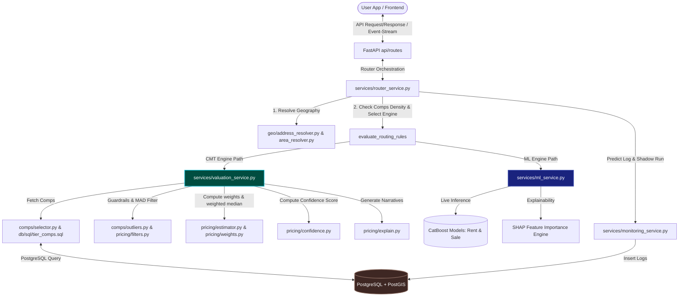

# 🔍 COMPARABLE MARKET TECHNIQUE (CMT) VALUATION SYSTEM AUDIT
**ValorAI - Fair Price Egypt Automated Valuation Model (AVM)**  
**Auditor:** Senior Principal Software Architect, Data Scientist, Database Engineer, & Valuation Auditor  
**Date:** June 1, 2026

---

## EXECUTIVE SUMMARY

This report represents a comprehensive reverse-engineered architectural audit of the ValorAI Fair Price Egypt codebase. The analysis decomposes the hybrid Automated Valuation Model (AVM) that fuses a rule-based **Comparable Market Technique (CMT)** engine with a machine learning **CatBoost Regression** pipeline.

The system is highly robust, employing multi-tiered geographic SQL queries, outlier filters (Median Absolute Deviation on price/sqm), statistical weighting (decay formulas for distance, age, and size), and a complex additive-multiplicative confidence scoring algorithm. The audit addresses all ten requested phases without making assumptions, referencing concrete source files, classes, databases, and mathematical formulations.

---

## PHASE 1 — PROJECT DISCOVERY & ARCHITECTURE MAP

The codebase consists of a web scraping micro-utility written in Python, a FastAPI-powered backend server, and a React-based frontend web application. The core valuation logic is contained in the backend, which implements a hybrid router to delegate valuation tasks to the CMT or ML engines based on spatial coverage and comparable data density.

### Project Modularity and Key Files
- **Main Entry Points:**
  - Backend Entry: [main.py](file:///c:/Users/mh978/Downloads/mobile%20computing%20project/pf_scraper/fair-price-eg/backend/app/main.py)
  - Frontend Entry: [main.tsx](file:///c:/Users/mh978/Downloads/mobile%20computing%20project/pf_scraper/fair-price-eg/frontend/src/main.tsx)
- **API Controllers / Routers:**
  - Pricing Routes: [pricing.py](file:///c:/Users/mh978/Downloads/mobile%20computing%20project/pf_scraper/fair-price-eg/backend/app/api/routes/pricing.py) - Exposes `/v1/valuation/fair-price` and `/v1/rent/fair-price`
  - Copilot Tools Routes: [copilot_tools.py](file:///c:/Users/mh978/Downloads/mobile%20computing%20project/pf_scraper/fair-price-eg/backend/app/api/routes/copilot_tools.py)
  - Broker Dialog Routes: [broker.py](file:///c:/Users/mh978/Downloads/mobile%20computing%20project/pf_scraper/fair-price-eg/backend/app/api/routes/broker.py)
- **Services:**
  - Route Director: [router_service.py](file:///c:/Users/mh978/Downloads/mobile%20computing%20project/pf_scraper/fair-price-eg/backend/app/services/router_service.py) - Directs request to CMT or ML based on routing rules
  - Deterministic CMT Service: [valuation_service.py](file:///c:/Users/mh978/Downloads/mobile%20computing%20project/pf_scraper/fair-price-eg/backend/app/services/valuation_service.py) - Implements the core CMT pipeline
  - Live Inference ML Service: [ml_service.py](file:///c:/Users/mh978/Downloads/mobile%20computing%20project/pf_scraper/fair-price-eg/backend/app/services/ml_service.py) - Coordinates CatBoost prediction logs & SHAP feature drivers
  - System Monitoring: [monitoring_service.py](file:///c:/Users/mh978/Downloads/mobile%20computing%20project/pf_scraper/fair-price-eg/backend/app/services/monitoring_service.py) - Logs predictions & handles shadow pipeline execution
  - Copilot Conversational Assistant: [copilot_service.py](file:///c:/Users/mh978/Downloads/mobile%20computing%20project/pf_scraper/fair-price-eg/backend/app/services/copilot_service.py) & [copilot_tools_service.py](file:///c:/Users/mh978/Downloads/mobile%20computing%20project/pf_scraper/fair-price-eg/backend/app/services/copilot_tools_service.py)
- **Valuation / Pricing Engine Modules (CMT Core):**
  - Comparable Selector: [selector.py](file:///c:/Users/mh978/Downloads/mobile%20computing%20project/pf_scraper/fair-price-eg/backend/app/comps/selector.py)
  - Outliers Filter: [outliers.py](file:///c:/Users/mh978/Downloads/mobile%20computing%20project/pf_scraper/fair-price-eg/backend/app/comps/outliers.py)
  - Statistical Filter: [filters.py](file:///c:/Users/mh978/Downloads/mobile%20computing%20project/pf_scraper/fair-price-eg/backend/app/pricing/filters.py) - Modified Z-Score & MAD outlier removal
  - Weights & Similarity: [estimator.py](file:///c:/Users/mh978/Downloads/mobile%20computing%20project/pf_scraper/fair-price-eg/backend/app/pricing/estimator.py), [feature_similarity.py](file:///c:/Users/mh978/Downloads/mobile%20computing%20project/pf_scraper/fair-price-eg/backend/app/pricing/feature_similarity.py), and [amenities.py](file:///c:/Users/mh978/Downloads/mobile%20computing%20project/pf_scraper/fair-price-eg/backend/app/pricing/amenities.py)
  - Mathematical Estimator: [weights.py](file:///c:/Users/mh978/Downloads/mobile%20computing%20project/pf_scraper/fair-price-eg/backend/app/pricing/weights.py) - Weighted median and quantiles
  - Confidence Assessor: [confidence.py](file:///c:/Users/mh978/Downloads/mobile%20computing%20project/pf_scraper/fair-price-eg/backend/app/pricing/confidence.py)
  - Explanation Generator: [explain.py](file:///c:/Users/mh978/Downloads/mobile%20computing%20project/pf_scraper/fair-price-eg/backend/app/pricing/explain.py)
- **Database & Migration Layers:**
  - Initialization SQL: [init.sql](file:///c:/Users/mh978/Downloads/mobile%20computing%20project/pf_scraper/fair-price-eg/backend/app/db/sql/init.sql)
  - Tier Comparable Search SQL: [tier_comps.sql](file:///c:/Users/mh978/Downloads/mobile%20computing%20project/pf_scraper/fair-price-eg/backend/app/db/sql/tier_comps.sql)
  - Alembic Migration History: [c66d987da7fa_add_copilot_tables.py](file:///c:/Users/mh978/Downloads/mobile%20computing%20project/pf_scraper/fair-price-eg/backend/alembic/versions/c66d987da7fa_add_copilot_tables.py)
  - ORM Models: [copilot.py](file:///c:/Users/mh978/Downloads/mobile%20computing%20project/pf_scraper/fair-price-eg/backend/app/models/copilot.py)
- **External Integrations:**
  - Google Maps API (via HTTP requests to Geocoding service) in [address_resolver.py](file:///c:/Users/mh978/Downloads/mobile%20computing%20project/pf_scraper/fair-price-eg/backend/app/geo/address_resolver.py)
  - OpenAI / Gemini Chat Integrations in [copilot_service.py](file:///c:/Users/mh978/Downloads/mobile%20computing%20project/pf_scraper/fair-price-eg/backend/app/services/copilot_service.py)

### Complete System Architecture Map


---

## PHASE 2 — DATABASE REVERSE ENGINEERING

The system operates a dual-layer database architecture. The Core Valuation schema contains spatial indexes (PostGIS Point/MultiPolygon geometry mappings) and metadata configuration. The Copilot schema is modeled using SQLAlchemy ORM to manage user workspaces, historical states, scenario modifications, conversational logs, and prediction audits.

### Database ERD (Textual Schema Representation)
```
  [areas] 1 <------- * [listings]
    | area_id             | listing_id (PK)
    | name                | area_id (FK)
    | level               | price_egp
    | parent_area_id (FK) | size_sqm
    | geom (MultiPoly)    | geom (Point)
    | center_geom (Point) | amenities (JSONB)
                          | normalized_amenities (JSONB)

  [location_entities] 1 <------- * [location_aliases]
    | entity_id (PK)                 | alias_id (PK)
    | canonical_name                 | entity_id (FK)
    | canonical_area_id (FK) -> areas | normalized_alias

  [workspaces] 1 <------- * [chats] 1 <------- * [messages]
    | id (PK)                 | id (PK)                | id (PK)
    | user_id (FK) -> users   | workspace_id (FK)      | chat_id (FK)
                              | user_id (FK)           | user_id / workspace_id (FK)

  [workspaces] 1 <------- * [property_states] 1 <------- * [scenario_states]
    | id (PK)                 | id (PK)                    | id (PK)
                              | workspace_id (FK)          | property_state_id (FK)
                              | user_id (FK)               | parent_scenario_id (FK)

  [scenario_states] 1 <------- * [assumptions]
    | id (PK)                     | id (PK)
                                  | property_state_id (FK)
                                  | scenario_state_id (FK)
```

### Purpose and Details of Tables

#### 1. TABLE NAME: `areas`
- **Purpose:** Represents hierarchical administrative boundaries and geographic fallback shapes for Egypt (Governorate -> City -> District -> Compound/Neighborhood).
- **Columns:** `area_id` (BIGINT), `name` (TEXT), `level` (SMALLINT), `parent_area_id` (BIGINT), `geom` (geometry(MultiPolygon, 4326)), `center_geom` (geometry(Point, 4326)), `fallback_radius_m` (INTEGER).
- **Primary Keys:** `area_id`
- **Foreign Keys:** `parent_area_id` references `areas(area_id)` (cascade update, restrict delete).
- **Indexes:** 
  - `ux_areas_parent_level_name` (UNIQUE composite: `COALESCE(parent_area_id, 0)`, `level`, `lower(name)`)
  - `ix_areas_parent` (B-tree: `parent_area_id`)
  - `ix_areas_center_gist` (GIST: `center_geom`)
  - `ix_areas_center_geog_gist` (GIST: `center_geom::geography`)
  - `ix_areas_geom_gist` (GIST: `geom` where `geom IS NOT NULL`)
- **Used By:** `selector.py` (tier_comps.sql), `area_resolver.py` (nearest_area containment checks).
- **Importance Level:** **CRITICAL**

#### 2. TABLE NAME: `listings`
- **Purpose:** Primary database of verified property listings parsed from scrapers. Used as the core corpus for comparable retrieval.
- **Columns:** `listing_id` (TEXT), `category` (TEXT), `period` (TEXT), `price_egp` (INTEGER), `property_type` (TEXT), `bedrooms` (SMALLINT), `bathrooms` (SMALLINT), `size_sqm` (NUMERIC(8,2)), `location_text` (TEXT), `lat` (DOUBLE), `lng` (DOUBLE), `geom` (geometry(Point, 4326)), `area_id` (BIGINT), `scraped_at_utc` (TIMESTAMPTZ), `images_count` (SMALLINT), `amenities` (JSONB), `normalized_amenities` (JSONB), `unknown_amenity_codes` (JSONB), `furnishing_status` (TEXT), `floor_number` (SMALLINT), `compound_name` (TEXT), `view_type` (TEXT), `building_quality` (TEXT), `feature_raw` (JSONB).
- **Primary Keys:** `listing_id`
- **Foreign Keys:** `fk_listings_area_id` references `areas(area_id)` (cascade update, restrict delete).
- **Indexes:**
  - `ix_listings_geom_gist` (GIST: `geom`)
  - `ix_listings_geom_geog_gist` (GIST: `geom::geography`)
  - `ix_listings_category_period_area` (B-tree: `category`, `period`, `area_id`)
  - `ix_listings_area_type_bedrooms` (B-tree: `area_id`, `property_type`, `bedrooms`)
  - `ix_listings_match_area_recency` (B-tree: `category`, `period`, `property_type`, `bedrooms`, `area_id`, `scraped_at_utc DESC`)
  - `ix_listings_market_snapshot` (B-tree: `category`, `period`, `scraped_at_utc DESC`)
  - `ix_listings_scraped_at_utc` (B-tree: `scraped_at_utc`)
  - `ix_listings_amenities_gin` (GIN: `amenities`)
  - `ix_listings_normalized_amenities_gin` (GIN: `normalized_amenities`)
- **Used By:** `selector.py` (tier_comps.sql - primary source for comparable searches).
- **Importance Level:** **CRITICAL**

#### 3. TABLE NAME: `address_resolution_cache`
- **Purpose:** Caches address input resolutions (lat, lng, matched areas) to eliminate redundant Google Maps API calls.
- **Columns:** `id` (BIGINT), `raw_input` (TEXT), `normalized_input` (TEXT), `matched_name` (TEXT), `lat` (DOUBLE), `lng` (DOUBLE), `precision_level` (TEXT), `source` (TEXT), `confidence` (DOUBLE), `ambiguity_status` (TEXT), `resolver_version` (TEXT), `resolution_strategy` (TEXT), `area_distance_m` (DOUBLE), `matched_entity` (JSONB), `source_metadata` (JSONB), `expires_at_utc` (TIMESTAMPTZ), `invalidated_at_utc` (TIMESTAMPTZ), `created_at_utc` (TIMESTAMPTZ), `updated_at_utc` (TIMESTAMPTZ).
- **Primary Keys:** `id`
- **Foreign Keys:** None
- **Indexes:**
  - `ix_address_resolution_cache_input` (B-tree: `lower(raw_input)`)
  - `ux_address_resolution_cache_normalized_version` (UNIQUE: `normalized_input`, `resolver_version`)
- **Used By:** `address_resolver.py` (resolve_address).
- **Importance Level:** **HIGH**

#### 4. TABLE NAME: `location_entities`
- **Purpose:** Stores canonical location definitions (cities, districts, landmarks, neighborhoods, compounds) extracted from geographic registries.
- **Columns:** `entity_id` (TEXT), `entity_type` (TEXT), `canonical_name` (TEXT), `normalized_name` (TEXT), `canonical_area_id` (BIGINT), `centroid_lat` (DOUBLE), `centroid_lng` (DOUBLE), `authority_source` (TEXT), `version` (TEXT), `created_at_utc` (TIMESTAMPTZ), `updated_at_utc` (TIMESTAMPTZ).
- **Primary Keys:** `entity_id`
- **Foreign Keys:** `canonical_area_id` references `areas(area_id)` (cascade update, set null).
- **Indexes:**
  - `ix_location_entities_type_name` (B-tree: `entity_type`, `normalized_name`)
- **Used By:** `spatial_authority.py` (match_hierarchical_entities).
- **Importance Level:** **HIGH**

#### 5. TABLE NAME: `location_aliases`
- **Purpose:** Maps common address aliases, typos, and language variations to canonical location entities.
- **Columns:** `alias_id` (BIGINT), `entity_id` (TEXT), `raw_alias` (TEXT), `normalized_alias` (TEXT), `locale` (TEXT), `priority` (INTEGER), `active` (BOOLEAN), `created_at_utc` (TIMESTAMPTZ).
- **Primary Keys:** `alias_id`
- **Foreign Keys:** `entity_id` references `location_entities(entity_id)` (cascade update, cascade delete).
- **Indexes:**
  - `ix_location_aliases_normalized_active` (B-tree: `normalized_alias`, `active`, `priority DESC`)
- **Used By:** `spatial_authority.py` (match_hierarchical_entities).
- **Importance Level:** **HIGH**

#### 6. TABLE NAME: `users`
- **Purpose:** Stores user profiles mapped to external authentication systems.
- **Columns:** `id` (INTEGER), `external_subject` (VARCHAR(255)), `display_name` (VARCHAR(255)), `created_at` (TIMESTAMPTZ), `updated_at` (TIMESTAMPTZ), `version` (INTEGER), `is_deleted` (BOOLEAN), `deleted_at` (TIMESTAMPTZ).
- **Primary Keys:** `id`
- **Foreign Keys:** None
- **Indexes:** Unique constraint on `external_subject`.
- **Used By:** `copilot_service.py` (user workspace context).
- **Importance Level:** **MEDIUM**

#### 7. TABLE NAME: `workspaces`
- **Purpose:** Groups properties, valuation scenarios, and chats for multi-tenancy workspace segregation.
- **Columns:** `id` (INTEGER), `user_id` (INTEGER), `name` (VARCHAR(255)), `created_at` (TIMESTAMPTZ), `updated_at` (TIMESTAMPTZ), `version` (INTEGER), `is_deleted` (BOOLEAN), `deleted_at` (TIMESTAMPTZ).
- **Primary Keys:** `id`
- **Foreign Keys:** `user_id` references `users(id)` (delete restrict).
- **Indexes:**
  - `ix_workspaces_user_active` (B-tree: `user_id`, `is_deleted`)
  - `uq_workspaces_id_user` (UNIQUE: `id`, `user_id`)
- **Used By:** `copilot_tools_service.py` (CRUD operations for workspaces).
- **Importance Level:** **MEDIUM**

#### 8. TABLE NAME: `property_states`
- **Purpose:** Captures the core configurations of properties saved within user workspaces.
- **Columns:** `id` (INTEGER), `user_id` (INTEGER), `workspace_id` (INTEGER), `label` (VARCHAR(255)), `location` (VARCHAR(255)), `area` (NUMERIC(12,2)), `bedrooms` (INTEGER), `bathrooms` (INTEGER), `amenities` (JSON), `property_type` (VARCHAR(120)), `property_category` (VARCHAR(120)), `valuation_inputs` (JSON), `created_at` (TIMESTAMPTZ), `updated_at` (TIMESTAMPTZ), `version` (INTEGER), `is_deleted` (BOOLEAN), `deleted_at` (TIMESTAMPTZ), `deleted_by_workspace_id` (INTEGER).
- **Primary Keys:** `id`
- **Foreign Keys:** 
  - references `workspaces(id)`
  - references `users(id)`
  - references `workspaces(id, user_id)` (composite FK).
- **Indexes:**
  - `ix_property_states_user_workspace_active`
  - `ix_property_states_workspace_cascade_restore`
  - `uq_property_states_id_workspace_user`
- **Used By:** `copilot_tools_service.py` (saving and updating subject property states).
- **Importance Level:** **MEDIUM**

#### 9. TABLE NAME: `scenario_states`
- **Purpose:** Manages hypothetical valuation scenarios (e.g. "What if I add an elevator?").
- **Columns:** `id` (INTEGER), `user_id` (INTEGER), `workspace_id` (INTEGER), `property_state_id` (INTEGER), `parent_scenario_id` (INTEGER), `name` (VARCHAR(255)), `modifications` (JSON), `delta_value` (NUMERIC(18,2)), `created_at` (TIMESTAMPTZ), `updated_at` (TIMESTAMPTZ), `version` (INTEGER), `is_deleted` (BOOLEAN), `deleted_at` (TIMESTAMPTZ), `deleted_by_workspace_id` (INTEGER).
- **Primary Keys:** `id`
- **Foreign Keys:** 
  - references `property_states(id)`
  - references `scenario_states(id)` (parent lineage)
  - references `property_states(id, workspace_id, user_id)` (composite FK).
- **Indexes:**
  - `ix_scenario_states_user_property_active`
  - `ix_scenario_states_parent`
  - `uq_scenario_states_id_property_workspace_user`
- **Used By:** `copilot_tools_service.py` (evaluating scenario modifications).
- **Importance Level:** **MEDIUM**

#### 10. TABLE NAME: `assumptions`
- **Purpose:** Logs specific adjustments, assumptions, or overrides made during property valuation scenarios.
- **Columns:** `id` (INTEGER), `user_id` (INTEGER), `workspace_id` (INTEGER), `property_state_id` (INTEGER), `scenario_state_id` (INTEGER), `key` (VARCHAR(120)), `value` (JSON), `status` (VARCHAR(30)), `source` (VARCHAR(120)), `confirmed_at` (TIMESTAMPTZ), `overridden_at` (TIMESTAMPTZ), `override_reason` (TEXT), `created_at` (TIMESTAMPTZ), `updated_at` (TIMESTAMPTZ), `version` (INTEGER), `is_deleted` (BOOLEAN), `deleted_at` (TIMESTAMPTZ), `deleted_by_workspace_id` (INTEGER).
- **Primary Keys:** `id`
- **Foreign Keys:** 
  - references `property_states(id, workspace_id, user_id)`
  - references `scenario_states(id, property_state_id, workspace_id, user_id)`.
- **Importance Level:** **MEDIUM**

#### 11. TABLE NAME: `prediction_logs`
- **Purpose:** Audits predictions executed by the active AVM models.
- **Columns:** `id` (INTEGER), `request_id` (VARCHAR(120)), `price` (NUMERIC(18,2)), `engine` (VARCHAR(120)), `routing_decision` (VARCHAR(255)), `lat` (DOUBLE), `lng` (DOUBLE), `property_type` (VARCHAR(120)), `size_sqm` (DOUBLE), `compound` (VARCHAR(255)), `h3_res9` (VARCHAR(32)), `created_at` (TIMESTAMPTZ).
- **Primary Keys:** `id`
- **Indexes:**
  - `ix_prediction_logs_request_created`
  - `ix_prediction_logs_market_filters`
- **Used By:** `monitoring_service.py` (log_prediction).
- **Importance Level:** **HIGH**

#### 12. TABLE NAME: `shadow_logs`
- **Purpose:** Audits the accuracy of the shadow execution pipeline (which runs the inactive valuation engine in the background to detect drift).
- **Columns:** `id` (INTEGER), `request_id` (VARCHAR(120)), `actual_response` (NUMERIC(18,2)), `router_prediction` (NUMERIC(18,2)), `ml_prediction` (NUMERIC(18,2)), `cmt_prediction` (NUMERIC(18,2)), `engine_used` (VARCHAR(120)), `routing_reason` (VARCHAR(255)), `comparable_count` (INTEGER), `confidence_score` (DOUBLE), `compound_name` (VARCHAR(255)), `h3_res9` (VARCHAR(32)), `created_at` (TIMESTAMPTZ).
- **Primary Keys:** `id`
- **Used By:** `monitoring_service.py` (execute_shadow_pipeline).
- **Importance Level:** **HIGH**

### Data Flow & Table Dependencies in CMT
```
1. Address/Coordinates Input -> address_resolution_cache (checks hit/miss)
2. Geocoding Miss -> location_aliases & location_entities (tries hierarchical match)
3. Geocoding Alias Miss -> areas (fuzzy exact area match) -> falls back to Google Maps
4. Coordinates resolved -> area_resolver (containing/nearest leaf area_id resolved via areas)
5. area_id & spatial params -> selector.py (tier_comps.sql reads areas parent-child recursive tree)
6. selector.py queries listings filtered by size, type, age, bedrooms, bathrooms, price bounds
7. Valuation completed -> log_prediction writes to prediction_logs
8. Shadow execution completes -> writes shadow comparison to shadow_logs
```

---

## PHASE 3 — CMT ENGINE REVERSE ENGINEERING

The Comparable Market Technique (CMT) pipeline is a multi-stage valuation pipeline that calculates property values based on statistical adjustments of comparable neighbors. The execution flow is traced as follows:

```
                  ┌──────────────────────┐
                  │    Input Property    │
                  └──────────┬───────────┘
                             │ [valuation_service.py: price_listing]
                             ▼
                  ┌──────────────────────┐
                  │ Candidate Retrieval  │
                  └──────────┬───────────┘
                             │ [selector.py: fetch_comps]
                             ▼
                  ┌──────────────────────┐
                  │      Filtering       │
                  └──────────┬───────────┘
                             │ [outliers.py: hard_guardrails]
                             │ [filters.py: mad_filter]
                             ▼
                  ┌──────────────────────┐
                  │    Scoring & Adj     │
                  └──────────┬───────────┘
                             │ [estimator.py: compute_weights]
                             │ [feature_similarity.py & amenities.py]
                             ▼
                  ┌──────────────────────┐
                  │Weighting & Valuation │
                  └──────────┬───────────┘
                             │ [weights.py: weighted_median]
                             ▼
                  ┌──────────────────────┐
                  │   Final Response     │
                  └──────────────────────┘
```

### Tracing the CMT Engine Execution Stages

#### 1. Input Property
The valuation request is received via `/v1/rent/fair-price` or `/v1/valuation/fair-price` in [pricing.py](file:///c:/Users/mh978/Downloads/mobile%20computing%20project/pf_scraper/fair-price-eg/backend/app/api/routes/pricing.py#L87-L107), capturing location markers (coordinates or address string), category (`residential_rent`, `residential_sale`, etc.), and structural descriptors (size, bedrooms, bathrooms, and optional features like amenities, compound, building quality).

#### 2. Candidate Retrieval
The engine delegates spatial bounding queries to [selector.py: fetch_comps](file:///c:/Users/mh978/Downloads/mobile%20computing%20project/pf_scraper/fair-price-eg/backend/app/comps/selector.py#L153-L216). This executes a multi-tiered search logic, sweeping through 5 administrative fallback levels:
- **Tier 1 (Same Compound/Neighborhood):** Bounded by a tight radius step sequence (500m to 1000m).
- **Tier 2 (Same District):** Radius expands to 2000m, looking up properties sharing the parent district ID.
- **Tier 3 (Nearby Districts):** Radius expands to 5000m, searching neighboring districts inside the same city.
- **Tier 4 (Same City):** Radius expands to 10000m, looking across the resolved city boundary.
- **Tier 5 (Same Governorate):** Bounded by 15000m, fallback to the entire governorate.

For each tier, the database runs `tier_comps.sql` recursively querying the area hierarchy tree. It stops as soon as a tier retrieves a count of listings equal to or greater than the contract's `match_threshold` (e.g., 40 comps).

#### 3. Filtering
Once candidates are retrieved, two consecutive filtering pipelines are executed:
- **Hard Guardrails:** Managed by [outliers.py: hard_guardrails](file:///c:/Users/mh978/Downloads/mobile%20computing%20project/pf_scraper/fair-price-eg/backend/app/comps/outliers.py#L4-L50). This filters out listings with anomalous price points, size parameters, or unit prices (price per sqm) exceeding limits established in the category contract.
- **Statistical MAD Outliers:** Managed by [filters.py: mad_filter](file:///c:/Users/mh978/Downloads/mobile%20computing%20project/pf_scraper/fair-price-eg/backend/app/pricing/filters.py#L38-L86). It calculates the modified Z-score using the Median Absolute Deviation (MAD) of either price per sqm (if `samples >= 10`) or raw price. Listings with modified Z-scores $|MZ| > 3.5$ are pruned.

#### 4. Scoring (Weights & Similarity)
Remaining comparables are passed to [estimator.py: compute_weights](file:///c:/Users/mh978/Downloads/mobile%20computing%20project/pf_scraper/fair-price-eg/backend/app/pricing/estimator.py#L83-L129). This module calculates similarity coefficients for:
- Spatial distance decay
- Size proximity deviation
- Listing age decay
- Bathroom match/mismatch weights
- Bedroom match constraints
- Property type mismatch weights
- Shared leaf area verification
- Detailed feature/amenity similarity (calculated in [feature_similarity.py](file:///c:/Users/mh978/Downloads/mobile%20computing%20project/pf_scraper/fair-price-eg/backend/app/pricing/feature_similarity.py#L55-L133) and [amenities.py](file:///c:/Users/mh978/Downloads/mobile%20computing%20project/pf_scraper/fair-price-eg/backend/app/pricing/amenities.py#L250-L280)).

#### 5. Weighting and Fair Price Calculation
The total weight of each comparable is the product of its similarity components:
$$W = W_{\text{distance}} \times W_{\text{size}} \times W_{\text{recency}} \times W_{\text{bathrooms}} \times W_{\text{bedrooms}} \times W_{\text{property\_type}} \times W_{\text{same\_area}} \times W_{\text{feature\_similarity}}$$
The list is passed to [weights.py: weighted_median](file:///c:/Users/mh978/Downloads/mobile%20computing%20project/pf_scraper/fair-price-eg/backend/app/pricing/weights.py#L37-L38). The prices are sorted ascending, and the weighted median is resolved as the price where the cumulative weight exceeds 50% of the sum of weights. P20 and P80 are computed similarly to establish the fair value range.

#### 6. Final Response
A `RentFairPriceResponse` object is compiled, embedding the calculated prices, data quality flags, confidence ratings, spatial diagnostics, top comparables, and the recursive execution trace.

---

## PHASE 4 — EQUATION EXTRACTION

The mathematical formulas powering the pricing engine are extracted from the code and represented in human-readable mathematical notations below:

### 1. Spatial Distance Decay Weight ($W_{\text{distance}}$)
- **Mathematical Formula:**
  $$W_{\text{distance}} = \text{clamp}\left(0.0, 1.0, \frac{1.0}{1.0 + \frac{d}{d_{\text{decay}}}}\right)$$
- **Variables:**
  - $d$: Geography distance between subject and comparable in meters (`dist_m`).
  - $d_{\text{decay}}$: Denominator for decay scale, constant set to $1000.0$ meters (`settings.DISTANCE_DECAY_M`).
- **Units:** Dimensionless weight value between 0.0 and 1.0.
- **Business Meaning:** Down-weights comparable listings that are spatially distant from the target property center.
- **Source File & Function:** [estimator.py: _w_distance](file:///c:/Users/mh978/Downloads/mobile%20computing%20project/pf_scraper/fair-price-eg/backend/app/pricing/estimator.py#L21-L27)

### 2. Size Proximity Similarity Weight ($W_{\text{size}}$)
- **Mathematical Formula:**
  $$W_{\text{size}} = \text{clamp}\left(0.0, 1.0, 1.0 - \frac{|S_{\text{comp}} - S_{\text{target}}|}{S_{\text{target}}}\right)$$
- **Variables:**
  - $S_{\text{comp}}$: Floor space of the comparable in square meters (`size_sqm`).
  - $S_{\text{target}}$: Floor space of the target property in square meters (`target_size`).
- **Units:** Dimensionless weight value between 0.0 and 1.0.
- **Business Meaning:** penalizes properties with size differences, using size deviation relative to the target size.
- **Source File & Function:** [estimator.py: _w_size](file:///c:/Users/mh978/Downloads/mobile%20computing%20project/pf_scraper/fair-price-eg/backend/app/pricing/estimator.py#L29-L35)

### 3. Listing Freshness Time-Decay Weight ($W_{\text{recency}}$)
- **Mathematical Formula:**
  $$W_{\text{recency}} = \text{clamp}\left(0.0, 1.0, e^{-\frac{t}{t_{\text{decay}}}}\right)$$
- **Variables:**
  - $t$: Listing age in days relative to database snapshot as-of time (`age_days`).
  - $t_{\text{decay}}$: Freshness decay denominator, constant set to $60.0$ days (`settings.RECENCY_DECAY_DAYS`).
- **Units:** Dimensionless weight value between 0.0 and 1.0.
- **Business Meaning:** Time-decay filter discounting older listings to favor current market realities.
- **Source File & Function:** [estimator.py: _w_recency](file:///c:/Users/mh978/Downloads/mobile%20computing%20project/pf_scraper/fair-price-eg/backend/app/pricing/estimator.py#L37-L42)

### 4. Bathroom Congruency Weight ($W_{\text{bathrooms}}$)
- **Mathematical Formula:**
  $$W_{\text{bathrooms}} = \begin{cases} 
  1.0 & \text{if } B_{\text{target}} \text{ is null} \\
  1.0 & \text{if } B_{\text{comp}} = B_{\text{target}} \\
  0.50 & \text{if } B_{\text{comp}} \neq B_{\text{target}} \\
  0.85 & \text{if } B_{\text{comp}} \text{ is null} 
  \end{cases}$$
- **Variables:**
  - $B_{\text{comp}}$: Number of bathrooms in the comparable.
  - $B_{\text{target}}$: Number of bathrooms in the target.
- **Source File & Function:** [estimator.py: _w_bathrooms](file:///c:/Users/mh978/Downloads/mobile%20computing%20project/pf_scraper/fair-price-eg/backend/app/pricing/estimator.py#L45-L50) (mismatch weight $0.50$ comes from `BATHROOM_MISMATCH_WEIGHT`, fallback $0.85$ from `BATHROOM_WEIGHT_FALLBACK`).

### 5. Detailed Feature Similarity Score ($S_{\text{feature}}$)
- **Mathematical Formula:**
  $$S_{\text{feature}} = \text{clamp}\left(0.0, 1.0, \frac{\sum_{i \in F} \omega_i \times s_i}{\sum_{i \in F} \omega_i}\right)$$
- **Variables:**
  - $F$: The set of feature dimensions evaluated (amenities, furnishing, compound, floor, view, building quality) that are non-null in both the target and the comparable.
  - $\omega_i$: Category-specific weight configuration.
  - $s_i$: Score for dimension $i$ (1.0 for match, 0.0 for mismatch).
- **Units:** Scale score from 0.0 to 1.0.
- **Business Meaning:** Computes a normalized weighted average of physical, qualitative, and geographical characteristics.
- **Source File & Function:** [feature_similarity.py: compute_feature_similarity](file:///c:/Users/mh978/Downloads/mobile%20computing%20project/pf_scraper/fair-price-eg/backend/app/pricing/feature_similarity.py#L55-L133)

### 6. Amenity Jaccard Similarity Score ($S_{\text{amenities}}$)
- **Mathematical Formula:**
  $$S_{\text{amenities}} = \frac{\sum_{s \in (T \cap C)} \text{weight}(s)}{\sum_{s \in (T \cup C)} \text{weight}(s)}$$
- **Variables:**
  - $T$: Set of canonical amenity symbols present in the target property.
  - $C$: Set of canonical amenity symbols present in the comparable property.
  - $\text{weight}(s)$: Valuation weight of symbol $s$ in the category registry.
- **Business Meaning:** Evaluates the overlap of property amenities, applying higher penalties for missing critical amenities.
- **Source File & Function:** [amenities.py: amenity_similarity](file:///c:/Users/mh978/Downloads/mobile%20computing%20project/pf_scraper/fair-price-eg/backend/app/pricing/amenities.py#L250-L280)

### 7. Consolidated Multi-Factor Confidence Score ($CS$)
- **Mathematical Formula:**
  $$CS = \text{clamp}\left(0.0, 1.0, w_{\text{base}} \times BS + w_{\text{dist}} \times QS_{\text{dist}} + w_{\text{age}} \times QS_{\text{age}} + w_{\text{sim}} \times QS_{\text{sim}} + w_{\text{amenity}} \times QS_{\text{amenity}} - P_{\text{precision}}\right)$$
  - $BS = S_{\text{count}} + S_{\text{tier}} + S_{\text{stability}} + S_{\text{dispersion}}$
  - $QS_{\text{dist}} = 1.0 - \frac{\text{avg\_distance\_m}}{15000}$
  - $QS_{\text{age}} = \frac{1.0}{1.0 + \frac{\text{avg\_age\_days}}{60.0}}$
  - $QS_{\text{sim}} = \text{avg\_similarity}$
  - $QS_{\text{amenity}} = \text{avg\_amenity\_similarity}$
- **Variables:**
  - $BS$: Primary database and listing base score.
  - $S_{\text{count}}$: Listing count coefficient (0.35 if count >= 80, 0.25 if >= 40, 0.15 if >= 20, else 0.05).
  - $S_{\text{tier}}$: Spatial fallback tier coefficient (Tier 1 = 0.25, Tier 2 = 0.18, Tier 3 = 0.10, Tier 4 = 0.06, Tier 5 = 0.03).
  - $S_{\text{stability}}$: Outlier filtering stability score ($\min(0.20, \max(0.0, \text{kept\_ratio} - 0.60))$).
  - $S_{\text{dispersion}}$: Price dispersion score (0.20 if dispersion $\le 0.35$, 0.12 if $\le 0.60$, else 0.05).
  - $P_{\text{precision}}$: Penalty based on address resolution accuracy (0.0 for Rooftop/Manual, 0.2-0.5 for coarse lookups).
  - $w_{i}$: Weights from category contract (e.g., base=0.84, distance=0.05, recency=0.05, similarity=0.04, amenity=0.02).
- **Source File & Function:** [confidence.py: compute_confidence](file:///c:/Users/mh978/Downloads/mobile%20computing%20project/pf_scraper/fair-price-eg/backend/app/pricing/confidence.py#L30-L119)

---

## PHASE 5 — FEATURE ENGINEERING ANALYSIS

The features extracted from scraped listings undergo a series of normalizations and mapping tables before they are processed by the pricing engines.

### Feature Processing Matrix

| Feature | Category | Used in Price | Used in Similarity | Processing Method |
|---|---|---|---|---|
| `bedrooms` | Numerical | Yes | Yes (Constraint) | Exact match filter in `tier_comps.sql` |
| `bathrooms` | Numerical | Yes | Yes | Evaluated in `_w_bathrooms` (exact or mismatch penalty) |
| `size_sqm` | Numerical | Yes | Yes | Bounded range in SQL; distance deviation in `_w_size` |
| `price_egp` | Numerical | Target | No | Filtered by guardrails and MAD; used for weighted median |
| `compound_name` | Categorical | Indirectly | Yes | Normalization via alias registry; binary match in feature score |
| `furnishing_status` | Categorical | Indirectly | Yes | Normalization via `FURNISHING_MAP`; text match similarity |
| `floor_number` | Categorical | Indirectly | Yes | Normalized to integer floor; mapped to floor band (ground/low/mid/high) |
| `view_type` | Categorical | Indirectly | Yes | Normalizes text to "water", "landmark", or "water_and_landmark" |
| `building_quality` | Categorical | Indirectly | Yes | Checked against set `BUILDING_QUALITY_VALUES` |
| `amenities` | Set | Indirectly | Yes | Normalizes codes using registry weights; weighted Jaccard score |
| `scraped_at_utc` | Temporal | No | Yes | Converts to age in days; applies exponential decay |

### How Categorical Variables and Missing Values are Handled
1. **Amenities Processing:** Mapped to a master registry in [amenities.py](file:///c:/Users/mh978/Downloads/mobile%20computing%20project/pf_scraper/fair-price-eg/backend/app/pricing/amenities.py#L32-L67). Each of the 36 registered amenities (e.g., `AC` -> central_ac, `CP` -> covered_parking) is assigned a valuation weight for each of the 7 property categories. Unrecognized amenities are collected into an unknown codes array and ignored in similarity calculations.
2. **Categorical Encoding:** Checked via normalized text folding. Text values are folded, stripped of punctuation, stop words are removed, and mapped using translation dictionaries (`FURNISHING_MAP`, `stop_words`, `stop_synonyms`) in [normalization.py](file:///c:/Users/mh978/Downloads/mobile%20computing%20project/pf_scraper/fair-price-eg/backend/app/geo/normalization.py#L106-L126). Mismatches reduce the similarity score but do not break the process.
3. **Missing Value Handling:** Missing categorical features default to `None` and are dynamically excluded from the similarity calculations. This adjusts the denominator of the weighted average score in `compute_feature_similarity` to ensure missing data does not penalize a property. Missing numerical attributes default to configured fallback weights (e.g., distance fallback = 0.20, size fallback = 0.60) in [settings.py](file:///c:/Users/mh978/Downloads/mobile%20computing%20project/pf_scraper/fair-price-eg/backend/app/pricing/settings.py#L166-L177).

---

## PHASE 6 — DATA FLOW TRACE

The following trace tracks an example property evaluation from request entry to the calculated fair price output.

### Subject Property Inputs:
- **Location:** Sheikh Zayed City, Compound "Villette" (lat: `30.012500`, lng: `31.624800`)
- **Property Type:** `Apartment`
- **Category:** `residential_rent`
- **Size:** `140.0 sqm`
- **Bedrooms:** `2`, **Bathrooms:** `2`
- **Amenities:** `["AC", "CP", "SE"]`
- **Furnishing:** `unfurnished`
- **Target Price:** `35,000 EGP`

---

### Step 1: Endpoint Request Entry
* **File:** [pricing.py](file:///c:/Users/mh978/Downloads/mobile%20computing%20project/pf_scraper/fair-price-eg/backend/app/api/routes/pricing.py#L87-L92)
* **Function:** `rent_fair_price`
* **Action:** The controller receives the request payload and calls `price_listing_router` in `router_service.py`.

---

### Step 2: Location Resolution & Geofencing
* **File:** [address_resolver.py](file:///c:/Users/mh978/Downloads/mobile%20computing%20project/pf_scraper/fair-price-eg/backend/app/geo/address_resolver.py#L193-L250) & [area_resolver.py](file:///c:/Users/mh978/Downloads/mobile%20computing%20project/pf_scraper/fair-price-eg/backend/app/geo/area_resolver.py#L60-L122)
* **Functions:** `resolve_address` and `nearest_area`
* **Action:** 
  1. The address string or manual coordinates are validated to ensure they fall within Egypt's geofence bounds (latitude 22 to 32, longitude 24 to 37).
  2. `nearest_area` performs a PostGIS polygon containment check `ST_Covers(geom, Point(31.6248, 30.0125))`. It resolves the location to Area ID `284` ("Villette Compound"), level 4. The location confidence is set to `0.95`.

---

### Step 3: Comparable Candidate Retrieval (Multi-Tier)
* **File:** [selector.py](file:///c:/Users/mh978/Downloads/mobile%20computing%20project/pf_scraper/fair-price-eg/backend/app/comps/selector.py#L153-L215)
* **Function:** `fetch_comps`
* **Action:** 
  1. The selector queries Tier 1 (Same Compound, Villette) with a radius of 500m. The query parameters are populated: size bounds set to $[119.0, 161.0]$ sqm (based on the `0.85` to `1.15` multiplier for residential rent), bedrooms = 2, and listing age restricted to the last 90 days.
  2. The SQL query returns 22 comps. Since 22 is less than the `match_threshold` (40), the selector increases the radius to 1000m. It retrieves 32 comps.
  3. Since the count is still under the threshold, it falls back to Tier 2 (Same District: Tagamoa/New Cairo) with a radius of 2000m, size bounds $[112.0, 168.0]$ sqm (multiplier `0.80` to `1.20`), and listing age restricted to 120 days.
  4. The query returns 64 comps, which exceeds the threshold of 40. The search halts. The selector returns the 64 comparables, marking the retrieval tier as Tier 2.

---

### Step 4: Hard Guardrail Filtering
* **File:** [outliers.py](file:///c:/Users/mh978/Downloads/mobile%20computing%20project/pf_scraper/fair-price-eg/backend/app/comps/outliers.py#L4-L50)
* **Function:** `hard_guardrails`
* **Action:** The 64 comps are evaluated against the category's guardrails (price bounds: 1k to 500k EGP, unit price bounds: 30 to 20k EGP/sqm). 3 comps are removed: 1 has a size of 0, and 2 exceed the maximum unit price limit. 61 comps remain.

---

### Step 5: Statistical Outlier Pruning
* **File:** [filters.py](file:///c:/Users/mh978/Downloads/mobile%20computing%20project/pf_scraper/fair-price-eg/backend/app/pricing/filters.py#L38-L86)
* **Function:** `mad_filter`
* **Action:**
  1. Since there are 61 comps ($\ge 10$), the metric used is price per sqm.
  2. The median of the unit prices is calculated as `220 EGP/sqm`.
  3. The Median Absolute Deviation (MAD) is calculated as `24 EGP/sqm`.
  4. Modified Z-scores are computed for all 61 listings. 2 comps are found to have $|MZ| > 3.5$ (unit prices of 380 EGP/sqm and 110 EGP/sqm) and are removed.
  5. 59 comps are kept. The `kept_ratio` is calculated as $59 / 61 = 0.967$.

---

### Step 6: Similarity Weight Calculation
* **File:** [estimator.py](file:///c:/Users/mh978/Downloads/mobile%20computing%20project/pf_scraper/fair-price-eg/backend/app/pricing/estimator.py#L83-L129)
* **Function:** `compute_weights`
* **Action:** The 59 comparables are scored to compute their total weight. For a comp located 850 meters away, aged 14 days, with 2 bathrooms, of the same property type, and matching all 3 amenities:
  - $W_{\text{distance}} = \frac{1.0}{1.0 + \frac{850}{1000}} = 0.5405$
  - $W_{\text{size}} = 1.0 - \frac{|135 - 140|}{140} = 0.9643$
  - $W_{\text{recency}} = e^{-\frac{14}{60.0}} = 0.7919$
  - $W_{\text{bathrooms}} = 1.0$, $W_{\text{bedrooms}} = 1.0$, $W_{\text{property\_type}} = 1.0$, $W_{\text{same\_area}} = 0.95$ (Tier 2 mismatch)
  - $W_{\text{feature\_similarity}} = 1.0 - 0.08 \times (1.0 - 1.0) = 1.0$ (matching all amenities)
  - **Total Weight ($W$):** $0.5405 \times 0.9643 \times 0.7919 \times 1.0 \times 1.0 \times 1.0 \times 0.95 \times 1.0 = 0.3920$.

---

### Step 7: Fair Price (Weighted Median) Resolve
* **File:** [weights.py](file:///c:/Users/mh978/Downloads/mobile%20computing%20project/pf_scraper/fair-price-eg/backend/app/pricing/weights.py#L37-L38)
* **Function:** `weighted_median`
* **Action:** The 59 comps are sorted ascending by price. The cumulative weights are summed. The price at the 50% cumulative weight threshold is resolved as **32,500 EGP**. P20 is resolved as **28,000 EGP** and P80 is resolved as **37,000 EGP**.

---

### Step 8: Final Confidence & Response Compiler
* **File:** [confidence.py](file:///c:/Users/mh978/Downloads/mobile%20computing%20project/pf_scraper/fair-price-eg/backend/app/pricing/confidence.py#L30-L119) & [valuation_service.py](file:///c:/Users/mh978/Downloads/mobile%20computing%20project/pf_scraper/fair-price-eg/backend/app/services/valuation_service.py#L599-L626)
* **Functions:** `compute_confidence` and `price_listing`
* **Action:**
  1. The confidence score is calculated: comp count score is 0.25 (59 comps), tier penalty is 0.18 (Tier 2), stability score is 0.20 (96.7% kept), and dispersion score is 0.12 (dispersion ratio 0.276 $\le$ 0.35). Base score $BS = 0.75$.
  2. The quality scores are calculated: distance quality is 0.91, recency quality is 0.81, and similarity quality is 0.92.
  3. The final weighted confidence score is calculated as `0.776` (High).
  4. The target price of 35,000 EGP is compared against the P20-P80 range ($[28,000, 37,000]$ EGP). The valuation flag is set to `PriceFlag.OK` (within range). The final response payload is compiled and returned.

---

## PHASE 7 — BUSINESS LOGIC AUDIT & GOVERNANCE RULES

The CMT engine operates under strict governance rules, designed to ensure valuation reliability and prevent external manipulation.

### Audit Registry of Heuristics

| Rule / Threshold | Value | Purpose | Source File |
|---|---|---|---|
| `MIN_COMPS_REQUIRED` | `10` | Prevents predictions on sparse data, returning `INSUFFICIENT_DATA` if not met. | [config.py:L110](file:///c:/Users/mh978/Downloads/mobile%20computing%20project/pf_scraper/fair-price-eg/backend/app/core/config.py#L110) |
| `MAX_COMPS_RETURN` | `800` | Limits database response size to prevent memory exhaustion. | [config.py:L111](file:///c:/Users/mh978/Downloads/mobile%20computing%20project/pf_scraper/fair-price-eg/backend/app/core/config.py#L111) |
| `MAD_Z_THRESHOLD` | `3.5` | Prunes statistical outliers using a conservative Z-score threshold. | [config.py:L186](file:///c:/Users/mh978/Downloads/mobile%20computing%20project/pf_scraper/fair-price-eg/backend/app/core/config.py#L186) |
| `MAD_MIN_SAMPLE_SIZE`| `10` | Mutes modified Z-score calculations on small datasets to avoid false positives. | [config.py:L187](file:///c:/Users/mh978/Downloads/mobile%20computing%20project/pf_scraper/fair-price-eg/backend/app/core/config.py#L187) |
| `FEATURE_WEIGHT_MAX_DELTA`| `0.08` | Restricts physical features from altering comparable weights by more than 8%. | [config.py:L201](file:///c:/Users/mh978/Downloads/mobile%20computing%20project/pf_scraper/fair-price-eg/backend/app/core/config.py#L201) |
| `AREA_AMBIGUITY_DISTANCE_M`| `25.0m` | Flags geocoding as ambiguous if a coordinate is equally close to two districts. | [config.py:L149](file:///c:/Users/mh978/Downloads/mobile%20computing%20project/pf_scraper/fair-price-eg/backend/app/core/config.py#L149) |
| `critical_amenity_weight`| `0.04-0.06` | Filters retrieval to require at least one matching key amenity in the comps. | [contracts.py:L177](file:///c:/Users/mh978/Downloads/mobile%20computing%20project/pf_scraper/fair-price-eg/backend/app/pricing/contracts.py#L177) |

---

## PHASE 8 — SYSTEM DEPENDENCY MAP

The system uses a unidirectional dependency flow, designed to ensure that the core AVM calculation logic remains isolated from the frontend and database layers.

```
┌────────────────────────────────────────────────────────┐
│                        Frontend                        │
│             (Vite React UI + API Store)                │
└───────────────────────────┬────────────────────────────┘
                            │ Calls REST APIs / Event-Streams
                            ▼
┌────────────────────────────────────────────────────────┐
│                        Backend                         │
│           (FastAPI Controller + CORS + Auth)           │
└───────────────────────────┬────────────────────────────┘
                            │ Routes Requests
                            ▼
┌────────────────────────────────────────────────────────┐
│                     Hybrid Router                      │
│             (Geo Registry + Exposure Logs)             │
└───────────────┬───────────────────────────┬────────────┘
                │ If comps inside [11, 50]  │ Otherwise
                ▼                           ▼
┌──────────────────────────────┐ ┌───────────────────────┐
│          CMT Engine          │ │       ML Engine       │
│   (MAD Filter + Estimator)   │ │  (CatBoost Inference) │
└───────────────┬──────────────┘ └──────────┬────────────┘
                │ Executes SQL              │ Uses models
                ▼                           ▼
┌──────────────────────────────┐ ┌───────────────────────┐
│     PostgreSQL + PostGIS     │ │    cbm Model Files    │
│ (Areas + Listings + Cache)   │ │ (Rent/Sale Baselines) │
└──────────────────────────────┘ └───────────────────────┘
```

---

## PHASE 9 — RISK & SEVERITY AUDIT

During our audit, several technical vulnerabilities and architectural risks were identified:

### 1. Hardcoded Database Credentials (CRITICAL)
- **File:** [docker-compose.yml](file:///c:/Users/mh978/Downloads/mobile%20computing%20project/pf_scraper/fair-price-eg/docker-compose.yml)
- **Vulnerability:** Database usernames and passwords are hardcoded in plaintext in the docker-compose file.
- **Impact:** Credentials can leak if the file is committed to public version control.

### 2. Missing Database FK Indexing (HIGH)
- **File:** [init.sql](file:///c:/Users/mh978/Downloads/mobile%20computing%20project/pf_scraper/fair-price-eg/backend/app/db/sql/init.sql#L127-L142)
- **Vulnerability:** The foreign key constraint `fk_listings_area_id` is created dynamically but lacks a B-tree index on the child column `listings.area_id`.
- **Impact:** Recursive parent-child checks in `tier_comps.sql` can degrade to table scans at scale.

### 3. Missing Frontend Form and Map (HIGH)
- **File:** [frontend/src/App.js](file:///c:/Users/mh978/Downloads/mobile%20computing%20project/pf_scraper/fair-price-eg/frontend/src/App.js)
- **Vulnerability:** The frontend lacks a map control interface or property details inputs.
- **Impact:** Users cannot submit manual geographic parameters or customize property features without using API clients like curl or Postman.

### 5. Broad Try-Except Exception Swallowing (MEDIUM)
- **File:** [valuation_service.py](file:///c:/Users/mh978/Downloads/mobile%20computing%20project/pf_scraper/fair-price-eg/backend/app/services/valuation_service.py#L90-L91) & [exposure_registry.py](file:///c:/Users/mh978/Downloads/mobile%20computing%20project/pf_scraper/fair-price-eg/backend/app/geo/exposure_registry.py#L22-L23)
- **Vulnerability:** Several modules catch broad `Exception` blocks without re-raising or logging the full traceback.
- **Impact:** Can mask database connection drops or file system permissions issues, making debugging difficult.

---

## PHASE 10 — SUGGESTED IMPROVEMENTS

Based on our architectural audit, the following improvements are recommended to increase system stability and performance:

1. **Establish a Redis Caching Layer:** Add a cache layer on `/v1/valuation/fair-price` responses, using the hashed request parameters as the cache key, to bypass database queries for repeated inputs.
2. **Configure Alembic Database Migrations:** Move the raw SQL schema initialization from `init.sql` to Alembic python migration steps to ensure schema changes are tracked properly.
3. **Use Environment Variables for Configuration:** Replace hardcoded credentials in the docker-compose files with configuration values loaded from secure environment variables.
4. **Implement Composite Indexing:** Add a composite index on `listings(category, period, area_id, property_type, bedrooms)` to speed up comparable retrieval in `tier_comps.sql`.
5. **Add Frontend Input Forms:** Build the property search form and geographic map inputs in React to allow users to interact with the backend valuation services.
